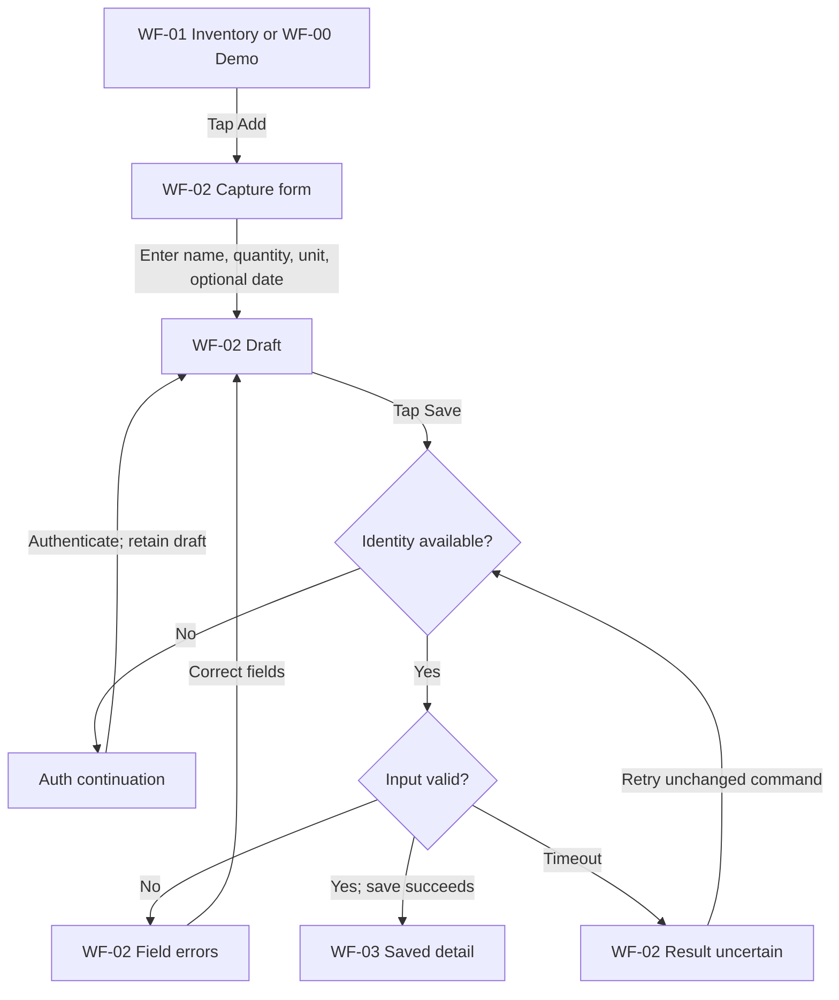
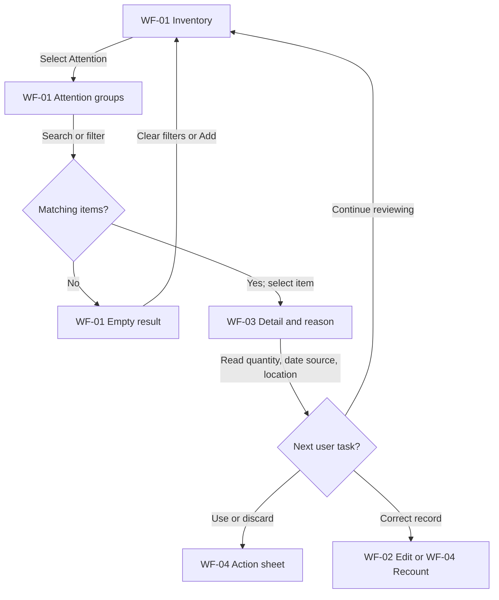
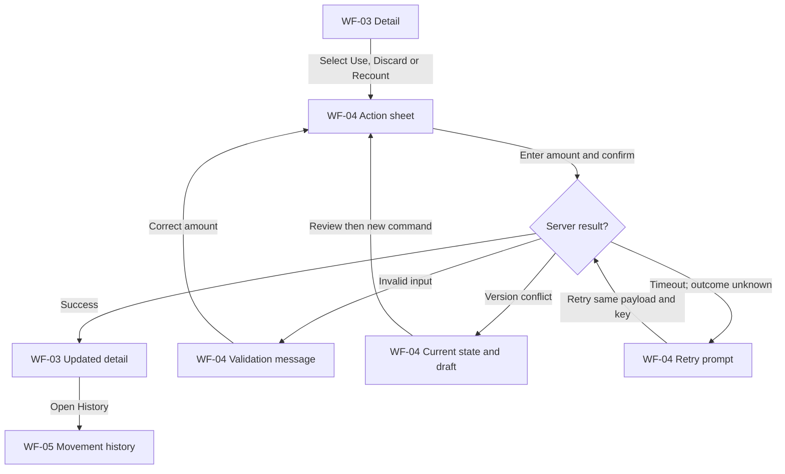

# [S3] User flows, scenarios và use cases

## S3.1 Screen inventory
| Screen | Nội dung | Actions/next |
|---|---|---|
| WF-00 Intro/demo + auth continuation | Preview không dùng dữ liệu riêng | Try add →WF-02; view own stock/auth→WF-01 |
| WF-01 Inventory/attention | Attention groups, reasons, search/location, all/depleted tab | Add→WF-02; item→WF-03; settings→WF-06 |
| WF-02 Add/edit | Name, amount/unit khi create, location, optional date/certainty/label/source/opened note | Save→WF-03; validation giữ form; cancel→trước đó |
| WF-03 Detail | Current amount/version/date context/attention reason | Use/discard/recount→WF-04; edit→WF-02; history→WF-05; remove record→dialog |
| WF-04 Action sheet | Action, amount/actual amount, reason khi recount; current quantity | Confirm→WF-03 updated; cancel→WF-03 |
| WF-05 History/trash | Read-only movement history; trash là view riêng cùng layout list | Restore→WF-03; back→WF-01 |
| WF-06 Settings | Timezone, attention lead | Save→WF-01 recompute; cancel→WF-01 |

## S3.2 Goal và các flow hoàn thành task
| Flow | Persona chính | Goal | Straight task path | Outcome kiểm chứng được |
|---|---|---|---|---|
| UF-01 Capture | P1/P3 | Ghi đồ mới trước khi quên | WF-01→Add→WF-02→Save→WF-03 | Entry đã lưu, initial movement, xuất hiện trong inventory |
| UF-02 Capture unknown date | P1/P2 | Không bỏ việc theo dõi chỉ vì thiếu nhãn | WF-02→chọn Không biết hạn→Save→WF-03 | Date null, unknown visible; không fake date |
| UF-03 Notice hidden food | P1 | Nhớ được món cần xem | WF-01→attention group→item→WF-03 | User thấy amount/location/reason; chưa claim food used |
| UF-04 Decide after plan change | P2 | Chọn món đáng chú ý từ đồ đang có | WF-01→location/filter→item→WF-03→action→WF-04→confirm | User tự chọn action; hệ thống ghi kết quả |
| UF-05 Partial consumption | All | Số lượng app đúng sau dùng | WF-03→Use→WF-04 amount→confirm→WF-03 | Remaining giảm đúng; history tạo 1 lần |
| UF-06 Partial/full discard | All | Phản ánh đồ thật đã bỏ | WF-03→Discard→WF-04 amount→confirm→WF-03 | Remaining giảm; discard history; zero→depleted |
| UF-07 Reconcile physical stock | P3/P2 | Sửa số lượng lệch nhanh | WF-03→Recount→WF-04 actual+reason→confirm→WF-03→history | Amount đúng và correction traceable |
| UF-08 Correct metadata | P3/P2 | Sửa ngày/vị trí nguồn nhập sai | WF-03→Edit→WF-02→Save→WF-03 | Version tăng; attention recomputed |
| UF-09 Remove/restore record | P3 | Dọn bản ghi nhầm, lấy lại khi xóa sai | WF-03→Remove record→confirm→WF-05 trash→Restore→WF-03 | Quantity/history không đổi bởi delete/restore |
| UF-10 Change attention settings | All | Điều chỉnh cách chú ý | WF-01→Settings→WF-06→Save→WF-01 | Lead/timezone cập nhật; list có as_of_date mới |
| UF-11 Session expiry continuation | All | Không mất draft khi auth hết hạn | WF-02/04→Save→401→auth→resume cùng draft→Save | Không trừ quantity trước khi server success |

Mỗi flow có thể có nhiều task path; không ép mỗi persona chỉ dùng một core function. UF-04 chưa có recipe generation, meal plan persistence hoặc freeze-expiry automation. Nó đạt goal “chọn từ đồ cần chú ý”, chưa chứng minh đã giải quyết toàn bộ decision gap.

## S3.3 Scenario catalogue
Các tình huống dưới đây là [C/D] test scenarios, không phải trích lời user research.

| Scenario | Context/trigger | Persona goal | Flow/UC | Expected result |
|---|---|---|---|---|
| SC-01 | An cất 2 hộp sữa cùng hạn, muốn ghi trước khi quên | Capture nhanh | UF-01/UC-01 | Một entry quantity 2 piece |
| SC-02 | An có rau không thấy nhãn ngày | Vẫn theo dõi được | UF-02/UC-01 | unknown date; không bị chặn |
| SC-03 | Trước bữa tối An mở app, món ở sau tủ đã gần ngày theo dõi | Nhớ món đang có | UF-03/UC-02/03 | Soon group + reason/date/location |
| SC-04 | Huyền đổi món ăn tối sau thay đổi lịch gia đình | Chọn đồ cần chú ý | UF-04/UC-03/04 | Filter/detail trước action; không chỉ bật alert |
| SC-05 | Thiên An dùng 250g từ entry 1000g | Cập nhật chính xác | UF-05/UC-04 | Remaining 750g; movement -250g |
| SC-06 | Bỏ 200g trong phần 750g còn | Ghi waste riêng với use | UF-06/UC-05 | Remaining 550g; discard 200g |
| SC-07 | Kiểm tra thực tế chỉ còn 500g | Reconcile mismatch | UF-07/UC-07 | Adjustment -50g có reason |
| SC-08 | Dùng mobile, server commit nhưng response mất | Không ghi lặp | UF-05/UC-04 | Retry cùng key/payload replay, chỉ 1 movement |
| SC-09 | Hai tab cùng version, mỗi tab yêu cầu dùng 400g từ 500g | Không negative/lost update | UC-04 | Một success; tab còn lại 409, refetch |
| SC-10 | Lỡ xóa bản ghi còn 500g | Khôi phục record | UF-09/UC-09/10 | Restore vẫn 500g, không giả đã dùng/bỏ |
| SC-11 | Sửa date khi tab khác đã cập nhật entry | Không overwrite silently | UF-08/UC-06 | 409, hiển thị dữ liệu hiện tại/draft khác biệt |
| SC-12 | Entry vừa dùng hết vừa bỏ phần cuối | History đúng nghĩa | UC-04/05/08 | lifecycle depleted; totals theo movement, không “all consumed” |
| SC-13 | User A thử ID của user B | Bảo vệ kho riêng | Tất cả owned UCs | 404; không data leak |
| SC-14 | Date=ngày hiện tại user, máy client ở timezone khác | Nhắc đúng calendar date | UC-03/11 | due_today theo timezone owner |
| SC-15 | Món quá date nhưng best_before hoặc date estimate | Không biến attention thành safety claim | UC-03 | past_date + label/source explanation |

## S3.4 Use case specification conventions
Actor chính: authenticated inventory owner (trừ UC-00/support demo). P1/P2/P3 là behavior models, **không phải actor roles hay quyền**. System boundary = Expiry application gồm UI/API/domain/persistence. Auth provider là supporting external actor chưa chốt. Clock được inject làm dependency cho test, không phải người dùng.

Precondition chung: principal valid, object thuộc owner và chưa deleted với operations thường. Auth/security gate là precondition/support flow; không tạo “business UC validate form” chỉ vì middleware tồn tại.

### UC-00 — Continue with identity

- Requirement: FR-10; UI: WF-00/02/04.
- Trigger: Chạm private inventory hoặc lưu draft.
- Preconditions: Có draft/demo chưa persist.
- Main success flow: Giữ draft; xác thực qua auth adapter; resume task.
- Alternate/error flow: Cancel auth → giữ draft, không save; auth fail → retry.
- Success guarantee: Identity principal hợp lệ, chưa tự tạo food.
- Failure guarantee: không partial mutation; draft giữ ở UI; rollback trước commit. Với read không phát sinh write.
- Rules: Không password/token trong food DTO.

### UC-01 — Record food entry

- Requirement: FR-01; UI: WF-02.
- Trigger: User chọn Add rồi Save.
- Preconditions: Draft có name/quantity/unit.
- Main success flow: Validate DTO; resolve owner; create entry+initial movement+request result một transaction; trả entry.
- Alternate/error flow: Date unknown hợp lệ; past date hợp lệ; 422 giữ draft; timeout retry key cũ.
- Success guarantee: Entry và initial movement hoặc không có cả hai.
- Failure guarantee: không partial mutation; draft giữ ở UI; rollback trước commit. Với read không phát sinh write.
- Rules: RULE-01…04/09…11/18/19/21.

### UC-02 — Review own inventory

- Requirement: FR-02; UI: WF-01.
- Trigger: Mở inventory/search/filter.
- Preconditions: Principal valid.
- Main success flow: Validate filters/page; read owner-scoped rows; project DTO; return items+pagination.
- Alternate/error flow: Empty→empty state/Add CTA; network error→retry; foreign scope không được nhận.
- Success guarantee: Không mutate data.
- Failure guarantee: không partial mutation; draft giữ ở UI; rollback trước commit. Với read không phát sinh write.
- Rules: RULE-01/20/24.

### UC-03 — Identify and understand attention

- Requirement: FR-03; UI: WF-01/03.
- Trigger: Mở attention hoặc detail.
- Preconditions: Clock/timezone/lead có giá trị.
- Main success flow: Read active owned entries; derive date state/reason; stable sort; show date/source/location/amount.
- Alternate/error flow: Unknown→nhóm riêng; depleted/deleted excluded; estimated→explain uncertainty.
- Success guarantee: User có thông tin chọn action; chưa mutate food.
- Failure guarantee: không partial mutation; draft giữ ở UI; rollback trước commit. Với read không phát sinh write.
- Rules: RULE-09…14/20.

### UC-04 — Record consumption

- Requirement: FR-04; UI: WF-04.
- Trigger: User confirm Use amount.
- Preconditions: Owned nondeleted entry với quantity>0; key/version.
- Main success flow: Idempotency lookup; lock owned entry; verify version/unit/amount; update quantity+version; insert consume movement; store response; commit.
- Alternate/error flow: Stale version/over amount→409; invalid amount→422; replay→saved response; all used→depleted.
- Success guarantee: Remaining đúng, 1 history event cho 1 command.
- Failure guarantee: không partial mutation; draft giữ ở UI; rollback trước commit. Với read không phát sinh write.
- Rules: RULE-03/05/17…19.

### UC-05 — Record discard

- Requirement: FR-04; UI: WF-04.
- Trigger: User confirm Discard amount.
- Preconditions: Như UC-04.
- Main success flow: Như UC-04 nhưng movement kind=discard; optional reason.
- Alternate/error flow: Partial waste vẫn active; hết lượng depleted; deleted→404.
- Success guarantee: History waste riêng, không soft-delete record.
- Failure guarantee: không partial mutation; draft giữ ở UI; rollback trước commit. Với read không phát sinh write.
- Rules: RULE-05/15/16/18/19.

### UC-06 — Correct entry metadata

- Requirement: FR-05; UI: WF-02.
- Trigger: Save edit name/location/date context.
- Preconditions: Owned nondeleted entry; version/key; patch không quantity/unit.
- Main success flow: Replay check; lock; validate patch + full merged object; update metadata/version; response attention mới.
- Alternate/error flow: Null reset date phải đổi certainty/source đồng bộ; empty patch→422; conflict→409; depleted metadata vẫn được sửa.
- Success guarantee: Quantity/ledger không đổi; attention updated.
- Failure guarantee: không partial mutation; draft giữ ở UI; rollback trước commit. Với read không phát sinh write.
- Rules: RULE-07…14/17…19.

### UC-07 — Reconcile actual quantity

- Requirement: FR-06; UI: WF-04.
- Trigger: Confirm Recount actual_quantity+reason.
- Preconditions: Owned nondeleted entry; version/key; quantity>=0.
- Main success flow: Replay; lock+version; compare actual vs remaining; delta adjustment; update+ledger+result transaction.
- Alternate/error flow: Same amount→200 no-op; actual>0 từ depleted→active; 0→depleted; invalid/missing reason→422.
- Success guarantee: Digital amount đúng reported reality; correction traceable.
- Failure guarantee: không partial mutation; draft giữ ở UI; rollback trước commit. Với read không phát sinh write.
- Rules: RULE-03/06/16…19/23.

### UC-08 — Review entry movement history

- Requirement: FR-07; UI: WF-05.
- Trigger: Chọn History.
- Preconditions: Owned entry kể cả deleted nếu biết ID qua trash.
- Main success flow: Read owner-scoped entry+paginated movements stable by recorded_at,id; show before/after/kind/reason.
- Alternate/error flow: No events không hợp lệ với entry đã create; server invariant alert; foreign ID→404.
- Success guarantee: Read-only, không sửa lịch sử.
- Failure guarantee: không partial mutation; draft giữ ở UI; rollback trước commit. Với read không phát sinh write.
- Rules: RULE-04/23/24.

### UC-09 — Remove erroneous record

- Requirement: FR-08; UI: WF-03/05.
- Trigger: Confirm Remove record.
- Preconditions: Owned entry, version/key.
- Main success flow: Replay; lock+version; set deleted_at/version; store result transaction.
- Alternate/error flow: Đã deleted với command mới→409; retry cùng key replay; cancel không change.
- Success guarantee: Không trong active list; quantity/history giữ nguyên.
- Failure guarantee: không partial mutation; draft giữ ở UI; rollback trước commit. Với read không phát sinh write.
- Rules: RULE-15/17…19.

### UC-10 — Restore removed record

- Requirement: FR-08; UI: WF-05/03.
- Trigger: Chọn Restore trong trash.
- Preconditions: Owned deleted entry, version/key.
- Main success flow: Replay; lock+version; clear deleted_at; version++; compute derived attention; commit result.
- Alternate/error flow: Chưa deleted với command mới→409; depleted restore vẫn depleted.
- Success guarantee: Record hiện lại đúng lifecycle; no stock movement.
- Failure guarantee: không partial mutation; draft giữ ở UI; rollback trước commit. Với read không phát sinh write.
- Rules: RULE-15…19.

### UC-11 — Set attention preferences

- Requirement: FR-09; UI: WF-06.
- Trigger: Save settings.
- Preconditions: Principal valid; user version/key.
- Main success flow: Validate timezone IANA/lead integer; lock user/version; update settings/version+result transaction; refresh derived list.
- Alternate/error flow: Timezone invalid/lead out-of-range→422; conflict→409; clock not controlled by body.
- Success guarantee: Không rewrite food rows; next read dùng setting mới.
- Failure guarantee: không partial mutation; draft giữ ở UI; rollback trước commit. Với read không phát sinh write.
- Rules: RULE-12/13/17…19.

## S3.4a UX flow CF-01 Capture

## S3.4b UX flow CF-02 Review

## S3.4c UX flow CF-03 Resolve

