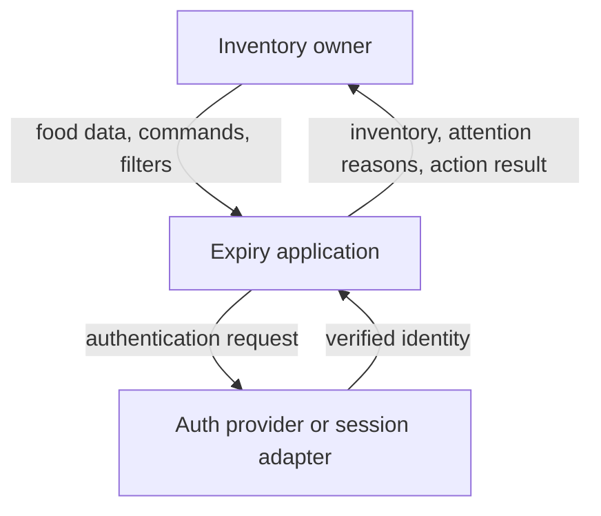
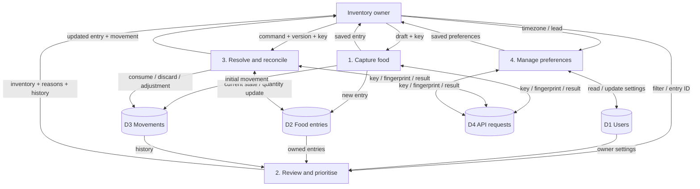
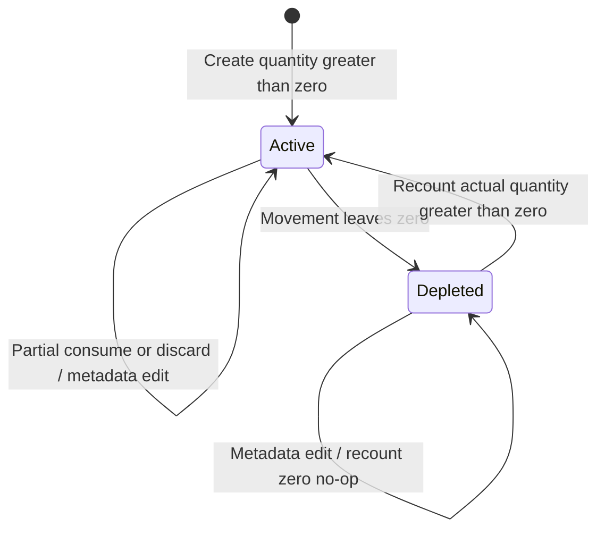
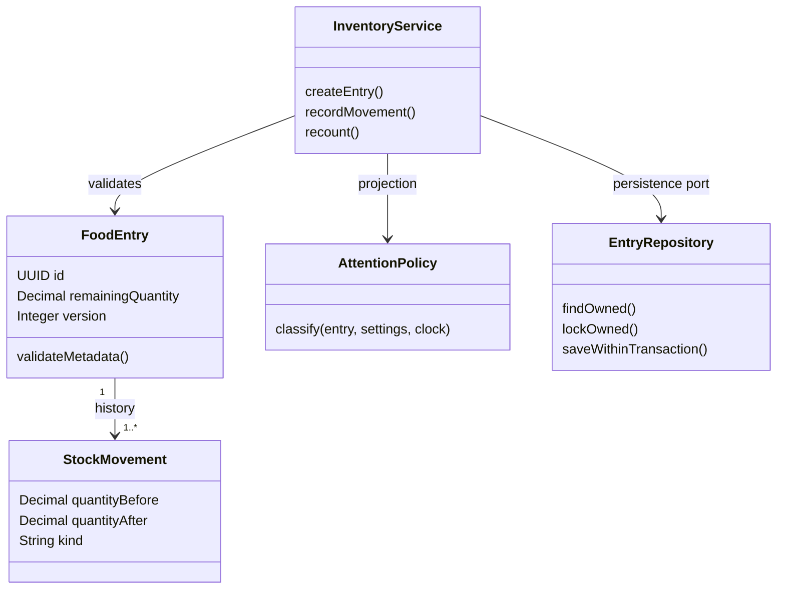

# [S3] Data flow, system map và ownership

## S3.5 INPUT → PROCESS → STATE → SIDE EFFECT → OUTPUT → FEEDBACK
| Stage | Capture | Review/prioritise | Resolve/reconcile |
|---|---|---|---|
| Input | EntryCreate DTO + principal + key | Query + principal + injected clock | Command amount/actual + expected_version + key |
| Process | Schema/business validate + tx | Owner scope + derive attention | Replay/lock/version/business check + tx |
| State | food_entries + initial movement + api_requests | Không ghi status theo ngày | quantity/version + movement + api_requests |
| Side effect | Không scan/push trong MVP | Không lịch gửi hoặc DB update theo clock | FE invalidate list/detail/history sau success |
| Output | EntryResponse, 201 | Items/meta/reason/as_of_date, 200 | Entry+movement, 201; recount no-op 200 |
| Feedback | User sửa draft hoặc edit sau save | User chọn action từ reason/context | Ledger giúp audit/recount; UX feedback cập nhật |

## S3.6 State/lifecycle owners
| State/lifecycle | Owner | Ai mutate | Dependencies |
|---|---|---|---|
| Durable current quantity | Database row thông qua use-case service | Create/RecordMovement/Recount | Transaction + domain rules |
| Movement history | Database immutable qua public API | Services append | Same transaction với current amount |
| Attention state | AttentionPolicy backend | Không persist; compute theo clock/settings | Entry metadata + owner timezone |
| Form/action draft | Form hoặc ActionSheet | User input/form reducer | DTO validation for UX |
| List/detail remote data | Feature query cache (nếu FE dùng cache) | API response + invalidation | Contract, auth identity |
| Search/filter | Page/URL | User/navigation | Serialized query params |
| Identity/session | Auth adapter/provider | Auth flow | Chưa chốt implementation |
| In-flight command/key | Feature mutation coordinator | User start/retry | Giữ key qua retry; command mới key mới |
| Startup wiring | Composition root | Server boot | Inject repo, tx, clock, auth |

Không có component/controller nào “control mọi thứ”. App/root chỉ wiring/navigation. Service sở hữu transaction use case; repo sở hữu query; domain policy sở hữu rule; DB giữ integrity. Cache không là authority nghiệp vụ.

## S3.7 DFD context

DFD mô tả dữ liệu qua process, không phải click path. Context diagram không hiển thị internal stores.

## S3.8 DFD level 1

Logical transaction: P1/P3/P4 writes D4 cùng với durable domain writes. Generic metadata/delete/restore thuộc P3, không có new data store bị thiếu. Auth boundary chung cấp principal trước owned processes, không vẽ password trong D1 flow.

## S3.9 Sequence core capture
```mermaid
sequenceDiagram
 actor U as Owner
 participant UI as Add form
 participant API as HTTP adapter
 participant S as CreateEntry service
 participant DB as Transaction / repositories
 U->>UI: Confirm draft
 UI->>API: POST entry + Idempotency-Key
 API->>API: Authenticate and validate DTO
 API->>S: execute(principal, draft, key)
 S->>DB: Begin; reserve key / check replay
 alt Key already completed, same fingerprint
  DB-->>S: Saved response
 else New command
  S->>S: Validate domain metadata and quantity
  S->>DB: Insert entry + initial movement + response
  S->>DB: Commit
 end
 S-->>API: EntryResponse
 API-->>UI: 201 + Location
 UI-->>U: Saved detail
```

## S3.10 Sequence core read
```mermaid
sequenceDiagram
 actor U as Owner
 participant UI as Inventory page
 participant API as HTTP adapter
 participant S as ReviewInventory service
 participant DB as Repositories
 U->>UI: Open attention / filter
 UI->>API: GET food-entries?view=attention
 API->>S: principal + validated query
 S->>DB: Read owner settings + scoped entries
 DB-->>S: Metadata and quantities
 S->>S: Derive with clock/timezone; sort before pagination
 S-->>API: items + reasons + as_of_date + pagination
 API-->>UI: 200
 UI-->>U: Groups and actionable detail links
```
Query must apply classification/order over the eligible set before pagination, không paginate rồi sort trong FE. Nếu SQL derive để scale, parity-test với pure AttentionPolicy cùng timezone/clock; không có hai rule tự lệch nhau.

## S3.11 Sequence core mutation
```mermaid
sequenceDiagram
 actor U as Owner
 participant UI as Action sheet
 participant API as HTTP adapter
 participant S as RecordMovement service
 participant DB as Transaction / repositories
 U->>UI: Use / discard amount
 UI->>API: POST movement + expected_version + key
 API->>S: principal + command
 S->>DB: Begin; reserve key
 alt Replay with same fingerprint
  DB-->>S: Original response
 else New command
  S->>DB: Lock owned nondeleted entry FOR UPDATE
  DB-->>S: Current amount and version
  S->>S: Check version, unit, amount
  alt Invalid or conflicting
   S->>DB: Rollback
   S-->>API: Domain error
   API-->>UI: 409 / 422
   UI-->>U: Refetch/review draft
  else Valid
   S->>DB: Update quantity/version; insert movement; save result
   S->>DB: Commit
   S-->>API: Updated entry + movement
   API-->>UI: 201
   UI->>UI: Invalidate list/detail/history
   UI-->>U: Updated quantity
  end
 end
```

## S3.12 State UML: quantity và visibility là hai trục

Delete/restore không là consume/discard hoặc state transition tăng stock. Dùng `deleted_at` độc lập với quantity lifecycle. Attention là derived projection riêng.

## S3.13 UML class responsibilities

Đây là responsibility model, không bắt buộc implement mọi entity thành OOP class.

## S3.14 UML notation và files
- `diagrams/*.mmd`: source Mermaid thuần; code fence đúng `mermaid`, không `gpt-mermaid`.
- `diagrams/use_cases.puml`: UML use-case source thật bằng PlantUML. Mermaid không có native use-case diagram; không giả flowchart là UML use case.
- `diagrams/activity_record_movement.puml`: activity với branches success/conflict/replay.
- ERD ở S3.15 trong file data model. UML không thay ERD; UX wireframe không thay data flow.
