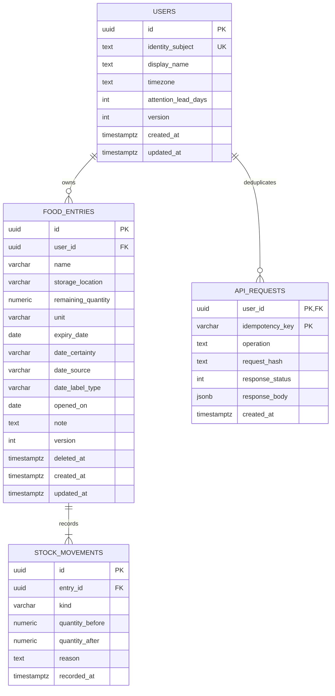

# [S3] Data definition trước ERD và relational mapping

## S3.15 Thứ tự định nghĩa data
1. Thu thập nouns và dữ liệu từ scenario/use case.
2. Định nghĩa identity/grain: một entry nghĩa là gì, khác entry khác ở đâu.
3. Định nghĩa field semantics, owner, source, required/null, unit, precision, allowed values.
4. Phân biệt persisted state, derived projection, transport DTO và UI-only draft.
5. Viết invariants, event/command shape, lifecycle và transaction boundary.
6. Xác định functional dependencies và cardinality; sau đó ERD logical.
7. Chọn DB để map physical types/index/constraints. DDL dưới đây là phương án PostgreSQL, không khóa stack user.

**Data dictionary không chỉ ghi `date: string`.** Phải ghi đây là calendar date, null khi nào, ai nhập, ai dùng, có tự derive không và timezone nào dùng so sánh.

## S3.16 Grain/entity decisions
| Entity | Một row đại diện | Identity | Vì sao cần từ flow |
|---|---|---|---|
| users | Một owner đã xác thực cùng settings | UUID, identity_subject unique | Mọi private UC + UC-11 |
| food_entries | Một nhóm lượng thực phẩm cùng điều kiện theo dõi | UUID; tên/date không unique | UC-01/02/03; không auto merge chỉ vì cùng tên |
| stock_movements | Một thay đổi quantity được commit | UUID | UC-04/05/07/08; create luôn initial event |
| api_requests | Một command write có key trong scope owner | Composite (user_id,idempotency_key) | Retry SC-08, toàn writes |

Không có products/catalog ở MVP: chưa có use case catalog, hai món tên giống không chắc cùng product. Không có household/membership theo DEC-01. Không có notifications/jobs/outbox theo DEC-02. Movement bắt buộc khi quantity thay đổi, không “optional history” gây hai đường ghi mâu thuẫn.

## S3.17 ERD


| Relation | Cardinality | FK | Evidence và invariant |
|---|---|---|---|
| users → food_entries | User 0…N; entry đúng 1 owner | food_entries.user_id NOT NULL | Private ownership; user có thể chưa add |
| food_entries → stock_movements | Entry 1…N sau create commit; movement đúng 1 entry | stock_movements.entry_id NOT NULL | UC-01 initial event và action history |
| users → api_requests | User 0…N; request đúng 1 owner | api_requests.user_id NOT NULL | Commands replay theo owner |

DB FK không enforce parent bắt buộc có child initial movement. Service transaction + invariant tests enforce “entry có ≥1 movement”. Không có N:N trong MVP; không thêm junction table chỉ để minh họa N:N. Nếu sharing được scope-in sau, users↔households mới N:N qua memberships với role và composite owner invariants.

## S3.18 Dictionary — đủ field
| Table.field | API type | SQL type [D] | Null/default | Semantics/validation | Source/owner |
|---|---|---|---|---|---|
| users.id | UUID string | uuid PK | Required | Internal stable owner | Identity bootstrap |
| users.identity_subject | Không trả vào business DTO | text UNIQUE | Required | Provider + subject namespace, không email mutable làm ID | Auth adapter |
| users.display_name | string | text | Required | 1…100 trimmed | Profile |
| users.timezone | string | text | Asia/Ho_Chi_Minh | IANA timezone hợp lệ qua runtime timezone library | UC-11 |
| users.attention_lead_days | integer | integer | 2 | 0…30; config thử nghiệm | UC-11 |
| users.version | integer | integer | 1 | Optimistic version ≥1 | Service |
| users.created_at/updated_at | date-time string | timestamptz | server now | Instant UTC output ISO8601 | Persistence |
| food_entries.id | UUID string | uuid PK | Required | Not product ID | Server |
| food_entries.user_id | Không nhận ở input | uuid FK | Required | From verified principal | Service |
| food_entries.name | string | varchar(200) | Required | Trimmed 1…200; không UNIQUE | User |
| food_entries.storage_location | string | varchar(100) | Required default unspecified | Value free text trimmed 1…100; không table location chưa có CRUD requirement | User |
| food_entries.remaining_quantity | decimal string | numeric(12,3) | Required | 0…999999999.999; piece whole; operational source of truth | Quantity services |
| food_entries.unit | enum string | varchar(10) | Required | piece/g/ml; fixed after create | User/create |
| food_entries.expiry_date | YYYY-MM-DD hoặc null | date | null | Calendar date; no timezone/UTC conversion; past date allowed | User |
| food_entries.date_certainty | enum | varchar(12) | unknown | known/estimated/unknown; known=reported source known, không safe guarantee | User |
| food_entries.date_source | enum | varchar(20) | unknown | printed_label/user_entered/user_estimate/unknown | User |
| food_entries.date_label_type | enum | varchar(15) | unspecified | use_by/best_before/unspecified; độc lập certainty | User label |
| food_entries.opened_on | YYYY-MM-DD/null | date | null | Đã mở khi nào, applies entire entry; không tự derive shelf-life | User |
| food_entries.note | string/null | text | null | Max 1000; plain text | User |
| food_entries.version | integer | integer | 1 | Increment once per real mutation | Service |
| food_entries.deleted_at | date-time/null | timestamptz | null | Record visibility; không spoil/discard | Delete/restore |
| food_entries.created_at/updated_at | date-time | timestamptz | server now | Audit instant | Persistence |
| stock_movements.id | UUID | uuid PK | Required | Stable event identity | Service |
| stock_movements.entry_id | UUID | uuid FK | Required | Entry immutable owner relation | Service |
| stock_movements.kind | enum | varchar(12) | Required | initial/consume/discard/adjustment | Command |
| stock_movements.quantity_before/after | decimal string | numeric(12,3) | Required | Nonnegative; delta derived after-before | Locked entry + command |
| stock_movements.reason | string/null | text | null | Required nonblank for adjustment, max 500 | User correction |
| stock_movements.recorded_at | date-time | timestamptz | server now | Thời điểm app ghi nhận; không tự nhận là time physical use happened | Persistence |
| api_requests.user_id | Internal | uuid FK/PK part | Required | Dedup scope | Principal |
| api_requests.idempotency_key | Header string | varchar(100) PK part | Required | 8…100 allowed chars; new key/new command | FE command coordinator |
| api_requests.operation | Internal string | text | Required | HTTP operation + normalized target, không chỉ method | Service executor |
| api_requests.request_hash | Internal string | text | Required | Canonical command payload fingerprint; validate same key+same input | Service executor |
| api_requests.response_status/body | Internal | int/jsonb | null while reserved, both nonnull completed | Original command result; owner privacy/retention applies | Tx executor |
| api_requests.created_at | Internal instant | timestamptz | server now | Key lifetime; MVP không automatic prune | Persistence |

Lượng dùng decimal string để tránh floating point/truncation giữa DB/JSON/JS. Unit piece cần số nguyên; `"1.500"` là invalid piece, valid g/ml. FE dùng decimal lib hoặc parse integer milliunits, không `parseFloat` rồi cộng/trừ nghiệp vụ.

## S3.19 Data shape ví dụ
```json
{
  "name": "Sữa tươi",
  "quantity": "2.000",
  "unit": "piece",
  "storage_location": "Tủ lạnh",
  "expiry_date": "2026-10-10",
  "date_certainty": "known",
  "date_source": "printed_label",
  "date_label_type": "use_by",
  "opened_on": null,
  "note": null
}
```
Entry response thêm id, remaining_quantity, version, timestamps, lifecycle, attention gồm status/reason_code/as_of_date. DTO không expose identity_subject/api_requests hoặc nhận owner từ client.

## S3.20 Normalization và trade-off
- Mỗi field mô tả entry tại grain đã định; product name snapshot không reference global catalog chưa tồn tại.
- Không lưu attention vì thay đổi khi clock trôi. Không lưu lifecycle vì suy được từ remaining. Không copy username/settings vào entry.
- remaining và ledger cùng diễn tả quantity; đây là deliberate operational denormalization. Đọc nhanh, phải atomic và audit sum(delta)=remaining. Không quảng cáo “strict 3NF giải quyết hết consistency”.
- api_requests.response_body là cache kết quả command cho replay. Không dùng body cache làm latest inventory; sau retry FE refetch để tránh dùng snapshot cũ.
- Không UNIQUE(user_id,name,expiry_date): cùng tên/hạn vẫn có vị trí/opening khác; null date và label không đủ identity.

## S3.21 UC–table CRUD
| UC | users | food_entries | stock_movements | api_requests |
|---|---|---|---|---|
| UC-01 create | R | C | C initial | C/R/U |
| UC-02/03 review | R | R | — | — |
| UC-04/05 | R principal | R/U | C | C/R/U |
| UC-06 edit | R | R/U metadata | — | C/R/U |
| UC-07 recount | R | R/U qty | C nếu delta≠0 | C/R/U |
| UC-08 history | R | R owner check | R | — |
| UC-09/10 | R | R/U deleted/version | — | C/R/U |
| UC-11 settings | R/U | — | — | C/R/U |

C=create, R=read, U=update; không public DELETE history/request table. Hard-delete/account erase chưa nằm MVP nhưng phải có policy trước public production.
