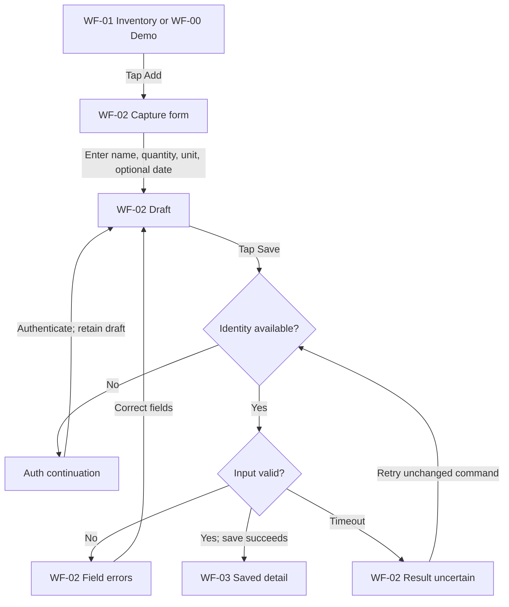
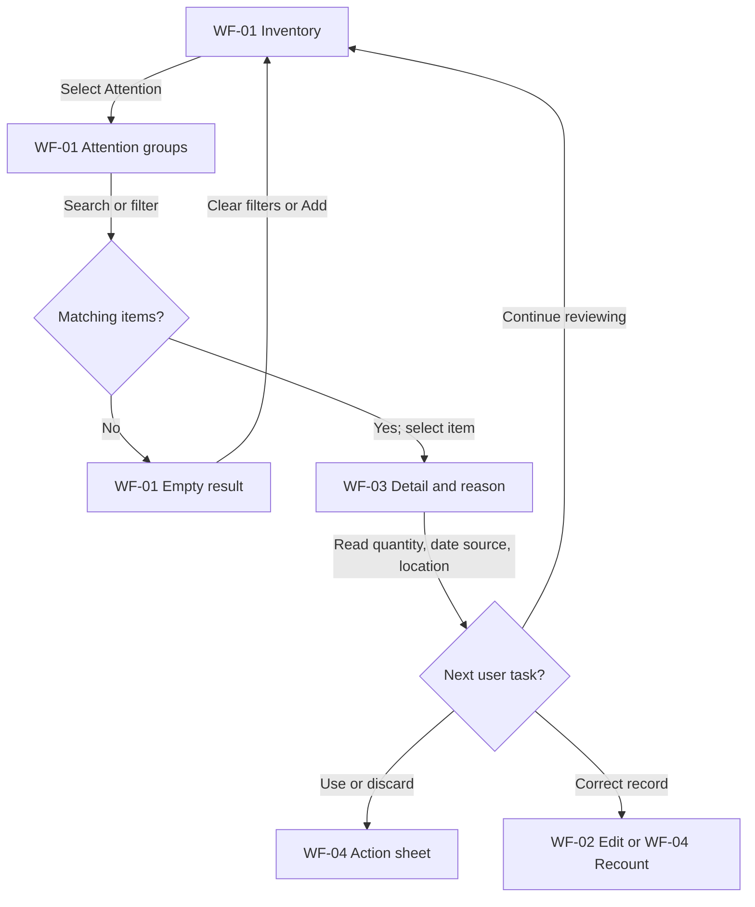
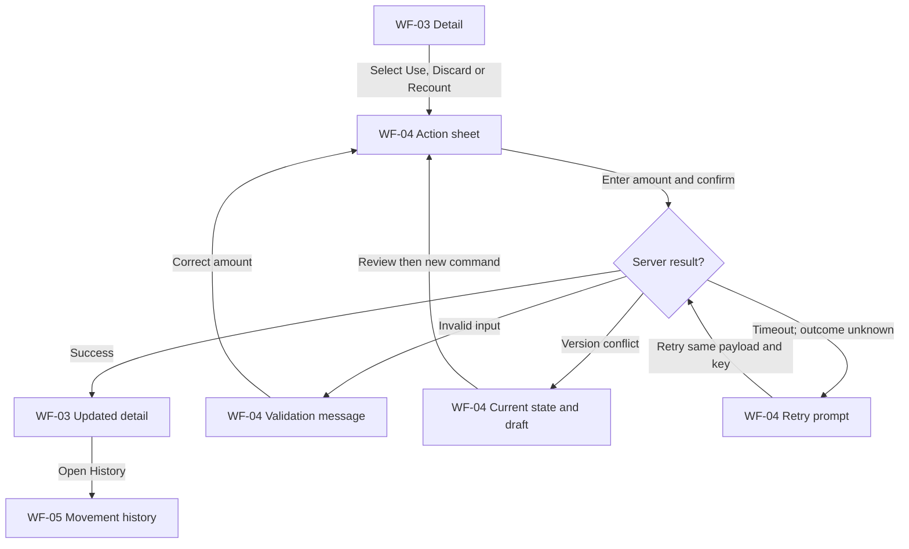
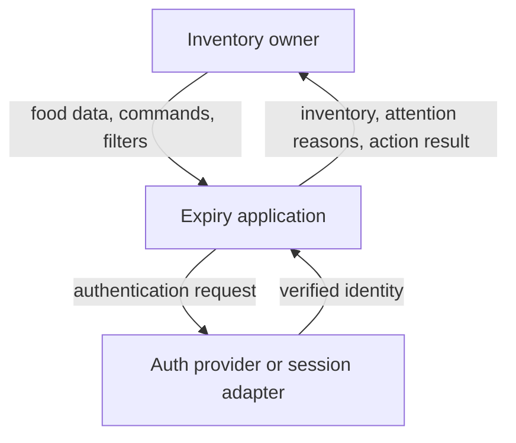
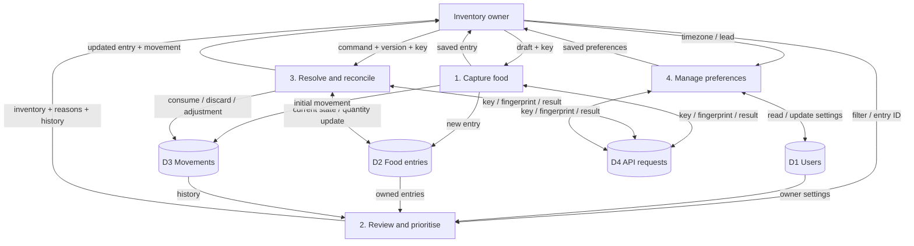
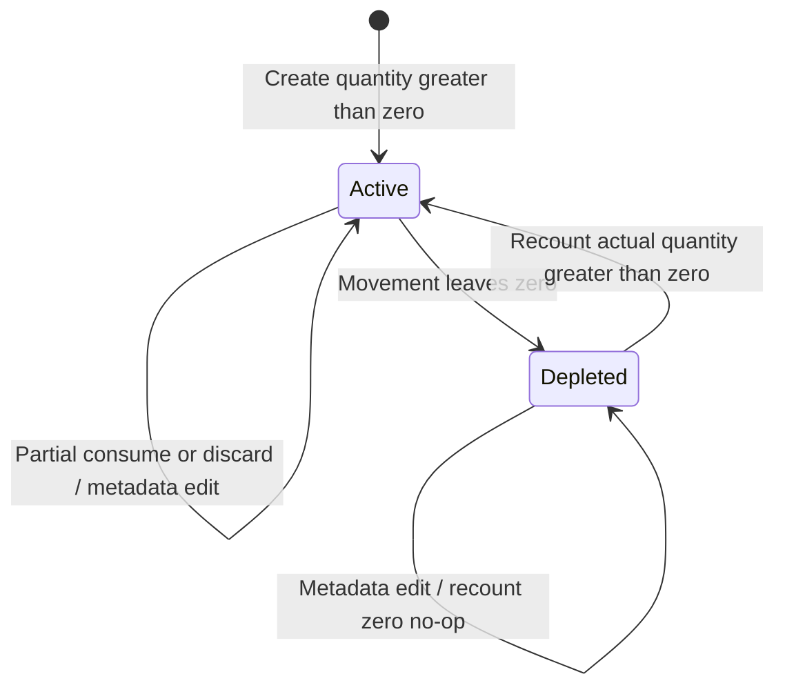
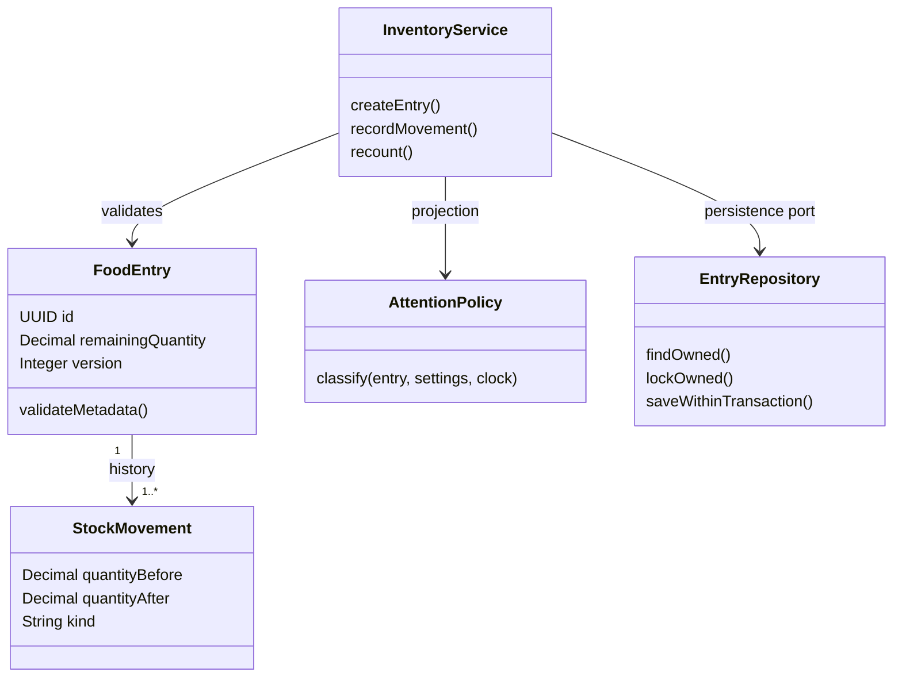
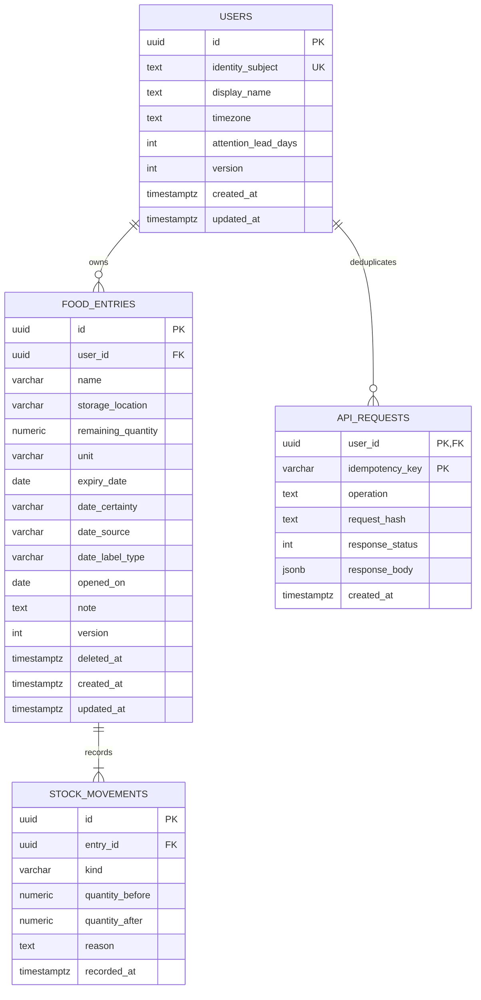

# [S0] Context, evidence và phạm vi quyết định
Version: 0.1 — 08/10/2026 — thiết kế để review, chưa phải specification đã phê duyệt toàn bộ.

## S0.1 Confidence
**Medium tổng thể**. High cho ba cơ chế persona và ba core functions; High cho scope user vừa chọn; Medium cho suy luận tính năng; Medium cho thiết kế dữ liệu/API; chưa kiểm chứng bằng field study địa phương hoặc code hiện tại.

Không có quyền đọc toàn bộ lịch sử chat như một bản export. Đã truy xuất các đoạn liên quan Expiry bằng context search, đọc tài liệu được tìm thấy và tra nguồn công khai. Không tuyên bố đã đọc mọi tin nhắn. Canva bị chặn khi đọc qua web search, sau đó đã đọc trực tiếp rich text qua Canva connector trong lượt tiếp tục. Persona source hiện đã đối chiếu bản thiết kế hiện tại.

## S0.2 Evidence classes
| Nhãn | Ý nghĩa | Cách dùng |
|---|---|---|
| [A-U] | User nói/chọn rõ trong conversation | Constraint của thiết kế |
| [A-R] | Nội dung conversation được truy xuất | Giữ nguồn và độ chắc chắn; không giả thành đọc nguyên bản |
| [A-F] | Nội dung file đã đọc | Evidence về nội dung file, chưa chứng minh research trong file đúng |
| [B] | Paper nguồn hoặc docs chính thức được tra | Hỗ trợ kết luận đúng phạm vi nguồn |
| [C] | Suy luận của bộ tài liệu này | Cần verify với user/test |
| [D] | Đề xuất thiết kế | Có thể thay sau review; không gọi là quyết định user |

## S0.3 Canonical context hiện tại
| ID | Nội dung | Nguồn/trạng thái |
|---|---|---|
| CTX-01 | Một project Expiry cho HCI, Systems Engineering và Advanced Web | [A-U] context đã cung cấp |
| CTX-02 | HCI: persona, UX/UI; SE: problem/requirements/flows/use cases/UML/data/ERD; Web: middleware/controller/API/business logic/repository/queries | [A-U] |
| CTX-03 | CF-01 Add/Capture; CF-02 View/Prioritise & Explain; CF-03 Resolve/Act & Reconcile | [A-F] tracker 06/10 |
| CTX-04 | User flow theo Screen → User Action → Next Screen; decision dành cho điều kiện/validation | [A-F] tracker |
| CTX-05 | Auth xuất hiện tại điểm cần dữ liệu riêng/persist, không mặc định đặt ở đầu toàn journey | [A-F] tracker |
| CTX-06 | Tồn kho riêng từng tài khoản | [A-U] trả lời hôm nay; đã thay giả định trước đây |
| CTX-07 | MVP nhập tay, nhắc trong app; OCR/push chưa ở MVP | [A-U] hôm nay |
| CTX-08 | Stack chưa chốt | [A-U] hôm nay; React/Express/PostgreSQL chỉ [D] |
| CTX-09 | Team khoảng 5 người; task tự claim, có thể đồng đảm nhiệm, review theo dependency | [A-U] context; chưa phân công tên mới |
| CTX-10 | Food-first từ persona hiện tại | [C/D] nhất quán corpus; mở rộng medicines/cosmetics/warranty cần nghiên cứu riêng |

## S0.4 Persona mới nhất và các phần chưa biết
Nguồn được truy xuất: https://www.canva.com/design/DAHXSrL9WU4 (08/10). Link cũ https://www.canva.com/d/ZhG7BWcn6eP6q5V và https://www.canva.com/d/n-qOUVfDmewzZFz là lịch sử; không dùng ghi đè persona mới.

| ID | Persona | Profile đã truy xuất [A-R] | Cơ chế đã bàn |
|---|---|---|---|
| P1 | Phạm Hoàng An — Occasional/Passive Forgetter | 20, Student, TP.HCM, Single, iPhone/Laptop | Có thể lên kế hoạch, vẫn quên đồ khi khuất chú ý; không được diễn giải thành người hoàn toàn thiếu tổ chức |
| P2 | Tôn Nữ Như Huyền — Busy Improviser | 49, Household, Đà Nẵng, Married, Android/Laptop | Kế hoạch thực phẩm gia đình thay đổi; khó chuyển đồ đang có thành hành động |
| P3 | Phạm Ngọc Thiên An — Conscious Maintainer | 20, Student, Đà Nẵng, Single, iPhone/Android/Laptop | Muốn theo dõi chính xác nhưng cập nhật từng món tốn công |

Đã đọc personality/quote/behavior/habits/goals/pains/challenges/opportunities trực tiếp từ Canva. Income và giờ sử dụng cụ thể không có trong rich text, không tự thêm. Canva là persona artifact, không phải raw interview transcript; quotes được ghi là quote trong slide, chưa xác minh nguồn interview. P1 trong lời user visible context: biết plan trước mua nhưng thỉnh thoảng quên, ngại sơ chế, bỏ tủ lạnh rồi quên có đồ đó.

## S0.5 Files đã đọc
- `REPORT.md` (30/09): evidence audit và các BR-01…08 cũ; đọc đủ 1.163 dòng. Đây là synthesis cũ, có thể chứa inference/nguồn không tái kiểm chứng.
- `Tóm tắt (Executive Summary)` (08/10): ERD/Product/InventoryBatch/API đề xuất cũ, đọc đủ. Không kế thừa mù quáng unique product name, nhận userId từ client, gộp delete với discard hoặc quantity status không nhất quán.
- `Audit backend và kế hoạch cải thiện toàn diện cho Expiry App` (06/10): đọc các mục architecture, trust boundary, schema, concurrency và API; không đọc hết mọi mục của report.
- `Expiry_App_Task_Tracker_2026-10-06.xlsx`: đọc ba tab và acceptance criteria.

## S0.6 Decision log và blockers
| ID | Quyết định/phần còn mở | Status | Artifact ảnh hưởng |
|---|---|---|---|
| DEC-01 | Private inventory | User confirmed | Owner FK/API scope |
| DEC-02 | Manual + in-app attention | User confirmed | Không cần scan/worker/push tables ở MVP |
| DEC-03 | Food entry + movement ledger; remaining_quantity làm operational source of truth | Proposed | ERD, transaction, resolve API |
| DEC-04 | DATE riêng với TIMESTAMPTZ; uncertainty tách khỏi opening | Proposed | Dictionary, API |
| DEC-05 | Soft delete là quản trị bản ghi; không ghi discard | Proposed | History/trash/restore |
| DEC-06 | Warning lead mặc định 2 ngày chỉ là cấu hình thử nghiệm; user sửa 0–30 | Proposed, chưa validated | UX/priority/settings |
| DEC-07 | Modular monolith; feature modules và service/repo boundary | Proposed | Repo |
| DEC-08 | Auth provider/session strategy và stack | Open | Auth adapter, implementation; domain/API business có thể làm trước |
| DEC-09 | Read-before-sign-in: public demo + draft form, auth khi đọc kho riêng hoặc lưu | Proposed từ CTX-05 | UX auth continuation |
| DEC-10 | Rich text Canva đã đọc trực tiếp; image/layout chưa inspect | Source retrieved | Persona fidelity; raw interview validation còn mở |
| DEC-11 | Deployment, backend runtime, hosting, vận hành DB | Open | Chưa triển khai infra |

Không có blocker cho bộ logical design này. Trước khi gọi ERD/API là final: review DEC-03…09 và thử các task với người thuộc ba cơ chế. Không yêu cầu user gửi lại quyết định DEC-01/02 hoặc chốt stack giả.


---

# [S1] Problem và [S4–S5] Research/root cause

## S1.1 Problem definition
- Symptom: thực phẩm bị quên; người dùng biết hạn nhưng không biết dùng món nào; app tồn kho dễ sai sau khi dùng/bỏ.
- Expected: biết mình có gì, cái gì cần chú ý và cập nhật được việc đã làm với công nhỏ.
- Actual: thông tin phân tán ở bao bì/tủ lạnh/trí nhớ; kế hoạch đổi; thao tác cập nhật chậm hơn thay đổi thực tế.
- Impact: quyết định muộn, mua trùng, bản ghi sai và giảm tin tưởng. Chưa có số liệu baseline của nhóm để lượng hóa.
- Scope: thực phẩm trong tồn kho cá nhân, ba core functions CTX-03, nhập tay và in-app.
- Out of scope MVP: shared household, OCR/barcode integration, push, recipes/AI, tự suy hạn theo loại đồ, finance savings claims, medicine/warranty, offline sync và học thích nghi.

## S5.1 Phương pháp research đã làm
1. Truy xuất conversation có persona/BR gần nhất; phân biệt user fact và assistant đề xuất.
2. Đọc file hiện có để phát hiện khác biệt giữa persona, BR, ERD/API cũ.
3. Tra paper gốc và docs chính thức; dùng kết quả nghiên cứu để kiểm tra **cơ chế**, không suy tỉ lệ thị trường từ mẫu nhỏ.
4. Chuyển cơ chế thành hypothesis tính năng; ghi test và artifact chịu ảnh hưởng.
5. Kiểm tra ngược mỗi entity/route có task cần nó hay không.

Đây là research synthesis + engineering design; chưa có phỏng vấn mới, usability study hoặc competitor app walkthrough trực tiếp. Không gắn nhãn “đã validated”.

## S5.2 Source ledger
| Source | Nguồn và phạm vi | Finding dùng | Giới hạn |
|---|---|---|---|
| RES-01 | Mesiranta et al., CozZo, conference abstract, 2024; https://zenodo.org/records/14164532 | 52 households, 3–6 tuần; stock/expiry awareness và planning có giá trị; maintenance effort, expiry estimate và perceived value là trở ngại | Conference abstract, không chứng minh ba persona VN là market segments; kết quả giảm waste không dùng làm KPI mặc định |
| RES-02 | Mathisen et al., TotalCtrl/Too Good To Go, 2022; https://formative.jmir.org/2022/9/e38520 ; index https://pmc.ncbi.nlm.nih.gov/articles/PMC9482070/ | Search index nguồn paper: 6 students, nhiều manual operations gây khó duy trì | Full-text hôm nay bị anti-bot; chỉ dùng mức finding đã có trong index + audit cũ; chưa tái đọc full paper |
| RES-03 | EATiT, Taiwan, Graham-Rowe trong REPORT.md | Visibility, disrupted plans, inconvenience là background hypotheses | Chưa truy lại paper gốc lần này; không dùng sample/quote từ đây làm new verified claim |
| DOC-01 | PostgreSQL constraints https://www.postgresql.org/docs/current/ddl-constraints.html | PK/FK/UNIQUE/CHECK giữ integrity | Không thay validation/ownership nghiệp vụ |
| DOC-02 | PostgreSQL locking https://www.postgresql.org/docs/current/explicit-locking.html | FOR UPDATE hỗ trợ serialize cập nhật cùng hàng | Vẫn phải có transaction; thứ tự lock ổn định |
| DOC-03 | Date/time https://www.postgresql.org/docs/current/datatype-datetime.html | DATE khác timestamp/timezone | Cách ưu tiên hôm nay là rule project |
| DOC-04 | Numeric https://www.postgresql.org/docs/current/datatype-numeric.html | numeric là exact decimal | Không tự quyết định unit/conversion |
| DOC-05 | React https://react.dev/learn/sharing-state-between-components | Shared UI state ở common parent gần nhất | Không phải mọi state lên App |
| DOC-06 | OpenAPI 3.1.1 https://spec.openapis.org/oas/v3.1.1.html | Contract operations, schema, request/response | Không quy định phải map route 1:1 table |
| DOC-07 | RFC 9457 https://www.rfc-editor.org/rfc/rfc9457 | Problem details cho lỗi HTTP | code/request_id là extension project |
| DOC-08 | OWASP https://cheatsheetseries.owasp.org/cheatsheets/REST_Security_Cheat_Sheet.html | Endpoint access control, input validation, server workflow enforcement | Cần kiểm tra thực thi trên code sau |
| DOC-09 | OMG UML 2.5.1 https://www.omg.org/spec/UML/2.5.1 | Use case, activity, sequence, class/state thuộc UML | Mermaid flowchart và ERD không tự trở thành UML chuẩn |
| DOC-10 | UK official label guide https://www.gov.uk/understanding-food-labelling/best-before-and-use-by-dates | Use-by và best-before có nghĩa khác; storage/opening quan trọng | Không dùng như pháp luật nhãn VN; không suy shelf-life hay an toàn từ app |

Sources truy cập 08/10/2026. Không tìm thấy tài liệu chính thức xác nhận warning **2 ngày** là phù hợp cho mọi thực phẩm; đó là policy thử nghiệm DEC-06. Không tìm thấy evidence trong nguồn đã đọc chứng minh chỉ bật reminder là đủ giải quyết P2.

## S4.1 Root cause theo persona
| Persona | Symptom | Immediate cause | System cause | Root mechanism |
|---|---|---|---|---|
| P1 | Có đồ nhưng quên sử dụng | Đồ khuất không tạo tín hiệu nhớ | Phải tự nhớ toàn bộ inventory, không có điểm review nhẹ | Visibility/attention failure dù có khả năng plan |
| P2 | Có đồ gần hạn nhưng kế hoạch không thực hiện | Lịch/sở thích/nhu cầu thay đổi | Thông tin hạn không nối với quyết định hiện tại | Decision/action gap |
| P3 | Theo dõi một thời gian rồi số lượng app sai | Dùng/bỏ không được cập nhật | Cost của maintenance cao hơn giá trị nhận ở thời điểm đó | Maintenance burden và reconciliation failure |

[C] Feedback loop nguy hiểm: cập nhật chậm → stock sai → attention sai → giảm tin tưởng → ít cập nhật hơn. Vì vậy data accuracy là điều kiện upstream của reminder quality.

## S1.2 Persona → pain → challenge → opportunity → feature
Pain point = điều gây khó chịu/thiệt hại hiện có; challenge = trở ngại khi muốn đạt goal; opportunity = chỗ sản phẩm có thể can thiệp. Opportunity chưa phải bằng chứng cần feature.

| ID | Context/behavior nguồn | Pain point [C trừ phần user nói] | Challenge | Opportunity | Candidate feature | Cần research thêm |
|---|---|---|---|---|---|---|
| PP-11 | P1 mua có plan, cất tủ rồi quên | Không nhớ đang có món gì | Review phải nhanh, không đòi nhớ từng món | Hiển thị food cần chú ý theo vị trí/ngày | F-02 attention list, F-03 detail | Có mở app trước nấu/mua không? |
| PP-12 | P1 ngại sơ chế, quên thỉnh thoảng | Biết có đồ nhưng chưa xử lý | Notification không tạo thời gian/động lực chế biến | Đi thẳng từ attention đến hành động ngắn | F-04 record used/discarded; recipes để sau | Cản trở do thiếu thời gian hay không muốn ăn? |
| PP-13 | P1 ít muốn quản trị | Nhập dữ liệu thành việc mới | Capture không được dài hơn khả năng duy trì | Chỉ bắt buộc name/quantity/unit | F-01 quick manual add, optional date | Thời gian nhập chấp nhận thực tế? |
| PP-21 | P2 đồ mua cho dự định gia đình nhưng plan đổi | Không biết món nào ưu tiên | Quyết định cần lượng/vị trí/date context | Ranking có reason dễ hiểu, lọc nhanh | F-02/F-03 | Có giúp chọn hành động hay chỉ xem cảnh báo? |
| PP-22 | P2 lựa chọn chưa rõ với đồ không nhãn | Thiếu thông tin đáng tin | Không phải món nào có date chắc chắn | Tách unknown/estimated và source | F-01/F-03/F-05 edit metadata | User hiểu nhãn uncertainty ra sao? |
| PP-23 | P2 có household context | Người khác có thể thay đổi đồ vật thật | Private app không tự đồng bộ việc người khác làm | Quick recount cho owner; sharing phase sau | F-05 recount | Private scope đáp ứng học phần nhưng coordination vẫn là gap |
| PP-31 | P3 thường kiểm tra tồn kho | Chỉnh nhiều bản ghi phiền | Accuracy cần nhiều thao tác lặp | Action rõ quantity, edit nhanh, history | F-04/F-05/F-06 | Tần suất cập nhật và kiểu sai phổ biến? |
| PP-32 | P3 muốn số liệu đúng | Double tap/retry hoặc tab cũ làm sai lượng | Không thể dựa UI disable button | Version + idempotency + atomic movement | F-04 server guarantees | Mobile network/retry là giả thuyết cần thử |
| PP-33 | P3 sửa nhầm/xóa nhầm | Mất dữ liệu đã quản lý | Restore không được tạo fake stock movement | Soft-delete, trash/restore, correction có history | F-06/F-07 | Có cần batch edit ngay không? |

Không suy “married → shared household feature bắt buộc”: user đã chọn private scope. Không suy độ tuổi quyết định tech skill. Các persona cùng dùng một hệ thống; không có role P1/P2/P3 trong DB và không dựng ba dashboard khác nhau trước validation.

## S1.3 Feature relevance và priority
| Feature | P1 | P2 | P3 | MVP |
|---|---|---|---|---|
| F-01 Quick manual capture | Cao | Cao | Cao | Core |
| F-02 Inventory + attention reason + search/location/date filter | Cao | Cao | Cao | Core |
| F-03 Detail: amount/date type/source/opening note | Vừa | Cao | Cao | Core |
| F-04 Consume/discard phần hoặc hết | Cao | Cao | Cao | Core |
| F-05 Edit metadata + recount actual amount | Vừa | Vừa | Cao | Core |
| F-06 History | Thấp | Vừa | Cao | Core, phục vụ reconcile |
| F-07 Trash/restore | Vừa | Vừa | Cao | Core support |
| F-08 Attention lead/timezone settings | Vừa | Vừa | Vừa | Core support |
| OCR/barcode/push | Hypothesis | Hypothesis | Hypothesis | Deferred theo user |
| Recipes/meal plans/bulk maintenance | Chưa chứng minh | Potential cao | Potential | Research backlog |

“In-app reminder” MVP = attention list được tính khi mở/refetch app; không phải notification gửi khi app đóng. Nếu user kỳ vọng thông báo ngoài app thì scope cần đổi; không cần worker/scheduler cho định nghĩa này.

## S5.3 Validation research tiếp theo
- Phỏng vấn dựa incident gần nhất, không hỏi dẫn “bạn có muốn OCR không?”. Mỗi persona mechanism tìm 3–5 người phù hợp cho exploratory study; đây là kế hoạch, không đảm bảo đại diện dân số.
- P1: lần gần nhất đồ bị quên ở đâu, khi nào phát hiện, có plan trước không, cue nào làm nhớ.
- P2: kể lần đổi kế hoạch; tại sao không dùng đồ, thông tin nào thiếu; task chọn món ưu tiên có thực sự giúp quyết định.
- P3: quan sát thêm 5 món và ghi dùng/bỏ/sửa; count taps, time, wrong amounts, bỏ dở, stale records sau vài ngày.
- Task usability: thêm món không biết hạn; chọn món cần chú ý; dùng một phần; recount; xóa rồi restore; mạng chập chờn.
- Metrics: completion, median task time, error/correction rate, stale-record rate (digital active records sai physical state / records audited), relevant-action rate. Report denominator/sample và cách đo.
- Chưa đặt universal thresholds. Baseline trước; nhóm chốt acceptance targets trước test. Không dùng % giảm waste của CozZo làm lời hứa sản phẩm.


---

# [S2] Definitions và requirement model

## S2.1 Các khái niệm dùng trong bộ tài liệu
| Term | Định nghĩa đơn giản | Vai trò/ví dụ Expiry |
|---|---|---|
| Proto-persona | Mô hình hành vi tổng hợp còn cần kiểm chứng | P1 visibility; không phải một participant thật được interview hôm nay |
| Goal | Kết quả người dùng muốn đạt | Biết món nào cần xem trước khi nấu |
| Task | Việc cụ thể làm để đạt goal | Mở attention list, chọn món, ghi dùng 1 hộp |
| User flow | Đường đi qua screen/action/decision | WF-01 → chọn món → WF-03 |
| Scenario | Một tình huống cụ thể có bối cảnh và outcome | Huyền đổi bữa tối, xem món nào gần ngày theo dõi |
| Use case | Hợp đồng hành vi hệ thống phục vụ goal | UC-04 ghi sử dụng; gồm normal/alternate/error flow |
| Business requirement (BR) | Kết quả/giá trị business cần đạt | Giảm công cập nhật để inventory hữu ích |
| Functional requirement (FR) | Hệ thống phải làm gì | Save món với date nullable |
| Nonfunctional requirement (NFR) | Chất lượng/ràng buộc cách vận hành | Không ghi số lượng âm khi hai request đồng thời |
| Business rule (RULE) | Điều kiện/giới hạn quyết định nghiệp vụ | Không dùng nhiều hơn lượng còn |
| Entity | Khái niệm có identity và dữ liệu cần lưu | FoodEntry E-A khác E-B dù cùng tên |
| Data dictionary | Định nghĩa chính xác field trước schema | expiry_date là calendar date nullable |
| ERD | Sơ đồ entity và quan hệ/cardinality | Một user sở hữu 0…N entries |
| DTO | Định dạng truyền vào/ra API, không phải DB row | EntryResponse gồm attention dẫn xuất |
| Repository | Bộ hàm truy cập persistence có scope | findOwnedEntry(id,userId) |
| Use-case service | Điều phối rule, transaction và repo | RecordMovement kiểm tra lượng và commit cả history |
| Transaction | Nhóm thay đổi cùng commit hoặc rollback | Giảm quantity và thêm movement cùng thành công |
| Optimistic concurrency | Phát hiện request dùng version cũ | expected_version 3 nhưng hiện 4 → 409 |
| Idempotency | Retry cùng command không thực hiện lần hai | Replay movement dùng 1 hộp không trừ thêm |
| Modular monolith | Một backend deploy, bên trong chia module | inventory/accounts, chưa có microservices |
| Composition root | Nơi nối dependencies | server startup inject service/repo, không chứa toàn rule |
| Ledger | Lịch sử các thay đổi | Movements; MVP không event-sourcing |
| Source of truth | Giá trị chính được dùng để quyết định | DB remaining_quantity, không React copy |

## S2.2 BR mới: tách namespace để tránh xung đột
Ngày 30/09 dùng BR-01…08 cho hỗn hợp capability. Ngày 08/10 assistant đề xuất BR-01…03 cho outcome. Bộ này dùng **BR-V1-xx** cho outcome, **FR-xx** cho capability, **RULE-xx** cho business rules; không âm thầm đổi nghĩa ID cũ.

| ID | Outcome [D] | Persona | Indicators |
|---|---|---|---|
| BR-V1-01 | Người dùng nhận biết thực phẩm đang có và cần chú ý với công thấp | P1, P2 | Task chọn món; missed/stale records |
| BR-V1-02 | Người dùng có đủ context để quyết định bước tiếp khi kế hoạch đổi | P2 | Task decision completion + explanation; không tự claim recipes đã giải quyết |
| BR-V1-03 | Tồn kho số phản ánh thay đổi thực tế mà không tạo gánh nặng quản trị lớn | P3, P1 | Update time, amount errors, stale-record rate |

| FR | Hệ thống cần làm | UC/feature | Outcome |
|---|---|---|---|
| FR-01 | Capture name, amount, unit; date optional và source rõ | UC-01/F-01 | BR-V1-01/03 |
| FR-02 | List/search/filter kho của owner; stable pagination | UC-02/F-02 | BR-V1-01 |
| FR-03 | Attention classification + reason + calculated local date | UC-03/F-02/03 | BR-V1-01/02 |
| FR-04 | Ghi consume/discard một phần/toàn bộ, atomic và retry-safe | UC-04/05/F-04 | BR-V1-03 |
| FR-05 | Sửa metadata có version, không sửa quantity qua generic PATCH | UC-06/F-05 | BR-V1-02/03 |
| FR-06 | Recount lượng thực tế, lưu correction history | UC-07/F-05 | BR-V1-03 |
| FR-07 | History đọc được của owner | UC-08/F-06 | BR-V1-03 |
| FR-08 | Soft delete/trash/restore, tách physical disposal | UC-09/10/F-07 | BR-V1-03 |
| FR-09 | Setting timezone và attention lead, recompute | UC-11/F-08 | BR-V1-01/02 |
| FR-10 | Auth continuation giữ draft và gate kho riêng/persist | UC-00/support | CTX-05 |

## S2.3 Business logic inventory
| Rule | Chính xác cần enforce [D] | Owner |
|---|---|---|
| RULE-01 | Owner lấy từ principal authenticated; không nhận user_id trong business DTO | Service + scoped repo |
| RULE-02 | Một FoodEntry = food quantity có cùng unit/date/location/opening context. Cùng tên không phải cùng identity | Capture service |
| RULE-03 | Create quantity >0; remaining ≥0; max 999999999.999; piece số nguyên; g/ml 3 decimal; không convert unit ở MVP | Service + DB CHECK |
| RULE-04 | Create lưu initial movement trước 0 → quantity; operational remaining là nguồn đọc, ledger cập nhật cùng transaction | Create service + DB |
| RULE-05 | Consume/discard amount >0 và ≤remaining; deleted/depleted không cho movement giảm | RecordMovement |
| RULE-06 | Recount nhập actual_quantity ≥0, reason bắt buộc; cùng lượng hiện có thì 200 no-op, không thêm movement/version | Recount service |
| RULE-07 | Không mutate remaining, version, user_id, deleted_at hoặc attention bằng generic metadata PATCH | DTO/schema + service |
| RULE-08 | unit không đổi sau create; muốn đổi phải quyết định migration/conversion riêng | Service |
| RULE-09 | Date unknown → expiry_date null; known/estimated → cần ngày; nguồn printed_label/user_estimate/user_entered/unknown nhất quán | Metadata domain |
| RULE-10 | date_label_type use_by/best_before/unspecified là nghĩa nhãn, không certainty. estimated chỉ với user_estimate; unknown đi cùng source unknown và label unspecified | Metadata + DB |
| RULE-11 | opened_on là field riêng nullable; không tự tính hạn mới, không tự kéo dài date khi freezer | Metadata/attention policy |
| RULE-12 | Attention khi còn quantity và chưa deleted: unknown nếu chưa date; past_date nếu date<today; due_today nếu bằng; soon nếu 0<delta≤lead; later nếu delta>lead | AttentionPolicy |
| RULE-13 | Today là calendar date theo user timezone; response có as_of_date; lead 0…30, default thử 2 | AttentionPolicy |
| RULE-14 | Attention không chứng minh safe/fresh; explain source, label, uncertainty. Không tự kết luận nên ăn khi quá use-by | AttentionPolicy/presenter |
| RULE-15 | Soft-delete giữ quantity/history, không tạo discard movement; restore chỉ bỏ deleted_at, recompute attention | Delete/restore service |
| RULE-16 | Lifecycle active nếu remaining>0, depleted nếu 0; không ép một trạng thái consumed/discarded cho batch đã vừa dùng vừa bỏ | Derived presenter |
| RULE-17 | expected_version phải khớp current cho update/action/delete/restore; successful mutation tăng version đúng một lần; no-op không tăng | Services |
| RULE-18 | Mọi write yêu cầu Idempotency-Key; cùng owner+key+operation+payload replay saved response, khác payload/operation →409; replay trước version check | Mutation executor + api_requests |
| RULE-19 | Idempotency reservation/result và entry/history commit cùng transaction; thất bại rollback; MVP không tự expire keys | Transaction adapter |
| RULE-20 | Sort priority past_date,due_today,soon,unknown,later; trong nhóm date asc NULLS LAST rồi created_at,id; unknown nhóm riêng visible | Query/AttentionPolicy |
| RULE-21 | Past-date capture được phép, kèm reason; không reject vì quá ngày hôm nay | Create/UX |
| RULE-22 | Unknown không silently suy date; opening/date edit chỉ metadata cả entry; mở một phần batch cần ghi tách ngay khi capture, split sau này phải atomic | Service/UX |
| RULE-23 | History không có public edit/delete endpoint; sửa sai bằng recount có reason, không rewrite historical consumption | Repo/service |
| RULE-24 | Owner-only not-found hoặc foreign-owned ID →404; auth thiếu →401; lỗi input→422; conflict→409 | Error mapper |

## S2.4 Attention decision table
| Deleted | Quantity | Date | Relationship với today | Output |
|---|---|---|---|---|
| Có | Bất kỳ | Bất kỳ | Bất kỳ | Không trong active list; trash riêng |
| Không | 0 | Bất kỳ | Bất kỳ | depleted, không trong attention list |
| Không | >0 | null | Không biết | unknown; yêu cầu xem/xác nhận, không gọi later |
| Không | >0 | Có | <today | past_date; reason theo label/source |
| Không | >0 | Có | =today | due_today |
| Không | >0 | Có | 1…lead days | soon |
| Không | >0 | Có | >lead days | later |

opened_on không thay đổi bảng này tự động. Cần hướng dẫn sau mở từ nhãn/người dùng trước khi model thêm effective deadline.

## S2.5 NFR và acceptance
| NFR | Yêu cầu | Verification |
|---|---|---|
| NFR-01 Privacy | Không cross-user read/write ở mọi endpoint và history | A/B user tests |
| NFR-02 Integrity | Atomic entry/movement/idempotency; không âm; conflict không overwrite | Concurrent transactions + rollback test |
| NFR-03 Contract | FE mock và BE trả đúng OpenAPI; stable error shape | Contract validation |
| NFR-04 UX recovery | 401 giữ draft; timeout retry cùng key; conflict refetch không silent replace | UI scenarios |
| NFR-05 Accessibility | Label/input rõ, keyboard usable, trạng thái không chỉ màu, focus/dialog/error đúng | Keyboard + screen reader review |
| NFR-06 Date accuracy | Date-only không bị lệch do UTC conversion; clock injection | Boundary timezone tests |
| NFR-07 Operations | Migration versioned, backup/restore baseline, generic errors, no secret logging | Staging acceptance |
| NFR-08 Performance | Chốt latency/volume sau biết hosting và dataset; chưa bịa SLA | Baseline measurements |


---

# [S3] User flows, scenarios và use cases

## S3.1 Screen inventory
| Screen | Nội dung | Actions/next |
|---|---|---|
| WF-00 Intro/demo + auth continuation | Preview không dùng dữ liệu riêng | Try add →WF-02; view own stock/auth→WF-01 |
| WF-01 Inventory/attention | Attention groups, reasons, search/location, all/depleted tab | Add→WF-02; item→WF-03; settings→WF-06 |
| WF-02 Add/edit | Name, amount/unit khi create, location, optional date/certainty/label/source/opened note | Save→WF-03; validation giữ form; cancel→trước đó |
| WF-03 Detail | Current amount/version/date context/attention reason | Use/discard/recount→WF-04; edit→WF-02; history→WF-05; remove record→dialog |
| WF-04 Action sheet | Action, amount/actual amount, reason khi recount; current quantity | Confirm→WF-03 updated; cancel→WF-03 |
| WF-05 History/trash | Read-only movement history; trash là view riêng cùng layout list | Restore→WF-03; back→WF-01 |
| WF-06 Settings | Timezone, attention lead | Save→WF-01 recompute; cancel→WF-01 |

## S3.2 Goal và các flow hoàn thành task
| Flow | Persona chính | Goal | Straight task path | Outcome kiểm chứng được |
|---|---|---|---|---|
| UF-01 Capture | P1/P3 | Ghi đồ mới trước khi quên | WF-01→Add→WF-02→Save→WF-03 | Entry đã lưu, initial movement, xuất hiện trong inventory |
| UF-02 Capture unknown date | P1/P2 | Không bỏ việc theo dõi chỉ vì thiếu nhãn | WF-02→chọn Không biết hạn→Save→WF-03 | Date null, unknown visible; không fake date |
| UF-03 Notice hidden food | P1 | Nhớ được món cần xem | WF-01→attention group→item→WF-03 | User thấy amount/location/reason; chưa claim food used |
| UF-04 Decide after plan change | P2 | Chọn món đáng chú ý từ đồ đang có | WF-01→location/filter→item→WF-03→action→WF-04→confirm | User tự chọn action; hệ thống ghi kết quả |
| UF-05 Partial consumption | All | Số lượng app đúng sau dùng | WF-03→Use→WF-04 amount→confirm→WF-03 | Remaining giảm đúng; history tạo 1 lần |
| UF-06 Partial/full discard | All | Phản ánh đồ thật đã bỏ | WF-03→Discard→WF-04 amount→confirm→WF-03 | Remaining giảm; discard history; zero→depleted |
| UF-07 Reconcile physical stock | P3/P2 | Sửa số lượng lệch nhanh | WF-03→Recount→WF-04 actual+reason→confirm→WF-03→history | Amount đúng và correction traceable |
| UF-08 Correct metadata | P3/P2 | Sửa ngày/vị trí nguồn nhập sai | WF-03→Edit→WF-02→Save→WF-03 | Version tăng; attention recomputed |
| UF-09 Remove/restore record | P3 | Dọn bản ghi nhầm, lấy lại khi xóa sai | WF-03→Remove record→confirm→WF-05 trash→Restore→WF-03 | Quantity/history không đổi bởi delete/restore |
| UF-10 Change attention settings | All | Điều chỉnh cách chú ý | WF-01→Settings→WF-06→Save→WF-01 | Lead/timezone cập nhật; list có as_of_date mới |
| UF-11 Session expiry continuation | All | Không mất draft khi auth hết hạn | WF-02/04→Save→401→auth→resume cùng draft→Save | Không trừ quantity trước khi server success |

Mỗi flow có thể có nhiều task path; không ép mỗi persona chỉ dùng một core function. UF-04 chưa có recipe generation, meal plan persistence hoặc freeze-expiry automation. Nó đạt goal “chọn từ đồ cần chú ý”, chưa chứng minh đã giải quyết toàn bộ decision gap.

## S3.3 Scenario catalogue
Các tình huống dưới đây là [C/D] test scenarios, không phải trích lời user research.

| Scenario | Context/trigger | Persona goal | Flow/UC | Expected result |
|---|---|---|---|---|
| SC-01 | An cất 2 hộp sữa cùng hạn, muốn ghi trước khi quên | Capture nhanh | UF-01/UC-01 | Một entry quantity 2 piece |
| SC-02 | An có rau không thấy nhãn ngày | Vẫn theo dõi được | UF-02/UC-01 | unknown date; không bị chặn |
| SC-03 | Trước bữa tối An mở app, món ở sau tủ đã gần ngày theo dõi | Nhớ món đang có | UF-03/UC-02/03 | Soon group + reason/date/location |
| SC-04 | Huyền đổi món ăn tối sau thay đổi lịch gia đình | Chọn đồ cần chú ý | UF-04/UC-03/04 | Filter/detail trước action; không chỉ bật alert |
| SC-05 | Thiên An dùng 250g từ entry 1000g | Cập nhật chính xác | UF-05/UC-04 | Remaining 750g; movement -250g |
| SC-06 | Bỏ 200g trong phần 750g còn | Ghi waste riêng với use | UF-06/UC-05 | Remaining 550g; discard 200g |
| SC-07 | Kiểm tra thực tế chỉ còn 500g | Reconcile mismatch | UF-07/UC-07 | Adjustment -50g có reason |
| SC-08 | Dùng mobile, server commit nhưng response mất | Không ghi lặp | UF-05/UC-04 | Retry cùng key/payload replay, chỉ 1 movement |
| SC-09 | Hai tab cùng version, mỗi tab yêu cầu dùng 400g từ 500g | Không negative/lost update | UC-04 | Một success; tab còn lại 409, refetch |
| SC-10 | Lỡ xóa bản ghi còn 500g | Khôi phục record | UF-09/UC-09/10 | Restore vẫn 500g, không giả đã dùng/bỏ |
| SC-11 | Sửa date khi tab khác đã cập nhật entry | Không overwrite silently | UF-08/UC-06 | 409, hiển thị dữ liệu hiện tại/draft khác biệt |
| SC-12 | Entry vừa dùng hết vừa bỏ phần cuối | History đúng nghĩa | UC-04/05/08 | lifecycle depleted; totals theo movement, không “all consumed” |
| SC-13 | User A thử ID của user B | Bảo vệ kho riêng | Tất cả owned UCs | 404; không data leak |
| SC-14 | Date=ngày hiện tại user, máy client ở timezone khác | Nhắc đúng calendar date | UC-03/11 | due_today theo timezone owner |
| SC-15 | Món quá date nhưng best_before hoặc date estimate | Không biến attention thành safety claim | UC-03 | past_date + label/source explanation |

## S3.4 Use case specification conventions
Actor chính: authenticated inventory owner (trừ UC-00/support demo). P1/P2/P3 là behavior models, **không phải actor roles hay quyền**. System boundary = Expiry application gồm UI/API/domain/persistence. Auth provider là supporting external actor chưa chốt. Clock được inject làm dependency cho test, không phải người dùng.

Precondition chung: principal valid, object thuộc owner và chưa deleted với operations thường. Auth/security gate là precondition/support flow; không tạo “business UC validate form” chỉ vì middleware tồn tại.

### UC-00 — Continue with identity

- Requirement: FR-10; UI: WF-00/02/04.
- Trigger: Chạm private inventory hoặc lưu draft.
- Preconditions: Có draft/demo chưa persist.
- Main success flow: Giữ draft; xác thực qua auth adapter; resume task.
- Alternate/error flow: Cancel auth → giữ draft, không save; auth fail → retry.
- Success guarantee: Identity principal hợp lệ, chưa tự tạo food.
- Failure guarantee: không partial mutation; draft giữ ở UI; rollback trước commit. Với read không phát sinh write.
- Rules: Không password/token trong food DTO.

### UC-01 — Record food entry

- Requirement: FR-01; UI: WF-02.
- Trigger: User chọn Add rồi Save.
- Preconditions: Draft có name/quantity/unit.
- Main success flow: Validate DTO; resolve owner; create entry+initial movement+request result một transaction; trả entry.
- Alternate/error flow: Date unknown hợp lệ; past date hợp lệ; 422 giữ draft; timeout retry key cũ.
- Success guarantee: Entry và initial movement hoặc không có cả hai.
- Failure guarantee: không partial mutation; draft giữ ở UI; rollback trước commit. Với read không phát sinh write.
- Rules: RULE-01…04/09…11/18/19/21.

### UC-02 — Review own inventory

- Requirement: FR-02; UI: WF-01.
- Trigger: Mở inventory/search/filter.
- Preconditions: Principal valid.
- Main success flow: Validate filters/page; read owner-scoped rows; project DTO; return items+pagination.
- Alternate/error flow: Empty→empty state/Add CTA; network error→retry; foreign scope không được nhận.
- Success guarantee: Không mutate data.
- Failure guarantee: không partial mutation; draft giữ ở UI; rollback trước commit. Với read không phát sinh write.
- Rules: RULE-01/20/24.

### UC-03 — Identify and understand attention

- Requirement: FR-03; UI: WF-01/03.
- Trigger: Mở attention hoặc detail.
- Preconditions: Clock/timezone/lead có giá trị.
- Main success flow: Read active owned entries; derive date state/reason; stable sort; show date/source/location/amount.
- Alternate/error flow: Unknown→nhóm riêng; depleted/deleted excluded; estimated→explain uncertainty.
- Success guarantee: User có thông tin chọn action; chưa mutate food.
- Failure guarantee: không partial mutation; draft giữ ở UI; rollback trước commit. Với read không phát sinh write.
- Rules: RULE-09…14/20.

### UC-04 — Record consumption

- Requirement: FR-04; UI: WF-04.
- Trigger: User confirm Use amount.
- Preconditions: Owned nondeleted entry với quantity>0; key/version.
- Main success flow: Idempotency lookup; lock owned entry; verify version/unit/amount; update quantity+version; insert consume movement; store response; commit.
- Alternate/error flow: Stale version/over amount→409; invalid amount→422; replay→saved response; all used→depleted.
- Success guarantee: Remaining đúng, 1 history event cho 1 command.
- Failure guarantee: không partial mutation; draft giữ ở UI; rollback trước commit. Với read không phát sinh write.
- Rules: RULE-03/05/17…19.

### UC-05 — Record discard

- Requirement: FR-04; UI: WF-04.
- Trigger: User confirm Discard amount.
- Preconditions: Như UC-04.
- Main success flow: Như UC-04 nhưng movement kind=discard; optional reason.
- Alternate/error flow: Partial waste vẫn active; hết lượng depleted; deleted→404.
- Success guarantee: History waste riêng, không soft-delete record.
- Failure guarantee: không partial mutation; draft giữ ở UI; rollback trước commit. Với read không phát sinh write.
- Rules: RULE-05/15/16/18/19.

### UC-06 — Correct entry metadata

- Requirement: FR-05; UI: WF-02.
- Trigger: Save edit name/location/date context.
- Preconditions: Owned nondeleted entry; version/key; patch không quantity/unit.
- Main success flow: Replay check; lock; validate patch + full merged object; update metadata/version; response attention mới.
- Alternate/error flow: Null reset date phải đổi certainty/source đồng bộ; empty patch→422; conflict→409; depleted metadata vẫn được sửa.
- Success guarantee: Quantity/ledger không đổi; attention updated.
- Failure guarantee: không partial mutation; draft giữ ở UI; rollback trước commit. Với read không phát sinh write.
- Rules: RULE-07…14/17…19.

### UC-07 — Reconcile actual quantity

- Requirement: FR-06; UI: WF-04.
- Trigger: Confirm Recount actual_quantity+reason.
- Preconditions: Owned nondeleted entry; version/key; quantity>=0.
- Main success flow: Replay; lock+version; compare actual vs remaining; delta adjustment; update+ledger+result transaction.
- Alternate/error flow: Same amount→200 no-op; actual>0 từ depleted→active; 0→depleted; invalid/missing reason→422.
- Success guarantee: Digital amount đúng reported reality; correction traceable.
- Failure guarantee: không partial mutation; draft giữ ở UI; rollback trước commit. Với read không phát sinh write.
- Rules: RULE-03/06/16…19/23.

### UC-08 — Review entry movement history

- Requirement: FR-07; UI: WF-05.
- Trigger: Chọn History.
- Preconditions: Owned entry kể cả deleted nếu biết ID qua trash.
- Main success flow: Read owner-scoped entry+paginated movements stable by recorded_at,id; show before/after/kind/reason.
- Alternate/error flow: No events không hợp lệ với entry đã create; server invariant alert; foreign ID→404.
- Success guarantee: Read-only, không sửa lịch sử.
- Failure guarantee: không partial mutation; draft giữ ở UI; rollback trước commit. Với read không phát sinh write.
- Rules: RULE-04/23/24.

### UC-09 — Remove erroneous record

- Requirement: FR-08; UI: WF-03/05.
- Trigger: Confirm Remove record.
- Preconditions: Owned entry, version/key.
- Main success flow: Replay; lock+version; set deleted_at/version; store result transaction.
- Alternate/error flow: Đã deleted với command mới→409; retry cùng key replay; cancel không change.
- Success guarantee: Không trong active list; quantity/history giữ nguyên.
- Failure guarantee: không partial mutation; draft giữ ở UI; rollback trước commit. Với read không phát sinh write.
- Rules: RULE-15/17…19.

### UC-10 — Restore removed record

- Requirement: FR-08; UI: WF-05/03.
- Trigger: Chọn Restore trong trash.
- Preconditions: Owned deleted entry, version/key.
- Main success flow: Replay; lock+version; clear deleted_at; version++; compute derived attention; commit result.
- Alternate/error flow: Chưa deleted với command mới→409; depleted restore vẫn depleted.
- Success guarantee: Record hiện lại đúng lifecycle; no stock movement.
- Failure guarantee: không partial mutation; draft giữ ở UI; rollback trước commit. Với read không phát sinh write.
- Rules: RULE-15…19.

### UC-11 — Set attention preferences

- Requirement: FR-09; UI: WF-06.
- Trigger: Save settings.
- Preconditions: Principal valid; user version/key.
- Main success flow: Validate timezone IANA/lead integer; lock user/version; update settings/version+result transaction; refresh derived list.
- Alternate/error flow: Timezone invalid/lead out-of-range→422; conflict→409; clock not controlled by body.
- Success guarantee: Không rewrite food rows; next read dùng setting mới.
- Failure guarantee: không partial mutation; draft giữ ở UI; rollback trước commit. Với read không phát sinh write.
- Rules: RULE-12/13/17…19.

## S3.4a UX flow CF-01 Capture


## S3.4b UX flow CF-02 Review


## S3.4c UX flow CF-03 Resolve



---

# [S3] Data flow, system map và ownership

## S3.5 INPUT → PROCESS → STATE → SIDE EFFECT → OUTPUT → FEEDBACK
| Stage | Capture | Review/prioritise | Resolve/reconcile |
|---|---|---|---|
| Input | EntryCreate DTO + principal + key | Query + principal + injected clock | Command amount/actual + expected_version + key |
| Process | Schema/business validate + tx | Owner scope + derive attention | Replay/lock/version/business check + tx |
| State | food_entries + initial movement + api_requests | Không ghi status theo ngày | quantity/version + movement + api_requests |
| Side effect | Không scan/push trong MVP | Không lịch gửi hoặc DB update theo clock | FE invalidate list/detail/history sau success |
| Output | EntryResponse, 201 | Items/meta/reason/as_of_date, 200 | Entry+movement, 201; recount no-op 200 |
| Feedback | User sửa draft hoặc edit sau save | User chọn action từ reason/context | Ledger giúp audit/recount; UX feedback cập nhật |

## S3.6 State/lifecycle owners
| State/lifecycle | Owner | Ai mutate | Dependencies |
|---|---|---|---|
| Durable current quantity | Database row thông qua use-case service | Create/RecordMovement/Recount | Transaction + domain rules |
| Movement history | Database immutable qua public API | Services append | Same transaction với current amount |
| Attention state | AttentionPolicy backend | Không persist; compute theo clock/settings | Entry metadata + owner timezone |
| Form/action draft | Form hoặc ActionSheet | User input/form reducer | DTO validation for UX |
| List/detail remote data | Feature query cache (nếu FE dùng cache) | API response + invalidation | Contract, auth identity |
| Search/filter | Page/URL | User/navigation | Serialized query params |
| Identity/session | Auth adapter/provider | Auth flow | Chưa chốt implementation |
| In-flight command/key | Feature mutation coordinator | User start/retry | Giữ key qua retry; command mới key mới |
| Startup wiring | Composition root | Server boot | Inject repo, tx, clock, auth |

Không có component/controller nào “control mọi thứ”. App/root chỉ wiring/navigation. Service sở hữu transaction use case; repo sở hữu query; domain policy sở hữu rule; DB giữ integrity. Cache không là authority nghiệp vụ.

## S3.7 DFD context

DFD mô tả dữ liệu qua process, không phải click path. Context diagram không hiển thị internal stores.

## S3.8 DFD level 1

Logical transaction: P1/P3/P4 writes D4 cùng với durable domain writes. Generic metadata/delete/restore thuộc P3, không có new data store bị thiếu. Auth boundary chung cấp principal trước owned processes, không vẽ password trong D1 flow.

## S3.9 Sequence core capture
```mermaid
sequenceDiagram
 actor U as Owner
 participant UI as Add form
 participant API as HTTP adapter
 participant S as CreateEntry service
 participant DB as Transaction / repositories
 U->>UI: Confirm draft
 UI->>API: POST entry + Idempotency-Key
 API->>API: Authenticate and validate DTO
 API->>S: execute(principal, draft, key)
 S->>DB: Begin; reserve key / check replay
 alt Key already completed, same fingerprint
  DB-->>S: Saved response
 else New command
  S->>S: Validate domain metadata and quantity
  S->>DB: Insert entry + initial movement + response
  S->>DB: Commit
 end
 S-->>API: EntryResponse
 API-->>UI: 201 + Location
 UI-->>U: Saved detail
```

## S3.10 Sequence core read
```mermaid
sequenceDiagram
 actor U as Owner
 participant UI as Inventory page
 participant API as HTTP adapter
 participant S as ReviewInventory service
 participant DB as Repositories
 U->>UI: Open attention / filter
 UI->>API: GET food-entries?view=attention
 API->>S: principal + validated query
 S->>DB: Read owner settings + scoped entries
 DB-->>S: Metadata and quantities
 S->>S: Derive with clock/timezone; sort before pagination
 S-->>API: items + reasons + as_of_date + pagination
 API-->>UI: 200
 UI-->>U: Groups and actionable detail links
```
Query must apply classification/order over the eligible set before pagination, không paginate rồi sort trong FE. Nếu SQL derive để scale, parity-test với pure AttentionPolicy cùng timezone/clock; không có hai rule tự lệch nhau.

## S3.11 Sequence core mutation
```mermaid
sequenceDiagram
 actor U as Owner
 participant UI as Action sheet
 participant API as HTTP adapter
 participant S as RecordMovement service
 participant DB as Transaction / repositories
 U->>UI: Use / discard amount
 UI->>API: POST movement + expected_version + key
 API->>S: principal + command
 S->>DB: Begin; reserve key
 alt Replay with same fingerprint
  DB-->>S: Original response
 else New command
  S->>DB: Lock owned nondeleted entry FOR UPDATE
  DB-->>S: Current amount and version
  S->>S: Check version, unit, amount
  alt Invalid or conflicting
   S->>DB: Rollback
   S-->>API: Domain error
   API-->>UI: 409 / 422
   UI-->>U: Refetch/review draft
  else Valid
   S->>DB: Update quantity/version; insert movement; save result
   S->>DB: Commit
   S-->>API: Updated entry + movement
   API-->>UI: 201
   UI->>UI: Invalidate list/detail/history
   UI-->>U: Updated quantity
  end
 end
```

## S3.12 State UML: quantity và visibility là hai trục

Delete/restore không là consume/discard hoặc state transition tăng stock. Dùng `deleted_at` độc lập với quantity lifecycle. Attention là derived projection riêng.

## S3.13 UML class responsibilities

Đây là responsibility model, không bắt buộc implement mọi entity thành OOP class.

## S3.14 UML notation và files
- `diagrams/*.mmd`: source Mermaid thuần; code fence đúng `mermaid`, không `gpt-mermaid`.
- `diagrams/use_cases.puml`: UML use-case source thật bằng PlantUML. Mermaid không có native use-case diagram; không giả flowchart là UML use case.
- `diagrams/activity_record_movement.puml`: activity với branches success/conflict/replay.
- ERD ở S3.15 trong file data model. UML không thay ERD; UX wireframe không thay data flow.


---

# [S3] Data definition trước ERD và relational mapping

## S3.15 Thứ tự định nghĩa data
1. Thu thập nouns và dữ liệu từ scenario/use case.
2. Định nghĩa identity/grain: một entry nghĩa là gì, khác entry khác ở đâu.
3. Định nghĩa field semantics, owner, source, required/null, unit, precision, allowed values.
4. Phân biệt persisted state, derived projection, transport DTO và UI-only draft.
5. Viết invariants, event/command shape, lifecycle và transaction boundary.
6. Xác định functional dependencies và cardinality; sau đó ERD logical.
7. Chọn DB để map physical types/index/constraints. DDL dưới đây là phương án PostgreSQL, không khóa stack user.

**Data dictionary không chỉ ghi `date: string`.** Phải ghi đây là calendar date, null khi nào, ai nhập, ai dùng, có tự derive không và timezone nào dùng so sánh.

## S3.16 Grain/entity decisions
| Entity | Một row đại diện | Identity | Vì sao cần từ flow |
|---|---|---|---|
| users | Một owner đã xác thực cùng settings | UUID, identity_subject unique | Mọi private UC + UC-11 |
| food_entries | Một nhóm lượng thực phẩm cùng điều kiện theo dõi | UUID; tên/date không unique | UC-01/02/03; không auto merge chỉ vì cùng tên |
| stock_movements | Một thay đổi quantity được commit | UUID | UC-04/05/07/08; create luôn initial event |
| api_requests | Một command write có key trong scope owner | Composite (user_id,idempotency_key) | Retry SC-08, toàn writes |

Không có products/catalog ở MVP: chưa có use case catalog, hai món tên giống không chắc cùng product. Không có household/membership theo DEC-01. Không có notifications/jobs/outbox theo DEC-02. Movement bắt buộc khi quantity thay đổi, không “optional history” gây hai đường ghi mâu thuẫn.

## S3.17 ERD


| Relation | Cardinality | FK | Evidence và invariant |
|---|---|---|---|
| users → food_entries | User 0…N; entry đúng 1 owner | food_entries.user_id NOT NULL | Private ownership; user có thể chưa add |
| food_entries → stock_movements | Entry 1…N sau create commit; movement đúng 1 entry | stock_movements.entry_id NOT NULL | UC-01 initial event và action history |
| users → api_requests | User 0…N; request đúng 1 owner | api_requests.user_id NOT NULL | Commands replay theo owner |

DB FK không enforce parent bắt buộc có child initial movement. Service transaction + invariant tests enforce “entry có ≥1 movement”. Không có N:N trong MVP; không thêm junction table chỉ để minh họa N:N. Nếu sharing được scope-in sau, users↔households mới N:N qua memberships với role và composite owner invariants.

## S3.18 Dictionary — đủ field
| Table.field | API type | SQL type [D] | Null/default | Semantics/validation | Source/owner |
|---|---|---|---|---|---|
| users.id | UUID string | uuid PK | Required | Internal stable owner | Identity bootstrap |
| users.identity_subject | Không trả vào business DTO | text UNIQUE | Required | Provider + subject namespace, không email mutable làm ID | Auth adapter |
| users.display_name | string | text | Required | 1…100 trimmed | Profile |
| users.timezone | string | text | Asia/Ho_Chi_Minh | IANA timezone hợp lệ qua runtime timezone library | UC-11 |
| users.attention_lead_days | integer | integer | 2 | 0…30; config thử nghiệm | UC-11 |
| users.version | integer | integer | 1 | Optimistic version ≥1 | Service |
| users.created_at/updated_at | date-time string | timestamptz | server now | Instant UTC output ISO8601 | Persistence |
| food_entries.id | UUID string | uuid PK | Required | Not product ID | Server |
| food_entries.user_id | Không nhận ở input | uuid FK | Required | From verified principal | Service |
| food_entries.name | string | varchar(200) | Required | Trimmed 1…200; không UNIQUE | User |
| food_entries.storage_location | string | varchar(100) | Required default unspecified | Value free text trimmed 1…100; không table location chưa có CRUD requirement | User |
| food_entries.remaining_quantity | decimal string | numeric(12,3) | Required | 0…999999999.999; piece whole; operational source of truth | Quantity services |
| food_entries.unit | enum string | varchar(10) | Required | piece/g/ml; fixed after create | User/create |
| food_entries.expiry_date | YYYY-MM-DD hoặc null | date | null | Calendar date; no timezone/UTC conversion; past date allowed | User |
| food_entries.date_certainty | enum | varchar(12) | unknown | known/estimated/unknown; known=reported source known, không safe guarantee | User |
| food_entries.date_source | enum | varchar(20) | unknown | printed_label/user_entered/user_estimate/unknown | User |
| food_entries.date_label_type | enum | varchar(15) | unspecified | use_by/best_before/unspecified; độc lập certainty | User label |
| food_entries.opened_on | YYYY-MM-DD/null | date | null | Đã mở khi nào, applies entire entry; không tự derive shelf-life | User |
| food_entries.note | string/null | text | null | Max 1000; plain text | User |
| food_entries.version | integer | integer | 1 | Increment once per real mutation | Service |
| food_entries.deleted_at | date-time/null | timestamptz | null | Record visibility; không spoil/discard | Delete/restore |
| food_entries.created_at/updated_at | date-time | timestamptz | server now | Audit instant | Persistence |
| stock_movements.id | UUID | uuid PK | Required | Stable event identity | Service |
| stock_movements.entry_id | UUID | uuid FK | Required | Entry immutable owner relation | Service |
| stock_movements.kind | enum | varchar(12) | Required | initial/consume/discard/adjustment | Command |
| stock_movements.quantity_before/after | decimal string | numeric(12,3) | Required | Nonnegative; delta derived after-before | Locked entry + command |
| stock_movements.reason | string/null | text | null | Required nonblank for adjustment, max 500 | User correction |
| stock_movements.recorded_at | date-time | timestamptz | server now | Thời điểm app ghi nhận; không tự nhận là time physical use happened | Persistence |
| api_requests.user_id | Internal | uuid FK/PK part | Required | Dedup scope | Principal |
| api_requests.idempotency_key | Header string | varchar(100) PK part | Required | 8…100 allowed chars; new key/new command | FE command coordinator |
| api_requests.operation | Internal string | text | Required | HTTP operation + normalized target, không chỉ method | Service executor |
| api_requests.request_hash | Internal string | text | Required | Canonical command payload fingerprint; validate same key+same input | Service executor |
| api_requests.response_status/body | Internal | int/jsonb | null while reserved, both nonnull completed | Original command result; owner privacy/retention applies | Tx executor |
| api_requests.created_at | Internal instant | timestamptz | server now | Key lifetime; MVP không automatic prune | Persistence |

Lượng dùng decimal string để tránh floating point/truncation giữa DB/JSON/JS. Unit piece cần số nguyên; `"1.500"` là invalid piece, valid g/ml. FE dùng decimal lib hoặc parse integer milliunits, không `parseFloat` rồi cộng/trừ nghiệp vụ.

## S3.19 Data shape ví dụ
```json
{
  "name": "Sữa tươi",
  "quantity": "2.000",
  "unit": "piece",
  "storage_location": "Tủ lạnh",
  "expiry_date": "2026-10-10",
  "date_certainty": "known",
  "date_source": "printed_label",
  "date_label_type": "use_by",
  "opened_on": null,
  "note": null
}
```
Entry response thêm id, remaining_quantity, version, timestamps, lifecycle, attention gồm status/reason_code/as_of_date. DTO không expose identity_subject/api_requests hoặc nhận owner từ client.

## S3.20 Normalization và trade-off
- Mỗi field mô tả entry tại grain đã định; product name snapshot không reference global catalog chưa tồn tại.
- Không lưu attention vì thay đổi khi clock trôi. Không lưu lifecycle vì suy được từ remaining. Không copy username/settings vào entry.
- remaining và ledger cùng diễn tả quantity; đây là deliberate operational denormalization. Đọc nhanh, phải atomic và audit sum(delta)=remaining. Không quảng cáo “strict 3NF giải quyết hết consistency”.
- api_requests.response_body là cache kết quả command cho replay. Không dùng body cache làm latest inventory; sau retry FE refetch để tránh dùng snapshot cũ.
- Không UNIQUE(user_id,name,expiry_date): cùng tên/hạn vẫn có vị trí/opening khác; null date và label không đủ identity.

## S3.21 UC–table CRUD
| UC | users | food_entries | stock_movements | api_requests |
|---|---|---|---|---|
| UC-01 create | R | C | C initial | C/R/U |
| UC-02/03 review | R | R | — | — |
| UC-04/05 | R principal | R/U | C | C/R/U |
| UC-06 edit | R | R/U metadata | — | C/R/U |
| UC-07 recount | R | R/U qty | C nếu delta≠0 | C/R/U |
| UC-08 history | R | R owner check | R | — |
| UC-09/10 | R | R/U deleted/version | — | C/R/U |
| UC-11 settings | R/U | — | — | C/R/U |

C=create, R=read, U=update; không public DELETE history/request table. Hard-delete/account erase chưa nằm MVP nhưng phải có policy trước public production.


---

# [S3] Route/API contract và mapping

## S3.22 Route không map 1:1 với bảng
Routes theo resource/task của user. UC có thể gọi nhiều routes; một route có thể đọc/ghi nhiều tables. `stock_movements` có API tạo business event; `api_requests` là infrastructure không public CRUD. Không tạo endpoints “mọi bảng” bằng generic controller.

Prefix thống nhất `/api/v1`; JSON snake_case; UUID path ID. Schema machine-readable ở `contracts/openapi.json` (OpenAPI 3.1.1). Đây là contract draft cho scope hiện tại, auth scheme bearer là adapter example chưa phải stack chốt.

| Route ID | Method/path | UC | Input | Success | Service | Tables |
|---|---|---|---|---|---|---|
| API-01 | POST /api/v1/food-entries | UC-01 | EntryCreate + key | 201 Entry, Location | CreateEntry | entries C, movements C, requests C/U |
| API-02 | GET /api/v1/food-entries | UC-02/03 | q/location/view/lifecycle/attention/page/limit | 200 EntryList | ReviewInventory | users/entries R |
| API-03 | GET /api/v1/food-entries/{id} | UC-03 | UUID | 200 Entry | GetEntry | users/entries R |
| API-04 | PATCH /api/v1/food-entries/{id} | UC-06 | MetadataPatch + expected_version + key | 200 Entry | EditEntry | entries U, requests C/U |
| API-05 | POST /api/v1/food-entries/{id}/movements | UC-04/05 | consume/discard, amount, expected_version, reason? + key | 201 MutationResult | RecordMovement | entries U, movements C, requests C/U |
| API-06 | POST /api/v1/food-entries/{id}/recounts | UC-07 | actual_quantity, reason, expected_version + key | 201 MutationResult; 200 no-op | RecountEntry | entries U, movements C or no-op, requests C/U |
| API-07 | GET /api/v1/food-entries/{id}/movements | UC-08 | page/limit | 200 MovementList | ReadHistory | entries owner check/movements R |
| API-08 | DELETE /api/v1/food-entries/{id} | UC-09 | expected_version in query + key | 204 | RemoveEntry | entries U, requests C/U |
| API-09 | GET /api/v1/trash/food-entries | UC-09/10 | page/limit | 200 EntryList (deleted entries) | ReviewTrash | entries/users R |
| API-10 | POST /api/v1/food-entries/{id}/restore | UC-10 | expected_version + key | 200 Entry | RestoreEntry | entries U, requests C/U |
| API-11 | GET /api/v1/me/preferences | UC-11 | none | 200 Preferences | ReadPreferences | users R |
| API-12 | PATCH /api/v1/me/preferences | UC-11 | expected_version, timezone?/attention_lead_days? + key | 200 Preferences | EditPreferences | users U, requests C/U |

## S3.23 Gate chain mỗi request
Request ID/body-size/content-type → authentication khi private → schema validation → controller DTO → service object ownership + business rule → scoped repo/transaction → DB constraints → response/error mapper.
Auth thiếu/invalid→401. Ownership phải kiểm tra **cho từng object operation**; không chỉ middleware thấy logged in rồi cho GET/PATCH mọi ID. GET history vẫn check entry owner, kể cả deleted.

## S3.24 Query contract
- page ≥1 default 1; limit 1…100 default 20. Stable offset pagination với total/page/limit. Concurrent modifications có thể dịch trang; MVP không snapshot pagination.
- q là case-insensitive substring name, max200; location exact normalized value max100; parameterized SQL.
- view inventory (default) hoặc attention. Inventory mặc định lifecycle active; có thể chọn depleted/all. Attention bắt buộc active/nondeleted.
- attention optional unknown/past_date/due_today/soon/later; trong view attention, không cho lifecycle depleted/all. Invalid combination→422.
- Sort fixed RULE-20; tổng classification/filter được áp dụng **trước** limit/offset. Không cho arbitrary SQL sort column từ client.
- Trash sort deleted_at DESC,id; history recorded_at DESC,id.

## S3.25 Write contract và concurrency
- All writes có `Idempotency-Key` 8…100 chars `[A-Za-z0-9_-]`. Key mới cho command mới. FE giữ nguyên key/body khi timeout retry.
- Update/actions/delete/restore/preferences có expected_version ≥1. Create không có version input.
- Same key trong owner, cùng operation/target/payload → replay original status/body, `Idempotency-Replayed: true`. Không hash include volatile timestamp/request_id.
- Same key với payload/target khác →409 `IDEMPOTENCY_KEY_REUSED`.
- Replay lookup trước object version/delete checks; retry lệnh đã xóa vẫn trả original204.
- New command stale version →409 `VERSION_CONFLICT`; thiếu lượng →409 `INSUFFICIENT_QUANTITY`; deleted normal operations →404.
- Nếu response lost mà user đổi payload trước retry, đó là command mới; refetch current state trước.
- Delete dùng expected_version query để tránh body DELETE interoperability; controller validate query, không blind delete.

## S3.26 Schema và errors
Create fields theo S3.19. Không nhận id/user_id/status/remaining_quantity/version/deleted_at. PATCH allowlist name/location/expiry_date/date_certainty/date_source/date_label_type/opened_on/note + expected_version; ít nhất một editable field. Validate merged object để không tạo date state nửa cập nhật.

Movement input ví dụ:
```json
{"kind":"consume","amount":"1.000","expected_version":1,"reason":null}
```
Mutation output: `{entry: EntryResponse, movement: MovementResponse|null, changed: boolean}`. Recount same amount returns200 changed=false, movement=null. Consume/discard luôn changed=true.

| HTTP | Meaning/code |
|---|---|
| 400 | MALFORMED_JSON |
| 401 | AUTH_REQUIRED |
| 404 | ENTRY_NOT_FOUND (bao gồm foreign-owned) |
| 409 | VERSION_CONFLICT / INSUFFICIENT_QUANTITY / ENTRY_NOT_DELETED / ENTRY_ALREADY_DELETED / IDEMPOTENCY_KEY_REUSED |
| 413 | BODY_TOO_LARGE |
| 415 | UNSUPPORTED_CONTENT_TYPE |
| 422 | VALIDATION_ERROR, query combination/schema/domain field invalid |
| 429 | RATE_LIMITED |
| 500 | INTERNAL_ERROR, no SQL/stack/secret |

`application/problem+json` RFC9457: type/title/status/detail/instance optional; project extensions code/request_id/errors. FE branch theo code, không parse human title.

## S3.27 Transaction pseudocode
```text
executeMutation(principal, operation, key, normalizedCommand):
  validate identity + command schema
  begin transaction
  INSERT api_requests(owner,key,operation,hash) ON CONFLICT DO NOTHING
  if not inserted:
    read existing completed row (concurrent insert waits until commit/rollback)
    compare operation + hash; mismatch => conflict
    replay saved status/body; end transaction
  lock target row scoped to owner (FOR UPDATE)
  check exists/current version/domain invariants
  apply domain mutation; append movement if quantity changed
  store result in reserved api_requests row
  commit
  return saved result
```
A reserved null-response row must not commit as success. Error rollback removes reservation; DB outage before commit means retry-safe. Response snapshot có thể cũ hơn latest state, nên FE refetch sau replay. Không gọi external network trong transaction MVP.

## S3.28 Examples FE/BE song song
- FE dùng OpenAPI DTO + fixture unknown/date known, partial consume, no-op, conflict, auth expiry.
- BE implement services theo same schema và acceptance scenarios SC-01…15.
- Mock không dựng business truth trong UI; server là authority khi integrated. FE vẫn validate input cho UX.
- Contract version/change log review chung trước khi đổi field/date meaning/status.


---

# [S6] Alternatives, [S7] recommendation và ownership FE/BE

## S6.1 Alternatives có lý do
| Option | Giải quyết gì | Benefits | Trade-off/complexity/performance/maintainability | Khi dùng/không dùng |
|---|---|---|---|---|
| Layered modular monolith | Team 5 người cần ranh giới và tx đơn giản | Một deploy, atomic writes, features tự claim | Phải enforce module boundaries; chưa có throughput evidence cần split | Recommended cho MVP; không tự tạo microservices |
| Global MVC folders routes/controllers/models | Dễ khởi đầu môn Web | Low setup | Logic dễ dồn controller/model; change1 feature đụng nhiều global folders; maintainability giảm | App rất nhỏ hoặc dùng convention khóa bởi môn; vẫn thêm service boundary |
| Microservices | Scale/team/deploy độc lập | Independent deployment | Network failures, distributed consistency, auth/observability/ops cost; chưa có bottleneck chứng minh | Chưa dùng trong scope này |
| Entry snapshot + movement ledger | Quantity chính xác + audit | Fast read, tx đơn giản, correction traceable | Dup quantity state đòi atomic invariant; low–medium complexity | Recommended cho current scope |
| Event sourcing | Rebuild state từ events làm authority | Full replay/history model | Event schema version/rebuild/order phức tạp, reads projection lag; không cần ở đây | Audit/domain replay sâu sau này; chưa MVP |
| Entry only, no history | CRUD tối giản | Ít tables | Không giải thích corrections, retry và waste/use mix khó audit | Prototype bỏ history có thể; không đáp ứng UC-08/P3 hiện tại |
| Personal inventory | Scope nhỏ, owner đơn | Simple authorization | Không giải quyết đầy đủ household coordination P2 | User confirmed MVP |
| Shared households | Multi-actor coordination | Data cùng kho | Membership/roles/invite/last actor/concurrency mới | Khi user scope-in và field study cần |

## S6.2 Stack chưa chốt
| Candidate | Fit | Trade-off |
|---|---|---|
| React + Express + PostgreSQL | Khớp học React/MVC/relational tx; explicit layers dễ học | Express phải tự giữ convention/schema/error/DI; vận hành PostgreSQL |
| React + NestJS + PostgreSQL | Modules/DI/guards rõ nếu team quen | Decorators/framework learning thêm; chưa có evidence team cần |
| React + Express + MySQL/InnoDB | Relational+transactions khả thi khi môn/team có kinh nghiệm | SQL/index differences; DDL tham chiếu cần port |

Recommended approach [D]: **modular monolith theo feature + use-case service + repository**, independent domain rules/DTO. React/Express/PostgreSQL là reference stack, không gọi chốt. Why: quantity/history/keys cần cùng tx; group chia task theo feature/contract; ba môn dùng cùng traceability. Do not: central controller chứa mọi rule, microservices vì “chuẩn”, một repository generic bypass owner scope, hoặc route theo từng table.

## S3.29 Repo structure đề xuất (monorepo nếu cùng workspace)
```text
apps/web/src/app/              router, providers, auth wiring
apps/web/src/features/inventory/
  pages/                      InventoryPage, EntryDetailPage, TrashPage
  components/                 EntryCard, AttentionBadge, Filters, EntryForm, ActionSheet, HistoryList
  hooks/                      query/mutation orchestration, draft continuation
  api/                        typed inventory client
apps/web/src/features/preferences/
packages/contracts/           OpenAPI, generated DTOs/fixtures; không DB model
apps/api/src/modules/inventory/
  http/                       routes, controllers, request schemas, presenters
  application/                CreateEntry, RecordMovement, Recount, Edit, Remove, Restore, queries
  domain/                     quantity validation, metadata/date rules, AttentionPolicy
  ports/                      EntryRepository, MovementRepository, MutationStore, UnitOfWork
  infrastructure/             SQL repository implementation
apps/api/src/modules/accounts/ identity mapping + preferences
apps/api/src/shared/           error types, clock interface, request context
apps/api/src/bootstrap/        dependency wiring, server startup
apps/api/db/migrations/        versioned schema changes
```
Monorepo = chứa FE/BE/contracts trong một repo; alternative hai repos thì shared contract publish/version riêng. Không copy business rule vào FE và BE như hai nguồn canonical.

## S3.30 FE components có giống BE modules không?
**Cùng vocabulary nghiệp vụ để trace; không cùng cấu trúc 1:1.** Một detail page gọi GET Entry, POST Movement, GET History. Một service chạy qua nhiều repos. Một table có thể phục vụ nhiều screens.

| FE part | Owns | API | Không sở hữu |
|---|---|---|---|
| AppRouter/Providers | Navigation, auth/query provider lifecycle | auth adapter | Inventory truth hoặc expiry rule |
| InventoryPage | Query filters URL, selected tab, render list | API-02 | Mutate qty local như authority |
| EntryCard/AttentionBadge | Display props, click callbacks | Không fetch riêng mỗi badge | Business classification |
| EntryForm | Draft, field UX validation, submit intent | API-01/04 qua feature hook | SQL, owner ID, final date rule |
| EntryDetailPage | Selected resource/query orchestration | API-03/07 | All app global state |
| ActionSheet | Chosen kind/amount/reason; pending/cancel | API-05/06 via mutation hook | Adjust database without command |
| useEntryMutation | Key+payload stable through retry; success invalidation; error mapping | API-04…10 | Domain authority/automatic retry modified command |
| HistoryList/TrashPage | Read-only rows/restore intent | API-07/09/10 | Rewrite movements |
| PreferencesForm | Local settings draft | API-11/12 | User clock/timezone recompute food locally as canonical |

UI state ở common parent gần nhất khi nhiều child cần cùng state (React DOC-05). Server state cache theo owner+query key; clear/invalidate khi identity đổi. Không put hết vào global Context rồi gọi đó là single source of truth.

## S3.31 Backend responsibilities
| Layer | Owns | Dependency direction | Không làm |
|---|---|---|---|
| Route | method/path/middleware/handler | →controller | SQL/lifecycle |
| Middleware | identity, limits, JSON schema | →request context | Consume quantity rules |
| Controller | HTTP↔DTO/error status | →application service | Direct DB updates |
| Application/use-case service | owner authorization, tx orchestration | →domain policies + ports | HTTP parsing hoặc external network trong qty tx |
| Domain | pure quantity/date/attention invariants | no HTTP/DB dependency | SQL/runtime framework decorators |
| Repository adapter | scoped parameterized SQL, row locking | implements domain/application ports | HTTP status hoặc UX copy |
| UnitOfWork adapter | begin/commit/rollback, same DB connection | infrastructure | Chọn consume vs discard |
| DB | durable rows, constraints, locking | persistence | UX goal/food safe inference |
| Composition root | Inject adapters/services/clock/auth | wiring only | Control all user task logic |

Ports/interfaces không bắt buộc overengineer một file cho từng hàm. Đặt khi giúp test/persistence boundary; plain functions đủ cho pure policies. “Repo architecture” gồm cả cấu trúc source repo và repository data-access boundary; hai khái niệm khác nhau.

## S3.32 What controls a task?
UF-05 bắt đầu ở ActionSheet, feature mutation hook điều phối HTTP, RecordMovement service điều phối business tx. FoodEntryRepository khóa/update đúng row, MovementRepository append, UnitOfWork giữ connection. Composition root nối dependencies. Mỗi phần control phạm vi của mình; không một god object control mọi thứ.


---

# [S3] Low-fidelity wireframes và interaction contract

`wireframes/expiry_wireframes.png` có 6 màn hình mobile: inventory, add, detail, action, history, settings. Đây là wireframe để review task/field/navigation, chưa phải final Figma UI. Diagram/source được đưa vào Sheets tab Diagrams; screen/interaction spec vào Wireframes. Sheet không render Mermaid/PlantUML tự động.

| Screen | Primary information order | Primary action | States phải thiết kế | UC/route |
|---|---|---|---|---|
| WF-01 | Attention summary → filters → cards amount/date/reason/location → Add | Xem món hoặc Add | Loading, empty kho, empty filter, read error, unknown/date groups, depleted tab | UC-02/03; API-02 |
| WF-02 | Name → quantity/unit(create) → location → known/unknown date → label/source → optional opened/note | Save | Field invalid, unknown-date no blocker, auth continuation, pending, network retry, version conflict(edit) | UC-01/06; API-01/04 |
| WF-03 | Name/current amount → attention reason/source/date → location/opened/note → actions → history | Use; discard/recount rõ label | Deleted, depleted, load error, conflict/refetch; metadata edit vẫn cho depleted | UC-03/04…09; API-03…08 |
| WF-04 | Action name → current amount → amount hoặc actual_quantity → reason → confirm | Confirm command | Quantity >remaining, zero/negative, pending, timeout retry same key, stale version, no-op recount | UC-04/05/07; API-05/06 |
| WF-05 | Event kind/time → before/after/delta/reason; trash list riêng | Back hoặc Restore ở trash | Empty, pagination, foreign ID safe404; history no public edits | UC-08/10; API-07/09/10 |
| WF-06 | Timezone → attention lead days → explanation scope in-app | Save settings | Input invalid, pending, conflict; list refresh sau success | UC-11; API-11/12 |

## S3.33 Interaction details
- EntryCard hiển thị amount/unit và reason bằng text, không chỉ màu. Unknown date có copy “Chưa có ngày theo dõi” và edit action.
- Không dùng “Fresh/Safe” cho later. Past date copy phân biệt recorded date đã qua; detail có meaning label/certainty.
- Buttons Use/Discard disabled khi depleted/deleted; API vẫn enforce independent. Recount cho phép reopen depleted bằng actual amount thực tế.
- ActionSheet amount mặc định **không tự submit hết**. User chọn số lượng; có explicit “Dùng hết/Bỏ hết” prefill cần confirm để tránh trừ nhầm.
- Remove record dialog: “Xóa bản ghi này khỏi danh sách? Số lượng thực phẩm không được ghi là đã dùng/bỏ.” Đây là meaningful distinction user cần biết.
- 401: preserve draft trước auth. Không show dữ liệu thật trong public demo. Refresh identity cache trước private query.
- 409: refetch current entry và hiện current amount/version với draft để user quyết định; không auto-submit amount cũ như command mới.
- Timeout: trạng thái kết quả chưa rõ, retry cùng key+payload; khi server replay snapshot, refetch latest.
- Mobile touch targets và labels cần accessibility review, low-tech P2 phải đọc được amount/date/action không cần biết API jargon.
- Desktop: inventory list bên trái/detail bên phải là candidate, chưa high-fidelity; cùng use cases/API, không tạo nghiệp vụ riêng.

## S3.34 Wireframe → field mapping
WF-02 name→food_entries.name; date controls→expiry_date+date_certainty+date_source+date_label_type; location→storage_location; quantity create→remaining_quantity+initial movement; WF-04 Use/Discard→movement kind/before/after; Recount→adjustment+reason; WF-06→users settings. Attention badge là DTO derived, không input field persisted.


---

# [S8] Implementation order và [S9] Risks/verify

## S3.35 End-to-end traceability
| Trace | Persona/pain | Outcome/FR | Feature | Flow/scenario | UC | UI | Data | Route | Verification |
|---|---|---|---|---|---|---|---|---|---|
| TR-01 | P1 PP-11/13 | BR-V1-01 FR-01 | F-01 | UF-01 SC-01 | UC-01 | WF-02 | entry+initial movement+request | API-01 | Saved or rollback all |
| TR-02 | P1/P2 PP-22 | BR-V1-02 FR-01/03 | F-01/03 | UF-02 SC-02 | UC-01/03 | WF-02/03 | date nullable/source/certainty | API-01/03 | Unknown visible, no guessed date |
| TR-03 | P1 PP-11 | BR-V1-01 FR-02/03 | F-02 | UF-03 SC-03 | UC-02/03 | WF-01/03 | owner settings+entry read | API-02/03 | Correct reason, stable priority |
| TR-04 | P2 PP-21 | BR-V1-02 FR-03/04 | F-02/03/04 | UF-04 SC-04 | UC-03/04 | WF-01/03/04 | entry+movement | API-02/03/05 | User chooses next action; test decision gap |
| TR-05 | P3 PP-31/32 | BR-V1-03 FR-04 | F-04 | UF-05 SC-05/08/09 | UC-04 | WF-04 | quantity+consume+key | API-05 | Partial amount, replay, concurrent409 |
| TR-06 | All | BR-V1-03 FR-04 | F-04 | UF-06 SC-06/12 | UC-05 | WF-04 | discard movement, depleted | API-05 | Waste/use separate; no soft delete |
| TR-07 | P3 PP-31/33 | BR-V1-03 FR-06/07 | F-05/06 | UF-07 SC-07 | UC-07/08 | WF-04/05 | adjustment+reason+entry | API-06/07 | Ledger delta matches current quantity |
| TR-08 | P2/P3 PP-22/33 | BR-V1-02/03 FR-05 | F-05 | UF-08 SC-11 | UC-06 | WF-02 | metadata/version, no qty | API-04 | Conflict safe, merged data valid |
| TR-09 | P3 PP-33 | BR-V1-03 FR-08 | F-07 | UF-09 SC-10 | UC-09/10 | WF-03/05 | deleted_at/version, no movement | API-08/09/10 | Restore exact amount/history |
| TR-10 | All | BR-V1-01 FR-09 | F-08 | UF-10 SC-14 | UC-11 | WF-06 | user timezone/lead | API-11/12 | Calendar boundary, no food rewrite |
| TR-11 | All | FR-10 NFR-01/04 | Auth support | UF-11 SC-13 | UC-00 + owned UCs | WF-00/02/04 | principal identity | All owned routes | 401 draft retained, foreign404 |

## S8.1 Order: architecture → ownership → flow → modules → migration → code
| Gate | Work | Deliverable | Acceptance | Có thể chạy song song |
|---|---|---|---|---|
| G0 Context | Đối chiếu Canva/DEC-01/02, review assumptions | Context/decision ledger | Không thay persona; scope rõ | Research interviews chuẩn bị |
| G1 Domain backbone | Grain, data dictionary, date/unit/state/quantity rules | Rule spec + flow/scenario | Mỗi field/transition có reason/task | UX screen/task review |
| G2 Contract | Routes/DTO/errors/version/idempotency | OpenAPI+fixtures+traceability | FE/BE cùng contract | FE mock + BE domain |
| G3 Ownership/architecture | Chốt module ports/auth adapter/tx source | Repo skeleton + DI wiring | Không global god controller; owner from identity | FE components vs BE services |
| G4 Persistence | Chọn DB, physical schema/constraints/migrations | Migrations + integration DB | Create fresh DB; rollback integrity | BE repos; FE mocks tiếp tục |
| G5 Core tasks | Capture→review→movement/recount, history | Integrated three core functions | SC-01…09 pass | Chia theo features, không một người ôm mọi layer |
| G6 Support/recovery | Edit/trash/restore/preferences/auth continuation | Complete MVP flows | SC-10…15 pass | UX accessible/error views |
| G7 Review | Contract/security/concurrency/date/usability | Test report + decisions | Không gọi validated nếu chưa user study | Ba môn reuse cùng IDs |

## S8.2 Task decomposition cho 5 người, chưa tự gán tên
| Task | Scope | Output | Dependencies | Đồng đảm nhiệm/review |
|---|---|---|---|---|
| TASK-01 | Persona evidence và usability protocol | Questions/incidents/source ledger | G0 | HCI + SE reviewer |
| TASK-02 | Flows/use cases/wireframe | Screen action/spec states | G1 | UX + FE |
| TASK-03 | Data model/rules/ERD | Dictionary/cardinality/migration plan | G1 | SE + BE + DB reviewer |
| TASK-04 | Contract/BE services/repos | Routes/DTO/tx/integration tests | G2/G3/G4 | BE owners theo use case |
| TASK-05 | FE feature components/mock/integration | UI tasks + error recovery | G2 | FE + UX + BE contract reviewer |

Nhiều người có thể cùng task với primary owner/reviewer; người tự claim theo quy trình user. Chưa thêm deadlines hoặc tên vào assignment khi không được cung cấp.

## S9.1 Verification matrix
| Test | Setup/action | Expected | Layer |
|---|---|---|---|
| VT-01 | Create known/unknown date | Shape đúng, initial event, unknown visible | Contract+DB |
| VT-02 | Create rollback trước movement/request result | Không orphan entry hoặc reserved key commit | Integration |
| VT-03 | Consume 250g từ 1000g | 750g; delta -250; version+1 | Domain+DB |
| VT-04 | Consume quá lượng/negative/piece fractional | 409 hoặc422; không write | Domain+contract |
| VT-05 | Hai requests cùng version | 1 success, 1 conflict; quantity>=0 | Real concurrent DB |
| VT-06 | Same key+payload concurrent/retry | 1 mutation/event; original result replay | Real concurrent DB |
| VT-07 | Same key different target/body | 409 key reuse | Integration |
| VT-08 | Recount to same amount | 200 no-op; no movement/version increment | Domain+DB |
| VT-09 | Recount depleted to positive | Active derived, adjustment reason | Domain+DB |
| VT-10 | Consume then discard remainder | Depleted; totals distinguish use/waste | Ledger audit |
| VT-11 | Soft delete then restore | Amount/history unchanged, visibility restored | Integration+UI |
| VT-12 | GET/PATCH/action/history foreign ID | 404, no exposure | Auth regression |
| VT-13 | Clock around UTC/local midnight | Correct today/soon/past_date | Injected clock tests |
| VT-14 | Metadata patch date→null malformed combination | 422; no partial invalid certainty | Contract+domain |
| VT-15 | Timeout/401/409 UI | Draft and stable key; refetch conflict | UI task tests |
| VT-16 | Migration fresh + backup restore | Constraints/data recovered | Staging |
| VT-17 | Keyboard/labels/no color-only | Task usable | UX/accessibility |

## S9.2 Material limitations/risk register
- Exact Canva text đã đọc qua connector trong lượt tiếp tục; tên/quotes dùng nguyên nội dung nguồn, sửa spelling chỉ khi authoring mới. Persona vẫn proto-persona; việc đọc slide không chứng minh đã interview thật.
- P2 decision gap còn rộng hơn MVP attention list; recipes/action guidance cần research, không tự tạo AI recommendations.
- Private inventory không giải quyết multi-member coordination đầy đủ; scope đã user chọn.
- Date/opening/freezing không đủ xác định safety. Không tự derive duration hoặc safe label.
- Quantity fractional/unit/split behavior là proposed. Mixed opening batch cần tách capture ban đầu; automatic split/transfer deferred.
- Stack/auth/deploy chưa chốt; logical design đủ FE mock/domain work, chưa deployment specification.
- No database runtime/app hiện có ở workspace để verify SQL transactions end-to-end. Tài liệu/test matrix không phải tests đã pass.
- Diagram sources valid by review; tool rendering validation trạng thái ghi trong delivery notes, không gọi rendered nếu chưa chạy.

## S9.3 Definition of Ready và Done
Ready for implementation: approved grain/owner/date/state, OpenAPI coherent, representative mock fixtures, tx boundary và auth adapter quyết định đủ để coding.
Done for MVP: integrated task paths, contract/owner/concurrency/date tests thực chạy, usability findings ghi rõ, migration/backup readiness và demo review. Bộ tài liệu hôm nay là **design draft hoàn chỉnh để review**, không tuyên bố app đã hoàn thành.


---

# Canva persona text, đọc trực tiếp 08/10/2026
Source: https://www.canva.com/design/DAHXSrL9WU4
Rich text qua Canva connector; không sửa thiết kế. Trích nội dung relevant, spelling nguồn được giữ trong quotes.

## P1 — Pham Hoang An
Profile: Student, 20, Ho Chi Minh City, Single, iPhone/Laptop.
Personality: extrovert, hi-tech, Organized, Occasionally forgetful, Practical.
Behavior: Plan well → Buy intentionally → Store → Delay preparation → Lose attention → Forget occasionally.
Habits: Uses smartphone regularly; buys food for 2–3 days; doesn't prepare food after shopping.
Goals: Remember food is available; use food before expiry; know which should be used first; avoid unnecessary waste.
Motivation: Already planned/bought/paid; wants to actually use it.
Frustrations: Too much manual input; repetitive inventory updates.
Quote nguồn: “lâu lâu đi mua đồ ở bhx để ở tủ lạnh rồi quên mất tới khi lấy ra nó hết hạn r”.
Pains: Stored food easy to forget; delay preparation; notices only close to expiry; planned purchases still waste.
Challenges: Remember out-of-sight food; know attention priority; track without constant refrigerator checks; avoid another daily admin task.
Opportunities: Improve visibility, bring forgotten items to attention, prioritise soon-use items, timely low-effort reminders.

## P2 — Ton Nu Nhu Huyen
Profile: Households, 49, Da Nang, Married, Android/Laptop.
Personality: low-tech, Practical, Family-oriented, Flexible, Responsible, Convenience-oriented.
Behavior: Plan → Buy intentionally → Store → Plans change → Delay use → Food remains unused.
Habits: Household shopping; stores ingredients; checks available food before cooking; changes meals by schedule; partly relies on memory.
Goals: Use before expiry; know priority; decide quickly; adapt plans; avoid waste.
Motivation: Food already bought, original plan changed, still wants use; needs easy next decision.
Frustrations: Expiry-only notifications, manual input, complicated tracking, browsing many items, too many steps for simple decisions.
Quote nguồn: “Cứ mỗi lần đi ăn ngoài thì lại cứ theo thói quen đi chợ mà quên mất có đồ ăn vẫn còn ở tủ lạnh xong để đấy nghĩ là bữa sau ăn rồi cũng quên mất”.
Pains: Unexpected plan changes; food unused; ingredients don't fit new schedule; date info not next action.
Challenges: Decide priority; adapt existing food; turn ingredients into useful action without much planning.
Opportunities: Prioritize attention; Use Now/Use Soon/Later; actionable guidance; quick next-use decisions.

## P3 — Pham Ngoc Thien An
Profile: Student, 20, Da Nang, Single, iPhone/Android/Laptop.
Personality: hi-tech, Detail-oriented, Systematic, Accuracy-focused, Organized.
Behavior: Track → Organize → Check → Update → Repeat → Maintenance becomes tedious.
Habits: Regular review; organize by type; check before buying; update after use; prefer accurate info.
Goals: Accurate inventory; know exactly available stock; attention priority; up-to-date state; efficient management.
Motivation: Organization + accuracy used for decisions; reliable inventory.
Frustrations: Repetitive updates, re-enter information, too many update steps, outdated status, item-by-item management.
Quote nguồn: “t muốn cái gì mà tùy chỉnh được nhưng mà nó phải tiện với đỡ tốn thời gian của t nữa”.
Pains: Repeated updates needed; physical changes faster than records; skipped updates reduce trust; per-item admin tedious.
Challenges (semantic interpretation of slide columns): Synchronize digital/physical; accuracy without excessive effort; fast status updates; manage many items efficiently.
Opportunities: One-tap updates, fast editing, batch updates, easy correction, low-friction maintenance.

P3 rich-text reading order places Opportunities/Challenges headings out of semantic order. This file assigns meanings by wording, marks interpretation rather than claiming slide spatial layout was inspected. Source quotes are persona-card quotes, not independently verified participant statements.
