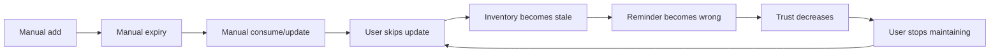
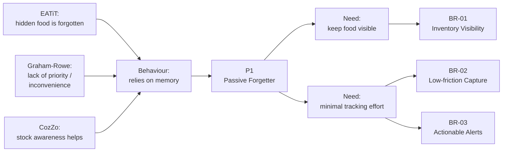
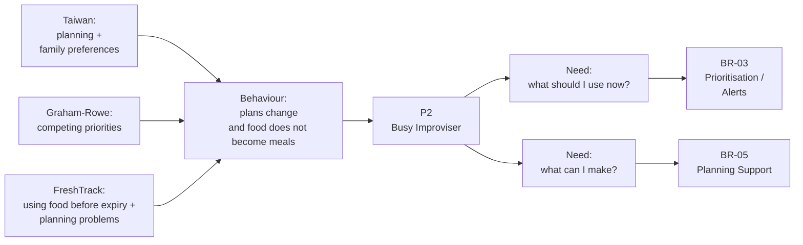
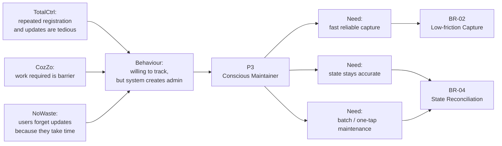
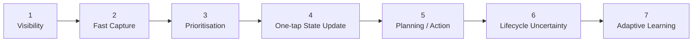

Được. Sau khi refine nguồn và BR hiện tại, t sẽ khóa cách làm như sau: **report/public interviews là evidence**, **persona là lớp synthesis**, và **business requirement phải trace ngược được về behaviour/need**. Không được lấy persona rồi tự suy ra feature như thể nhân vật hư cấu vừa gửi Jira ticket.

Nguồn business requirement hiện tại của nhóm là [System Engineering Gr2](https://docs.google.com/document/d/1js1KBfrVrgDn9EVC4_sNGIvUlWQNlLRC66nyTeAvBmA/edit?usp=drivesdk).

## 1. Full research → persona → business requirement diagram

```mermaid
flowchart TD

    %% =========================
    %% SOURCE LAYER
    %% =========================

    subgraph S["1. EVIDENCE SOURCES"]
        S0["Internal Report
        System Engineering Gr2

        Existing BRs
        + competitor bottlenecks"]

        R1["R1 — TotalCtrl
        6 students
        2 apps × 1 month
        pre/post interviews"]

        R2["R2 — CozZo / LOWINFOOD
        52 households
        3 countries
        3–6 weeks
        interviews + FW audit"]

        R3["R3 — Taiwan Study
        27 household food providers
        in-depth interviews"]

        R4["R4 — Graham-Rowe
        15 food purchasers
        semi-structured interviews"]

        R5["R5 — EATiT!
        7 young adults
        shared households
        10-day deployment"]

        UX["UX precedents
        SensiFi / NoWaste / FreshTrack
        Persona + design inspiration only"]
    end


    %% =========================
    %% OBSERVED FINDINGS
    %% =========================

    subgraph F["2. REPEATED USER FINDINGS"]
        F1["F1 — Visibility problem
        Food becomes mentally invisible"]

        F2["F2 — Maintenance friction
        Registration + update is work"]

        F3["F3 — Planning problem
        What should I buy / cook / use?"]

        F4["F4 — Perishability uncertainty
        Is this still usable?
        When should I act?"]

        F5["F5 — Competing priorities
        Food management loses
        against convenience / time"]

        F6["F6 — State mismatch
        Physical inventory changes
        while digital inventory stays stale"]
    end


    R1 --> F1
    R1 --> F2
    R1 --> F6

    R2 --> F1
    R2 --> F2
    R2 --> F3
    R2 --> F4

    R3 --> F3
    R3 --> F4

    R4 --> F3
    R4 --> F5

    R5 --> F1
    R5 --> F5

    S0 --> F2
    S0 --> F6


    %% =========================
    %% BEHAVIOR AXES
    %% =========================

    subgraph D["3. BEHAVIOURAL DIMENSIONS"]
        D1["Inventory Awareness
        Low ↔ High"]

        D2["Maintenance Effort Tolerance
        Low ↔ High"]

        D3["Planning Orientation
        Reactive ↔ Planned"]

        D4["Decision Confidence
        Uncertain ↔ Confident"]
    end

    F1 --> D1
    F2 --> D2
    F3 --> D3
    F4 --> D4
    F5 --> D2
    F6 --> D2


    %% =========================
    %% PERSONAS
    %% =========================

    subgraph P["4. LITERATURE-GROUNDED PROTO-PERSONAS"]

        P1["P1 — Passive Forgetter

        Low awareness
        Low maintenance tolerance
        Reactive"]

        P2["P2 — Busy Improviser

        Medium awareness
        Low–medium effort tolerance
        Changing plans"]

        P3["P3 — Conscious Maintainer

        High awareness
        Willing to organise
        but frustrated by admin"]
    end

    D1 --> P1
    D2 --> P1

    D2 --> P2
    D3 --> P2
    D4 --> P2

    D1 --> P3
    D2 --> P3
    D3 --> P3


    %% =========================
    %% NEEDS
    %% =========================

    subgraph N["5. USER NEEDS / JTBD"]

        N1["N1 — Keep relevant food
        visible without remembering it"]

        N2["N2 — Tell me what
        needs attention now"]

        N3["N3 — Turn existing food
        into a usable plan"]

        N4["N4 — Keep inventory accurate
        without repeated admin"]

        N5["N5 — Help me decide
        whether / when to act"]

        N6["N6 — Resolve state
        immediately after an action"]
    end

    P1 --> N1
    P1 --> N2

    P2 --> N2
    P2 --> N3
    P2 --> N5

    P3 --> N4
    P3 --> N5
    P3 --> N6


    %% =========================
    %% BUSINESS REQUIREMENTS
    %% =========================

    subgraph BR["6. USER-CENTRIC BUSINESS REQUIREMENTS"]

        BR1["BR-01
        Maintain useful
        inventory visibility"]

        BR2["BR-02
        Minimise capture
        and data-entry effort"]

        BR3["BR-03
        Prioritise and alert
        at actionable moments"]

        BR4["BR-04
        Low-friction state
        reconciliation"]

        BR5["BR-05
        Support planning
        and use decisions"]

        BR6["BR-06
        Represent lifecycle /
        perishability uncertainty"]

        BR7["BR-07
        Learn from feedback
        without increasing burden"]
    end

    N1 --> BR1
    N2 --> BR1
    N2 --> BR3

    N3 --> BR5

    N4 --> BR2
    N4 --> BR4

    N5 --> BR3
    N5 --> BR6

    N6 --> BR4
    N6 --> BR7


    %% =========================
    %% SYSTEM CAPABILITIES
    %% =========================

    subgraph C["7. FUNCTIONAL CAPABILITIES"]

        C1["Fast add
        barcode / OCR / defaults"]

        C2["Use Now / Soon / Later"]

        C3["One-tap:
        Used / Discarded /
        Still have / Freeze"]

        C4["Batch cleanup"]

        C5["Recipe / meal /
        usage suggestions"]

        C6["Expiry confidence
        + editable dates"]

        C7["Reminder preferences
        + adaptive timing"]
    end

    BR1 --> C2

    BR2 --> C1

    BR3 --> C2
    BR3 --> C3

    BR4 --> C3
    BR4 --> C4

    BR5 --> C5

    BR6 --> C6

    BR7 --> C7


    %% =========================
    %% METRICS
    %% =========================

    subgraph M["8. VALIDATION METRICS"]

        M1["Capture completion
        + time to add"]

        M2["Stale-record rate"]

        M3["Relevant-action rate"]

        M4["False / ignored
        reminder rate"]

        M5["Time to resolve item"]

        M6["Waste quantity/value
        before vs after"]

        M7["Continued usage /
        notification-disable rate"]
    end

    C1 --> M1

    C3 --> M2
    C4 --> M2

    C2 --> M3
    C3 --> M3

    C7 --> M4

    C3 --> M5

    BR1 --> M6
    BR5 --> M6

    BR2 --> M7
    BR7 --> M7
```



Đây là toàn bộ logic cần nhớ:

```text
SOURCE
→ OBSERVED BEHAVIOUR
→ BEHAVIOURAL DIMENSION
→ PERSONA
→ NEED
→ BUSINESS REQUIREMENT
→ FUNCTION
→ METRIC
```

Persona **không phải điểm bắt đầu**.

---

# 2. Evidence layer đang nói điều gì?

R1 TotalCtrl là source product-specific mạnh nhất. Sáu sinh viên dùng hai app liên tiếp trong hai tháng; study dùng pre/post semi-structured interviews. TotalCtrl làm users chú ý inventory hơn, nhưng users phàn nàn registration quá manual, barcode không nhận thì phải gõ lại, expiry phải nhập, và sau khi ăn vẫn phải quay lại update inventory. :chatgpt-content-reference{index="0"}

R2 CozZo mạnh hơn về ecological validity: **52 households ở Austria, Finland và Greece dùng app 3–6 tuần**, có interview, questionnaire và food-waste audit. Strengths gồm awareness về stock, expiring items và planning; challenges gồm lượng work required, khó estimate spoilage và perceived value của app. :chatgpt-content-reference{index="1"}

R3 Taiwan không phải app study, nhưng rất tốt để hiểu underlying behaviour. 27 household food providers được interview sâu; study tìm thấy các vấn đề như đánh giá edibility, planned purchasing, giữ food fresh, family preferences và leftover management. :chatgpt-content-reference{index="2"}

R4 Graham-Rowe interview 15 household food purchasers và tìm thấy các barrier như **minimising inconvenience**, lack of priority và food-management capability. Đây là support độc lập cho cái TotalCtrl/CozZo observe trong app: nếu việc quản lý quá phiền, người dùng sẽ không duy trì nó. :chatgpt-content-reference{index="3"}

R5 EATiT! nhỏ hơn, nhưng rất trực tiếp với visibility: 7 young adults sống trong shared households dùng prototype 10 ngày. Pre-interview có participant nói food bị quên vì nằm phía sau fridge; study cũng thấy peripheral reminder giúp users nhớ available food tốt hơn. Chính tác giả thừa nhận sample và duration nhỏ, nên nó support **mechanism**, không support population prevalence. :chatgpt-content-reference{index="4"}

SensiFi, NoWaste và FreshTrack chỉ dùng như UX precedent. SensiFi tạo behavioral archetypes từ awareness × action; NoWaste derive persona từ 5 interviews và thấy inventory update tốn thời gian; FreshTrack phỏng vấn 6 users và tìm thấy expiry, planning và tracking là recurring problems. :chatgpt-content-reference{index="5"}

---

# 3. Từ reports → 5 findings chính

## F1. Visibility problem

Evidence:

```text
EATiT
food hidden at back of fridge
→ forgotten

CozZo
stock awareness is useful

TotalCtrl
registration raises awareness of personal stock
``` :chatgpt-content-reference{index="6"}


Do đó user need không phải:

> “I need an expiry database.”

Mà là:

> **“I need relevant food to remain visible in my attention before it becomes useless.”**

Từ đó sinh:

**BR-01 Maintain useful inventory visibility.**

---

# 4. F2. Maintenance friction

Đây là finding mạnh nhất.



TotalCtrl report đúng chain giữa registration và repeated update burden. CozZo cũng report “amount of work required” là challenge; Graham-Rowe độc lập tìm thấy inconvenience là barrier. :chatgpt-content-reference{index="7"}

Current internal report của m cũng observe đúng symptom:

> update rườm rà → user không xóa → system đầy stale items → notification sai.

Nhưng internal report là observation từ reference app, không phải user interview. External studies mới làm nó có research backing.

Từ đó:

> **Need: Maintain a useful representation of inventory without repeated administrative work.**

Sinh ra:

**BR-02 Minimise capture/data-entry effort.**

và

**BR-04 Low-friction state reconciliation.**

---

# 5. F3. Planning problem

Taiwan study cho thấy planned purchasing, family preferences và leftover management đều là phần của food-waste behaviour. Graham-Rowe cũng cho thấy food-management skill và conflicting everyday priorities quan trọng. FreshTrack interviews independently thấy users struggle với việc dùng groceries trước expiry và tạo household waste-management system. :chatgpt-content-reference{index="8"}

Cho nên:

```text
Knowing expiry
≠
knowing what to do
```

Một app nói:

> “Chicken expires tomorrow.”

mới giải quyết information.

Người dùng còn cần:

> “Vậy tối nay dùng nó như thế nào?”

Từ đó:

**BR-05 Support planning and use decisions.**

---

# 6. F4. Perishability / decision uncertainty

CozZo users gặp challenge trong việc estimate spoilage; Taiwan respondents report lack of knowledge in assessing whether food is edible. :chatgpt-content-reference{index="9"}

Nên:

```text
expiryDate = 2026-10-03
```

không phải lúc nào cũng là perfect truth.

Đặc biệt fresh produce có thể không có printed expiry.

Do đó hệ thống cần phân biệt:

```text
known date
estimated date
opened date
user-confirmed date
unknown
```

Từ đó:

**BR-06 Represent lifecycle/perishability uncertainty.**

Requirement này hiện document của nhóm **chưa có**, nhưng research support khá mạnh.

---

# 7. F5. Competing priorities

Graham-Rowe tìm thấy minimising inconvenience và lack of priority là barriers. EATiT cố tình thiết kế peripheral interaction để không continuously demand focused attention. :chatgpt-content-reference{index="10"}

Điều này dẫn tới một principle cực quan trọng:

> **Food-management app không được đòi người dùng trở thành food-inventory administrator.**

Value của app phải xuất hiện với interaction cost thấp.

---

# 8. Persona synthesis

T sẽ không dùng lại ba persona cũ `Cost-Driven Pragmatist / Convenience-First Forgetter / Safety Manager` nguyên xi nữa.

Sau evidence audit, ba proto-persona hợp lý hơn là:

| Dimension | P1 Passive Forgetter | P2 Busy Improviser | P3 Conscious Maintainer |
|---|---|---|---|
| Awareness | Low–medium | Medium | High |
| Tracking effort tolerance | Low | Low–medium | Medium–high |
| Planning | Reactive | Variable | Planned |
| Inventory accuracy | Low | Medium | Wants high |
| Main failure | Forgets items | Plans change / cannot use food | Admin burden |
| Core value | Visibility | Decision support | Efficiency |
| Main risk | Never maintains app | Reminder without action | Stops because maintenance is tedious |

Đây là **literature-grounded proto-personas**, không phải “Vietnamese validated personas”.

---

# 9. P1 → Passive Forgetter

Evidence lineage:



JTBD:

> **When food is likely to disappear from my attention, help me notice what requires action without requiring me to continuously maintain a list.**

P1 không cần “more inventory features”.

P1 cần ít interaction hơn.

---

# 10. P2 → Busy Improviser



JTBD:

> **When my original meal plan changes, help me turn the food I already own into the next useful action before it becomes waste.**

Đây là lý do reminder cần đi từ:

```text
EXPIRY INFO
```

sang:

```text
EXPIRY INFO
+
PRIORITY
+
ACTION
```

---

# 11. P3 → Conscious Maintainer



JTBD:

> **When I actively manage household food, help me keep the system accurate without requiring repeated item-by-item administration.**

---

# 12. Trace toàn bộ BR hiện tại của nhóm

Đây mới là bảng quan trọng nhất.

## BR-01 hiện tại

> **Quản lý vòng đời tự động: Fresh → Warning → Expired.**

### Evidence trace

```text
EATiT
visibility of perishability
+
CozZo
stock + expiring-item awareness
+
Taiwan
uncertainty about edibility
        ↓
Users need lifecycle attention
        ↓
BR supported
```

Nhưng:

```text
Fresh → Warning → Expired
```

không được research support như một canonical model.

Nó là **solution choice của team**.

Refine thành:

> **BR-01 — The system shall maintain a useful representation of product lifecycle and make items requiring attention visible to the user.**

Với food, UI có thể map thành:

```text
Normal
Soon
Action Due
Resolved
```

thay vì claim một sản phẩm objectively “Fresh”.

Status: **PARTIALLY SUPPORTED → REFRAME.**

---

# 13. BR-02 hiện tại

> **Tự động hóa dữ liệu đầu vào, giảm manual input.**

Đây là BR mạnh nhất trong report.

Trace:

```mermaid
flowchart LR
    R1["TotalCtrl:
    barcode fails
    → manual typing
    → expiration typing"]

    R2["CozZo:
    work required
    is a challenge"]

    R7["NoWaste:
    update is time-consuming"]

    S0["Internal bottleneck:
    repeated item operations"]

    R1 --> N["Need:
    minimum maintenance cost"]
    R2 --> N
    R7 --> N
    S0 --> N

    N --> BR["BR-02
    Minimise capture
    and entry effort"]
``` :chatgpt-content-reference{index="11"}


Refined wording:

> **The system shall minimise repeated data entry by reusing reliable product information, defaults and assisted capture while keeping uncertain values easy to verify or edit.**

Status: **STRONGLY SUPPORTED.**

---

# 14. BR-03 hiện tại

> **Cảnh báo đúng thời điểm, hạn chế notification không cần thiết.**

Research support:

EATiT cho thấy reminder trong peripheral attention có thể tăng awareness; CozZo users đánh giá expiry reminder và awareness of expiring stock là useful aspects. :chatgpt-content-reference{index="12"}

Nhưng research **không nói “3 days before at 8 PM” là đúng**.

Đó phải test.

Nên refined BR:

> **BR-03 — The system shall prioritise items that require attention and provide notifications only when the message is relevant and connected to an immediate user action.**

Notification:

```text
Milk
Use soon

[Used]
[Freeze]
[Still have]
```

tốt hơn:

```text
Milk expires tomorrow.
```

Status: **SUPPORTED AT PRINCIPLE LEVEL; TIMING NEEDS VALIDATION.**

---

# 15. BR-04 hiện tại

> **Feedback Loop: ghi nhận behaviour và điều chỉnh cách nhắc trong tương lai.**

Ở đây report đang nhảy hơi xa.

Research mạnh support:

```text
state must be easy to update
```

nhưng **không mạnh support**:

```text
system should learn reminder timing automatically
```

Đó là solution hypothesis.

Vậy nên split:

### BR-04A

> **The system shall allow users to reconcile product state with minimal effort.**

Ví dụ:

```text
Used
Discarded
Still have
Opened
Freeze
```

Strongly supported bởi TotalCtrl + CozZo + internal bottleneck. :chatgpt-content-reference{index="13"}

### BR-04B

> **The system may use accumulated feedback to adapt future prioritisation or reminder timing while preserving user control.**

Status:

```text
BR-04A = STRONG
BR-04B = HYPOTHESIS / PHASE 2
```

---

# 16. Objective hiện tại: giảm 40% waste

Đây là chỗ phải sửa.

CozZo report average **43% reduction** trong 52 households. :chatgpt-content-reference{index="14"}

Nhưng TotalCtrl, với 6 participants, **không tìm thấy measurable reduction** trong food waste sau app trials. :chatgpt-content-reference{index="15"}

Đây là một contradiction rất hữu ích:

```text
CozZo
43% average reduction

VS

TotalCtrl
no measurable effect
```

Do đó không được suy:

> “Research says apps reduce 40%, vậy requirement của ta là 40%.”

Correct treatment:

> **40% = target hypothesis, not acceptance criterion.**

Refine:

> Establish a baseline waste quantity/value and evaluate the percentage change after a defined field-use period.

Sau pilot mới lock threshold.

Status: **CURRENT 40% UNSUPPORTED AS A GUARANTEED KPI.**

---

# 17. Objective hiện tại: 100% warranty opportunities

Đây phải tách khỏi persona/report hiện tại.

Research corpus này là:

```text
household food
inventory
expiry
planning
food waste
```

Không có evidence đủ cho:

```text
electronics
failure
warranty
consumer claims
```

Nên persona hiện tại **không trace được** tới objective này.

Status:

> **UNSUPPORTED BY CURRENT USER RESEARCH.**

Hoặc project phải làm separate research stream:

```text
Warranty user research
→ warranty persona/behaviour
→ warranty requirements
```

hoặc bỏ warranty khỏi MVP/persona scope.

Đây là một trong những issue lớn nhất của BR report hiện tại.

---

# 18. Objective hiện tại: >80% one-tap response

Research support:

```text
reduce update effort
one-tap interaction is reasonable
```

Nhưng:

```text
80%
```

không có nguồn nào support.

Nên chia:

Requirement:

> Users must be able to resolve common state changes in one interaction where practical.

Metric:

```text
notification action rate
state-resolution rate
stale-record rate
```

Threshold 80% chỉ set sau prototype baseline.

Status: **MECHANISM SUPPORTED, NUMBER UNSUPPORTED.**

---

# 19. Benefit: tài chính

TotalCtrl participants report saving personal food expenses là một motivation, và CozZo positions planning/stock management as useful. :chatgpt-content-reference{index="16"}

Nên:

> Reduce avoidable value loss and unnecessary purchasing.

được.

Nhưng:

> “Measure exactly money saved every month”

cần receipt/cost data, nên đó là functional/data requirement riêng.

Status: **SUPPORTED AS USER VALUE, MEASUREMENT TBD.**

---

# 20. Benefit: bảo vệ sức khỏe

Từ corpus interview hiện tại, cái này **không đủ evidence** để claim:

> “App prevents poisoning.”

Taiwan research support việc users uncertain về edibility, nhưng không test health outcome. :chatgpt-content-reference{index="17"}

Refine:

> **Support better-informed product-use decisions.**

Không:

> **Prevent food poisoning.**

Status: **OVERSTATED → REFRAME.**

---

# 21. Benefit: trải nghiệm đơn giản nhờ automation

Đây lại là strong.

TotalCtrl + CozZo + Graham-Rowe đều converge:

```text
maintenance work
+
inconvenience
=
adoption risk
``` :chatgpt-content-reference{index="18"}


Nên benefit này giữ:

> **Reduce cognitive and interaction cost of household food management.**

Status: **STRONGLY SUPPORTED.**

---

# 22. Business Requirement set sau khi refine

Nếu t viết lại canonical BR section cho report, t sẽ dùng thế này:

| ID | Business Requirement | Persona | Main evidence | Confidence |
|---|---|---|---|---:|
| **BR-01** | Maintain useful visibility of food and lifecycle attention | P1, P2 | CozZo, EATiT, TotalCtrl | High |
| **BR-02** | Minimise capture and repeated data-entry effort | P1, P3 | TotalCtrl, CozZo, NoWaste | **Very High** |
| **BR-03** | Prioritise items and deliver relevant, actionable reminders | P1, P2 | EATiT, CozZo | High |
| **BR-04** | Reconcile physical and digital inventory with minimal effort | P1, P3 | TotalCtrl, CozZo + internal bottleneck | **Very High** |
| **BR-05** | Support decisions about what to use, cook, freeze or buy | P2, P3 | Taiwan, Graham-Rowe, FreshTrack | High |
| **BR-06** | Represent uncertainty in expiry/perishability rather than pretending all dates are exact | P2, P3 | Taiwan, CozZo | High |
| **BR-07** | Use user feedback to improve prioritisation without adding maintenance burden | P3 | Derived from friction evidence; adaptive part not directly proven | Medium |
| **BR-08** | Support household/shared-state coordination where multi-user use is in scope | P2, P3 | EATiT shared household + CozZo households | Medium |

---

# 23. Requirements priority

Nếu đây là MVP, thứ tự evidence-driven là:



Tức là **Feedback Loop / adaptive learning không nên là core đầu tiên**.

Nếu inventory data đã stale thì learning algorithm chỉ đang học rất chăm từ dữ liệu sai. Một truyền thống lâu đời của phần mềm.

---

# 24. Traceability matrix cuối cùng

Đây là bảng m có thể bê thẳng sang System Engineering report:

| Evidence finding | Persona | User need | BR | Candidate implementation | Validation metric |
|---|---|---|---|---|---|
| Food disappears from attention | P1 | Keep food visible | BR-01 | Use Soon / priority dashboard | missed-item rate |
| Registration/update takes too much effort | P1/P3 | Low maintenance | BR-02 | barcode/OCR/defaults | add time, abandonment |
| Physical state changes while app stays unchanged | P1/P3 | Easy reconciliation | BR-04 | one-tap Used/Discarded + batch | stale-record rate |
| Expiry awareness can trigger action | P1/P2 | Know what needs action | BR-03 | actionable reminder | relevant-action rate |
| Planning/family preferences affect waste | P2 | Turn stock into meals/actions | BR-05 | recipe/use suggestion | items used before loss |
| Edibility/spoilage is uncertain | P2/P3 | Confidence in decision | BR-06 | confidence/source/editable date | correction/error rate |
| Users differ in motivation and effort | All | Personalized burden | BR-07 | reminder preferences first, adaptive later | disable/ignore rate |
| Shared households have ownership/visibility issues | P2/P3 | Shared state | BR-08 | household inventory / ownership | duplicate/stale conflicts |

---

## Kết luận để khóa architecture của research

Hiện giờ chain defend được nhất là:

```text
TOTALCTRL + COZZO + TAIWAN + GRAHAM-ROWE + EATIT
                    ↓
         repeated behavioural mechanisms
                    ↓
      Passive Forgetter
      Busy Improviser
      Conscious Maintainer
                    ↓
 visibility / planning / low maintenance / confidence
                    ↓
          BR-01 → BR-08
                    ↓
             system features
                    ↓
          observable metrics
```

Và có hai quyết định quan trọng:

**Thứ nhất**, food persona/research hiện tại **không support warranty requirement**. Warranty phải có research stream riêng hoặc bị loại khỏi MVP.

**Thứ hai**, `40% reduction`, `100% warranty`, `80% response` hiện là **target numbers của team**, không phải user-research-derived requirements. CozZo và TotalCtrl thậm chí cho kết quả outcome khác nhau, nên càng không được giả vờ các con số đó đã được validate. :chatgpt-content-reference{index="19"}

Đây là structure đủ chắc để từ giờ persona, user flow, use case, functional requirement và acceptance metric đều trace ngược được, thay vì mỗi artifact sống một đời riêng như các tài liệu project nhóm thường rất thích làm.