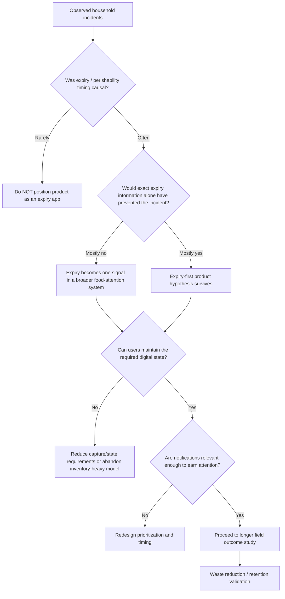
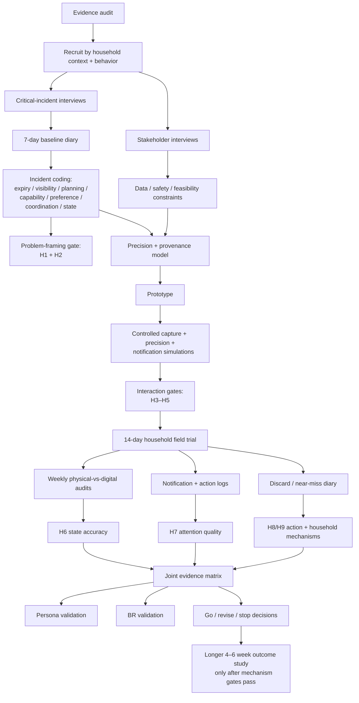
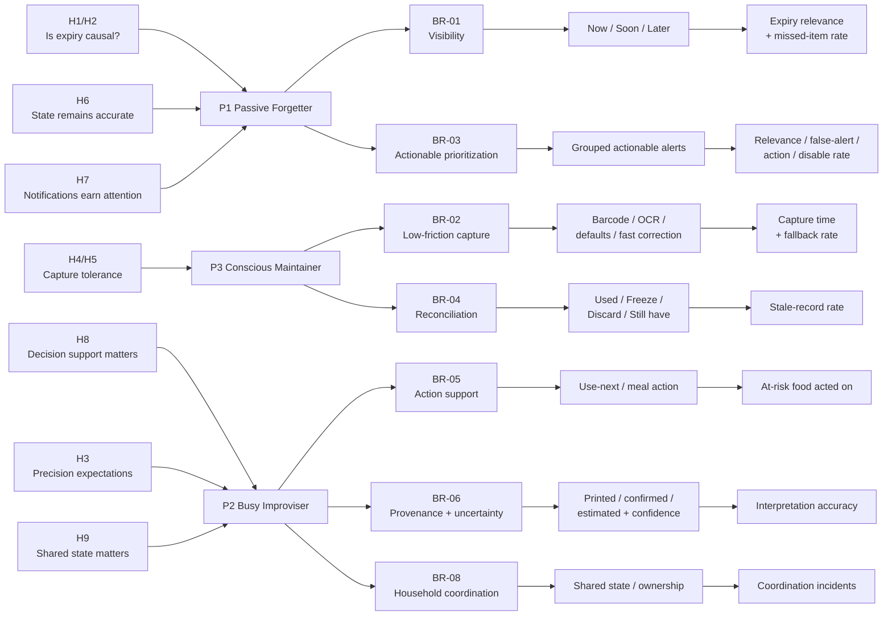

# User-Centric Research Plan and Evidence Audit for a Household-Food “Expiry” App

## Executive summary

The central research question should **not** be “How should we build an expiry tracker?” It should be:

> **When household food is wasted, forgotten, or used too late, how often is uncertainty about expiry/perishability actually causal—and how often is “expiry” only the visible symptom of an upstream problem such as food visibility, changed plans, household preferences, coordination, or the burden of maintaining inventory?**

The strongest public evidence does **not** support treating household food waste as a pure expiry-date problem. TotalCtrl shows that digital inventory systems themselves can create recurring work through registration and state updates; CozZo shows that users value stock/expiry awareness but experience workload and expiry estimation as barriers; the Taiwan qualitative study finds edibility knowledge, purchasing, family preferences, and leftovers matter; Graham-Rowe identifies inconvenience and competing priorities; and EATiT shows how food can disappear from awareness even while it physically remains in the refrigerator. citeturn23search9turn2view2turn16search9turn11search3turn2view3

Vietnam makes that reframing even more important. A 2026 study using primary survey data from **642 households in Ho Chi Minh City** found that intention to reduce waste did not significantly predict lower food waste, while cooking ability and understanding household food preferences were stronger predictors. Planning, storage, and leftover-handling practices were not significant overall in that urban sample. The authors specifically caution against transferring one-size-fits-all interventions across contexts. citeturn17search5

Therefore the product hypothesis should begin as:

> **Help households keep at-risk food visible and actionable before it loses usefulness, while requiring very little maintenance.**

“Expiry” may prove to be a key signal inside that system. The research should determine whether it deserves to be the **product identity**.

The current literature-grounded personas should likewise remain **proto-personas** until Vietnamese primary research confirms them:

| Proto-persona                 | Current behavioral hypothesis                                                                  | Primary risk to validate                                               |
| ----------------------------- | ---------------------------------------------------------------------------------------------- | ---------------------------------------------------------------------- |
| **P1 — Passive Forgetter**    | Relies on memory; food disappears from active awareness; low willingness to maintain a tracker | Will they capture/update anything consistently?                        |
| **P2 — Busy Improviser**      | Knows roughly what exists, but meal plans and schedules change                                 | Is expiry information sufficient, or do they need “what can I do now?” |
| **P3 — Conscious Maintainer** | Willing to organize food, but repeated entry/update work becomes administrative burden         | Can the system remain accurate without excessive maintenance?          |

The most important research decision gates are:



The proposed eight-week study is sufficient to validate **problem framing, interaction cost, state accuracy, date-precision expectations, and notification tolerance**. It is **not** sufficient to credibly claim a specific long-term food-waste reduction such as 40%. CozZo tested households for 3–6 weeks, while TotalCtrl participants used each tested app for one month; even these studies produced different outcome signals. citeturn2view2turn23search9

My recommendation is therefore to make the eight-week program a **mechanism-validation study**, not a marketing-impact study.

## Evidence audit and what can actually be trusted

### Trust rubric

The source grades below describe **how much weight each source should receive in your product decisions**, not whether the source is “good” or “bad.”

| Grade | Meaning | Appropriate use |
|---|---|---|
| **A** | Primary research with transparent methodology, credible publication venue, and direct relevance | Backbone evidence for behavioral mechanisms |
| **B** | Directly relevant real-world/HCI evidence but significant limitations in sample, duration, control, or publication detail | Strong supporting evidence; do not infer population prevalence |
| **C** | Self-published UX case study with at least some primary research disclosed | Hypothesis generation, UX precedent, interview/design inspiration |
| **D** | Sample/method cannot be adequately audited, source inaccessible, or project explicitly educational/conceptual | Do not use to substantiate a business claim |

A source can receive an **A** while still having a small sample. That means its method supports the existence of a mechanism; it does **not** mean six participants represent all users.

### Detailed source checklist

| Source                                                                                                                                                      | Sample and method                                                                                                                                                                                                                                                                                                                                                                                                                 | What the source actually supports                                                                                                                                                                                                                                                                                                                          | Important limitations                                                                                                                                                                                                                                                | Transferability to Vietnam                                                                                                                                                                             | Trust                                 |
| ----------------------------------------------------------------------------------------------------------------------------------------------------------- | --------------------------------------------------------------------------------------------------------------------------------------------------------------------------------------------------------------------------------------------------------------------------------------------------------------------------------------------------------------------------------------------------------------------------------- | ---------------------------------------------------------------------------------------------------------------------------------------------------------------------------------------------------------------------------------------------------------------------------------------------------------------------------------------------------------- | -------------------------------------------------------------------------------------------------------------------------------------------------------------------------------------------------------------------------------------------------------------------- | ------------------------------------------------------------------------------------------------------------------------------------------------------------------------------------------------------ | ------------------------------------- |
| **TotalCtrl / Too Good To Go — JMIR Formative Research** — [paper](https://formative.jmir.org/2022/9/e38520)                                                | **n=6 students**, mean age 24.7; crossover pilot. Participants evaluated two apps separately in random order, each for **one month**. Mixed quantitative/qualitative analysis; primary user-experience outcome obtained through semi-structured interviews. citeturn23search9turn23search0                                                                                                                                    | Direct evidence that an inventory-oriented food-waste app must be evaluated as an ongoing workflow, not a one-off usability task. Supports testing registration burden, updating after consumption, barcode/manual fallback, user experience, and whether app use actually changes waste/cost behavior. citeturn23search9                               | Extremely small sample; students; Norway; intervention not powered to estimate population effects. Any percentage prevalence derived from n=6 would be inappropriate.                                                                                                | **Medium.** Interaction-cost mechanisms can transfer; grocery frequency, fresh-food purchasing, shared-household behavior and food practices may not.                                                  | **A for mechanism; not prevalence**   |
| **CozZo / LOWINFOOD** — [Zenodo record](https://zenodo.org/records/14164532)                                                                                | **52 households** in Austria, Finland and Greece; app used in ordinary life for **3–6 weeks**. Avoidable food waste audited for one week before testing and the final week; experience collected via interviews and online questionnaires. citeturn2view2                                                                                                                                                                      | Very relevant evidence that stock visibility and awareness of expiring items can be useful, while **work required**, estimating expiry, and perceived added value are key barriers. The reported intervention period was associated with an average 43% reduction in food waste. citeturn2view2                                                         | Published as a conference proceeding/record rather than a full detailed controlled trial on the Zenodo page. The public description does not establish a randomized control condition, so the 43% should **not** be interpreted as “the app caused a 43% reduction.” | **Medium.** Real household deployment is valuable, but European purchase/storage routines may differ substantially from urban Vietnam.                                                                 | **B**                                 |
| **Taiwan household study** — [PMC full text](https://pmc.ncbi.nlm.nih.gov/articles/PMC8535035/)                                                             | **27 household food providers in Taipei/New Taipei.** Purposeful + snowball sampling; eligibility included age 18+, Taiwanese residency, responsibility for food purchasing/cooking. Three pilot interviews; main interviews averaged **90 minutes**, were recorded and transcribed verbatim. Content analysis, two-coder reliability >0.80, expert content-validity review and triangulation were reported. citeturn16search9 | Strong qualitative evidence that household waste is influenced by **assessing edibility**, purchasing routines, food-preservation knowledge, unexpected schedules, family preferences, leftovers, sharing and household communication. Lack of knowledge for assessing edibility was the most prominent coded barrier in this sample. citeturn16search9 | Qualitative, not prevalence-representative; mostly women aged 30–50 and predominantly family households; metropolitan Taiwan. Self-reported experiences.                                                                                                             | **Medium–High.** Urban East Asian household context is more relevant than many Western studies, but Vietnamese purchasing frequency, meal patterns and household roles still require local validation. | **A**                                 |
| **Graham-Rowe, Jessop & Sparks** — [DOI/article](https://doi.org/10.1016/j.resconrec.2013.12.005)                                                           | **15 UK household food purchasers**, qualitative semi-structured interviews. The study investigated motivations and barriers to minimizing household food waste. citeturn11search3turn11search24                                                                                                                                                                                                                              | Supports mechanisms including waste concern, “doing the right thing,” food-management capability, **minimizing inconvenience**, lack of priority and competing motivations. citeturn11search3                                                                                                                                                           | 2014; UK context; not a digital-product study; small qualitative sample. Social meanings such as “good provider” identity may be culturally dependent.                                                                                                               | **Medium.** Convenience/priority mechanisms are plausible, but exact motives and household roles need Vietnamese validation.                                                                           | **A**                                 |
| **EATiT!** — [ResearchGate publication](https://www.researchgate.net/publication/319628588_EATiT_Visualizing_expiry_dates_to_raise_awareness_of_food_waste) | **n=7**, ages 19–26, two shared households, **10-day deployment**; six participants male and all students. Semi-structured pre/post interviews; transcripts coded and clustered through affinity analysis, with additional coder involvement. citeturn2view3                                                                                                                                                                   | Particularly useful evidence for the **visibility mechanism**: food can be forgotten because it becomes visually/mentally absent; shared-household ownership is also relevant. Participants reported greater awareness of available/at-risk food. citeturn2view3                                                                                        | Tiny homogeneous sample; 10 days is short; prototype could not fully distinguish food/users; authors themselves identify short deployment and sample size as limitations. citeturn2view3                                                                          | **Medium for students/shared housing; Low for families.** Useful mechanism hypothesis, poor basis for prevalence.                                                                                      | **B**                                 |
| **SensiFi** — [case study](https://www.mansikasar.com/sensifi)                                                                                              | Self-published HCI/UX case. Public page describes **8 interviews**, residential/grocery observation and affinity mapping; later **8 think-aloud participants** completed four tasks. Survey was also used, but the public page does not make the survey sample size sufficiently clear. citeturn12view0                                                                                                                        | Useful precedent for behavioral segmentation based on **awareness × action**, and for UX problems involving unclear expiry/status wording, deletion and recovery. citeturn12view0                                                                                                                                                                       | Portfolio, not peer-reviewed research. Recruitment, survey n, raw codebook and full underlying data are not available for independent audit.                                                                                                                         | **Low–Medium.** Use the research structure and UX failure patterns, not the personas as Vietnamese user truth.                                                                                         | **C**                                 |
| **NoWaste redesign** — [reported portfolio URL](https://www.mingjungkuo.com/nowaste)                                                                        | **Unspecified in this audit.** The page could not be reliably recovered through the current source audit. Previous claims about participant count/persona should therefore not be treated as verified evidence.                                                                                                                                                                                                                   | At most, retain it as a candidate UX precedent until the research page can be independently inspected.                                                                                                                                                                                                                                                     | Critical methodological information currently unauditable.                                                                                                                                                                                                           | **Unknown.**                                                                                                                                                                                           | **D until verified**                  |
| **FreshTrack** — [case study](https://www.caitlin-harris.com/projects/freshtrack)                                                                           | Portfolio project; **6 Zoom interviews** with people who grocery-shop/cook; later **tree test with 10 users**. Project duration shown as about four weeks. citeturn12view2                                                                                                                                                                                                                                                     | Supports hypothesis generation around “use groceries before expiry,” tracking purchases and creating a workable household food-management system. Useful information-architecture precedent. citeturn12view2                                                                                                                                            | Self-published; n=6 interviews; demographic/recruitment information limited; no longitudinal household deployment.                                                                                                                                                   | **Low–Medium.** Use to cross-check questions/features, not establish Vietnamese requirements.                                                                                                          | **C**                                 |
| **Dapurbit** — [case study](https://fathia-anindya.com/DAPURBIT-CASE-STUDY.html)                                                                            | Explicitly described as a **fictional learning project**. In-depth interviews were reportedly conducted with target users, but the public page does **not specify the interview sample size**. citeturn12view3                                                                                                                                                                                                                 | Extremely useful as a **falsification precedent**: the designer began with a refrigerator-inventory concept, while interviews redirected attention toward meal planning, overbuying, changing schedules and forgotten ingredients. citeturn12view3                                                                                                      | Percent-like statements such as “majority” cannot be audited without n. Educational project; self-published; no field intervention.                                                                                                                                  | Geographic/cultural proximity to Southeast Asia is interesting, but methodological opacity dominates.                                                                                                  | **D as evidence; useful inspiration** |

### Vietnam calibration source

One source should sit **above the imported literature when deciding whether findings transfer to your target market**:

**Phan, Zeng & Zuo, 2026 — “Towards sustainable food consumption: understanding household food waste drivers for improved waste management in urban Vietnam.”** [Springer article](https://link.springer.com/article/10.1007/s10163-026-02516-4)

The study used primary survey data from **642 Ho Chi Minh City households**. Face-to-face data collection occurred in September–October 2023 across 50 residential clusters in 25 wards; the study used SEM to compare household food-waste pathways. Intention did not significantly predict reported food waste, while cooking ability and understanding family food preferences showed strong negative associations with waste. The study also found meaningful differences between households predominantly wasting ingredients versus cooked food. citeturn17search5

That does **not** prove an expiry application will fail in Vietnam.

It does mean this assumption is unsafe:

```text
European inventory/expiry problem
          ↓
same importance in Vietnam
          ↓
same digital intervention
```

The Vietnam evidence suggests the project should explicitly ask whether frequent urban purchasing, cooking capability, family preference mismatch and cooked-food waste make expiry tracking less central than foreign app research implies. citeturn17search5

The evidence hierarchy I would use in the final report is therefore:

```text
LOCAL VIETNAM PRIMARY EVIDENCE
Phan et al. 2026
                │
                ▼
PEER-REVIEWED BEHAVIORAL RESEARCH
Taiwan + Graham-Rowe
                │
                ▼
DIRECT DIGITAL FIELD RESEARCH
TotalCtrl + CozZo
                │
                ▼
FOCUSED HCI MECHANISM
EATiT
                │
                ▼
UX PRECEDENTS
SensiFi + FreshTrack
                │
                ▼
HYPOTHESIS GENERATORS ONLY
Dapurbit + currently unaudited NoWaste
```

**Suggested visual for the presentation:** rather than a stock photo of someone holding a phone, photograph a real Vietnamese household refrigerator and annotate `visible`, `hidden`, `unknown owner`, `leftover`, `printed date`, and `no date`. That visual maps directly onto the research questions.

## Research questions and measurement framework

### What the research must decide

There are five decisions, in this order:

```text
Is "expiry" actually causal?
        ↓
What information is needed?
        ↓
How accurately must that information be represented?
        ↓
Can users capture and maintain it cheaply enough?
        ↓
Can the system intervene without becoming notification noise?
```

Do **not** start by asking whether participants “like an expiry app.”

That would validate the proposed solution instead of investigating the problem.

### Recruitment and screening questions

Screening should create behavioral diversity rather than recruit only people who already care about food waste.

| Priority | Screening question | Why it matters | Use |
|---|---|---|---|
| Critical | “Who usually buys groceries for your household?” | Establishes actual food-management responsibility | Include respondent if responsible for all or a meaningful share |
| Critical | “Who usually decides what gets cooked/eaten?” | Buyer and decision-maker may differ | Recruit both types |
| Critical | “How many meals per week are prepared at home?” | Determines exposure to household-food lifecycle | Ensure active household-food users |
| Critical | “How often do you buy fresh groceries: daily, several times/week, weekly, less often?” | Especially important given HCMC’s urban acquisition patterns. citeturn17search5 | Stratification variable |
| Critical | “In the last two weeks, did your household throw away edible or probably-edible food?” | Supplies recent incidents | Do not exclude low-waste households; stratify |
| High | “How often are you unsure whether food in your home is still usable?” | Tests perishability uncertainty | Behavioral variable |
| High | “How often do you check printed dates before using food?” | Separates date-reliant from condition/context-reliant users | Behavioral variable |
| High | “Do other people add, move, cook or consume food in your household?” | Tests state ownership/shared inventory | Recruit meaningful multi-person cohort |
| High | “How do you currently remember what needs to be used?” | Finds analog/digital workarounds | Do not require app usage |
| Medium | “Have you used a food inventory, meal planning or expiry app?” | Identifies experience bias | Aim for majority non-users |
| Medium | Household composition / children / age band | Context, not persona definition | Quota balancing |
| Medium | Refrigerator/freezer availability and smartphone OS | Field feasibility | Operational |

Do **not** screen on:

> “Would you use an expiry app?”

That belongs nowhere near participant eligibility.

### Highest-priority critical-incident interview questions

The first half of the interview should contain **no prototype** and ideally no mention of the proposed solution.

| Priority | Prompt | What it tests | Evidence generated |
|---|---|---|---|
| **P0** | “Tell me about the last food item you threw away even though you originally expected to eat it. Start from when it entered your home.” | Actual failure journey | Event timeline |
| **P0** | “At what point did this item become likely to be wasted?” | Root cause vs symptom | Failure point |
| **P0** | “When did you last remember that the item existed?” | Visibility | Awareness break |
| **P0** | “Did it have a printed date? Did that date play any role in what happened?” | Expiry causal relevance | Expiry involvement |
| **P0** | “Suppose you had known the exact date from the day you bought it. Would the outcome have changed?” | Whether precise expiry is sufficient | Counterfactual |
| **P0** | “Tell me about something you almost wasted but managed to use in time. What caused you to notice it?” | Successful naturally occurring intervention | Positive trigger |
| **P0** | “What food in your fridge are you least sure about right now?” | Present uncertainty rather than recall | Live uncertainty |
| **P0** | “For that item, what information would allow you to decide what to do?” | Needed information | Decision model |
| **P0** | “Tell me about the last time your meal plan changed unexpectedly. What happened to ingredients already bought?” | Planning/schedule mechanism | Plan disruption |
| **P0** | “Tell me about food another household member bought, moved or used without you knowing.” | Multi-user state mismatch | Coordination |
| **P1** | “Tell me about the last leftover you kept. How did you remember when it was made?” | Opened/cooked lifecycle | Non-package date |
| **P1** | “How do you decide whether vegetables, fruit, cooked food or leftovers are still usable when there is no printed date?” | Estimated perishability | Decision heuristics |

The crucial interviewer follow-up pattern is:

```text
What happened?
      ↓
What did you know at that moment?
      ↓
What did you do?
      ↓
Why?
      ↓
What happened next?
      ↓
What single change could have altered the outcome?
```

The interviewer should actively distinguish:

```text
"I forgot the expiry date"
```

from:

```text
"I forgot the item existed"
```

Those are **different product problems**.

### Questions testing required expiry precision

User preference must not be allowed to override food-safety requirements. For printed safety-sensitive date information, the product should preserve the source label rather than invent a more convenient estimate. Research should instead establish where users genuinely need exactness versus where an honest estimate/range is more useful.

Test four categories separately:

| Scenario | Research question |
|---|---|
| **Printed date exists** | “Would you need the app to display the exact printed date, or only ‘use soon’?” |
| **Best-quality style date** | “Does seeing the exact date change what you do compared with seeing ‘use soon’?” |
| **Undated produce** | “Would `likely 2–4 days remaining` be more or less trustworthy than a single predicted date?” |
| **Leftovers/opened items** | “Is knowing when it was opened/cooked more important than a predicted expiry date?” |

Then use controlled comparisons:

```text
Condition A: "Expires Oct 4"
Condition B: "Use within ~2 days"
Condition C: "Likely 1–3 days; estimated"
Condition D: "Needs attention now"
```

Ask after each:

1. What would you do?
2. How confident are you in the information, 1–5?
3. Is the information precise enough to act?
4. Do you interpret it as a safety statement or an attention recommendation?
5. What additional information would change your decision?

The last question is essential. It detects whether users accidentally interpret an estimate as a guarantee of safety.

### Capture tolerance task simulation

Give every participant the **same realistic ten-item grocery basket**:

| Item type | Purpose |
|---|---|
| Packaged yogurt with barcode + printed date | Best-case capture |
| Milk/carton | Common dated item |
| Packaged meat | High sensitivity to data correctness |
| Sauce already opened | Needs opened-state |
| Two fresh vegetables | No standard package expiry |
| Fresh fruit | Estimated perishability |
| Frozen product | Storage-state difference |
| Bakery item | Short lifecycle |
| Leftover container | No barcode/product record |

Run at least two counterbalanced workflows:

**A — assisted capture:** barcode/OCR/default where possible.

**B — manual fallback:** enough manual fields to make the item actionable.

Record:

```text
Start capture
    ↓
identify item
    ↓
date / lifecycle information
    ↓
storage/state
    ↓
save
```

Then simulate:

> “It is two days later. You ate the yogurt, froze the meat, half the fruit is gone, and another household member finished the milk. Update the app.”

That second task is at least as important as initial capture.

TotalCtrl and CozZo both give good reasons to test **maintenance**, not merely onboarding. citeturn23search9turn2view2

### Notification tolerance questions and simulation

Do not ask:

> “How many notifications would you like?”

People are poor at predicting attention behavior abstractly.

Give concrete notification candidates:

| Example | Variable under test |
|---|---|
| “Milk needs attention tomorrow.” | Simple warning |
| “3 foods need attention today: milk, spinach, chicken.” | Batching |
| “Chicken should be used soon — Cook / Freeze / Still have” | Actionability |
| “You still have spinach?” | State reconciliation |
| “Nothing urgent today.” | Whether silence has value |
| “This item may need attention in 2–4 days; estimate only.” | Uncertainty |
| Reminder repeated after no action | Escalation tolerance |

For each ask:

> “If this arrived at 18:00 on a real weekday, what would you actually do?”

Then measure behavior in the field rather than trusting the answer.

### Stakeholder questions

Stakeholder interviews should **not** be used to validate personas. They answer feasibility, data provenance, safety and business constraints.

Recommended stakeholder roles are a food-safety/food-science expert, grocery retailer or e-commerce operator, packaging/barcode/data specialist, household-food-waste researcher, and optionally a consumer behavior expert.

| Stakeholder question | Decision affected |
|---|---|
| “Which date information is actually available at product, batch, receipt or item level?” | Capture architecture |
| “Where will barcode scanning identify only the product and not the specific date?” | Automation expectations |
| “For which categories should the application never generate an apparently exact date from an estimate?” | Risk/precision model |
| “How should the UI distinguish printed data, user-entered data and estimated data?” | BR-06 |
| “Which information would create an unsafe interpretation if presented poorly?” | Wording / guardrails |
| “What grocery data could realistically be obtained from digital receipts or retailer integrations in Vietnam?” | Capture feasibility |
| “Which waste categories are operationally worth focusing on first?” | MVP scope |
| “What assumptions about European household food management should not be transferred to Vietnam?” | Localization |

### Diary prompts

A **seven-day baseline diary** should precede prototype use.

Participants should not log their entire life. Trigger diary entries only on meaningful events.

For every discard, near-miss or uncertain-food decision:

1. What item?
2. What happened?
3. When did it enter the household, approximately?
4. Did it have a printed date?
5. Did you know or check that date?
6. When did you last remember/see it?
7. Why was it not used as originally expected?
8. What decision did you make: eat, cook, freeze, keep, share, discard?
9. What information triggered the decision?
10. Could an earlier reminder realistically have changed the outcome?
11. Optional photo.
12. If discarded, weigh it where feasible.

Also trigger a lightweight entry for:

> “I used something specifically because I realized it might go bad.”

Those **success incidents** reveal natural reminder mechanisms.

### Operational measurement definitions

The project should lock these definitions before collecting data.

| Metric | Definition | Why |
|---|---|---|
| **Expiry-relevance rate** | `incidents in which timing/date/perishability uncertainty contributed ÷ all avoidable discard/near-miss incidents` | Tests whether “expiry” is genuinely central |
| **Expiry-sufficiency rate** | `expiry-relevant incidents participant says exact date alone would likely have prevented ÷ expiry-relevant incidents` | Distinguishes expiry problem from broader action problem |
| **Capture time** | Time from starting item capture until an actionable record is saved | Entry burden |
| **Steady-state capture time** | Median capture time excluding participant’s first practice item | Removes learning distortion |
| **Manual fallback rate** | `items requiring manual correction/addition ÷ items participants attempt to capture` | Automation quality |
| **Capture completion** | `successfully saved actionable items ÷ attempted items` | Reliability |
| **State-update time** | Time from intent to record consumption/freezing/discard/opening until state saved | Maintenance burden |
| **Stale-record rate** | `digitally active records whose physical state is no longer correct ÷ audited active records` | Critical inventory-health metric |
| **Missing-record rate** | `physically relevant foods absent digitally ÷ relevant foods observed in audit` | Captures under-tracking |
| **Notification relevance** | Notification rated ≥4/5 for “this deserved my attention at that time” | Perceived quality |
| **False-alert rate** | Alerts for items already gone, incorrectly represented, or clearly not actionable | Trust |
| **Notification action rate** | `notifications followed by explicit relevant action within defined window ÷ delivered actionable notifications` | Behavior, not opinion |
| **Notification disable/mute rate** | Participants disabling or substantially suppressing notifications during trial | Attention cost |
| **Manual-entry tolerance** | Observed continuation of manual correction during field use **plus** post-trial willingness to continue | Better than stated preference alone |
| **Avoidable discard mass** | Weight of food judged by participant as originally intended for consumption but ultimately discarded | Outcome direction |
| **Incident prevention rate** | At-risk items that receive a timely intervention and subsequently avoid discard ÷ tracked at-risk items | Mechanism outcome |

This distinction matters:

```text
Notification opened
        ≠
useful notification
        ≠
food used
        ≠
food waste reduced
```

They must never be reported as the same metric.

## Hypotheses and decision gates

The following thresholds are **proposed research gates**, not universal industry standards. They are deliberately explicit so the team cannot later redefine “success” after seeing results.

### Testable hypothesis set

| ID | Hypothesis | Proposed acceptance criterion | Reject / reconsider when | Product consequence |
|---|---|---|---|---|
| **H1 — Expiry relevance** | Timing/date/perishability is a substantial causal factor in household at-risk food events | **≥40%** of coded avoidable discard/near-miss incidents include timing, date or perishability uncertainty as a contributing cause | <30% | Drop “expiry” as primary positioning; broader food-management framing |
| **H2 — Expiry is not sufficient** | Even when expiry matters, exact date alone is often insufficient | In **≥50% of expiry-relevant incidents**, another mechanism—visibility, plan change, preference, capability, coordination or stale state—is also required to explain failure | <30% have other mechanisms | A simple expiry reminder may be a viable narrow product |
| **H3 — Exact vs uncertain data** | Users require exact fidelity for printed dates but tolerate explicit ranges for undated perishables | ≥90% task success interpreting copied printed dates; **≥70%** accept clearly marked date ranges/confidence for undated produce without mistaking them for guarantees | Range is consistently interpreted as precise safety information or rejected by most users | Restrict estimates or redesign uncertainty representation |
| **H4 — Capture affordability** | Assisted capture can become cheap enough to repeat | Steady-state median **≤12 s** for easily scannable packaged items; **≤25 s** for manual fallback; 10-item mixed basket **≤3 min** median; ≥90% task completion | Whole-trip median >5 min or significant abandonment | Inventory-heavy MVP at risk |
| **H5 — Manual entry is fallback, not default** | Users tolerate small correction work but not manual maintenance for every item | Manual correction needed for **≤20%** of captured packaged items; ≥70% of field users actually complete necessary corrections; task abandonment <10% | Manual correction becomes common or users systematically leave missing values | Need retailer/OCR integration, reduced data model or narrower tracking |
| **H6 — Digital state can remain believable** | Users can maintain sufficiently fresh inventory state | Median household stale-record rate **≤10%** at weekly audit; 75th percentile ≤15%; one-tap state-update success ≥90% | Median stale rate >20% | Do not build sophisticated recommendations on inventory state |
| **H7 — Notifications earn attention** | Prioritized alerts are sufficiently relevant to remain enabled | ≥80% alerts rated ≥4/5 relevant; false alerts **≤10%**; notification disable/mute ≤15%; ≥50% of high-urgency alerts receive relevant action/explicit resolution within 24 h | Relevance <65% or false alerts >20% | Redesign trigger logic before adding more notifications |
| **H8 — Action support matters** | Users need help converting expiring food into action, not merely seeing a date | ≥40% of waste/near-miss incidents include changed plan, “don’t know what to do with it,” preference mismatch or leftover-use problem | <20% | Keep planning/recipe support outside MVP |
| **H9 — Shared state matters** | Multi-person households materially contribute to state/visibility failures | ≥30% of participants in multi-person households report and demonstrate at least one coordination/ownership/state incident during diary period | <15% | Household sharing can remain Phase 2 |
| **H10 — Mechanism before impact** | Strong process performance is necessary before a food-waste reduction claim is credible | H4–H7 pass before setting a large waste-reduction target | State/capture/notification mechanisms fail | Do not use “40% waste reduction” as a product acceptance criterion |

The thresholds should be treated as **pre-registered team decisions**. After a small instrument pilot, they can be changed once—**before** the main study starts—not after results are known.

### Why H1 and H2 are separate

Consider this incident:

```text
Chicken had one day remaining
        +
user knew it was urgent
        +
meeting ran late
        +
meal plan changed
        +
chicken remained behind other items
        ↓
discard
```

Expiry is relevant.

But this does **not** mean:

```text
better expiry date
        ↓
problem solved
```

H1 measures whether expiry belongs in the problem.

H2 measures whether expiry **defines** the problem.

The local HCMC evidence gives strong reason to make this distinction because household food waste pathways differ by waste type, and practical capabilities/preferences were more predictive than intention in the 642-household study. citeturn17search5

### Required precision should be modeled as provenance, not one global accuracy number

The underlying data model should distinguish:

```text
LIFECYCLE INFORMATION
│
├── PRINTED
│   └── copied from package
│
├── USER CONFIRMED
│   └── explicitly corrected / entered
│
├── DERIVED
│   └── e.g. opened_at + known rule
│
└── ESTIMATED
    └── uncertain prediction / expected quality window
```

A better prototype object would therefore resemble:

```text
attention_date
source = printed | user | derived | estimated
confidence = exact | high | medium | low
meaning = package_date | opened_at | estimated_quality_window
```

rather than:

```text
expiryDate = 2026-10-04
```

for everything.

That becomes **BR-06: represent uncertainty and provenance**, not just a UI label.

### Manual-entry tolerance must be behavioral

Do not use:

> “70% said manual entry is fine.”

A participant can easily say that after entering two demo items.

The stronger criterion is:

```text
said acceptable
        +
completed it during realistic basket task
        +
continued correcting data during 14-day field trial
```

Only the intersection counts as real tolerance.

That directly responds to the maintenance problems surfaced in TotalCtrl and CozZo. citeturn23search9turn2view2

## Mixed-method validation study

### Study architecture



### Recommended sample

The study is intended to validate mechanisms and personas, **not estimate national prevalence**.

| Component | Minimum viable | Preferred | Purpose |
|---|---:|---:|---|
| User discovery interviews | 18 | **24** | Behavioral mechanisms |
| Contextual fridge/pantry walkthroughs | 12 | **18–24** | Visibility/state evidence |
| Stakeholder interviews | 4 | **5–6** | Data feasibility, safety, ecosystem constraints |
| Seven-day baseline diary | 15 households | **20–24 households** | Real incidents before prototype |
| Controlled task simulation | 18 | **24** | Capture/precision/notification gates |
| Fourteen-day field trial | 18 households | **24–30 households** | Maintenance and notification behavior |
| Post-field interview | All trial households if feasible | All | Explain quantitative behavior |

Do not recruit “8 of each persona.”

That would presuppose that your personas are valid.

Recruit by **observable context**, then see whether persona-like behavioral clusters emerge.

### Recruitment quotas for Vietnam

For a first study, keep geography relatively constrained—ideally HCMC—so context does not explode before the core mechanics are understood. The 2026 HCMC study provides a strong local comparison point. citeturn17search5

For a preferred n=24 discovery sample:

| Context | Target |
|---|---:|
| Student / young-professional single or shared household | ~8 |
| Couple / multi-adult household without children | ~8 |
| Household with children / primary household food manager | ~8 |

Within those, deliberately vary:

- frequent/daily versus weekly grocery purchasing;
- high versus low reliance on printed dates;
- self-reported recent food discard versus low-discard households;
- single-person versus shared food ownership;
- low versus high willingness to organize food;
- app-experienced versus app-naïve participants.

These are **sampling dimensions**, not personas.

### Interview structure

A 60-minute user interview should roughly follow:

| Stage | Time | Content |
|---|---:|---|
| Warm-up/context | 5 min | Household roles, food acquisition/cooking |
| Critical incidents | 20 min | Last discard, near-miss, saved-in-time event |
| Live walkthrough | 10 min | Fridge/pantry uncertainty and ownership |
| Date/edibility reasoning | 10 min | Printed date, produce, opened item, leftovers |
| Current workarounds | 5 min | Notes, memory, fridge organization, lists |
| Solution exposure | Last 10 min only | Concept reactions, not feature pitching |

Starting the prototype earlier contaminates the most important part of the interview.

### Baseline diary

Use a seven-day diary because a longer burden before the prototype risks attrition while a shorter period may miss enough grocery/cooking cycles.

Provide each household:

- a simple mobile diary form;
- optional photo upload;
- ideally a small digital kitchen scale for discarded edible food;
- a consistent item/category taxonomy;
- reminders to report **events**, not an end-of-week recollection.

A good diary entry should take less than about a minute.

Fields:

```text
Timestamp
Item
Acquired when?
Printed date? yes/no/unknown
What happened?
Why did it happen?
Did you remember the item existed?
Did a plan change?
Who made the decision?
Action
Approx. quantity / weight if discarded
Could an earlier intervention have changed this?
Photo optional
```

### Prototype task session

The controlled session should test **mechanisms separately** before field deployment.

**Capture block:** ten-item mixed basket.

**Precision block:** exact date vs range vs confidence/provenance wording.

**State-reconciliation block:** consume/freeze/open/discard scenarios.

**Notification block:** batched versus individual and information-only versus actionable alerts.

**Planning block:** given three near-risk foods, ask participant to decide what to do next.

Record:

- completion;
- time;
- errors;
- corrections;
- abandoned fields;
- assistance requested;
- single-ease rating after each task;
- trust rating for uncertain data;
- notification relevance/action intention.

### Field trial

Run the prototype for **14 days**.

The purpose is:

> Can this mechanism survive real life?

Not:

> Did we solve food waste permanently?

Collect automatically where possible:

```text
item_added
capture_method
capture_duration
date_corrected
item_opened
item_used
item_frozen
item_discarded
item_deleted
notification_delivered
notification_opened
notification_action
notification_dismissed
notification_snoozed
settings_changed
notifications_muted
```

Never treat `notification_opened` as success.

### Physical–digital state audit

At approximately day 7 and day 14, perform an inventory audit.

For each digitally active item determine:

```text
Correct and present
Present but state/date wrong
Already consumed/discarded but still active
Duplicate
Cannot verify
```

And for visible relevant physical items:

```text
Tracked
Not tracked
```

That generates:

\[
StaleRate =
\frac{IncorrectActiveDigitalRecords}
{AuditedActiveDigitalRecords}
\]

and

\[
MissingRate =
\frac{RelevantPhysicalItemsNotTracked}
{RelevantPhysicalItemsObserved}
\]

These metrics are more important than raw “items added.”

### Analysis plan

Qualitative analysis should start from incidents, not persona labels.

Create an incident codebook:

```text
VIS = visibility / forgot item
EXP = date / perishability uncertainty
PLAN = changed plan / schedule
PREF = household preference mismatch
CAP = cooking / use capability
OVER = overpurchase / portion
COORD = household coordination
STATE = digital/physical mismatch
FRIC = interaction/maintenance burden
OTHER = emergent
```

At least two researchers should independently code a subset—around 20–25% is a practical project target—then reconcile definitions before coding the remainder.

For every incident allow **multiple causal codes**.

Otherwise you will falsely force:

```text
expiry OR planning OR visibility
```

when the actual system is often:

```text
expiry AND planning AND visibility
```

Quantitative analysis should emphasize **medians, distributions and household-level proportions**, not only averages. For small n, report bootstrap confidence intervals where useful and avoid pretending the field study estimates all Vietnamese users.

The most important mixed-method analysis is a joint display:

| Participant | Incident mechanism | Interview statement | Observed task behavior | Field behavior | Persona cluster | BR implication |
|---|---|---|---|---|---|---|

That lets the team catch contradictions such as:

```text
Interview:
"I don't mind entering dates."

Task:
20 seconds/item.

Field:
stops entering dates on day 4.
```

The **field behavior wins**.

### Persona validation rule

A persona should survive only if it explains meaningful behavioral differences.

For example:

**Passive Forgetter** survives if a recognizable cluster shows:

```text
low inventory awareness
+
high visibility incidents
+
low tracking tolerance
+
strong response to low-effort prioritization
```

**Busy Improviser** survives if a separate cluster shows:

```text
reasonably aware of food
+
frequent schedule/plan disruption
+
need for action/meal decisions
rather than mere reminders
```

**Conscious Maintainer** survives if another cluster shows:

```text
high desire for inventory accuracy
+
consistent tracking attempts
+
maintenance burden becomes limiting factor
```

If the data does not separate that way, delete or merge the personas.

Personas are outputs of research, not members of the team that cannot be fired.

## Traceability from hypotheses to business requirements

### Refined business-requirement backbone

The literature and proposed local validation support these candidate BRs:

**BR-01 — Useful food visibility**  
The system should help users maintain awareness of food requiring attention.

**BR-02 — Low-friction capture**  
The system should minimize recurring work required to create actionable food records.

**BR-03 — Actionable prioritization**  
The system should prioritize food based on when user attention/action is useful rather than simply showing a database.

**BR-04 — Low-friction reconciliation**  
The system should allow physical-world changes to be reflected digitally with minimal interaction.

**BR-05 — Action/use support**  
Where validated, the system should help transform at-risk ingredients into an actionable next step.

**BR-06 — Honest lifecycle uncertainty**  
The system should preserve lifecycle-data provenance and distinguish exact/confirmed data from estimates.

**BR-07 — Notification control/adaptation**  
The system should optimize reminder timing/frequency while preserving explicit user control.

**BR-08 — Household coordination**  
Where validated, the system should support shared ownership/state across household members.

The logic from evidence to implementation should look like:



### Full traceability matrix

| Hypothesis | Persona hypothesis | User need | Business requirement | Prototype feature | Primary validation metric | Decision |
|---|---|---|---|---|---|---|
| **H1 Expiry relevance** | P1, P2, P3 | Know when food actually requires attention | **BR-01** | At-risk / Use Soon view | Expiry-relevance rate | If <30%, stop positioning product around expiry |
| **H2 Expiry insufficient** | P1, P2 | Solve the complete failure mechanism | BR-01 + **BR-05** | Priority + contextual action | Co-occurring causal mechanisms | If exact date is sufficient in most cases, simplify MVP |
| **H3 Precision/provenance** | P2, P3 | Understand what is known versus estimated | **BR-06** | Date source + confidence/range | Interpretation correctness; trust | If estimates are misunderstood, remove or redesign |
| **H4 Capture affordability** | P1, P3 | Track without administrative burden | **BR-02** | Barcode/OCR/default capture | Median capture time; completion | If >5 min/10 items, inventory model at risk |
| **H5 Manual fallback** | P1, P3 | Correct exceptions without maintaining everything manually | BR-02 | Fast correction / minimum fields | Fallback rate; field completion | If fallback dominates, invest in automation or reduce data |
| **H6 State accuracy** | P1, P3 | Trust that app approximately matches kitchen reality | **BR-04** | One-tap Used / Freeze / Discard / Still Have; batch review | Stale-record rate | >20% median = major architecture problem |
| **H7 Notification relevance** | P1, P2 | Be interrupted only when action is worthwhile | **BR-03**, BR-07 | Grouped actionable notifications | Relevance, false alert, action, disable | Fail before adding personalization/AI |
| **H8 Action support** | P2 | Turn at-risk food into the next useful action | **BR-05** | “Use next”; meal/use suggestions | Share of incidents involving planning/use barrier; subsequent action | If low incidence, defer recipes/planning |
| **H9 Shared household state** | P2, P3 | Avoid unknown ownership, duplicates and invisible consumption | **BR-08** | Shared household inventory/activity | Coordination/state incidents | If rare, Phase 2 |
| **H10 Mechanism before outcome** | All | Receive reliable value repeatedly | All MVP BRs | Instrumented MVP | H4–H7 collectively | Waste-reduction KPI comes later |

### MVP architecture implied by the research

The evidence does **not yet** justify this:

```text
Barcode
→ expiry database
→ notification
→ done
```

A defensible prototype is:

```text
CAPTURE
   ↓
minimum useful state
   ↓
PRIORITIZE
   ↓
what needs attention?
   ↓
ACTION
eat / cook / freeze / keep
   ↓
RECONCILE
physical state → digital state
   ↓
LEARN
only after data quality is acceptable
```

This means the likely early information architecture is:

```text
HOME
├── Needs attention
├── Soon
└── Later

ITEM
├── What is it?
├── What do we actually know?
│   ├── printed
│   ├── user confirmed
│   └── estimated
├── Why is it being surfaced?
└── What can I do?
    ├── Used
    ├── Freeze
    ├── Still have
    └── Discard
```

Not:

```text
HOME
└── giant inventory spreadsheet
```

The strongest digital studies give a clear reason: inventory visibility can be useful, but maintaining that inventory can itself become a barrier. citeturn23search9turn2view2

## Eight-week roadmap and deliverables

### Research roadmap

| Week | Main work | Decision/milestone | Deliverable |
|---|---|---|---|
| **Week 1** | Finalize evidence audit; translate research questions; recruit participants/stakeholders; build coding taxonomy; create diary and consent materials | Research assumptions frozen before seeing local data | **Research protocol v1**, source audit, screener, interview guide, diary template, hypothesis registry |
| **Week 2** | Pilot 2–3 interviews; correct leading questions; conduct first ~10–12 user interviews; 2–3 stakeholder interviews | Confirm incident interview produces concrete events | **Pilot report**, revised interview guide, initial incident map |
| **Week 3** | Complete ~24 user interviews; contextual fridge walkthroughs; remaining stakeholder interviews; begin seven-day baseline diary | Enough raw evidence for early causal coding | Interview repository, transcripts/notes, stakeholder constraints |
| **Week 4** | Complete baseline diary; code incidents; affinity mapping; calculate H1/H2 early results; challenge the three proto-personas | **Problem framing gate:** Is “expiry” central enough? | **Problem-definition report**, incident taxonomy, persona v1/merge/delete decision, BR revision |
| **Week 5** | Build instrumented prototype; run ~24 capture/date/notification simulations | H3–H5 interaction gate | Usability dataset, capture-time distribution, precision findings, prototype v2 |
| **Week 6** | Begin 14-day field trial; monitor event logging; avoid intervening unless support/safety issue | Real workflow begins | Week-one field telemetry, participant issue log |
| **Week 7** | Continue field trial; day-7/day-14 inventory audits; collect discard/near-miss events | H6/H7/H8/H9 mechanism gate | State-accuracy dataset, notification dataset, diary dataset |
| **Week 8** | Post-trial interviews; mixed-method synthesis; persona clustering; BR traceability; go/revise/stop review | Final mechanism decision | **Research report**, validated/rejected hypotheses, evidence-backed personas, final BR matrix, MVP scope, next-study plan |

### Milestone logic

By the end of **Week 4**, you should be able to answer:

> Is this genuinely an expiry problem?

If not, change the product definition **before** investing heavily in the expiry architecture.

By the end of **Week 5**:

> Can enough information be captured cheaply and represented honestly?

If not, reduce the information model.

By the end of **Week 7**:

> Can the digital state remain accurate enough to make reminders trustworthy?

If not, do not add personalization or “AI prediction.”

By the end of **Week 8**:

> Which behavioral clusters genuinely exist in Vietnamese households, and which business requirements survive evidence?

Only then should the personas be presented without the **proto-** qualifier.

### Expected research deliverable stack

The final research package should contain:

| Artifact | What it proves |
|---|---|
| **Evidence audit** | Which prior claims are trustworthy and transferable |
| **Incident repository** | Raw local evidence behind findings |
| **Causal mechanism map** | Expiry vs visibility vs planning vs capability vs coordination |
| **Problem-definition decision** | Whether “expiry” remains the correct framing |
| **Persona evidence cards** | Which incidents/behaviors support each persona |
| **Task benchmark report** | Capture/update/precision feasibility |
| **Inventory state audit** | Whether digital state stays trustworthy |
| **Notification quality report** | Whether alerts earn attention |
| **Hypothesis decision log** | Pass / fail / inconclusive for H1–H10 |
| **Traceability matrix** | Evidence → need → persona → BR → feature → metric |
| **MVP requirement document** | Only features supported by surviving hypotheses |
| **Research gaps register** | What still requires longer-term validation |

### What this eight-week plan should not claim

It should **not** conclude:

> “The app reduces food waste by 40%.”

CozZo observed an average 43% reduction over its intervention, but that finding comes from its own design/context and the public record does not justify transferring the number to a new Vietnamese product. citeturn2view2

It should also not infer guaranteed impact from TotalCtrl: its sample was only six students, despite the useful month-long crossover exposure for understanding workflow. citeturn23search9

The eight-week deliverable should instead be able to make statements such as:

> **“Expiry/perishability contributed to X% of observed discard and near-miss incidents, but exact expiry information alone was sufficient in only Y%.”**

> **“Assisted capture required a median of X seconds/item; manual correction occurred in Y% of items.”**

> **“After fourteen days, the median household stale-record rate was X%.”**

> **“Y% of alerts were judged relevant, Z% were false because the physical item state had already changed, and N% caused a relevant action.”**

> **“Three behavioral clusters did/did not reproduce the current Passive Forgetter / Busy Improviser / Conscious Maintainer proto-personas.”**

Those results create a defensible evidence chain:

```text
PUBLIC RESEARCH
        ↓
LOCAL INCIDENTS
        ↓
CAUSAL MECHANISMS
        ↓
TESTABLE HYPOTHESES
        ↓
OBSERVED BEHAVIOR
        ↓
VALIDATED PERSONA
        ↓
USER NEED
        ↓
BUSINESS REQUIREMENT
        ↓
PROTOTYPE CAPABILITY
        ↓
MEASURABLE ACCEPTANCE CRITERION
```

That is the point where the project becomes genuinely user-centric rather than an expiry-app concept with research attached afterward.

For the presentation, the strongest visual sequence would be: **a real household-fridge photo → incident journey map → causal mechanism Sankey/affinity map → behavioral-cluster plot → persona cards → requirement traceability diagram → instrumented prototype screenshots → field metrics dashboard**. The real-fridge and incident visuals should come from your Vietnamese study rather than stock imagery; that turns the final deck itself into evidence of the research process.