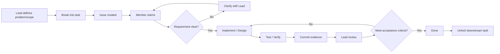

[S0] Context confidence: High

Tách đúng ra thì hiện tại m không định làm kiểu “chia nguyên project rồi ai tự bơi” nữa. M đang chuyển sang mô hình lead theo task: m giữ scope, architecture, sequencing và acceptance; thành viên nhận issue nhỏ, làm đúng output rồi commit. Cách này hợp với tình trạng hiện tại hơn nhiều, vì nếu quăng “làm database/API đi” thì con người có tài năng biến 4 từ đó thành 17 cách hiểu khác nhau. 

## [S1] Bản raw message để gửi nhóm

> T nói rõ lại cách làm từ bây giờ để đỡ bị lệch requirement như đợt trước.
>
> Trong lúc dev, t sẽ không chia nguyên một phần lớn cho từng người rồi để tự xử lý nữa. T sẽ tạo task dưới dạng issue, chia nhỏ theo từng output cụ thể. Tụi m tự claim task về làm.
>
> Một task chỉ được tính là hoàn thành khi:
> - đúng requirement/output đã ghi trong issue;
> - hoàn thành trước deadline;
> - có commit trên Git;
> - code đúng convention của project;
> - test được trên branch `dev`.
>
> Nếu task chưa rõ requirement hoặc chưa hiểu output cần trả ra là gì thì hỏi ngay. Nếu không hỏi, không discuss, rồi làm ra output khác requirement thì t xem task đó chưa hoàn thành.
>
> Ngược lại, nếu requirement t đưa ra không đủ rõ thì phần đó là lỗi của t. T sẽ clarify hoặc sửa lại requirement.
>
> Về communication:
> - t giao/define task;
> - Kiệt hiểu thì truyền lại đúng requirement cho Đạt;
> - không hiểu thì hỏi lại t;
> - Đạt có vấn đề hoặc Kiệt giải thích không được thì quay lại t, t giải thích chung;
> - không phản hồi/react trong vòng 24h thì t xem như chưa keep track task/project và sẽ xử lý lại task.
>
> Những kiến thức nền như Git commit, pull, PR, API là gì, database là gì... thì tự research trước. Không cần t dạy lại từng khái niệm.
>
> Cái cần hỏi t là:
> 1. task này giải quyết vấn đề gì;
> 2. input là gì;
> 3. output cần trả ra cái gì;
> 4. acceptance condition là gì;
> 5. task này nối với phần nào của system.
>
> Từ giờ đến thứ 4, Kiệt và Đạt trao đổi với Linh để hiểu project hiện tại đang làm gì, đã có gì và đang thiếu gì.
>
> Thứ 4 họp online. Trước buổi họp ít nhất phải nắm được:
> - app giải quyết problem gì;
> - actor/user là ai;
> - user flow chính;
> - dữ liệu nào đi qua từng flow;
> - project hiện có gì và còn thiếu gì.
>
> Hai project System Engineering và Advanced Web sẽ được quản lý riêng, nhưng dùng chung domain và cùng một cách làm.
>
> Với System Engineering, tụi m cần đi từ:
>
> `User Flow → Technical Flow → API Contract → Database`
>
> T sẽ lead project, define scope/task và làm UX/UI. Phần API endpoint và database sẽ được t chia thành các task nhỏ để tụi m làm, chứ không ném nguyên subsystem cho tụi m.
>
> Với Advanced Web, project sẽ tiếp tục từ phần technical implementation:
>
> `Request → Validation/Middleware → Controller → Query/Database → Response`
>
> cộng với API và những phần đã học trên lớp.
>
> System Engineering phải cố gắng đi trước để chốt domain, flow, rule, data và API contract càng sớm càng tốt. Những output đó sau đó có thể được reuse khi làm Advanced Web.
>
> Mục tiêu không phải là ai code nhiều hơn ai. Mục tiêu là mỗi task có owner, deadline, output và evidence rõ ràng.
>
> Nếu thấy t đánh giá sai, scope sai, requirement chung chung hoặc cách làm có vấn đề thì nói thẳng lúc discuss để giải quyết luôn.

---

## [S2] Definition chuẩn cho cách m đang lead

Hai project **không phải một project duy nhất**.

Chúng là:

```text
Shared Domain: Expiry App
        │
        ├── Project A: System Engineering
        │
        └── Project B: Advanced Web
```

Chúng reuse kiến thức domain, nhưng mỗi project có backlog, deadline, repo evidence và deliverable riêng. 

`Task`
= đơn vị công việc nhỏ nhất có thể assign/claim, verify và close.

Một task của m từ giờ phải có:

```text
Problem
→ Input
→ Expected Output
→ Owner
→ Deadline
→ Acceptance Criteria
→ Evidence
→ Status
```

`Acceptance Criteria`
= điều kiện kiểm chứng task đã thật sự đạt yêu cầu.

Ví dụ:

```text
Task: Design POST /items endpoint

Input:
Create Item user flow + Item data model

Output:
API contract

Acceptance:
- method/path defined
- request body defined
- validation rules defined
- success response defined
- error response defined
- related DB entities identified
```

Không còn loại task thần bí kiểu:

> “Làm API.”

Đó không phải task. Đó là một vùng đất chưa được quản lý.

---

# [S3] Operating model chung cho cả hai project

M nên giữ **cùng một project operating system**, chỉ thay backlog và project stage.



State owner:

```text
Project scope        → m
Priority             → m
Task definition      → m
Architecture         → m
Task execution       → task owner
Clarification        → m
Review/acceptance    → m
Git evidence         → contributor + repo
Progress tracking    → m
```

Điểm quan trọng là m không ownership luôn implementation.

M sở hữu **direction + integration + acceptance**.

---

# [S4] Project A: SYSTEM ENGINEERING

Đây là project phải chạy **ahead**.

Không phải vì nó “quan trọng hơn”, mà vì nó tạo ra upstream definitions mà downstream implementation cần.

Flow chuẩn đã thảo luận trước đó là: 

```text
Problem
↓
Stakeholders
↓
Business Requirements
↓
Functional / Non-functional Requirements
↓
Business Rules
↓
User Flow / Use Cases
↓
Technical Flow
↓
Data Model
↓
API Contract
↓
Architecture
↓
Verification
```

Với Expiry App, backbone system đang là: 

```text
Capture
→ Maintain State
→ Evaluate Expiry
→ Prioritize
→ Act
→ Reconcile
```

### Phase SE-1 — Understand system

Team phải hiểu được:

```text
Problem
Actors
Goals
Scope
User Flow
Business Rules
```

Output:

```text
System definition
Actor list
Main use cases
User flows
Rules
Glossary
```

Hiện đây là thứ m muốn Kiệt + Đạt + Linh hiểu trước cuộc họp thứ 4.

---

### Phase SE-2 — User Flow → Technical Flow

Ví dụ:

```text
User:
Add Item
    ↓
Enter item information
    ↓
Save
```

Không được dừng ở đây.

Phải chuyển tiếp thành:

```text
UI
↓
Submit CreateItem request
↓
Validate input
↓
Create item
↓
Persist item
↓
Calculate expiry state
↓
Return result
↓
Update UI
```

Đây chính là đoạn nối giữa System Engineering và software implementation.

---

### Phase SE-3 — Technical Flow → API Endpoint

Mỗi user action có side effect tới system mới xét API.

Ví dụ:

```text
Create item
POST /items

View items
GET /items

View item
GET /items/:id

Update item
PATCH /items/:id

Resolve/Delete item
DELETE /items/:id
```

Nhưng endpoint không được thiết kế bằng cách ngồi đoán REST cho vui.

Phải trace:

```text
User goal
→ task
→ interaction
→ data required
→ system behavior
→ endpoint
```

---

### Phase SE-4 — API → Database

Đây là phần m định delegate dần cho team.

Ví dụ:

```text
POST /items
       │
       ▼
Item
├── id
├── name
├── category_id
├── expiry_date
├── quantity
├── status
├── created_at
└── updated_at
```

Sau đó mới đi:

```text
Entity
→ Attribute
→ Relationship
→ Constraint
→ ERD
→ Schema
```

Không làm ngược kiểu:

> mở MySQL rồi tạo vài bảng trông có vẻ database.

---

### Phase SE-5 — Architecture + Traceability

Cuối cùng phải trace được:

```text
Requirement
   ↓
User Flow
   ↓
Technical Flow
   ↓
API
   ↓
Database
   ↓
Implementation
   ↓
Test
```

Cái này đặc biệt có lợi khi thầy hỏi:

> “Requirement này được implement ở đâu?”

M có đường dẫn trả lời, thay vì cả nhóm đồng loạt nghiên cứu trần nhà.

---

# [S5] Project B: ADVANCED WEB

Advanced Web dùng cùng domain Expiry App nhưng tập trung vào implementation.

Backbone:

```text
Client Request
→ Route
→ Middleware
→ Validation
→ Controller
→ Business Logic
→ Query
→ Database
→ Response
```

Đây cũng khớp với những phần m vừa học/tracing: controller, query, database, view/MVC và API.

### Phase AW-1 — Consume system definition

Không redefine domain lại từ đầu.

Reuse từ SE:

```text
Actors
Business rules
Core entities
User flows
Technical flows
API contracts
Database model
```

Nhưng chỉ reuse khi output đó đã đủ stable.

---

### Phase AW-2 — Route/API

Ví dụ:

```text
POST /api/items
GET /api/items
GET /api/items/:id
PATCH /api/items/:id
DELETE /api/items/:id
```

---

### Phase AW-3 — Validation + Middleware

```text
Request
↓
parse
↓
validate
↓
authorization/authentication nếu cần
↓
controller
```

`Middleware`
= logic chạy ở giữa request và controller.

Vai trò:

```text
validation
authentication
authorization
logging
error handling
```

Không nhét business logic vào middleware chỉ vì JavaScript cho phép. JavaScript cho phép rất nhiều thứ mà xã hội vẫn nên từ chối.

---

### Phase AW-4 — Controller

Controller chịu trách nhiệm orchestration:

```text
receive request
↓
read validated input
↓
invoke business/data operation
↓
produce HTTP response
```

Không nên biến thành:

```text
controller
= validation
+ SQL/Mongoose query
+ business logic
+ HTML
+ logging
+ mọi thứ từng được phát minh
```

---

### Phase AW-5 — Query / DB

Ví dụ:

```text
Controller
↓
Product.find(...)
↓
MongoDB
↓
documents
↓
Controller
↓
response/view
```

Đây chính là subsystem m đang trace ở Advanced Web hiện tại.

---

### Phase AW-6 — Integration

Cuối cùng:

```text
UI
↓
API
↓
Middleware
↓
Controller
↓
Query
↓
DB
↓
Response
↓
UI
```

---

# [S6] Điểm khác nhau thực tế của hai project

Architecture quản lý giống nhau. Stage khác nhau.

| | System Engineering | Advanced Web |
|---|---|---|
| Domain | Expiry App | Expiry App |
| Lead | m | m |
| Task model | Issue → Claim → Output → Review | Issue → Claim → Code → Test → Review |
| Main concern | What/Why/System | How/Implementation |
| Current direction | đi trước | đi sau SE |
| Input | problem/domain | SE definition |
| Main output | requirements, flow, API design, DB design | running backend/web implementation |
| UX/UI | m làm | implement theo UI |
| Team tasks | flow/API/DB nhỏ | middleware/controller/API/query nhỏ |
| Evidence | docs + diagrams + commits | code + tests + commits |
| Done | design internally consistent | functionality works |

---

# [S7] Hai backlog phải tách riêng

Đây là chỗ quan trọng nhất về mặt PM.

Không tạo:

```text
Expiry App backlog
```

rồi trộn cả hai môn.

Tạo:

```text
SE BACKLOG
SE-001 Define problem
SE-002 Define actors
SE-003 Review user flow
SE-004 Convert Add Item flow to technical flow
SE-005 Design Create Item API
SE-006 Design Item entity
SE-007 Create ERD
...
```

và:

```text
AW BACKLOG
AW-001 Setup backend structure
AW-002 Create Item model
AW-003 Create validation middleware
AW-004 Create POST /items controller
AW-005 Implement create-item query
AW-006 Integrate DB
AW-007 Test endpoint
...
```

Quan hệ giữa hai bên:

```text
SE-005 Design Create Item API
              │
              └── blocks → AW-004 Implement POST /items
```

Tức là cùng domain nhưng **không cùng task**.

---

# [S8] Progress model m nên dùng

M nói chính xác: hai project khác nhau chủ yếu ở **tiến độ**.

Vậy dùng chung lifecycle:

```text
0 Discovery
1 Definition
2 Flow
3 Technical Design
4 Data/API Design
5 Implementation
6 Integration
7 Verification
8 Final
```

Trạng thái hiện tại nên nhìn như thế này:

```text
SYSTEM ENGINEERING

Discovery        █████
Definition       █████
Flow             ████░
Technical Design ██░░░
Data/API Design  █░░░░
Implementation   ░░░░░
Verification     ░░░░░


ADVANCED WEB

Discovery        █████
Definition       ███░░
Flow             ██░░░
Technical Design ██░░░
Data/API Design  ██░░░
Implementation   ██░░░
Integration      ░░░░░
Verification     ░░░░░
```

Đây là **stage assessment**, không phải % completion chính xác. Chưa có đủ artifact hiện tại để tao giả vờ tính ra “63.7%” như một dashboard corporate đầy màu sắc.

Điểm chiến lược là:

```text
SE
──────────────► đi trước

        AW
        ──────────────► follow + implement
```

SE nên giữ khoảng **1 phase ahead** ở phần:

```text
Flow
→ rules
→ data
→ API contract
```

để Advanced Web không phải tự phát minh domain lần thứ hai.

---

# [S9] Cách m chia task từ bây giờ

Mỗi issue chỉ nên có format:

```text
[PROJECT] [TYPE] Task name

Problem:
Tại sao task tồn tại?

Context:
Nó nằm ở flow nào?

Input:
Task nhận gì?

Required Output:
Phải trả ra artifact/code gì?

Acceptance Criteria:
- ...
- ...
- ...

Dependencies:
Blocked by task nào?

Owner:
Unclaimed / @member

Deadline:

Evidence:
Commit / PR / Doc / Diagram / Test

Status:
TODO / CLAIMED / IN PROGRESS / REVIEW / DONE
```

Ví dụ SE:

```text
[SE][API] Design Create Item endpoint

Problem:
Add Item flow chưa có technical interface.

Input:
Approved Add Item user flow.

Required Output:
API contract cho create item.

Acceptance:
- HTTP method/path
- request schema
- validation
- success response
- error responses
- DB entities touched
```

Sau khi task này DONE mới mở:

```text
[AW][BACKEND] Implement Create Item endpoint
```

Đó mới là dependency management thật sự.

---

Tóm lại mô hình m đang hướng tới là:

```text
                    LEAD
                      │
         Scope / Priority / Architecture
                      │
          ┌───────────┴───────────┐
          ▼                       ▼
   SYSTEM ENGINEERING       ADVANCED WEB
   define system            implement system
          │                       ▲
          │ flow/rules/API/data   │
          └───────────────────────┘

Each project:
Backlog
→ Issue
→ Claim
→ Clarify
→ Execute
→ Evidence
→ Review
→ Done
```

M không cần “làm thay team” nữa. M cần đảm bảo **đúng problem được đưa xuống thành đúng task, đúng output, đúng dependency và có evidence**. Phần đó mới thực sự là vai trò lead ở cả hai project.