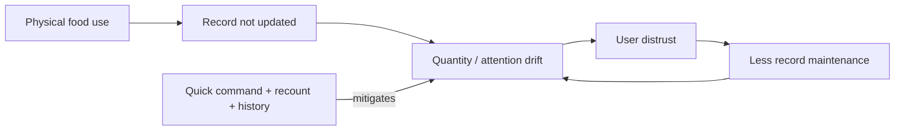

# DOC-IMPACTS — Consequence and trade-off analysis

- Document ID: `DOC-IMPACTS`
- Status: **Review**
- Updated: 2026-10-09T18:37:36+07:00

## Purpose

Project-specific impact artifact; not mislabeled standardized UML.

## Evidence sources

- [00-context/source-register.md](../00-context/source-register.md)

## Definitions and assumptions

[C] Các proposal dưới đây cần review trước implementation; không có nhãn Approved trong lần authoring này.

## Analysis

| ID | Action/decision | Immediate outcome [C] | Downstream user/system effect [C] | Mitigation [D] | Scope |
|---|---|---|---|---|---|
| IMP-01 | Wrong OCR field | Incorrect date/name proposed | User correction cost or wrong attention | Field-level preview + explicit confirmation; no OCR persistence | OCR research later |
| IMP-02 | Duplicate capture | Two separate entries may represent one stock | Double-counting / confusing priority | No silent merge; compare source/grain, user corrects | MVP scope review |
| IMP-03 | Unrecorded physical use | Digital quantity remains high | Stale attention and lower trust | Fast consume/recount + audit history | MVP core |
| IMP-04 | Soft delete | Record hidden; no physical quantity movement | Recoverability, but retention grows | Trash/restore; retention reviewed separately | MVP support |
| IMP-05 | Session expiry mid-edit | Write rejected, user input retained | Avoid lost work; cross-account draft leakage risk | Owner check after auth, refetch and explicit continuation | Auth gate |
| IMP-06 | Lost mutation response | Outcome uncertain | Blind retry can duplicate action | Stable key/body replay and latest-state refetch | API integrity |
| IMP-07 | Push delivery late | External reminder not seen | False reliance on background delivery | In-app review stays useful; instrument delivery if scope added | Later capability |
| IMP-08 | Independent Python service | Separate process/resources | Isolation benefit, deployment/network cost | Choose only from measured workload; timeout and fallback | Research Required |

The feedback cycle is a reasoned hypothesis from persona pain/record ownership, not measured abandonment rates.

## Decisions and rationale

[D] Giữ phạm vi food inventory cá nhân, manual capture và attention trong app theo source context. Approval kỹ thuật là riêng với việc kiểm tra cấu trúc tài liệu.

## Dependencies

- [02-challenges/needs-opportunities.md](../02-challenges/needs-opportunities.md)
- [08-architecture/components.md](../08-architecture/components.md)
- [17-python-ocr/integration-contract.md](../17-python-ocr/integration-contract.md)

## Open questions

Chốt các quyết định liên quan trong decision ledger trước khi đổi contract hoặc triển khai.

## Related documents

- [README.md](../README.md)
- [11-traceability/README.md](../11-traceability/README.md)
- [02-challenges/needs-opportunities.md](../02-challenges/needs-opportunities.md)
- [08-architecture/components.md](../08-architecture/components.md)
- [17-python-ocr/integration-contract.md](../17-python-ocr/integration-contract.md)

## Verification criteria

Đối chiếu nguồn, ID và downstream links; acceptance runtime chỉ được ghi pass sau khi thực chạy.
