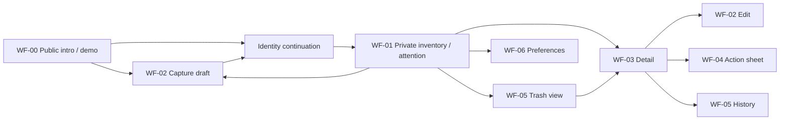

# DOC-NAV — Information architecture and navigation

- Document ID: `DOC-NAV`
- Status: **Review**
- Updated: 2026-10-09T18:37:36+07:00

## Purpose

Group tasks, model transitions and protected data without assuming router integration.

## Evidence sources

- [00-context/source-register.md](../00-context/source-register.md)

## Definitions and assumptions

[C] Các proposal dưới đây cần review trước implementation; không có nhãn Approved trong lần authoring này.

## Analysis

| Screen | Information | Actions/next |
|---|---|---|
| WF-00 Intro/demo + auth continuation | Preview không dùng dữ liệu riêng | Try add →WF-02; view own stock/auth→WF-01 |
| WF-01 Inventory/attention | Attention groups, reasons, search/location, all/depleted tab | Add→WF-02; item→WF-03; settings→WF-06 |
| WF-02 Add/edit | Name, amount/unit khi create, location, optional date/certainty/label/source/opened note | Save→WF-03; validation giữ form; cancel→trước đó |
| WF-03 Detail | Current amount/version/date context/attention reason | Use/discard/recount→WF-04; edit→WF-02; history→WF-05; remove record→dialog |
| WF-04 Action sheet | Action, amount/actual amount, reason khi recount; current quantity | Confirm→WF-03 updated; cancel→WF-03 |
| WF-05 History/trash | Read-only movement history; trash là view riêng cùng layout list | Restore→WF-03; back→WF-01 |
| WF-06 Settings | Timezone, attention lead | Save→WF-01 recompute; cancel→WF-01 |

### Proposed navigation network

Hierarchy: public intro; protected inventory/attention, detail/history, trash and preferences. Network is distinct from a goal-specific user flow. Current App uses local view/selectedId state and initial query params, so back/forward/deep link handling below is proposed, not observed.

| Path candidate [D] | Access | Data | Back/draft contract |
|---|---|---|---|
| / | Public | No real private records | Return without clearing existing draft |
| /inventory?view=inventory\|attention | Authenticated owner | Owner-scoped EntryList | Serialize filters/page; restore on back |
| /food-entries/:id | Authenticated owner | Owned detail | Back restores originating list/filter |
| /food-entries/:id/history | Authenticated owner | Read-only movements | Back to originating entry |
| /trash | Authenticated owner | Deleted records only | Restore returns entry; back retains trash context |
| /settings | Authenticated owner | Preferences | Save invalidates attention; cancel preserves current prefs |

Dirty form navigation [D]: ask keep/discard before losing user edits; auth continuation preserves draft and return target, checks same owner then refetches. Mobile sheet and desktop panel share command semantics. Cancel/back closes action without mutation. Empty/filter/error screens return to task through add/clear/retry rather than exposing all database tables.

## Decisions and rationale

[D] Giữ phạm vi food inventory cá nhân, manual capture và attention trong app theo source context. Approval kỹ thuật là riêng với việc kiểm tra cấu trúc tài liệu.

## Dependencies

- [09-user-flows/user-flows.md](../04-user-flows/user-flows.md)
- [09-advanced-web/state-and-integration.md](../09-advanced-web/state-and-integration.md)
- [07-api/authentication.md](../07-api/authentication.md)

## Open questions

Chốt các quyết định liên quan trong decision ledger trước khi đổi contract hoặc triển khai.

## Related documents

- [README.md](../README.md)
- [11-traceability/README.md](../11-traceability/README.md)
- [04-user-flows/user-flows.md](../04-user-flows/user-flows.md)
- [09-advanced-web/state-and-integration.md](../09-advanced-web/state-and-integration.md)
- [07-api/authentication.md](../07-api/authentication.md)

## Verification criteria

Đối chiếu nguồn, ID và downstream links; acceptance runtime chỉ được ghi pass sau khi thực chạy.
