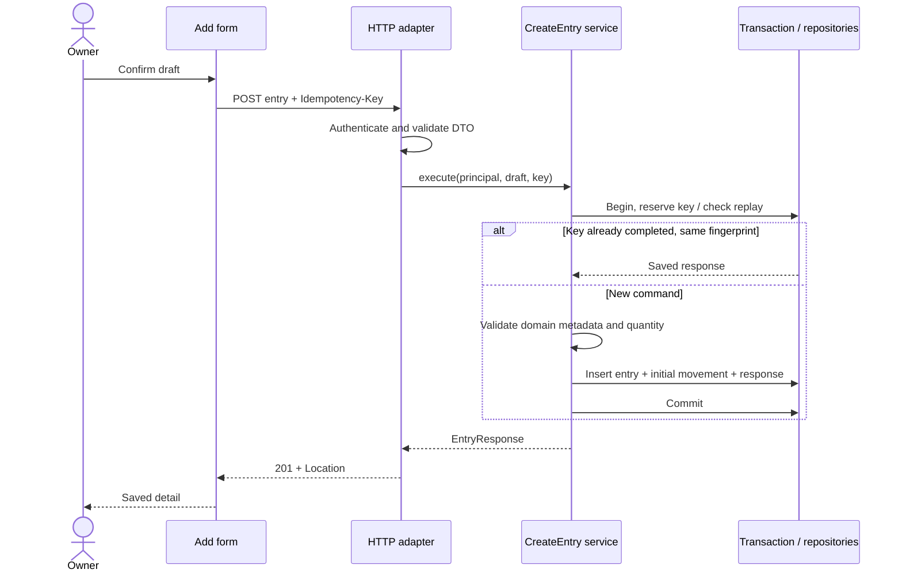
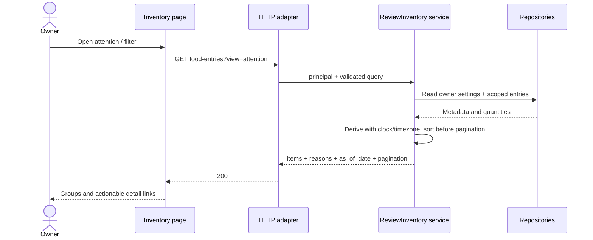
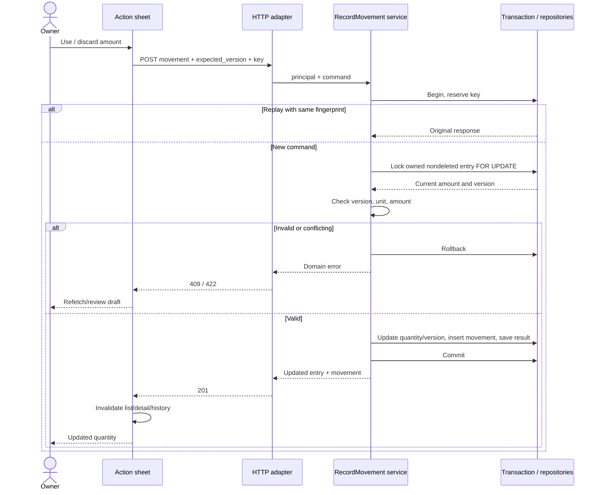
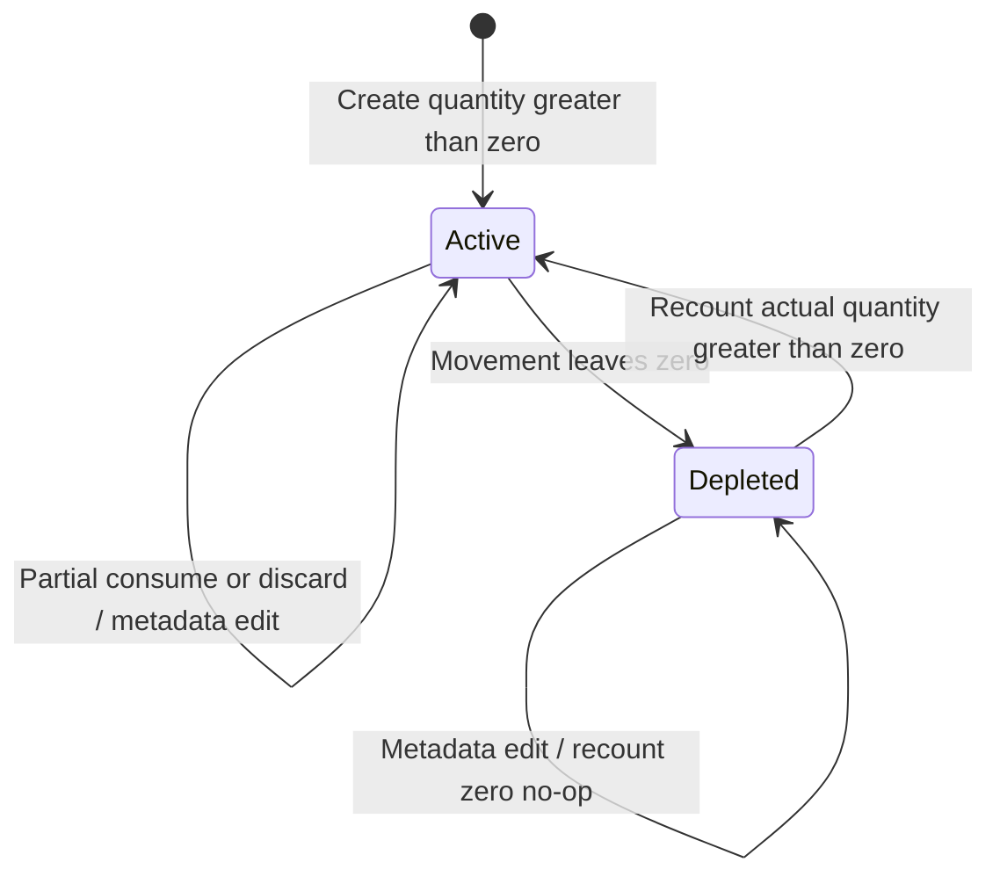

# DOC-SEQUENCES — Core capture, read and mutation sequences

- Document ID: `DOC-SEQUENCES`
- Status: **Review**
- Updated: 2026-10-09T18:37:36+07:00

## Purpose

Cross-owner request/effect/feedback boundaries with failure behavior.

## Evidence sources

- [00-context/source-register.md](../00-context/source-register.md)

## Definitions and assumptions

[C] Các proposal dưới đây cần review trước implementation; không có nhãn Approved trong lần authoring này.

## Analysis

Query must apply classification/order over the eligible set before pagination, không paginate rồi sort trong FE. Nếu SQL derive để scale, parity-test với pure AttentionPolicy cùng timezone/clock; không có hai rule tự lệch nhau.

Delete/restore không là consume/discard hoặc state transition tăng stock. Dùng `deleted_at` độc lập với quantity lifecycle. Attention là derived projection riêng.

Sequence labels imported from historical draft use commas instead of semicolons so Mermaid does not parse label text as statement delimiters. Business meaning and legacy sources are unchanged.

## Decisions and rationale

[D] Giữ phạm vi food inventory cá nhân, manual capture và attention trong app theo source context. Approval kỹ thuật là riêng với việc kiểm tra cấu trúc tài liệu.

## Dependencies

- [14-system-architecture/components.md](components.md)
- [07-api/endpoints.md](../07-api/endpoints.md)
- [10-testing/test-catalog.md](../10-testing/test-catalog.md)

## Open questions

Chốt các quyết định liên quan trong decision ledger trước khi đổi contract hoặc triển khai.

## Related documents

- [README.md](../README.md)
- [11-traceability/README.md](../11-traceability/README.md)
- [08-architecture/components.md](components.md)
- [07-api/endpoints.md](../07-api/endpoints.md)
- [10-testing/test-catalog.md](../10-testing/test-catalog.md)

## Verification criteria

Đối chiếu nguồn, ID và downstream links; acceptance runtime chỉ được ghi pass sau khi thực chạy.
