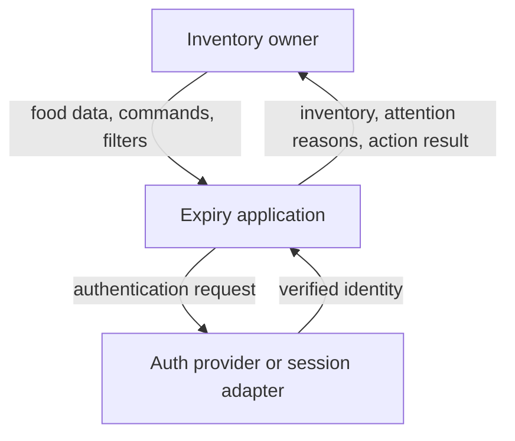
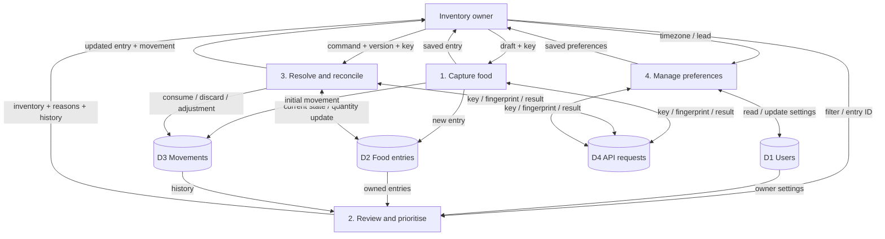

# DOC-DFD — Logical data movement and stores

- Document ID: `DOC-DFD`
- Status: **Review**
- Updated: 2026-10-09T18:37:36+07:00

## Purpose

DFD context, level 0/1 and flow-to-data/CRUD relationships.

## Evidence sources

- [00-context/source-register.md](../00-context/source-register.md)

## Definitions and assumptions

[C] Các proposal dưới đây cần review trước implementation; không có nhãn Approved trong lần authoring này.

## Analysis

| Stage | Capture | Review/prioritise | Resolve/reconcile |
|---|---|---|---|
| Input | EntryCreate DTO + principal + key | Query + principal + injected clock | Command amount/actual + expected_version + key |
| Process | Schema/business validate + tx | Owner scope + derive attention | Replay/lock/version/business check + tx |
| State | food_entries + initial movement + api_requests | Không ghi status theo ngày | quantity/version + movement + api_requests |
| Side effect | Không scan/push trong MVP | Không lịch gửi hoặc DB update theo clock | FE invalidate list/detail/history sau success |
| Output | EntryResponse, 201 | Items/meta/reason/as_of_date, 200 | Entry+movement, 201; recount no-op 200 |
| Feedback | User sửa draft hoặc edit sau save | User chọn action từ reason/context | Ledger giúp audit/recount; UX feedback cập nhật |

### Context

DFD mô tả dữ liệu qua process, không phải click path. Context diagram không hiển thị internal stores.

### DFD level convention

Context has one process/system and external owner/identity source. DFD level 0 in this workspace means decomposition into Capture, Review, Resolve/Reconcile and Preferences; the inherited level-1 diagram supplies that decomposition, linked below rather than creating identical diagrams with different labels. Detail level 1 for a command expands validation → scoped read/lock → policy → writes/result, as sequence/flow-to-data matrix. This convention is explicit so source numbering does not imply a missing store.

Logical transaction: P1/P3/P4 writes D4 cùng với durable domain writes. Generic metadata/delete/restore thuộc P3, không có new data store bị thiếu. Auth boundary chung cấp principal trước owned processes, không vẽ password trong D1 flow.

### Stable data-process IDs

| ID | Process | Inputs / stores |
|---|---|---|
| DF-01 | Capture | UF-01/02 → ENT-02/03/04 |
| DF-02 | Review | UF-03/04 reads ENT-01/02/03 |
| DF-03 | Resolve/reconcile | UF-05…09 updates ENT-02/03/04 |
| DF-04 | Preferences/identity continuation | UF-10/11 settings/identity; ENT-01/04 for preferences writes, UC-00 identity-only continuation does not write domain entries |

### Flow-to-data matrix

| Flows | Displayed/requested | Input/edit | Derived | Persisted | Feedback / analytics |
|---|---|---|---|---|---|
| UF-01/02 | Capture metadata | EntryCreate | Validation/provenance meaning | ENT-02 + initial ENT-03 + ENT-04 | Saved; optional coarse capture completion |
| UF-03/04 | Owner entries/settings | Filters/selected ID | Attention/reason/as_of_date | Read only until user action | Explain context; action chosen |
| UF-05/06 | Current quantity/version | kind/amount/key/version | after/before delta | ENT-02/03/04 atomic | Updated amount; no duplicate event |
| UF-07 | Entry/current version/history | actual amount/reason/key | No-op vs correction | ENT-02/03/04 if changed | Correction history |
| UF-08/09 | Metadata/trash | Patch/delete/restore version/key | Attention visibility | ENT-02/04; no discard movement | Return list/detail |
| UF-10/11 | Preferences/identity | Settings/auth continuation | Owner date/access scope | ENT-01/04 or auth state | Refresh list; retained draft |

| UC | users | food_entries | stock_movements | api_requests |
|---|---|---|---|---|
| UC-01 create | R | C | C initial | C/R/U |
| UC-02/03 review | R | R | — | — |
| UC-04/05 | R principal | R/U | C | C/R/U |
| UC-06 edit | R | R/U metadata | — | C/R/U |
| UC-07 recount | R | R/U qty | C nếu delta≠0 | C/R/U |
| UC-08 history | R | R owner check | R | — |
| UC-09/10 | R | R/U deleted/version | — | C/R/U |
| UC-11 settings | R/U | — | — | C/R/U |

C=create, R=read, U=update; không public DELETE history/request table. Hard-delete/account erase chưa nằm MVP nhưng phải có policy trước public production.

## Decisions and rationale

[D] Giữ phạm vi food inventory cá nhân, manual capture và attention trong app theo source context. Approval kỹ thuật là riêng với việc kiểm tra cấu trúc tài liệu.

## Dependencies

- [09-user-flows/user-flows.md](../04-user-flows/user-flows.md)
- [06-data-model/ownership.md](ownership.md)
- [06-data-model/dictionary.md](../06-data-model/dictionary.md)

## Open questions

Chốt các quyết định liên quan trong decision ledger trước khi đổi contract hoặc triển khai.

## Related documents

- [README.md](../README.md)
- [11-traceability/README.md](../11-traceability/README.md)
- [04-user-flows/user-flows.md](../04-user-flows/user-flows.md)
- [06-data-model/ownership.md](ownership.md)
- [06-data-model/dictionary.md](../06-data-model/dictionary.md)

## Verification criteria

Đối chiếu nguồn, ID và downstream links; acceptance runtime chỉ được ghi pass sau khi thực chạy.
