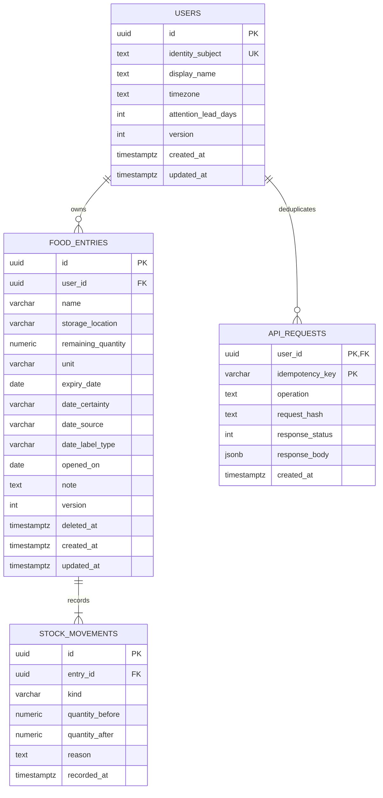

# DOC-ERD — Conceptual/logical ERD and cardinalities

- Document ID: `DOC-ERD`
- Status: **Review**
- Updated: 2026-10-09T18:37:36+07:00

## Purpose

Conceptual identity before DB types; physical DDL separate.

## Evidence sources

- [00-context/source-register.md](../00-context/source-register.md)

## Definitions and assumptions

[C] Các proposal dưới đây cần review trước implementation; không có nhãn Approved trong lần authoring này.

## Analysis

Conceptual: an owner manages food entries; an entry records quantity-change events; an owner deduplicates write commands. No household/catalog junction is required in private MVP.

| Relation | Cardinality | FK | Evidence và invariant |
|---|---|---|---|
| users → food_entries | User 0…N; entry đúng 1 owner | food_entries.user_id NOT NULL | Private ownership; user có thể chưa add |
| food_entries → stock_movements | Entry 1…N sau create commit; movement đúng 1 entry | stock_movements.entry_id NOT NULL | UC-01 initial event và action history |
| users → api_requests | User 0…N; request đúng 1 owner | api_requests.user_id NOT NULL | Commands replay theo owner |

DB FK không enforce parent bắt buộc có child initial movement. Service transaction + invariant tests enforce “entry có ≥1 movement”. Không có N:N trong MVP; không thêm junction table chỉ để minh họa N:N. Nếu sharing được scope-in sau, users↔households mới N:N qua memberships với role và composite owner invariants.

Physical schema is linked through entity/migration document. ERD is not an ORM class dump; event initial mandatory cardinality is a transaction invariant that a FK alone cannot guarantee. No fabricated N:N relation for academic completeness. Sharing would require a future impact review and ownership redesign.

## Decisions and rationale

[D] Giữ phạm vi food inventory cá nhân, manual capture và attention trong app theo source context. Approval kỹ thuật là riêng với việc kiểm tra cấu trúc tài liệu.

## Dependencies

- [12-database-schema/entities-and-migrations.md](../12-database-schema/entities-and-migrations.md)
- [06-data-model/ownership.md](../06-data-model/ownership.md)

## Open questions

Chốt các quyết định liên quan trong decision ledger trước khi đổi contract hoặc triển khai.

## Related documents

- [README.md](../README.md)
- [11-traceability/README.md](../11-traceability/README.md)
- [12-database-schema/entities-and-migrations.md](../12-database-schema/entities-and-migrations.md)
- [06-data-model/ownership.md](../06-data-model/ownership.md)

## Verification criteria

Đối chiếu nguồn, ID và downstream links; acceptance runtime chỉ được ghi pass sau khi thực chạy.
