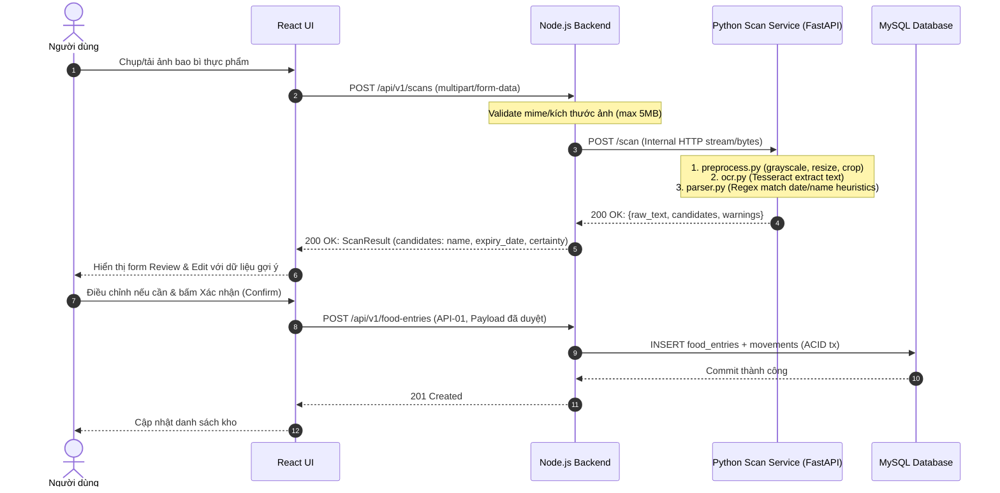

# [S3] Route/API contract và mapping

## S3.22 Route không map 1:1 với bảng
Routes theo resource/task của user. UC có thể gọi nhiều routes; một route có thể đọc/ghi nhiều tables. `stock_movements` có API tạo business event; `api_requests` là infrastructure không public CRUD. Không tạo endpoints “mọi bảng” bằng generic controller.

Prefix thống nhất `/api/v1`; JSON snake_case; UUID path ID. Schema machine-readable ở `contracts/openapi.json` (OpenAPI 3.1.1). Đây là contract draft cho scope hiện tại, auth scheme bearer là adapter example chưa phải stack chốt.

| Route ID | Method/path | UC | Input | Success | Service | Tables |
|---|---|---|---|---|---|---|
| API-01 | POST /api/v1/food-entries | UC-01 | EntryCreate + key | 201 Entry, Location | CreateEntry | entries C, movements C, requests C/U |
| API-02 | GET /api/v1/food-entries | UC-02/03 | q/location/view/lifecycle/attention/page/limit | 200 EntryList | ReviewInventory | users/entries R |
| API-03 | GET /api/v1/food-entries/{id} | UC-03 | UUID | 200 Entry | GetEntry | users/entries R |
| API-04 | PATCH /api/v1/food-entries/{id} | UC-06 | MetadataPatch + expected_version + key | 200 Entry | EditEntry | entries U, requests C/U |
| API-05 | POST /api/v1/food-entries/{id}/movements | UC-04/05 | consume/discard, amount, expected_version, reason? + key | 201 MutationResult | RecordMovement | entries U, movements C, requests C/U |
| API-06 | POST /api/v1/food-entries/{id}/recounts | UC-07 | actual_quantity, reason, expected_version + key | 201 MutationResult; 200 no-op | RecountEntry | entries U, movements C or no-op, requests C/U |
| API-07 | GET /api/v1/food-entries/{id}/movements | UC-08 | page/limit | 200 MovementList | ReadHistory | entries owner check/movements R |
| API-08 | DELETE /api/v1/food-entries/{id} | UC-09 | expected_version in query + key | 204 | RemoveEntry | entries U, requests C/U |
| API-09 | GET /api/v1/trash/food-entries | UC-09/10 | page/limit | 200 EntryList (deleted entries) | ReviewTrash | entries/users R |
| API-10 | POST /api/v1/food-entries/{id}/restore | UC-10 | expected_version + key | 200 Entry | RestoreEntry | entries U, requests C/U |
| API-11 | GET /api/v1/me/preferences | UC-11 | none | 200 Preferences | ReadPreferences | users R |
| API-12 | PATCH /api/v1/me/preferences | UC-11 | expected_version, timezone?/attention_lead_days? + key | 200 Preferences | EditPreferences | users U, requests C/U |
| API-13 | POST /api/v1/scans | UC-12 | multipart image file | 200 ScanResult | ScanOrchestration | requests C/U (transient extraction) |

## S3.23 Gate chain mỗi request
Request ID/body-size/content-type → authentication khi private → schema validation → controller DTO → service object ownership + business rule → scoped repo/transaction → DB constraints → response/error mapper.
Auth thiếu/invalid→401. Ownership phải kiểm tra **cho từng object operation**; không chỉ middleware thấy logged in rồi cho GET/PATCH mọi ID. GET history vẫn check entry owner, kể cả deleted.

## S3.24 Query contract
- page ≥1 default 1; limit 1…100 default 20. Stable offset pagination với total/page/limit. Concurrent modifications có thể dịch trang; MVP không snapshot pagination.
- q là case-insensitive substring name, max200; location exact normalized value max100; parameterized SQL.
- view inventory (default) hoặc attention. Inventory mặc định lifecycle active; có thể chọn depleted/all. Attention bắt buộc active/nondeleted.
- attention optional unknown/past_date/due_today/soon/later; trong view attention, không cho lifecycle depleted/all. Invalid combination→422.
- Sort fixed RULE-20; tổng classification/filter được áp dụng **trước** limit/offset. Không cho arbitrary SQL sort column từ client.
- Trash sort deleted_at DESC,id; history recorded_at DESC,id.

## S3.25 Write contract và concurrency
- All writes có `Idempotency-Key` 8…100 chars `[A-Za-z0-9_-]`. Key mới cho command mới. FE giữ nguyên key/body khi timeout retry.
- Update/actions/delete/restore/preferences có expected_version ≥1. Create không có version input.
- Same key trong owner, cùng operation/target/payload → replay original status/body, `Idempotency-Replayed: true`. Không hash include volatile timestamp/request_id.
- Same key với payload/target khác →409 `IDEMPOTENCY_KEY_REUSED`.
- Replay lookup trước object version/delete checks; retry lệnh đã xóa vẫn trả original204.
- New command stale version →409 `VERSION_CONFLICT`; thiếu lượng →409 `INSUFFICIENT_QUANTITY`; deleted normal operations →404.
- Nếu response lost mà user đổi payload trước retry, đó là command mới; refetch current state trước.
- Delete dùng expected_version query để tránh body DELETE interoperability; controller validate query, không blind delete.

## S3.26 Schema và errors
Create fields theo S3.19. Không nhận id/user_id/status/remaining_quantity/version/deleted_at. PATCH allowlist name/location/expiry_date/date_certainty/date_source/date_label_type/opened_on/note + expected_version; ít nhất một editable field. Validate merged object để không tạo date state nửa cập nhật.

Movement input ví dụ:
```json
{"kind":"consume","amount":"1.000","expected_version":1,"reason":null}
```
Mutation output: `{entry: EntryResponse, movement: MovementResponse|null, changed: boolean}`. Recount same amount returns200 changed=false, movement=null. Consume/discard luôn changed=true.

| HTTP | Meaning/code |
|---|---|
| 400 | MALFORMED_JSON |
| 401 | AUTH_REQUIRED |
| 404 | ENTRY_NOT_FOUND (bao gồm foreign-owned) |
| 409 | VERSION_CONFLICT / INSUFFICIENT_QUANTITY / ENTRY_NOT_DELETED / ENTRY_ALREADY_DELETED / IDEMPOTENCY_KEY_REUSED |
| 413 | BODY_TOO_LARGE |
| 415 | UNSUPPORTED_CONTENT_TYPE |
| 422 | VALIDATION_ERROR, query combination/schema/domain field invalid |
| 429 | RATE_LIMITED |
| 500 | INTERNAL_ERROR, no SQL/stack/secret |

`application/problem+json` RFC9457: type/title/status/detail/instance optional; project extensions code/request_id/errors. FE branch theo code, không parse human title.

## S3.27 Transaction pseudocode
```text
executeMutation(principal, operation, key, normalizedCommand):
  validate identity + command schema
  begin transaction
  INSERT api_requests(owner,key,operation,hash) ON CONFLICT DO NOTHING
  if not inserted:
    read existing completed row (concurrent insert waits until commit/rollback)
    compare operation + hash; mismatch => conflict
    replay saved status/body; end transaction
  lock target row scoped to owner (FOR UPDATE)
  check exists/current version/domain invariants
  apply domain mutation; append movement if quantity changed
  store result in reserved api_requests row
  commit
  return saved result
```
A reserved null-response row must not commit as success. Error rollback removes reservation; DB outage before commit means retry-safe. Response snapshot có thể cũ hơn latest state, nên FE refetch sau replay. Không gọi external network trong transaction MVP.

## S3.28 Examples FE/BE song song
- FE dùng OpenAPI DTO + fixture unknown/date known, partial consume, no-op, conflict, auth expiry.
- BE implement services theo same schema và acceptance scenarios SC-01…15.
- Mock không dựng business truth trong UI; server là authority khi integrated. FE vẫn validate input cho UX.
- Contract version/change log review chung trước khi đổi field/date meaning/status.

## S3.29 Luồng Scan và Contract nội bộ (`scan-api.yaml`)



### Đặc tả Endpoint API-13: `POST /api/v1/scans`
- **Mục đích:** Nhận ảnh nhãn thực phẩm từ UI, điều phối tới Python Scan Service để bóc tách thông tin ứng viên.
- **Content-Type:** `multipart/form-data` (file ảnh `image`) hoặc `application/json` (base64 string).
- **Giới hạn:** Tối đa 5MB, định dạng cho phép: JPEG, PNG, WebP.
- **Bảo mật:** Yêu cầu người dùng đã xác thực (hoặc session demo hợp lệ).
- **Kết quả trả về:**
  ```json
  {
    "raw_text": "EXP 25/12/2026 LOT 884B",
    "candidates": {
      "food_name": null,
      "expiry_date": {
        "value": "2026-12-25",
        "date_certainty": "exact",
        "date_label_type": "expiry",
        "alternatives": [],
        "ambiguous": false
      }
    },
    "warnings": [],
    "requires_confirmation": true
  }
  ```

### Contract nội bộ Node ↔ Python (`contracts/scan-api.yaml`)
- **Protocol:** HTTP REST nội bộ (không mở ra Internet).
- **Endpoint:** `POST http://python-scan:8000/scan` và `GET http://python-scan:8000/health`.
- **Ranh giới bất biến:** Python Scan Service là stateless, không có kết nối cơ sở dữ liệu MySQL, không lưu trữ ảnh lâu dài. Toàn bộ ML/DL custom training, model evaluation và LLM được loại bỏ.
