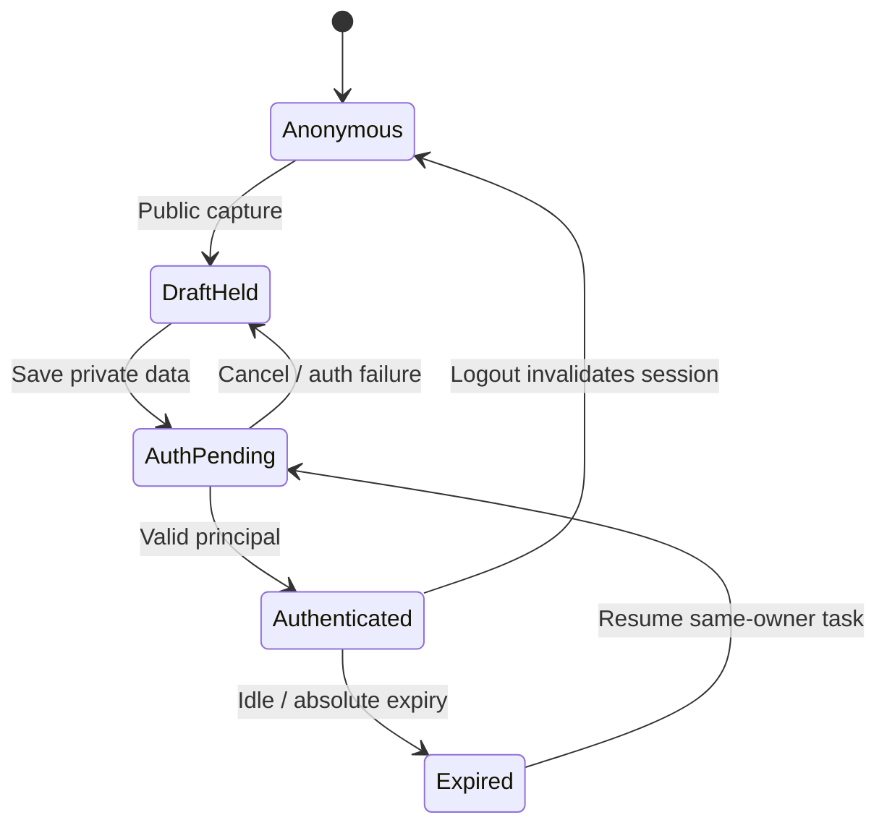
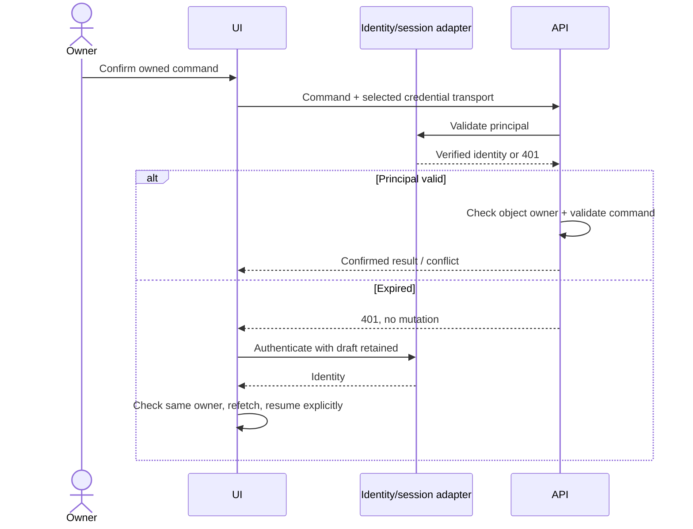

# DOC-AUTH — Sessions, JWT and authorization design review

- Document ID: `DOC-AUTH`
- Status: **Review**
- Updated: 2026-10-09T18:37:36+07:00

## Purpose

Evaluate hybrid auth; do not select two overlapping authorities.

## Evidence sources

- [00-context/source-register.md](../00-context/source-register.md)

## Definitions and assumptions

[C] Các proposal dưới đây cần review trước implementation; không có nhãn Approved trong lần authoring này.

## Analysis

[D] Same-origin browser application can begin with opaque server-side session credential as review candidate. SQL/compatible shared session store or external provider must be selected with hosting and revocation needs; default express-session MemoryStore is not a production choice [B]. No auth library/provider is installed in this task.

| Option | Benefit | Cost / authority | Recommendation status |
|---|---|---|---|
| Server-side session only | Simple browser logout/revocation; central session authority | Durable shared store/TTL/rotation and cookie+CSRF design | Preferred candidate for same-origin MVP; not approved |
| JWT only | Useful for independently validating APIs/multiple clients | Expiry/revocation/key rotation/token exposure and trust policy | Need demonstrated client/distribution requirement |
| JWT + server session | Can serve a separate downstream trust boundary | Redundant state if both independently authorize same browser actions | Not justified by current needs; do not auto-combine |
| Managed identity provider | Delegate login/password/MFA lifecycle | Provider cost/config/redirect/session contract | Evaluate team/host constraints |

[B/D] If cookie auth chosen: opaque session ID in HttpOnly/Secure cookie, explicit SameSite/origin strategy, CSRF token plus origin checks for state-changing requests, TLS/proxy configuration and restricted cookie scope. Rotate session identity on authentication/privilege transition, destroy authoritative session on logout, enforce idle/absolute expiry and test replay. These controls are a design proposal grounded in OWASP references, not security verification of demo Boolean auth.

Authentication establishes principal; service enforces owner for every object read/write/history/trash. Frontend route hiding does not authorize data. Logout/user change clears owner cache; 401 preserves draft only for verified same-owner continuation. Food DTO never accepts password/token/user_id authority. If local passwords selected, choose vetted password hashing/rate-limit/credential recovery separately; no invented password table in food ERD.

### Auth state and sequence proposal

XSS exposure, CSRF, fixation, revocation, secret logging, upload abuse and rate limits belong to threat/control tests, not a claim that a security scan was performed. JWT long-lived sensitive credentials are not placed in browser storage by this proposed design.

## Decisions and rationale

[D] Giữ phạm vi food inventory cá nhân, manual capture và attention trong app theo source context. Approval kỹ thuật là riêng với việc kiểm tra cấu trúc tài liệu.

## Dependencies

- [adr/ADR-003-authentication.md](../adr/ADR-003-authentication.md)
- [04-technology-research/official-references.md](../04-technology-research/official-references.md)
- [10-testing/test-catalog.md](../10-testing/test-catalog.md)
- [08-architecture/deployment.md](../08-architecture/deployment.md)

## Open questions

OQ-04 provider vs local login, credential transport, store TTL/revocation, same-origin host/proxy; contract bearer scheme must change if cookie candidate approved.

## Related documents

- [README.md](../README.md)
- [11-traceability/README.md](../11-traceability/README.md)
- [adr/ADR-003-authentication.md](../adr/ADR-003-authentication.md)
- [04-technology-research/official-references.md](../04-technology-research/official-references.md)
- [10-testing/test-catalog.md](../10-testing/test-catalog.md)
- [08-architecture/deployment.md](../08-architecture/deployment.md)

## Verification criteria

Đối chiếu nguồn, ID và downstream links; acceptance runtime chỉ được ghi pass sau khi thực chạy.
