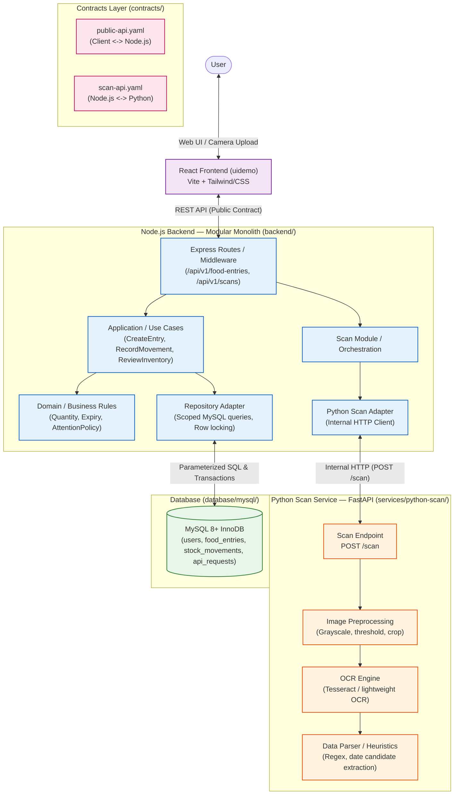
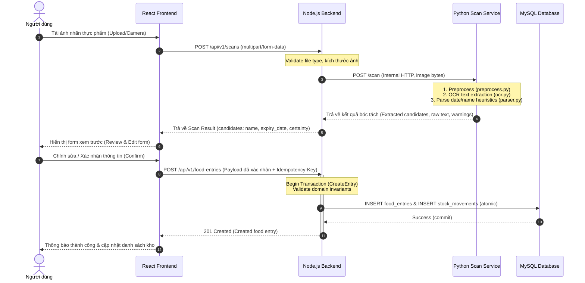

# [S0] Architecture mới của Expiry — Hệ thống Hybrid Modular Monolith

> **Quyết định kiến trúc chính thức:**  
> Bỏ toàn bộ ML/DL, training pipeline, model evaluation và LLM ra khỏi architecture hiện tại.  
> Giữ duy nhất **một Python Service độc lập** phục vụ chức năng scan (tiền xử lý ảnh, OCR và trích xuất dữ liệu hạn sử dụng).  
> **Kiến trúc tổng thể:** Monorepo + Node.js Modular Monolith + Python Scan Service + MySQL.

---

## 1. Tổng quan Kiến trúc ([S0])



---

## 2. Cấu trúc thư mục Monorepo ([S1])

```text
expiry/
├── uidemo/                 # React + Vite (Frontend Web SPA)
│
├── backend/                # Node.js + Express (Modular Monolith)
│   └── src/
│       ├── modules/
│       │   ├── inventory/  # CRUD thực phẩm, quản lý số lượng, kho
│       │   ├── expiry/     # Chính sách hạn dùng, tính toán attention
│       │   └── scan/       # Orchestration scan, gọi Python service
│       ├── shared/         # Request context, error types, database client, clock
│       └── app.ts          # Express app bootstrap & route registration
│
├── services/
│   └── python-scan/        # Python FastAPI Scan Service
│       ├── app/
│       │   ├── main.py     # FastAPI app entrypoint (/health, /scan)
│       │   ├── routes/     # Scan router
│       │   ├── schemas/    # Pydantic models (ScanRequest, ScanResponse)
│       │   └── scanner/
│       │       ├── preprocess.py # Làm sạch, xoay, tăng tương phản ảnh
│       │       ├── ocr.py        # Trích xuất văn bản từ ảnh
│       │       └── parser.py     # Parse regex ngày/tên, phân tích độ bất định
│       ├── tests/          # Unit tests cho scanner & parser
│       ├── requirements.txt
│       └── Dockerfile
│
├── database/
│   └── mysql/              # MySQL schema, migrations, seed & tools
│       ├── migrations/     # Versioned SQL migrations
│       ├── seed.sql        # Seed data phát triển
│       └── compose.yaml    # Docker MySQL local
│
├── contracts/
│   ├── public-api.yaml     # OpenAPI 3.1 cho Client <-> Node.js Backend
│   └── scan-api.yaml       # OpenAPI/Schema cho Node.js <-> Python Scan Service
│
├── docs/                   # Tài liệu kiến trúc, nghiệp vụ & báo cáo
└── compose.yaml            # Docker Compose phối hợp toàn bộ hệ thống
```

---

## 3. Ranh giới trách nhiệm ([S2])

| Thành phần | Trách nhiệm chính | Điều cấm / Không làm |
| :--- | :--- | :--- |
| **React (`uidemo`)** | UI/UX, chụp/upload ảnh, hiển thị gợi ý OCR, xác nhận dữ liệu của người dùng, render danh sách và attention badges. | Không tự tính toán hạn dùng làm nguồn chân lý, không gọi trực tiếp Python hay MySQL. |
| **Node.js (`backend`)** | API gateway, auth, validation, business rules, transaction quản lý kho và audit ledger, orchestration gọi Python Scan. | Không thực hiện xử lý ảnh nặng hoặc OCR trong event loop; sở hữu dữ liệu nghiệp vụ duy nhất. |
| **Python (`python-scan`)** | Tiền xử lý ảnh (OpenCV/Pillow), OCR (Tesseract), trích xuất regex ứng viên ngày/tên thực phẩm. | **Không truy cập trực tiếp MySQL.** Không lưu state nghiệp vụ người dùng. Không chứa ML training pipeline hay LLM. |
| **MySQL (`database`)** | Lưu trữ bền vững `users`, `food_entries`, `stock_movements`, `api_requests`. Đảm bảo ACID transaction và row locking. | Không xử lý logic hiển thị hay trigger phức tạp bypass backend. |
| **Contracts (`contracts`)** | Định nghĩa chuẩn giao tiếp công khai (`public-api.yaml`) và nội bộ (`scan-api.yaml`). | Giữ ổn định DTO, ngăn chặn phụ thuộc ngầm (tight coupling). |

> [!IMPORTANT]
> **Quy tắc bất biến:** Python Scan Service là một **stateless worker** hoàn toàn độc lập, giao tiếp với Node.js qua HTTP REST nội bộ. Python không có thông tin kết nối DB và không lưu trữ ảnh người dùng vĩnh viễn.

---

## 4. Luồng xử lý Scan hoàn chỉnh ([S3])



---

## 5. Các phương án kiến trúc & Lý do lựa chọn ([S6] Alternatives)

| Phương án | Lợi ích | Điểm yếu / Đánh đổi | Quyết định |
| :--- | :--- | :--- | :--- |
| **Hybrid Modular Monolith + Python Scan Service (Được chọn)** | Tách biệt hoàn hảo thư viện C/C++ xử lý ảnh (OpenCV, OCR) khỏi Node.js; Node.js giữ vững vai trò quản lý business rules và database; một deploy docker compose đơn giản. | Cần duy trì contract HTTP nội bộ giữa Node và Python. | **CHỌN CHÍNH THỨC**. Đủ sạch cho hiện tại, mở rộng tốt về sau. |
| **All-in-one Node.js (dùng Node Tesseract wrapper)** | Chỉ 1 runtime duy nhất. | Node Tesseract fork process kém ổn định, thiếu hệ sinh thái xử lý ảnh mạnh mẽ như Python; dễ block event loop. | **Loại bỏ**. |
| **Full Microservices (Scan, Inventory, Expiry, Auth riêng)** | Scale từng service độc lập. | Quá tải chi phí vận hành, network latency, distributed transactions, phân mảnh schema. Không có bottleneck chứng minh nhu cầu. | **Loại bỏ**. |
| **Tích hợp Deep Learning / LLM evaluation** | Kỳ vọng nhận diện thông minh hơn. | Tăng vọt độ trễ, tài nguyên GPU/RAM lớn, chi phí API, ảo giác ngày tháng nguy hiểm cho thực phẩm. Chưa có tập dữ liệu chuẩn. | **Loại bỏ hoàn toàn**. |
| **Celery + Redis Worker Queue** | Hỗ trợ tác vụ bất đồng bộ nặng. | Thêm 2 thành phần hạ tầng (Redis, Celery daemon) khi lưu lượng hiện tại hoàn toàn xử lý đồng bộ trong < 1.5s. | **Chưa triển khai**. Giữ kiến trúc sync HTTP trước. |

---

## 6. Thứ tự triển khai hệ thống ([S4] Implementation Order)

1. **Giữ nguyên các tài sản sẵn có:** `uidemo` (React UI), `database/mysql` (schema & migrations), `contracts/`, `docs/`.
2. **Xây dựng backend Node.js Modular Monolith:**
   - Cấu trúc các module: `modules/inventory`, `modules/expiry`, `modules/scan`.
   - Setup Shared library: error handling RFC 9457, connection MySQL pool, Idempotency-Key handler.
3. **Thiết lập kết nối MySQL:**
   - Kiểm tra các bảng `users`, `food_entries`, `stock_movements`, `api_requests`.
   - Kiểm thử CRUD và atomic transaction cho `food_entries` + `stock_movements`.
4. **Xây dựng Python FastAPI Service:**
   - Cài đặt service tại `services/python-scan/`.
   - Cung cấp 2 route: `GET /health` và `POST /scan`.
   - Hoàn thiện pipeline: `preprocess.py` -> `ocr.py` -> `parser.py`.
5. **Đồng bộ API Contract (Node ↔ Python):**
   - Viết `contracts/scan-api.yaml` quy định chuẩn JSON payload và mã lỗi giữa 2 service.
   - Viết Python Scan Adapter trong Node.js để gửi ảnh và parse response.
6. **Tích hợp End-to-End luồng Scan:**
   - Nối React upload -> Node.js `/api/v1/scans` -> Python `/scan` -> Review form -> Save `/api/v1/food-entries`.
7. **Kiểm thử với Docker Compose:**
   - Tạo file `compose.yaml` ở root kết nối: `uidemo`, `backend`, `python-scan`, `mysql`.
   - Kiểm thử liveness, readiness và luồng nghiệp vụ hoàn chỉnh.

---

## 7. Kết luận ([S5])

Kiến trúc Expiry hiện tại là một **Hybrid Architecture tinh gọn**:
- **Core backend:** Node.js Modular Monolith đảm nhận toàn bộ nghiệp vụ, quản lý dữ liệu, kiểm soát tính toàn vẹn và ACID transaction với MySQL.
- **Support service:** Python Scan Service chạy độc lập, phi trạng thái (stateless), chỉ làm đúng một việc: tiền xử lý ảnh, OCR và trích xuất gợi ý ngày/tên thực phẩm.
- **Không có thành phần dư thừa:** Toàn bộ ML/DL training, evaluation pipelines, LLM và các message broker phức tạp đã được lược bỏ.
- **Khả năng mở rộng:** Khi cần nâng cấp OCR engine hoặc bổ sung thuật toán nhận diện trong tương lai, chỉ cần nâng cấp bên trong `services/python-scan/` mà không gây ảnh hưởng đến ranh giới và hợp đồng dữ liệu của Node.js.
