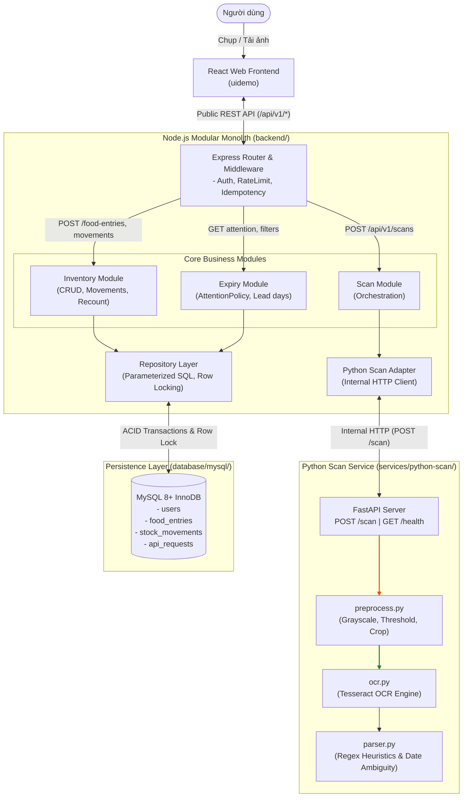

# DOC-COMPONENTS — Modular architecture and component interfaces

- Document ID: `DOC-COMPONENTS`
- Status: **Approved**
- Updated: 2026-10-10T18:00:00+07:00

## Purpose

Định nghĩa ranh giới trách nhiệm, phụ thuộc, vòng đời, quản lý lỗi và đơn vị triển khai cho toàn bộ các thành phần trong kiến trúc mới của Expiry.

## Evidence sources

- [00-context/source-register.md](../00-context/source-register.md)
- [08-architecture/07_Architecture_Components_and_Alternatives.md](07_Architecture_Components_and_Alternatives.md)
- [08-architecture/ADR-001-modular-monolith.md](ADR-001-modular-monolith.md)
- [08-architecture/ADR-004-ocr-boundary.md](ADR-004-ocr-boundary.md)

## Definitions and assumptions

Hệ thống tuân thủ mô hình **Hybrid Architecture**: Core backend là Modular Monolith (Node.js/Express) gắn với MySQL; chức năng scan được phụ trách bởi Python Scan Service (FastAPI) độc lập và phi trạng thái. Toàn bộ ML/DL custom training, mô hình đánh giá và LLM đã được loại bỏ.

## Component Boundary Matrix

| Component | Responsibility | Dependencies / Public Boundary | State / Lifecycle | Failure / Security | Deployment Unit |
| :--- | :--- | :--- | :--- | :--- | :--- |
| **React Frontend (`uidemo`)** | Chụp/upload ảnh, hiển thị danh sách kho, render attention badges, form xem trước kết quả scan, tương tác xác nhận. | Gọi REST API công khai (`/api/v1/*`) qua HTTP/JSON. Không gọi DB hay Python trực tiếp. | UI draft state, React Query/local cache. | Hiển thị mã lỗi chuẩn RFC 9457; graceful degradation khi mất mạng. | Web static bundle (Vite) / Container |
| **Node.js Gateway & Routes (`backend`)** | Định tuyến `/api/v1/*`, xác thực, kiểm tra Idempotency-Key, validate schema DTO đầu vào, mapping error RFC 9457. | Nhận request từ React, chuyển DTO vào Application Services hoặc Scan Module. | Request/Response scope. Phi trạng thái. | 400 Malformed, 401 Auth, 422 Validation, 429 Rate Limit. Không leak stack trace. | Node.js Process / Container |
| **Node.js Scan Module & Adapter (`backend/src/modules/scan`)** | Tiếp nhận file ảnh upload (`/api/v1/scans`), validate kích thước/mimetype, chuyển tiếp HTTP sang Python Scan Service, nhận diện kết quả và trả về client. | Gọi Internal HTTP `POST /scan` sang Python Scan Service theo `scan-api.yaml`. | Không lưu trữ ảnh vĩnh viễn trong MVP; transient memory buffer. | Xử lý timeout khi Python scan chậm (>3s), trả lỗi thân thiện cho user nhập tay. | Cùng process Node.js |
| **Node.js Inventory & Expiry Modules (`backend/src/modules/*`)** | Thực thi business rules: CreateEntry, RecordMovement, Recount, Soft Delete, Restore. Tính toán AttentionPolicy. Đảm bảo atomic transactions. | Domain policies, repository interfaces, UnitOfWork, MySQL connection pool. | Durable command transaction authority. Quản lý remaining_quantity và version. | Rollback khi lỗi; 409 Version Conflict, 409 Insufficient Quantity. | Cùng process Node.js |
| **Python Scan Service (`services/python-scan`)** | Tiếp nhận ảnh qua `POST /scan`, thực hiện tiền xử lý ảnh (xoay, grayscale, khử nhiễu), chạy OCR (Tesseract), chạy regex parser trích xuất ngày hết hạn và tên. | Expose HTTP REST endpoint theo `scan-api.yaml`. **Tuyệt đối không truy cập MySQL.** | Phi trạng thái (Stateless). Không lưu trữ ảnh sau khi response hoàn tất. | Timeout boundary (3s); fallback trả về `ambiguous: true` hoặc raw text khi không nhận diện được ngày. | Python FastAPI Process / Container |
| **MySQL Database (`database/mysql`)** | Lưu trữ bền vững các bảng `users`, `food_entries`, `stock_movements`, `api_requests`. Bảo vệ tính toàn vẹn dữ liệu và ACID. | Được quản lý duy nhất bởi Node.js repository adapters qua kết nối pooling và row locking. | Durable disk storage, backup snapshot. | Row lock timeouts, deadlocks handled by retry; foreign key constraints. | MySQL 8+ Container |
| **Contracts (`contracts`)** | Single source of truth cho giao thức giao tiếp: `public-api.yaml` (Client ↔ Node) và `scan-api.yaml` (Node ↔ Python). | Versioned schema YAML files. | Tĩnh, được compile/validate trong CI. | Contract test ngăn ngừa breaking changes giữa các service. | Repo contract package |

---

## Architecture Diagram

---

## Key Invariant Rules

1. **Python không truy cập Database:** Python Scan Service là stateless worker thuần túy. Mọi tương tác database đều đi qua Repository Layer của Node.js Backend.
2. **Node.js sở hữu nghiệp vụ:** Dữ liệu OCR từ Python chỉ là **ứng viên gợi ý (candidates)**. Chỉ khi người dùng kiểm tra, chỉnh sửa và xác nhận trên UI thì Node.js mới tạo bản ghi trong MySQL.
3. **Loại bỏ hoàn toàn ML/DL/LLM:** Không có training model, không có vector database, không gọi external LLM APIs, không có Celery/Redis cluster. Mọi xử lý dựa trên thuật toán OCR truyền thống và regex heuristics có thể kiểm thử xác định (deterministic).
4. **Idempotency an toàn:** Mọi thao tác ghi (`POST`, `PATCH`, `DELETE`) từ Frontend đều mang `Idempotency-Key` được quản lý bởi bảng `api_requests`.

---

## Decisions and rationale

[D] Lựa chọn kiến trúc Hybrid Modular Monolith + Python Scan Service đáp ứng trọn vẹn yêu cầu bài toán quản lý thực phẩm: giải quyết bài toán xử lý ảnh chuyên dụng mà không làm phức tạp hóa tầng nghiệp vụ và hạ tầng cơ sở dữ liệu.

## Dependencies

- [08-architecture/07_Architecture_Components_and_Alternatives.md](07_Architecture_Components_and_Alternatives.md)
- [07-api/endpoints.md](../07-api/endpoints.md)
- [07-api/integration-contract.md](../07-api/integration-contract.md)
- [08-architecture/deployment.md](deployment.md)

## Verification criteria

- Endpoint `/health` của Python Scan Service phản hồi 200 OK.
- Node.js scan adapter kết nối thành công và timeout an toàn sau 3000ms.
- Toàn bộ luồng scan từ upload ảnh đến lưu kho hoàn tất end-to-end mà không có bất kỳ bypass nào qua database.
