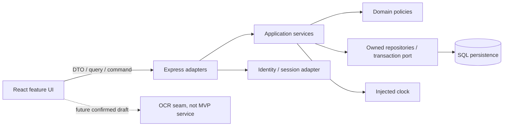

# DOC-COMPONENTS — Modular architecture and interfaces

- Document ID: `DOC-COMPONENTS`
- Status: **Review**
- Updated: 2026-10-09T18:37:36+07:00

## Purpose

Responsibility/dependency/state/lifecycle/error/deploy boundaries for every component.

## Evidence sources

- [00-context/source-register.md](../00-context/source-register.md)

## Definitions and assumptions

[C] Các proposal dưới đây cần review trước implementation; không có nhãn Approved trong lần authoring này.

## Analysis

| Component | Responsibility | Dependencies/public boundary | State/lifecycle | Failure/security | Deployment unit |
|---|---|---|---|---|---|
| React shell/pages | Navigation, draft, presentation, query/mutation coordination | DTO/query ports only | UI draft/cache lifecycle | Component errors + API codes; same-owner auth continuation | FE bundle |
| Express HTTP adapter [D] | Route/middleware/validator/controller/error translation | Application service ports | Request/response, verified principal lifecycle | Malformed/schema/auth/status mapping, no business state ownership | API process |
| Inventory application services [D] | Use-case validation + one transaction | Repositories/clock/policies/executor | Command transaction and durable mutation authority | Rollback/version/domain/replay outcomes | Same API process |
| Domain attention/quantity/date policy [D] | Pure semantics and invariants | Value objects/settings/injected clock | Derived attention; quantity validation | Deterministic testable errors | Same API process |
| Repository/ORM [D] | Parameterized owned reads/locks/writes | SQL connection/transaction | Persistence access lifecycle | DB errors mapped at adapter; no global unscoped find | Same API process |
| SQL DB [D] | Durable row/history/key integrity | Migration/configuration | Durable storage/backups | Transactions/constraints/restore | Managed DB or DB process |
| Identity/session adapter [D] | Principal verification, rotate/revoke | Chosen provider/store | Identity/session authority, separate from food | 401/403 policy; per-object owner checks remain service responsibility | API + durable store/provider |
| OCR adapter [Later] | Transient extraction candidates | Chosen engine/bounded executor | Job/image cleanup if approved | Timeout/invalid image/manual fallback; no SQL access | POC first, deploy unit undecided |
| Analytics / monitor adapters [D] | Allowlisted product events / redacted error correlation | Provider configs | Buffered emit/dispose; not domain state | Failure must not roll back domain command | FE/API; OCR later |

No React→SQL or Python→domain tables bypass. Controller does not coordinate every screen; service owns use-case transaction, pure policy decides semantics, repository scopes persistence, composition root wires dependencies. Microservice distribution requires measured benefit; one API deployment with internal modules is preferred proposal.

## Decisions and rationale

[D] Giữ phạm vi food inventory cá nhân, manual capture và attention trong app theo source context. Approval kỹ thuật là riêng với việc kiểm tra cấu trúc tài liệu.

## Dependencies

- [06-data-model/ownership.md](../06-data-model/ownership.md)
- [07-api/endpoints.md](../07-api/endpoints.md)
- [07-api/authentication.md](../07-api/authentication.md)
- [08-architecture/deployment.md](../08-architecture/deployment.md)

## Open questions

Chốt các quyết định liên quan trong decision ledger trước khi đổi contract hoặc triển khai.

## Related documents

- [README.md](../README.md)
- [11-traceability/README.md](../11-traceability/README.md)
- [06-data-model/ownership.md](../06-data-model/ownership.md)
- [07-api/endpoints.md](../07-api/endpoints.md)
- [07-api/authentication.md](../07-api/authentication.md)
- [08-architecture/deployment.md](../08-architecture/deployment.md)

## Verification criteria

Đối chiếu nguồn, ID và downstream links; acceptance runtime chỉ được ghi pass sau khi thực chạy.
