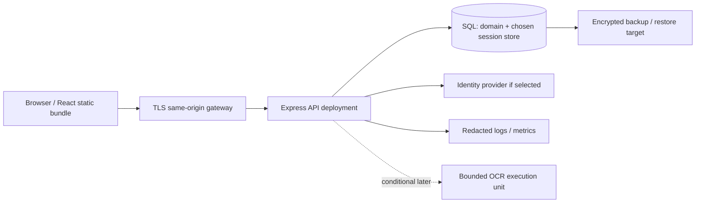

# DOC-DEPLOY — Environment, CI/CD and rollback architecture

- Document ID: `DOC-DEPLOY`
- Status: **Draft**
- Updated: 2026-10-09T18:37:36+07:00

## Purpose

Proposed browser→API→SQL topology with durable identity; host compatibility gated.

## Evidence sources

- [00-context/source-register.md](../00-context/source-register.md)

## Definitions and assumptions

[C] Các proposal dưới đây cần review trước implementation; không có nhãn Approved trong lần authoring này.

## Analysis

No application deploy was performed. Existing uidemo/vercel.json is SPA fallback config; .vercel project metadata does not prove active backend/DB/auth hosting.

| Environment | Required setup | Gate |
|---|---|---|
| Local | Pinned Node/package manager, disposable SQL, fake/isolated identity, test fixtures; OCR optional research runtime | No production credentials or user data |
| CI | Deterministic dependencies, docs/contract validation, unit/service tests and temporary DB jobs | Affected checks required; DB not exclusively mocked |
| Staging | Production-like TLS/proxy/session store/SQL, isolated data, migrations and observability | Browser-to-DB task paths + restart/session durability + rollback/restore test |
| Production | Approved host/regions/origins/secrets, durable SQL/session, least privilege, backup/runbook owner | Only after evidence + architecture/quality gates; user deployment authorization separate |

Environment contract: API_ORIGIN/SITE_ORIGIN, DB connection and schema version, selected auth issuer/secret/store config, cookie/proxy settings, safe log level/correlation, optional analytics/monitor IDs; exact env names validated when adapter selected. Secrets stay runtime secret store, never committed/generated UI bundle.

CI sequence: lint/doc/contract → domain/API tests → real DB/migration tests → build → stage migration/app → health/readiness → browser task smoke → release record. Do not run migrations per request or from several replicas without lock. HTTPS and exact CORS/credentials/origins considered if same-origin unavailable.

Health separates process liveness from readiness with SQL/session availability, no secret details. Backups need chosen RPO/RTO, scheduling/encryption/access and verified restore; numbers not fabricated. Deploy app rollback is safe only while schema backward-compatible; destructive DB rollback may require restore or forward fix. Keep before/after versions and operator recovery path.

Python compatibility is separately gated by host subprocess/container/memory/model/cold-start support; async queue/file store is not added to MVP without measured need. Session store must survive process/replica restart according to chosen architecture; sticky sessions alone are not a durability proof.

## Decisions and rationale

[D] Giữ phạm vi food inventory cá nhân, manual capture và attention trong app theo source context. Approval kỹ thuật là riêng với việc kiểm tra cấu trúc tài liệu.

## Dependencies

- [adr/ADR-002-storage-orm.md](../adr/ADR-002-storage-orm.md)
- [adr/ADR-003-authentication.md](../adr/ADR-003-authentication.md)
- [08-architecture/components.md](../08-architecture/components.md)
- [10-testing/test-catalog.md](../10-testing/test-catalog.md)

## Open questions

OQ-09 host/provider constraints, secret owner, RPO/RTO, session topology, migration permissions and release policy remain unconfirmed.

## Related documents

- [README.md](../README.md)
- [11-traceability/README.md](../11-traceability/README.md)
- [adr/ADR-002-storage-orm.md](../adr/ADR-002-storage-orm.md)
- [adr/ADR-003-authentication.md](../adr/ADR-003-authentication.md)
- [08-architecture/components.md](../08-architecture/components.md)
- [10-testing/test-catalog.md](../10-testing/test-catalog.md)

## Verification criteria

Đối chiếu nguồn, ID và downstream links; acceptance runtime chỉ được ghi pass sau khi thực chạy.
