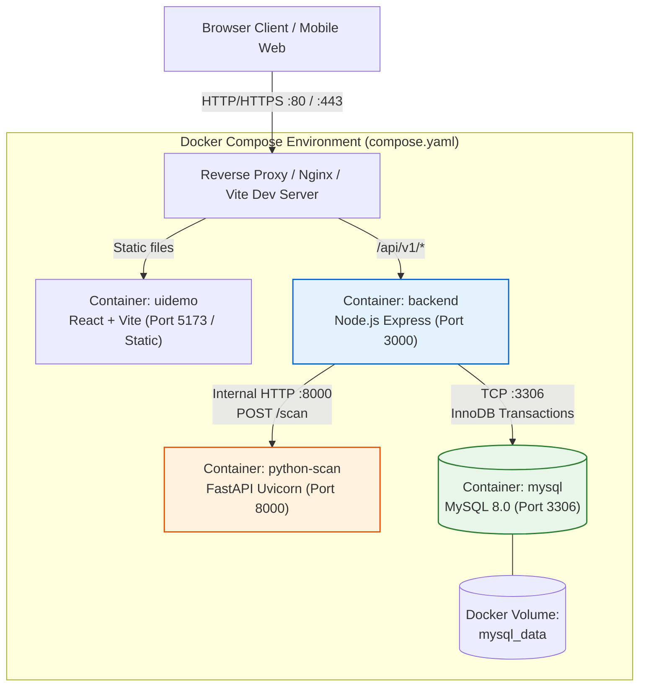

# DOC-DEPLOY — Environment, CI/CD and deployment architecture

- Document ID: `DOC-DEPLOY`
- Status: **Approved**
- Updated: 2026-10-10T18:00:00+07:00

## Purpose

Thiết lập mô hình triển khai containerized cho hệ thống Expiry bằng Docker Compose (`compose.yaml`), quy định cấu hình môi trường, quy trình CI/CD và chiến lược phục hồi lỗi.

## Evidence sources

- [00-context/source-register.md](../00-context/source-register.md)
- [08-architecture/07_Architecture_Components_and_Alternatives.md](07_Architecture_Components_and_Alternatives.md)
- [08-architecture/components.md](components.md)

## Deployment Topology



> [!NOTE]
> Container `python-scan` chỉ nằm trong mạng nội bộ docker (`expiry-network`), không cần mở port ra ngoài Internet. Chỉ có Node.js Backend mới được gọi tới Python Scan.

---

## Environment Specifications

| Environment | Setup & Services | Gates & Verification |
| :--- | :--- | :--- |
| **Local Development** | - Docker Compose khởi chạy MySQL (`database/mysql/compose.yaml`).<br/>- Node.js chạy với `npm run dev` (hoặc container `backend`).<br/>- Python scan service chạy với `uvicorn app.main:app --reload`.<br/>- Vite chạy hot-reload trên port 5173. | Kết nối DB thành công, migration chạy sạch, endpoint `/health` của Python scan trả 200 OK. |
| **CI (Continuous Integration)** | - Runner Docker không lưu state.<br/>- Chạy lint & typecheck cho React, Node.js (TypeScript) và Python (`flake8`/`pytest`).<br/>- Chạy unit tests cho modules `inventory`, `expiry`, `scan`.<br/>- Chạy contract test đối chiếu `public-api.yaml` và `scan-api.yaml`. | Mọi test unit và contract test phải PASS 100%. Không bypass contract errors. |
| **Staging / Docker Compose E2E** | - Toàn bộ hệ thống chạy qua `docker compose -f compose.yaml up --build`.<br/>- Seed database với dữ liệu mẫu trong `database/mysql/seed.sql`.<br/>- Kiểm thử E2E: tải ảnh nhãn -> scan -> xác nhận -> lưu kho -> kiểm tra số lượng và attention badge. | End-to-end smoke test chạy thông suốt từ Web UI tới MySQL. |
| **Production** | - Container images được đóng gói tối ưu (multi-stage Docker build cho Node.js và Python).<br/>- Environment variables cấu hình qua Docker secrets hoặc `.env.production`.<br/>- MySQL bật automated backups, snapshot volume và replication nếu cần. | Health check `/health` trên cả Node.js và Python service đều xanh. |

---

## Environment Configuration Contract

```ini
# --- Backend (Node.js) ---
PORT=3000
NODE_ENV=production
DB_HOST=mysql
DB_PORT=3306
DB_USER=expiry_user
DB_PASSWORD=secret_password
DB_NAME=expiry_db
SCAN_SERVICE_URL=http://python-scan:8000
CORS_ORIGIN=http://localhost:5173

# --- Python Scan Service ---
PORT=8000
PYTHON_ENV=production
LOG_LEVEL=info
MAX_IMAGE_SIZE_MB=5
SCAN_TIMEOUT_SECONDS=3.0

# --- MySQL Database ---
MYSQL_ROOT_PASSWORD=root_secret
MYSQL_DATABASE=expiry_db
MYSQL_USER=expiry_user
MYSQL_PASSWORD=secret_password
```

---

## CI/CD Pipeline Order

1. **Lint & Static Analysis:**
   - Frontend: `eslint`, `tsc --noEmit`.
   - Backend: `eslint`, `tsc --noEmit`.
   - Python: `flake8`, `black --check`, `mypy`.
2. **Unit & Contract Verification:**
   - Backend: Jest/Vitest cho inventory domain invariants & attention policies.
   - Python: Pytest cho `preprocess.py`, `ocr.py`, `parser.py`.
   - Contract test: Kiểm tra schema khớp với `contracts/public-api.yaml` và `contracts/scan-api.yaml`.
3. **Container Build:**
   - Multi-stage Docker build cho `backend` và `python-scan`.
4. **Integration Smoke Test:**
   - Docker Compose khởi động services, chạy migration SQL, gửi test request `/api/v1/scans` và verify phản hồi.

---

## Rollback & Recovery Strategy

- **Stateless Services (`backend`, `python-scan`):** Có thể rollback tức thời về image tag trước đó mà không ảnh hưởng tới dữ liệu.
- **Database (`mysql`):**
  - Mọi migration phải tuân thủ tính tương thích ngược (Backward-Compatible Schema Changes).
  - Không drop column ngay trong cùng release với code mới.
  - Backup trước mỗi đợt chạy migration lớn bằng `mysqldump` hoặc snapshot volume.

## Decisions and rationale

[D] Docker Compose là lựa chọn tối ưu cho giai đoạn hiện tại: đơn giản, nhẹ nhàng, tái tạo môi trường chuẩn xác giữa Local và Staging mà không phát sinh chi phí hạ tầng hay độ phức tạp của Kubernetes/Microservice mesh.

## Dependencies

- [08-architecture/07_Architecture_Components_and_Alternatives.md](07_Architecture_Components_and_Alternatives.md)
- [08-architecture/components.md](components.md)
- [10-testing/test-catalog.md](../10-testing/test-catalog.md)

## Verification criteria

- Lệnh `docker compose up --build` khởi động thành công 4 services.
- Container `backend` có thể kết nối tới `mysql` và `python-scan`.
- Container `python-scan` không bị lộ port trực tiếp ra Internet khi cấu hình mạng production.
