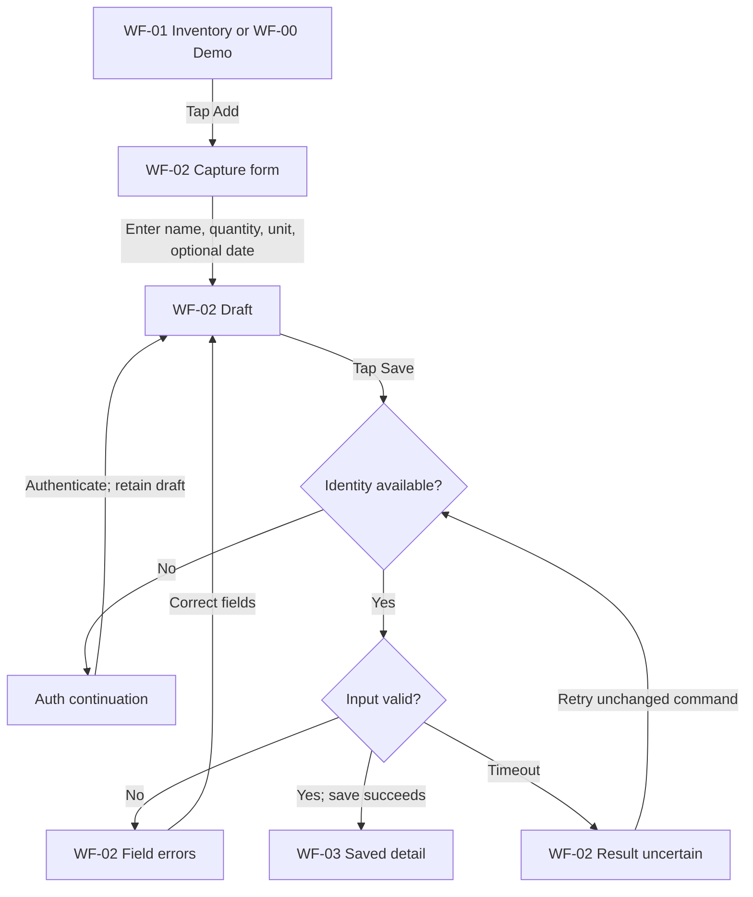
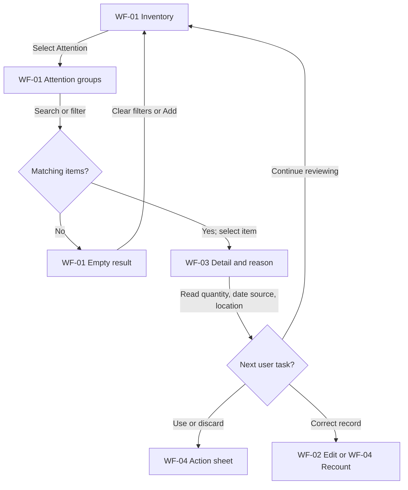
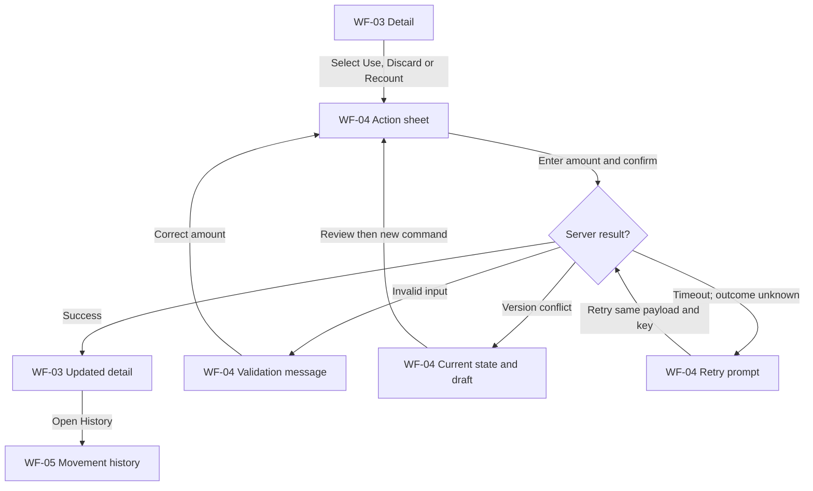
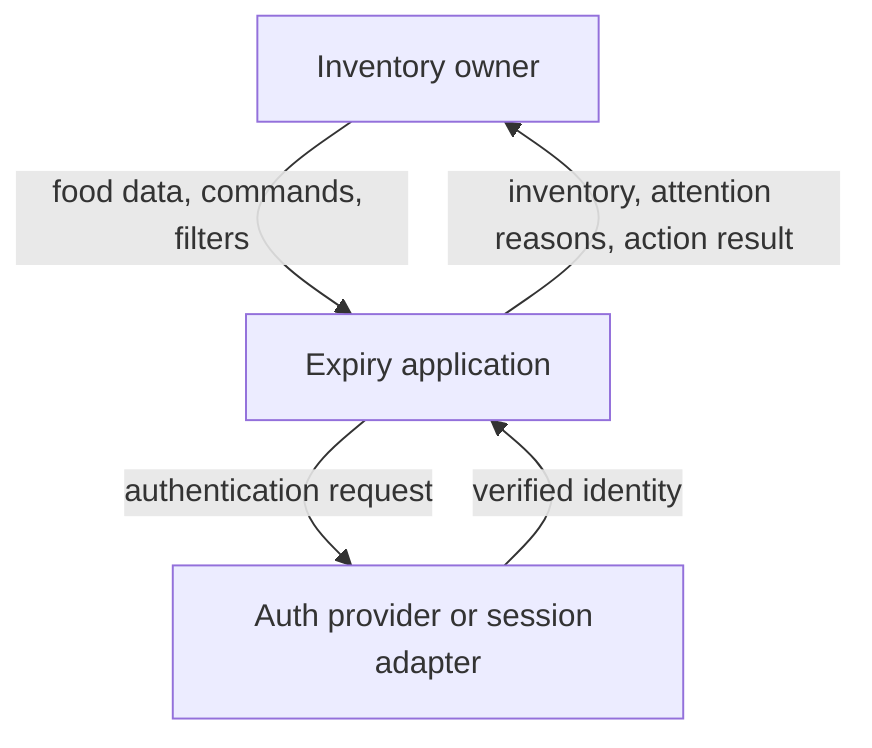
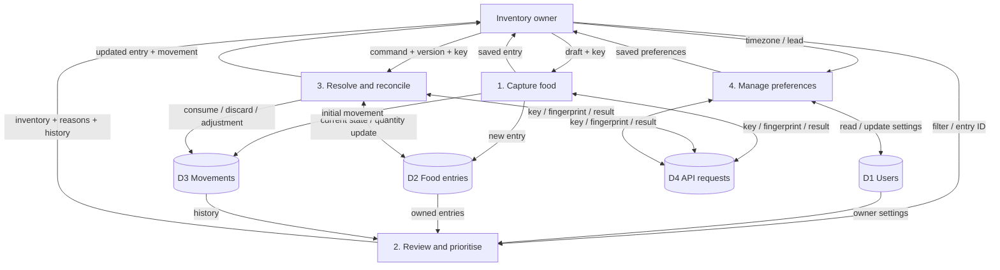
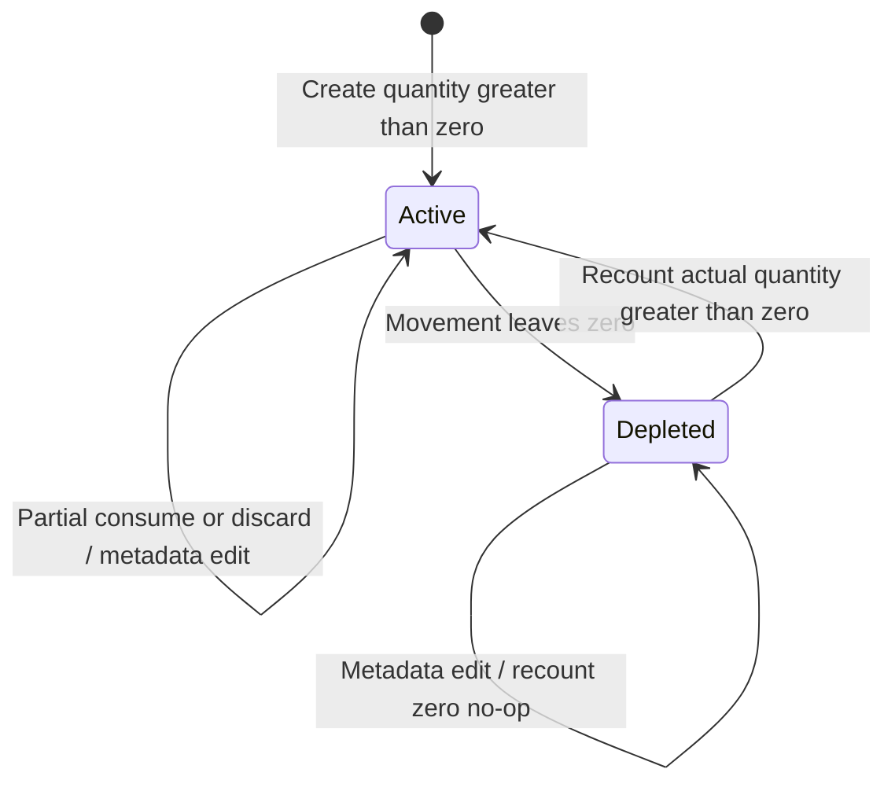
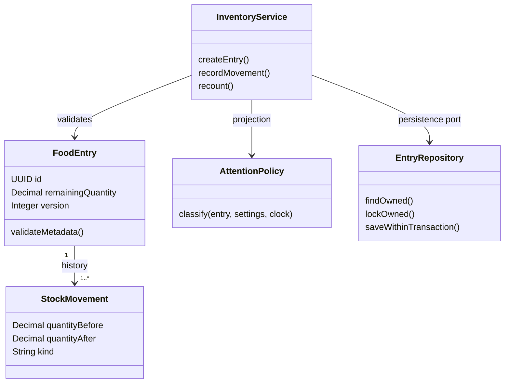
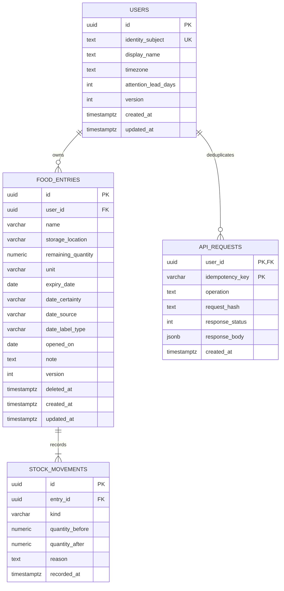

# Expiry — Trích xuất toàn bộ dữ liệu và hồ sơ hệ thống

- Thời điểm scan: **2026-10-09T17:53:34+07:00**.
- Workspace: `/home/pro/Downloads/expiry`.
- Branch: `feature/ui`; commit nền: `6d2a078fed3e1a5c1c54fb19bc7b20765720256c`.
- Git trước khi tạo file: **có thay đổi; xem snapshot bên dưới.
- Đầu vào: **83 file trong workspace + 1 bản dán**.
- Mục đích: hồ sơ dữ liệu đầy đủ có nguồn gốc, phân loại yêu cầu và giới hạn chứng cứ; không phải một SRS mới đã được phê duyệt.

## 1. Phạm vi, phương pháp và chuẩn dữ liệu

Scan các file có trong workspace, gồm file ẩn ngoài thư mục bị loại trừ và bản dán được đính kèm. Mỗi nguồn có ID, đường dẫn, kích thước byte và SHA-256 để đối chiếu. Toàn bộ văn bản UTF-8 được giữ trong phụ lục nguồn; PDF được trích văn bản theo từng trang. Hai ảnh được giữ dưới dạng liên kết đến file gốc kèm SHA-256. File Markdown này **không nhúng byte nhị phân của PDF/PNG**, OCR bổ sung cho 129 trang slide không có text layer và hai ảnh PNG. Văn bản OCR có nhãn riêng, không tự khôi phục quan hệ/ý nghĩa từ bố cục hình. Muốn di chuyển tài liệu kèm hình, cần giữ các file nguồn hình tương ứng.

Không truy cập lại Google Docs, Canva, website, dữ liệu triển khai, tài khoản thật hoặc toàn bộ lịch sử chat. Các mô tả “đã đọc”, “đã kiểm chứng” trong tài liệu cũ được giữ như lời của nguồn tại thời điểm đó, không phải hành động đã thực hiện trong lần scan này. Không nâng một citation có sẵn thành evidence đã được xác thực lại.

Phân loại dùng trong hồ sơ:

| Nhãn | Ý nghĩa trong lần xuất này |
|---|---|
| [A] | Nội dung trực tiếp đọc từ file hoặc kết quả công cụ scan hiện tại |
| [B-source] | Nguồn công khai được tài liệu cũ viện dẫn; chưa tra lại trong lần này |
| [C] | Nhận định/suy luận dựa trên các nguồn, không phải requirement được user phê duyệt |
| [D] | Đề xuất hoặc khuyến nghị; không tự biến thành quyết định |

Trạng thái requirement/decision: `Recorded-confirmed` = nguồn ghi user đã xác nhận; `Proposed` = thiết kế đề xuất; `Open` = chưa quyết định; `Observed-prototype` = quan sát từ code demo; `Historical` = bối cảnh/tài liệu khác phiên bản; `Unverified` = chưa kiểm chứng ngoài nguồn. Không đồng nhất persona, nhu cầu, use case, feature, business requirement, system requirement và business rule.

Các ID của nguồn giữ nguyên nhưng cần đọc kèm namespace: `DESIGN-2026-10-08::FR-01`, `PASTED::FR-01`, `LEGACY-README::BR-01`. Cùng chữ FR-01 ở bản dán và thiết kế 08/10 không có nghĩa là cùng requirement. Không tạo một nguồn chân lý mới bằng cách âm thầm đổi nghĩa ID cũ.

Thư mục loại trừ vì là lịch sử Git, dependency, cache hoặc output build: `.git`, `uidemo/dist`, `uidemo/node_modules`. Không scan thư mục ngoài workspace, ngoài đúng file attachment đã cung cấp. Không đưa bộ nhớ phiên trước vào dữ liệu nguồn của project.

## 2. Mục lục

- 3. System definition, boundary và scope
- 4. Context, evidence và decision ledger
- 5. Persona source
- 6. Problem, stakeholder needs và research
- 7. Requirements, business rules và NFR
- 8. User goals, scenarios và use cases
- 9. Data flow, lifecycle và ownership
- 10. Data dictionary và ERD
- 11. API và contracts
- 12. Architecture và alternatives
- 13. Wireframes và interaction
- 14. Traceability, kế hoạch và verification
- 15. Scan hiện trạng UI prototype
- 16. Khác biệt giữa nguồn và việc còn mở
- 17. Bản dán được làm sạch để đọc
- 18. Kiểm kê nguồn
- 19. Toàn văn các nguồn UTF-8
- 20. Văn bản PDF theo từng trang
- 21. Hình ảnh gốc
- 22. Giới hạn và kiểm tra đầu ra

## 3. System definition, boundary và scope

**[C] System definition tổng hợp từ bộ thiết kế 08/10:** Expiry là hệ thống quản lý tồn kho thực phẩm do người dùng khai báo, giúp ghi nhận món/lô thực phẩm, xem lượng còn và thông tin ngày theo dõi, nhận biết món cần chú ý, ghi nhận sử dụng/thải bỏ và đối soát số lượng với thực tế. Hệ thống sở hữu bản ghi số; người dùng xác nhận hành động và thực trạng vật lý. Ngày theo dõi, source và certainty không tự chứng minh an toàn thực phẩm.

**[A] Boundary của thiết kế:** user nhập dữ liệu → hệ thống ghi entry và movement → đọc tồn kho và phân loại attention → user quyết định hành động → hệ thống cập nhật lượng/history → user đối soát. Trong logical design, backend/persistence là authority cho dữ liệu khi được triển khai; trong demo hiện tại, `MockApiAdapter` giữ bản ghi trong bộ nhớ. UI giữ draft, lựa chọn và snapshot để hiển thị.

| Phân loại | Nội dung | Trạng thái / nguồn |
|---|---|---|
| Scope ghi nhận | Một project dùng cho HCI, SE, Advanced Web; tồn kho riêng từng account | Recorded-confirmed theo CTX-01/06 của thiết kế |
| Capture/reminder | Nhập tay; attention trong app; không hứa gửi thông báo khi app đóng | Recorded-confirmed theo CTX-07, DEC-02 |
| Miền MVP | Food-first | [C/D] theo CTX-10, không nâng thành xác nhận mới |
| Core loop | Capture → View/Prioritise & Explain → Resolve/Act & Reconcile | CTX-03, CF-01…03 |
| Data/behavior | Food entry + movement ledger, metadata edit, recount, history, trash/restore, settings | Proposed thiết kế; có demo một phần hành vi |
| Deferred/out of scope | Shared household; OCR/barcode; push; recipes/AI; medicine/cosmetics/warranty; offline sync; adaptive learning | Bộ thiết kế 08/10; giữ tách khỏi vision README cũ |
| Technical decisions | Stack production, auth provider/session, DB runtime, deploy/hosting | Open trong thiết kế |
| Validation | Baseline, user study, usability và outcome metrics | Kế hoạch riêng; không phải định nghĩa hệ thống hay scope đã validated |

Nguồn: [SRC-003 — Expiry_System_Design_2026-10-08/00_Context_and_Evidence.md](</home/pro/Downloads/expiry/Expiry_System_Design_2026-10-08/00_Context_and_Evidence.md>), [SRC-004 — Expiry_System_Design_2026-10-08/01_Research_Personas_and_Opportunities.md](</home/pro/Downloads/expiry/Expiry_System_Design_2026-10-08/01_Research_Personas_and_Opportunities.md>), [SRC-079 — uidemo/src/mockApi.ts](</home/pro/Downloads/expiry/uidemo/src/mockApi.ts>).

## 4. Context, evidence và decision ledger

Nguồn: [SRC-003 — Expiry_System_Design_2026-10-08/00_Context_and_Evidence.md](</home/pro/Downloads/expiry/Expiry_System_Design_2026-10-08/00_Context_and_Evidence.md>). Nội dung dưới đây được giữ nguyên về nghĩa và ID; nhãn xác nhận/đề xuất là nhãn trong tài liệu nguồn.

### [S0] Context, evidence và phạm vi quyết định
Version: 0.1 — 08/10/2026 — thiết kế để review, chưa phải specification đã phê duyệt toàn bộ.

#### S0.1 Confidence
**Medium tổng thể**. High cho ba cơ chế persona và ba core functions; High cho scope user vừa chọn; Medium cho suy luận tính năng; Medium cho thiết kế dữ liệu/API; chưa kiểm chứng bằng field study địa phương hoặc code hiện tại.

Không có quyền đọc toàn bộ lịch sử chat như một bản export. Đã truy xuất các đoạn liên quan Expiry bằng context search, đọc tài liệu được tìm thấy và tra nguồn công khai. Không tuyên bố đã đọc mọi tin nhắn. Canva bị chặn khi đọc qua web search, sau đó đã đọc trực tiếp rich text qua Canva connector trong lượt tiếp tục. Persona source hiện đã đối chiếu bản thiết kế hiện tại.

#### S0.2 Evidence classes
| Nhãn | Ý nghĩa | Cách dùng |
|---|---|---|
| [A-U] | User nói/chọn rõ trong conversation | Constraint của thiết kế |
| [A-R] | Nội dung conversation được truy xuất | Giữ nguồn và độ chắc chắn; không giả thành đọc nguyên bản |
| [A-F] | Nội dung file đã đọc | Evidence về nội dung file, chưa chứng minh research trong file đúng |
| [B] | Paper nguồn hoặc docs chính thức được tra | Hỗ trợ kết luận đúng phạm vi nguồn |
| [C] | Suy luận của bộ tài liệu này | Cần verify với user/test |
| [D] | Đề xuất thiết kế | Có thể thay sau review; không gọi là quyết định user |

#### S0.3 Canonical context hiện tại
| ID | Nội dung | Nguồn/trạng thái |
|---|---|---|
| CTX-01 | Một project Expiry cho HCI, Systems Engineering và Advanced Web | [A-U] context đã cung cấp |
| CTX-02 | HCI: persona, UX/UI; SE: problem/requirements/flows/use cases/UML/data/ERD; Web: middleware/controller/API/business logic/repository/queries | [A-U] |
| CTX-03 | CF-01 Add/Capture; CF-02 View/Prioritise & Explain; CF-03 Resolve/Act & Reconcile | [A-F] tracker 06/10 |
| CTX-04 | User flow theo Screen → User Action → Next Screen; decision dành cho điều kiện/validation | [A-F] tracker |
| CTX-05 | Auth xuất hiện tại điểm cần dữ liệu riêng/persist, không mặc định đặt ở đầu toàn journey | [A-F] tracker |
| CTX-06 | Tồn kho riêng từng tài khoản | [A-U] trả lời hôm nay; đã thay giả định trước đây |
| CTX-07 | MVP nhập tay, nhắc trong app; OCR/push chưa ở MVP | [A-U] hôm nay |
| CTX-08 | Stack chưa chốt | [A-U] hôm nay; React/Express/PostgreSQL chỉ [D] |
| CTX-09 | Team khoảng 5 người; task tự claim, có thể đồng đảm nhiệm, review theo dependency | [A-U] context; chưa phân công tên mới |
| CTX-10 | Food-first từ persona hiện tại | [C/D] nhất quán corpus; mở rộng medicines/cosmetics/warranty cần nghiên cứu riêng |

#### S0.4 Persona mới nhất và các phần chưa biết
Nguồn được truy xuất: https://www.canva.com/design/DAHXSrL9WU4 (08/10). Link cũ https://www.canva.com/d/ZhG7BWcn6eP6q5V và https://www.canva.com/d/n-qOUVfDmewzZFz là lịch sử; không dùng ghi đè persona mới.

| ID | Persona | Profile đã truy xuất [A-R] | Cơ chế đã bàn |
|---|---|---|---|
| P1 | Phạm Hoàng An — Occasional/Passive Forgetter | 20, Student, TP.HCM, Single, iPhone/Laptop | Có thể lên kế hoạch, vẫn quên đồ khi khuất chú ý; không được diễn giải thành người hoàn toàn thiếu tổ chức |
| P2 | Tôn Nữ Như Huyền — Busy Improviser | 49, Household, Đà Nẵng, Married, Android/Laptop | Kế hoạch thực phẩm gia đình thay đổi; khó chuyển đồ đang có thành hành động |
| P3 | Phạm Ngọc Thiên An — Conscious Maintainer | 20, Student, Đà Nẵng, Single, iPhone/Android/Laptop | Muốn theo dõi chính xác nhưng cập nhật từng món tốn công |

Đã đọc personality/quote/behavior/habits/goals/pains/challenges/opportunities trực tiếp từ Canva. Income và giờ sử dụng cụ thể không có trong rich text, không tự thêm. Canva là persona artifact, không phải raw interview transcript; quotes được ghi là quote trong slide, chưa xác minh nguồn interview. P1 trong lời user visible context: biết plan trước mua nhưng thỉnh thoảng quên, ngại sơ chế, bỏ tủ lạnh rồi quên có đồ đó.

#### S0.5 Files đã đọc
- `REPORT.md` (30/09): evidence audit và các BR-01…08 cũ; đọc đủ 1.163 dòng. Đây là synthesis cũ, có thể chứa inference/nguồn không tái kiểm chứng.
- `Tóm tắt (Executive Summary)` (08/10): ERD/Product/InventoryBatch/API đề xuất cũ, đọc đủ. Không kế thừa mù quáng unique product name, nhận userId từ client, gộp delete với discard hoặc quantity status không nhất quán.
- `Audit backend và kế hoạch cải thiện toàn diện cho Expiry App` (06/10): đọc các mục architecture, trust boundary, schema, concurrency và API; không đọc hết mọi mục của report.
- `Expiry_App_Task_Tracker_2026-10-06.xlsx`: đọc ba tab và acceptance criteria.

#### S0.6 Decision log và blockers
| ID | Quyết định/phần còn mở | Status | Artifact ảnh hưởng |
|---|---|---|---|
| DEC-01 | Private inventory | User confirmed | Owner FK/API scope |
| DEC-02 | Manual + in-app attention | User confirmed | Không cần scan/worker/push tables ở MVP |
| DEC-03 | Food entry + movement ledger; remaining_quantity làm operational source of truth | Proposed | ERD, transaction, resolve API |
| DEC-04 | DATE riêng với TIMESTAMPTZ; uncertainty tách khỏi opening | Proposed | Dictionary, API |
| DEC-05 | Soft delete là quản trị bản ghi; không ghi discard | Proposed | History/trash/restore |
| DEC-06 | Warning lead mặc định 2 ngày chỉ là cấu hình thử nghiệm; user sửa 0–30 | Proposed, chưa validated | UX/priority/settings |
| DEC-07 | Modular monolith; feature modules và service/repo boundary | Proposed | Repo |
| DEC-08 | Auth provider/session strategy và stack | Open | Auth adapter, implementation; domain/API business có thể làm trước |
| DEC-09 | Read-before-sign-in: public demo + draft form, auth khi đọc kho riêng hoặc lưu | Proposed từ CTX-05 | UX auth continuation |
| DEC-10 | Rich text Canva đã đọc trực tiếp; image/layout chưa inspect | Source retrieved | Persona fidelity; raw interview validation còn mở |
| DEC-11 | Deployment, backend runtime, hosting, vận hành DB | Open | Chưa triển khai infra |

Không có blocker cho bộ logical design này. Trước khi gọi ERD/API là final: review DEC-03…09 và thử các task với người thuộc ba cơ chế. Không yêu cầu user gửi lại quyết định DEC-01/02 hoặc chốt stack giả.

## 5. Persona source

Nguồn: [SRC-013 — Expiry_System_Design_2026-10-08/10_Canva_Persona_Source.md](</home/pro/Downloads/expiry/Expiry_System_Design_2026-10-08/10_Canva_Persona_Source.md>). Nội dung dưới đây được giữ nguyên về nghĩa và ID; nhãn xác nhận/đề xuất là nhãn trong tài liệu nguồn.

### Canva persona text, đọc trực tiếp 08/10/2026
Source: https://www.canva.com/design/DAHXSrL9WU4
Rich text qua Canva connector; không sửa thiết kế. Trích nội dung relevant, spelling nguồn được giữ trong quotes.

#### P1 — Pham Hoang An
Profile: Student, 20, Ho Chi Minh City, Single, iPhone/Laptop.
Personality: extrovert, hi-tech, Organized, Occasionally forgetful, Practical.
Behavior: Plan well → Buy intentionally → Store → Delay preparation → Lose attention → Forget occasionally.
Habits: Uses smartphone regularly; buys food for 2–3 days; doesn't prepare food after shopping.
Goals: Remember food is available; use food before expiry; know which should be used first; avoid unnecessary waste.
Motivation: Already planned/bought/paid; wants to actually use it.
Frustrations: Too much manual input; repetitive inventory updates.
Quote nguồn: “lâu lâu đi mua đồ ở bhx để ở tủ lạnh rồi quên mất tới khi lấy ra nó hết hạn r”.
Pains: Stored food easy to forget; delay preparation; notices only close to expiry; planned purchases still waste.
Challenges: Remember out-of-sight food; know attention priority; track without constant refrigerator checks; avoid another daily admin task.
Opportunities: Improve visibility, bring forgotten items to attention, prioritise soon-use items, timely low-effort reminders.

#### P2 — Ton Nu Nhu Huyen
Profile: Households, 49, Da Nang, Married, Android/Laptop.
Personality: low-tech, Practical, Family-oriented, Flexible, Responsible, Convenience-oriented.
Behavior: Plan → Buy intentionally → Store → Plans change → Delay use → Food remains unused.
Habits: Household shopping; stores ingredients; checks available food before cooking; changes meals by schedule; partly relies on memory.
Goals: Use before expiry; know priority; decide quickly; adapt plans; avoid waste.
Motivation: Food already bought, original plan changed, still wants use; needs easy next decision.
Frustrations: Expiry-only notifications, manual input, complicated tracking, browsing many items, too many steps for simple decisions.
Quote nguồn: “Cứ mỗi lần đi ăn ngoài thì lại cứ theo thói quen đi chợ mà quên mất có đồ ăn vẫn còn ở tủ lạnh xong để đấy nghĩ là bữa sau ăn rồi cũng quên mất”.
Pains: Unexpected plan changes; food unused; ingredients don't fit new schedule; date info not next action.
Challenges: Decide priority; adapt existing food; turn ingredients into useful action without much planning.
Opportunities: Prioritize attention; Use Now/Use Soon/Later; actionable guidance; quick next-use decisions.

#### P3 — Pham Ngoc Thien An
Profile: Student, 20, Da Nang, Single, iPhone/Android/Laptop.
Personality: hi-tech, Detail-oriented, Systematic, Accuracy-focused, Organized.
Behavior: Track → Organize → Check → Update → Repeat → Maintenance becomes tedious.
Habits: Regular review; organize by type; check before buying; update after use; prefer accurate info.
Goals: Accurate inventory; know exactly available stock; attention priority; up-to-date state; efficient management.
Motivation: Organization + accuracy used for decisions; reliable inventory.
Frustrations: Repetitive updates, re-enter information, too many update steps, outdated status, item-by-item management.
Quote nguồn: “t muốn cái gì mà tùy chỉnh được nhưng mà nó phải tiện với đỡ tốn thời gian của t nữa”.
Pains: Repeated updates needed; physical changes faster than records; skipped updates reduce trust; per-item admin tedious.
Challenges (semantic interpretation of slide columns): Synchronize digital/physical; accuracy without excessive effort; fast status updates; manage many items efficiently.
Opportunities: One-tap updates, fast editing, batch updates, easy correction, low-friction maintenance.

P3 rich-text reading order places Opportunities/Challenges headings out of semantic order. This file assigns meanings by wording, marks interpretation rather than claiming slide spatial layout was inspected. Source quotes are persona-card quotes, not independently verified participant statements.

## 6. Problem, stakeholder needs và research

Nguồn: [SRC-004 — Expiry_System_Design_2026-10-08/01_Research_Personas_and_Opportunities.md](</home/pro/Downloads/expiry/Expiry_System_Design_2026-10-08/01_Research_Personas_and_Opportunities.md>). Nội dung dưới đây được giữ nguyên về nghĩa và ID; nhãn xác nhận/đề xuất là nhãn trong tài liệu nguồn.

### [S1] Problem và [S4–S5] Research/root cause

#### S1.1 Problem definition
- Symptom: thực phẩm bị quên; người dùng biết hạn nhưng không biết dùng món nào; app tồn kho dễ sai sau khi dùng/bỏ.
- Expected: biết mình có gì, cái gì cần chú ý và cập nhật được việc đã làm với công nhỏ.
- Actual: thông tin phân tán ở bao bì/tủ lạnh/trí nhớ; kế hoạch đổi; thao tác cập nhật chậm hơn thay đổi thực tế.
- Impact: quyết định muộn, mua trùng, bản ghi sai và giảm tin tưởng. Chưa có số liệu baseline của nhóm để lượng hóa.
- Scope: thực phẩm trong tồn kho cá nhân, ba core functions CTX-03, nhập tay và in-app.
- Out of scope MVP: shared household, OCR/barcode integration, push, recipes/AI, tự suy hạn theo loại đồ, finance savings claims, medicine/warranty, offline sync và học thích nghi.

#### S5.1 Phương pháp research đã làm
1. Truy xuất conversation có persona/BR gần nhất; phân biệt user fact và assistant đề xuất.
2. Đọc file hiện có để phát hiện khác biệt giữa persona, BR, ERD/API cũ.
3. Tra paper gốc và docs chính thức; dùng kết quả nghiên cứu để kiểm tra **cơ chế**, không suy tỉ lệ thị trường từ mẫu nhỏ.
4. Chuyển cơ chế thành hypothesis tính năng; ghi test và artifact chịu ảnh hưởng.
5. Kiểm tra ngược mỗi entity/route có task cần nó hay không.

Đây là research synthesis + engineering design; chưa có phỏng vấn mới, usability study hoặc competitor app walkthrough trực tiếp. Không gắn nhãn “đã validated”.

#### S5.2 Source ledger
| Source | Nguồn và phạm vi | Finding dùng | Giới hạn |
|---|---|---|---|
| RES-01 | Mesiranta et al., CozZo, conference abstract, 2024; https://zenodo.org/records/14164532 | 52 households, 3–6 tuần; stock/expiry awareness và planning có giá trị; maintenance effort, expiry estimate và perceived value là trở ngại | Conference abstract, không chứng minh ba persona VN là market segments; kết quả giảm waste không dùng làm KPI mặc định |
| RES-02 | Mathisen et al., TotalCtrl/Too Good To Go, 2022; https://formative.jmir.org/2022/9/e38520 ; index https://pmc.ncbi.nlm.nih.gov/articles/PMC9482070/ | Search index nguồn paper: 6 students, nhiều manual operations gây khó duy trì | Full-text hôm nay bị anti-bot; chỉ dùng mức finding đã có trong index + audit cũ; chưa tái đọc full paper |
| RES-03 | EATiT, Taiwan, Graham-Rowe trong REPORT.md | Visibility, disrupted plans, inconvenience là background hypotheses | Chưa truy lại paper gốc lần này; không dùng sample/quote từ đây làm new verified claim |
| DOC-01 | PostgreSQL constraints https://www.postgresql.org/docs/current/ddl-constraints.html | PK/FK/UNIQUE/CHECK giữ integrity | Không thay validation/ownership nghiệp vụ |
| DOC-02 | PostgreSQL locking https://www.postgresql.org/docs/current/explicit-locking.html | FOR UPDATE hỗ trợ serialize cập nhật cùng hàng | Vẫn phải có transaction; thứ tự lock ổn định |
| DOC-03 | Date/time https://www.postgresql.org/docs/current/datatype-datetime.html | DATE khác timestamp/timezone | Cách ưu tiên hôm nay là rule project |
| DOC-04 | Numeric https://www.postgresql.org/docs/current/datatype-numeric.html | numeric là exact decimal | Không tự quyết định unit/conversion |
| DOC-05 | React https://react.dev/learn/sharing-state-between-components | Shared UI state ở common parent gần nhất | Không phải mọi state lên App |
| DOC-06 | OpenAPI 3.1.1 https://spec.openapis.org/oas/v3.1.1.html | Contract operations, schema, request/response | Không quy định phải map route 1:1 table |
| DOC-07 | RFC 9457 https://www.rfc-editor.org/rfc/rfc9457 | Problem details cho lỗi HTTP | code/request_id là extension project |
| DOC-08 | OWASP https://cheatsheetseries.owasp.org/cheatsheets/REST_Security_Cheat_Sheet.html | Endpoint access control, input validation, server workflow enforcement | Cần kiểm tra thực thi trên code sau |
| DOC-09 | OMG UML 2.5.1 https://www.omg.org/spec/UML/2.5.1 | Use case, activity, sequence, class/state thuộc UML | Mermaid flowchart và ERD không tự trở thành UML chuẩn |
| DOC-10 | UK official label guide https://www.gov.uk/understanding-food-labelling/best-before-and-use-by-dates | Use-by và best-before có nghĩa khác; storage/opening quan trọng | Không dùng như pháp luật nhãn VN; không suy shelf-life hay an toàn từ app |

Sources truy cập 08/10/2026. Không tìm thấy tài liệu chính thức xác nhận warning **2 ngày** là phù hợp cho mọi thực phẩm; đó là policy thử nghiệm DEC-06. Không tìm thấy evidence trong nguồn đã đọc chứng minh chỉ bật reminder là đủ giải quyết P2.

#### S4.1 Root cause theo persona
| Persona | Symptom | Immediate cause | System cause | Root mechanism |
|---|---|---|---|---|
| P1 | Có đồ nhưng quên sử dụng | Đồ khuất không tạo tín hiệu nhớ | Phải tự nhớ toàn bộ inventory, không có điểm review nhẹ | Visibility/attention failure dù có khả năng plan |
| P2 | Có đồ gần hạn nhưng kế hoạch không thực hiện | Lịch/sở thích/nhu cầu thay đổi | Thông tin hạn không nối với quyết định hiện tại | Decision/action gap |
| P3 | Theo dõi một thời gian rồi số lượng app sai | Dùng/bỏ không được cập nhật | Cost của maintenance cao hơn giá trị nhận ở thời điểm đó | Maintenance burden và reconciliation failure |

[C] Feedback loop nguy hiểm: cập nhật chậm → stock sai → attention sai → giảm tin tưởng → ít cập nhật hơn. Vì vậy data accuracy là điều kiện upstream của reminder quality.

#### S1.2 Persona → pain → challenge → opportunity → feature
Pain point = điều gây khó chịu/thiệt hại hiện có; challenge = trở ngại khi muốn đạt goal; opportunity = chỗ sản phẩm có thể can thiệp. Opportunity chưa phải bằng chứng cần feature.

| ID | Context/behavior nguồn | Pain point [C trừ phần user nói] | Challenge | Opportunity | Candidate feature | Cần research thêm |
|---|---|---|---|---|---|---|
| PP-11 | P1 mua có plan, cất tủ rồi quên | Không nhớ đang có món gì | Review phải nhanh, không đòi nhớ từng món | Hiển thị food cần chú ý theo vị trí/ngày | F-02 attention list, F-03 detail | Có mở app trước nấu/mua không? |
| PP-12 | P1 ngại sơ chế, quên thỉnh thoảng | Biết có đồ nhưng chưa xử lý | Notification không tạo thời gian/động lực chế biến | Đi thẳng từ attention đến hành động ngắn | F-04 record used/discarded; recipes để sau | Cản trở do thiếu thời gian hay không muốn ăn? |
| PP-13 | P1 ít muốn quản trị | Nhập dữ liệu thành việc mới | Capture không được dài hơn khả năng duy trì | Chỉ bắt buộc name/quantity/unit | F-01 quick manual add, optional date | Thời gian nhập chấp nhận thực tế? |
| PP-21 | P2 đồ mua cho dự định gia đình nhưng plan đổi | Không biết món nào ưu tiên | Quyết định cần lượng/vị trí/date context | Ranking có reason dễ hiểu, lọc nhanh | F-02/F-03 | Có giúp chọn hành động hay chỉ xem cảnh báo? |
| PP-22 | P2 lựa chọn chưa rõ với đồ không nhãn | Thiếu thông tin đáng tin | Không phải món nào có date chắc chắn | Tách unknown/estimated và source | F-01/F-03/F-05 edit metadata | User hiểu nhãn uncertainty ra sao? |
| PP-23 | P2 có household context | Người khác có thể thay đổi đồ vật thật | Private app không tự đồng bộ việc người khác làm | Quick recount cho owner; sharing phase sau | F-05 recount | Private scope đáp ứng học phần nhưng coordination vẫn là gap |
| PP-31 | P3 thường kiểm tra tồn kho | Chỉnh nhiều bản ghi phiền | Accuracy cần nhiều thao tác lặp | Action rõ quantity, edit nhanh, history | F-04/F-05/F-06 | Tần suất cập nhật và kiểu sai phổ biến? |
| PP-32 | P3 muốn số liệu đúng | Double tap/retry hoặc tab cũ làm sai lượng | Không thể dựa UI disable button | Version + idempotency + atomic movement | F-04 server guarantees | Mobile network/retry là giả thuyết cần thử |
| PP-33 | P3 sửa nhầm/xóa nhầm | Mất dữ liệu đã quản lý | Restore không được tạo fake stock movement | Soft-delete, trash/restore, correction có history | F-06/F-07 | Có cần batch edit ngay không? |

Không suy “married → shared household feature bắt buộc”: user đã chọn private scope. Không suy độ tuổi quyết định tech skill. Các persona cùng dùng một hệ thống; không có role P1/P2/P3 trong DB và không dựng ba dashboard khác nhau trước validation.

#### S1.3 Feature relevance và priority
| Feature | P1 | P2 | P3 | MVP |
|---|---|---|---|---|
| F-01 Quick manual capture | Cao | Cao | Cao | Core |
| F-02 Inventory + attention reason + search/location/date filter | Cao | Cao | Cao | Core |
| F-03 Detail: amount/date type/source/opening note | Vừa | Cao | Cao | Core |
| F-04 Consume/discard phần hoặc hết | Cao | Cao | Cao | Core |
| F-05 Edit metadata + recount actual amount | Vừa | Vừa | Cao | Core |
| F-06 History | Thấp | Vừa | Cao | Core, phục vụ reconcile |
| F-07 Trash/restore | Vừa | Vừa | Cao | Core support |
| F-08 Attention lead/timezone settings | Vừa | Vừa | Vừa | Core support |
| OCR/barcode/push | Hypothesis | Hypothesis | Hypothesis | Deferred theo user |
| Recipes/meal plans/bulk maintenance | Chưa chứng minh | Potential cao | Potential | Research backlog |

“In-app reminder” MVP = attention list được tính khi mở/refetch app; không phải notification gửi khi app đóng. Nếu user kỳ vọng thông báo ngoài app thì scope cần đổi; không cần worker/scheduler cho định nghĩa này.

#### S5.3 Validation research tiếp theo
- Phỏng vấn dựa incident gần nhất, không hỏi dẫn “bạn có muốn OCR không?”. Mỗi persona mechanism tìm 3–5 người phù hợp cho exploratory study; đây là kế hoạch, không đảm bảo đại diện dân số.
- P1: lần gần nhất đồ bị quên ở đâu, khi nào phát hiện, có plan trước không, cue nào làm nhớ.
- P2: kể lần đổi kế hoạch; tại sao không dùng đồ, thông tin nào thiếu; task chọn món ưu tiên có thực sự giúp quyết định.
- P3: quan sát thêm 5 món và ghi dùng/bỏ/sửa; count taps, time, wrong amounts, bỏ dở, stale records sau vài ngày.
- Task usability: thêm món không biết hạn; chọn món cần chú ý; dùng một phần; recount; xóa rồi restore; mạng chập chờn.
- Metrics: completion, median task time, error/correction rate, stale-record rate (digital active records sai physical state / records audited), relevant-action rate. Report denominator/sample và cách đo.
- Chưa đặt universal thresholds. Baseline trước; nhóm chốt acceptance targets trước test. Không dùng % giảm waste của CozZo làm lời hứa sản phẩm.

## 7. Requirements, business rules và NFR

Nguồn: [SRC-005 — Expiry_System_Design_2026-10-08/02_Requirements_and_Business_Rules.md](</home/pro/Downloads/expiry/Expiry_System_Design_2026-10-08/02_Requirements_and_Business_Rules.md>). Nội dung dưới đây được giữ nguyên về nghĩa và ID; nhãn xác nhận/đề xuất là nhãn trong tài liệu nguồn.

### [S2] Definitions và requirement model

#### S2.1 Các khái niệm dùng trong bộ tài liệu
| Term | Định nghĩa đơn giản | Vai trò/ví dụ Expiry |
|---|---|---|
| Proto-persona | Mô hình hành vi tổng hợp còn cần kiểm chứng | P1 visibility; không phải một participant thật được interview hôm nay |
| Goal | Kết quả người dùng muốn đạt | Biết món nào cần xem trước khi nấu |
| Task | Việc cụ thể làm để đạt goal | Mở attention list, chọn món, ghi dùng 1 hộp |
| User flow | Đường đi qua screen/action/decision | WF-01 → chọn món → WF-03 |
| Scenario | Một tình huống cụ thể có bối cảnh và outcome | Huyền đổi bữa tối, xem món nào gần ngày theo dõi |
| Use case | Hợp đồng hành vi hệ thống phục vụ goal | UC-04 ghi sử dụng; gồm normal/alternate/error flow |
| Business requirement (BR) | Kết quả/giá trị business cần đạt | Giảm công cập nhật để inventory hữu ích |
| Functional requirement (FR) | Hệ thống phải làm gì | Save món với date nullable |
| Nonfunctional requirement (NFR) | Chất lượng/ràng buộc cách vận hành | Không ghi số lượng âm khi hai request đồng thời |
| Business rule (RULE) | Điều kiện/giới hạn quyết định nghiệp vụ | Không dùng nhiều hơn lượng còn |
| Entity | Khái niệm có identity và dữ liệu cần lưu | FoodEntry E-A khác E-B dù cùng tên |
| Data dictionary | Định nghĩa chính xác field trước schema | expiry_date là calendar date nullable |
| ERD | Sơ đồ entity và quan hệ/cardinality | Một user sở hữu 0…N entries |
| DTO | Định dạng truyền vào/ra API, không phải DB row | EntryResponse gồm attention dẫn xuất |
| Repository | Bộ hàm truy cập persistence có scope | findOwnedEntry(id,userId) |
| Use-case service | Điều phối rule, transaction và repo | RecordMovement kiểm tra lượng và commit cả history |
| Transaction | Nhóm thay đổi cùng commit hoặc rollback | Giảm quantity và thêm movement cùng thành công |
| Optimistic concurrency | Phát hiện request dùng version cũ | expected_version 3 nhưng hiện 4 → 409 |
| Idempotency | Retry cùng command không thực hiện lần hai | Replay movement dùng 1 hộp không trừ thêm |
| Modular monolith | Một backend deploy, bên trong chia module | inventory/accounts, chưa có microservices |
| Composition root | Nơi nối dependencies | server startup inject service/repo, không chứa toàn rule |
| Ledger | Lịch sử các thay đổi | Movements; MVP không event-sourcing |
| Source of truth | Giá trị chính được dùng để quyết định | DB remaining_quantity, không React copy |

#### S2.2 BR mới: tách namespace để tránh xung đột
Ngày 30/09 dùng BR-01…08 cho hỗn hợp capability. Ngày 08/10 assistant đề xuất BR-01…03 cho outcome. Bộ này dùng **BR-V1-xx** cho outcome, **FR-xx** cho capability, **RULE-xx** cho business rules; không âm thầm đổi nghĩa ID cũ.

| ID | Outcome [D] | Persona | Indicators |
|---|---|---|---|
| BR-V1-01 | Người dùng nhận biết thực phẩm đang có và cần chú ý với công thấp | P1, P2 | Task chọn món; missed/stale records |
| BR-V1-02 | Người dùng có đủ context để quyết định bước tiếp khi kế hoạch đổi | P2 | Task decision completion + explanation; không tự claim recipes đã giải quyết |
| BR-V1-03 | Tồn kho số phản ánh thay đổi thực tế mà không tạo gánh nặng quản trị lớn | P3, P1 | Update time, amount errors, stale-record rate |

| FR | Hệ thống cần làm | UC/feature | Outcome |
|---|---|---|---|
| FR-01 | Capture name, amount, unit; date optional và source rõ | UC-01/F-01 | BR-V1-01/03 |
| FR-02 | List/search/filter kho của owner; stable pagination | UC-02/F-02 | BR-V1-01 |
| FR-03 | Attention classification + reason + calculated local date | UC-03/F-02/03 | BR-V1-01/02 |
| FR-04 | Ghi consume/discard một phần/toàn bộ, atomic và retry-safe | UC-04/05/F-04 | BR-V1-03 |
| FR-05 | Sửa metadata có version, không sửa quantity qua generic PATCH | UC-06/F-05 | BR-V1-02/03 |
| FR-06 | Recount lượng thực tế, lưu correction history | UC-07/F-05 | BR-V1-03 |
| FR-07 | History đọc được của owner | UC-08/F-06 | BR-V1-03 |
| FR-08 | Soft delete/trash/restore, tách physical disposal | UC-09/10/F-07 | BR-V1-03 |
| FR-09 | Setting timezone và attention lead, recompute | UC-11/F-08 | BR-V1-01/02 |
| FR-10 | Auth continuation giữ draft và gate kho riêng/persist | UC-00/support | CTX-05 |

#### S2.3 Business logic inventory
| Rule | Chính xác cần enforce [D] | Owner |
|---|---|---|
| RULE-01 | Owner lấy từ principal authenticated; không nhận user_id trong business DTO | Service + scoped repo |
| RULE-02 | Một FoodEntry = food quantity có cùng unit/date/location/opening context. Cùng tên không phải cùng identity | Capture service |
| RULE-03 | Create quantity >0; remaining ≥0; max 999999999.999; piece số nguyên; g/ml 3 decimal; không convert unit ở MVP | Service + DB CHECK |
| RULE-04 | Create lưu initial movement trước 0 → quantity; operational remaining là nguồn đọc, ledger cập nhật cùng transaction | Create service + DB |
| RULE-05 | Consume/discard amount >0 và ≤remaining; deleted/depleted không cho movement giảm | RecordMovement |
| RULE-06 | Recount nhập actual_quantity ≥0, reason bắt buộc; cùng lượng hiện có thì 200 no-op, không thêm movement/version | Recount service |
| RULE-07 | Không mutate remaining, version, user_id, deleted_at hoặc attention bằng generic metadata PATCH | DTO/schema + service |
| RULE-08 | unit không đổi sau create; muốn đổi phải quyết định migration/conversion riêng | Service |
| RULE-09 | Date unknown → expiry_date null; known/estimated → cần ngày; nguồn printed_label/user_estimate/user_entered/unknown nhất quán | Metadata domain |
| RULE-10 | date_label_type use_by/best_before/unspecified là nghĩa nhãn, không certainty. estimated chỉ với user_estimate; unknown đi cùng source unknown và label unspecified | Metadata + DB |
| RULE-11 | opened_on là field riêng nullable; không tự tính hạn mới, không tự kéo dài date khi freezer | Metadata/attention policy |
| RULE-12 | Attention khi còn quantity và chưa deleted: unknown nếu chưa date; past_date nếu date<today; due_today nếu bằng; soon nếu 0<delta≤lead; later nếu delta>lead | AttentionPolicy |
| RULE-13 | Today là calendar date theo user timezone; response có as_of_date; lead 0…30, default thử 2 | AttentionPolicy |
| RULE-14 | Attention không chứng minh safe/fresh; explain source, label, uncertainty. Không tự kết luận nên ăn khi quá use-by | AttentionPolicy/presenter |
| RULE-15 | Soft-delete giữ quantity/history, không tạo discard movement; restore chỉ bỏ deleted_at, recompute attention | Delete/restore service |
| RULE-16 | Lifecycle active nếu remaining>0, depleted nếu 0; không ép một trạng thái consumed/discarded cho batch đã vừa dùng vừa bỏ | Derived presenter |
| RULE-17 | expected_version phải khớp current cho update/action/delete/restore; successful mutation tăng version đúng một lần; no-op không tăng | Services |
| RULE-18 | Mọi write yêu cầu Idempotency-Key; cùng owner+key+operation+payload replay saved response, khác payload/operation →409; replay trước version check | Mutation executor + api_requests |
| RULE-19 | Idempotency reservation/result và entry/history commit cùng transaction; thất bại rollback; MVP không tự expire keys | Transaction adapter |
| RULE-20 | Sort priority past_date,due_today,soon,unknown,later; trong nhóm date asc NULLS LAST rồi created_at,id; unknown nhóm riêng visible | Query/AttentionPolicy |
| RULE-21 | Past-date capture được phép, kèm reason; không reject vì quá ngày hôm nay | Create/UX |
| RULE-22 | Unknown không silently suy date; opening/date edit chỉ metadata cả entry; mở một phần batch cần ghi tách ngay khi capture, split sau này phải atomic | Service/UX |
| RULE-23 | History không có public edit/delete endpoint; sửa sai bằng recount có reason, không rewrite historical consumption | Repo/service |
| RULE-24 | Owner-only not-found hoặc foreign-owned ID →404; auth thiếu →401; lỗi input→422; conflict→409 | Error mapper |

#### S2.4 Attention decision table
| Deleted | Quantity | Date | Relationship với today | Output |
|---|---|---|---|---|
| Có | Bất kỳ | Bất kỳ | Bất kỳ | Không trong active list; trash riêng |
| Không | 0 | Bất kỳ | Bất kỳ | depleted, không trong attention list |
| Không | >0 | null | Không biết | unknown; yêu cầu xem/xác nhận, không gọi later |
| Không | >0 | Có | <today | past_date; reason theo label/source |
| Không | >0 | Có | =today | due_today |
| Không | >0 | Có | 1…lead days | soon |
| Không | >0 | Có | >lead days | later |

opened_on không thay đổi bảng này tự động. Cần hướng dẫn sau mở từ nhãn/người dùng trước khi model thêm effective deadline.

#### S2.5 NFR và acceptance
| NFR | Yêu cầu | Verification |
|---|---|---|
| NFR-01 Privacy | Không cross-user read/write ở mọi endpoint và history | A/B user tests |
| NFR-02 Integrity | Atomic entry/movement/idempotency; không âm; conflict không overwrite | Concurrent transactions + rollback test |
| NFR-03 Contract | FE mock và BE trả đúng OpenAPI; stable error shape | Contract validation |
| NFR-04 UX recovery | 401 giữ draft; timeout retry cùng key; conflict refetch không silent replace | UI scenarios |
| NFR-05 Accessibility | Label/input rõ, keyboard usable, trạng thái không chỉ màu, focus/dialog/error đúng | Keyboard + screen reader review |
| NFR-06 Date accuracy | Date-only không bị lệch do UTC conversion; clock injection | Boundary timezone tests |
| NFR-07 Operations | Migration versioned, backup/restore baseline, generic errors, no secret logging | Staging acceptance |
| NFR-08 Performance | Chốt latency/volume sau biết hosting và dataset; chưa bịa SLA | Baseline measurements |

### 7.1 Trạng thái tập yêu cầu

BR-V1-01…03, FR-01…10, RULE-01…24 và NFR-01…08 là bộ thiết kế đề xuất. Các kết nối persona → pain → outcome → UC/feature trong nguồn là phân tích có truy vết; chưa thay thế stakeholder validation. Bộ nguồn chưa có một tập stakeholder requirements độc lập với ID, provenance, approval và acceptance đầy đủ. Không tự sinh “ST-01” như một nhu cầu đã được xác thực. NFR-08 chưa có SLA/latency target. FR/NFR dạng mô tả cần tiếp tục chốt điều kiện kiểm chứng trước khi gọi là baseline đã phê duyệt.

## 8. User goals, scenarios và use cases

Nguồn: [SRC-006 — Expiry_System_Design_2026-10-08/03_User_Flows_Scenarios_and_Use_Cases.md](</home/pro/Downloads/expiry/Expiry_System_Design_2026-10-08/03_User_Flows_Scenarios_and_Use_Cases.md>). Nội dung dưới đây được giữ nguyên về nghĩa và ID; nhãn xác nhận/đề xuất là nhãn trong tài liệu nguồn.

### [S3] User flows, scenarios và use cases

#### S3.1 Screen inventory
| Screen | Nội dung | Actions/next |
|---|---|---|
| WF-00 Intro/demo + auth continuation | Preview không dùng dữ liệu riêng | Try add →WF-02; view own stock/auth→WF-01 |
| WF-01 Inventory/attention | Attention groups, reasons, search/location, all/depleted tab | Add→WF-02; item→WF-03; settings→WF-06 |
| WF-02 Add/edit | Name, amount/unit khi create, location, optional date/certainty/label/source/opened note | Save→WF-03; validation giữ form; cancel→trước đó |
| WF-03 Detail | Current amount/version/date context/attention reason | Use/discard/recount→WF-04; edit→WF-02; history→WF-05; remove record→dialog |
| WF-04 Action sheet | Action, amount/actual amount, reason khi recount; current quantity | Confirm→WF-03 updated; cancel→WF-03 |
| WF-05 History/trash | Read-only movement history; trash là view riêng cùng layout list | Restore→WF-03; back→WF-01 |
| WF-06 Settings | Timezone, attention lead | Save→WF-01 recompute; cancel→WF-01 |

#### S3.2 Goal và các flow hoàn thành task
| Flow | Persona chính | Goal | Straight task path | Outcome kiểm chứng được |
|---|---|---|---|---|
| UF-01 Capture | P1/P3 | Ghi đồ mới trước khi quên | WF-01→Add→WF-02→Save→WF-03 | Entry đã lưu, initial movement, xuất hiện trong inventory |
| UF-02 Capture unknown date | P1/P2 | Không bỏ việc theo dõi chỉ vì thiếu nhãn | WF-02→chọn Không biết hạn→Save→WF-03 | Date null, unknown visible; không fake date |
| UF-03 Notice hidden food | P1 | Nhớ được món cần xem | WF-01→attention group→item→WF-03 | User thấy amount/location/reason; chưa claim food used |
| UF-04 Decide after plan change | P2 | Chọn món đáng chú ý từ đồ đang có | WF-01→location/filter→item→WF-03→action→WF-04→confirm | User tự chọn action; hệ thống ghi kết quả |
| UF-05 Partial consumption | All | Số lượng app đúng sau dùng | WF-03→Use→WF-04 amount→confirm→WF-03 | Remaining giảm đúng; history tạo 1 lần |
| UF-06 Partial/full discard | All | Phản ánh đồ thật đã bỏ | WF-03→Discard→WF-04 amount→confirm→WF-03 | Remaining giảm; discard history; zero→depleted |
| UF-07 Reconcile physical stock | P3/P2 | Sửa số lượng lệch nhanh | WF-03→Recount→WF-04 actual+reason→confirm→WF-03→history | Amount đúng và correction traceable |
| UF-08 Correct metadata | P3/P2 | Sửa ngày/vị trí nguồn nhập sai | WF-03→Edit→WF-02→Save→WF-03 | Version tăng; attention recomputed |
| UF-09 Remove/restore record | P3 | Dọn bản ghi nhầm, lấy lại khi xóa sai | WF-03→Remove record→confirm→WF-05 trash→Restore→WF-03 | Quantity/history không đổi bởi delete/restore |
| UF-10 Change attention settings | All | Điều chỉnh cách chú ý | WF-01→Settings→WF-06→Save→WF-01 | Lead/timezone cập nhật; list có as_of_date mới |
| UF-11 Session expiry continuation | All | Không mất draft khi auth hết hạn | WF-02/04→Save→401→auth→resume cùng draft→Save | Không trừ quantity trước khi server success |

Mỗi flow có thể có nhiều task path; không ép mỗi persona chỉ dùng một core function. UF-04 chưa có recipe generation, meal plan persistence hoặc freeze-expiry automation. Nó đạt goal “chọn từ đồ cần chú ý”, chưa chứng minh đã giải quyết toàn bộ decision gap.

#### S3.3 Scenario catalogue
Các tình huống dưới đây là [C/D] test scenarios, không phải trích lời user research.

| Scenario | Context/trigger | Persona goal | Flow/UC | Expected result |
|---|---|---|---|---|
| SC-01 | An cất 2 hộp sữa cùng hạn, muốn ghi trước khi quên | Capture nhanh | UF-01/UC-01 | Một entry quantity 2 piece |
| SC-02 | An có rau không thấy nhãn ngày | Vẫn theo dõi được | UF-02/UC-01 | unknown date; không bị chặn |
| SC-03 | Trước bữa tối An mở app, món ở sau tủ đã gần ngày theo dõi | Nhớ món đang có | UF-03/UC-02/03 | Soon group + reason/date/location |
| SC-04 | Huyền đổi món ăn tối sau thay đổi lịch gia đình | Chọn đồ cần chú ý | UF-04/UC-03/04 | Filter/detail trước action; không chỉ bật alert |
| SC-05 | Thiên An dùng 250g từ entry 1000g | Cập nhật chính xác | UF-05/UC-04 | Remaining 750g; movement -250g |
| SC-06 | Bỏ 200g trong phần 750g còn | Ghi waste riêng với use | UF-06/UC-05 | Remaining 550g; discard 200g |
| SC-07 | Kiểm tra thực tế chỉ còn 500g | Reconcile mismatch | UF-07/UC-07 | Adjustment -50g có reason |
| SC-08 | Dùng mobile, server commit nhưng response mất | Không ghi lặp | UF-05/UC-04 | Retry cùng key/payload replay, chỉ 1 movement |
| SC-09 | Hai tab cùng version, mỗi tab yêu cầu dùng 400g từ 500g | Không negative/lost update | UC-04 | Một success; tab còn lại 409, refetch |
| SC-10 | Lỡ xóa bản ghi còn 500g | Khôi phục record | UF-09/UC-09/10 | Restore vẫn 500g, không giả đã dùng/bỏ |
| SC-11 | Sửa date khi tab khác đã cập nhật entry | Không overwrite silently | UF-08/UC-06 | 409, hiển thị dữ liệu hiện tại/draft khác biệt |
| SC-12 | Entry vừa dùng hết vừa bỏ phần cuối | History đúng nghĩa | UC-04/05/08 | lifecycle depleted; totals theo movement, không “all consumed” |
| SC-13 | User A thử ID của user B | Bảo vệ kho riêng | Tất cả owned UCs | 404; không data leak |
| SC-14 | Date=ngày hiện tại user, máy client ở timezone khác | Nhắc đúng calendar date | UC-03/11 | due_today theo timezone owner |
| SC-15 | Món quá date nhưng best_before hoặc date estimate | Không biến attention thành safety claim | UC-03 | past_date + label/source explanation |

#### S3.4 Use case specification conventions
Actor chính: authenticated inventory owner (trừ UC-00/support demo). P1/P2/P3 là behavior models, **không phải actor roles hay quyền**. System boundary = Expiry application gồm UI/API/domain/persistence. Auth provider là supporting external actor chưa chốt. Clock được inject làm dependency cho test, không phải người dùng.

Precondition chung: principal valid, object thuộc owner và chưa deleted với operations thường. Auth/security gate là precondition/support flow; không tạo “business UC validate form” chỉ vì middleware tồn tại.

##### UC-00 — Continue with identity

- Requirement: FR-10; UI: WF-00/02/04.
- Trigger: Chạm private inventory hoặc lưu draft.
- Preconditions: Có draft/demo chưa persist.
- Main success flow: Giữ draft; xác thực qua auth adapter; resume task.
- Alternate/error flow: Cancel auth → giữ draft, không save; auth fail → retry.
- Success guarantee: Identity principal hợp lệ, chưa tự tạo food.
- Failure guarantee: không partial mutation; draft giữ ở UI; rollback trước commit. Với read không phát sinh write.
- Rules: Không password/token trong food DTO.

##### UC-01 — Record food entry

- Requirement: FR-01; UI: WF-02.
- Trigger: User chọn Add rồi Save.
- Preconditions: Draft có name/quantity/unit.
- Main success flow: Validate DTO; resolve owner; create entry+initial movement+request result một transaction; trả entry.
- Alternate/error flow: Date unknown hợp lệ; past date hợp lệ; 422 giữ draft; timeout retry key cũ.
- Success guarantee: Entry và initial movement hoặc không có cả hai.
- Failure guarantee: không partial mutation; draft giữ ở UI; rollback trước commit. Với read không phát sinh write.
- Rules: RULE-01…04/09…11/18/19/21.

##### UC-02 — Review own inventory

- Requirement: FR-02; UI: WF-01.
- Trigger: Mở inventory/search/filter.
- Preconditions: Principal valid.
- Main success flow: Validate filters/page; read owner-scoped rows; project DTO; return items+pagination.
- Alternate/error flow: Empty→empty state/Add CTA; network error→retry; foreign scope không được nhận.
- Success guarantee: Không mutate data.
- Failure guarantee: không partial mutation; draft giữ ở UI; rollback trước commit. Với read không phát sinh write.
- Rules: RULE-01/20/24.

##### UC-03 — Identify and understand attention

- Requirement: FR-03; UI: WF-01/03.
- Trigger: Mở attention hoặc detail.
- Preconditions: Clock/timezone/lead có giá trị.
- Main success flow: Read active owned entries; derive date state/reason; stable sort; show date/source/location/amount.
- Alternate/error flow: Unknown→nhóm riêng; depleted/deleted excluded; estimated→explain uncertainty.
- Success guarantee: User có thông tin chọn action; chưa mutate food.
- Failure guarantee: không partial mutation; draft giữ ở UI; rollback trước commit. Với read không phát sinh write.
- Rules: RULE-09…14/20.

##### UC-04 — Record consumption

- Requirement: FR-04; UI: WF-04.
- Trigger: User confirm Use amount.
- Preconditions: Owned nondeleted entry với quantity>0; key/version.
- Main success flow: Idempotency lookup; lock owned entry; verify version/unit/amount; update quantity+version; insert consume movement; store response; commit.
- Alternate/error flow: Stale version/over amount→409; invalid amount→422; replay→saved response; all used→depleted.
- Success guarantee: Remaining đúng, 1 history event cho 1 command.
- Failure guarantee: không partial mutation; draft giữ ở UI; rollback trước commit. Với read không phát sinh write.
- Rules: RULE-03/05/17…19.

##### UC-05 — Record discard

- Requirement: FR-04; UI: WF-04.
- Trigger: User confirm Discard amount.
- Preconditions: Như UC-04.
- Main success flow: Như UC-04 nhưng movement kind=discard; optional reason.
- Alternate/error flow: Partial waste vẫn active; hết lượng depleted; deleted→404.
- Success guarantee: History waste riêng, không soft-delete record.
- Failure guarantee: không partial mutation; draft giữ ở UI; rollback trước commit. Với read không phát sinh write.
- Rules: RULE-05/15/16/18/19.

##### UC-06 — Correct entry metadata

- Requirement: FR-05; UI: WF-02.
- Trigger: Save edit name/location/date context.
- Preconditions: Owned nondeleted entry; version/key; patch không quantity/unit.
- Main success flow: Replay check; lock; validate patch + full merged object; update metadata/version; response attention mới.
- Alternate/error flow: Null reset date phải đổi certainty/source đồng bộ; empty patch→422; conflict→409; depleted metadata vẫn được sửa.
- Success guarantee: Quantity/ledger không đổi; attention updated.
- Failure guarantee: không partial mutation; draft giữ ở UI; rollback trước commit. Với read không phát sinh write.
- Rules: RULE-07…14/17…19.

##### UC-07 — Reconcile actual quantity

- Requirement: FR-06; UI: WF-04.
- Trigger: Confirm Recount actual_quantity+reason.
- Preconditions: Owned nondeleted entry; version/key; quantity>=0.
- Main success flow: Replay; lock+version; compare actual vs remaining; delta adjustment; update+ledger+result transaction.
- Alternate/error flow: Same amount→200 no-op; actual>0 từ depleted→active; 0→depleted; invalid/missing reason→422.
- Success guarantee: Digital amount đúng reported reality; correction traceable.
- Failure guarantee: không partial mutation; draft giữ ở UI; rollback trước commit. Với read không phát sinh write.
- Rules: RULE-03/06/16…19/23.

##### UC-08 — Review entry movement history

- Requirement: FR-07; UI: WF-05.
- Trigger: Chọn History.
- Preconditions: Owned entry kể cả deleted nếu biết ID qua trash.
- Main success flow: Read owner-scoped entry+paginated movements stable by recorded_at,id; show before/after/kind/reason.
- Alternate/error flow: No events không hợp lệ với entry đã create; server invariant alert; foreign ID→404.
- Success guarantee: Read-only, không sửa lịch sử.
- Failure guarantee: không partial mutation; draft giữ ở UI; rollback trước commit. Với read không phát sinh write.
- Rules: RULE-04/23/24.

##### UC-09 — Remove erroneous record

- Requirement: FR-08; UI: WF-03/05.
- Trigger: Confirm Remove record.
- Preconditions: Owned entry, version/key.
- Main success flow: Replay; lock+version; set deleted_at/version; store result transaction.
- Alternate/error flow: Đã deleted với command mới→409; retry cùng key replay; cancel không change.
- Success guarantee: Không trong active list; quantity/history giữ nguyên.
- Failure guarantee: không partial mutation; draft giữ ở UI; rollback trước commit. Với read không phát sinh write.
- Rules: RULE-15/17…19.

##### UC-10 — Restore removed record

- Requirement: FR-08; UI: WF-05/03.
- Trigger: Chọn Restore trong trash.
- Preconditions: Owned deleted entry, version/key.
- Main success flow: Replay; lock+version; clear deleted_at; version++; compute derived attention; commit result.
- Alternate/error flow: Chưa deleted với command mới→409; depleted restore vẫn depleted.
- Success guarantee: Record hiện lại đúng lifecycle; no stock movement.
- Failure guarantee: không partial mutation; draft giữ ở UI; rollback trước commit. Với read không phát sinh write.
- Rules: RULE-15…19.

##### UC-11 — Set attention preferences

- Requirement: FR-09; UI: WF-06.
- Trigger: Save settings.
- Preconditions: Principal valid; user version/key.
- Main success flow: Validate timezone IANA/lead integer; lock user/version; update settings/version+result transaction; refresh derived list.
- Alternate/error flow: Timezone invalid/lead out-of-range→422; conflict→409; clock not controlled by body.
- Success guarantee: Không rewrite food rows; next read dùng setting mới.
- Failure guarantee: không partial mutation; draft giữ ở UI; rollback trước commit. Với read không phát sinh write.
- Rules: RULE-12/13/17…19.

#### S3.4a UX flow CF-01 Capture


#### S3.4b UX flow CF-02 Review


#### S3.4c UX flow CF-03 Resolve


## 9. Data flow, lifecycle và ownership

Nguồn: [SRC-007 — Expiry_System_Design_2026-10-08/04_Data_Flow_UML_and_Ownership.md](</home/pro/Downloads/expiry/Expiry_System_Design_2026-10-08/04_Data_Flow_UML_and_Ownership.md>). Nội dung dưới đây được giữ nguyên về nghĩa và ID; nhãn xác nhận/đề xuất là nhãn trong tài liệu nguồn.

### [S3] Data flow, system map và ownership

#### S3.5 INPUT → PROCESS → STATE → SIDE EFFECT → OUTPUT → FEEDBACK
| Stage | Capture | Review/prioritise | Resolve/reconcile |
|---|---|---|---|
| Input | EntryCreate DTO + principal + key | Query + principal + injected clock | Command amount/actual + expected_version + key |
| Process | Schema/business validate + tx | Owner scope + derive attention | Replay/lock/version/business check + tx |
| State | food_entries + initial movement + api_requests | Không ghi status theo ngày | quantity/version + movement + api_requests |
| Side effect | Không scan/push trong MVP | Không lịch gửi hoặc DB update theo clock | FE invalidate list/detail/history sau success |
| Output | EntryResponse, 201 | Items/meta/reason/as_of_date, 200 | Entry+movement, 201; recount no-op 200 |
| Feedback | User sửa draft hoặc edit sau save | User chọn action từ reason/context | Ledger giúp audit/recount; UX feedback cập nhật |

#### S3.6 State/lifecycle owners
| State/lifecycle | Owner | Ai mutate | Dependencies |
|---|---|---|---|
| Durable current quantity | Database row thông qua use-case service | Create/RecordMovement/Recount | Transaction + domain rules |
| Movement history | Database immutable qua public API | Services append | Same transaction với current amount |
| Attention state | AttentionPolicy backend | Không persist; compute theo clock/settings | Entry metadata + owner timezone |
| Form/action draft | Form hoặc ActionSheet | User input/form reducer | DTO validation for UX |
| List/detail remote data | Feature query cache (nếu FE dùng cache) | API response + invalidation | Contract, auth identity |
| Search/filter | Page/URL | User/navigation | Serialized query params |
| Identity/session | Auth adapter/provider | Auth flow | Chưa chốt implementation |
| In-flight command/key | Feature mutation coordinator | User start/retry | Giữ key qua retry; command mới key mới |
| Startup wiring | Composition root | Server boot | Inject repo, tx, clock, auth |

Không có component/controller nào “control mọi thứ”. App/root chỉ wiring/navigation. Service sở hữu transaction use case; repo sở hữu query; domain policy sở hữu rule; DB giữ integrity. Cache không là authority nghiệp vụ.

#### S3.7 DFD context

DFD mô tả dữ liệu qua process, không phải click path. Context diagram không hiển thị internal stores.

#### S3.8 DFD level 1

Logical transaction: P1/P3/P4 writes D4 cùng với durable domain writes. Generic metadata/delete/restore thuộc P3, không có new data store bị thiếu. Auth boundary chung cấp principal trước owned processes, không vẽ password trong D1 flow.

#### S3.9 Sequence core capture
```mermaid
sequenceDiagram
 actor U as Owner
 participant UI as Add form
 participant API as HTTP adapter
 participant S as CreateEntry service
 participant DB as Transaction / repositories
 U->>UI: Confirm draft
 UI->>API: POST entry + Idempotency-Key
 API->>API: Authenticate and validate DTO
 API->>S: execute(principal, draft, key)
 S->>DB: Begin; reserve key / check replay
 alt Key already completed, same fingerprint
  DB-->>S: Saved response
 else New command
  S->>S: Validate domain metadata and quantity
  S->>DB: Insert entry + initial movement + response
  S->>DB: Commit
 end
 S-->>API: EntryResponse
 API-->>UI: 201 + Location
 UI-->>U: Saved detail
```

#### S3.10 Sequence core read
```mermaid
sequenceDiagram
 actor U as Owner
 participant UI as Inventory page
 participant API as HTTP adapter
 participant S as ReviewInventory service
 participant DB as Repositories
 U->>UI: Open attention / filter
 UI->>API: GET food-entries?view=attention
 API->>S: principal + validated query
 S->>DB: Read owner settings + scoped entries
 DB-->>S: Metadata and quantities
 S->>S: Derive with clock/timezone; sort before pagination
 S-->>API: items + reasons + as_of_date + pagination
 API-->>UI: 200
 UI-->>U: Groups and actionable detail links
```
Query must apply classification/order over the eligible set before pagination, không paginate rồi sort trong FE. Nếu SQL derive để scale, parity-test với pure AttentionPolicy cùng timezone/clock; không có hai rule tự lệch nhau.

#### S3.11 Sequence core mutation
```mermaid
sequenceDiagram
 actor U as Owner
 participant UI as Action sheet
 participant API as HTTP adapter
 participant S as RecordMovement service
 participant DB as Transaction / repositories
 U->>UI: Use / discard amount
 UI->>API: POST movement + expected_version + key
 API->>S: principal + command
 S->>DB: Begin; reserve key
 alt Replay with same fingerprint
  DB-->>S: Original response
 else New command
  S->>DB: Lock owned nondeleted entry FOR UPDATE
  DB-->>S: Current amount and version
  S->>S: Check version, unit, amount
  alt Invalid or conflicting
   S->>DB: Rollback
   S-->>API: Domain error
   API-->>UI: 409 / 422
   UI-->>U: Refetch/review draft
  else Valid
   S->>DB: Update quantity/version; insert movement; save result
   S->>DB: Commit
   S-->>API: Updated entry + movement
   API-->>UI: 201
   UI->>UI: Invalidate list/detail/history
   UI-->>U: Updated quantity
  end
 end
```

#### S3.12 State UML: quantity và visibility là hai trục

Delete/restore không là consume/discard hoặc state transition tăng stock. Dùng `deleted_at` độc lập với quantity lifecycle. Attention là derived projection riêng.

#### S3.13 UML class responsibilities

Đây là responsibility model, không bắt buộc implement mọi entity thành OOP class.

#### S3.14 UML notation và files
- `diagrams/*.mmd`: source Mermaid thuần; code fence đúng `mermaid`, không `gpt-mermaid`.
- `diagrams/use_cases.puml`: UML use-case source thật bằng PlantUML. Mermaid không có native use-case diagram; không giả flowchart là UML use case.
- `diagrams/activity_record_movement.puml`: activity với branches success/conflict/replay.
- ERD ở S3.15 trong file data model. UML không thay ERD; UX wireframe không thay data flow.

## 10. Data dictionary và ERD

Nguồn: [SRC-008 — Expiry_System_Design_2026-10-08/05_Data_Definitions_and_ERD.md](</home/pro/Downloads/expiry/Expiry_System_Design_2026-10-08/05_Data_Definitions_and_ERD.md>). Nội dung dưới đây được giữ nguyên về nghĩa và ID; nhãn xác nhận/đề xuất là nhãn trong tài liệu nguồn.

### [S3] Data definition trước ERD và relational mapping

#### S3.15 Thứ tự định nghĩa data
1. Thu thập nouns và dữ liệu từ scenario/use case.
2. Định nghĩa identity/grain: một entry nghĩa là gì, khác entry khác ở đâu.
3. Định nghĩa field semantics, owner, source, required/null, unit, precision, allowed values.
4. Phân biệt persisted state, derived projection, transport DTO và UI-only draft.
5. Viết invariants, event/command shape, lifecycle và transaction boundary.
6. Xác định functional dependencies và cardinality; sau đó ERD logical.
7. Chọn DB để map physical types/index/constraints. DDL dưới đây là phương án PostgreSQL, không khóa stack user.

**Data dictionary không chỉ ghi `date: string`.** Phải ghi đây là calendar date, null khi nào, ai nhập, ai dùng, có tự derive không và timezone nào dùng so sánh.

#### S3.16 Grain/entity decisions
| Entity | Một row đại diện | Identity | Vì sao cần từ flow |
|---|---|---|---|
| users | Một owner đã xác thực cùng settings | UUID, identity_subject unique | Mọi private UC + UC-11 |
| food_entries | Một nhóm lượng thực phẩm cùng điều kiện theo dõi | UUID; tên/date không unique | UC-01/02/03; không auto merge chỉ vì cùng tên |
| stock_movements | Một thay đổi quantity được commit | UUID | UC-04/05/07/08; create luôn initial event |
| api_requests | Một command write có key trong scope owner | Composite (user_id,idempotency_key) | Retry SC-08, toàn writes |

Không có products/catalog ở MVP: chưa có use case catalog, hai món tên giống không chắc cùng product. Không có household/membership theo DEC-01. Không có notifications/jobs/outbox theo DEC-02. Movement bắt buộc khi quantity thay đổi, không “optional history” gây hai đường ghi mâu thuẫn.

#### S3.17 ERD


| Relation | Cardinality | FK | Evidence và invariant |
|---|---|---|---|
| users → food_entries | User 0…N; entry đúng 1 owner | food_entries.user_id NOT NULL | Private ownership; user có thể chưa add |
| food_entries → stock_movements | Entry 1…N sau create commit; movement đúng 1 entry | stock_movements.entry_id NOT NULL | UC-01 initial event và action history |
| users → api_requests | User 0…N; request đúng 1 owner | api_requests.user_id NOT NULL | Commands replay theo owner |

DB FK không enforce parent bắt buộc có child initial movement. Service transaction + invariant tests enforce “entry có ≥1 movement”. Không có N:N trong MVP; không thêm junction table chỉ để minh họa N:N. Nếu sharing được scope-in sau, users↔households mới N:N qua memberships với role và composite owner invariants.

#### S3.18 Dictionary — đủ field
| Table.field | API type | SQL type [D] | Null/default | Semantics/validation | Source/owner |
|---|---|---|---|---|---|
| users.id | UUID string | uuid PK | Required | Internal stable owner | Identity bootstrap |
| users.identity_subject | Không trả vào business DTO | text UNIQUE | Required | Provider + subject namespace, không email mutable làm ID | Auth adapter |
| users.display_name | string | text | Required | 1…100 trimmed | Profile |
| users.timezone | string | text | Asia/Ho_Chi_Minh | IANA timezone hợp lệ qua runtime timezone library | UC-11 |
| users.attention_lead_days | integer | integer | 2 | 0…30; config thử nghiệm | UC-11 |
| users.version | integer | integer | 1 | Optimistic version ≥1 | Service |
| users.created_at/updated_at | date-time string | timestamptz | server now | Instant UTC output ISO8601 | Persistence |
| food_entries.id | UUID string | uuid PK | Required | Not product ID | Server |
| food_entries.user_id | Không nhận ở input | uuid FK | Required | From verified principal | Service |
| food_entries.name | string | varchar(200) | Required | Trimmed 1…200; không UNIQUE | User |
| food_entries.storage_location | string | varchar(100) | Required default unspecified | Value free text trimmed 1…100; không table location chưa có CRUD requirement | User |
| food_entries.remaining_quantity | decimal string | numeric(12,3) | Required | 0…999999999.999; piece whole; operational source of truth | Quantity services |
| food_entries.unit | enum string | varchar(10) | Required | piece/g/ml; fixed after create | User/create |
| food_entries.expiry_date | YYYY-MM-DD hoặc null | date | null | Calendar date; no timezone/UTC conversion; past date allowed | User |
| food_entries.date_certainty | enum | varchar(12) | unknown | known/estimated/unknown; known=reported source known, không safe guarantee | User |
| food_entries.date_source | enum | varchar(20) | unknown | printed_label/user_entered/user_estimate/unknown | User |
| food_entries.date_label_type | enum | varchar(15) | unspecified | use_by/best_before/unspecified; độc lập certainty | User label |
| food_entries.opened_on | YYYY-MM-DD/null | date | null | Đã mở khi nào, applies entire entry; không tự derive shelf-life | User |
| food_entries.note | string/null | text | null | Max 1000; plain text | User |
| food_entries.version | integer | integer | 1 | Increment once per real mutation | Service |
| food_entries.deleted_at | date-time/null | timestamptz | null | Record visibility; không spoil/discard | Delete/restore |
| food_entries.created_at/updated_at | date-time | timestamptz | server now | Audit instant | Persistence |
| stock_movements.id | UUID | uuid PK | Required | Stable event identity | Service |
| stock_movements.entry_id | UUID | uuid FK | Required | Entry immutable owner relation | Service |
| stock_movements.kind | enum | varchar(12) | Required | initial/consume/discard/adjustment | Command |
| stock_movements.quantity_before/after | decimal string | numeric(12,3) | Required | Nonnegative; delta derived after-before | Locked entry + command |
| stock_movements.reason | string/null | text | null | Required nonblank for adjustment, max 500 | User correction |
| stock_movements.recorded_at | date-time | timestamptz | server now | Thời điểm app ghi nhận; không tự nhận là time physical use happened | Persistence |
| api_requests.user_id | Internal | uuid FK/PK part | Required | Dedup scope | Principal |
| api_requests.idempotency_key | Header string | varchar(100) PK part | Required | 8…100 allowed chars; new key/new command | FE command coordinator |
| api_requests.operation | Internal string | text | Required | HTTP operation + normalized target, không chỉ method | Service executor |
| api_requests.request_hash | Internal string | text | Required | Canonical command payload fingerprint; validate same key+same input | Service executor |
| api_requests.response_status/body | Internal | int/jsonb | null while reserved, both nonnull completed | Original command result; owner privacy/retention applies | Tx executor |
| api_requests.created_at | Internal instant | timestamptz | server now | Key lifetime; MVP không automatic prune | Persistence |

Lượng dùng decimal string để tránh floating point/truncation giữa DB/JSON/JS. Unit piece cần số nguyên; `"1.500"` là invalid piece, valid g/ml. FE dùng decimal lib hoặc parse integer milliunits, không `parseFloat` rồi cộng/trừ nghiệp vụ.

#### S3.19 Data shape ví dụ
```json
{
  "name": "Sữa tươi",
  "quantity": "2.000",
  "unit": "piece",
  "storage_location": "Tủ lạnh",
  "expiry_date": "2026-10-10",
  "date_certainty": "known",
  "date_source": "printed_label",
  "date_label_type": "use_by",
  "opened_on": null,
  "note": null
}
```
Entry response thêm id, remaining_quantity, version, timestamps, lifecycle, attention gồm status/reason_code/as_of_date. DTO không expose identity_subject/api_requests hoặc nhận owner từ client.

#### S3.20 Normalization và trade-off
- Mỗi field mô tả entry tại grain đã định; product name snapshot không reference global catalog chưa tồn tại.
- Không lưu attention vì thay đổi khi clock trôi. Không lưu lifecycle vì suy được từ remaining. Không copy username/settings vào entry.
- remaining và ledger cùng diễn tả quantity; đây là deliberate operational denormalization. Đọc nhanh, phải atomic và audit sum(delta)=remaining. Không quảng cáo “strict 3NF giải quyết hết consistency”.
- api_requests.response_body là cache kết quả command cho replay. Không dùng body cache làm latest inventory; sau retry FE refetch để tránh dùng snapshot cũ.
- Không UNIQUE(user_id,name,expiry_date): cùng tên/hạn vẫn có vị trí/opening khác; null date và label không đủ identity.

#### S3.21 UC–table CRUD
| UC | users | food_entries | stock_movements | api_requests |
|---|---|---|---|---|
| UC-01 create | R | C | C initial | C/R/U |
| UC-02/03 review | R | R | — | — |
| UC-04/05 | R principal | R/U | C | C/R/U |
| UC-06 edit | R | R/U metadata | — | C/R/U |
| UC-07 recount | R | R/U qty | C nếu delta≠0 | C/R/U |
| UC-08 history | R | R owner check | R | — |
| UC-09/10 | R | R/U deleted/version | — | C/R/U |
| UC-11 settings | R/U | — | — | C/R/U |

C=create, R=read, U=update; không public DELETE history/request table. Hard-delete/account erase chưa nằm MVP nhưng phải có policy trước public production.

## 11. API và contracts

Nguồn: [SRC-009 — Expiry_System_Design_2026-10-08/06_API_Routes_and_Contracts.md](</home/pro/Downloads/expiry/Expiry_System_Design_2026-10-08/06_API_Routes_and_Contracts.md>). Nội dung dưới đây được giữ nguyên về nghĩa và ID; nhãn xác nhận/đề xuất là nhãn trong tài liệu nguồn.

### [S3] Route/API contract và mapping

#### S3.22 Route không map 1:1 với bảng
Routes theo resource/task của user. UC có thể gọi nhiều routes; một route có thể đọc/ghi nhiều tables. `stock_movements` có API tạo business event; `api_requests` là infrastructure không public CRUD. Không tạo endpoints “mọi bảng” bằng generic controller.

Prefix thống nhất `/api/v1`; JSON snake_case; UUID path ID. Schema machine-readable ở `contracts/openapi.json` (OpenAPI 3.1.1). Đây là contract draft cho scope hiện tại, auth scheme bearer là adapter example chưa phải stack chốt.

| Route ID | Method/path | UC | Input | Success | Service | Tables |
|---|---|---|---|---|---|---|
| API-01 | POST /api/v1/food-entries | UC-01 | EntryCreate + key | 201 Entry, Location | CreateEntry | entries C, movements C, requests C/U |
| API-02 | GET /api/v1/food-entries | UC-02/03 | q/location/view/lifecycle/attention/page/limit | 200 EntryList | ReviewInventory | users/entries R |
| API-03 | GET /api/v1/food-entries/{id} | UC-03 | UUID | 200 Entry | GetEntry | users/entries R |
| API-04 | PATCH /api/v1/food-entries/{id} | UC-06 | MetadataPatch + expected_version + key | 200 Entry | EditEntry | entries U, requests C/U |
| API-05 | POST /api/v1/food-entries/{id}/movements | UC-04/05 | consume/discard, amount, expected_version, reason? + key | 201 MutationResult | RecordMovement | entries U, movements C, requests C/U |
| API-06 | POST /api/v1/food-entries/{id}/recounts | UC-07 | actual_quantity, reason, expected_version + key | 201 MutationResult; 200 no-op | RecountEntry | entries U, movements C or no-op, requests C/U |
| API-07 | GET /api/v1/food-entries/{id}/movements | UC-08 | page/limit | 200 MovementList | ReadHistory | entries owner check/movements R |
| API-08 | DELETE /api/v1/food-entries/{id} | UC-09 | expected_version in query + key | 204 | RemoveEntry | entries U, requests C/U |
| API-09 | GET /api/v1/trash/food-entries | UC-09/10 | page/limit | 200 EntryList (deleted entries) | ReviewTrash | entries/users R |
| API-10 | POST /api/v1/food-entries/{id}/restore | UC-10 | expected_version + key | 200 Entry | RestoreEntry | entries U, requests C/U |
| API-11 | GET /api/v1/me/preferences | UC-11 | none | 200 Preferences | ReadPreferences | users R |
| API-12 | PATCH /api/v1/me/preferences | UC-11 | expected_version, timezone?/attention_lead_days? + key | 200 Preferences | EditPreferences | users U, requests C/U |

#### S3.23 Gate chain mỗi request
Request ID/body-size/content-type → authentication khi private → schema validation → controller DTO → service object ownership + business rule → scoped repo/transaction → DB constraints → response/error mapper.
Auth thiếu/invalid→401. Ownership phải kiểm tra **cho từng object operation**; không chỉ middleware thấy logged in rồi cho GET/PATCH mọi ID. GET history vẫn check entry owner, kể cả deleted.

#### S3.24 Query contract
- page ≥1 default 1; limit 1…100 default 20. Stable offset pagination với total/page/limit. Concurrent modifications có thể dịch trang; MVP không snapshot pagination.
- q là case-insensitive substring name, max200; location exact normalized value max100; parameterized SQL.
- view inventory (default) hoặc attention. Inventory mặc định lifecycle active; có thể chọn depleted/all. Attention bắt buộc active/nondeleted.
- attention optional unknown/past_date/due_today/soon/later; trong view attention, không cho lifecycle depleted/all. Invalid combination→422.
- Sort fixed RULE-20; tổng classification/filter được áp dụng **trước** limit/offset. Không cho arbitrary SQL sort column từ client.
- Trash sort deleted_at DESC,id; history recorded_at DESC,id.

#### S3.25 Write contract và concurrency
- All writes có `Idempotency-Key` 8…100 chars `[A-Za-z0-9_-]`. Key mới cho command mới. FE giữ nguyên key/body khi timeout retry.
- Update/actions/delete/restore/preferences có expected_version ≥1. Create không có version input.
- Same key trong owner, cùng operation/target/payload → replay original status/body, `Idempotency-Replayed: true`. Không hash include volatile timestamp/request_id.
- Same key với payload/target khác →409 `IDEMPOTENCY_KEY_REUSED`.
- Replay lookup trước object version/delete checks; retry lệnh đã xóa vẫn trả original204.
- New command stale version →409 `VERSION_CONFLICT`; thiếu lượng →409 `INSUFFICIENT_QUANTITY`; deleted normal operations →404.
- Nếu response lost mà user đổi payload trước retry, đó là command mới; refetch current state trước.
- Delete dùng expected_version query để tránh body DELETE interoperability; controller validate query, không blind delete.

#### S3.26 Schema và errors
Create fields theo S3.19. Không nhận id/user_id/status/remaining_quantity/version/deleted_at. PATCH allowlist name/location/expiry_date/date_certainty/date_source/date_label_type/opened_on/note + expected_version; ít nhất một editable field. Validate merged object để không tạo date state nửa cập nhật.

Movement input ví dụ:
```json
{"kind":"consume","amount":"1.000","expected_version":1,"reason":null}
```
Mutation output: `{entry: EntryResponse, movement: MovementResponse|null, changed: boolean}`. Recount same amount returns200 changed=false, movement=null. Consume/discard luôn changed=true.

| HTTP | Meaning/code |
|---|---|
| 400 | MALFORMED_JSON |
| 401 | AUTH_REQUIRED |
| 404 | ENTRY_NOT_FOUND (bao gồm foreign-owned) |
| 409 | VERSION_CONFLICT / INSUFFICIENT_QUANTITY / ENTRY_NOT_DELETED / ENTRY_ALREADY_DELETED / IDEMPOTENCY_KEY_REUSED |
| 413 | BODY_TOO_LARGE |
| 415 | UNSUPPORTED_CONTENT_TYPE |
| 422 | VALIDATION_ERROR, query combination/schema/domain field invalid |
| 429 | RATE_LIMITED |
| 500 | INTERNAL_ERROR, no SQL/stack/secret |

`application/problem+json` RFC9457: type/title/status/detail/instance optional; project extensions code/request_id/errors. FE branch theo code, không parse human title.

#### S3.27 Transaction pseudocode
```text
executeMutation(principal, operation, key, normalizedCommand):
  validate identity + command schema
  begin transaction
  INSERT api_requests(owner,key,operation,hash) ON CONFLICT DO NOTHING
  if not inserted:
    read existing completed row (concurrent insert waits until commit/rollback)
    compare operation + hash; mismatch => conflict
    replay saved status/body; end transaction
  lock target row scoped to owner (FOR UPDATE)
  check exists/current version/domain invariants
  apply domain mutation; append movement if quantity changed
  store result in reserved api_requests row
  commit
  return saved result
```
A reserved null-response row must not commit as success. Error rollback removes reservation; DB outage before commit means retry-safe. Response snapshot có thể cũ hơn latest state, nên FE refetch sau replay. Không gọi external network trong transaction MVP.

#### S3.28 Examples FE/BE song song
- FE dùng OpenAPI DTO + fixture unknown/date known, partial consume, no-op, conflict, auth expiry.
- BE implement services theo same schema và acceptance scenarios SC-01…15.
- Mock không dựng business truth trong UI; server là authority khi integrated. FE vẫn validate input cho UX.
- Contract version/change log review chung trước khi đổi field/date meaning/status.

### 11.1 Kiểm kê trực tiếp từ OpenAPI [A]

OpenAPI `3.1.1`; API version `0.1.0`; title: **Expiry private food inventory API**.

Servers khai báo: [{"url": "/api/v1"}]. Đây là cấu hình contract, không phải evidence endpoint đang chạy.

| ID | Method | Path trong contract | Success responses |
|---|---|---|---|
| API-01 | POST | `/food-entries` | 201 |
| API-02 | GET | `/food-entries` | 200 |
| API-03 | GET | `/food-entries/{id}` | 200 |
| API-04 | PATCH | `/food-entries/{id}` | 200 |
| API-08 | DELETE | `/food-entries/{id}` | 204 |
| API-05 | POST | `/food-entries/{id}/movements` | 201 |
| API-07 | GET | `/food-entries/{id}/movements` | 200 |
| API-06 | POST | `/food-entries/{id}/recounts` | 201, 200 |
| API-09 | GET | `/trash/food-entries` | 200 |
| API-10 | POST | `/food-entries/{id}/restore` | 200 |
| API-11 | GET | `/me/preferences` | 200 |
| API-12 | PATCH | `/me/preferences` | 200 |

### 11.2 Schema dictionary từ contract [A]

Mọi field dưới đây được liệt kê từ `components.schemas`, không chuyển thành field DB hoặc UI một cách tự động. `$ref`, composition và điều kiện đầy đủ được giữ trong toàn văn JSON ở phụ lục.

| Schema | Field | Required | Type / reference | Enum / constraint |
|---|---|---|---|---|
| EntryCreate | name | yes | "string" | {"minLength": 1, "maxLength": 200} |
| EntryCreate | storage_location | no | "string" | {"minLength": 1, "maxLength": 100} |
| EntryCreate | expiry_date | no | ["string", "null"] | {"format": "date"} |
| EntryCreate | date_certainty | no | "string" | {"enum": ["known", "estimated", "unknown"]} |
| EntryCreate | date_source | no | "string" | {"enum": ["printed_label", "user_entered", "user_estimate", "unknown"]} |
| EntryCreate | date_label_type | no | "string" | {"enum": ["use_by", "best_before", "unspecified"]} |
| EntryCreate | opened_on | no | ["string", "null"] | {"format": "date"} |
| EntryCreate | note | no | ["string", "null"] | {"maxLength": 1000} |
| EntryCreate | quantity | yes | "string" | {"pattern": "^(0\|[1-9][0-9]{0,8})(\\.[0-9]{1,3})?$"} |
| EntryCreate | unit | yes | "string" | {"enum": ["piece", "g", "ml"]} |
| EntryPatch | name | no | "string" | {"minLength": 1, "maxLength": 200} |
| EntryPatch | storage_location | no | "string" | {"minLength": 1, "maxLength": 100} |
| EntryPatch | expiry_date | no | ["string", "null"] | {"format": "date"} |
| EntryPatch | date_certainty | no | "string" | {"enum": ["known", "estimated", "unknown"]} |
| EntryPatch | date_source | no | "string" | {"enum": ["printed_label", "user_entered", "user_estimate", "unknown"]} |
| EntryPatch | date_label_type | no | "string" | {"enum": ["use_by", "best_before", "unspecified"]} |
| EntryPatch | opened_on | no | ["string", "null"] | {"format": "date"} |
| EntryPatch | note | no | ["string", "null"] | {"maxLength": 1000} |
| EntryPatch | expected_version | yes | "integer" | {"minimum": 1} |
| Attention | status | yes | "string" | {"enum": ["unknown", "past_date", "due_today", "soon", "later", "inactive"]} |
| Attention | reason_code | yes | "string" | {} |
| Attention | as_of_date | yes | "string" | {"format": "date"} |
| Entry | name | yes | "string" | {"minLength": 1, "maxLength": 200} |
| Entry | storage_location | yes | "string" | {"minLength": 1, "maxLength": 100} |
| Entry | expiry_date | yes | ["string", "null"] | {"format": "date"} |
| Entry | date_certainty | yes | "string" | {"enum": ["known", "estimated", "unknown"]} |
| Entry | date_source | yes | "string" | {"enum": ["printed_label", "user_entered", "user_estimate", "unknown"]} |
| Entry | date_label_type | yes | "string" | {"enum": ["use_by", "best_before", "unspecified"]} |
| Entry | opened_on | yes | ["string", "null"] | {"format": "date"} |
| Entry | note | yes | ["string", "null"] | {"maxLength": 1000} |
| Entry | id | yes | "string" | {"format": "uuid"} |
| Entry | remaining_quantity | yes | "string" | {"pattern": "^(0\|[1-9][0-9]{0,8})(\\.[0-9]{1,3})?$"} |
| Entry | unit | yes | "string" | {"enum": ["piece", "g", "ml"]} |
| Entry | version | yes | "integer" | {"minimum": 1} |
| Entry | lifecycle | yes | "string" | {"enum": ["active", "depleted"]} |
| Entry | attention | yes | "#/components/schemas/Attention" | {} |
| Entry | deleted_at | yes | ["string", "null"] | {"format": "date-time"} |
| Entry | created_at | yes | "string" | {"format": "date-time"} |
| Entry | updated_at | yes | "string" | {"format": "date-time"} |
| MovementCommand | kind | yes | "string" | {"enum": ["consume", "discard"]} |
| MovementCommand | amount | yes | "string" | {"pattern": "^(0\|[1-9][0-9]{0,8})(\\.[0-9]{1,3})?$"} |
| MovementCommand | expected_version | yes | "integer" | {"minimum": 1} |
| MovementCommand | reason | no | ["string", "null"] | {"maxLength": 500} |
| RecountCommand | actual_quantity | yes | "string" | {"pattern": "^(0\|[1-9][0-9]{0,8})(\\.[0-9]{1,3})?$"} |
| RecountCommand | reason | yes | "string" | {"minLength": 1, "maxLength": 500} |
| RecountCommand | expected_version | yes | "integer" | {"minimum": 1} |
| VersionCommand | expected_version | yes | "integer" | {"minimum": 1} |
| Movement | id | yes | "string" | {"format": "uuid"} |
| Movement | entry_id | yes | "string" | {"format": "uuid"} |
| Movement | kind | yes | "string" | {"enum": ["initial", "consume", "discard", "adjustment"]} |
| Movement | quantity_before | yes | "string" | {"pattern": "^(0\|[1-9][0-9]{0,8})(\\.[0-9]{1,3})?$"} |
| Movement | quantity_after | yes | "string" | {"pattern": "^(0\|[1-9][0-9]{0,8})(\\.[0-9]{1,3})?$"} |
| Movement | delta | yes | "string" | {"pattern": "^-?(0\|[1-9][0-9]{0,8})(\\.[0-9]{1,3})?$"} |
| Movement | reason | yes | ["string", "null"] | {"maxLength": 500} |
| Movement | recorded_at | yes | "string" | {"format": "date-time"} |
| MutationResult | entry | yes | "#/components/schemas/Entry" | {} |
| MutationResult | movement | yes | "composition" | {"anyOf": [{"$ref": "#/components/schemas/Movement"}, {"type": "null"}]} |
| MutationResult | changed | yes | "boolean" | {} |
| Pagination | page | yes | "integer" | {"minimum": 1} |
| Pagination | limit | yes | "integer" | {"minimum": 1, "maximum": 100} |
| Pagination | total | yes | "integer" | {"minimum": 0} |
| EntryList | items | yes | "array" | {} |
| EntryList | pagination | yes | "#/components/schemas/Pagination" | {} |
| MovementList | items | yes | "array" | {} |
| MovementList | pagination | yes | "#/components/schemas/Pagination" | {} |
| Preferences | timezone | yes | "string" | {} |
| Preferences | attention_lead_days | yes | "integer" | {"minimum": 0, "maximum": 30} |
| Preferences | version | yes | "integer" | {"minimum": 1} |
| PreferencesPatch | timezone | no | "string" | {} |
| PreferencesPatch | attention_lead_days | no | "integer" | {"minimum": 0, "maximum": 30} |
| PreferencesPatch | expected_version | yes | "integer" | {"minimum": 1} |
| Problem | type | yes | "string" | {} |
| Problem | title | yes | "string" | {} |
| Problem | status | yes | "integer" | {} |
| Problem | detail | no | "string" | {} |
| Problem | instance | no | "string" | {} |
| Problem | code | yes | "string" | {} |
| Problem | request_id | no | "string" | {} |
| Problem | errors | no | "array" | {} |

### 11.3 Fixtures đầy đủ [A]

```json
{
  "create_known": {
    "name": "Sữa tươi",
    "quantity": "2.000",
    "unit": "piece",
    "storage_location": "Tủ lạnh",
    "expiry_date": "2026-10-10",
    "date_certainty": "known",
    "date_source": "printed_label",
    "date_label_type": "use_by",
    "opened_on": null,
    "note": null
  },
  "create_unknown": {
    "name": "Rau",
    "quantity": "500.000",
    "unit": "g"
  },
  "consume": {
    "kind": "consume",
    "amount": "1.000",
    "expected_version": 1,
    "reason": null
  },
  "recount": {
    "actual_quantity": "500.000",
    "reason": "Kiểm tra lượng thực tế",
    "expected_version": 3
  },
  "version_conflict": {
    "type": "urn:expiry:problem:conflict",
    "title": "Conflict",
    "status": 409,
    "code": "VERSION_CONFLICT"
  }
}
```

### 11.4 SQL reference đầy đủ [A]

SQL dưới đây là reference proposal, chưa được apply vào database trong lần scan này.

```sql

-- Proposed PostgreSQL reference; app assigns UUIDs. Not applied to any live DB.
BEGIN;
CREATE TABLE users (
 id uuid PRIMARY KEY, identity_subject text NOT NULL UNIQUE,
 display_name text NOT NULL CHECK (length(trim(display_name)) BETWEEN 1 AND 100),
 timezone text NOT NULL DEFAULT 'Asia/Ho_Chi_Minh',
 attention_lead_days integer NOT NULL DEFAULT 2 CHECK(attention_lead_days BETWEEN 0 AND 30),
 version integer NOT NULL DEFAULT 1 CHECK(version>=1),
 created_at timestamptz NOT NULL DEFAULT now(), updated_at timestamptz NOT NULL DEFAULT now()
);
CREATE TABLE food_entries (
 id uuid PRIMARY KEY, user_id uuid NOT NULL REFERENCES users(id) ON DELETE RESTRICT,
 name varchar(200) NOT NULL CHECK(length(trim(name))>0),
 storage_location varchar(100) NOT NULL DEFAULT 'unspecified' CHECK(length(trim(storage_location))>0),
 remaining_quantity numeric(12,3) NOT NULL CHECK(remaining_quantity>=0),
 unit varchar(10) NOT NULL CHECK(unit IN ('piece','g','ml')),
 expiry_date date,
 date_certainty varchar(12) NOT NULL DEFAULT 'unknown' CHECK(date_certainty IN ('known','estimated','unknown')),
 date_source varchar(20) NOT NULL DEFAULT 'unknown' CHECK(date_source IN ('printed_label','user_entered','user_estimate','unknown')),
 date_label_type varchar(15) NOT NULL DEFAULT 'unspecified' CHECK(date_label_type IN ('use_by','best_before','unspecified')),
 opened_on date, note text CHECK(length(note)<=1000),
 version integer NOT NULL DEFAULT 1 CHECK(version>=1), deleted_at timestamptz,
 created_at timestamptz NOT NULL DEFAULT now(), updated_at timestamptz NOT NULL DEFAULT now(),
 CHECK(unit <> 'piece' OR remaining_quantity=trunc(remaining_quantity)),
 CHECK((date_certainty='unknown' AND expiry_date IS NULL AND date_source='unknown' AND date_label_type='unspecified')
 OR (date_certainty='estimated' AND expiry_date IS NOT NULL AND date_source='user_estimate')
 OR (date_certainty='known' AND expiry_date IS NOT NULL AND date_source IN ('printed_label','user_entered')))
);
CREATE TABLE stock_movements (
 id uuid PRIMARY KEY, entry_id uuid NOT NULL REFERENCES food_entries(id) ON DELETE RESTRICT,
 kind varchar(12) NOT NULL CHECK(kind IN ('initial','consume','discard','adjustment')),
 quantity_before numeric(12,3) NOT NULL CHECK(quantity_before>=0),
 quantity_after numeric(12,3) NOT NULL CHECK(quantity_after>=0),
 reason text CHECK(length(reason)<=500), recorded_at timestamptz NOT NULL DEFAULT now(),
 CHECK((kind='initial' AND quantity_before=0 AND quantity_after>0)
 OR (kind IN ('consume','discard') AND quantity_after<quantity_before)
 OR (kind='adjustment' AND quantity_after<>quantity_before AND reason IS NOT NULL AND length(trim(reason))>0))
);
CREATE UNIQUE INDEX one_initial_per_entry ON stock_movements(entry_id) WHERE kind='initial';
CREATE INDEX entries_owner_visible ON food_entries(user_id,expiry_date,id) WHERE deleted_at IS NULL AND remaining_quantity>0;
CREATE INDEX entries_owner_trash ON food_entries(user_id,deleted_at DESC,id) WHERE deleted_at IS NOT NULL;
CREATE INDEX movements_entry_history ON stock_movements(entry_id,recorded_at DESC,id);
CREATE TABLE api_requests (
 user_id uuid NOT NULL REFERENCES users(id) ON DELETE RESTRICT,
 idempotency_key varchar(100) NOT NULL CHECK(idempotency_key ~ '^[A-Za-z0-9_-]{8,100}$'),
 operation text NOT NULL, request_hash text NOT NULL,
 response_status integer CHECK(response_status BETWEEN 200 AND 299), response_body jsonb,
 created_at timestamptz NOT NULL DEFAULT now(), PRIMARY KEY(user_id,idempotency_key),
 CHECK((response_status IS NULL AND response_body IS NULL) OR (response_status IS NOT NULL AND response_body IS NOT NULL))
);
-- 204 success stores response_body as JSON null ('null'::jsonb), not SQL NULL.
-- Services must complete or rollback key reservations before commit.
-- Validate decimal scale/range before INSERT: numeric(12,3) itself can round excessive scale.
-- Owner scoping and cross-row ledger sum cannot be enforced by these CHECKs alone.
COMMIT;
```

## 12. Architecture và alternatives

Nguồn: [SRC-010 — Expiry_System_Design_2026-10-08/07_Architecture_Components_and_Alternatives.md](</home/pro/Downloads/expiry/Expiry_System_Design_2026-10-08/07_Architecture_Components_and_Alternatives.md>). Nội dung dưới đây được giữ nguyên về nghĩa và ID; nhãn xác nhận/đề xuất là nhãn trong tài liệu nguồn.

### [S6] Alternatives, [S7] recommendation và ownership FE/BE

#### S6.1 Alternatives có lý do
| Option | Giải quyết gì | Benefits | Trade-off/complexity/performance/maintainability | Khi dùng/không dùng |
|---|---|---|---|---|
| Layered modular monolith | Team 5 người cần ranh giới và tx đơn giản | Một deploy, atomic writes, features tự claim | Phải enforce module boundaries; chưa có throughput evidence cần split | Recommended cho MVP; không tự tạo microservices |
| Global MVC folders routes/controllers/models | Dễ khởi đầu môn Web | Low setup | Logic dễ dồn controller/model; change1 feature đụng nhiều global folders; maintainability giảm | App rất nhỏ hoặc dùng convention khóa bởi môn; vẫn thêm service boundary |
| Microservices | Scale/team/deploy độc lập | Independent deployment | Network failures, distributed consistency, auth/observability/ops cost; chưa có bottleneck chứng minh | Chưa dùng trong scope này |
| Entry snapshot + movement ledger | Quantity chính xác + audit | Fast read, tx đơn giản, correction traceable | Dup quantity state đòi atomic invariant; low–medium complexity | Recommended cho current scope |
| Event sourcing | Rebuild state từ events làm authority | Full replay/history model | Event schema version/rebuild/order phức tạp, reads projection lag; không cần ở đây | Audit/domain replay sâu sau này; chưa MVP |
| Entry only, no history | CRUD tối giản | Ít tables | Không giải thích corrections, retry và waste/use mix khó audit | Prototype bỏ history có thể; không đáp ứng UC-08/P3 hiện tại |
| Personal inventory | Scope nhỏ, owner đơn | Simple authorization | Không giải quyết đầy đủ household coordination P2 | User confirmed MVP |
| Shared households | Multi-actor coordination | Data cùng kho | Membership/roles/invite/last actor/concurrency mới | Khi user scope-in và field study cần |

#### S6.2 Stack chưa chốt
| Candidate | Fit | Trade-off |
|---|---|---|
| React + Express + PostgreSQL | Khớp học React/MVC/relational tx; explicit layers dễ học | Express phải tự giữ convention/schema/error/DI; vận hành PostgreSQL |
| React + NestJS + PostgreSQL | Modules/DI/guards rõ nếu team quen | Decorators/framework learning thêm; chưa có evidence team cần |
| React + Express + MySQL/InnoDB | Relational+transactions khả thi khi môn/team có kinh nghiệm | SQL/index differences; DDL tham chiếu cần port |

Recommended approach [D]: **modular monolith theo feature + use-case service + repository**, independent domain rules/DTO. React/Express/PostgreSQL là reference stack, không gọi chốt. Why: quantity/history/keys cần cùng tx; group chia task theo feature/contract; ba môn dùng cùng traceability. Do not: central controller chứa mọi rule, microservices vì “chuẩn”, một repository generic bypass owner scope, hoặc route theo từng table.

#### S3.29 Repo structure đề xuất (monorepo nếu cùng workspace)
```text
apps/web/src/app/              router, providers, auth wiring
apps/web/src/features/inventory/
  pages/                      InventoryPage, EntryDetailPage, TrashPage
  components/                 EntryCard, AttentionBadge, Filters, EntryForm, ActionSheet, HistoryList
  hooks/                      query/mutation orchestration, draft continuation
  api/                        typed inventory client
apps/web/src/features/preferences/
packages/contracts/           OpenAPI, generated DTOs/fixtures; không DB model
apps/api/src/modules/inventory/
  http/                       routes, controllers, request schemas, presenters
  application/                CreateEntry, RecordMovement, Recount, Edit, Remove, Restore, queries
  domain/                     quantity validation, metadata/date rules, AttentionPolicy
  ports/                      EntryRepository, MovementRepository, MutationStore, UnitOfWork
  infrastructure/             SQL repository implementation
apps/api/src/modules/accounts/ identity mapping + preferences
apps/api/src/shared/           error types, clock interface, request context
apps/api/src/bootstrap/        dependency wiring, server startup
apps/api/db/migrations/        versioned schema changes
```
Monorepo = chứa FE/BE/contracts trong một repo; alternative hai repos thì shared contract publish/version riêng. Không copy business rule vào FE và BE như hai nguồn canonical.

#### S3.30 FE components có giống BE modules không?
**Cùng vocabulary nghiệp vụ để trace; không cùng cấu trúc 1:1.** Một detail page gọi GET Entry, POST Movement, GET History. Một service chạy qua nhiều repos. Một table có thể phục vụ nhiều screens.

| FE part | Owns | API | Không sở hữu |
|---|---|---|---|
| AppRouter/Providers | Navigation, auth/query provider lifecycle | auth adapter | Inventory truth hoặc expiry rule |
| InventoryPage | Query filters URL, selected tab, render list | API-02 | Mutate qty local như authority |
| EntryCard/AttentionBadge | Display props, click callbacks | Không fetch riêng mỗi badge | Business classification |
| EntryForm | Draft, field UX validation, submit intent | API-01/04 qua feature hook | SQL, owner ID, final date rule |
| EntryDetailPage | Selected resource/query orchestration | API-03/07 | All app global state |
| ActionSheet | Chosen kind/amount/reason; pending/cancel | API-05/06 via mutation hook | Adjust database without command |
| useEntryMutation | Key+payload stable through retry; success invalidation; error mapping | API-04…10 | Domain authority/automatic retry modified command |
| HistoryList/TrashPage | Read-only rows/restore intent | API-07/09/10 | Rewrite movements |
| PreferencesForm | Local settings draft | API-11/12 | User clock/timezone recompute food locally as canonical |

UI state ở common parent gần nhất khi nhiều child cần cùng state (React DOC-05). Server state cache theo owner+query key; clear/invalidate khi identity đổi. Không put hết vào global Context rồi gọi đó là single source of truth.

#### S3.31 Backend responsibilities
| Layer | Owns | Dependency direction | Không làm |
|---|---|---|---|
| Route | method/path/middleware/handler | →controller | SQL/lifecycle |
| Middleware | identity, limits, JSON schema | →request context | Consume quantity rules |
| Controller | HTTP↔DTO/error status | →application service | Direct DB updates |
| Application/use-case service | owner authorization, tx orchestration | →domain policies + ports | HTTP parsing hoặc external network trong qty tx |
| Domain | pure quantity/date/attention invariants | no HTTP/DB dependency | SQL/runtime framework decorators |
| Repository adapter | scoped parameterized SQL, row locking | implements domain/application ports | HTTP status hoặc UX copy |
| UnitOfWork adapter | begin/commit/rollback, same DB connection | infrastructure | Chọn consume vs discard |
| DB | durable rows, constraints, locking | persistence | UX goal/food safe inference |
| Composition root | Inject adapters/services/clock/auth | wiring only | Control all user task logic |

Ports/interfaces không bắt buộc overengineer một file cho từng hàm. Đặt khi giúp test/persistence boundary; plain functions đủ cho pure policies. “Repo architecture” gồm cả cấu trúc source repo và repository data-access boundary; hai khái niệm khác nhau.

#### S3.32 What controls a task?
UF-05 bắt đầu ở ActionSheet, feature mutation hook điều phối HTTP, RecordMovement service điều phối business tx. FoodEntryRepository khóa/update đúng row, MovementRepository append, UnitOfWork giữ connection. Composition root nối dependencies. Mỗi phần control phạm vi của mình; không một god object control mọi thứ.

## 13. Wireframes và interaction

Nguồn: [SRC-011 — Expiry_System_Design_2026-10-08/08_Wireframes_and_Interaction_Spec.md](</home/pro/Downloads/expiry/Expiry_System_Design_2026-10-08/08_Wireframes_and_Interaction_Spec.md>). Nội dung dưới đây được giữ nguyên về nghĩa và ID; nhãn xác nhận/đề xuất là nhãn trong tài liệu nguồn.

### [S3] Low-fidelity wireframes và interaction contract

`wireframes/expiry_wireframes.png` có 6 màn hình mobile: inventory, add, detail, action, history, settings. Đây là wireframe để review task/field/navigation, chưa phải final Figma UI. Diagram/source được đưa vào Sheets tab Diagrams; screen/interaction spec vào Wireframes. Sheet không render Mermaid/PlantUML tự động.

| Screen | Primary information order | Primary action | States phải thiết kế | UC/route |
|---|---|---|---|---|
| WF-01 | Attention summary → filters → cards amount/date/reason/location → Add | Xem món hoặc Add | Loading, empty kho, empty filter, read error, unknown/date groups, depleted tab | UC-02/03; API-02 |
| WF-02 | Name → quantity/unit(create) → location → known/unknown date → label/source → optional opened/note | Save | Field invalid, unknown-date no blocker, auth continuation, pending, network retry, version conflict(edit) | UC-01/06; API-01/04 |
| WF-03 | Name/current amount → attention reason/source/date → location/opened/note → actions → history | Use; discard/recount rõ label | Deleted, depleted, load error, conflict/refetch; metadata edit vẫn cho depleted | UC-03/04…09; API-03…08 |
| WF-04 | Action name → current amount → amount hoặc actual_quantity → reason → confirm | Confirm command | Quantity >remaining, zero/negative, pending, timeout retry same key, stale version, no-op recount | UC-04/05/07; API-05/06 |
| WF-05 | Event kind/time → before/after/delta/reason; trash list riêng | Back hoặc Restore ở trash | Empty, pagination, foreign ID safe404; history no public edits | UC-08/10; API-07/09/10 |
| WF-06 | Timezone → attention lead days → explanation scope in-app | Save settings | Input invalid, pending, conflict; list refresh sau success | UC-11; API-11/12 |

#### S3.33 Interaction details
- EntryCard hiển thị amount/unit và reason bằng text, không chỉ màu. Unknown date có copy “Chưa có ngày theo dõi” và edit action.
- Không dùng “Fresh/Safe” cho later. Past date copy phân biệt recorded date đã qua; detail có meaning label/certainty.
- Buttons Use/Discard disabled khi depleted/deleted; API vẫn enforce independent. Recount cho phép reopen depleted bằng actual amount thực tế.
- ActionSheet amount mặc định **không tự submit hết**. User chọn số lượng; có explicit “Dùng hết/Bỏ hết” prefill cần confirm để tránh trừ nhầm.
- Remove record dialog: “Xóa bản ghi này khỏi danh sách? Số lượng thực phẩm không được ghi là đã dùng/bỏ.” Đây là meaningful distinction user cần biết.
- 401: preserve draft trước auth. Không show dữ liệu thật trong public demo. Refresh identity cache trước private query.
- 409: refetch current entry và hiện current amount/version với draft để user quyết định; không auto-submit amount cũ như command mới.
- Timeout: trạng thái kết quả chưa rõ, retry cùng key+payload; khi server replay snapshot, refetch latest.
- Mobile touch targets và labels cần accessibility review, low-tech P2 phải đọc được amount/date/action không cần biết API jargon.
- Desktop: inventory list bên trái/detail bên phải là candidate, chưa high-fidelity; cùng use cases/API, không tạo nghiệp vụ riêng.

#### S3.34 Wireframe → field mapping
WF-02 name→food_entries.name; date controls→expiry_date+date_certainty+date_source+date_label_type; location→storage_location; quantity create→remaining_quantity+initial movement; WF-04 Use/Discard→movement kind/before/after; Recount→adjustment+reason; WF-06→users settings. Attention badge là DTO derived, không input field persisted.

## 14. Traceability, kế hoạch và verification

Nguồn: [SRC-012 — Expiry_System_Design_2026-10-08/09_Traceability_Implementation_and_Verification.md](</home/pro/Downloads/expiry/Expiry_System_Design_2026-10-08/09_Traceability_Implementation_and_Verification.md>). Nội dung dưới đây được giữ nguyên về nghĩa và ID; nhãn xác nhận/đề xuất là nhãn trong tài liệu nguồn.

### [S8] Implementation order và [S9] Risks/verify

#### S3.35 End-to-end traceability
| Trace | Persona/pain | Outcome/FR | Feature | Flow/scenario | UC | UI | Data | Route | Verification |
|---|---|---|---|---|---|---|---|---|---|
| TR-01 | P1 PP-11/13 | BR-V1-01 FR-01 | F-01 | UF-01 SC-01 | UC-01 | WF-02 | entry+initial movement+request | API-01 | Saved or rollback all |
| TR-02 | P1/P2 PP-22 | BR-V1-02 FR-01/03 | F-01/03 | UF-02 SC-02 | UC-01/03 | WF-02/03 | date nullable/source/certainty | API-01/03 | Unknown visible, no guessed date |
| TR-03 | P1 PP-11 | BR-V1-01 FR-02/03 | F-02 | UF-03 SC-03 | UC-02/03 | WF-01/03 | owner settings+entry read | API-02/03 | Correct reason, stable priority |
| TR-04 | P2 PP-21 | BR-V1-02 FR-03/04 | F-02/03/04 | UF-04 SC-04 | UC-03/04 | WF-01/03/04 | entry+movement | API-02/03/05 | User chooses next action; test decision gap |
| TR-05 | P3 PP-31/32 | BR-V1-03 FR-04 | F-04 | UF-05 SC-05/08/09 | UC-04 | WF-04 | quantity+consume+key | API-05 | Partial amount, replay, concurrent409 |
| TR-06 | All | BR-V1-03 FR-04 | F-04 | UF-06 SC-06/12 | UC-05 | WF-04 | discard movement, depleted | API-05 | Waste/use separate; no soft delete |
| TR-07 | P3 PP-31/33 | BR-V1-03 FR-06/07 | F-05/06 | UF-07 SC-07 | UC-07/08 | WF-04/05 | adjustment+reason+entry | API-06/07 | Ledger delta matches current quantity |
| TR-08 | P2/P3 PP-22/33 | BR-V1-02/03 FR-05 | F-05 | UF-08 SC-11 | UC-06 | WF-02 | metadata/version, no qty | API-04 | Conflict safe, merged data valid |
| TR-09 | P3 PP-33 | BR-V1-03 FR-08 | F-07 | UF-09 SC-10 | UC-09/10 | WF-03/05 | deleted_at/version, no movement | API-08/09/10 | Restore exact amount/history |
| TR-10 | All | BR-V1-01 FR-09 | F-08 | UF-10 SC-14 | UC-11 | WF-06 | user timezone/lead | API-11/12 | Calendar boundary, no food rewrite |
| TR-11 | All | FR-10 NFR-01/04 | Auth support | UF-11 SC-13 | UC-00 + owned UCs | WF-00/02/04 | principal identity | All owned routes | 401 draft retained, foreign404 |

#### S8.1 Order: architecture → ownership → flow → modules → migration → code
| Gate | Work | Deliverable | Acceptance | Có thể chạy song song |
|---|---|---|---|---|
| G0 Context | Đối chiếu Canva/DEC-01/02, review assumptions | Context/decision ledger | Không thay persona; scope rõ | Research interviews chuẩn bị |
| G1 Domain backbone | Grain, data dictionary, date/unit/state/quantity rules | Rule spec + flow/scenario | Mỗi field/transition có reason/task | UX screen/task review |
| G2 Contract | Routes/DTO/errors/version/idempotency | OpenAPI+fixtures+traceability | FE/BE cùng contract | FE mock + BE domain |
| G3 Ownership/architecture | Chốt module ports/auth adapter/tx source | Repo skeleton + DI wiring | Không global god controller; owner from identity | FE components vs BE services |
| G4 Persistence | Chọn DB, physical schema/constraints/migrations | Migrations + integration DB | Create fresh DB; rollback integrity | BE repos; FE mocks tiếp tục |
| G5 Core tasks | Capture→review→movement/recount, history | Integrated three core functions | SC-01…09 pass | Chia theo features, không một người ôm mọi layer |
| G6 Support/recovery | Edit/trash/restore/preferences/auth continuation | Complete MVP flows | SC-10…15 pass | UX accessible/error views |
| G7 Review | Contract/security/concurrency/date/usability | Test report + decisions | Không gọi validated nếu chưa user study | Ba môn reuse cùng IDs |

#### S8.2 Task decomposition cho 5 người, chưa tự gán tên
| Task | Scope | Output | Dependencies | Đồng đảm nhiệm/review |
|---|---|---|---|---|
| TASK-01 | Persona evidence và usability protocol | Questions/incidents/source ledger | G0 | HCI + SE reviewer |
| TASK-02 | Flows/use cases/wireframe | Screen action/spec states | G1 | UX + FE |
| TASK-03 | Data model/rules/ERD | Dictionary/cardinality/migration plan | G1 | SE + BE + DB reviewer |
| TASK-04 | Contract/BE services/repos | Routes/DTO/tx/integration tests | G2/G3/G4 | BE owners theo use case |
| TASK-05 | FE feature components/mock/integration | UI tasks + error recovery | G2 | FE + UX + BE contract reviewer |

Nhiều người có thể cùng task với primary owner/reviewer; người tự claim theo quy trình user. Chưa thêm deadlines hoặc tên vào assignment khi không được cung cấp.

#### S9.1 Verification matrix
| Test | Setup/action | Expected | Layer |
|---|---|---|---|
| VT-01 | Create known/unknown date | Shape đúng, initial event, unknown visible | Contract+DB |
| VT-02 | Create rollback trước movement/request result | Không orphan entry hoặc reserved key commit | Integration |
| VT-03 | Consume 250g từ 1000g | 750g; delta -250; version+1 | Domain+DB |
| VT-04 | Consume quá lượng/negative/piece fractional | 409 hoặc422; không write | Domain+contract |
| VT-05 | Hai requests cùng version | 1 success, 1 conflict; quantity>=0 | Real concurrent DB |
| VT-06 | Same key+payload concurrent/retry | 1 mutation/event; original result replay | Real concurrent DB |
| VT-07 | Same key different target/body | 409 key reuse | Integration |
| VT-08 | Recount to same amount | 200 no-op; no movement/version increment | Domain+DB |
| VT-09 | Recount depleted to positive | Active derived, adjustment reason | Domain+DB |
| VT-10 | Consume then discard remainder | Depleted; totals distinguish use/waste | Ledger audit |
| VT-11 | Soft delete then restore | Amount/history unchanged, visibility restored | Integration+UI |
| VT-12 | GET/PATCH/action/history foreign ID | 404, no exposure | Auth regression |
| VT-13 | Clock around UTC/local midnight | Correct today/soon/past_date | Injected clock tests |
| VT-14 | Metadata patch date→null malformed combination | 422; no partial invalid certainty | Contract+domain |
| VT-15 | Timeout/401/409 UI | Draft and stable key; refetch conflict | UI task tests |
| VT-16 | Migration fresh + backup restore | Constraints/data recovered | Staging |
| VT-17 | Keyboard/labels/no color-only | Task usable | UX/accessibility |

#### S9.2 Material limitations/risk register
- Exact Canva text đã đọc qua connector trong lượt tiếp tục; tên/quotes dùng nguyên nội dung nguồn, sửa spelling chỉ khi authoring mới. Persona vẫn proto-persona; việc đọc slide không chứng minh đã interview thật.
- P2 decision gap còn rộng hơn MVP attention list; recipes/action guidance cần research, không tự tạo AI recommendations.
- Private inventory không giải quyết multi-member coordination đầy đủ; scope đã user chọn.
- Date/opening/freezing không đủ xác định safety. Không tự derive duration hoặc safe label.
- Quantity fractional/unit/split behavior là proposed. Mixed opening batch cần tách capture ban đầu; automatic split/transfer deferred.
- Stack/auth/deploy chưa chốt; logical design đủ FE mock/domain work, chưa deployment specification.
- No database runtime/app hiện có ở workspace để verify SQL transactions end-to-end. Tài liệu/test matrix không phải tests đã pass.
- Diagram sources valid by review; tool rendering validation trạng thái ghi trong delivery notes, không gọi rendered nếu chưa chạy.

#### S9.3 Definition of Ready và Done
Ready for implementation: approved grain/owner/date/state, OpenAPI coherent, representative mock fixtures, tx boundary và auth adapter quyết định đủ để coding.
Done for MVP: integrated task paths, contract/owner/concurrency/date tests thực chạy, usability findings ghi rõ, migration/backup readiness và demo review. Bộ tài liệu hôm nay là **design draft hoàn chỉnh để review**, không tuyên bố app đã hoàn thành.

## 15. Scan hiện trạng UI prototype

**[A] Phạm vi scan code:** đọc source text, cấu trúc module và dữ liệu seed. Không chạy app, không bấm UI, không chạy build/typecheck/tests; không xác minh network, browser, device hay deployment.

### 15.1 Package và scripts

```json
{
  "name": "expiry-ui",
  "private": true,
  "version": "1.0.0",
  "type": "module",
  "scripts": {
    "dev": "vite",
    "build": "vite build",
    "preview": "vite preview",
    "format": "oxfmt"
  },
  "dependencies": {
    "react": "^19.0.0",
    "react-dom": "^19.0.0"
  },
  "devDependencies": {
    "@types/node": "^22.0.0",
    "@types/react": "^19.0.0",
    "@types/react-dom": "^19.0.0",
    "@vitejs/plugin-react": "^6.0.0",
    "tailwindcss": "^4.0.0",
    "@tailwindcss/vite": "^4.0.0",
    "oxfmt": "^0.2.0",
    "typescript": "^5.7.0",
    "vite": "^8.0.5"
  }
}
```

Version ở trên là range khai báo trong package.json; lockfile đầy đủ có trong phụ lục, không khẳng định runtime/dependencies đã được cài đúng range này.

### 15.2 Source evidence và ownership

| File | Role | Evidence quan sát | Issue / giới hạn | Confidence |
|---|---|---|---|---|
| `uidemo/src/mockApi.ts` | Record state, seed, commands, replay | `MockApiAdapter`: private arrays `entries`, `movements`, `requests`; singleton `mockApi` | Dữ liệu in-memory demo; không phải DB/server thật | High |
| `uidemo/src/mockApi.ts` | Clock / attention | `TODAY = "2026-10-08"`; `attentionFor` so ngày với constant | Không tính today từ timezone setting; không phải ngày scan 09/10 | High |
| `uidemo/src/App.tsx` | Shell state, snapshots, auth seam | `useState` authenticated; `useMemo` đọc mock theo revision; `commit` tăng revision | Simulated auth/query invalidation; không chứng minh server access control | High |
| `uidemo/HANDOFF.md` | Bàn giao prototype / giới hạn | Ghi no real backend/database/auth/network/pagination/persistence | Mô tả trạng thái source, không phải acceptance runtime mới | High |
| `contracts/openapi.json` | Proposed transport contract | 12 operations, 16 schemas; review draft | Không phải server implementation | High |
| `contracts/schema_reference_postgresql.sql` | Proposed physical schema | `users`, `food_entries`, `stock_movements`, `api_requests`; transaction DDL | Chưa apply/verify DB; CHECK không thay ownership/service transaction | High |

Nguồn: [SRC-079 — uidemo/src/mockApi.ts](</home/pro/Downloads/expiry/uidemo/src/mockApi.ts>), [SRC-054 — uidemo/src/App.tsx](</home/pro/Downloads/expiry/uidemo/src/App.tsx>), [SRC-049 — uidemo/HANDOFF.md](</home/pro/Downloads/expiry/uidemo/HANDOFF.md>), [SRC-016 — Expiry_System_Design_2026-10-08/contracts/openapi.json](</home/pro/Downloads/expiry/Expiry_System_Design_2026-10-08/contracts/openapi.json>), [SRC-017 — Expiry_System_Design_2026-10-08/contracts/schema_reference_postgresql.sql](</home/pro/Downloads/expiry/Expiry_System_Design_2026-10-08/contracts/schema_reference_postgresql.sql>).

### 15.3 Toàn bộ seed food entries của demo [A]

Các row sau được trích từ literal `seed`, là dữ liệu mẫu. History dùng quantity **after**, không phải lượng ăn/bỏ; lượng thay đổi = after − before. Attention được phân loại với demo date 08/10 và lead=2, không đánh giá theo ngày scan.

| Entry | Name | Location | Unit | Remaining | Expiry date | Certainty | Label | Opened | Deleted | Demo attention |
|---|---|---|---|---|---|---|---|---|---|---|
| ent_1 | Sữa tươi không đường | Ngăn mát | piece | 1 | 2026-10-07 | exact | use_by | 2026-10-05 | null | past |
| ent_2 | Rau cải thìa | Ngăn rau | g | 350 | 2026-10-08 | estimated | unknown | null | null | today |
| ent_3 | Cá hồi phi lê | Ngăn đông | g | 250.5 | 2026-10-09 | exact | use_by | null | null | soon |
| ent_4 | Sữa chua Hy Lạp | Ngăn mát | piece | 3 | 2026-10-10 | exact | best_before | null | null | soon |
| ent_5 | Đậu hũ non | Ngăn mát | piece | 2 | null | unknown | null | null | null | unknown |
| ent_6 | Gạo lứt | Tủ bếp | g | 1750 | 2026-11-30 | exact | best_before | null | null | later |
| ent_7 | Nước cam | Ngăn mát | ml | 750.5 | 2026-10-15 | exact | use_by | 2026-10-08 | null | later |
| ent_8 | Chuối | Kệ bếp | piece | 5 | 2026-10-11 | estimated | unknown | null | null | later |
| ent_9 | Mì Ý | Tủ bếp | g | 0 | 2026-12-20 | exact | best_before | null | null | depleted |
| ent_10 | Trứng gà | Ngăn mát | piece | 6 | 2026-10-12 | exact | use_by | null | null | later |
| ent_11 | Sữa tươi không đường | Ngăn đông | piece | 2 | 2026-10-22 | exact | best_before | null | null | later |
| ent_12 | Phô mai lát | Ngăn mát | piece | 4 | 2026-10-06 | exact | best_before | null | 2026-10-08T10:30 | trash |

#### Movement seed đầy đủ

| Entry | Sequence | Kind | Before | After | Delta | Recorded local (+07:00) | Reason |
|---|---|---|---|---|---|---|---|
| ent_1 | 1 | initial | 0 | 2 | 2 | 2026-10-04T19:20 | null |
| ent_1 | 2 | consume | 2 | 1 | -1 | 2026-10-07T07:45 | Bữa sáng |
| ent_2 | 1 | initial | 0 | 500 | 500 | 2026-10-06T18:10 | null |
| ent_2 | 2 | consume | 500 | 350 | -150 | 2026-10-07T18:30 | null |
| ent_3 | 1 | initial | 0 | 300.5 | 300.5 | 2026-10-05T20:15 | null |
| ent_3 | 2 | discard | 300.5 | 250.5 | -50.0 | 2026-10-07T12:00 | Cắt bỏ phần da |
| ent_4 | 1 | initial | 0 | 4 | 4 | 2026-10-02T10:00 | null |
| ent_4 | 2 | recount | 4 | 3 | -1 | 2026-10-07T21:12 | Đếm lại trong tủ |
| ent_5 | 1 | initial | 0 | 2 | 2 | 2026-10-08T08:00 | null |
| ent_6 | 1 | initial | 0 | 2000 | 2000 | 2026-10-01T09:00 | null |
| ent_6 | 2 | consume | 2000 | 1750 | -250 | 2026-10-06T17:00 | null |
| ent_7 | 1 | initial | 0 | 1000.5 | 1000.5 | 2026-10-08T09:00 | null |
| ent_7 | 2 | consume | 1000.5 | 750.5 | -250.0 | 2026-10-08T09:10 | null |
| ent_8 | 1 | initial | 0 | 5 | 5 | 2026-10-07T16:00 | null |
| ent_9 | 1 | initial | 0 | 500 | 500 | 2026-10-02T08:00 | null |
| ent_9 | 2 | consume | 500 | 0 | -500 | 2026-10-07T19:00 | null |
| ent_10 | 1 | initial | 0 | 10 | 10 | 2026-10-03T09:00 | null |
| ent_10 | 2 | consume | 10 | 6 | -4 | 2026-10-07T08:00 | null |
| ent_11 | 1 | initial | 0 | 2 | 2 | 2026-10-05T15:00 | null |
| ent_12 | 1 | initial | 0 | 6 | 6 | 2026-10-01T12:00 | null |
| ent_12 | 2 | consume | 6 | 4 | -2 | 2026-10-05T07:00 | null |

Seed gồm **12 entries, 21 movements**, một user `usr_demo`. Requests khởi tạo là mảng rỗng và được điền khi thao tác demo; không có export runtime requests trong workspace. Source đầy đủ ở phụ lục.

## 16. Khác biệt giữa nguồn và việc còn mở

Không tự sửa nguồn hoặc chọn một phiên bản thành quyết định mới. Bảng sau là [A] khác biệt nội dung, [C] ý nghĩa khi tích hợp.

| ID | Chủ đề | Các nguồn / khác biệt trực tiếp | Ý nghĩa / trạng thái |
|---|---|---|---|
| GAP-01 | Scope | README: household/multi-domain, OCR và multi-user vision; thiết kế 08/10: private/manual/in-app/food-first | Historical vision vs current design scope; không đưa tất cả vào MVP |
| GAP-02 | Persona | README dùng Minh/An/Lan; thiết kế/Canva source dùng Phạm Hoàng An, Tôn Nữ Như Huyền, Phạm Ngọc Thiên An | Giữ provenance theo phiên bản; không gộp persona có cùng tên gần nhau |
| GAP-03 | Certainty/source/label | Contract/SQL: `date_certainty: known`, `date_source: printed_label/user_entered/unknown`, label `unspecified`; mock: `expiry_date_certainty: exact`, `expiry_date_source: package_label/user_reentered/null`, label `unknown/null` | Chưa cùng transport schema; cần explicit mapping/contract decision trước tích hợp |
| GAP-04 | Movement | SQL: `stock_movements`, kind `adjustment`; mock: `quantity_movements`, kind `recount` | Không khẳng định records mirror ERD exactly |
| GAP-05 | Quantity/identity | Contract decimal string, UUID; mock number và `ent_`/`usr_` IDs | Là representation prototype khác DTO production |
| GAP-06 | Request record | SQL key `(user_id,idempotency_key)`; mock có `id` riêng và JSON.stringify(payload) làm request_hash | Không chứng minh canonical hash/transaction/retry concurrency production |
| GAP-07 | Restore | Contract expected_version; mock `restoreEntry(key,id)` không nhận expected_version | Version behavior không đồng nhất |
| GAP-08 | Idempotency mismatch | Contract 409 `IDEMPOTENCY_KEY_REUSED`; mock 422 `IDEMPOTENCY_PAYLOAD_MISMATCH` | Error handling contract cần reconcile |
| GAP-09 | Date/timezone | Thiết kế today theo user timezone; mock fixed TODAY, timezone setting không được attentionFor dùng | Demo output không xác minh NFR date accuracy |
| GAP-10 | Scenario verification | Thiết kế có VT-01…17; handoff có recovery states giả lập | Test plan / UI coverage không phải báo cáo tests pass |
| GAP-11 | Stakeholder requirements | Bản dán RTM ST-01…03 minh họa; bộ 08/10 có persona pains/BR-V1/FR và RTM | Chưa có baseline SR độc lập được stakeholder xác nhận |
| GAP-12 | Source staleness | Thiết kế 09 nói không có app ở thời điểm viết; workspace scan hiện có uidemo | Giữ nguyên lời nguồn và thêm hiện trạng; không lặp khẳng định lịch sử như hiện tại |
| GAP-13 | Visual/full-text research | Canva rich text được nguồn ghi đã đọc; PDF có diagram; papers có giới hạn full text | Lần scan này OCR slide/PNG, kiểm tra mẫu slide; không xác thực Canva/papers hay toàn bộ ngữ nghĩa hình |

**[D] Việc còn mở trước baseline:** xác nhận food-entry grain và batch handling; approve quantity/date/attention rules; chuẩn hóa field/enum và DTO FE/BE; chốt stack/auth/persistence/deploy; xác nhận stakeholder needs và usability; chạy contract/DB/concurrency/date/accessibility tests thật. Việc này không được thực hiện bằng cách scan tài liệu.

## 17. Bản dán được làm sạch để đọc

Nguồn: [SRC-084 — [attachment] Pasted text.txt](</home/pro/.codex/attachments/6f7d2858-df5e-4acb-a66c-a1d68657233c/Pasted text.txt>). Bản clean loại CSS render Mermaid và icon favicon/citation UI artifacts; decode `&#x20;`. Các đoạn giải thích, ví dụ và ID minh họa được giữ. Chuỗi diagram chỉ còn labels trong bản dán nên được thể hiện bằng plain text; không khẳng định khôi phục được mọi cạnh/mũi tên. Bản nguyên văn vẫn có trong phụ lục.

### [S0] Context Confidence: High về quy trình, Medium về phạm vi Expiry App

Hướng m đang đi là đúng về mặt Systems Engineering, nhưng thứ tự và cách phân loại requirements đang bị lẫn.

Có 3 vấn đề chính:

1. System Requirements: Những gì m đang viết mới là mô tả mục tiêu và năng lực dự kiến của Expiry App, chưa phải System Requirements đầy đủ.
2. Stakeholder Requirements: Được hình thành từ nhu cầu của stakeholders, trong đó personas là một nguồn để phân tích, chứ không phải cứ có persona là tự suy ra requirements đã được xác thực.
3. Use Case và Features: Use Case thuộc UML, mô tả cách actor tương tác với hệ thống để đạt mục tiêu. Feature là chức năng/năng lực sản phẩm cung cấp. Hai thứ liên quan nhưng không đồng nghĩa.

Điểm quan trọng là không nên định nghĩa feature một cách tùy ý rồi mới tìm requirements để hợp thức hóa nó. Nhưng cũng không cần đợi hoàn thành toàn bộ UML rồi mới được xác định feature.

### [S1] Vấn đề: M đang thiếu bước chuyển từ nhu cầu sang chức năng

Theo tài liệu SEBoK, quá trình định nghĩa hệ thống bắt đầu từ Business/Mission Analysis, sau đó phân tích Stakeholder Needs, rồi chuyển thành System Requirements. Các bước có thể lặp lại để kiểm tra và hoàn thiện kết quả. 


Đối với Expiry App, t đề xuất xác định lại phạm vi:

> System Definition: Expiry App is a food inventory and expiry tracking system designed to help users manage stored food, monitor quantities and expiration dates, prioritize food consumption, and reduce avoidable food waste.

Đây là system definition, chưa phải tập hợp system requirements.

### [S2] Phân biệt chính xác các khái niệm

| Khái niệm               | Vai trò trong Expiry App                                                           |
| ----------------------- | ---------------------------------------------------------------------------------- |
| Business Requirement    | Tại sao cần xây hệ thống? Ví dụ: giảm thực phẩm bị bỏ quên và lãng phí             |
| Persona                 | Đại diện cho một nhóm người dùng với hành vi, mục tiêu và khó khăn đặc trưng       |
| Stakeholder Requirement | Stakeholder cần hệ thống đáp ứng điều gì                                           |
| Use Case                | Actor tương tác với hệ thống để hoàn thành mục tiêu nào                            |
| System Requirement      | Hệ thống phải thực hiện hành vi gì, dưới điều kiện nào và có thể kiểm chứng ra sao |
| Feature                 | Năng lực cụ thể được đóng gói thành một phần sản phẩm cung cấp cho người dùng      |
| Business Rule           | Quy tắc quyết định hệ thống xử lý nghiệp vụ như thế nào                            |

Persona không phải Stakeholder Requirement.

Ví dụ từ Persona 1 đã thảo luận trước đây: người dùng có kế hoạch mua sắm nhưng đôi khi quên thực phẩm đã cất trong tủ lạnh.

- Pain point: Forgetting food already stored in the refrigerator.
- Need: Know what food is available before buying or preparing meals.
- Stakeholder Requirement (đề xuất): Users need to view their currently available food and its remaining quantity.
- Use Case: Check Available Food.
- Candidate Feature: Food Inventory Overview.
- System Requirement: The system shall display active food records with their names, remaining quantities, units, and expiration dates.

Như vậy mới tạo được quan hệ truy vết giữa nhu cầu và chức năng.

Lưu ý: persona giúp phát hiện nhu cầu giả định; để xác nhận đó là stakeholder requirement thực tế, nên có dữ liệu phỏng vấn, quan sát hoặc phản hồi người dùng. 


### [S3] Quy trình hệ thống nên đi như thế nào?

Problem Definition / BusinessGoalsStakeholder Identification +PersonasStakeholder Needs &RequirementsUser Goals + ScenariosUse Case Model (UML)Candidate Feature ListSystem Requirements (FR /NFR)Business Rules + Data Flow +StateERD + API + UI DesignVerification & ValidationFeedback

Đây là thứ tự làm tài liệu t đề xuất cho project, không phải quy trình bắt buộc tuyến tính của UML hoặc ISO. Trên thực tế, Use Cases và System Requirements thường được phát triển, kiểm tra và điều chỉnh cùng nhau. IBM cũng mô tả Use Case là công cụ giúp thu thập, diễn đạt và kiểm chứng functional requirements. 


### [S4] Đánh giá các chức năng m đang định nghĩa

Từ mô tả hiện tại, có thể chia thành 3 nhóm năng lực chính:

| Nhóm                                    | Candidate features                                 | Đánh giá           |
| --------------------------------------- | -------------------------------------------------- | ------------------ |
| F01. Food Inventory Management          | Add, Edit, Remove, View Food, Track Quantity       | Core               |
| F02. Expiry Monitoring & Prioritization | Track Expiry, Expiring-Soon List, Food Priority    | Core               |
| F03. Food Action Support                | Consumption Tracking, Food Tips, Suggested Actions | Cần làm rõ phạm vi |

Ba nhóm này hợp lý nhưng còn 5 điểm chưa được định nghĩa.

1\. Food và Food Batch có khác nhau không?

Ví dụ cùng là sữa, nhưng một hộp hết hạn ngày 12/10 và một hộp ngày 20/10. Nếu chỉ lưu một thực phẩm với một ngày hết hạn, hệ thống sẽ không biểu diễn chính xác cả hai. Đây là vấn đề cần làm rõ trước ERD.

2\. Quantity thay đổi thông qua hoạt động nào?

`Edit quantity` khác với `Consume food` và `Discard food`.

Nếu người dùng ăn hết thực phẩm, hệ thống nên hiểu đó là hoạt động tiêu thụ, chứ không đơn thuần xóa record. Việc có lưu lịch sử hay không vẫn là quyết định về scope.

3\. Prioritization dựa trên quy tắc gì?

Ví dụ ban đầu:

- Ngày hết hạn càng gần thì mức ưu tiên càng cao.
- Thực phẩm đã hết hạn được tách khỏi danh sách đề xuất sử dụng.
- Thực phẩm có số lượng bằng 0 không còn được ưu tiên sử dụng.

Đây là các candidate business rules, không phải yêu cầu đã được xác nhận. Đặc biệt không nên tự động xem ngày hết hạn như bằng chứng thực phẩm vẫn an toàn để ăn.

4\. Tips được sinh ra bằng cách nào?

Một feature tên `Food Tips` vẫn chưa đủ nghĩa. Nó có thể là hướng dẫn bảo quản cố định, gợi ý sử dụng thực phẩm hoặc đề xuất dựa trên tồn kho. Mỗi hướng sẽ dẫn đến requirements, data flow và độ phức tạp khác nhau.

5\. Ai sở hữu trạng thái thực phẩm?

Nếu người dùng lấy thực phẩm ra khỏi tủ nhưng không cập nhật ứng dụng, dữ liệu sẽ sai. Vậy Expiry App đang quản lý tồn kho do người dùng khai báo, chứ chưa thể đảm bảo đồng bộ với thực tế. Giới hạn này cần nằm trong system scope.

### [S5] Ví dụ chuyển một Use Case thành System Requirements

Use Case: UC-02: View Food Consumption Priority

Actor: Food Inventory User.

Goal: Identify which stored foods should be considered for consumption first.

User opens Food PrioritySystem loads active foodrecordsEvaluate expiry date andquantityFood status?Include in priority listShow expired-food warningExclude consumed / emptyitemsDisplay results to userActiveExpiredConsumed or Empty

Từ Use Case này có thể xây dựng yêu cầu hệ thống:

| ID    | Proposed System Requirement                                                                                                   |
| ----- | ----------------------------------------------------------------------------------------------------------------------------- |
| FR-01 | The system shall retrieve active food records associated with the user's inventory.                                           |
| FR-02 | The system shall determine each food record's expiry status using its stored expiration date and the applicable current date. |
| FR-03 | The system shall order eligible food records according to a defined consumption-priority rule.                                |
| FR-04 | The system shall distinguish expired records from foods eligible for consumption suggestions.                                 |
| FR-05 | The system shall exclude fully consumed or discarded records from the active inventory view.                                  |

Đây là bản yêu cầu sơ bộ. Chẳng hạn, FR-03 vẫn cần định nghĩa quy tắc ưu tiên cụ thể trước khi có thể kiểm thử đầy đủ.

### [S6] Vì sao không nên nhảy thẳng đến Feature List?

Có hai cách làm:

|            | Feature-first                          | Needs-driven                            |
| ---------- | -------------------------------------- | --------------------------------------- |
| Bắt đầu từ | Ý tưởng chức năng                      | Vấn đề và mục tiêu người dùng           |
| Ưu điểm    | Nhanh, dễ prototype                    | Có căn cứ, dễ kiểm tra scope            |
| Rủi ro     | Tạo chức năng không giải quyết nhu cầu | Tốn công phân tích ban đầu              |
| Phù hợp    | Khám phá ý tưởng ban đầu               | Xây hệ thống học phần cần SRS, UML, ERD |

Với Expiry App đang dùng chung cho Systems Engineering, HCI và Advanced Web Design, Needs-driven phù hợp hơn, vì một yêu cầu có thể truy vết xuyên suốt cả ba môn.

### [S7] Recommended Approach

M nên tạo một bảng Requirements Traceability Matrix (RTM) làm tài liệu liên kết trung tâm.

Ví dụ:

| Stakeholder Need                      | Use Case                       | Feature                  | System Requirement                           |
| ------------------------------------- | ------------------------------ | ------------------------ | -------------------------------------------- |
| ST-01: Know what food is available    | UC-01: View Inventory          | F01: Inventory Overview  | FR-01                                        |
| ST-02: Avoid forgetting expiring food | UC-02: Check Expiry Priority   | F02: Expiry Monitoring   | FR-02, FR-03, FR-04                          |
| ST-03: Maintain accurate quantities   | UC-03: Record Food Consumption | F01: Quantity Management | FR-05, yêu cầu cập nhật quantity cần bổ sung |

Các ID đang minh họa cấu trúc. Khi viết tài liệu chính thức, cần thống nhất ID và tạo một định nghĩa duy nhất cho từng requirement, tránh dùng cùng ID cho nhiều hành vi khác nhau.

Single source of truth ở giai đoạn phân tích nên là bộ requirement có ID, trạng thái, nguồn gốc và liên kết đến các artifact khác; không phải Figma hay ERD.

### [S8] Thứ tự triển khai tài liệu đề xuất

01

System Definition & Boundary

Xác định Expiry App làm gì và không làm gì.

02

Stakeholder Analysis

Đối chiếu 3 personas với nhu cầu và các stakeholder khác.

03

Stakeholder Requirements

Viết nhu cầu, rationale, priority và nguồn chứng cứ.

04

User Scenarios & Use Cases

Xác định user goal, main flow, alternative flow và exception flow.

05

Feature Catalog & System Requirements

Nhóm chức năng, viết FR/NFR kiểm chứng được.

06

Business Rules & Data Flow

Quy tắc hết hạn, quantity, lifecycle và dữ liệu di chuyển.

07

ERD, API & UI Design

Thiết kế dựa trên dữ liệu và hành vi đã phân tích.

### [S9] Những gì cần kiểm chứng trước khi chốt

Hiện tại, m đã có đủ thông tin để xác lập system purpose và ba nhóm chức năng dự kiến, nhưng chưa đủ để xác nhận toàn bộ feature scope.

Cần đối chiếu đầy đủ cả 3 personas và chốt những quyết định còn mở: cấu trúc thực phẩm/lô thực phẩm, cách cập nhật số lượng, quy tắc ưu tiên, cơ chế tips và ranh giới quản lý tồn kho. Sau đó mới nên đóng băng requirements để phát triển ERD và API.

Điều quan trọng nhất: không phải Use Case sinh ra từ UML, mà Use Case được phát hiện từ mục tiêu và tương tác của actor; UML là ngôn ngữ dùng để mô hình hóa nó. 


Nguồn đối chiếu chính: SEBoK: Stakeholder Needs Definition, SEBoK: System Requirements Definition và IBM: UML Use-Case Diagrams.

## 18. Kiểm kê nguồn

| Source ID | File | Bytes | SHA-256 | Extraction |
|---|---|---|---|---|
| SRC-001 | [.gitignore](</home/pro/Downloads/expiry/.gitignore>) | 245 | `a790260e98fa3dde288d5721f6b1786c2822ee0525adea87daed44c5fa189e3e` | UTF-8 full text |
| SRC-002 | [Expiry_Complete_System_Design_2026-10-08.pdf](</home/pro/Downloads/expiry/Expiry_Complete_System_Design_2026-10-08.pdf>) | 1386521 | `66802e838be3d5c7f86b0a6c844a59db50cabe965569fa9653f73a97cba68c25` | PDF text by page |
| SRC-003 | [Expiry_System_Design_2026-10-08/00_Context_and_Evidence.md](</home/pro/Downloads/expiry/Expiry_System_Design_2026-10-08/00_Context_and_Evidence.md>) | 6993 | `4cffcc10a7e88c2a58f396da10dffe86965b6e238ba140f6423e6fde3906bfde` | UTF-8 full text |
| SRC-004 | [Expiry_System_Design_2026-10-08/01_Research_Personas_and_Opportunities.md](</home/pro/Downloads/expiry/Expiry_System_Design_2026-10-08/01_Research_Personas_and_Opportunities.md>) | 11484 | `8c79c0f21e76155a2f1e47c111da5fb16f30bd22774bad727ebc3a537e8aa2d3` | UTF-8 full text |
| SRC-005 | [Expiry_System_Design_2026-10-08/02_Requirements_and_Business_Rules.md](</home/pro/Downloads/expiry/Expiry_System_Design_2026-10-08/02_Requirements_and_Business_Rules.md>) | 10434 | `a43e645f20719665511606104b981f7e089fafa025178a600e857d88e85850d0` | UTF-8 full text |
| SRC-006 | [Expiry_System_Design_2026-10-08/03_User_Flows_Scenarios_and_Use_Cases.md](</home/pro/Downloads/expiry/Expiry_System_Design_2026-10-08/03_User_Flows_Scenarios_and_Use_Cases.md>) | 15715 | `ab9b4c04be4528cbf2ef95243c63441420214aca7d3fd755c496424fc5eb96c4` | UTF-8 full text |
| SRC-007 | [Expiry_System_Design_2026-10-08/04_Data_Flow_UML_and_Ownership.md](</home/pro/Downloads/expiry/Expiry_System_Design_2026-10-08/04_Data_Flow_UML_and_Ownership.md>) | 8148 | `deef21632a692e8e8b1d513bab4dd04786db0d27ffb697f3fe921dba9a427c99` | UTF-8 full text |
| SRC-008 | [Expiry_System_Design_2026-10-08/05_Data_Definitions_and_ERD.md](</home/pro/Downloads/expiry/Expiry_System_Design_2026-10-08/05_Data_Definitions_and_ERD.md>) | 10392 | `768054ad061075033db0caca39c51368a57076d820e8d7a615e9550a24d34770` | UTF-8 full text |
| SRC-009 | [Expiry_System_Design_2026-10-08/06_API_Routes_and_Contracts.md](</home/pro/Downloads/expiry/Expiry_System_Design_2026-10-08/06_API_Routes_and_Contracts.md>) | 7428 | `812e0f3235c075a1b2965b73de7b6ad56a1b9134835abb932d70356aa728cfb1` | UTF-8 full text |
| SRC-010 | [Expiry_System_Design_2026-10-08/07_Architecture_Components_and_Alternatives.md](</home/pro/Downloads/expiry/Expiry_System_Design_2026-10-08/07_Architecture_Components_and_Alternatives.md>) | 7896 | `e7c027c74de0e13514856494db1b31683b98d0d9ceb78dc96ba3ac08a13e1506` | UTF-8 full text |
| SRC-011 | [Expiry_System_Design_2026-10-08/08_Wireframes_and_Interaction_Spec.md](</home/pro/Downloads/expiry/Expiry_System_Design_2026-10-08/08_Wireframes_and_Interaction_Spec.md>) | 3788 | `486497f7d20ef428238a7806279a00271a040a4344b6b70e1652ad7910c7e33c` | UTF-8 full text |
| SRC-012 | [Expiry_System_Design_2026-10-08/09_Traceability_Implementation_and_Verification.md](</home/pro/Downloads/expiry/Expiry_System_Design_2026-10-08/09_Traceability_Implementation_and_Verification.md>) | 7721 | `9e22390e66c84ab531aeda0bcae61debba1127ae542d62ebc7ce4bc3d26d73c3` | UTF-8 full text |
| SRC-013 | [Expiry_System_Design_2026-10-08/10_Canva_Persona_Source.md](</home/pro/Downloads/expiry/Expiry_System_Design_2026-10-08/10_Canva_Persona_Source.md>) | 4189 | `686717483faebf900be44c23444077ce0c4337b58fa3da21de1c5b2681cac5c9` | UTF-8 full text |
| SRC-014 | [Expiry_System_Design_2026-10-08/Expiry_Complete_System_Design_2026-10-08.md](</home/pro/Downloads/expiry/Expiry_System_Design_2026-10-08/Expiry_Complete_System_Design_2026-10-08.md>) | 94258 | `600dd1c39cfdfa886ff0b6b24ec670d321eb6d78c4304bf0e6cb5e639522f508` | UTF-8 full text |
| SRC-015 | [Expiry_System_Design_2026-10-08/contracts/fixtures.json](</home/pro/Downloads/expiry/Expiry_System_Design_2026-10-08/contracts/fixtures.json>) | 790 | `3399aa5aae0a51451dff2c1c03a7fa96fe44e8a5ad62226572193ea78f870d0e` | UTF-8 full text |
| SRC-016 | [Expiry_System_Design_2026-10-08/contracts/openapi.json](</home/pro/Downloads/expiry/Expiry_System_Design_2026-10-08/contracts/openapi.json>) | 62527 | `3b72da250b837cc5e25d6af2b2746521e3177bf66b150dd9b980db9c7be2057d` | UTF-8 full text |
| SRC-017 | [Expiry_System_Design_2026-10-08/contracts/schema_reference_postgresql.sql](</home/pro/Downloads/expiry/Expiry_System_Design_2026-10-08/contracts/schema_reference_postgresql.sql>) | 3948 | `c9969fc7370916deb29398c0b05f1deab71c38f236d6fad9b25857d28c87da6f` | UTF-8 full text |
| SRC-018 | [Expiry_System_Design_2026-10-08/diagrams/03_User_Flows_Scenarios_and_Use_Cases_1.mmd](</home/pro/Downloads/expiry/Expiry_System_Design_2026-10-08/diagrams/03_User_Flows_Scenarios_and_Use_Cases_1.mmd>) | 507 | `d25e49358d7de83a6e546723238f3770b1d10b855bdaba2e50103ea3b17a10eb` | UTF-8 full text |
| SRC-019 | [Expiry_System_Design_2026-10-08/diagrams/03_User_Flows_Scenarios_and_Use_Cases_2.mmd](</home/pro/Downloads/expiry/Expiry_System_Design_2026-10-08/diagrams/03_User_Flows_Scenarios_and_Use_Cases_2.mmd>) | 467 | `327f560f75fa9889503761465198bec209df495c3119abea16eaf9ed341e6381` | UTF-8 full text |
| SRC-020 | [Expiry_System_Design_2026-10-08/diagrams/03_User_Flows_Scenarios_and_Use_Cases_3.mmd](</home/pro/Downloads/expiry/Expiry_System_Design_2026-10-08/diagrams/03_User_Flows_Scenarios_and_Use_Cases_3.mmd>) | 521 | `7616b226fa0df30775f7f8c80f299320bbf8d085bd06c63b8ae7d1dc4a71fcf2` | UTF-8 full text |
| SRC-021 | [Expiry_System_Design_2026-10-08/diagrams/04_Data_Flow_UML_and_Ownership_1.mmd](</home/pro/Downloads/expiry/Expiry_System_Design_2026-10-08/diagrams/04_Data_Flow_UML_and_Ownership_1.mmd>) | 266 | `a5e2be7adb45a7d179820c5e524d487d540200fbcc45ae40c7c9206321c007b2` | UTF-8 full text |
| SRC-022 | [Expiry_System_Design_2026-10-08/diagrams/04_Data_Flow_UML_and_Ownership_2.mmd](</home/pro/Downloads/expiry/Expiry_System_Design_2026-10-08/diagrams/04_Data_Flow_UML_and_Ownership_2.mmd>) | 855 | `1f23c7ceebca58c0b1248e0b18c4e6a0aa4207a05d0491357a86c6046d0dbeb0` | UTF-8 full text |
| SRC-023 | [Expiry_System_Design_2026-10-08/diagrams/04_Data_Flow_UML_and_Ownership_3.mmd](</home/pro/Downloads/expiry/Expiry_System_Design_2026-10-08/diagrams/04_Data_Flow_UML_and_Ownership_3.mmd>) | 654 | `fde57cac0d33da8203b98411676f8f2d02cc7560dc9e99f91b087ab2170210d4` | UTF-8 full text |
| SRC-024 | [Expiry_System_Design_2026-10-08/diagrams/04_Data_Flow_UML_and_Ownership_4.mmd](</home/pro/Downloads/expiry/Expiry_System_Design_2026-10-08/diagrams/04_Data_Flow_UML_and_Ownership_4.mmd>) | 542 | `1bf513ad59b9ae7c3a54c363783cd6324630f7ffa5d01d017af6306673fc84c3` | UTF-8 full text |
| SRC-025 | [Expiry_System_Design_2026-10-08/diagrams/04_Data_Flow_UML_and_Ownership_5.mmd](</home/pro/Downloads/expiry/Expiry_System_Design_2026-10-08/diagrams/04_Data_Flow_UML_and_Ownership_5.mmd>) | 896 | `263655871064c88526552252cd952de162ffd91f0ccc0c622bb852f7f63e6384` | UTF-8 full text |
| SRC-026 | [Expiry_System_Design_2026-10-08/diagrams/04_Data_Flow_UML_and_Ownership_6.mmd](</home/pro/Downloads/expiry/Expiry_System_Design_2026-10-08/diagrams/04_Data_Flow_UML_and_Ownership_6.mmd>) | 296 | `5b51b6057fa51f1e4ee0427f3d78f831e040552b354fc2491dd4612436e27a15` | UTF-8 full text |
| SRC-027 | [Expiry_System_Design_2026-10-08/diagrams/04_Data_Flow_UML_and_Ownership_7.mmd](</home/pro/Downloads/expiry/Expiry_System_Design_2026-10-08/diagrams/04_Data_Flow_UML_and_Ownership_7.mmd>) | 624 | `812990580c6f0c0a5bbccc0a2ad449fa954f177c2dcab3a4d83456a22e6522cc` | UTF-8 full text |
| SRC-028 | [Expiry_System_Design_2026-10-08/diagrams/05_Data_Definitions_and_ERD_1.mmd](</home/pro/Downloads/expiry/Expiry_System_Design_2026-10-08/diagrams/05_Data_Definitions_and_ERD_1.mmd>) | 992 | `bddd980525adcc814c9e24e8181cd767e31442a5776ee487aeb1b5a52d1d1827` | UTF-8 full text |
| SRC-029 | [Expiry_System_Design_2026-10-08/diagrams/activity_record_movement.puml](</home/pro/Downloads/expiry/Expiry_System_Design_2026-10-08/diagrams/activity_record_movement.puml>) | 701 | `4fcf210d7a69318d538bc22d69ea1b835b1875741ab9216437ea7f8388c4c568` | UTF-8 full text |
| SRC-030 | [Expiry_System_Design_2026-10-08/diagrams/erd_overview.png](</home/pro/Downloads/expiry/Expiry_System_Design_2026-10-08/diagrams/erd_overview.png>) | 46804 | `8dd2973365a39565a808f443cc7b25e244893169ff4f0fca8e81918ea0216c03` | Image reference |
| SRC-031 | [Expiry_System_Design_2026-10-08/diagrams/use_cases.puml](</home/pro/Downloads/expiry/Expiry_System_Design_2026-10-08/diagrams/use_cases.puml>) | 990 | `f65fa4545799187bf6c959468b8a05199507e07f94389068d31e77f5460b74b6` | UTF-8 full text |
| SRC-032 | [Expiry_System_Design_2026-10-08/wireframes/expiry_wireframes.png](</home/pro/Downloads/expiry/Expiry_System_Design_2026-10-08/wireframes/expiry_wireframes.png>) | 88138 | `5c63f3d6240f1877e49fa7a467c374a588c1cdae360ddd674e3d0386874e152f` | Image reference |
| SRC-033 | [README.md](</home/pro/Downloads/expiry/README.md>) | 15640 | `2d0eb9b799bdec55638ead4e2e133115ad356334dc9647a77a3a0c89c085c4a6` | UTF-8 full text |
| SRC-034 | [deploy.md](</home/pro/Downloads/expiry/deploy.md>) | 1625 | `f7e63b197a2071bc58d8e27a8cd79b7bff2c589f90732f9d8743f7bfc5b7f084` | UTF-8 full text |
| SRC-035 | [doc/SystemEngineer/REPORT.md](</home/pro/Downloads/expiry/doc/SystemEngineer/REPORT.md>) | 27453 | `e3d20b02e5f888c6d563c97217de77225a43de3df6535b1152bb028bae42eb42` | UTF-8 full text |
| SRC-036 | [doc/SystemEngineer/Slide System Engineering.pdf](</home/pro/Downloads/expiry/doc/SystemEngineer/Slide System Engineering.pdf>) | 7432535 | `f0d1c7d4e735695844c49829d8fc5bbceb742fd9bfce73395206f029faaec09b` | PDF text by page |
| SRC-037 | [doc/SystemEngineer/food-expiry.md](</home/pro/Downloads/expiry/doc/SystemEngineer/food-expiry.md>) | 22935 | `9a854a2eeed71a3ebe5b444209ff1bff54c179668f122e83ad5c6471cbf80729` | UTF-8 full text |
| SRC-038 | [doc/SystemEngineer/rawdocs/DEEP RESEARCH.md](</home/pro/Downloads/expiry/doc/SystemEngineer/rawdocs/DEEP RESEARCH.md>) | 65691 | `e631366aa7739848ba8fe490dd9205158f04e96cbc96c64e26fe8af1a4440bcc` | UTF-8 full text |
| SRC-039 | [doc/SystemEngineer/tracking.md](</home/pro/Downloads/expiry/doc/SystemEngineer/tracking.md>) | 15965 | `b6cb47a7f06f924c42a7aa0d4c55ad0e0312a4dd4be9d6b837373f1a212d1836` | UTF-8 full text |
| SRC-040 | [doc/sources requirements.md](</home/pro/Downloads/expiry/doc/sources requirements.md>) | 26160 | `39a7e5afa2f6b0848f30c86494b085a224106236bec74b1a9ee0c75f9000cc2a` | UTF-8 full text |
| SRC-041 | [uidemo/.figma/make/site.json](</home/pro/Downloads/expiry/uidemo/.figma/make/site.json>) | 157 | `294df768ba3785b3492146fd62ee5f48e8177c0697137d30397add37ecd61a8e` | UTF-8 full text |
| SRC-042 | [uidemo/.gitattributes](</home/pro/Downloads/expiry/uidemo/.gitattributes>) | 7728 | `fdd53ecc7bf79a69d3ef228ec98e0151f10e02702b90b553f04785b61db68354` | UTF-8 full text |
| SRC-043 | [uidemo/.gitignore](</home/pro/Downloads/expiry/uidemo/.gitignore>) | 432 | `8539d76da414b6afd21c1c9c994bb236e197e7bdba113c6b18f510b58f8db0da` | UTF-8 full text |
| SRC-044 | [uidemo/.mise.toml](</home/pro/Downloads/expiry/uidemo/.mise.toml>) | 43 | `6d2834ef5f78a7dc4c384570a62b895137fdf63df171d237f0747932bd001435` | UTF-8 full text |
| SRC-045 | [uidemo/.vercel/README.txt](</home/pro/Downloads/expiry/uidemo/.vercel/README.txt>) | 520 | `f5d1ed0f5032ae128931f46459b5faa1af6319fc2dfb3e7a5fe54a84bf93dbd6` | UTF-8 full text |
| SRC-046 | [uidemo/.vercel/project.json](</home/pro/Downloads/expiry/uidemo/.vercel/project.json>) | 111 | `2208d2b0277d57dd13dfe97d98e88a1abf989e70d6617492b40d98dc5725a906` | UTF-8 full text |
| SRC-047 | [uidemo/AGENTS.md](</home/pro/Downloads/expiry/uidemo/AGENTS.md>) | 2321 | `b39f6ead09e39e9f6eb5a132342519fb7bf9c77ab14522f0da38edf9224c6b77` | UTF-8 full text |
| SRC-048 | [uidemo/CLAUDE.md](</home/pro/Downloads/expiry/uidemo/CLAUDE.md>) | 11 | `336cc4fbf19beaada7ccf9986414fa91851a8d7a07dfb3ccbe800a69eed0ab49` | UTF-8 full text |
| SRC-049 | [uidemo/HANDOFF.md](</home/pro/Downloads/expiry/uidemo/HANDOFF.md>) | 9500 | `8de854085a5c1270576a29f8336332b00ea1e152113fa6cead2591612f1b9a84` | UTF-8 full text |
| SRC-050 | [uidemo/README.md](</home/pro/Downloads/expiry/uidemo/README.md>) | 2817 | `717246ed06d49e9e9932302ecdbc85b30290ce8031ee3081d0b8ba3395fc11a2` | UTF-8 full text |
| SRC-051 | [uidemo/index.html](</home/pro/Downloads/expiry/uidemo/index.html>) | 440 | `768eac67e6271681de61c23f1c94a6bf688607bbad2d0bccafd8f4bfe789a079` | UTF-8 full text |
| SRC-052 | [uidemo/package.json](</home/pro/Downloads/expiry/uidemo/package.json>) | 580 | `40ea746334cb448627f85beeb6bac789aac902f7a5e5a186f751f05005b71212` | UTF-8 full text |
| SRC-053 | [uidemo/pnpm-lock.yaml](</home/pro/Downloads/expiry/uidemo/pnpm-lock.yaml>) | 29458 | `4898ab91c6fe90782fb79b43995ba987b2b648464db013df5c770c0370959931` | UTF-8 full text |
| SRC-054 | [uidemo/src/App.tsx](</home/pro/Downloads/expiry/uidemo/src/App.tsx>) | 11046 | `2cc70b7f247ab9eaf066ce38b9ed3dd255ae931aff1d9104e780380e88d2ea25` | UTF-8 full text |
| SRC-055 | [uidemo/src/components/layout/Grid.tsx](</home/pro/Downloads/expiry/uidemo/src/components/layout/Grid.tsx>) | 376 | `76fee20437218241fdd1466bd5824bff79c9191d9b674296d91e5c3c3bccc8dc` | UTF-8 full text |
| SRC-056 | [uidemo/src/components/layout/PageHeader.tsx](</home/pro/Downloads/expiry/uidemo/src/components/layout/PageHeader.tsx>) | 563 | `b7fddf13fb8b46dd52b188c84a9a162e7ca4f706dbd4775cca7b181f38543c93` | UTF-8 full text |
| SRC-057 | [uidemo/src/components/layout/Shell.tsx](</home/pro/Downloads/expiry/uidemo/src/components/layout/Shell.tsx>) | 4109 | `f393aa3a54579af0448b7ae21ab0089f0917294e0a3c282a46d5b0b43aa90e70` | UTF-8 full text |
| SRC-058 | [uidemo/src/components/ui/Badge.tsx](</home/pro/Downloads/expiry/uidemo/src/components/ui/Badge.tsx>) | 389 | `8326194135a10ebe985c98366c32acf472b6109ea5d7d059e35bd8dcb154fc05` | UTF-8 full text |
| SRC-059 | [uidemo/src/components/ui/Button.tsx](</home/pro/Downloads/expiry/uidemo/src/components/ui/Button.tsx>) | 596 | `abe11e96bffb59a1ea35ba038fb501d1c2035bf49f74661d4e4d21c21bebcb49` | UTF-8 full text |
| SRC-060 | [uidemo/src/components/ui/Card.tsx](</home/pro/Downloads/expiry/uidemo/src/components/ui/Card.tsx>) | 494 | `af792bac337652dfca13df8affc3c6de4c820417e23f12128b023dcf4f90afa2` | UTF-8 full text |
| SRC-061 | [uidemo/src/components/ui/EmptyState.tsx](</home/pro/Downloads/expiry/uidemo/src/components/ui/EmptyState.tsx>) | 322 | `8f7073c1e328590afe06279ef8b2521a23d3b68b856e98ac0fc4e164bc9ff135` | UTF-8 full text |
| SRC-062 | [uidemo/src/components/ui/Field.tsx](</home/pro/Downloads/expiry/uidemo/src/components/ui/Field.tsx>) | 752 | `f7fe2e7efb1ed26ddb4cde4899bdc34c39fc52dead0beec837eab709fcddea8c` | UTF-8 full text |
| SRC-063 | [uidemo/src/components/ui/Icon.tsx](</home/pro/Downloads/expiry/uidemo/src/components/ui/Icon.tsx>) | 2442 | `da50674977da876ea4d00a66ab8cd6524bc6e30f7a7055f4c1ae2c262fbd8713` | UTF-8 full text |
| SRC-064 | [uidemo/src/components/ui/Modal.tsx](</home/pro/Downloads/expiry/uidemo/src/components/ui/Modal.tsx>) | 1516 | `682fd94578f67e2461ce3ce26a4a46ab5204d2127ae03d9dd913a2329f0c549b` | UTF-8 full text |
| SRC-065 | [uidemo/src/components/ui/Segmented.tsx](</home/pro/Downloads/expiry/uidemo/src/components/ui/Segmented.tsx>) | 473 | `6298bf6ace00fb5d3fa9b93ce43ef2b57c33c4e3fe1d04d2ad1a1630f1a33f42` | UTF-8 full text |
| SRC-066 | [uidemo/src/features/Detail.tsx](</home/pro/Downloads/expiry/uidemo/src/features/Detail.tsx>) | 5963 | `4bd21c899ca72eb8bc37e603c12c279319095ac4dfb1996f888630dede5d1756` | UTF-8 full text |
| SRC-067 | [uidemo/src/features/EntryForm.tsx](</home/pro/Downloads/expiry/uidemo/src/features/EntryForm.tsx>) | 7888 | `4575b4dae4767ae157354c0ca7ff1cf3a6e158839c82ac70cda2563e011b99e0` | UTF-8 full text |
| SRC-068 | [uidemo/src/features/FoodCard.tsx](</home/pro/Downloads/expiry/uidemo/src/features/FoodCard.tsx>) | 1490 | `88da7ee831cf56d1fefc02c153d15417aa1695a2573dd70355cee9640cbe37d3` | UTF-8 full text |
| SRC-069 | [uidemo/src/features/History.tsx](</home/pro/Downloads/expiry/uidemo/src/features/History.tsx>) | 1298 | `ba9aeb9a667f74671fedb3835060d15d7df41b776a075312780a70ea206e4d98` | UTF-8 full text |
| SRC-070 | [uidemo/src/features/Inventory.tsx](</home/pro/Downloads/expiry/uidemo/src/features/Inventory.tsx>) | 7011 | `b92c9b5382da49f18197df9f7a8528ab0ca252ade0bcbebc85524734852c07ed` | UTF-8 full text |
| SRC-071 | [uidemo/src/features/MovementForm.tsx](</home/pro/Downloads/expiry/uidemo/src/features/MovementForm.tsx>) | 3607 | `b511fc69f7f8b6f93c0e1416f820171c9c195db2c5dd95a4f8a6019d813f20ab` | UTF-8 full text |
| SRC-072 | [uidemo/src/features/Settings.tsx](</home/pro/Downloads/expiry/uidemo/src/features/Settings.tsx>) | 2670 | `47c74137169a27ce4c46c1ab517a6bcf48990d53f14a219d365176a2fcbefa7b` | UTF-8 full text |
| SRC-073 | [uidemo/src/features/StatusDialog.tsx](</home/pro/Downloads/expiry/uidemo/src/features/StatusDialog.tsx>) | 4102 | `f4f64d63d24995b7429fd8ef2187242bac72daa4f73eb23e3e02040ba68c5bb0` | UTF-8 full text |
| SRC-074 | [uidemo/src/features/Trash.tsx](</home/pro/Downloads/expiry/uidemo/src/features/Trash.tsx>) | 1627 | `9f34a6df312cf383bcf7c709c454ad504d99f1e0cfd5f0e3499c74279b2eb458` | UTF-8 full text |
| SRC-075 | [uidemo/src/features/Welcome.tsx](</home/pro/Downloads/expiry/uidemo/src/features/Welcome.tsx>) | 1904 | `aa54f9ef73812d2b0dfb943ff4c272b15fa609ebe67f8444b3af0b9095ef7c30` | UTF-8 full text |
| SRC-076 | [uidemo/src/index.css](</home/pro/Downloads/expiry/uidemo/src/index.css>) | 39092 | `2cbe6c89b622e11f489bbcd84d13161466fd698dd31f5f4c88321c5cf2f6bf65` | UTF-8 full text |
| SRC-077 | [uidemo/src/lib/format.ts](</home/pro/Downloads/expiry/uidemo/src/lib/format.ts>) | 1664 | `ae8d7afb3bc0413c4ecea06bbe7ac6884b75ecfb36fc7fe548063ff62a45afd5` | UTF-8 full text |
| SRC-078 | [uidemo/src/main.tsx](</home/pro/Downloads/expiry/uidemo/src/main.tsx>) | 232 | `5f49dce6e6cc4b5d678cf529ef892af0ab7dfa6afb300b11ad559224019b8b05` | UTF-8 full text |
| SRC-079 | [uidemo/src/mockApi.ts](</home/pro/Downloads/expiry/uidemo/src/mockApi.ts>) | 12843 | `a5bbd56021c3e02e8b243a891bee9350f3b8488a4c8968880205e50ef2909c32` | UTF-8 full text |
| SRC-080 | [uidemo/src/vite-env.d.ts](</home/pro/Downloads/expiry/uidemo/src/vite-env.d.ts>) | 38 | `65996936fbb042915f7b74a200fcdde7e410f32a669b1ab9597cfaa4b0faddb5` | UTF-8 full text |
| SRC-081 | [uidemo/tsconfig.json](</home/pro/Downloads/expiry/uidemo/tsconfig.json>) | 556 | `9a1e96d63eaccd5416b2f78ecaccf2b3a27ca71e213fa5859cf5349c66123bf9` | UTF-8 full text |
| SRC-082 | [uidemo/vercel.json](</home/pro/Downloads/expiry/uidemo/vercel.json>) | 90 | `2ad5025f7862096cdb12bbf72a21bc56aaf17b5e404553f16a1bff3142bc6547` | UTF-8 full text |
| SRC-083 | [uidemo/vite.config.ts](</home/pro/Downloads/expiry/uidemo/vite.config.ts>) | 12741 | `2cabf93e584fce29aa6105b6e0af8d4f7d5e0e80d1b959bb183a196f97614267` | UTF-8 full text |
| SRC-084 | [[attachment] Pasted text.txt](</home/pro/.codex/attachments/6f7d2858-df5e-4acb-a66c-a1d68657233c/Pasted text.txt>) | 28390 | `0599bf6d9dd1ffa6b8056e12f97b5d296627e36fdc8dc4cfc5ccd17470b3cb3d` | UTF-8 full text |

Các nguồn cũ, operational instructions, metadata triển khai và lockfile được giữ để đủ corpus; không tự xem chúng là stakeholder evidence. Links chứa deployment IDs không chứng minh deployment hiện hoạt động.

## 19. Toàn văn các nguồn UTF-8

Phụ lục là snapshot nguyên văn. Các nội dung instruction/command trong nguồn là **dữ liệu được trích**, không phải lệnh đã thực thi hay chỉ dẫn áp dụng mới. Fence dài được chọn để không bị đóng sớm bởi Markdown/code fence có trong nguồn. SHA-256 ở mục 18 thuộc byte nguồn gốc, không thuộc bản clean hoặc phần tổng hợp.

### SRC-001 — .gitignore

Nguồn: [SRC-001 — .gitignore](</home/pro/Downloads/expiry/.gitignore>); 245 bytes; SHA-256 `a790260e98fa3dde288d5721f6b1786c2822ee0525adea87daed44c5fa189e3e`.

```text
# Dependencies
node_modules/
.pnpm-store/

# Production builds
dist/
build/
.cache/

# Environment
.env*
!.env.example

# Logs
*.log
logs/

# Vercel
.vercel/

# OS files
.DS_Store
Thumbs.db

# Editor & tools
.idea/
.vscode/
*.tsbuildinfo
.vite/
```

### SRC-003 — Expiry_System_Design_2026-10-08/00_Context_and_Evidence.md

Nguồn: [SRC-003 — Expiry_System_Design_2026-10-08/00_Context_and_Evidence.md](</home/pro/Downloads/expiry/Expiry_System_Design_2026-10-08/00_Context_and_Evidence.md>); 6993 bytes; SHA-256 `4cffcc10a7e88c2a58f396da10dffe86965b6e238ba140f6423e6fde3906bfde`.

```markdown
# [S0] Context, evidence và phạm vi quyết định
Version: 0.1 — 08/10/2026 — thiết kế để review, chưa phải specification đã phê duyệt toàn bộ.

## S0.1 Confidence
**Medium tổng thể**. High cho ba cơ chế persona và ba core functions; High cho scope user vừa chọn; Medium cho suy luận tính năng; Medium cho thiết kế dữ liệu/API; chưa kiểm chứng bằng field study địa phương hoặc code hiện tại.

Không có quyền đọc toàn bộ lịch sử chat như một bản export. Đã truy xuất các đoạn liên quan Expiry bằng context search, đọc tài liệu được tìm thấy và tra nguồn công khai. Không tuyên bố đã đọc mọi tin nhắn. Canva bị chặn khi đọc qua web search, sau đó đã đọc trực tiếp rich text qua Canva connector trong lượt tiếp tục. Persona source hiện đã đối chiếu bản thiết kế hiện tại.

## S0.2 Evidence classes
| Nhãn | Ý nghĩa | Cách dùng |
|---|---|---|
| [A-U] | User nói/chọn rõ trong conversation | Constraint của thiết kế |
| [A-R] | Nội dung conversation được truy xuất | Giữ nguồn và độ chắc chắn; không giả thành đọc nguyên bản |
| [A-F] | Nội dung file đã đọc | Evidence về nội dung file, chưa chứng minh research trong file đúng |
| [B] | Paper nguồn hoặc docs chính thức được tra | Hỗ trợ kết luận đúng phạm vi nguồn |
| [C] | Suy luận của bộ tài liệu này | Cần verify với user/test |
| [D] | Đề xuất thiết kế | Có thể thay sau review; không gọi là quyết định user |

## S0.3 Canonical context hiện tại
| ID | Nội dung | Nguồn/trạng thái |
|---|---|---|
| CTX-01 | Một project Expiry cho HCI, Systems Engineering và Advanced Web | [A-U] context đã cung cấp |
| CTX-02 | HCI: persona, UX/UI; SE: problem/requirements/flows/use cases/UML/data/ERD; Web: middleware/controller/API/business logic/repository/queries | [A-U] |
| CTX-03 | CF-01 Add/Capture; CF-02 View/Prioritise & Explain; CF-03 Resolve/Act & Reconcile | [A-F] tracker 06/10 |
| CTX-04 | User flow theo Screen → User Action → Next Screen; decision dành cho điều kiện/validation | [A-F] tracker |
| CTX-05 | Auth xuất hiện tại điểm cần dữ liệu riêng/persist, không mặc định đặt ở đầu toàn journey | [A-F] tracker |
| CTX-06 | Tồn kho riêng từng tài khoản | [A-U] trả lời hôm nay; đã thay giả định trước đây |
| CTX-07 | MVP nhập tay, nhắc trong app; OCR/push chưa ở MVP | [A-U] hôm nay |
| CTX-08 | Stack chưa chốt | [A-U] hôm nay; React/Express/PostgreSQL chỉ [D] |
| CTX-09 | Team khoảng 5 người; task tự claim, có thể đồng đảm nhiệm, review theo dependency | [A-U] context; chưa phân công tên mới |
| CTX-10 | Food-first từ persona hiện tại | [C/D] nhất quán corpus; mở rộng medicines/cosmetics/warranty cần nghiên cứu riêng |

## S0.4 Persona mới nhất và các phần chưa biết
Nguồn được truy xuất: https://www.canva.com/design/DAHXSrL9WU4 (08/10). Link cũ https://www.canva.com/d/ZhG7BWcn6eP6q5V và https://www.canva.com/d/n-qOUVfDmewzZFz là lịch sử; không dùng ghi đè persona mới.

| ID | Persona | Profile đã truy xuất [A-R] | Cơ chế đã bàn |
|---|---|---|---|
| P1 | Phạm Hoàng An — Occasional/Passive Forgetter | 20, Student, TP.HCM, Single, iPhone/Laptop | Có thể lên kế hoạch, vẫn quên đồ khi khuất chú ý; không được diễn giải thành người hoàn toàn thiếu tổ chức |
| P2 | Tôn Nữ Như Huyền — Busy Improviser | 49, Household, Đà Nẵng, Married, Android/Laptop | Kế hoạch thực phẩm gia đình thay đổi; khó chuyển đồ đang có thành hành động |
| P3 | Phạm Ngọc Thiên An — Conscious Maintainer | 20, Student, Đà Nẵng, Single, iPhone/Android/Laptop | Muốn theo dõi chính xác nhưng cập nhật từng món tốn công |

Đã đọc personality/quote/behavior/habits/goals/pains/challenges/opportunities trực tiếp từ Canva. Income và giờ sử dụng cụ thể không có trong rich text, không tự thêm. Canva là persona artifact, không phải raw interview transcript; quotes được ghi là quote trong slide, chưa xác minh nguồn interview. P1 trong lời user visible context: biết plan trước mua nhưng thỉnh thoảng quên, ngại sơ chế, bỏ tủ lạnh rồi quên có đồ đó.

## S0.5 Files đã đọc
- `REPORT.md` (30/09): evidence audit và các BR-01…08 cũ; đọc đủ 1.163 dòng. Đây là synthesis cũ, có thể chứa inference/nguồn không tái kiểm chứng.
- `Tóm tắt (Executive Summary)` (08/10): ERD/Product/InventoryBatch/API đề xuất cũ, đọc đủ. Không kế thừa mù quáng unique product name, nhận userId từ client, gộp delete với discard hoặc quantity status không nhất quán.
- `Audit backend và kế hoạch cải thiện toàn diện cho Expiry App` (06/10): đọc các mục architecture, trust boundary, schema, concurrency và API; không đọc hết mọi mục của report.
- `Expiry_App_Task_Tracker_2026-10-06.xlsx`: đọc ba tab và acceptance criteria.

## S0.6 Decision log và blockers
| ID | Quyết định/phần còn mở | Status | Artifact ảnh hưởng |
|---|---|---|---|
| DEC-01 | Private inventory | User confirmed | Owner FK/API scope |
| DEC-02 | Manual + in-app attention | User confirmed | Không cần scan/worker/push tables ở MVP |
| DEC-03 | Food entry + movement ledger; remaining_quantity làm operational source of truth | Proposed | ERD, transaction, resolve API |
| DEC-04 | DATE riêng với TIMESTAMPTZ; uncertainty tách khỏi opening | Proposed | Dictionary, API |
| DEC-05 | Soft delete là quản trị bản ghi; không ghi discard | Proposed | History/trash/restore |
| DEC-06 | Warning lead mặc định 2 ngày chỉ là cấu hình thử nghiệm; user sửa 0–30 | Proposed, chưa validated | UX/priority/settings |
| DEC-07 | Modular monolith; feature modules và service/repo boundary | Proposed | Repo |
| DEC-08 | Auth provider/session strategy và stack | Open | Auth adapter, implementation; domain/API business có thể làm trước |
| DEC-09 | Read-before-sign-in: public demo + draft form, auth khi đọc kho riêng hoặc lưu | Proposed từ CTX-05 | UX auth continuation |
| DEC-10 | Rich text Canva đã đọc trực tiếp; image/layout chưa inspect | Source retrieved | Persona fidelity; raw interview validation còn mở |
| DEC-11 | Deployment, backend runtime, hosting, vận hành DB | Open | Chưa triển khai infra |

Không có blocker cho bộ logical design này. Trước khi gọi ERD/API là final: review DEC-03…09 và thử các task với người thuộc ba cơ chế. Không yêu cầu user gửi lại quyết định DEC-01/02 hoặc chốt stack giả.
```

### SRC-004 — Expiry_System_Design_2026-10-08/01_Research_Personas_and_Opportunities.md

Nguồn: [SRC-004 — Expiry_System_Design_2026-10-08/01_Research_Personas_and_Opportunities.md](</home/pro/Downloads/expiry/Expiry_System_Design_2026-10-08/01_Research_Personas_and_Opportunities.md>); 11484 bytes; SHA-256 `8c79c0f21e76155a2f1e47c111da5fb16f30bd22774bad727ebc3a537e8aa2d3`.

```markdown
# [S1] Problem và [S4–S5] Research/root cause

## S1.1 Problem definition
- Symptom: thực phẩm bị quên; người dùng biết hạn nhưng không biết dùng món nào; app tồn kho dễ sai sau khi dùng/bỏ.
- Expected: biết mình có gì, cái gì cần chú ý và cập nhật được việc đã làm với công nhỏ.
- Actual: thông tin phân tán ở bao bì/tủ lạnh/trí nhớ; kế hoạch đổi; thao tác cập nhật chậm hơn thay đổi thực tế.
- Impact: quyết định muộn, mua trùng, bản ghi sai và giảm tin tưởng. Chưa có số liệu baseline của nhóm để lượng hóa.
- Scope: thực phẩm trong tồn kho cá nhân, ba core functions CTX-03, nhập tay và in-app.
- Out of scope MVP: shared household, OCR/barcode integration, push, recipes/AI, tự suy hạn theo loại đồ, finance savings claims, medicine/warranty, offline sync và học thích nghi.

## S5.1 Phương pháp research đã làm
1. Truy xuất conversation có persona/BR gần nhất; phân biệt user fact và assistant đề xuất.
2. Đọc file hiện có để phát hiện khác biệt giữa persona, BR, ERD/API cũ.
3. Tra paper gốc và docs chính thức; dùng kết quả nghiên cứu để kiểm tra **cơ chế**, không suy tỉ lệ thị trường từ mẫu nhỏ.
4. Chuyển cơ chế thành hypothesis tính năng; ghi test và artifact chịu ảnh hưởng.
5. Kiểm tra ngược mỗi entity/route có task cần nó hay không.

Đây là research synthesis + engineering design; chưa có phỏng vấn mới, usability study hoặc competitor app walkthrough trực tiếp. Không gắn nhãn “đã validated”.

## S5.2 Source ledger
| Source | Nguồn và phạm vi | Finding dùng | Giới hạn |
|---|---|---|---|
| RES-01 | Mesiranta et al., CozZo, conference abstract, 2024; https://zenodo.org/records/14164532 | 52 households, 3–6 tuần; stock/expiry awareness và planning có giá trị; maintenance effort, expiry estimate và perceived value là trở ngại | Conference abstract, không chứng minh ba persona VN là market segments; kết quả giảm waste không dùng làm KPI mặc định |
| RES-02 | Mathisen et al., TotalCtrl/Too Good To Go, 2022; https://formative.jmir.org/2022/9/e38520 ; index https://pmc.ncbi.nlm.nih.gov/articles/PMC9482070/ | Search index nguồn paper: 6 students, nhiều manual operations gây khó duy trì | Full-text hôm nay bị anti-bot; chỉ dùng mức finding đã có trong index + audit cũ; chưa tái đọc full paper |
| RES-03 | EATiT, Taiwan, Graham-Rowe trong REPORT.md | Visibility, disrupted plans, inconvenience là background hypotheses | Chưa truy lại paper gốc lần này; không dùng sample/quote từ đây làm new verified claim |
| DOC-01 | PostgreSQL constraints https://www.postgresql.org/docs/current/ddl-constraints.html | PK/FK/UNIQUE/CHECK giữ integrity | Không thay validation/ownership nghiệp vụ |
| DOC-02 | PostgreSQL locking https://www.postgresql.org/docs/current/explicit-locking.html | FOR UPDATE hỗ trợ serialize cập nhật cùng hàng | Vẫn phải có transaction; thứ tự lock ổn định |
| DOC-03 | Date/time https://www.postgresql.org/docs/current/datatype-datetime.html | DATE khác timestamp/timezone | Cách ưu tiên hôm nay là rule project |
| DOC-04 | Numeric https://www.postgresql.org/docs/current/datatype-numeric.html | numeric là exact decimal | Không tự quyết định unit/conversion |
| DOC-05 | React https://react.dev/learn/sharing-state-between-components | Shared UI state ở common parent gần nhất | Không phải mọi state lên App |
| DOC-06 | OpenAPI 3.1.1 https://spec.openapis.org/oas/v3.1.1.html | Contract operations, schema, request/response | Không quy định phải map route 1:1 table |
| DOC-07 | RFC 9457 https://www.rfc-editor.org/rfc/rfc9457 | Problem details cho lỗi HTTP | code/request_id là extension project |
| DOC-08 | OWASP https://cheatsheetseries.owasp.org/cheatsheets/REST_Security_Cheat_Sheet.html | Endpoint access control, input validation, server workflow enforcement | Cần kiểm tra thực thi trên code sau |
| DOC-09 | OMG UML 2.5.1 https://www.omg.org/spec/UML/2.5.1 | Use case, activity, sequence, class/state thuộc UML | Mermaid flowchart và ERD không tự trở thành UML chuẩn |
| DOC-10 | UK official label guide https://www.gov.uk/understanding-food-labelling/best-before-and-use-by-dates | Use-by và best-before có nghĩa khác; storage/opening quan trọng | Không dùng như pháp luật nhãn VN; không suy shelf-life hay an toàn từ app |

Sources truy cập 08/10/2026. Không tìm thấy tài liệu chính thức xác nhận warning **2 ngày** là phù hợp cho mọi thực phẩm; đó là policy thử nghiệm DEC-06. Không tìm thấy evidence trong nguồn đã đọc chứng minh chỉ bật reminder là đủ giải quyết P2.

## S4.1 Root cause theo persona
| Persona | Symptom | Immediate cause | System cause | Root mechanism |
|---|---|---|---|---|
| P1 | Có đồ nhưng quên sử dụng | Đồ khuất không tạo tín hiệu nhớ | Phải tự nhớ toàn bộ inventory, không có điểm review nhẹ | Visibility/attention failure dù có khả năng plan |
| P2 | Có đồ gần hạn nhưng kế hoạch không thực hiện | Lịch/sở thích/nhu cầu thay đổi | Thông tin hạn không nối với quyết định hiện tại | Decision/action gap |
| P3 | Theo dõi một thời gian rồi số lượng app sai | Dùng/bỏ không được cập nhật | Cost của maintenance cao hơn giá trị nhận ở thời điểm đó | Maintenance burden và reconciliation failure |

[C] Feedback loop nguy hiểm: cập nhật chậm → stock sai → attention sai → giảm tin tưởng → ít cập nhật hơn. Vì vậy data accuracy là điều kiện upstream của reminder quality.

## S1.2 Persona → pain → challenge → opportunity → feature
Pain point = điều gây khó chịu/thiệt hại hiện có; challenge = trở ngại khi muốn đạt goal; opportunity = chỗ sản phẩm có thể can thiệp. Opportunity chưa phải bằng chứng cần feature.

| ID | Context/behavior nguồn | Pain point [C trừ phần user nói] | Challenge | Opportunity | Candidate feature | Cần research thêm |
|---|---|---|---|---|---|---|
| PP-11 | P1 mua có plan, cất tủ rồi quên | Không nhớ đang có món gì | Review phải nhanh, không đòi nhớ từng món | Hiển thị food cần chú ý theo vị trí/ngày | F-02 attention list, F-03 detail | Có mở app trước nấu/mua không? |
| PP-12 | P1 ngại sơ chế, quên thỉnh thoảng | Biết có đồ nhưng chưa xử lý | Notification không tạo thời gian/động lực chế biến | Đi thẳng từ attention đến hành động ngắn | F-04 record used/discarded; recipes để sau | Cản trở do thiếu thời gian hay không muốn ăn? |
| PP-13 | P1 ít muốn quản trị | Nhập dữ liệu thành việc mới | Capture không được dài hơn khả năng duy trì | Chỉ bắt buộc name/quantity/unit | F-01 quick manual add, optional date | Thời gian nhập chấp nhận thực tế? |
| PP-21 | P2 đồ mua cho dự định gia đình nhưng plan đổi | Không biết món nào ưu tiên | Quyết định cần lượng/vị trí/date context | Ranking có reason dễ hiểu, lọc nhanh | F-02/F-03 | Có giúp chọn hành động hay chỉ xem cảnh báo? |
| PP-22 | P2 lựa chọn chưa rõ với đồ không nhãn | Thiếu thông tin đáng tin | Không phải món nào có date chắc chắn | Tách unknown/estimated và source | F-01/F-03/F-05 edit metadata | User hiểu nhãn uncertainty ra sao? |
| PP-23 | P2 có household context | Người khác có thể thay đổi đồ vật thật | Private app không tự đồng bộ việc người khác làm | Quick recount cho owner; sharing phase sau | F-05 recount | Private scope đáp ứng học phần nhưng coordination vẫn là gap |
| PP-31 | P3 thường kiểm tra tồn kho | Chỉnh nhiều bản ghi phiền | Accuracy cần nhiều thao tác lặp | Action rõ quantity, edit nhanh, history | F-04/F-05/F-06 | Tần suất cập nhật và kiểu sai phổ biến? |
| PP-32 | P3 muốn số liệu đúng | Double tap/retry hoặc tab cũ làm sai lượng | Không thể dựa UI disable button | Version + idempotency + atomic movement | F-04 server guarantees | Mobile network/retry là giả thuyết cần thử |
| PP-33 | P3 sửa nhầm/xóa nhầm | Mất dữ liệu đã quản lý | Restore không được tạo fake stock movement | Soft-delete, trash/restore, correction có history | F-06/F-07 | Có cần batch edit ngay không? |

Không suy “married → shared household feature bắt buộc”: user đã chọn private scope. Không suy độ tuổi quyết định tech skill. Các persona cùng dùng một hệ thống; không có role P1/P2/P3 trong DB và không dựng ba dashboard khác nhau trước validation.

## S1.3 Feature relevance và priority
| Feature | P1 | P2 | P3 | MVP |
|---|---|---|---|---|
| F-01 Quick manual capture | Cao | Cao | Cao | Core |
| F-02 Inventory + attention reason + search/location/date filter | Cao | Cao | Cao | Core |
| F-03 Detail: amount/date type/source/opening note | Vừa | Cao | Cao | Core |
| F-04 Consume/discard phần hoặc hết | Cao | Cao | Cao | Core |
| F-05 Edit metadata + recount actual amount | Vừa | Vừa | Cao | Core |
| F-06 History | Thấp | Vừa | Cao | Core, phục vụ reconcile |
| F-07 Trash/restore | Vừa | Vừa | Cao | Core support |
| F-08 Attention lead/timezone settings | Vừa | Vừa | Vừa | Core support |
| OCR/barcode/push | Hypothesis | Hypothesis | Hypothesis | Deferred theo user |
| Recipes/meal plans/bulk maintenance | Chưa chứng minh | Potential cao | Potential | Research backlog |

“In-app reminder” MVP = attention list được tính khi mở/refetch app; không phải notification gửi khi app đóng. Nếu user kỳ vọng thông báo ngoài app thì scope cần đổi; không cần worker/scheduler cho định nghĩa này.

## S5.3 Validation research tiếp theo
- Phỏng vấn dựa incident gần nhất, không hỏi dẫn “bạn có muốn OCR không?”. Mỗi persona mechanism tìm 3–5 người phù hợp cho exploratory study; đây là kế hoạch, không đảm bảo đại diện dân số.
- P1: lần gần nhất đồ bị quên ở đâu, khi nào phát hiện, có plan trước không, cue nào làm nhớ.
- P2: kể lần đổi kế hoạch; tại sao không dùng đồ, thông tin nào thiếu; task chọn món ưu tiên có thực sự giúp quyết định.
- P3: quan sát thêm 5 món và ghi dùng/bỏ/sửa; count taps, time, wrong amounts, bỏ dở, stale records sau vài ngày.
- Task usability: thêm món không biết hạn; chọn món cần chú ý; dùng một phần; recount; xóa rồi restore; mạng chập chờn.
- Metrics: completion, median task time, error/correction rate, stale-record rate (digital active records sai physical state / records audited), relevant-action rate. Report denominator/sample và cách đo.
- Chưa đặt universal thresholds. Baseline trước; nhóm chốt acceptance targets trước test. Không dùng % giảm waste của CozZo làm lời hứa sản phẩm.
```

### SRC-005 — Expiry_System_Design_2026-10-08/02_Requirements_and_Business_Rules.md

Nguồn: [SRC-005 — Expiry_System_Design_2026-10-08/02_Requirements_and_Business_Rules.md](</home/pro/Downloads/expiry/Expiry_System_Design_2026-10-08/02_Requirements_and_Business_Rules.md>); 10434 bytes; SHA-256 `a43e645f20719665511606104b981f7e089fafa025178a600e857d88e85850d0`.

```markdown
# [S2] Definitions và requirement model

## S2.1 Các khái niệm dùng trong bộ tài liệu
| Term | Định nghĩa đơn giản | Vai trò/ví dụ Expiry |
|---|---|---|
| Proto-persona | Mô hình hành vi tổng hợp còn cần kiểm chứng | P1 visibility; không phải một participant thật được interview hôm nay |
| Goal | Kết quả người dùng muốn đạt | Biết món nào cần xem trước khi nấu |
| Task | Việc cụ thể làm để đạt goal | Mở attention list, chọn món, ghi dùng 1 hộp |
| User flow | Đường đi qua screen/action/decision | WF-01 → chọn món → WF-03 |
| Scenario | Một tình huống cụ thể có bối cảnh và outcome | Huyền đổi bữa tối, xem món nào gần ngày theo dõi |
| Use case | Hợp đồng hành vi hệ thống phục vụ goal | UC-04 ghi sử dụng; gồm normal/alternate/error flow |
| Business requirement (BR) | Kết quả/giá trị business cần đạt | Giảm công cập nhật để inventory hữu ích |
| Functional requirement (FR) | Hệ thống phải làm gì | Save món với date nullable |
| Nonfunctional requirement (NFR) | Chất lượng/ràng buộc cách vận hành | Không ghi số lượng âm khi hai request đồng thời |
| Business rule (RULE) | Điều kiện/giới hạn quyết định nghiệp vụ | Không dùng nhiều hơn lượng còn |
| Entity | Khái niệm có identity và dữ liệu cần lưu | FoodEntry E-A khác E-B dù cùng tên |
| Data dictionary | Định nghĩa chính xác field trước schema | expiry_date là calendar date nullable |
| ERD | Sơ đồ entity và quan hệ/cardinality | Một user sở hữu 0…N entries |
| DTO | Định dạng truyền vào/ra API, không phải DB row | EntryResponse gồm attention dẫn xuất |
| Repository | Bộ hàm truy cập persistence có scope | findOwnedEntry(id,userId) |
| Use-case service | Điều phối rule, transaction và repo | RecordMovement kiểm tra lượng và commit cả history |
| Transaction | Nhóm thay đổi cùng commit hoặc rollback | Giảm quantity và thêm movement cùng thành công |
| Optimistic concurrency | Phát hiện request dùng version cũ | expected_version 3 nhưng hiện 4 → 409 |
| Idempotency | Retry cùng command không thực hiện lần hai | Replay movement dùng 1 hộp không trừ thêm |
| Modular monolith | Một backend deploy, bên trong chia module | inventory/accounts, chưa có microservices |
| Composition root | Nơi nối dependencies | server startup inject service/repo, không chứa toàn rule |
| Ledger | Lịch sử các thay đổi | Movements; MVP không event-sourcing |
| Source of truth | Giá trị chính được dùng để quyết định | DB remaining_quantity, không React copy |

## S2.2 BR mới: tách namespace để tránh xung đột
Ngày 30/09 dùng BR-01…08 cho hỗn hợp capability. Ngày 08/10 assistant đề xuất BR-01…03 cho outcome. Bộ này dùng **BR-V1-xx** cho outcome, **FR-xx** cho capability, **RULE-xx** cho business rules; không âm thầm đổi nghĩa ID cũ.

| ID | Outcome [D] | Persona | Indicators |
|---|---|---|---|
| BR-V1-01 | Người dùng nhận biết thực phẩm đang có và cần chú ý với công thấp | P1, P2 | Task chọn món; missed/stale records |
| BR-V1-02 | Người dùng có đủ context để quyết định bước tiếp khi kế hoạch đổi | P2 | Task decision completion + explanation; không tự claim recipes đã giải quyết |
| BR-V1-03 | Tồn kho số phản ánh thay đổi thực tế mà không tạo gánh nặng quản trị lớn | P3, P1 | Update time, amount errors, stale-record rate |

| FR | Hệ thống cần làm | UC/feature | Outcome |
|---|---|---|---|
| FR-01 | Capture name, amount, unit; date optional và source rõ | UC-01/F-01 | BR-V1-01/03 |
| FR-02 | List/search/filter kho của owner; stable pagination | UC-02/F-02 | BR-V1-01 |
| FR-03 | Attention classification + reason + calculated local date | UC-03/F-02/03 | BR-V1-01/02 |
| FR-04 | Ghi consume/discard một phần/toàn bộ, atomic và retry-safe | UC-04/05/F-04 | BR-V1-03 |
| FR-05 | Sửa metadata có version, không sửa quantity qua generic PATCH | UC-06/F-05 | BR-V1-02/03 |
| FR-06 | Recount lượng thực tế, lưu correction history | UC-07/F-05 | BR-V1-03 |
| FR-07 | History đọc được của owner | UC-08/F-06 | BR-V1-03 |
| FR-08 | Soft delete/trash/restore, tách physical disposal | UC-09/10/F-07 | BR-V1-03 |
| FR-09 | Setting timezone và attention lead, recompute | UC-11/F-08 | BR-V1-01/02 |
| FR-10 | Auth continuation giữ draft và gate kho riêng/persist | UC-00/support | CTX-05 |

## S2.3 Business logic inventory
| Rule | Chính xác cần enforce [D] | Owner |
|---|---|---|
| RULE-01 | Owner lấy từ principal authenticated; không nhận user_id trong business DTO | Service + scoped repo |
| RULE-02 | Một FoodEntry = food quantity có cùng unit/date/location/opening context. Cùng tên không phải cùng identity | Capture service |
| RULE-03 | Create quantity >0; remaining ≥0; max 999999999.999; piece số nguyên; g/ml 3 decimal; không convert unit ở MVP | Service + DB CHECK |
| RULE-04 | Create lưu initial movement trước 0 → quantity; operational remaining là nguồn đọc, ledger cập nhật cùng transaction | Create service + DB |
| RULE-05 | Consume/discard amount >0 và ≤remaining; deleted/depleted không cho movement giảm | RecordMovement |
| RULE-06 | Recount nhập actual_quantity ≥0, reason bắt buộc; cùng lượng hiện có thì 200 no-op, không thêm movement/version | Recount service |
| RULE-07 | Không mutate remaining, version, user_id, deleted_at hoặc attention bằng generic metadata PATCH | DTO/schema + service |
| RULE-08 | unit không đổi sau create; muốn đổi phải quyết định migration/conversion riêng | Service |
| RULE-09 | Date unknown → expiry_date null; known/estimated → cần ngày; nguồn printed_label/user_estimate/user_entered/unknown nhất quán | Metadata domain |
| RULE-10 | date_label_type use_by/best_before/unspecified là nghĩa nhãn, không certainty. estimated chỉ với user_estimate; unknown đi cùng source unknown và label unspecified | Metadata + DB |
| RULE-11 | opened_on là field riêng nullable; không tự tính hạn mới, không tự kéo dài date khi freezer | Metadata/attention policy |
| RULE-12 | Attention khi còn quantity và chưa deleted: unknown nếu chưa date; past_date nếu date<today; due_today nếu bằng; soon nếu 0<delta≤lead; later nếu delta>lead | AttentionPolicy |
| RULE-13 | Today là calendar date theo user timezone; response có as_of_date; lead 0…30, default thử 2 | AttentionPolicy |
| RULE-14 | Attention không chứng minh safe/fresh; explain source, label, uncertainty. Không tự kết luận nên ăn khi quá use-by | AttentionPolicy/presenter |
| RULE-15 | Soft-delete giữ quantity/history, không tạo discard movement; restore chỉ bỏ deleted_at, recompute attention | Delete/restore service |
| RULE-16 | Lifecycle active nếu remaining>0, depleted nếu 0; không ép một trạng thái consumed/discarded cho batch đã vừa dùng vừa bỏ | Derived presenter |
| RULE-17 | expected_version phải khớp current cho update/action/delete/restore; successful mutation tăng version đúng một lần; no-op không tăng | Services |
| RULE-18 | Mọi write yêu cầu Idempotency-Key; cùng owner+key+operation+payload replay saved response, khác payload/operation →409; replay trước version check | Mutation executor + api_requests |
| RULE-19 | Idempotency reservation/result và entry/history commit cùng transaction; thất bại rollback; MVP không tự expire keys | Transaction adapter |
| RULE-20 | Sort priority past_date,due_today,soon,unknown,later; trong nhóm date asc NULLS LAST rồi created_at,id; unknown nhóm riêng visible | Query/AttentionPolicy |
| RULE-21 | Past-date capture được phép, kèm reason; không reject vì quá ngày hôm nay | Create/UX |
| RULE-22 | Unknown không silently suy date; opening/date edit chỉ metadata cả entry; mở một phần batch cần ghi tách ngay khi capture, split sau này phải atomic | Service/UX |
| RULE-23 | History không có public edit/delete endpoint; sửa sai bằng recount có reason, không rewrite historical consumption | Repo/service |
| RULE-24 | Owner-only not-found hoặc foreign-owned ID →404; auth thiếu →401; lỗi input→422; conflict→409 | Error mapper |

## S2.4 Attention decision table
| Deleted | Quantity | Date | Relationship với today | Output |
|---|---|---|---|---|
| Có | Bất kỳ | Bất kỳ | Bất kỳ | Không trong active list; trash riêng |
| Không | 0 | Bất kỳ | Bất kỳ | depleted, không trong attention list |
| Không | >0 | null | Không biết | unknown; yêu cầu xem/xác nhận, không gọi later |
| Không | >0 | Có | <today | past_date; reason theo label/source |
| Không | >0 | Có | =today | due_today |
| Không | >0 | Có | 1…lead days | soon |
| Không | >0 | Có | >lead days | later |

opened_on không thay đổi bảng này tự động. Cần hướng dẫn sau mở từ nhãn/người dùng trước khi model thêm effective deadline.

## S2.5 NFR và acceptance
| NFR | Yêu cầu | Verification |
|---|---|---|
| NFR-01 Privacy | Không cross-user read/write ở mọi endpoint và history | A/B user tests |
| NFR-02 Integrity | Atomic entry/movement/idempotency; không âm; conflict không overwrite | Concurrent transactions + rollback test |
| NFR-03 Contract | FE mock và BE trả đúng OpenAPI; stable error shape | Contract validation |
| NFR-04 UX recovery | 401 giữ draft; timeout retry cùng key; conflict refetch không silent replace | UI scenarios |
| NFR-05 Accessibility | Label/input rõ, keyboard usable, trạng thái không chỉ màu, focus/dialog/error đúng | Keyboard + screen reader review |
| NFR-06 Date accuracy | Date-only không bị lệch do UTC conversion; clock injection | Boundary timezone tests |
| NFR-07 Operations | Migration versioned, backup/restore baseline, generic errors, no secret logging | Staging acceptance |
| NFR-08 Performance | Chốt latency/volume sau biết hosting và dataset; chưa bịa SLA | Baseline measurements |
```

### SRC-006 — Expiry_System_Design_2026-10-08/03_User_Flows_Scenarios_and_Use_Cases.md

Nguồn: [SRC-006 — Expiry_System_Design_2026-10-08/03_User_Flows_Scenarios_and_Use_Cases.md](</home/pro/Downloads/expiry/Expiry_System_Design_2026-10-08/03_User_Flows_Scenarios_and_Use_Cases.md>); 15715 bytes; SHA-256 `ab9b4c04be4528cbf2ef95243c63441420214aca7d3fd755c496424fc5eb96c4`.

````markdown
# [S3] User flows, scenarios và use cases

## S3.1 Screen inventory
| Screen | Nội dung | Actions/next |
|---|---|---|
| WF-00 Intro/demo + auth continuation | Preview không dùng dữ liệu riêng | Try add →WF-02; view own stock/auth→WF-01 |
| WF-01 Inventory/attention | Attention groups, reasons, search/location, all/depleted tab | Add→WF-02; item→WF-03; settings→WF-06 |
| WF-02 Add/edit | Name, amount/unit khi create, location, optional date/certainty/label/source/opened note | Save→WF-03; validation giữ form; cancel→trước đó |
| WF-03 Detail | Current amount/version/date context/attention reason | Use/discard/recount→WF-04; edit→WF-02; history→WF-05; remove record→dialog |
| WF-04 Action sheet | Action, amount/actual amount, reason khi recount; current quantity | Confirm→WF-03 updated; cancel→WF-03 |
| WF-05 History/trash | Read-only movement history; trash là view riêng cùng layout list | Restore→WF-03; back→WF-01 |
| WF-06 Settings | Timezone, attention lead | Save→WF-01 recompute; cancel→WF-01 |

## S3.2 Goal và các flow hoàn thành task
| Flow | Persona chính | Goal | Straight task path | Outcome kiểm chứng được |
|---|---|---|---|---|
| UF-01 Capture | P1/P3 | Ghi đồ mới trước khi quên | WF-01→Add→WF-02→Save→WF-03 | Entry đã lưu, initial movement, xuất hiện trong inventory |
| UF-02 Capture unknown date | P1/P2 | Không bỏ việc theo dõi chỉ vì thiếu nhãn | WF-02→chọn Không biết hạn→Save→WF-03 | Date null, unknown visible; không fake date |
| UF-03 Notice hidden food | P1 | Nhớ được món cần xem | WF-01→attention group→item→WF-03 | User thấy amount/location/reason; chưa claim food used |
| UF-04 Decide after plan change | P2 | Chọn món đáng chú ý từ đồ đang có | WF-01→location/filter→item→WF-03→action→WF-04→confirm | User tự chọn action; hệ thống ghi kết quả |
| UF-05 Partial consumption | All | Số lượng app đúng sau dùng | WF-03→Use→WF-04 amount→confirm→WF-03 | Remaining giảm đúng; history tạo 1 lần |
| UF-06 Partial/full discard | All | Phản ánh đồ thật đã bỏ | WF-03→Discard→WF-04 amount→confirm→WF-03 | Remaining giảm; discard history; zero→depleted |
| UF-07 Reconcile physical stock | P3/P2 | Sửa số lượng lệch nhanh | WF-03→Recount→WF-04 actual+reason→confirm→WF-03→history | Amount đúng và correction traceable |
| UF-08 Correct metadata | P3/P2 | Sửa ngày/vị trí nguồn nhập sai | WF-03→Edit→WF-02→Save→WF-03 | Version tăng; attention recomputed |
| UF-09 Remove/restore record | P3 | Dọn bản ghi nhầm, lấy lại khi xóa sai | WF-03→Remove record→confirm→WF-05 trash→Restore→WF-03 | Quantity/history không đổi bởi delete/restore |
| UF-10 Change attention settings | All | Điều chỉnh cách chú ý | WF-01→Settings→WF-06→Save→WF-01 | Lead/timezone cập nhật; list có as_of_date mới |
| UF-11 Session expiry continuation | All | Không mất draft khi auth hết hạn | WF-02/04→Save→401→auth→resume cùng draft→Save | Không trừ quantity trước khi server success |

Mỗi flow có thể có nhiều task path; không ép mỗi persona chỉ dùng một core function. UF-04 chưa có recipe generation, meal plan persistence hoặc freeze-expiry automation. Nó đạt goal “chọn từ đồ cần chú ý”, chưa chứng minh đã giải quyết toàn bộ decision gap.

## S3.3 Scenario catalogue
Các tình huống dưới đây là [C/D] test scenarios, không phải trích lời user research.

| Scenario | Context/trigger | Persona goal | Flow/UC | Expected result |
|---|---|---|---|---|
| SC-01 | An cất 2 hộp sữa cùng hạn, muốn ghi trước khi quên | Capture nhanh | UF-01/UC-01 | Một entry quantity 2 piece |
| SC-02 | An có rau không thấy nhãn ngày | Vẫn theo dõi được | UF-02/UC-01 | unknown date; không bị chặn |
| SC-03 | Trước bữa tối An mở app, món ở sau tủ đã gần ngày theo dõi | Nhớ món đang có | UF-03/UC-02/03 | Soon group + reason/date/location |
| SC-04 | Huyền đổi món ăn tối sau thay đổi lịch gia đình | Chọn đồ cần chú ý | UF-04/UC-03/04 | Filter/detail trước action; không chỉ bật alert |
| SC-05 | Thiên An dùng 250g từ entry 1000g | Cập nhật chính xác | UF-05/UC-04 | Remaining 750g; movement -250g |
| SC-06 | Bỏ 200g trong phần 750g còn | Ghi waste riêng với use | UF-06/UC-05 | Remaining 550g; discard 200g |
| SC-07 | Kiểm tra thực tế chỉ còn 500g | Reconcile mismatch | UF-07/UC-07 | Adjustment -50g có reason |
| SC-08 | Dùng mobile, server commit nhưng response mất | Không ghi lặp | UF-05/UC-04 | Retry cùng key/payload replay, chỉ 1 movement |
| SC-09 | Hai tab cùng version, mỗi tab yêu cầu dùng 400g từ 500g | Không negative/lost update | UC-04 | Một success; tab còn lại 409, refetch |
| SC-10 | Lỡ xóa bản ghi còn 500g | Khôi phục record | UF-09/UC-09/10 | Restore vẫn 500g, không giả đã dùng/bỏ |
| SC-11 | Sửa date khi tab khác đã cập nhật entry | Không overwrite silently | UF-08/UC-06 | 409, hiển thị dữ liệu hiện tại/draft khác biệt |
| SC-12 | Entry vừa dùng hết vừa bỏ phần cuối | History đúng nghĩa | UC-04/05/08 | lifecycle depleted; totals theo movement, không “all consumed” |
| SC-13 | User A thử ID của user B | Bảo vệ kho riêng | Tất cả owned UCs | 404; không data leak |
| SC-14 | Date=ngày hiện tại user, máy client ở timezone khác | Nhắc đúng calendar date | UC-03/11 | due_today theo timezone owner |
| SC-15 | Món quá date nhưng best_before hoặc date estimate | Không biến attention thành safety claim | UC-03 | past_date + label/source explanation |

## S3.4 Use case specification conventions
Actor chính: authenticated inventory owner (trừ UC-00/support demo). P1/P2/P3 là behavior models, **không phải actor roles hay quyền**. System boundary = Expiry application gồm UI/API/domain/persistence. Auth provider là supporting external actor chưa chốt. Clock được inject làm dependency cho test, không phải người dùng.

Precondition chung: principal valid, object thuộc owner và chưa deleted với operations thường. Auth/security gate là precondition/support flow; không tạo “business UC validate form” chỉ vì middleware tồn tại.

### UC-00 — Continue with identity

- Requirement: FR-10; UI: WF-00/02/04.
- Trigger: Chạm private inventory hoặc lưu draft.
- Preconditions: Có draft/demo chưa persist.
- Main success flow: Giữ draft; xác thực qua auth adapter; resume task.
- Alternate/error flow: Cancel auth → giữ draft, không save; auth fail → retry.
- Success guarantee: Identity principal hợp lệ, chưa tự tạo food.
- Failure guarantee: không partial mutation; draft giữ ở UI; rollback trước commit. Với read không phát sinh write.
- Rules: Không password/token trong food DTO.

### UC-01 — Record food entry

- Requirement: FR-01; UI: WF-02.
- Trigger: User chọn Add rồi Save.
- Preconditions: Draft có name/quantity/unit.
- Main success flow: Validate DTO; resolve owner; create entry+initial movement+request result một transaction; trả entry.
- Alternate/error flow: Date unknown hợp lệ; past date hợp lệ; 422 giữ draft; timeout retry key cũ.
- Success guarantee: Entry và initial movement hoặc không có cả hai.
- Failure guarantee: không partial mutation; draft giữ ở UI; rollback trước commit. Với read không phát sinh write.
- Rules: RULE-01…04/09…11/18/19/21.

### UC-02 — Review own inventory

- Requirement: FR-02; UI: WF-01.
- Trigger: Mở inventory/search/filter.
- Preconditions: Principal valid.
- Main success flow: Validate filters/page; read owner-scoped rows; project DTO; return items+pagination.
- Alternate/error flow: Empty→empty state/Add CTA; network error→retry; foreign scope không được nhận.
- Success guarantee: Không mutate data.
- Failure guarantee: không partial mutation; draft giữ ở UI; rollback trước commit. Với read không phát sinh write.
- Rules: RULE-01/20/24.

### UC-03 — Identify and understand attention

- Requirement: FR-03; UI: WF-01/03.
- Trigger: Mở attention hoặc detail.
- Preconditions: Clock/timezone/lead có giá trị.
- Main success flow: Read active owned entries; derive date state/reason; stable sort; show date/source/location/amount.
- Alternate/error flow: Unknown→nhóm riêng; depleted/deleted excluded; estimated→explain uncertainty.
- Success guarantee: User có thông tin chọn action; chưa mutate food.
- Failure guarantee: không partial mutation; draft giữ ở UI; rollback trước commit. Với read không phát sinh write.
- Rules: RULE-09…14/20.

### UC-04 — Record consumption

- Requirement: FR-04; UI: WF-04.
- Trigger: User confirm Use amount.
- Preconditions: Owned nondeleted entry với quantity>0; key/version.
- Main success flow: Idempotency lookup; lock owned entry; verify version/unit/amount; update quantity+version; insert consume movement; store response; commit.
- Alternate/error flow: Stale version/over amount→409; invalid amount→422; replay→saved response; all used→depleted.
- Success guarantee: Remaining đúng, 1 history event cho 1 command.
- Failure guarantee: không partial mutation; draft giữ ở UI; rollback trước commit. Với read không phát sinh write.
- Rules: RULE-03/05/17…19.

### UC-05 — Record discard

- Requirement: FR-04; UI: WF-04.
- Trigger: User confirm Discard amount.
- Preconditions: Như UC-04.
- Main success flow: Như UC-04 nhưng movement kind=discard; optional reason.
- Alternate/error flow: Partial waste vẫn active; hết lượng depleted; deleted→404.
- Success guarantee: History waste riêng, không soft-delete record.
- Failure guarantee: không partial mutation; draft giữ ở UI; rollback trước commit. Với read không phát sinh write.
- Rules: RULE-05/15/16/18/19.

### UC-06 — Correct entry metadata

- Requirement: FR-05; UI: WF-02.
- Trigger: Save edit name/location/date context.
- Preconditions: Owned nondeleted entry; version/key; patch không quantity/unit.
- Main success flow: Replay check; lock; validate patch + full merged object; update metadata/version; response attention mới.
- Alternate/error flow: Null reset date phải đổi certainty/source đồng bộ; empty patch→422; conflict→409; depleted metadata vẫn được sửa.
- Success guarantee: Quantity/ledger không đổi; attention updated.
- Failure guarantee: không partial mutation; draft giữ ở UI; rollback trước commit. Với read không phát sinh write.
- Rules: RULE-07…14/17…19.

### UC-07 — Reconcile actual quantity

- Requirement: FR-06; UI: WF-04.
- Trigger: Confirm Recount actual_quantity+reason.
- Preconditions: Owned nondeleted entry; version/key; quantity>=0.
- Main success flow: Replay; lock+version; compare actual vs remaining; delta adjustment; update+ledger+result transaction.
- Alternate/error flow: Same amount→200 no-op; actual>0 từ depleted→active; 0→depleted; invalid/missing reason→422.
- Success guarantee: Digital amount đúng reported reality; correction traceable.
- Failure guarantee: không partial mutation; draft giữ ở UI; rollback trước commit. Với read không phát sinh write.
- Rules: RULE-03/06/16…19/23.

### UC-08 — Review entry movement history

- Requirement: FR-07; UI: WF-05.
- Trigger: Chọn History.
- Preconditions: Owned entry kể cả deleted nếu biết ID qua trash.
- Main success flow: Read owner-scoped entry+paginated movements stable by recorded_at,id; show before/after/kind/reason.
- Alternate/error flow: No events không hợp lệ với entry đã create; server invariant alert; foreign ID→404.
- Success guarantee: Read-only, không sửa lịch sử.
- Failure guarantee: không partial mutation; draft giữ ở UI; rollback trước commit. Với read không phát sinh write.
- Rules: RULE-04/23/24.

### UC-09 — Remove erroneous record

- Requirement: FR-08; UI: WF-03/05.
- Trigger: Confirm Remove record.
- Preconditions: Owned entry, version/key.
- Main success flow: Replay; lock+version; set deleted_at/version; store result transaction.
- Alternate/error flow: Đã deleted với command mới→409; retry cùng key replay; cancel không change.
- Success guarantee: Không trong active list; quantity/history giữ nguyên.
- Failure guarantee: không partial mutation; draft giữ ở UI; rollback trước commit. Với read không phát sinh write.
- Rules: RULE-15/17…19.

### UC-10 — Restore removed record

- Requirement: FR-08; UI: WF-05/03.
- Trigger: Chọn Restore trong trash.
- Preconditions: Owned deleted entry, version/key.
- Main success flow: Replay; lock+version; clear deleted_at; version++; compute derived attention; commit result.
- Alternate/error flow: Chưa deleted với command mới→409; depleted restore vẫn depleted.
- Success guarantee: Record hiện lại đúng lifecycle; no stock movement.
- Failure guarantee: không partial mutation; draft giữ ở UI; rollback trước commit. Với read không phát sinh write.
- Rules: RULE-15…19.

### UC-11 — Set attention preferences

- Requirement: FR-09; UI: WF-06.
- Trigger: Save settings.
- Preconditions: Principal valid; user version/key.
- Main success flow: Validate timezone IANA/lead integer; lock user/version; update settings/version+result transaction; refresh derived list.
- Alternate/error flow: Timezone invalid/lead out-of-range→422; conflict→409; clock not controlled by body.
- Success guarantee: Không rewrite food rows; next read dùng setting mới.
- Failure guarantee: không partial mutation; draft giữ ở UI; rollback trước commit. Với read không phát sinh write.
- Rules: RULE-12/13/17…19.

## S3.4a UX flow CF-01 Capture


## S3.4b UX flow CF-02 Review


## S3.4c UX flow CF-03 Resolve

````

### SRC-007 — Expiry_System_Design_2026-10-08/04_Data_Flow_UML_and_Ownership.md

Nguồn: [SRC-007 — Expiry_System_Design_2026-10-08/04_Data_Flow_UML_and_Ownership.md](</home/pro/Downloads/expiry/Expiry_System_Design_2026-10-08/04_Data_Flow_UML_and_Ownership.md>); 8148 bytes; SHA-256 `deef21632a692e8e8b1d513bab4dd04786db0d27ffb697f3fe921dba9a427c99`.

````markdown
# [S3] Data flow, system map và ownership

## S3.5 INPUT → PROCESS → STATE → SIDE EFFECT → OUTPUT → FEEDBACK
| Stage | Capture | Review/prioritise | Resolve/reconcile |
|---|---|---|---|
| Input | EntryCreate DTO + principal + key | Query + principal + injected clock | Command amount/actual + expected_version + key |
| Process | Schema/business validate + tx | Owner scope + derive attention | Replay/lock/version/business check + tx |
| State | food_entries + initial movement + api_requests | Không ghi status theo ngày | quantity/version + movement + api_requests |
| Side effect | Không scan/push trong MVP | Không lịch gửi hoặc DB update theo clock | FE invalidate list/detail/history sau success |
| Output | EntryResponse, 201 | Items/meta/reason/as_of_date, 200 | Entry+movement, 201; recount no-op 200 |
| Feedback | User sửa draft hoặc edit sau save | User chọn action từ reason/context | Ledger giúp audit/recount; UX feedback cập nhật |

## S3.6 State/lifecycle owners
| State/lifecycle | Owner | Ai mutate | Dependencies |
|---|---|---|---|
| Durable current quantity | Database row thông qua use-case service | Create/RecordMovement/Recount | Transaction + domain rules |
| Movement history | Database immutable qua public API | Services append | Same transaction với current amount |
| Attention state | AttentionPolicy backend | Không persist; compute theo clock/settings | Entry metadata + owner timezone |
| Form/action draft | Form hoặc ActionSheet | User input/form reducer | DTO validation for UX |
| List/detail remote data | Feature query cache (nếu FE dùng cache) | API response + invalidation | Contract, auth identity |
| Search/filter | Page/URL | User/navigation | Serialized query params |
| Identity/session | Auth adapter/provider | Auth flow | Chưa chốt implementation |
| In-flight command/key | Feature mutation coordinator | User start/retry | Giữ key qua retry; command mới key mới |
| Startup wiring | Composition root | Server boot | Inject repo, tx, clock, auth |

Không có component/controller nào “control mọi thứ”. App/root chỉ wiring/navigation. Service sở hữu transaction use case; repo sở hữu query; domain policy sở hữu rule; DB giữ integrity. Cache không là authority nghiệp vụ.

## S3.7 DFD context

DFD mô tả dữ liệu qua process, không phải click path. Context diagram không hiển thị internal stores.

## S3.8 DFD level 1

Logical transaction: P1/P3/P4 writes D4 cùng với durable domain writes. Generic metadata/delete/restore thuộc P3, không có new data store bị thiếu. Auth boundary chung cấp principal trước owned processes, không vẽ password trong D1 flow.

## S3.9 Sequence core capture
```mermaid
sequenceDiagram
 actor U as Owner
 participant UI as Add form
 participant API as HTTP adapter
 participant S as CreateEntry service
 participant DB as Transaction / repositories
 U->>UI: Confirm draft
 UI->>API: POST entry + Idempotency-Key
 API->>API: Authenticate and validate DTO
 API->>S: execute(principal, draft, key)
 S->>DB: Begin; reserve key / check replay
 alt Key already completed, same fingerprint
  DB-->>S: Saved response
 else New command
  S->>S: Validate domain metadata and quantity
  S->>DB: Insert entry + initial movement + response
  S->>DB: Commit
 end
 S-->>API: EntryResponse
 API-->>UI: 201 + Location
 UI-->>U: Saved detail
```

## S3.10 Sequence core read
```mermaid
sequenceDiagram
 actor U as Owner
 participant UI as Inventory page
 participant API as HTTP adapter
 participant S as ReviewInventory service
 participant DB as Repositories
 U->>UI: Open attention / filter
 UI->>API: GET food-entries?view=attention
 API->>S: principal + validated query
 S->>DB: Read owner settings + scoped entries
 DB-->>S: Metadata and quantities
 S->>S: Derive with clock/timezone; sort before pagination
 S-->>API: items + reasons + as_of_date + pagination
 API-->>UI: 200
 UI-->>U: Groups and actionable detail links
```
Query must apply classification/order over the eligible set before pagination, không paginate rồi sort trong FE. Nếu SQL derive để scale, parity-test với pure AttentionPolicy cùng timezone/clock; không có hai rule tự lệch nhau.

## S3.11 Sequence core mutation
```mermaid
sequenceDiagram
 actor U as Owner
 participant UI as Action sheet
 participant API as HTTP adapter
 participant S as RecordMovement service
 participant DB as Transaction / repositories
 U->>UI: Use / discard amount
 UI->>API: POST movement + expected_version + key
 API->>S: principal + command
 S->>DB: Begin; reserve key
 alt Replay with same fingerprint
  DB-->>S: Original response
 else New command
  S->>DB: Lock owned nondeleted entry FOR UPDATE
  DB-->>S: Current amount and version
  S->>S: Check version, unit, amount
  alt Invalid or conflicting
   S->>DB: Rollback
   S-->>API: Domain error
   API-->>UI: 409 / 422
   UI-->>U: Refetch/review draft
  else Valid
   S->>DB: Update quantity/version; insert movement; save result
   S->>DB: Commit
   S-->>API: Updated entry + movement
   API-->>UI: 201
   UI->>UI: Invalidate list/detail/history
   UI-->>U: Updated quantity
  end
 end
```

## S3.12 State UML: quantity và visibility là hai trục

Delete/restore không là consume/discard hoặc state transition tăng stock. Dùng `deleted_at` độc lập với quantity lifecycle. Attention là derived projection riêng.

## S3.13 UML class responsibilities
```mermaid
classDiagram
 class FoodEntry {
  UUID id
  Decimal remainingQuantity
  Integer version
  validateMetadata()
 }
 class StockMovement {
  Decimal quantityBefore
  Decimal quantityAfter
  String kind
 }
 class AttentionPolicy {
  classify(entry, settings, clock)
 }
 class InventoryService {
  createEntry()
  recordMovement()
  recount()
 }
 class EntryRepository {
  findOwned()
  lockOwned()
  saveWithinTransaction()
 }
 FoodEntry "1" --> "1..*" StockMovement : history
 InventoryService --> FoodEntry : validates
 InventoryService --> EntryRepository : persistence port
 InventoryService --> AttentionPolicy : projection
```
Đây là responsibility model, không bắt buộc implement mọi entity thành OOP class.

## S3.14 UML notation và files
- `diagrams/*.mmd`: source Mermaid thuần; code fence đúng `mermaid`, không `gpt-mermaid`.
- `diagrams/use_cases.puml`: UML use-case source thật bằng PlantUML. Mermaid không có native use-case diagram; không giả flowchart là UML use case.
- `diagrams/activity_record_movement.puml`: activity với branches success/conflict/replay.
- ERD ở S3.15 trong file data model. UML không thay ERD; UX wireframe không thay data flow.
````

### SRC-008 — Expiry_System_Design_2026-10-08/05_Data_Definitions_and_ERD.md

Nguồn: [SRC-008 — Expiry_System_Design_2026-10-08/05_Data_Definitions_and_ERD.md](</home/pro/Downloads/expiry/Expiry_System_Design_2026-10-08/05_Data_Definitions_and_ERD.md>); 10392 bytes; SHA-256 `768054ad061075033db0caca39c51368a57076d820e8d7a615e9550a24d34770`.

````markdown
# [S3] Data definition trước ERD và relational mapping

## S3.15 Thứ tự định nghĩa data
1. Thu thập nouns và dữ liệu từ scenario/use case.
2. Định nghĩa identity/grain: một entry nghĩa là gì, khác entry khác ở đâu.
3. Định nghĩa field semantics, owner, source, required/null, unit, precision, allowed values.
4. Phân biệt persisted state, derived projection, transport DTO và UI-only draft.
5. Viết invariants, event/command shape, lifecycle và transaction boundary.
6. Xác định functional dependencies và cardinality; sau đó ERD logical.
7. Chọn DB để map physical types/index/constraints. DDL dưới đây là phương án PostgreSQL, không khóa stack user.

**Data dictionary không chỉ ghi `date: string`.** Phải ghi đây là calendar date, null khi nào, ai nhập, ai dùng, có tự derive không và timezone nào dùng so sánh.

## S3.16 Grain/entity decisions
| Entity | Một row đại diện | Identity | Vì sao cần từ flow |
|---|---|---|---|
| users | Một owner đã xác thực cùng settings | UUID, identity_subject unique | Mọi private UC + UC-11 |
| food_entries | Một nhóm lượng thực phẩm cùng điều kiện theo dõi | UUID; tên/date không unique | UC-01/02/03; không auto merge chỉ vì cùng tên |
| stock_movements | Một thay đổi quantity được commit | UUID | UC-04/05/07/08; create luôn initial event |
| api_requests | Một command write có key trong scope owner | Composite (user_id,idempotency_key) | Retry SC-08, toàn writes |

Không có products/catalog ở MVP: chưa có use case catalog, hai món tên giống không chắc cùng product. Không có household/membership theo DEC-01. Không có notifications/jobs/outbox theo DEC-02. Movement bắt buộc khi quantity thay đổi, không “optional history” gây hai đường ghi mâu thuẫn.

## S3.17 ERD
```mermaid
erDiagram
 USERS ||--o{ FOOD_ENTRIES : owns
 USERS ||--o{ API_REQUESTS : deduplicates
 FOOD_ENTRIES ||--|{ STOCK_MOVEMENTS : records
 USERS {
  uuid id PK
  text identity_subject UK
  text display_name
  text timezone
  int attention_lead_days
  int version
  timestamptz created_at
  timestamptz updated_at
 }
 FOOD_ENTRIES {
  uuid id PK
  uuid user_id FK
  varchar name
  varchar storage_location
  numeric remaining_quantity
  varchar unit
  date expiry_date
  varchar date_certainty
  varchar date_source
  varchar date_label_type
  date opened_on
  text note
  int version
  timestamptz deleted_at
  timestamptz created_at
  timestamptz updated_at
 }
 STOCK_MOVEMENTS {
  uuid id PK
  uuid entry_id FK
  varchar kind
  numeric quantity_before
  numeric quantity_after
  text reason
  timestamptz recorded_at
 }
 API_REQUESTS {
  uuid user_id PK,FK
  varchar idempotency_key PK
  text operation
  text request_hash
  int response_status
  jsonb response_body
  timestamptz created_at
 }
```

| Relation | Cardinality | FK | Evidence và invariant |
|---|---|---|---|
| users → food_entries | User 0…N; entry đúng 1 owner | food_entries.user_id NOT NULL | Private ownership; user có thể chưa add |
| food_entries → stock_movements | Entry 1…N sau create commit; movement đúng 1 entry | stock_movements.entry_id NOT NULL | UC-01 initial event và action history |
| users → api_requests | User 0…N; request đúng 1 owner | api_requests.user_id NOT NULL | Commands replay theo owner |

DB FK không enforce parent bắt buộc có child initial movement. Service transaction + invariant tests enforce “entry có ≥1 movement”. Không có N:N trong MVP; không thêm junction table chỉ để minh họa N:N. Nếu sharing được scope-in sau, users↔households mới N:N qua memberships với role và composite owner invariants.

## S3.18 Dictionary — đủ field
| Table.field | API type | SQL type [D] | Null/default | Semantics/validation | Source/owner |
|---|---|---|---|---|---|
| users.id | UUID string | uuid PK | Required | Internal stable owner | Identity bootstrap |
| users.identity_subject | Không trả vào business DTO | text UNIQUE | Required | Provider + subject namespace, không email mutable làm ID | Auth adapter |
| users.display_name | string | text | Required | 1…100 trimmed | Profile |
| users.timezone | string | text | Asia/Ho_Chi_Minh | IANA timezone hợp lệ qua runtime timezone library | UC-11 |
| users.attention_lead_days | integer | integer | 2 | 0…30; config thử nghiệm | UC-11 |
| users.version | integer | integer | 1 | Optimistic version ≥1 | Service |
| users.created_at/updated_at | date-time string | timestamptz | server now | Instant UTC output ISO8601 | Persistence |
| food_entries.id | UUID string | uuid PK | Required | Not product ID | Server |
| food_entries.user_id | Không nhận ở input | uuid FK | Required | From verified principal | Service |
| food_entries.name | string | varchar(200) | Required | Trimmed 1…200; không UNIQUE | User |
| food_entries.storage_location | string | varchar(100) | Required default unspecified | Value free text trimmed 1…100; không table location chưa có CRUD requirement | User |
| food_entries.remaining_quantity | decimal string | numeric(12,3) | Required | 0…999999999.999; piece whole; operational source of truth | Quantity services |
| food_entries.unit | enum string | varchar(10) | Required | piece/g/ml; fixed after create | User/create |
| food_entries.expiry_date | YYYY-MM-DD hoặc null | date | null | Calendar date; no timezone/UTC conversion; past date allowed | User |
| food_entries.date_certainty | enum | varchar(12) | unknown | known/estimated/unknown; known=reported source known, không safe guarantee | User |
| food_entries.date_source | enum | varchar(20) | unknown | printed_label/user_entered/user_estimate/unknown | User |
| food_entries.date_label_type | enum | varchar(15) | unspecified | use_by/best_before/unspecified; độc lập certainty | User label |
| food_entries.opened_on | YYYY-MM-DD/null | date | null | Đã mở khi nào, applies entire entry; không tự derive shelf-life | User |
| food_entries.note | string/null | text | null | Max 1000; plain text | User |
| food_entries.version | integer | integer | 1 | Increment once per real mutation | Service |
| food_entries.deleted_at | date-time/null | timestamptz | null | Record visibility; không spoil/discard | Delete/restore |
| food_entries.created_at/updated_at | date-time | timestamptz | server now | Audit instant | Persistence |
| stock_movements.id | UUID | uuid PK | Required | Stable event identity | Service |
| stock_movements.entry_id | UUID | uuid FK | Required | Entry immutable owner relation | Service |
| stock_movements.kind | enum | varchar(12) | Required | initial/consume/discard/adjustment | Command |
| stock_movements.quantity_before/after | decimal string | numeric(12,3) | Required | Nonnegative; delta derived after-before | Locked entry + command |
| stock_movements.reason | string/null | text | null | Required nonblank for adjustment, max 500 | User correction |
| stock_movements.recorded_at | date-time | timestamptz | server now | Thời điểm app ghi nhận; không tự nhận là time physical use happened | Persistence |
| api_requests.user_id | Internal | uuid FK/PK part | Required | Dedup scope | Principal |
| api_requests.idempotency_key | Header string | varchar(100) PK part | Required | 8…100 allowed chars; new key/new command | FE command coordinator |
| api_requests.operation | Internal string | text | Required | HTTP operation + normalized target, không chỉ method | Service executor |
| api_requests.request_hash | Internal string | text | Required | Canonical command payload fingerprint; validate same key+same input | Service executor |
| api_requests.response_status/body | Internal | int/jsonb | null while reserved, both nonnull completed | Original command result; owner privacy/retention applies | Tx executor |
| api_requests.created_at | Internal instant | timestamptz | server now | Key lifetime; MVP không automatic prune | Persistence |

Lượng dùng decimal string để tránh floating point/truncation giữa DB/JSON/JS. Unit piece cần số nguyên; `"1.500"` là invalid piece, valid g/ml. FE dùng decimal lib hoặc parse integer milliunits, không `parseFloat` rồi cộng/trừ nghiệp vụ.

## S3.19 Data shape ví dụ
```json
{
  "name": "Sữa tươi",
  "quantity": "2.000",
  "unit": "piece",
  "storage_location": "Tủ lạnh",
  "expiry_date": "2026-10-10",
  "date_certainty": "known",
  "date_source": "printed_label",
  "date_label_type": "use_by",
  "opened_on": null,
  "note": null
}
```
Entry response thêm id, remaining_quantity, version, timestamps, lifecycle, attention gồm status/reason_code/as_of_date. DTO không expose identity_subject/api_requests hoặc nhận owner từ client.

## S3.20 Normalization và trade-off
- Mỗi field mô tả entry tại grain đã định; product name snapshot không reference global catalog chưa tồn tại.
- Không lưu attention vì thay đổi khi clock trôi. Không lưu lifecycle vì suy được từ remaining. Không copy username/settings vào entry.
- remaining và ledger cùng diễn tả quantity; đây là deliberate operational denormalization. Đọc nhanh, phải atomic và audit sum(delta)=remaining. Không quảng cáo “strict 3NF giải quyết hết consistency”.
- api_requests.response_body là cache kết quả command cho replay. Không dùng body cache làm latest inventory; sau retry FE refetch để tránh dùng snapshot cũ.
- Không UNIQUE(user_id,name,expiry_date): cùng tên/hạn vẫn có vị trí/opening khác; null date và label không đủ identity.

## S3.21 UC–table CRUD
| UC | users | food_entries | stock_movements | api_requests |
|---|---|---|---|---|
| UC-01 create | R | C | C initial | C/R/U |
| UC-02/03 review | R | R | — | — |
| UC-04/05 | R principal | R/U | C | C/R/U |
| UC-06 edit | R | R/U metadata | — | C/R/U |
| UC-07 recount | R | R/U qty | C nếu delta≠0 | C/R/U |
| UC-08 history | R | R owner check | R | — |
| UC-09/10 | R | R/U deleted/version | — | C/R/U |
| UC-11 settings | R/U | — | — | C/R/U |

C=create, R=read, U=update; không public DELETE history/request table. Hard-delete/account erase chưa nằm MVP nhưng phải có policy trước public production.
````

### SRC-009 — Expiry_System_Design_2026-10-08/06_API_Routes_and_Contracts.md

Nguồn: [SRC-009 — Expiry_System_Design_2026-10-08/06_API_Routes_and_Contracts.md](</home/pro/Downloads/expiry/Expiry_System_Design_2026-10-08/06_API_Routes_and_Contracts.md>); 7428 bytes; SHA-256 `812e0f3235c075a1b2965b73de7b6ad56a1b9134835abb932d70356aa728cfb1`.

````markdown
# [S3] Route/API contract và mapping

## S3.22 Route không map 1:1 với bảng
Routes theo resource/task của user. UC có thể gọi nhiều routes; một route có thể đọc/ghi nhiều tables. `stock_movements` có API tạo business event; `api_requests` là infrastructure không public CRUD. Không tạo endpoints “mọi bảng” bằng generic controller.

Prefix thống nhất `/api/v1`; JSON snake_case; UUID path ID. Schema machine-readable ở `contracts/openapi.json` (OpenAPI 3.1.1). Đây là contract draft cho scope hiện tại, auth scheme bearer là adapter example chưa phải stack chốt.

| Route ID | Method/path | UC | Input | Success | Service | Tables |
|---|---|---|---|---|---|---|
| API-01 | POST /api/v1/food-entries | UC-01 | EntryCreate + key | 201 Entry, Location | CreateEntry | entries C, movements C, requests C/U |
| API-02 | GET /api/v1/food-entries | UC-02/03 | q/location/view/lifecycle/attention/page/limit | 200 EntryList | ReviewInventory | users/entries R |
| API-03 | GET /api/v1/food-entries/{id} | UC-03 | UUID | 200 Entry | GetEntry | users/entries R |
| API-04 | PATCH /api/v1/food-entries/{id} | UC-06 | MetadataPatch + expected_version + key | 200 Entry | EditEntry | entries U, requests C/U |
| API-05 | POST /api/v1/food-entries/{id}/movements | UC-04/05 | consume/discard, amount, expected_version, reason? + key | 201 MutationResult | RecordMovement | entries U, movements C, requests C/U |
| API-06 | POST /api/v1/food-entries/{id}/recounts | UC-07 | actual_quantity, reason, expected_version + key | 201 MutationResult; 200 no-op | RecountEntry | entries U, movements C or no-op, requests C/U |
| API-07 | GET /api/v1/food-entries/{id}/movements | UC-08 | page/limit | 200 MovementList | ReadHistory | entries owner check/movements R |
| API-08 | DELETE /api/v1/food-entries/{id} | UC-09 | expected_version in query + key | 204 | RemoveEntry | entries U, requests C/U |
| API-09 | GET /api/v1/trash/food-entries | UC-09/10 | page/limit | 200 EntryList (deleted entries) | ReviewTrash | entries/users R |
| API-10 | POST /api/v1/food-entries/{id}/restore | UC-10 | expected_version + key | 200 Entry | RestoreEntry | entries U, requests C/U |
| API-11 | GET /api/v1/me/preferences | UC-11 | none | 200 Preferences | ReadPreferences | users R |
| API-12 | PATCH /api/v1/me/preferences | UC-11 | expected_version, timezone?/attention_lead_days? + key | 200 Preferences | EditPreferences | users U, requests C/U |

## S3.23 Gate chain mỗi request
Request ID/body-size/content-type → authentication khi private → schema validation → controller DTO → service object ownership + business rule → scoped repo/transaction → DB constraints → response/error mapper.
Auth thiếu/invalid→401. Ownership phải kiểm tra **cho từng object operation**; không chỉ middleware thấy logged in rồi cho GET/PATCH mọi ID. GET history vẫn check entry owner, kể cả deleted.

## S3.24 Query contract
- page ≥1 default 1; limit 1…100 default 20. Stable offset pagination với total/page/limit. Concurrent modifications có thể dịch trang; MVP không snapshot pagination.
- q là case-insensitive substring name, max200; location exact normalized value max100; parameterized SQL.
- view inventory (default) hoặc attention. Inventory mặc định lifecycle active; có thể chọn depleted/all. Attention bắt buộc active/nondeleted.
- attention optional unknown/past_date/due_today/soon/later; trong view attention, không cho lifecycle depleted/all. Invalid combination→422.
- Sort fixed RULE-20; tổng classification/filter được áp dụng **trước** limit/offset. Không cho arbitrary SQL sort column từ client.
- Trash sort deleted_at DESC,id; history recorded_at DESC,id.

## S3.25 Write contract và concurrency
- All writes có `Idempotency-Key` 8…100 chars `[A-Za-z0-9_-]`. Key mới cho command mới. FE giữ nguyên key/body khi timeout retry.
- Update/actions/delete/restore/preferences có expected_version ≥1. Create không có version input.
- Same key trong owner, cùng operation/target/payload → replay original status/body, `Idempotency-Replayed: true`. Không hash include volatile timestamp/request_id.
- Same key với payload/target khác →409 `IDEMPOTENCY_KEY_REUSED`.
- Replay lookup trước object version/delete checks; retry lệnh đã xóa vẫn trả original204.
- New command stale version →409 `VERSION_CONFLICT`; thiếu lượng →409 `INSUFFICIENT_QUANTITY`; deleted normal operations →404.
- Nếu response lost mà user đổi payload trước retry, đó là command mới; refetch current state trước.
- Delete dùng expected_version query để tránh body DELETE interoperability; controller validate query, không blind delete.

## S3.26 Schema và errors
Create fields theo S3.19. Không nhận id/user_id/status/remaining_quantity/version/deleted_at. PATCH allowlist name/location/expiry_date/date_certainty/date_source/date_label_type/opened_on/note + expected_version; ít nhất một editable field. Validate merged object để không tạo date state nửa cập nhật.

Movement input ví dụ:
```json
{"kind":"consume","amount":"1.000","expected_version":1,"reason":null}
```
Mutation output: `{entry: EntryResponse, movement: MovementResponse|null, changed: boolean}`. Recount same amount returns200 changed=false, movement=null. Consume/discard luôn changed=true.

| HTTP | Meaning/code |
|---|---|
| 400 | MALFORMED_JSON |
| 401 | AUTH_REQUIRED |
| 404 | ENTRY_NOT_FOUND (bao gồm foreign-owned) |
| 409 | VERSION_CONFLICT / INSUFFICIENT_QUANTITY / ENTRY_NOT_DELETED / ENTRY_ALREADY_DELETED / IDEMPOTENCY_KEY_REUSED |
| 413 | BODY_TOO_LARGE |
| 415 | UNSUPPORTED_CONTENT_TYPE |
| 422 | VALIDATION_ERROR, query combination/schema/domain field invalid |
| 429 | RATE_LIMITED |
| 500 | INTERNAL_ERROR, no SQL/stack/secret |

`application/problem+json` RFC9457: type/title/status/detail/instance optional; project extensions code/request_id/errors. FE branch theo code, không parse human title.

## S3.27 Transaction pseudocode
```text
executeMutation(principal, operation, key, normalizedCommand):
  validate identity + command schema
  begin transaction
  INSERT api_requests(owner,key,operation,hash) ON CONFLICT DO NOTHING
  if not inserted:
    read existing completed row (concurrent insert waits until commit/rollback)
    compare operation + hash; mismatch => conflict
    replay saved status/body; end transaction
  lock target row scoped to owner (FOR UPDATE)
  check exists/current version/domain invariants
  apply domain mutation; append movement if quantity changed
  store result in reserved api_requests row
  commit
  return saved result
```
A reserved null-response row must not commit as success. Error rollback removes reservation; DB outage before commit means retry-safe. Response snapshot có thể cũ hơn latest state, nên FE refetch sau replay. Không gọi external network trong transaction MVP.

## S3.28 Examples FE/BE song song
- FE dùng OpenAPI DTO + fixture unknown/date known, partial consume, no-op, conflict, auth expiry.
- BE implement services theo same schema và acceptance scenarios SC-01…15.
- Mock không dựng business truth trong UI; server là authority khi integrated. FE vẫn validate input cho UX.
- Contract version/change log review chung trước khi đổi field/date meaning/status.
````

### SRC-010 — Expiry_System_Design_2026-10-08/07_Architecture_Components_and_Alternatives.md

Nguồn: [SRC-010 — Expiry_System_Design_2026-10-08/07_Architecture_Components_and_Alternatives.md](</home/pro/Downloads/expiry/Expiry_System_Design_2026-10-08/07_Architecture_Components_and_Alternatives.md>); 7896 bytes; SHA-256 `e7c027c74de0e13514856494db1b31683b98d0d9ceb78dc96ba3ac08a13e1506`.

````markdown
# [S6] Alternatives, [S7] recommendation và ownership FE/BE

## S6.1 Alternatives có lý do
| Option | Giải quyết gì | Benefits | Trade-off/complexity/performance/maintainability | Khi dùng/không dùng |
|---|---|---|---|---|
| Layered modular monolith | Team 5 người cần ranh giới và tx đơn giản | Một deploy, atomic writes, features tự claim | Phải enforce module boundaries; chưa có throughput evidence cần split | Recommended cho MVP; không tự tạo microservices |
| Global MVC folders routes/controllers/models | Dễ khởi đầu môn Web | Low setup | Logic dễ dồn controller/model; change1 feature đụng nhiều global folders; maintainability giảm | App rất nhỏ hoặc dùng convention khóa bởi môn; vẫn thêm service boundary |
| Microservices | Scale/team/deploy độc lập | Independent deployment | Network failures, distributed consistency, auth/observability/ops cost; chưa có bottleneck chứng minh | Chưa dùng trong scope này |
| Entry snapshot + movement ledger | Quantity chính xác + audit | Fast read, tx đơn giản, correction traceable | Dup quantity state đòi atomic invariant; low–medium complexity | Recommended cho current scope |
| Event sourcing | Rebuild state từ events làm authority | Full replay/history model | Event schema version/rebuild/order phức tạp, reads projection lag; không cần ở đây | Audit/domain replay sâu sau này; chưa MVP |
| Entry only, no history | CRUD tối giản | Ít tables | Không giải thích corrections, retry và waste/use mix khó audit | Prototype bỏ history có thể; không đáp ứng UC-08/P3 hiện tại |
| Personal inventory | Scope nhỏ, owner đơn | Simple authorization | Không giải quyết đầy đủ household coordination P2 | User confirmed MVP |
| Shared households | Multi-actor coordination | Data cùng kho | Membership/roles/invite/last actor/concurrency mới | Khi user scope-in và field study cần |

## S6.2 Stack chưa chốt
| Candidate | Fit | Trade-off |
|---|---|---|
| React + Express + PostgreSQL | Khớp học React/MVC/relational tx; explicit layers dễ học | Express phải tự giữ convention/schema/error/DI; vận hành PostgreSQL |
| React + NestJS + PostgreSQL | Modules/DI/guards rõ nếu team quen | Decorators/framework learning thêm; chưa có evidence team cần |
| React + Express + MySQL/InnoDB | Relational+transactions khả thi khi môn/team có kinh nghiệm | SQL/index differences; DDL tham chiếu cần port |

Recommended approach [D]: **modular monolith theo feature + use-case service + repository**, independent domain rules/DTO. React/Express/PostgreSQL là reference stack, không gọi chốt. Why: quantity/history/keys cần cùng tx; group chia task theo feature/contract; ba môn dùng cùng traceability. Do not: central controller chứa mọi rule, microservices vì “chuẩn”, một repository generic bypass owner scope, hoặc route theo từng table.

## S3.29 Repo structure đề xuất (monorepo nếu cùng workspace)
```text
apps/web/src/app/              router, providers, auth wiring
apps/web/src/features/inventory/
  pages/                      InventoryPage, EntryDetailPage, TrashPage
  components/                 EntryCard, AttentionBadge, Filters, EntryForm, ActionSheet, HistoryList
  hooks/                      query/mutation orchestration, draft continuation
  api/                        typed inventory client
apps/web/src/features/preferences/
packages/contracts/           OpenAPI, generated DTOs/fixtures; không DB model
apps/api/src/modules/inventory/
  http/                       routes, controllers, request schemas, presenters
  application/                CreateEntry, RecordMovement, Recount, Edit, Remove, Restore, queries
  domain/                     quantity validation, metadata/date rules, AttentionPolicy
  ports/                      EntryRepository, MovementRepository, MutationStore, UnitOfWork
  infrastructure/             SQL repository implementation
apps/api/src/modules/accounts/ identity mapping + preferences
apps/api/src/shared/           error types, clock interface, request context
apps/api/src/bootstrap/        dependency wiring, server startup
apps/api/db/migrations/        versioned schema changes
```
Monorepo = chứa FE/BE/contracts trong một repo; alternative hai repos thì shared contract publish/version riêng. Không copy business rule vào FE và BE như hai nguồn canonical.

## S3.30 FE components có giống BE modules không?
**Cùng vocabulary nghiệp vụ để trace; không cùng cấu trúc 1:1.** Một detail page gọi GET Entry, POST Movement, GET History. Một service chạy qua nhiều repos. Một table có thể phục vụ nhiều screens.

| FE part | Owns | API | Không sở hữu |
|---|---|---|---|
| AppRouter/Providers | Navigation, auth/query provider lifecycle | auth adapter | Inventory truth hoặc expiry rule |
| InventoryPage | Query filters URL, selected tab, render list | API-02 | Mutate qty local như authority |
| EntryCard/AttentionBadge | Display props, click callbacks | Không fetch riêng mỗi badge | Business classification |
| EntryForm | Draft, field UX validation, submit intent | API-01/04 qua feature hook | SQL, owner ID, final date rule |
| EntryDetailPage | Selected resource/query orchestration | API-03/07 | All app global state |
| ActionSheet | Chosen kind/amount/reason; pending/cancel | API-05/06 via mutation hook | Adjust database without command |
| useEntryMutation | Key+payload stable through retry; success invalidation; error mapping | API-04…10 | Domain authority/automatic retry modified command |
| HistoryList/TrashPage | Read-only rows/restore intent | API-07/09/10 | Rewrite movements |
| PreferencesForm | Local settings draft | API-11/12 | User clock/timezone recompute food locally as canonical |

UI state ở common parent gần nhất khi nhiều child cần cùng state (React DOC-05). Server state cache theo owner+query key; clear/invalidate khi identity đổi. Không put hết vào global Context rồi gọi đó là single source of truth.

## S3.31 Backend responsibilities
| Layer | Owns | Dependency direction | Không làm |
|---|---|---|---|
| Route | method/path/middleware/handler | →controller | SQL/lifecycle |
| Middleware | identity, limits, JSON schema | →request context | Consume quantity rules |
| Controller | HTTP↔DTO/error status | →application service | Direct DB updates |
| Application/use-case service | owner authorization, tx orchestration | →domain policies + ports | HTTP parsing hoặc external network trong qty tx |
| Domain | pure quantity/date/attention invariants | no HTTP/DB dependency | SQL/runtime framework decorators |
| Repository adapter | scoped parameterized SQL, row locking | implements domain/application ports | HTTP status hoặc UX copy |
| UnitOfWork adapter | begin/commit/rollback, same DB connection | infrastructure | Chọn consume vs discard |
| DB | durable rows, constraints, locking | persistence | UX goal/food safe inference |
| Composition root | Inject adapters/services/clock/auth | wiring only | Control all user task logic |

Ports/interfaces không bắt buộc overengineer một file cho từng hàm. Đặt khi giúp test/persistence boundary; plain functions đủ cho pure policies. “Repo architecture” gồm cả cấu trúc source repo và repository data-access boundary; hai khái niệm khác nhau.

## S3.32 What controls a task?
UF-05 bắt đầu ở ActionSheet, feature mutation hook điều phối HTTP, RecordMovement service điều phối business tx. FoodEntryRepository khóa/update đúng row, MovementRepository append, UnitOfWork giữ connection. Composition root nối dependencies. Mỗi phần control phạm vi của mình; không một god object control mọi thứ.
````

### SRC-011 — Expiry_System_Design_2026-10-08/08_Wireframes_and_Interaction_Spec.md

Nguồn: [SRC-011 — Expiry_System_Design_2026-10-08/08_Wireframes_and_Interaction_Spec.md](</home/pro/Downloads/expiry/Expiry_System_Design_2026-10-08/08_Wireframes_and_Interaction_Spec.md>); 3788 bytes; SHA-256 `486497f7d20ef428238a7806279a00271a040a4344b6b70e1652ad7910c7e33c`.

```markdown
# [S3] Low-fidelity wireframes và interaction contract

`wireframes/expiry_wireframes.png` có 6 màn hình mobile: inventory, add, detail, action, history, settings. Đây là wireframe để review task/field/navigation, chưa phải final Figma UI. Diagram/source được đưa vào Sheets tab Diagrams; screen/interaction spec vào Wireframes. Sheet không render Mermaid/PlantUML tự động.

| Screen | Primary information order | Primary action | States phải thiết kế | UC/route |
|---|---|---|---|---|
| WF-01 | Attention summary → filters → cards amount/date/reason/location → Add | Xem món hoặc Add | Loading, empty kho, empty filter, read error, unknown/date groups, depleted tab | UC-02/03; API-02 |
| WF-02 | Name → quantity/unit(create) → location → known/unknown date → label/source → optional opened/note | Save | Field invalid, unknown-date no blocker, auth continuation, pending, network retry, version conflict(edit) | UC-01/06; API-01/04 |
| WF-03 | Name/current amount → attention reason/source/date → location/opened/note → actions → history | Use; discard/recount rõ label | Deleted, depleted, load error, conflict/refetch; metadata edit vẫn cho depleted | UC-03/04…09; API-03…08 |
| WF-04 | Action name → current amount → amount hoặc actual_quantity → reason → confirm | Confirm command | Quantity >remaining, zero/negative, pending, timeout retry same key, stale version, no-op recount | UC-04/05/07; API-05/06 |
| WF-05 | Event kind/time → before/after/delta/reason; trash list riêng | Back hoặc Restore ở trash | Empty, pagination, foreign ID safe404; history no public edits | UC-08/10; API-07/09/10 |
| WF-06 | Timezone → attention lead days → explanation scope in-app | Save settings | Input invalid, pending, conflict; list refresh sau success | UC-11; API-11/12 |

## S3.33 Interaction details
- EntryCard hiển thị amount/unit và reason bằng text, không chỉ màu. Unknown date có copy “Chưa có ngày theo dõi” và edit action.
- Không dùng “Fresh/Safe” cho later. Past date copy phân biệt recorded date đã qua; detail có meaning label/certainty.
- Buttons Use/Discard disabled khi depleted/deleted; API vẫn enforce independent. Recount cho phép reopen depleted bằng actual amount thực tế.
- ActionSheet amount mặc định **không tự submit hết**. User chọn số lượng; có explicit “Dùng hết/Bỏ hết” prefill cần confirm để tránh trừ nhầm.
- Remove record dialog: “Xóa bản ghi này khỏi danh sách? Số lượng thực phẩm không được ghi là đã dùng/bỏ.” Đây là meaningful distinction user cần biết.
- 401: preserve draft trước auth. Không show dữ liệu thật trong public demo. Refresh identity cache trước private query.
- 409: refetch current entry và hiện current amount/version với draft để user quyết định; không auto-submit amount cũ như command mới.
- Timeout: trạng thái kết quả chưa rõ, retry cùng key+payload; khi server replay snapshot, refetch latest.
- Mobile touch targets và labels cần accessibility review, low-tech P2 phải đọc được amount/date/action không cần biết API jargon.
- Desktop: inventory list bên trái/detail bên phải là candidate, chưa high-fidelity; cùng use cases/API, không tạo nghiệp vụ riêng.

## S3.34 Wireframe → field mapping
WF-02 name→food_entries.name; date controls→expiry_date+date_certainty+date_source+date_label_type; location→storage_location; quantity create→remaining_quantity+initial movement; WF-04 Use/Discard→movement kind/before/after; Recount→adjustment+reason; WF-06→users settings. Attention badge là DTO derived, không input field persisted.
```

### SRC-012 — Expiry_System_Design_2026-10-08/09_Traceability_Implementation_and_Verification.md

Nguồn: [SRC-012 — Expiry_System_Design_2026-10-08/09_Traceability_Implementation_and_Verification.md](</home/pro/Downloads/expiry/Expiry_System_Design_2026-10-08/09_Traceability_Implementation_and_Verification.md>); 7721 bytes; SHA-256 `9e22390e66c84ab531aeda0bcae61debba1127ae542d62ebc7ce4bc3d26d73c3`.

```markdown
# [S8] Implementation order và [S9] Risks/verify

## S3.35 End-to-end traceability
| Trace | Persona/pain | Outcome/FR | Feature | Flow/scenario | UC | UI | Data | Route | Verification |
|---|---|---|---|---|---|---|---|---|---|
| TR-01 | P1 PP-11/13 | BR-V1-01 FR-01 | F-01 | UF-01 SC-01 | UC-01 | WF-02 | entry+initial movement+request | API-01 | Saved or rollback all |
| TR-02 | P1/P2 PP-22 | BR-V1-02 FR-01/03 | F-01/03 | UF-02 SC-02 | UC-01/03 | WF-02/03 | date nullable/source/certainty | API-01/03 | Unknown visible, no guessed date |
| TR-03 | P1 PP-11 | BR-V1-01 FR-02/03 | F-02 | UF-03 SC-03 | UC-02/03 | WF-01/03 | owner settings+entry read | API-02/03 | Correct reason, stable priority |
| TR-04 | P2 PP-21 | BR-V1-02 FR-03/04 | F-02/03/04 | UF-04 SC-04 | UC-03/04 | WF-01/03/04 | entry+movement | API-02/03/05 | User chooses next action; test decision gap |
| TR-05 | P3 PP-31/32 | BR-V1-03 FR-04 | F-04 | UF-05 SC-05/08/09 | UC-04 | WF-04 | quantity+consume+key | API-05 | Partial amount, replay, concurrent409 |
| TR-06 | All | BR-V1-03 FR-04 | F-04 | UF-06 SC-06/12 | UC-05 | WF-04 | discard movement, depleted | API-05 | Waste/use separate; no soft delete |
| TR-07 | P3 PP-31/33 | BR-V1-03 FR-06/07 | F-05/06 | UF-07 SC-07 | UC-07/08 | WF-04/05 | adjustment+reason+entry | API-06/07 | Ledger delta matches current quantity |
| TR-08 | P2/P3 PP-22/33 | BR-V1-02/03 FR-05 | F-05 | UF-08 SC-11 | UC-06 | WF-02 | metadata/version, no qty | API-04 | Conflict safe, merged data valid |
| TR-09 | P3 PP-33 | BR-V1-03 FR-08 | F-07 | UF-09 SC-10 | UC-09/10 | WF-03/05 | deleted_at/version, no movement | API-08/09/10 | Restore exact amount/history |
| TR-10 | All | BR-V1-01 FR-09 | F-08 | UF-10 SC-14 | UC-11 | WF-06 | user timezone/lead | API-11/12 | Calendar boundary, no food rewrite |
| TR-11 | All | FR-10 NFR-01/04 | Auth support | UF-11 SC-13 | UC-00 + owned UCs | WF-00/02/04 | principal identity | All owned routes | 401 draft retained, foreign404 |

## S8.1 Order: architecture → ownership → flow → modules → migration → code
| Gate | Work | Deliverable | Acceptance | Có thể chạy song song |
|---|---|---|---|---|
| G0 Context | Đối chiếu Canva/DEC-01/02, review assumptions | Context/decision ledger | Không thay persona; scope rõ | Research interviews chuẩn bị |
| G1 Domain backbone | Grain, data dictionary, date/unit/state/quantity rules | Rule spec + flow/scenario | Mỗi field/transition có reason/task | UX screen/task review |
| G2 Contract | Routes/DTO/errors/version/idempotency | OpenAPI+fixtures+traceability | FE/BE cùng contract | FE mock + BE domain |
| G3 Ownership/architecture | Chốt module ports/auth adapter/tx source | Repo skeleton + DI wiring | Không global god controller; owner from identity | FE components vs BE services |
| G4 Persistence | Chọn DB, physical schema/constraints/migrations | Migrations + integration DB | Create fresh DB; rollback integrity | BE repos; FE mocks tiếp tục |
| G5 Core tasks | Capture→review→movement/recount, history | Integrated three core functions | SC-01…09 pass | Chia theo features, không một người ôm mọi layer |
| G6 Support/recovery | Edit/trash/restore/preferences/auth continuation | Complete MVP flows | SC-10…15 pass | UX accessible/error views |
| G7 Review | Contract/security/concurrency/date/usability | Test report + decisions | Không gọi validated nếu chưa user study | Ba môn reuse cùng IDs |

## S8.2 Task decomposition cho 5 người, chưa tự gán tên
| Task | Scope | Output | Dependencies | Đồng đảm nhiệm/review |
|---|---|---|---|---|
| TASK-01 | Persona evidence và usability protocol | Questions/incidents/source ledger | G0 | HCI + SE reviewer |
| TASK-02 | Flows/use cases/wireframe | Screen action/spec states | G1 | UX + FE |
| TASK-03 | Data model/rules/ERD | Dictionary/cardinality/migration plan | G1 | SE + BE + DB reviewer |
| TASK-04 | Contract/BE services/repos | Routes/DTO/tx/integration tests | G2/G3/G4 | BE owners theo use case |
| TASK-05 | FE feature components/mock/integration | UI tasks + error recovery | G2 | FE + UX + BE contract reviewer |

Nhiều người có thể cùng task với primary owner/reviewer; người tự claim theo quy trình user. Chưa thêm deadlines hoặc tên vào assignment khi không được cung cấp.

## S9.1 Verification matrix
| Test | Setup/action | Expected | Layer |
|---|---|---|---|
| VT-01 | Create known/unknown date | Shape đúng, initial event, unknown visible | Contract+DB |
| VT-02 | Create rollback trước movement/request result | Không orphan entry hoặc reserved key commit | Integration |
| VT-03 | Consume 250g từ 1000g | 750g; delta -250; version+1 | Domain+DB |
| VT-04 | Consume quá lượng/negative/piece fractional | 409 hoặc422; không write | Domain+contract |
| VT-05 | Hai requests cùng version | 1 success, 1 conflict; quantity>=0 | Real concurrent DB |
| VT-06 | Same key+payload concurrent/retry | 1 mutation/event; original result replay | Real concurrent DB |
| VT-07 | Same key different target/body | 409 key reuse | Integration |
| VT-08 | Recount to same amount | 200 no-op; no movement/version increment | Domain+DB |
| VT-09 | Recount depleted to positive | Active derived, adjustment reason | Domain+DB |
| VT-10 | Consume then discard remainder | Depleted; totals distinguish use/waste | Ledger audit |
| VT-11 | Soft delete then restore | Amount/history unchanged, visibility restored | Integration+UI |
| VT-12 | GET/PATCH/action/history foreign ID | 404, no exposure | Auth regression |
| VT-13 | Clock around UTC/local midnight | Correct today/soon/past_date | Injected clock tests |
| VT-14 | Metadata patch date→null malformed combination | 422; no partial invalid certainty | Contract+domain |
| VT-15 | Timeout/401/409 UI | Draft and stable key; refetch conflict | UI task tests |
| VT-16 | Migration fresh + backup restore | Constraints/data recovered | Staging |
| VT-17 | Keyboard/labels/no color-only | Task usable | UX/accessibility |

## S9.2 Material limitations/risk register
- Exact Canva text đã đọc qua connector trong lượt tiếp tục; tên/quotes dùng nguyên nội dung nguồn, sửa spelling chỉ khi authoring mới. Persona vẫn proto-persona; việc đọc slide không chứng minh đã interview thật.
- P2 decision gap còn rộng hơn MVP attention list; recipes/action guidance cần research, không tự tạo AI recommendations.
- Private inventory không giải quyết multi-member coordination đầy đủ; scope đã user chọn.
- Date/opening/freezing không đủ xác định safety. Không tự derive duration hoặc safe label.
- Quantity fractional/unit/split behavior là proposed. Mixed opening batch cần tách capture ban đầu; automatic split/transfer deferred.
- Stack/auth/deploy chưa chốt; logical design đủ FE mock/domain work, chưa deployment specification.
- No database runtime/app hiện có ở workspace để verify SQL transactions end-to-end. Tài liệu/test matrix không phải tests đã pass.
- Diagram sources valid by review; tool rendering validation trạng thái ghi trong delivery notes, không gọi rendered nếu chưa chạy.

## S9.3 Definition of Ready và Done
Ready for implementation: approved grain/owner/date/state, OpenAPI coherent, representative mock fixtures, tx boundary và auth adapter quyết định đủ để coding.
Done for MVP: integrated task paths, contract/owner/concurrency/date tests thực chạy, usability findings ghi rõ, migration/backup readiness và demo review. Bộ tài liệu hôm nay là **design draft hoàn chỉnh để review**, không tuyên bố app đã hoàn thành.
```

### SRC-013 — Expiry_System_Design_2026-10-08/10_Canva_Persona_Source.md

Nguồn: [SRC-013 — Expiry_System_Design_2026-10-08/10_Canva_Persona_Source.md](</home/pro/Downloads/expiry/Expiry_System_Design_2026-10-08/10_Canva_Persona_Source.md>); 4189 bytes; SHA-256 `686717483faebf900be44c23444077ce0c4337b58fa3da21de1c5b2681cac5c9`.

```markdown
# Canva persona text, đọc trực tiếp 08/10/2026
Source: https://www.canva.com/design/DAHXSrL9WU4
Rich text qua Canva connector; không sửa thiết kế. Trích nội dung relevant, spelling nguồn được giữ trong quotes.

## P1 — Pham Hoang An
Profile: Student, 20, Ho Chi Minh City, Single, iPhone/Laptop.
Personality: extrovert, hi-tech, Organized, Occasionally forgetful, Practical.
Behavior: Plan well → Buy intentionally → Store → Delay preparation → Lose attention → Forget occasionally.
Habits: Uses smartphone regularly; buys food for 2–3 days; doesn't prepare food after shopping.
Goals: Remember food is available; use food before expiry; know which should be used first; avoid unnecessary waste.
Motivation: Already planned/bought/paid; wants to actually use it.
Frustrations: Too much manual input; repetitive inventory updates.
Quote nguồn: “lâu lâu đi mua đồ ở bhx để ở tủ lạnh rồi quên mất tới khi lấy ra nó hết hạn r”.
Pains: Stored food easy to forget; delay preparation; notices only close to expiry; planned purchases still waste.
Challenges: Remember out-of-sight food; know attention priority; track without constant refrigerator checks; avoid another daily admin task.
Opportunities: Improve visibility, bring forgotten items to attention, prioritise soon-use items, timely low-effort reminders.

## P2 — Ton Nu Nhu Huyen
Profile: Households, 49, Da Nang, Married, Android/Laptop.
Personality: low-tech, Practical, Family-oriented, Flexible, Responsible, Convenience-oriented.
Behavior: Plan → Buy intentionally → Store → Plans change → Delay use → Food remains unused.
Habits: Household shopping; stores ingredients; checks available food before cooking; changes meals by schedule; partly relies on memory.
Goals: Use before expiry; know priority; decide quickly; adapt plans; avoid waste.
Motivation: Food already bought, original plan changed, still wants use; needs easy next decision.
Frustrations: Expiry-only notifications, manual input, complicated tracking, browsing many items, too many steps for simple decisions.
Quote nguồn: “Cứ mỗi lần đi ăn ngoài thì lại cứ theo thói quen đi chợ mà quên mất có đồ ăn vẫn còn ở tủ lạnh xong để đấy nghĩ là bữa sau ăn rồi cũng quên mất”.
Pains: Unexpected plan changes; food unused; ingredients don't fit new schedule; date info not next action.
Challenges: Decide priority; adapt existing food; turn ingredients into useful action without much planning.
Opportunities: Prioritize attention; Use Now/Use Soon/Later; actionable guidance; quick next-use decisions.

## P3 — Pham Ngoc Thien An
Profile: Student, 20, Da Nang, Single, iPhone/Android/Laptop.
Personality: hi-tech, Detail-oriented, Systematic, Accuracy-focused, Organized.
Behavior: Track → Organize → Check → Update → Repeat → Maintenance becomes tedious.
Habits: Regular review; organize by type; check before buying; update after use; prefer accurate info.
Goals: Accurate inventory; know exactly available stock; attention priority; up-to-date state; efficient management.
Motivation: Organization + accuracy used for decisions; reliable inventory.
Frustrations: Repetitive updates, re-enter information, too many update steps, outdated status, item-by-item management.
Quote nguồn: “t muốn cái gì mà tùy chỉnh được nhưng mà nó phải tiện với đỡ tốn thời gian của t nữa”.
Pains: Repeated updates needed; physical changes faster than records; skipped updates reduce trust; per-item admin tedious.
Challenges (semantic interpretation of slide columns): Synchronize digital/physical; accuracy without excessive effort; fast status updates; manage many items efficiently.
Opportunities: One-tap updates, fast editing, batch updates, easy correction, low-friction maintenance.

P3 rich-text reading order places Opportunities/Challenges headings out of semantic order. This file assigns meanings by wording, marks interpretation rather than claiming slide spatial layout was inspected. Source quotes are persona-card quotes, not independently verified participant statements.
```

### SRC-014 — Expiry_System_Design_2026-10-08/Expiry_Complete_System_Design_2026-10-08.md

Nguồn: [SRC-014 — Expiry_System_Design_2026-10-08/Expiry_Complete_System_Design_2026-10-08.md](</home/pro/Downloads/expiry/Expiry_System_Design_2026-10-08/Expiry_Complete_System_Design_2026-10-08.md>); 94258 bytes; SHA-256 `600dd1c39cfdfa886ff0b6b24ec670d321eb6d78c4304bf0e6cb5e639522f508`.

````markdown
# [S0] Context, evidence và phạm vi quyết định
Version: 0.1 — 08/10/2026 — thiết kế để review, chưa phải specification đã phê duyệt toàn bộ.

## S0.1 Confidence
**Medium tổng thể**. High cho ba cơ chế persona và ba core functions; High cho scope user vừa chọn; Medium cho suy luận tính năng; Medium cho thiết kế dữ liệu/API; chưa kiểm chứng bằng field study địa phương hoặc code hiện tại.

Không có quyền đọc toàn bộ lịch sử chat như một bản export. Đã truy xuất các đoạn liên quan Expiry bằng context search, đọc tài liệu được tìm thấy và tra nguồn công khai. Không tuyên bố đã đọc mọi tin nhắn. Canva bị chặn khi đọc qua web search, sau đó đã đọc trực tiếp rich text qua Canva connector trong lượt tiếp tục. Persona source hiện đã đối chiếu bản thiết kế hiện tại.

## S0.2 Evidence classes
| Nhãn | Ý nghĩa | Cách dùng |
|---|---|---|
| [A-U] | User nói/chọn rõ trong conversation | Constraint của thiết kế |
| [A-R] | Nội dung conversation được truy xuất | Giữ nguồn và độ chắc chắn; không giả thành đọc nguyên bản |
| [A-F] | Nội dung file đã đọc | Evidence về nội dung file, chưa chứng minh research trong file đúng |
| [B] | Paper nguồn hoặc docs chính thức được tra | Hỗ trợ kết luận đúng phạm vi nguồn |
| [C] | Suy luận của bộ tài liệu này | Cần verify với user/test |
| [D] | Đề xuất thiết kế | Có thể thay sau review; không gọi là quyết định user |

## S0.3 Canonical context hiện tại
| ID | Nội dung | Nguồn/trạng thái |
|---|---|---|
| CTX-01 | Một project Expiry cho HCI, Systems Engineering và Advanced Web | [A-U] context đã cung cấp |
| CTX-02 | HCI: persona, UX/UI; SE: problem/requirements/flows/use cases/UML/data/ERD; Web: middleware/controller/API/business logic/repository/queries | [A-U] |
| CTX-03 | CF-01 Add/Capture; CF-02 View/Prioritise & Explain; CF-03 Resolve/Act & Reconcile | [A-F] tracker 06/10 |
| CTX-04 | User flow theo Screen → User Action → Next Screen; decision dành cho điều kiện/validation | [A-F] tracker |
| CTX-05 | Auth xuất hiện tại điểm cần dữ liệu riêng/persist, không mặc định đặt ở đầu toàn journey | [A-F] tracker |
| CTX-06 | Tồn kho riêng từng tài khoản | [A-U] trả lời hôm nay; đã thay giả định trước đây |
| CTX-07 | MVP nhập tay, nhắc trong app; OCR/push chưa ở MVP | [A-U] hôm nay |
| CTX-08 | Stack chưa chốt | [A-U] hôm nay; React/Express/PostgreSQL chỉ [D] |
| CTX-09 | Team khoảng 5 người; task tự claim, có thể đồng đảm nhiệm, review theo dependency | [A-U] context; chưa phân công tên mới |
| CTX-10 | Food-first từ persona hiện tại | [C/D] nhất quán corpus; mở rộng medicines/cosmetics/warranty cần nghiên cứu riêng |

## S0.4 Persona mới nhất và các phần chưa biết
Nguồn được truy xuất: https://www.canva.com/design/DAHXSrL9WU4 (08/10). Link cũ https://www.canva.com/d/ZhG7BWcn6eP6q5V và https://www.canva.com/d/n-qOUVfDmewzZFz là lịch sử; không dùng ghi đè persona mới.

| ID | Persona | Profile đã truy xuất [A-R] | Cơ chế đã bàn |
|---|---|---|---|
| P1 | Phạm Hoàng An — Occasional/Passive Forgetter | 20, Student, TP.HCM, Single, iPhone/Laptop | Có thể lên kế hoạch, vẫn quên đồ khi khuất chú ý; không được diễn giải thành người hoàn toàn thiếu tổ chức |
| P2 | Tôn Nữ Như Huyền — Busy Improviser | 49, Household, Đà Nẵng, Married, Android/Laptop | Kế hoạch thực phẩm gia đình thay đổi; khó chuyển đồ đang có thành hành động |
| P3 | Phạm Ngọc Thiên An — Conscious Maintainer | 20, Student, Đà Nẵng, Single, iPhone/Android/Laptop | Muốn theo dõi chính xác nhưng cập nhật từng món tốn công |

Đã đọc personality/quote/behavior/habits/goals/pains/challenges/opportunities trực tiếp từ Canva. Income và giờ sử dụng cụ thể không có trong rich text, không tự thêm. Canva là persona artifact, không phải raw interview transcript; quotes được ghi là quote trong slide, chưa xác minh nguồn interview. P1 trong lời user visible context: biết plan trước mua nhưng thỉnh thoảng quên, ngại sơ chế, bỏ tủ lạnh rồi quên có đồ đó.

## S0.5 Files đã đọc
- `REPORT.md` (30/09): evidence audit và các BR-01…08 cũ; đọc đủ 1.163 dòng. Đây là synthesis cũ, có thể chứa inference/nguồn không tái kiểm chứng.
- `Tóm tắt (Executive Summary)` (08/10): ERD/Product/InventoryBatch/API đề xuất cũ, đọc đủ. Không kế thừa mù quáng unique product name, nhận userId từ client, gộp delete với discard hoặc quantity status không nhất quán.
- `Audit backend và kế hoạch cải thiện toàn diện cho Expiry App` (06/10): đọc các mục architecture, trust boundary, schema, concurrency và API; không đọc hết mọi mục của report.
- `Expiry_App_Task_Tracker_2026-10-06.xlsx`: đọc ba tab và acceptance criteria.

## S0.6 Decision log và blockers
| ID | Quyết định/phần còn mở | Status | Artifact ảnh hưởng |
|---|---|---|---|
| DEC-01 | Private inventory | User confirmed | Owner FK/API scope |
| DEC-02 | Manual + in-app attention | User confirmed | Không cần scan/worker/push tables ở MVP |
| DEC-03 | Food entry + movement ledger; remaining_quantity làm operational source of truth | Proposed | ERD, transaction, resolve API |
| DEC-04 | DATE riêng với TIMESTAMPTZ; uncertainty tách khỏi opening | Proposed | Dictionary, API |
| DEC-05 | Soft delete là quản trị bản ghi; không ghi discard | Proposed | History/trash/restore |
| DEC-06 | Warning lead mặc định 2 ngày chỉ là cấu hình thử nghiệm; user sửa 0–30 | Proposed, chưa validated | UX/priority/settings |
| DEC-07 | Modular monolith; feature modules và service/repo boundary | Proposed | Repo |
| DEC-08 | Auth provider/session strategy và stack | Open | Auth adapter, implementation; domain/API business có thể làm trước |
| DEC-09 | Read-before-sign-in: public demo + draft form, auth khi đọc kho riêng hoặc lưu | Proposed từ CTX-05 | UX auth continuation |
| DEC-10 | Rich text Canva đã đọc trực tiếp; image/layout chưa inspect | Source retrieved | Persona fidelity; raw interview validation còn mở |
| DEC-11 | Deployment, backend runtime, hosting, vận hành DB | Open | Chưa triển khai infra |

Không có blocker cho bộ logical design này. Trước khi gọi ERD/API là final: review DEC-03…09 và thử các task với người thuộc ba cơ chế. Không yêu cầu user gửi lại quyết định DEC-01/02 hoặc chốt stack giả.


---

# [S1] Problem và [S4–S5] Research/root cause

## S1.1 Problem definition
- Symptom: thực phẩm bị quên; người dùng biết hạn nhưng không biết dùng món nào; app tồn kho dễ sai sau khi dùng/bỏ.
- Expected: biết mình có gì, cái gì cần chú ý và cập nhật được việc đã làm với công nhỏ.
- Actual: thông tin phân tán ở bao bì/tủ lạnh/trí nhớ; kế hoạch đổi; thao tác cập nhật chậm hơn thay đổi thực tế.
- Impact: quyết định muộn, mua trùng, bản ghi sai và giảm tin tưởng. Chưa có số liệu baseline của nhóm để lượng hóa.
- Scope: thực phẩm trong tồn kho cá nhân, ba core functions CTX-03, nhập tay và in-app.
- Out of scope MVP: shared household, OCR/barcode integration, push, recipes/AI, tự suy hạn theo loại đồ, finance savings claims, medicine/warranty, offline sync và học thích nghi.

## S5.1 Phương pháp research đã làm
1. Truy xuất conversation có persona/BR gần nhất; phân biệt user fact và assistant đề xuất.
2. Đọc file hiện có để phát hiện khác biệt giữa persona, BR, ERD/API cũ.
3. Tra paper gốc và docs chính thức; dùng kết quả nghiên cứu để kiểm tra **cơ chế**, không suy tỉ lệ thị trường từ mẫu nhỏ.
4. Chuyển cơ chế thành hypothesis tính năng; ghi test và artifact chịu ảnh hưởng.
5. Kiểm tra ngược mỗi entity/route có task cần nó hay không.

Đây là research synthesis + engineering design; chưa có phỏng vấn mới, usability study hoặc competitor app walkthrough trực tiếp. Không gắn nhãn “đã validated”.

## S5.2 Source ledger
| Source | Nguồn và phạm vi | Finding dùng | Giới hạn |
|---|---|---|---|
| RES-01 | Mesiranta et al., CozZo, conference abstract, 2024; https://zenodo.org/records/14164532 | 52 households, 3–6 tuần; stock/expiry awareness và planning có giá trị; maintenance effort, expiry estimate và perceived value là trở ngại | Conference abstract, không chứng minh ba persona VN là market segments; kết quả giảm waste không dùng làm KPI mặc định |
| RES-02 | Mathisen et al., TotalCtrl/Too Good To Go, 2022; https://formative.jmir.org/2022/9/e38520 ; index https://pmc.ncbi.nlm.nih.gov/articles/PMC9482070/ | Search index nguồn paper: 6 students, nhiều manual operations gây khó duy trì | Full-text hôm nay bị anti-bot; chỉ dùng mức finding đã có trong index + audit cũ; chưa tái đọc full paper |
| RES-03 | EATiT, Taiwan, Graham-Rowe trong REPORT.md | Visibility, disrupted plans, inconvenience là background hypotheses | Chưa truy lại paper gốc lần này; không dùng sample/quote từ đây làm new verified claim |
| DOC-01 | PostgreSQL constraints https://www.postgresql.org/docs/current/ddl-constraints.html | PK/FK/UNIQUE/CHECK giữ integrity | Không thay validation/ownership nghiệp vụ |
| DOC-02 | PostgreSQL locking https://www.postgresql.org/docs/current/explicit-locking.html | FOR UPDATE hỗ trợ serialize cập nhật cùng hàng | Vẫn phải có transaction; thứ tự lock ổn định |
| DOC-03 | Date/time https://www.postgresql.org/docs/current/datatype-datetime.html | DATE khác timestamp/timezone | Cách ưu tiên hôm nay là rule project |
| DOC-04 | Numeric https://www.postgresql.org/docs/current/datatype-numeric.html | numeric là exact decimal | Không tự quyết định unit/conversion |
| DOC-05 | React https://react.dev/learn/sharing-state-between-components | Shared UI state ở common parent gần nhất | Không phải mọi state lên App |
| DOC-06 | OpenAPI 3.1.1 https://spec.openapis.org/oas/v3.1.1.html | Contract operations, schema, request/response | Không quy định phải map route 1:1 table |
| DOC-07 | RFC 9457 https://www.rfc-editor.org/rfc/rfc9457 | Problem details cho lỗi HTTP | code/request_id là extension project |
| DOC-08 | OWASP https://cheatsheetseries.owasp.org/cheatsheets/REST_Security_Cheat_Sheet.html | Endpoint access control, input validation, server workflow enforcement | Cần kiểm tra thực thi trên code sau |
| DOC-09 | OMG UML 2.5.1 https://www.omg.org/spec/UML/2.5.1 | Use case, activity, sequence, class/state thuộc UML | Mermaid flowchart và ERD không tự trở thành UML chuẩn |
| DOC-10 | UK official label guide https://www.gov.uk/understanding-food-labelling/best-before-and-use-by-dates | Use-by và best-before có nghĩa khác; storage/opening quan trọng | Không dùng như pháp luật nhãn VN; không suy shelf-life hay an toàn từ app |

Sources truy cập 08/10/2026. Không tìm thấy tài liệu chính thức xác nhận warning **2 ngày** là phù hợp cho mọi thực phẩm; đó là policy thử nghiệm DEC-06. Không tìm thấy evidence trong nguồn đã đọc chứng minh chỉ bật reminder là đủ giải quyết P2.

## S4.1 Root cause theo persona
| Persona | Symptom | Immediate cause | System cause | Root mechanism |
|---|---|---|---|---|
| P1 | Có đồ nhưng quên sử dụng | Đồ khuất không tạo tín hiệu nhớ | Phải tự nhớ toàn bộ inventory, không có điểm review nhẹ | Visibility/attention failure dù có khả năng plan |
| P2 | Có đồ gần hạn nhưng kế hoạch không thực hiện | Lịch/sở thích/nhu cầu thay đổi | Thông tin hạn không nối với quyết định hiện tại | Decision/action gap |
| P3 | Theo dõi một thời gian rồi số lượng app sai | Dùng/bỏ không được cập nhật | Cost của maintenance cao hơn giá trị nhận ở thời điểm đó | Maintenance burden và reconciliation failure |

[C] Feedback loop nguy hiểm: cập nhật chậm → stock sai → attention sai → giảm tin tưởng → ít cập nhật hơn. Vì vậy data accuracy là điều kiện upstream của reminder quality.

## S1.2 Persona → pain → challenge → opportunity → feature
Pain point = điều gây khó chịu/thiệt hại hiện có; challenge = trở ngại khi muốn đạt goal; opportunity = chỗ sản phẩm có thể can thiệp. Opportunity chưa phải bằng chứng cần feature.

| ID | Context/behavior nguồn | Pain point [C trừ phần user nói] | Challenge | Opportunity | Candidate feature | Cần research thêm |
|---|---|---|---|---|---|---|
| PP-11 | P1 mua có plan, cất tủ rồi quên | Không nhớ đang có món gì | Review phải nhanh, không đòi nhớ từng món | Hiển thị food cần chú ý theo vị trí/ngày | F-02 attention list, F-03 detail | Có mở app trước nấu/mua không? |
| PP-12 | P1 ngại sơ chế, quên thỉnh thoảng | Biết có đồ nhưng chưa xử lý | Notification không tạo thời gian/động lực chế biến | Đi thẳng từ attention đến hành động ngắn | F-04 record used/discarded; recipes để sau | Cản trở do thiếu thời gian hay không muốn ăn? |
| PP-13 | P1 ít muốn quản trị | Nhập dữ liệu thành việc mới | Capture không được dài hơn khả năng duy trì | Chỉ bắt buộc name/quantity/unit | F-01 quick manual add, optional date | Thời gian nhập chấp nhận thực tế? |
| PP-21 | P2 đồ mua cho dự định gia đình nhưng plan đổi | Không biết món nào ưu tiên | Quyết định cần lượng/vị trí/date context | Ranking có reason dễ hiểu, lọc nhanh | F-02/F-03 | Có giúp chọn hành động hay chỉ xem cảnh báo? |
| PP-22 | P2 lựa chọn chưa rõ với đồ không nhãn | Thiếu thông tin đáng tin | Không phải món nào có date chắc chắn | Tách unknown/estimated và source | F-01/F-03/F-05 edit metadata | User hiểu nhãn uncertainty ra sao? |
| PP-23 | P2 có household context | Người khác có thể thay đổi đồ vật thật | Private app không tự đồng bộ việc người khác làm | Quick recount cho owner; sharing phase sau | F-05 recount | Private scope đáp ứng học phần nhưng coordination vẫn là gap |
| PP-31 | P3 thường kiểm tra tồn kho | Chỉnh nhiều bản ghi phiền | Accuracy cần nhiều thao tác lặp | Action rõ quantity, edit nhanh, history | F-04/F-05/F-06 | Tần suất cập nhật và kiểu sai phổ biến? |
| PP-32 | P3 muốn số liệu đúng | Double tap/retry hoặc tab cũ làm sai lượng | Không thể dựa UI disable button | Version + idempotency + atomic movement | F-04 server guarantees | Mobile network/retry là giả thuyết cần thử |
| PP-33 | P3 sửa nhầm/xóa nhầm | Mất dữ liệu đã quản lý | Restore không được tạo fake stock movement | Soft-delete, trash/restore, correction có history | F-06/F-07 | Có cần batch edit ngay không? |

Không suy “married → shared household feature bắt buộc”: user đã chọn private scope. Không suy độ tuổi quyết định tech skill. Các persona cùng dùng một hệ thống; không có role P1/P2/P3 trong DB và không dựng ba dashboard khác nhau trước validation.

## S1.3 Feature relevance và priority
| Feature | P1 | P2 | P3 | MVP |
|---|---|---|---|---|
| F-01 Quick manual capture | Cao | Cao | Cao | Core |
| F-02 Inventory + attention reason + search/location/date filter | Cao | Cao | Cao | Core |
| F-03 Detail: amount/date type/source/opening note | Vừa | Cao | Cao | Core |
| F-04 Consume/discard phần hoặc hết | Cao | Cao | Cao | Core |
| F-05 Edit metadata + recount actual amount | Vừa | Vừa | Cao | Core |
| F-06 History | Thấp | Vừa | Cao | Core, phục vụ reconcile |
| F-07 Trash/restore | Vừa | Vừa | Cao | Core support |
| F-08 Attention lead/timezone settings | Vừa | Vừa | Vừa | Core support |
| OCR/barcode/push | Hypothesis | Hypothesis | Hypothesis | Deferred theo user |
| Recipes/meal plans/bulk maintenance | Chưa chứng minh | Potential cao | Potential | Research backlog |

“In-app reminder” MVP = attention list được tính khi mở/refetch app; không phải notification gửi khi app đóng. Nếu user kỳ vọng thông báo ngoài app thì scope cần đổi; không cần worker/scheduler cho định nghĩa này.

## S5.3 Validation research tiếp theo
- Phỏng vấn dựa incident gần nhất, không hỏi dẫn “bạn có muốn OCR không?”. Mỗi persona mechanism tìm 3–5 người phù hợp cho exploratory study; đây là kế hoạch, không đảm bảo đại diện dân số.
- P1: lần gần nhất đồ bị quên ở đâu, khi nào phát hiện, có plan trước không, cue nào làm nhớ.
- P2: kể lần đổi kế hoạch; tại sao không dùng đồ, thông tin nào thiếu; task chọn món ưu tiên có thực sự giúp quyết định.
- P3: quan sát thêm 5 món và ghi dùng/bỏ/sửa; count taps, time, wrong amounts, bỏ dở, stale records sau vài ngày.
- Task usability: thêm món không biết hạn; chọn món cần chú ý; dùng một phần; recount; xóa rồi restore; mạng chập chờn.
- Metrics: completion, median task time, error/correction rate, stale-record rate (digital active records sai physical state / records audited), relevant-action rate. Report denominator/sample và cách đo.
- Chưa đặt universal thresholds. Baseline trước; nhóm chốt acceptance targets trước test. Không dùng % giảm waste của CozZo làm lời hứa sản phẩm.


---

# [S2] Definitions và requirement model

## S2.1 Các khái niệm dùng trong bộ tài liệu
| Term | Định nghĩa đơn giản | Vai trò/ví dụ Expiry |
|---|---|---|
| Proto-persona | Mô hình hành vi tổng hợp còn cần kiểm chứng | P1 visibility; không phải một participant thật được interview hôm nay |
| Goal | Kết quả người dùng muốn đạt | Biết món nào cần xem trước khi nấu |
| Task | Việc cụ thể làm để đạt goal | Mở attention list, chọn món, ghi dùng 1 hộp |
| User flow | Đường đi qua screen/action/decision | WF-01 → chọn món → WF-03 |
| Scenario | Một tình huống cụ thể có bối cảnh và outcome | Huyền đổi bữa tối, xem món nào gần ngày theo dõi |
| Use case | Hợp đồng hành vi hệ thống phục vụ goal | UC-04 ghi sử dụng; gồm normal/alternate/error flow |
| Business requirement (BR) | Kết quả/giá trị business cần đạt | Giảm công cập nhật để inventory hữu ích |
| Functional requirement (FR) | Hệ thống phải làm gì | Save món với date nullable |
| Nonfunctional requirement (NFR) | Chất lượng/ràng buộc cách vận hành | Không ghi số lượng âm khi hai request đồng thời |
| Business rule (RULE) | Điều kiện/giới hạn quyết định nghiệp vụ | Không dùng nhiều hơn lượng còn |
| Entity | Khái niệm có identity và dữ liệu cần lưu | FoodEntry E-A khác E-B dù cùng tên |
| Data dictionary | Định nghĩa chính xác field trước schema | expiry_date là calendar date nullable |
| ERD | Sơ đồ entity và quan hệ/cardinality | Một user sở hữu 0…N entries |
| DTO | Định dạng truyền vào/ra API, không phải DB row | EntryResponse gồm attention dẫn xuất |
| Repository | Bộ hàm truy cập persistence có scope | findOwnedEntry(id,userId) |
| Use-case service | Điều phối rule, transaction và repo | RecordMovement kiểm tra lượng và commit cả history |
| Transaction | Nhóm thay đổi cùng commit hoặc rollback | Giảm quantity và thêm movement cùng thành công |
| Optimistic concurrency | Phát hiện request dùng version cũ | expected_version 3 nhưng hiện 4 → 409 |
| Idempotency | Retry cùng command không thực hiện lần hai | Replay movement dùng 1 hộp không trừ thêm |
| Modular monolith | Một backend deploy, bên trong chia module | inventory/accounts, chưa có microservices |
| Composition root | Nơi nối dependencies | server startup inject service/repo, không chứa toàn rule |
| Ledger | Lịch sử các thay đổi | Movements; MVP không event-sourcing |
| Source of truth | Giá trị chính được dùng để quyết định | DB remaining_quantity, không React copy |

## S2.2 BR mới: tách namespace để tránh xung đột
Ngày 30/09 dùng BR-01…08 cho hỗn hợp capability. Ngày 08/10 assistant đề xuất BR-01…03 cho outcome. Bộ này dùng **BR-V1-xx** cho outcome, **FR-xx** cho capability, **RULE-xx** cho business rules; không âm thầm đổi nghĩa ID cũ.

| ID | Outcome [D] | Persona | Indicators |
|---|---|---|---|
| BR-V1-01 | Người dùng nhận biết thực phẩm đang có và cần chú ý với công thấp | P1, P2 | Task chọn món; missed/stale records |
| BR-V1-02 | Người dùng có đủ context để quyết định bước tiếp khi kế hoạch đổi | P2 | Task decision completion + explanation; không tự claim recipes đã giải quyết |
| BR-V1-03 | Tồn kho số phản ánh thay đổi thực tế mà không tạo gánh nặng quản trị lớn | P3, P1 | Update time, amount errors, stale-record rate |

| FR | Hệ thống cần làm | UC/feature | Outcome |
|---|---|---|---|
| FR-01 | Capture name, amount, unit; date optional và source rõ | UC-01/F-01 | BR-V1-01/03 |
| FR-02 | List/search/filter kho của owner; stable pagination | UC-02/F-02 | BR-V1-01 |
| FR-03 | Attention classification + reason + calculated local date | UC-03/F-02/03 | BR-V1-01/02 |
| FR-04 | Ghi consume/discard một phần/toàn bộ, atomic và retry-safe | UC-04/05/F-04 | BR-V1-03 |
| FR-05 | Sửa metadata có version, không sửa quantity qua generic PATCH | UC-06/F-05 | BR-V1-02/03 |
| FR-06 | Recount lượng thực tế, lưu correction history | UC-07/F-05 | BR-V1-03 |
| FR-07 | History đọc được của owner | UC-08/F-06 | BR-V1-03 |
| FR-08 | Soft delete/trash/restore, tách physical disposal | UC-09/10/F-07 | BR-V1-03 |
| FR-09 | Setting timezone và attention lead, recompute | UC-11/F-08 | BR-V1-01/02 |
| FR-10 | Auth continuation giữ draft và gate kho riêng/persist | UC-00/support | CTX-05 |

## S2.3 Business logic inventory
| Rule | Chính xác cần enforce [D] | Owner |
|---|---|---|
| RULE-01 | Owner lấy từ principal authenticated; không nhận user_id trong business DTO | Service + scoped repo |
| RULE-02 | Một FoodEntry = food quantity có cùng unit/date/location/opening context. Cùng tên không phải cùng identity | Capture service |
| RULE-03 | Create quantity >0; remaining ≥0; max 999999999.999; piece số nguyên; g/ml 3 decimal; không convert unit ở MVP | Service + DB CHECK |
| RULE-04 | Create lưu initial movement trước 0 → quantity; operational remaining là nguồn đọc, ledger cập nhật cùng transaction | Create service + DB |
| RULE-05 | Consume/discard amount >0 và ≤remaining; deleted/depleted không cho movement giảm | RecordMovement |
| RULE-06 | Recount nhập actual_quantity ≥0, reason bắt buộc; cùng lượng hiện có thì 200 no-op, không thêm movement/version | Recount service |
| RULE-07 | Không mutate remaining, version, user_id, deleted_at hoặc attention bằng generic metadata PATCH | DTO/schema + service |
| RULE-08 | unit không đổi sau create; muốn đổi phải quyết định migration/conversion riêng | Service |
| RULE-09 | Date unknown → expiry_date null; known/estimated → cần ngày; nguồn printed_label/user_estimate/user_entered/unknown nhất quán | Metadata domain |
| RULE-10 | date_label_type use_by/best_before/unspecified là nghĩa nhãn, không certainty. estimated chỉ với user_estimate; unknown đi cùng source unknown và label unspecified | Metadata + DB |
| RULE-11 | opened_on là field riêng nullable; không tự tính hạn mới, không tự kéo dài date khi freezer | Metadata/attention policy |
| RULE-12 | Attention khi còn quantity và chưa deleted: unknown nếu chưa date; past_date nếu date<today; due_today nếu bằng; soon nếu 0<delta≤lead; later nếu delta>lead | AttentionPolicy |
| RULE-13 | Today là calendar date theo user timezone; response có as_of_date; lead 0…30, default thử 2 | AttentionPolicy |
| RULE-14 | Attention không chứng minh safe/fresh; explain source, label, uncertainty. Không tự kết luận nên ăn khi quá use-by | AttentionPolicy/presenter |
| RULE-15 | Soft-delete giữ quantity/history, không tạo discard movement; restore chỉ bỏ deleted_at, recompute attention | Delete/restore service |
| RULE-16 | Lifecycle active nếu remaining>0, depleted nếu 0; không ép một trạng thái consumed/discarded cho batch đã vừa dùng vừa bỏ | Derived presenter |
| RULE-17 | expected_version phải khớp current cho update/action/delete/restore; successful mutation tăng version đúng một lần; no-op không tăng | Services |
| RULE-18 | Mọi write yêu cầu Idempotency-Key; cùng owner+key+operation+payload replay saved response, khác payload/operation →409; replay trước version check | Mutation executor + api_requests |
| RULE-19 | Idempotency reservation/result và entry/history commit cùng transaction; thất bại rollback; MVP không tự expire keys | Transaction adapter |
| RULE-20 | Sort priority past_date,due_today,soon,unknown,later; trong nhóm date asc NULLS LAST rồi created_at,id; unknown nhóm riêng visible | Query/AttentionPolicy |
| RULE-21 | Past-date capture được phép, kèm reason; không reject vì quá ngày hôm nay | Create/UX |
| RULE-22 | Unknown không silently suy date; opening/date edit chỉ metadata cả entry; mở một phần batch cần ghi tách ngay khi capture, split sau này phải atomic | Service/UX |
| RULE-23 | History không có public edit/delete endpoint; sửa sai bằng recount có reason, không rewrite historical consumption | Repo/service |
| RULE-24 | Owner-only not-found hoặc foreign-owned ID →404; auth thiếu →401; lỗi input→422; conflict→409 | Error mapper |

## S2.4 Attention decision table
| Deleted | Quantity | Date | Relationship với today | Output |
|---|---|---|---|---|
| Có | Bất kỳ | Bất kỳ | Bất kỳ | Không trong active list; trash riêng |
| Không | 0 | Bất kỳ | Bất kỳ | depleted, không trong attention list |
| Không | >0 | null | Không biết | unknown; yêu cầu xem/xác nhận, không gọi later |
| Không | >0 | Có | <today | past_date; reason theo label/source |
| Không | >0 | Có | =today | due_today |
| Không | >0 | Có | 1…lead days | soon |
| Không | >0 | Có | >lead days | later |

opened_on không thay đổi bảng này tự động. Cần hướng dẫn sau mở từ nhãn/người dùng trước khi model thêm effective deadline.

## S2.5 NFR và acceptance
| NFR | Yêu cầu | Verification |
|---|---|---|
| NFR-01 Privacy | Không cross-user read/write ở mọi endpoint và history | A/B user tests |
| NFR-02 Integrity | Atomic entry/movement/idempotency; không âm; conflict không overwrite | Concurrent transactions + rollback test |
| NFR-03 Contract | FE mock và BE trả đúng OpenAPI; stable error shape | Contract validation |
| NFR-04 UX recovery | 401 giữ draft; timeout retry cùng key; conflict refetch không silent replace | UI scenarios |
| NFR-05 Accessibility | Label/input rõ, keyboard usable, trạng thái không chỉ màu, focus/dialog/error đúng | Keyboard + screen reader review |
| NFR-06 Date accuracy | Date-only không bị lệch do UTC conversion; clock injection | Boundary timezone tests |
| NFR-07 Operations | Migration versioned, backup/restore baseline, generic errors, no secret logging | Staging acceptance |
| NFR-08 Performance | Chốt latency/volume sau biết hosting và dataset; chưa bịa SLA | Baseline measurements |


---

# [S3] User flows, scenarios và use cases

## S3.1 Screen inventory
| Screen | Nội dung | Actions/next |
|---|---|---|
| WF-00 Intro/demo + auth continuation | Preview không dùng dữ liệu riêng | Try add →WF-02; view own stock/auth→WF-01 |
| WF-01 Inventory/attention | Attention groups, reasons, search/location, all/depleted tab | Add→WF-02; item→WF-03; settings→WF-06 |
| WF-02 Add/edit | Name, amount/unit khi create, location, optional date/certainty/label/source/opened note | Save→WF-03; validation giữ form; cancel→trước đó |
| WF-03 Detail | Current amount/version/date context/attention reason | Use/discard/recount→WF-04; edit→WF-02; history→WF-05; remove record→dialog |
| WF-04 Action sheet | Action, amount/actual amount, reason khi recount; current quantity | Confirm→WF-03 updated; cancel→WF-03 |
| WF-05 History/trash | Read-only movement history; trash là view riêng cùng layout list | Restore→WF-03; back→WF-01 |
| WF-06 Settings | Timezone, attention lead | Save→WF-01 recompute; cancel→WF-01 |

## S3.2 Goal và các flow hoàn thành task
| Flow | Persona chính | Goal | Straight task path | Outcome kiểm chứng được |
|---|---|---|---|---|
| UF-01 Capture | P1/P3 | Ghi đồ mới trước khi quên | WF-01→Add→WF-02→Save→WF-03 | Entry đã lưu, initial movement, xuất hiện trong inventory |
| UF-02 Capture unknown date | P1/P2 | Không bỏ việc theo dõi chỉ vì thiếu nhãn | WF-02→chọn Không biết hạn→Save→WF-03 | Date null, unknown visible; không fake date |
| UF-03 Notice hidden food | P1 | Nhớ được món cần xem | WF-01→attention group→item→WF-03 | User thấy amount/location/reason; chưa claim food used |
| UF-04 Decide after plan change | P2 | Chọn món đáng chú ý từ đồ đang có | WF-01→location/filter→item→WF-03→action→WF-04→confirm | User tự chọn action; hệ thống ghi kết quả |
| UF-05 Partial consumption | All | Số lượng app đúng sau dùng | WF-03→Use→WF-04 amount→confirm→WF-03 | Remaining giảm đúng; history tạo 1 lần |
| UF-06 Partial/full discard | All | Phản ánh đồ thật đã bỏ | WF-03→Discard→WF-04 amount→confirm→WF-03 | Remaining giảm; discard history; zero→depleted |
| UF-07 Reconcile physical stock | P3/P2 | Sửa số lượng lệch nhanh | WF-03→Recount→WF-04 actual+reason→confirm→WF-03→history | Amount đúng và correction traceable |
| UF-08 Correct metadata | P3/P2 | Sửa ngày/vị trí nguồn nhập sai | WF-03→Edit→WF-02→Save→WF-03 | Version tăng; attention recomputed |
| UF-09 Remove/restore record | P3 | Dọn bản ghi nhầm, lấy lại khi xóa sai | WF-03→Remove record→confirm→WF-05 trash→Restore→WF-03 | Quantity/history không đổi bởi delete/restore |
| UF-10 Change attention settings | All | Điều chỉnh cách chú ý | WF-01→Settings→WF-06→Save→WF-01 | Lead/timezone cập nhật; list có as_of_date mới |
| UF-11 Session expiry continuation | All | Không mất draft khi auth hết hạn | WF-02/04→Save→401→auth→resume cùng draft→Save | Không trừ quantity trước khi server success |

Mỗi flow có thể có nhiều task path; không ép mỗi persona chỉ dùng một core function. UF-04 chưa có recipe generation, meal plan persistence hoặc freeze-expiry automation. Nó đạt goal “chọn từ đồ cần chú ý”, chưa chứng minh đã giải quyết toàn bộ decision gap.

## S3.3 Scenario catalogue
Các tình huống dưới đây là [C/D] test scenarios, không phải trích lời user research.

| Scenario | Context/trigger | Persona goal | Flow/UC | Expected result |
|---|---|---|---|---|
| SC-01 | An cất 2 hộp sữa cùng hạn, muốn ghi trước khi quên | Capture nhanh | UF-01/UC-01 | Một entry quantity 2 piece |
| SC-02 | An có rau không thấy nhãn ngày | Vẫn theo dõi được | UF-02/UC-01 | unknown date; không bị chặn |
| SC-03 | Trước bữa tối An mở app, món ở sau tủ đã gần ngày theo dõi | Nhớ món đang có | UF-03/UC-02/03 | Soon group + reason/date/location |
| SC-04 | Huyền đổi món ăn tối sau thay đổi lịch gia đình | Chọn đồ cần chú ý | UF-04/UC-03/04 | Filter/detail trước action; không chỉ bật alert |
| SC-05 | Thiên An dùng 250g từ entry 1000g | Cập nhật chính xác | UF-05/UC-04 | Remaining 750g; movement -250g |
| SC-06 | Bỏ 200g trong phần 750g còn | Ghi waste riêng với use | UF-06/UC-05 | Remaining 550g; discard 200g |
| SC-07 | Kiểm tra thực tế chỉ còn 500g | Reconcile mismatch | UF-07/UC-07 | Adjustment -50g có reason |
| SC-08 | Dùng mobile, server commit nhưng response mất | Không ghi lặp | UF-05/UC-04 | Retry cùng key/payload replay, chỉ 1 movement |
| SC-09 | Hai tab cùng version, mỗi tab yêu cầu dùng 400g từ 500g | Không negative/lost update | UC-04 | Một success; tab còn lại 409, refetch |
| SC-10 | Lỡ xóa bản ghi còn 500g | Khôi phục record | UF-09/UC-09/10 | Restore vẫn 500g, không giả đã dùng/bỏ |
| SC-11 | Sửa date khi tab khác đã cập nhật entry | Không overwrite silently | UF-08/UC-06 | 409, hiển thị dữ liệu hiện tại/draft khác biệt |
| SC-12 | Entry vừa dùng hết vừa bỏ phần cuối | History đúng nghĩa | UC-04/05/08 | lifecycle depleted; totals theo movement, không “all consumed” |
| SC-13 | User A thử ID của user B | Bảo vệ kho riêng | Tất cả owned UCs | 404; không data leak |
| SC-14 | Date=ngày hiện tại user, máy client ở timezone khác | Nhắc đúng calendar date | UC-03/11 | due_today theo timezone owner |
| SC-15 | Món quá date nhưng best_before hoặc date estimate | Không biến attention thành safety claim | UC-03 | past_date + label/source explanation |

## S3.4 Use case specification conventions
Actor chính: authenticated inventory owner (trừ UC-00/support demo). P1/P2/P3 là behavior models, **không phải actor roles hay quyền**. System boundary = Expiry application gồm UI/API/domain/persistence. Auth provider là supporting external actor chưa chốt. Clock được inject làm dependency cho test, không phải người dùng.

Precondition chung: principal valid, object thuộc owner và chưa deleted với operations thường. Auth/security gate là precondition/support flow; không tạo “business UC validate form” chỉ vì middleware tồn tại.

### UC-00 — Continue with identity

- Requirement: FR-10; UI: WF-00/02/04.
- Trigger: Chạm private inventory hoặc lưu draft.
- Preconditions: Có draft/demo chưa persist.
- Main success flow: Giữ draft; xác thực qua auth adapter; resume task.
- Alternate/error flow: Cancel auth → giữ draft, không save; auth fail → retry.
- Success guarantee: Identity principal hợp lệ, chưa tự tạo food.
- Failure guarantee: không partial mutation; draft giữ ở UI; rollback trước commit. Với read không phát sinh write.
- Rules: Không password/token trong food DTO.

### UC-01 — Record food entry

- Requirement: FR-01; UI: WF-02.
- Trigger: User chọn Add rồi Save.
- Preconditions: Draft có name/quantity/unit.
- Main success flow: Validate DTO; resolve owner; create entry+initial movement+request result một transaction; trả entry.
- Alternate/error flow: Date unknown hợp lệ; past date hợp lệ; 422 giữ draft; timeout retry key cũ.
- Success guarantee: Entry và initial movement hoặc không có cả hai.
- Failure guarantee: không partial mutation; draft giữ ở UI; rollback trước commit. Với read không phát sinh write.
- Rules: RULE-01…04/09…11/18/19/21.

### UC-02 — Review own inventory

- Requirement: FR-02; UI: WF-01.
- Trigger: Mở inventory/search/filter.
- Preconditions: Principal valid.
- Main success flow: Validate filters/page; read owner-scoped rows; project DTO; return items+pagination.
- Alternate/error flow: Empty→empty state/Add CTA; network error→retry; foreign scope không được nhận.
- Success guarantee: Không mutate data.
- Failure guarantee: không partial mutation; draft giữ ở UI; rollback trước commit. Với read không phát sinh write.
- Rules: RULE-01/20/24.

### UC-03 — Identify and understand attention

- Requirement: FR-03; UI: WF-01/03.
- Trigger: Mở attention hoặc detail.
- Preconditions: Clock/timezone/lead có giá trị.
- Main success flow: Read active owned entries; derive date state/reason; stable sort; show date/source/location/amount.
- Alternate/error flow: Unknown→nhóm riêng; depleted/deleted excluded; estimated→explain uncertainty.
- Success guarantee: User có thông tin chọn action; chưa mutate food.
- Failure guarantee: không partial mutation; draft giữ ở UI; rollback trước commit. Với read không phát sinh write.
- Rules: RULE-09…14/20.

### UC-04 — Record consumption

- Requirement: FR-04; UI: WF-04.
- Trigger: User confirm Use amount.
- Preconditions: Owned nondeleted entry với quantity>0; key/version.
- Main success flow: Idempotency lookup; lock owned entry; verify version/unit/amount; update quantity+version; insert consume movement; store response; commit.
- Alternate/error flow: Stale version/over amount→409; invalid amount→422; replay→saved response; all used→depleted.
- Success guarantee: Remaining đúng, 1 history event cho 1 command.
- Failure guarantee: không partial mutation; draft giữ ở UI; rollback trước commit. Với read không phát sinh write.
- Rules: RULE-03/05/17…19.

### UC-05 — Record discard

- Requirement: FR-04; UI: WF-04.
- Trigger: User confirm Discard amount.
- Preconditions: Như UC-04.
- Main success flow: Như UC-04 nhưng movement kind=discard; optional reason.
- Alternate/error flow: Partial waste vẫn active; hết lượng depleted; deleted→404.
- Success guarantee: History waste riêng, không soft-delete record.
- Failure guarantee: không partial mutation; draft giữ ở UI; rollback trước commit. Với read không phát sinh write.
- Rules: RULE-05/15/16/18/19.

### UC-06 — Correct entry metadata

- Requirement: FR-05; UI: WF-02.
- Trigger: Save edit name/location/date context.
- Preconditions: Owned nondeleted entry; version/key; patch không quantity/unit.
- Main success flow: Replay check; lock; validate patch + full merged object; update metadata/version; response attention mới.
- Alternate/error flow: Null reset date phải đổi certainty/source đồng bộ; empty patch→422; conflict→409; depleted metadata vẫn được sửa.
- Success guarantee: Quantity/ledger không đổi; attention updated.
- Failure guarantee: không partial mutation; draft giữ ở UI; rollback trước commit. Với read không phát sinh write.
- Rules: RULE-07…14/17…19.

### UC-07 — Reconcile actual quantity

- Requirement: FR-06; UI: WF-04.
- Trigger: Confirm Recount actual_quantity+reason.
- Preconditions: Owned nondeleted entry; version/key; quantity>=0.
- Main success flow: Replay; lock+version; compare actual vs remaining; delta adjustment; update+ledger+result transaction.
- Alternate/error flow: Same amount→200 no-op; actual>0 từ depleted→active; 0→depleted; invalid/missing reason→422.
- Success guarantee: Digital amount đúng reported reality; correction traceable.
- Failure guarantee: không partial mutation; draft giữ ở UI; rollback trước commit. Với read không phát sinh write.
- Rules: RULE-03/06/16…19/23.

### UC-08 — Review entry movement history

- Requirement: FR-07; UI: WF-05.
- Trigger: Chọn History.
- Preconditions: Owned entry kể cả deleted nếu biết ID qua trash.
- Main success flow: Read owner-scoped entry+paginated movements stable by recorded_at,id; show before/after/kind/reason.
- Alternate/error flow: No events không hợp lệ với entry đã create; server invariant alert; foreign ID→404.
- Success guarantee: Read-only, không sửa lịch sử.
- Failure guarantee: không partial mutation; draft giữ ở UI; rollback trước commit. Với read không phát sinh write.
- Rules: RULE-04/23/24.

### UC-09 — Remove erroneous record

- Requirement: FR-08; UI: WF-03/05.
- Trigger: Confirm Remove record.
- Preconditions: Owned entry, version/key.
- Main success flow: Replay; lock+version; set deleted_at/version; store result transaction.
- Alternate/error flow: Đã deleted với command mới→409; retry cùng key replay; cancel không change.
- Success guarantee: Không trong active list; quantity/history giữ nguyên.
- Failure guarantee: không partial mutation; draft giữ ở UI; rollback trước commit. Với read không phát sinh write.
- Rules: RULE-15/17…19.

### UC-10 — Restore removed record

- Requirement: FR-08; UI: WF-05/03.
- Trigger: Chọn Restore trong trash.
- Preconditions: Owned deleted entry, version/key.
- Main success flow: Replay; lock+version; clear deleted_at; version++; compute derived attention; commit result.
- Alternate/error flow: Chưa deleted với command mới→409; depleted restore vẫn depleted.
- Success guarantee: Record hiện lại đúng lifecycle; no stock movement.
- Failure guarantee: không partial mutation; draft giữ ở UI; rollback trước commit. Với read không phát sinh write.
- Rules: RULE-15…19.

### UC-11 — Set attention preferences

- Requirement: FR-09; UI: WF-06.
- Trigger: Save settings.
- Preconditions: Principal valid; user version/key.
- Main success flow: Validate timezone IANA/lead integer; lock user/version; update settings/version+result transaction; refresh derived list.
- Alternate/error flow: Timezone invalid/lead out-of-range→422; conflict→409; clock not controlled by body.
- Success guarantee: Không rewrite food rows; next read dùng setting mới.
- Failure guarantee: không partial mutation; draft giữ ở UI; rollback trước commit. Với read không phát sinh write.
- Rules: RULE-12/13/17…19.

## S3.4a UX flow CF-01 Capture
```mermaid
flowchart TD
 A["WF-01 Inventory or WF-00 Demo"] -->|"Tap Add"| B["WF-02 Capture form"]
 B -->|"Enter name, quantity, unit, optional date"| C["WF-02 Draft"]
 C -->|"Tap Save"| D{"Identity available?"}
 D -->|"No"| E["Auth continuation"]
 E -->|"Authenticate; retain draft"| C
 D -->|"Yes"| F{"Input valid?"}
 F -->|"No"| G["WF-02 Field errors"]
 G -->|"Correct fields"| C
 F -->|"Yes; save succeeds"| H["WF-03 Saved detail"]
 F -->|"Timeout"| I["WF-02 Result uncertain"]
 I -->|"Retry unchanged command"| D
```

## S3.4b UX flow CF-02 Review
```mermaid
flowchart TD
 A["WF-01 Inventory"] -->|"Select Attention"| B["WF-01 Attention groups"]
 B -->|"Search or filter"| C{"Matching items?"}
 C -->|"No"| D["WF-01 Empty result"]
 D -->|"Clear filters or Add"| A
 C -->|"Yes; select item"| E["WF-03 Detail and reason"]
 E -->|"Read quantity, date source, location"| F{"Next user task?"}
 F -->|"Use or discard"| G["WF-04 Action sheet"]
 F -->|"Correct record"| H["WF-02 Edit or WF-04 Recount"]
 F -->|"Continue reviewing"| A
```

## S3.4c UX flow CF-03 Resolve
```mermaid
flowchart TD
 A["WF-03 Detail"] -->|"Select Use, Discard or Recount"| B["WF-04 Action sheet"]
 B -->|"Enter amount and confirm"| C{"Server result?"}
 C -->|"Success"| D["WF-03 Updated detail"]
 D -->|"Open History"| E["WF-05 Movement history"]
 C -->|"Invalid input"| F["WF-04 Validation message"]
 F -->|"Correct amount"| B
 C -->|"Version conflict"| G["WF-04 Current state and draft"]
 G -->|"Review then new command"| B
 C -->|"Timeout; outcome unknown"| H["WF-04 Retry prompt"]
 H -->|"Retry same payload and key"| C
```


---

# [S3] Data flow, system map và ownership

## S3.5 INPUT → PROCESS → STATE → SIDE EFFECT → OUTPUT → FEEDBACK
| Stage | Capture | Review/prioritise | Resolve/reconcile |
|---|---|---|---|
| Input | EntryCreate DTO + principal + key | Query + principal + injected clock | Command amount/actual + expected_version + key |
| Process | Schema/business validate + tx | Owner scope + derive attention | Replay/lock/version/business check + tx |
| State | food_entries + initial movement + api_requests | Không ghi status theo ngày | quantity/version + movement + api_requests |
| Side effect | Không scan/push trong MVP | Không lịch gửi hoặc DB update theo clock | FE invalidate list/detail/history sau success |
| Output | EntryResponse, 201 | Items/meta/reason/as_of_date, 200 | Entry+movement, 201; recount no-op 200 |
| Feedback | User sửa draft hoặc edit sau save | User chọn action từ reason/context | Ledger giúp audit/recount; UX feedback cập nhật |

## S3.6 State/lifecycle owners
| State/lifecycle | Owner | Ai mutate | Dependencies |
|---|---|---|---|
| Durable current quantity | Database row thông qua use-case service | Create/RecordMovement/Recount | Transaction + domain rules |
| Movement history | Database immutable qua public API | Services append | Same transaction với current amount |
| Attention state | AttentionPolicy backend | Không persist; compute theo clock/settings | Entry metadata + owner timezone |
| Form/action draft | Form hoặc ActionSheet | User input/form reducer | DTO validation for UX |
| List/detail remote data | Feature query cache (nếu FE dùng cache) | API response + invalidation | Contract, auth identity |
| Search/filter | Page/URL | User/navigation | Serialized query params |
| Identity/session | Auth adapter/provider | Auth flow | Chưa chốt implementation |
| In-flight command/key | Feature mutation coordinator | User start/retry | Giữ key qua retry; command mới key mới |
| Startup wiring | Composition root | Server boot | Inject repo, tx, clock, auth |

Không có component/controller nào “control mọi thứ”. App/root chỉ wiring/navigation. Service sở hữu transaction use case; repo sở hữu query; domain policy sở hữu rule; DB giữ integrity. Cache không là authority nghiệp vụ.

## S3.7 DFD context
```mermaid
flowchart TD
 U["Inventory owner"] -->|"food data, commands, filters"| SYS["Expiry application"]
 SYS -->|"inventory, attention reasons, action result"| U
 AUTH["Auth provider or session adapter"] -->|"verified identity"| SYS
 SYS -->|"authentication request"| AUTH
```
DFD mô tả dữ liệu qua process, không phải click path. Context diagram không hiển thị internal stores.

## S3.8 DFD level 1
```mermaid
flowchart TD
 U["Inventory owner"] -->|"draft + key"| P1["1. Capture food"]
 U -->|"filter / entry ID"| P2["2. Review and prioritise"]
 U -->|"command + version + key"| P3["3. Resolve and reconcile"]
 U -->|"timezone / lead"| P4["4. Manage preferences"]
 D1[("D1 Users")] -->|"owner settings"| P2
 P4 <-->|"read / update settings"| D1
 P1 -->|"new entry"| D2[("D2 Food entries")]
 D2 -->|"owned entries"| P2
 P3 <-->|"current state / quantity update"| D2
 P1 -->|"initial movement"| D3[("D3 Movements")]
 P3 -->|"consume / discard / adjustment"| D3
 D3 -->|"history"| P2
 P1 <-->|"key / fingerprint / result"| D4[("D4 API requests")]
 P3 <-->|"key / fingerprint / result"| D4
 P4 <-->|"key / fingerprint / result"| D4
 P2 -->|"inventory + reasons + history"| U
 P1 -->|"saved entry"| U
 P3 -->|"updated entry + movement"| U
 P4 -->|"saved preferences"| U
```
Logical transaction: P1/P3/P4 writes D4 cùng với durable domain writes. Generic metadata/delete/restore thuộc P3, không có new data store bị thiếu. Auth boundary chung cấp principal trước owned processes, không vẽ password trong D1 flow.

## S3.9 Sequence core capture
```mermaid
sequenceDiagram
 actor U as Owner
 participant UI as Add form
 participant API as HTTP adapter
 participant S as CreateEntry service
 participant DB as Transaction / repositories
 U->>UI: Confirm draft
 UI->>API: POST entry + Idempotency-Key
 API->>API: Authenticate and validate DTO
 API->>S: execute(principal, draft, key)
 S->>DB: Begin; reserve key / check replay
 alt Key already completed, same fingerprint
  DB-->>S: Saved response
 else New command
  S->>S: Validate domain metadata and quantity
  S->>DB: Insert entry + initial movement + response
  S->>DB: Commit
 end
 S-->>API: EntryResponse
 API-->>UI: 201 + Location
 UI-->>U: Saved detail
```

## S3.10 Sequence core read
```mermaid
sequenceDiagram
 actor U as Owner
 participant UI as Inventory page
 participant API as HTTP adapter
 participant S as ReviewInventory service
 participant DB as Repositories
 U->>UI: Open attention / filter
 UI->>API: GET food-entries?view=attention
 API->>S: principal + validated query
 S->>DB: Read owner settings + scoped entries
 DB-->>S: Metadata and quantities
 S->>S: Derive with clock/timezone; sort before pagination
 S-->>API: items + reasons + as_of_date + pagination
 API-->>UI: 200
 UI-->>U: Groups and actionable detail links
```
Query must apply classification/order over the eligible set before pagination, không paginate rồi sort trong FE. Nếu SQL derive để scale, parity-test với pure AttentionPolicy cùng timezone/clock; không có hai rule tự lệch nhau.

## S3.11 Sequence core mutation
```mermaid
sequenceDiagram
 actor U as Owner
 participant UI as Action sheet
 participant API as HTTP adapter
 participant S as RecordMovement service
 participant DB as Transaction / repositories
 U->>UI: Use / discard amount
 UI->>API: POST movement + expected_version + key
 API->>S: principal + command
 S->>DB: Begin; reserve key
 alt Replay with same fingerprint
  DB-->>S: Original response
 else New command
  S->>DB: Lock owned nondeleted entry FOR UPDATE
  DB-->>S: Current amount and version
  S->>S: Check version, unit, amount
  alt Invalid or conflicting
   S->>DB: Rollback
   S-->>API: Domain error
   API-->>UI: 409 / 422
   UI-->>U: Refetch/review draft
  else Valid
   S->>DB: Update quantity/version; insert movement; save result
   S->>DB: Commit
   S-->>API: Updated entry + movement
   API-->>UI: 201
   UI->>UI: Invalidate list/detail/history
   UI-->>U: Updated quantity
  end
 end
```

## S3.12 State UML: quantity và visibility là hai trục
```mermaid
stateDiagram-v2
 [*] --> Active: Create quantity greater than zero
 Active --> Active: Partial consume or discard / metadata edit
 Active --> Depleted: Movement leaves zero
 Depleted --> Active: Recount actual quantity greater than zero
 Depleted --> Depleted: Metadata edit / recount zero no-op
```
Delete/restore không là consume/discard hoặc state transition tăng stock. Dùng `deleted_at` độc lập với quantity lifecycle. Attention là derived projection riêng.

## S3.13 UML class responsibilities
```mermaid
classDiagram
 class FoodEntry {
  UUID id
  Decimal remainingQuantity
  Integer version
  validateMetadata()
 }
 class StockMovement {
  Decimal quantityBefore
  Decimal quantityAfter
  String kind
 }
 class AttentionPolicy {
  classify(entry, settings, clock)
 }
 class InventoryService {
  createEntry()
  recordMovement()
  recount()
 }
 class EntryRepository {
  findOwned()
  lockOwned()
  saveWithinTransaction()
 }
 FoodEntry "1" --> "1..*" StockMovement : history
 InventoryService --> FoodEntry : validates
 InventoryService --> EntryRepository : persistence port
 InventoryService --> AttentionPolicy : projection
```
Đây là responsibility model, không bắt buộc implement mọi entity thành OOP class.

## S3.14 UML notation và files
- `diagrams/*.mmd`: source Mermaid thuần; code fence đúng `mermaid`, không `gpt-mermaid`.
- `diagrams/use_cases.puml`: UML use-case source thật bằng PlantUML. Mermaid không có native use-case diagram; không giả flowchart là UML use case.
- `diagrams/activity_record_movement.puml`: activity với branches success/conflict/replay.
- ERD ở S3.15 trong file data model. UML không thay ERD; UX wireframe không thay data flow.


---

# [S3] Data definition trước ERD và relational mapping

## S3.15 Thứ tự định nghĩa data
1. Thu thập nouns và dữ liệu từ scenario/use case.
2. Định nghĩa identity/grain: một entry nghĩa là gì, khác entry khác ở đâu.
3. Định nghĩa field semantics, owner, source, required/null, unit, precision, allowed values.
4. Phân biệt persisted state, derived projection, transport DTO và UI-only draft.
5. Viết invariants, event/command shape, lifecycle và transaction boundary.
6. Xác định functional dependencies và cardinality; sau đó ERD logical.
7. Chọn DB để map physical types/index/constraints. DDL dưới đây là phương án PostgreSQL, không khóa stack user.

**Data dictionary không chỉ ghi `date: string`.** Phải ghi đây là calendar date, null khi nào, ai nhập, ai dùng, có tự derive không và timezone nào dùng so sánh.

## S3.16 Grain/entity decisions
| Entity | Một row đại diện | Identity | Vì sao cần từ flow |
|---|---|---|---|
| users | Một owner đã xác thực cùng settings | UUID, identity_subject unique | Mọi private UC + UC-11 |
| food_entries | Một nhóm lượng thực phẩm cùng điều kiện theo dõi | UUID; tên/date không unique | UC-01/02/03; không auto merge chỉ vì cùng tên |
| stock_movements | Một thay đổi quantity được commit | UUID | UC-04/05/07/08; create luôn initial event |
| api_requests | Một command write có key trong scope owner | Composite (user_id,idempotency_key) | Retry SC-08, toàn writes |

Không có products/catalog ở MVP: chưa có use case catalog, hai món tên giống không chắc cùng product. Không có household/membership theo DEC-01. Không có notifications/jobs/outbox theo DEC-02. Movement bắt buộc khi quantity thay đổi, không “optional history” gây hai đường ghi mâu thuẫn.

## S3.17 ERD
```mermaid
erDiagram
 USERS ||--o{ FOOD_ENTRIES : owns
 USERS ||--o{ API_REQUESTS : deduplicates
 FOOD_ENTRIES ||--|{ STOCK_MOVEMENTS : records
 USERS {
  uuid id PK
  text identity_subject UK
  text display_name
  text timezone
  int attention_lead_days
  int version
  timestamptz created_at
  timestamptz updated_at
 }
 FOOD_ENTRIES {
  uuid id PK
  uuid user_id FK
  varchar name
  varchar storage_location
  numeric remaining_quantity
  varchar unit
  date expiry_date
  varchar date_certainty
  varchar date_source
  varchar date_label_type
  date opened_on
  text note
  int version
  timestamptz deleted_at
  timestamptz created_at
  timestamptz updated_at
 }
 STOCK_MOVEMENTS {
  uuid id PK
  uuid entry_id FK
  varchar kind
  numeric quantity_before
  numeric quantity_after
  text reason
  timestamptz recorded_at
 }
 API_REQUESTS {
  uuid user_id PK,FK
  varchar idempotency_key PK
  text operation
  text request_hash
  int response_status
  jsonb response_body
  timestamptz created_at
 }
```

| Relation | Cardinality | FK | Evidence và invariant |
|---|---|---|---|
| users → food_entries | User 0…N; entry đúng 1 owner | food_entries.user_id NOT NULL | Private ownership; user có thể chưa add |
| food_entries → stock_movements | Entry 1…N sau create commit; movement đúng 1 entry | stock_movements.entry_id NOT NULL | UC-01 initial event và action history |
| users → api_requests | User 0…N; request đúng 1 owner | api_requests.user_id NOT NULL | Commands replay theo owner |

DB FK không enforce parent bắt buộc có child initial movement. Service transaction + invariant tests enforce “entry có ≥1 movement”. Không có N:N trong MVP; không thêm junction table chỉ để minh họa N:N. Nếu sharing được scope-in sau, users↔households mới N:N qua memberships với role và composite owner invariants.

## S3.18 Dictionary — đủ field
| Table.field | API type | SQL type [D] | Null/default | Semantics/validation | Source/owner |
|---|---|---|---|---|---|
| users.id | UUID string | uuid PK | Required | Internal stable owner | Identity bootstrap |
| users.identity_subject | Không trả vào business DTO | text UNIQUE | Required | Provider + subject namespace, không email mutable làm ID | Auth adapter |
| users.display_name | string | text | Required | 1…100 trimmed | Profile |
| users.timezone | string | text | Asia/Ho_Chi_Minh | IANA timezone hợp lệ qua runtime timezone library | UC-11 |
| users.attention_lead_days | integer | integer | 2 | 0…30; config thử nghiệm | UC-11 |
| users.version | integer | integer | 1 | Optimistic version ≥1 | Service |
| users.created_at/updated_at | date-time string | timestamptz | server now | Instant UTC output ISO8601 | Persistence |
| food_entries.id | UUID string | uuid PK | Required | Not product ID | Server |
| food_entries.user_id | Không nhận ở input | uuid FK | Required | From verified principal | Service |
| food_entries.name | string | varchar(200) | Required | Trimmed 1…200; không UNIQUE | User |
| food_entries.storage_location | string | varchar(100) | Required default unspecified | Value free text trimmed 1…100; không table location chưa có CRUD requirement | User |
| food_entries.remaining_quantity | decimal string | numeric(12,3) | Required | 0…999999999.999; piece whole; operational source of truth | Quantity services |
| food_entries.unit | enum string | varchar(10) | Required | piece/g/ml; fixed after create | User/create |
| food_entries.expiry_date | YYYY-MM-DD hoặc null | date | null | Calendar date; no timezone/UTC conversion; past date allowed | User |
| food_entries.date_certainty | enum | varchar(12) | unknown | known/estimated/unknown; known=reported source known, không safe guarantee | User |
| food_entries.date_source | enum | varchar(20) | unknown | printed_label/user_entered/user_estimate/unknown | User |
| food_entries.date_label_type | enum | varchar(15) | unspecified | use_by/best_before/unspecified; độc lập certainty | User label |
| food_entries.opened_on | YYYY-MM-DD/null | date | null | Đã mở khi nào, applies entire entry; không tự derive shelf-life | User |
| food_entries.note | string/null | text | null | Max 1000; plain text | User |
| food_entries.version | integer | integer | 1 | Increment once per real mutation | Service |
| food_entries.deleted_at | date-time/null | timestamptz | null | Record visibility; không spoil/discard | Delete/restore |
| food_entries.created_at/updated_at | date-time | timestamptz | server now | Audit instant | Persistence |
| stock_movements.id | UUID | uuid PK | Required | Stable event identity | Service |
| stock_movements.entry_id | UUID | uuid FK | Required | Entry immutable owner relation | Service |
| stock_movements.kind | enum | varchar(12) | Required | initial/consume/discard/adjustment | Command |
| stock_movements.quantity_before/after | decimal string | numeric(12,3) | Required | Nonnegative; delta derived after-before | Locked entry + command |
| stock_movements.reason | string/null | text | null | Required nonblank for adjustment, max 500 | User correction |
| stock_movements.recorded_at | date-time | timestamptz | server now | Thời điểm app ghi nhận; không tự nhận là time physical use happened | Persistence |
| api_requests.user_id | Internal | uuid FK/PK part | Required | Dedup scope | Principal |
| api_requests.idempotency_key | Header string | varchar(100) PK part | Required | 8…100 allowed chars; new key/new command | FE command coordinator |
| api_requests.operation | Internal string | text | Required | HTTP operation + normalized target, không chỉ method | Service executor |
| api_requests.request_hash | Internal string | text | Required | Canonical command payload fingerprint; validate same key+same input | Service executor |
| api_requests.response_status/body | Internal | int/jsonb | null while reserved, both nonnull completed | Original command result; owner privacy/retention applies | Tx executor |
| api_requests.created_at | Internal instant | timestamptz | server now | Key lifetime; MVP không automatic prune | Persistence |

Lượng dùng decimal string để tránh floating point/truncation giữa DB/JSON/JS. Unit piece cần số nguyên; `"1.500"` là invalid piece, valid g/ml. FE dùng decimal lib hoặc parse integer milliunits, không `parseFloat` rồi cộng/trừ nghiệp vụ.

## S3.19 Data shape ví dụ
```json
{
  "name": "Sữa tươi",
  "quantity": "2.000",
  "unit": "piece",
  "storage_location": "Tủ lạnh",
  "expiry_date": "2026-10-10",
  "date_certainty": "known",
  "date_source": "printed_label",
  "date_label_type": "use_by",
  "opened_on": null,
  "note": null
}
```
Entry response thêm id, remaining_quantity, version, timestamps, lifecycle, attention gồm status/reason_code/as_of_date. DTO không expose identity_subject/api_requests hoặc nhận owner từ client.

## S3.20 Normalization và trade-off
- Mỗi field mô tả entry tại grain đã định; product name snapshot không reference global catalog chưa tồn tại.
- Không lưu attention vì thay đổi khi clock trôi. Không lưu lifecycle vì suy được từ remaining. Không copy username/settings vào entry.
- remaining và ledger cùng diễn tả quantity; đây là deliberate operational denormalization. Đọc nhanh, phải atomic và audit sum(delta)=remaining. Không quảng cáo “strict 3NF giải quyết hết consistency”.
- api_requests.response_body là cache kết quả command cho replay. Không dùng body cache làm latest inventory; sau retry FE refetch để tránh dùng snapshot cũ.
- Không UNIQUE(user_id,name,expiry_date): cùng tên/hạn vẫn có vị trí/opening khác; null date và label không đủ identity.

## S3.21 UC–table CRUD
| UC | users | food_entries | stock_movements | api_requests |
|---|---|---|---|---|
| UC-01 create | R | C | C initial | C/R/U |
| UC-02/03 review | R | R | — | — |
| UC-04/05 | R principal | R/U | C | C/R/U |
| UC-06 edit | R | R/U metadata | — | C/R/U |
| UC-07 recount | R | R/U qty | C nếu delta≠0 | C/R/U |
| UC-08 history | R | R owner check | R | — |
| UC-09/10 | R | R/U deleted/version | — | C/R/U |
| UC-11 settings | R/U | — | — | C/R/U |

C=create, R=read, U=update; không public DELETE history/request table. Hard-delete/account erase chưa nằm MVP nhưng phải có policy trước public production.


---

# [S3] Route/API contract và mapping

## S3.22 Route không map 1:1 với bảng
Routes theo resource/task của user. UC có thể gọi nhiều routes; một route có thể đọc/ghi nhiều tables. `stock_movements` có API tạo business event; `api_requests` là infrastructure không public CRUD. Không tạo endpoints “mọi bảng” bằng generic controller.

Prefix thống nhất `/api/v1`; JSON snake_case; UUID path ID. Schema machine-readable ở `contracts/openapi.json` (OpenAPI 3.1.1). Đây là contract draft cho scope hiện tại, auth scheme bearer là adapter example chưa phải stack chốt.

| Route ID | Method/path | UC | Input | Success | Service | Tables |
|---|---|---|---|---|---|---|
| API-01 | POST /api/v1/food-entries | UC-01 | EntryCreate + key | 201 Entry, Location | CreateEntry | entries C, movements C, requests C/U |
| API-02 | GET /api/v1/food-entries | UC-02/03 | q/location/view/lifecycle/attention/page/limit | 200 EntryList | ReviewInventory | users/entries R |
| API-03 | GET /api/v1/food-entries/{id} | UC-03 | UUID | 200 Entry | GetEntry | users/entries R |
| API-04 | PATCH /api/v1/food-entries/{id} | UC-06 | MetadataPatch + expected_version + key | 200 Entry | EditEntry | entries U, requests C/U |
| API-05 | POST /api/v1/food-entries/{id}/movements | UC-04/05 | consume/discard, amount, expected_version, reason? + key | 201 MutationResult | RecordMovement | entries U, movements C, requests C/U |
| API-06 | POST /api/v1/food-entries/{id}/recounts | UC-07 | actual_quantity, reason, expected_version + key | 201 MutationResult; 200 no-op | RecountEntry | entries U, movements C or no-op, requests C/U |
| API-07 | GET /api/v1/food-entries/{id}/movements | UC-08 | page/limit | 200 MovementList | ReadHistory | entries owner check/movements R |
| API-08 | DELETE /api/v1/food-entries/{id} | UC-09 | expected_version in query + key | 204 | RemoveEntry | entries U, requests C/U |
| API-09 | GET /api/v1/trash/food-entries | UC-09/10 | page/limit | 200 EntryList (deleted entries) | ReviewTrash | entries/users R |
| API-10 | POST /api/v1/food-entries/{id}/restore | UC-10 | expected_version + key | 200 Entry | RestoreEntry | entries U, requests C/U |
| API-11 | GET /api/v1/me/preferences | UC-11 | none | 200 Preferences | ReadPreferences | users R |
| API-12 | PATCH /api/v1/me/preferences | UC-11 | expected_version, timezone?/attention_lead_days? + key | 200 Preferences | EditPreferences | users U, requests C/U |

## S3.23 Gate chain mỗi request
Request ID/body-size/content-type → authentication khi private → schema validation → controller DTO → service object ownership + business rule → scoped repo/transaction → DB constraints → response/error mapper.
Auth thiếu/invalid→401. Ownership phải kiểm tra **cho từng object operation**; không chỉ middleware thấy logged in rồi cho GET/PATCH mọi ID. GET history vẫn check entry owner, kể cả deleted.

## S3.24 Query contract
- page ≥1 default 1; limit 1…100 default 20. Stable offset pagination với total/page/limit. Concurrent modifications có thể dịch trang; MVP không snapshot pagination.
- q là case-insensitive substring name, max200; location exact normalized value max100; parameterized SQL.
- view inventory (default) hoặc attention. Inventory mặc định lifecycle active; có thể chọn depleted/all. Attention bắt buộc active/nondeleted.
- attention optional unknown/past_date/due_today/soon/later; trong view attention, không cho lifecycle depleted/all. Invalid combination→422.
- Sort fixed RULE-20; tổng classification/filter được áp dụng **trước** limit/offset. Không cho arbitrary SQL sort column từ client.
- Trash sort deleted_at DESC,id; history recorded_at DESC,id.

## S3.25 Write contract và concurrency
- All writes có `Idempotency-Key` 8…100 chars `[A-Za-z0-9_-]`. Key mới cho command mới. FE giữ nguyên key/body khi timeout retry.
- Update/actions/delete/restore/preferences có expected_version ≥1. Create không có version input.
- Same key trong owner, cùng operation/target/payload → replay original status/body, `Idempotency-Replayed: true`. Không hash include volatile timestamp/request_id.
- Same key với payload/target khác →409 `IDEMPOTENCY_KEY_REUSED`.
- Replay lookup trước object version/delete checks; retry lệnh đã xóa vẫn trả original204.
- New command stale version →409 `VERSION_CONFLICT`; thiếu lượng →409 `INSUFFICIENT_QUANTITY`; deleted normal operations →404.
- Nếu response lost mà user đổi payload trước retry, đó là command mới; refetch current state trước.
- Delete dùng expected_version query để tránh body DELETE interoperability; controller validate query, không blind delete.

## S3.26 Schema và errors
Create fields theo S3.19. Không nhận id/user_id/status/remaining_quantity/version/deleted_at. PATCH allowlist name/location/expiry_date/date_certainty/date_source/date_label_type/opened_on/note + expected_version; ít nhất một editable field. Validate merged object để không tạo date state nửa cập nhật.

Movement input ví dụ:
```json
{"kind":"consume","amount":"1.000","expected_version":1,"reason":null}
```
Mutation output: `{entry: EntryResponse, movement: MovementResponse|null, changed: boolean}`. Recount same amount returns200 changed=false, movement=null. Consume/discard luôn changed=true.

| HTTP | Meaning/code |
|---|---|
| 400 | MALFORMED_JSON |
| 401 | AUTH_REQUIRED |
| 404 | ENTRY_NOT_FOUND (bao gồm foreign-owned) |
| 409 | VERSION_CONFLICT / INSUFFICIENT_QUANTITY / ENTRY_NOT_DELETED / ENTRY_ALREADY_DELETED / IDEMPOTENCY_KEY_REUSED |
| 413 | BODY_TOO_LARGE |
| 415 | UNSUPPORTED_CONTENT_TYPE |
| 422 | VALIDATION_ERROR, query combination/schema/domain field invalid |
| 429 | RATE_LIMITED |
| 500 | INTERNAL_ERROR, no SQL/stack/secret |

`application/problem+json` RFC9457: type/title/status/detail/instance optional; project extensions code/request_id/errors. FE branch theo code, không parse human title.

## S3.27 Transaction pseudocode
```text
executeMutation(principal, operation, key, normalizedCommand):
  validate identity + command schema
  begin transaction
  INSERT api_requests(owner,key,operation,hash) ON CONFLICT DO NOTHING
  if not inserted:
    read existing completed row (concurrent insert waits until commit/rollback)
    compare operation + hash; mismatch => conflict
    replay saved status/body; end transaction
  lock target row scoped to owner (FOR UPDATE)
  check exists/current version/domain invariants
  apply domain mutation; append movement if quantity changed
  store result in reserved api_requests row
  commit
  return saved result
```
A reserved null-response row must not commit as success. Error rollback removes reservation; DB outage before commit means retry-safe. Response snapshot có thể cũ hơn latest state, nên FE refetch sau replay. Không gọi external network trong transaction MVP.

## S3.28 Examples FE/BE song song
- FE dùng OpenAPI DTO + fixture unknown/date known, partial consume, no-op, conflict, auth expiry.
- BE implement services theo same schema và acceptance scenarios SC-01…15.
- Mock không dựng business truth trong UI; server là authority khi integrated. FE vẫn validate input cho UX.
- Contract version/change log review chung trước khi đổi field/date meaning/status.


---

# [S6] Alternatives, [S7] recommendation và ownership FE/BE

## S6.1 Alternatives có lý do
| Option | Giải quyết gì | Benefits | Trade-off/complexity/performance/maintainability | Khi dùng/không dùng |
|---|---|---|---|---|
| Layered modular monolith | Team 5 người cần ranh giới và tx đơn giản | Một deploy, atomic writes, features tự claim | Phải enforce module boundaries; chưa có throughput evidence cần split | Recommended cho MVP; không tự tạo microservices |
| Global MVC folders routes/controllers/models | Dễ khởi đầu môn Web | Low setup | Logic dễ dồn controller/model; change1 feature đụng nhiều global folders; maintainability giảm | App rất nhỏ hoặc dùng convention khóa bởi môn; vẫn thêm service boundary |
| Microservices | Scale/team/deploy độc lập | Independent deployment | Network failures, distributed consistency, auth/observability/ops cost; chưa có bottleneck chứng minh | Chưa dùng trong scope này |
| Entry snapshot + movement ledger | Quantity chính xác + audit | Fast read, tx đơn giản, correction traceable | Dup quantity state đòi atomic invariant; low–medium complexity | Recommended cho current scope |
| Event sourcing | Rebuild state từ events làm authority | Full replay/history model | Event schema version/rebuild/order phức tạp, reads projection lag; không cần ở đây | Audit/domain replay sâu sau này; chưa MVP |
| Entry only, no history | CRUD tối giản | Ít tables | Không giải thích corrections, retry và waste/use mix khó audit | Prototype bỏ history có thể; không đáp ứng UC-08/P3 hiện tại |
| Personal inventory | Scope nhỏ, owner đơn | Simple authorization | Không giải quyết đầy đủ household coordination P2 | User confirmed MVP |
| Shared households | Multi-actor coordination | Data cùng kho | Membership/roles/invite/last actor/concurrency mới | Khi user scope-in và field study cần |

## S6.2 Stack chưa chốt
| Candidate | Fit | Trade-off |
|---|---|---|
| React + Express + PostgreSQL | Khớp học React/MVC/relational tx; explicit layers dễ học | Express phải tự giữ convention/schema/error/DI; vận hành PostgreSQL |
| React + NestJS + PostgreSQL | Modules/DI/guards rõ nếu team quen | Decorators/framework learning thêm; chưa có evidence team cần |
| React + Express + MySQL/InnoDB | Relational+transactions khả thi khi môn/team có kinh nghiệm | SQL/index differences; DDL tham chiếu cần port |

Recommended approach [D]: **modular monolith theo feature + use-case service + repository**, independent domain rules/DTO. React/Express/PostgreSQL là reference stack, không gọi chốt. Why: quantity/history/keys cần cùng tx; group chia task theo feature/contract; ba môn dùng cùng traceability. Do not: central controller chứa mọi rule, microservices vì “chuẩn”, một repository generic bypass owner scope, hoặc route theo từng table.

## S3.29 Repo structure đề xuất (monorepo nếu cùng workspace)
```text
apps/web/src/app/              router, providers, auth wiring
apps/web/src/features/inventory/
  pages/                      InventoryPage, EntryDetailPage, TrashPage
  components/                 EntryCard, AttentionBadge, Filters, EntryForm, ActionSheet, HistoryList
  hooks/                      query/mutation orchestration, draft continuation
  api/                        typed inventory client
apps/web/src/features/preferences/
packages/contracts/           OpenAPI, generated DTOs/fixtures; không DB model
apps/api/src/modules/inventory/
  http/                       routes, controllers, request schemas, presenters
  application/                CreateEntry, RecordMovement, Recount, Edit, Remove, Restore, queries
  domain/                     quantity validation, metadata/date rules, AttentionPolicy
  ports/                      EntryRepository, MovementRepository, MutationStore, UnitOfWork
  infrastructure/             SQL repository implementation
apps/api/src/modules/accounts/ identity mapping + preferences
apps/api/src/shared/           error types, clock interface, request context
apps/api/src/bootstrap/        dependency wiring, server startup
apps/api/db/migrations/        versioned schema changes
```
Monorepo = chứa FE/BE/contracts trong một repo; alternative hai repos thì shared contract publish/version riêng. Không copy business rule vào FE và BE như hai nguồn canonical.

## S3.30 FE components có giống BE modules không?
**Cùng vocabulary nghiệp vụ để trace; không cùng cấu trúc 1:1.** Một detail page gọi GET Entry, POST Movement, GET History. Một service chạy qua nhiều repos. Một table có thể phục vụ nhiều screens.

| FE part | Owns | API | Không sở hữu |
|---|---|---|---|
| AppRouter/Providers | Navigation, auth/query provider lifecycle | auth adapter | Inventory truth hoặc expiry rule |
| InventoryPage | Query filters URL, selected tab, render list | API-02 | Mutate qty local như authority |
| EntryCard/AttentionBadge | Display props, click callbacks | Không fetch riêng mỗi badge | Business classification |
| EntryForm | Draft, field UX validation, submit intent | API-01/04 qua feature hook | SQL, owner ID, final date rule |
| EntryDetailPage | Selected resource/query orchestration | API-03/07 | All app global state |
| ActionSheet | Chosen kind/amount/reason; pending/cancel | API-05/06 via mutation hook | Adjust database without command |
| useEntryMutation | Key+payload stable through retry; success invalidation; error mapping | API-04…10 | Domain authority/automatic retry modified command |
| HistoryList/TrashPage | Read-only rows/restore intent | API-07/09/10 | Rewrite movements |
| PreferencesForm | Local settings draft | API-11/12 | User clock/timezone recompute food locally as canonical |

UI state ở common parent gần nhất khi nhiều child cần cùng state (React DOC-05). Server state cache theo owner+query key; clear/invalidate khi identity đổi. Không put hết vào global Context rồi gọi đó là single source of truth.

## S3.31 Backend responsibilities
| Layer | Owns | Dependency direction | Không làm |
|---|---|---|---|
| Route | method/path/middleware/handler | →controller | SQL/lifecycle |
| Middleware | identity, limits, JSON schema | →request context | Consume quantity rules |
| Controller | HTTP↔DTO/error status | →application service | Direct DB updates |
| Application/use-case service | owner authorization, tx orchestration | →domain policies + ports | HTTP parsing hoặc external network trong qty tx |
| Domain | pure quantity/date/attention invariants | no HTTP/DB dependency | SQL/runtime framework decorators |
| Repository adapter | scoped parameterized SQL, row locking | implements domain/application ports | HTTP status hoặc UX copy |
| UnitOfWork adapter | begin/commit/rollback, same DB connection | infrastructure | Chọn consume vs discard |
| DB | durable rows, constraints, locking | persistence | UX goal/food safe inference |
| Composition root | Inject adapters/services/clock/auth | wiring only | Control all user task logic |

Ports/interfaces không bắt buộc overengineer một file cho từng hàm. Đặt khi giúp test/persistence boundary; plain functions đủ cho pure policies. “Repo architecture” gồm cả cấu trúc source repo và repository data-access boundary; hai khái niệm khác nhau.

## S3.32 What controls a task?
UF-05 bắt đầu ở ActionSheet, feature mutation hook điều phối HTTP, RecordMovement service điều phối business tx. FoodEntryRepository khóa/update đúng row, MovementRepository append, UnitOfWork giữ connection. Composition root nối dependencies. Mỗi phần control phạm vi của mình; không một god object control mọi thứ.


---

# [S3] Low-fidelity wireframes và interaction contract

`wireframes/expiry_wireframes.png` có 6 màn hình mobile: inventory, add, detail, action, history, settings. Đây là wireframe để review task/field/navigation, chưa phải final Figma UI. Diagram/source được đưa vào Sheets tab Diagrams; screen/interaction spec vào Wireframes. Sheet không render Mermaid/PlantUML tự động.

| Screen | Primary information order | Primary action | States phải thiết kế | UC/route |
|---|---|---|---|---|
| WF-01 | Attention summary → filters → cards amount/date/reason/location → Add | Xem món hoặc Add | Loading, empty kho, empty filter, read error, unknown/date groups, depleted tab | UC-02/03; API-02 |
| WF-02 | Name → quantity/unit(create) → location → known/unknown date → label/source → optional opened/note | Save | Field invalid, unknown-date no blocker, auth continuation, pending, network retry, version conflict(edit) | UC-01/06; API-01/04 |
| WF-03 | Name/current amount → attention reason/source/date → location/opened/note → actions → history | Use; discard/recount rõ label | Deleted, depleted, load error, conflict/refetch; metadata edit vẫn cho depleted | UC-03/04…09; API-03…08 |
| WF-04 | Action name → current amount → amount hoặc actual_quantity → reason → confirm | Confirm command | Quantity >remaining, zero/negative, pending, timeout retry same key, stale version, no-op recount | UC-04/05/07; API-05/06 |
| WF-05 | Event kind/time → before/after/delta/reason; trash list riêng | Back hoặc Restore ở trash | Empty, pagination, foreign ID safe404; history no public edits | UC-08/10; API-07/09/10 |
| WF-06 | Timezone → attention lead days → explanation scope in-app | Save settings | Input invalid, pending, conflict; list refresh sau success | UC-11; API-11/12 |

## S3.33 Interaction details
- EntryCard hiển thị amount/unit và reason bằng text, không chỉ màu. Unknown date có copy “Chưa có ngày theo dõi” và edit action.
- Không dùng “Fresh/Safe” cho later. Past date copy phân biệt recorded date đã qua; detail có meaning label/certainty.
- Buttons Use/Discard disabled khi depleted/deleted; API vẫn enforce independent. Recount cho phép reopen depleted bằng actual amount thực tế.
- ActionSheet amount mặc định **không tự submit hết**. User chọn số lượng; có explicit “Dùng hết/Bỏ hết” prefill cần confirm để tránh trừ nhầm.
- Remove record dialog: “Xóa bản ghi này khỏi danh sách? Số lượng thực phẩm không được ghi là đã dùng/bỏ.” Đây là meaningful distinction user cần biết.
- 401: preserve draft trước auth. Không show dữ liệu thật trong public demo. Refresh identity cache trước private query.
- 409: refetch current entry và hiện current amount/version với draft để user quyết định; không auto-submit amount cũ như command mới.
- Timeout: trạng thái kết quả chưa rõ, retry cùng key+payload; khi server replay snapshot, refetch latest.
- Mobile touch targets và labels cần accessibility review, low-tech P2 phải đọc được amount/date/action không cần biết API jargon.
- Desktop: inventory list bên trái/detail bên phải là candidate, chưa high-fidelity; cùng use cases/API, không tạo nghiệp vụ riêng.

## S3.34 Wireframe → field mapping
WF-02 name→food_entries.name; date controls→expiry_date+date_certainty+date_source+date_label_type; location→storage_location; quantity create→remaining_quantity+initial movement; WF-04 Use/Discard→movement kind/before/after; Recount→adjustment+reason; WF-06→users settings. Attention badge là DTO derived, không input field persisted.


---

# [S8] Implementation order và [S9] Risks/verify

## S3.35 End-to-end traceability
| Trace | Persona/pain | Outcome/FR | Feature | Flow/scenario | UC | UI | Data | Route | Verification |
|---|---|---|---|---|---|---|---|---|---|
| TR-01 | P1 PP-11/13 | BR-V1-01 FR-01 | F-01 | UF-01 SC-01 | UC-01 | WF-02 | entry+initial movement+request | API-01 | Saved or rollback all |
| TR-02 | P1/P2 PP-22 | BR-V1-02 FR-01/03 | F-01/03 | UF-02 SC-02 | UC-01/03 | WF-02/03 | date nullable/source/certainty | API-01/03 | Unknown visible, no guessed date |
| TR-03 | P1 PP-11 | BR-V1-01 FR-02/03 | F-02 | UF-03 SC-03 | UC-02/03 | WF-01/03 | owner settings+entry read | API-02/03 | Correct reason, stable priority |
| TR-04 | P2 PP-21 | BR-V1-02 FR-03/04 | F-02/03/04 | UF-04 SC-04 | UC-03/04 | WF-01/03/04 | entry+movement | API-02/03/05 | User chooses next action; test decision gap |
| TR-05 | P3 PP-31/32 | BR-V1-03 FR-04 | F-04 | UF-05 SC-05/08/09 | UC-04 | WF-04 | quantity+consume+key | API-05 | Partial amount, replay, concurrent409 |
| TR-06 | All | BR-V1-03 FR-04 | F-04 | UF-06 SC-06/12 | UC-05 | WF-04 | discard movement, depleted | API-05 | Waste/use separate; no soft delete |
| TR-07 | P3 PP-31/33 | BR-V1-03 FR-06/07 | F-05/06 | UF-07 SC-07 | UC-07/08 | WF-04/05 | adjustment+reason+entry | API-06/07 | Ledger delta matches current quantity |
| TR-08 | P2/P3 PP-22/33 | BR-V1-02/03 FR-05 | F-05 | UF-08 SC-11 | UC-06 | WF-02 | metadata/version, no qty | API-04 | Conflict safe, merged data valid |
| TR-09 | P3 PP-33 | BR-V1-03 FR-08 | F-07 | UF-09 SC-10 | UC-09/10 | WF-03/05 | deleted_at/version, no movement | API-08/09/10 | Restore exact amount/history |
| TR-10 | All | BR-V1-01 FR-09 | F-08 | UF-10 SC-14 | UC-11 | WF-06 | user timezone/lead | API-11/12 | Calendar boundary, no food rewrite |
| TR-11 | All | FR-10 NFR-01/04 | Auth support | UF-11 SC-13 | UC-00 + owned UCs | WF-00/02/04 | principal identity | All owned routes | 401 draft retained, foreign404 |

## S8.1 Order: architecture → ownership → flow → modules → migration → code
| Gate | Work | Deliverable | Acceptance | Có thể chạy song song |
|---|---|---|---|---|
| G0 Context | Đối chiếu Canva/DEC-01/02, review assumptions | Context/decision ledger | Không thay persona; scope rõ | Research interviews chuẩn bị |
| G1 Domain backbone | Grain, data dictionary, date/unit/state/quantity rules | Rule spec + flow/scenario | Mỗi field/transition có reason/task | UX screen/task review |
| G2 Contract | Routes/DTO/errors/version/idempotency | OpenAPI+fixtures+traceability | FE/BE cùng contract | FE mock + BE domain |
| G3 Ownership/architecture | Chốt module ports/auth adapter/tx source | Repo skeleton + DI wiring | Không global god controller; owner from identity | FE components vs BE services |
| G4 Persistence | Chọn DB, physical schema/constraints/migrations | Migrations + integration DB | Create fresh DB; rollback integrity | BE repos; FE mocks tiếp tục |
| G5 Core tasks | Capture→review→movement/recount, history | Integrated three core functions | SC-01…09 pass | Chia theo features, không một người ôm mọi layer |
| G6 Support/recovery | Edit/trash/restore/preferences/auth continuation | Complete MVP flows | SC-10…15 pass | UX accessible/error views |
| G7 Review | Contract/security/concurrency/date/usability | Test report + decisions | Không gọi validated nếu chưa user study | Ba môn reuse cùng IDs |

## S8.2 Task decomposition cho 5 người, chưa tự gán tên
| Task | Scope | Output | Dependencies | Đồng đảm nhiệm/review |
|---|---|---|---|---|
| TASK-01 | Persona evidence và usability protocol | Questions/incidents/source ledger | G0 | HCI + SE reviewer |
| TASK-02 | Flows/use cases/wireframe | Screen action/spec states | G1 | UX + FE |
| TASK-03 | Data model/rules/ERD | Dictionary/cardinality/migration plan | G1 | SE + BE + DB reviewer |
| TASK-04 | Contract/BE services/repos | Routes/DTO/tx/integration tests | G2/G3/G4 | BE owners theo use case |
| TASK-05 | FE feature components/mock/integration | UI tasks + error recovery | G2 | FE + UX + BE contract reviewer |

Nhiều người có thể cùng task với primary owner/reviewer; người tự claim theo quy trình user. Chưa thêm deadlines hoặc tên vào assignment khi không được cung cấp.

## S9.1 Verification matrix
| Test | Setup/action | Expected | Layer |
|---|---|---|---|
| VT-01 | Create known/unknown date | Shape đúng, initial event, unknown visible | Contract+DB |
| VT-02 | Create rollback trước movement/request result | Không orphan entry hoặc reserved key commit | Integration |
| VT-03 | Consume 250g từ 1000g | 750g; delta -250; version+1 | Domain+DB |
| VT-04 | Consume quá lượng/negative/piece fractional | 409 hoặc422; không write | Domain+contract |
| VT-05 | Hai requests cùng version | 1 success, 1 conflict; quantity>=0 | Real concurrent DB |
| VT-06 | Same key+payload concurrent/retry | 1 mutation/event; original result replay | Real concurrent DB |
| VT-07 | Same key different target/body | 409 key reuse | Integration |
| VT-08 | Recount to same amount | 200 no-op; no movement/version increment | Domain+DB |
| VT-09 | Recount depleted to positive | Active derived, adjustment reason | Domain+DB |
| VT-10 | Consume then discard remainder | Depleted; totals distinguish use/waste | Ledger audit |
| VT-11 | Soft delete then restore | Amount/history unchanged, visibility restored | Integration+UI |
| VT-12 | GET/PATCH/action/history foreign ID | 404, no exposure | Auth regression |
| VT-13 | Clock around UTC/local midnight | Correct today/soon/past_date | Injected clock tests |
| VT-14 | Metadata patch date→null malformed combination | 422; no partial invalid certainty | Contract+domain |
| VT-15 | Timeout/401/409 UI | Draft and stable key; refetch conflict | UI task tests |
| VT-16 | Migration fresh + backup restore | Constraints/data recovered | Staging |
| VT-17 | Keyboard/labels/no color-only | Task usable | UX/accessibility |

## S9.2 Material limitations/risk register
- Exact Canva text đã đọc qua connector trong lượt tiếp tục; tên/quotes dùng nguyên nội dung nguồn, sửa spelling chỉ khi authoring mới. Persona vẫn proto-persona; việc đọc slide không chứng minh đã interview thật.
- P2 decision gap còn rộng hơn MVP attention list; recipes/action guidance cần research, không tự tạo AI recommendations.
- Private inventory không giải quyết multi-member coordination đầy đủ; scope đã user chọn.
- Date/opening/freezing không đủ xác định safety. Không tự derive duration hoặc safe label.
- Quantity fractional/unit/split behavior là proposed. Mixed opening batch cần tách capture ban đầu; automatic split/transfer deferred.
- Stack/auth/deploy chưa chốt; logical design đủ FE mock/domain work, chưa deployment specification.
- No database runtime/app hiện có ở workspace để verify SQL transactions end-to-end. Tài liệu/test matrix không phải tests đã pass.
- Diagram sources valid by review; tool rendering validation trạng thái ghi trong delivery notes, không gọi rendered nếu chưa chạy.

## S9.3 Definition of Ready và Done
Ready for implementation: approved grain/owner/date/state, OpenAPI coherent, representative mock fixtures, tx boundary và auth adapter quyết định đủ để coding.
Done for MVP: integrated task paths, contract/owner/concurrency/date tests thực chạy, usability findings ghi rõ, migration/backup readiness và demo review. Bộ tài liệu hôm nay là **design draft hoàn chỉnh để review**, không tuyên bố app đã hoàn thành.


---

# Canva persona text, đọc trực tiếp 08/10/2026
Source: https://www.canva.com/design/DAHXSrL9WU4
Rich text qua Canva connector; không sửa thiết kế. Trích nội dung relevant, spelling nguồn được giữ trong quotes.

## P1 — Pham Hoang An
Profile: Student, 20, Ho Chi Minh City, Single, iPhone/Laptop.
Personality: extrovert, hi-tech, Organized, Occasionally forgetful, Practical.
Behavior: Plan well → Buy intentionally → Store → Delay preparation → Lose attention → Forget occasionally.
Habits: Uses smartphone regularly; buys food for 2–3 days; doesn't prepare food after shopping.
Goals: Remember food is available; use food before expiry; know which should be used first; avoid unnecessary waste.
Motivation: Already planned/bought/paid; wants to actually use it.
Frustrations: Too much manual input; repetitive inventory updates.
Quote nguồn: “lâu lâu đi mua đồ ở bhx để ở tủ lạnh rồi quên mất tới khi lấy ra nó hết hạn r”.
Pains: Stored food easy to forget; delay preparation; notices only close to expiry; planned purchases still waste.
Challenges: Remember out-of-sight food; know attention priority; track without constant refrigerator checks; avoid another daily admin task.
Opportunities: Improve visibility, bring forgotten items to attention, prioritise soon-use items, timely low-effort reminders.

## P2 — Ton Nu Nhu Huyen
Profile: Households, 49, Da Nang, Married, Android/Laptop.
Personality: low-tech, Practical, Family-oriented, Flexible, Responsible, Convenience-oriented.
Behavior: Plan → Buy intentionally → Store → Plans change → Delay use → Food remains unused.
Habits: Household shopping; stores ingredients; checks available food before cooking; changes meals by schedule; partly relies on memory.
Goals: Use before expiry; know priority; decide quickly; adapt plans; avoid waste.
Motivation: Food already bought, original plan changed, still wants use; needs easy next decision.
Frustrations: Expiry-only notifications, manual input, complicated tracking, browsing many items, too many steps for simple decisions.
Quote nguồn: “Cứ mỗi lần đi ăn ngoài thì lại cứ theo thói quen đi chợ mà quên mất có đồ ăn vẫn còn ở tủ lạnh xong để đấy nghĩ là bữa sau ăn rồi cũng quên mất”.
Pains: Unexpected plan changes; food unused; ingredients don't fit new schedule; date info not next action.
Challenges: Decide priority; adapt existing food; turn ingredients into useful action without much planning.
Opportunities: Prioritize attention; Use Now/Use Soon/Later; actionable guidance; quick next-use decisions.

## P3 — Pham Ngoc Thien An
Profile: Student, 20, Da Nang, Single, iPhone/Android/Laptop.
Personality: hi-tech, Detail-oriented, Systematic, Accuracy-focused, Organized.
Behavior: Track → Organize → Check → Update → Repeat → Maintenance becomes tedious.
Habits: Regular review; organize by type; check before buying; update after use; prefer accurate info.
Goals: Accurate inventory; know exactly available stock; attention priority; up-to-date state; efficient management.
Motivation: Organization + accuracy used for decisions; reliable inventory.
Frustrations: Repetitive updates, re-enter information, too many update steps, outdated status, item-by-item management.
Quote nguồn: “t muốn cái gì mà tùy chỉnh được nhưng mà nó phải tiện với đỡ tốn thời gian của t nữa”.
Pains: Repeated updates needed; physical changes faster than records; skipped updates reduce trust; per-item admin tedious.
Challenges (semantic interpretation of slide columns): Synchronize digital/physical; accuracy without excessive effort; fast status updates; manage many items efficiently.
Opportunities: One-tap updates, fast editing, batch updates, easy correction, low-friction maintenance.

P3 rich-text reading order places Opportunities/Challenges headings out of semantic order. This file assigns meanings by wording, marks interpretation rather than claiming slide spatial layout was inspected. Source quotes are persona-card quotes, not independently verified participant statements.
````

### SRC-015 — Expiry_System_Design_2026-10-08/contracts/fixtures.json

Nguồn: [SRC-015 — Expiry_System_Design_2026-10-08/contracts/fixtures.json](</home/pro/Downloads/expiry/Expiry_System_Design_2026-10-08/contracts/fixtures.json>); 790 bytes; SHA-256 `3399aa5aae0a51451dff2c1c03a7fa96fe44e8a5ad62226572193ea78f870d0e`.

```json
{
  "create_known": {
    "name": "Sữa tươi",
    "quantity": "2.000",
    "unit": "piece",
    "storage_location": "Tủ lạnh",
    "expiry_date": "2026-10-10",
    "date_certainty": "known",
    "date_source": "printed_label",
    "date_label_type": "use_by",
    "opened_on": null,
    "note": null
  },
  "create_unknown": {
    "name": "Rau",
    "quantity": "500.000",
    "unit": "g"
  },
  "consume": {
    "kind": "consume",
    "amount": "1.000",
    "expected_version": 1,
    "reason": null
  },
  "recount": {
    "actual_quantity": "500.000",
    "reason": "Kiểm tra lượng thực tế",
    "expected_version": 3
  },
  "version_conflict": {
    "type": "urn:expiry:problem:conflict",
    "title": "Conflict",
    "status": 409,
    "code": "VERSION_CONFLICT"
  }
}
```

### SRC-016 — Expiry_System_Design_2026-10-08/contracts/openapi.json

Nguồn: [SRC-016 — Expiry_System_Design_2026-10-08/contracts/openapi.json](</home/pro/Downloads/expiry/Expiry_System_Design_2026-10-08/contracts/openapi.json>); 62527 bytes; SHA-256 `3b72da250b837cc5e25d6af2b2746521e3177bf66b150dd9b980db9c7be2057d`.

```json
{
  "openapi": "3.1.1",
  "info": {
    "title": "Expiry private food inventory API",
    "version": "0.1.0",
    "description": "Review draft. Bearer scheme is an adapter example; auth implementation and stack not yet selected. Business/date/unit rules in accompanying specification."
  },
  "servers": [
    {
      "url": "/api/v1"
    }
  ],
  "security": [
    {
      "IdentityBearer": []
    }
  ],
  "paths": {
    "/food-entries": {
      "post": {
        "operationId": "API-01",
        "summary": "API-01 POST /food-entries",
        "parameters": [
          {
            "in": "header",
            "name": "Idempotency-Key",
            "required": true,
            "schema": {
              "type": "string",
              "minLength": 8,
              "maxLength": 100,
              "pattern": "^[A-Za-z0-9_-]+$"
            }
          }
        ],
        "responses": {
          "201": {
            "description": "Success",
            "headers": {
              "Idempotency-Replayed": {
                "schema": {
                  "type": "boolean"
                },
                "description": "True on original result replay."
              },
              "Location": {
                "schema": {
                  "type": "string"
                },
                "description": "Created entry resource path."
              }
            },
            "content": {
              "application/json": {
                "schema": {
                  "$ref": "#/components/schemas/Entry"
                }
              }
            }
          },
          "400": {
            "description": "Problem details",
            "content": {
              "application/problem+json": {
                "schema": {
                  "$ref": "#/components/schemas/Problem"
                }
              }
            }
          },
          "401": {
            "description": "Problem details",
            "content": {
              "application/problem+json": {
                "schema": {
                  "$ref": "#/components/schemas/Problem"
                }
              }
            }
          },
          "404": {
            "description": "Problem details",
            "content": {
              "application/problem+json": {
                "schema": {
                  "$ref": "#/components/schemas/Problem"
                }
              }
            }
          },
          "409": {
            "description": "Problem details",
            "content": {
              "application/problem+json": {
                "schema": {
                  "$ref": "#/components/schemas/Problem"
                }
              }
            }
          },
          "413": {
            "description": "Problem details",
            "content": {
              "application/problem+json": {
                "schema": {
                  "$ref": "#/components/schemas/Problem"
                }
              }
            }
          },
          "415": {
            "description": "Problem details",
            "content": {
              "application/problem+json": {
                "schema": {
                  "$ref": "#/components/schemas/Problem"
                }
              }
            }
          },
          "422": {
            "description": "Problem details",
            "content": {
              "application/problem+json": {
                "schema": {
                  "$ref": "#/components/schemas/Problem"
                }
              }
            }
          },
          "429": {
            "description": "Problem details",
            "content": {
              "application/problem+json": {
                "schema": {
                  "$ref": "#/components/schemas/Problem"
                }
              }
            }
          },
          "500": {
            "description": "Problem details",
            "content": {
              "application/problem+json": {
                "schema": {
                  "$ref": "#/components/schemas/Problem"
                }
              }
            }
          }
        },
        "requestBody": {
          "required": true,
          "content": {
            "application/json": {
              "schema": {
                "$ref": "#/components/schemas/EntryCreate"
              }
            }
          }
        }
      },
      "get": {
        "operationId": "API-02",
        "summary": "API-02 GET /food-entries",
        "parameters": [
          {
            "in": "query",
            "name": "page",
            "schema": {
              "type": "integer",
              "minimum": 1,
              "default": 1
            }
          },
          {
            "in": "query",
            "name": "limit",
            "schema": {
              "type": "integer",
              "minimum": 1,
              "maximum": 100,
              "default": 20
            }
          },
          {
            "in": "query",
            "name": "q",
            "schema": {
              "type": "string",
              "maxLength": 200
            }
          },
          {
            "in": "query",
            "name": "location",
            "schema": {
              "type": "string",
              "maxLength": 100
            }
          },
          {
            "in": "query",
            "name": "view",
            "schema": {
              "type": "string",
              "enum": [
                "inventory",
                "attention"
              ],
              "default": "inventory"
            }
          },
          {
            "in": "query",
            "name": "lifecycle",
            "schema": {
              "type": "string",
              "enum": [
                "active",
                "depleted",
                "all"
              ],
              "default": "active"
            }
          },
          {
            "in": "query",
            "name": "attention",
            "schema": {
              "type": "string",
              "enum": [
                "unknown",
                "past_date",
                "due_today",
                "soon",
                "later"
              ]
            }
          }
        ],
        "responses": {
          "200": {
            "description": "Success",
            "content": {
              "application/json": {
                "schema": {
                  "$ref": "#/components/schemas/EntryList"
                }
              }
            }
          },
          "400": {
            "description": "Problem details",
            "content": {
              "application/problem+json": {
                "schema": {
                  "$ref": "#/components/schemas/Problem"
                }
              }
            }
          },
          "401": {
            "description": "Problem details",
            "content": {
              "application/problem+json": {
                "schema": {
                  "$ref": "#/components/schemas/Problem"
                }
              }
            }
          },
          "404": {
            "description": "Problem details",
            "content": {
              "application/problem+json": {
                "schema": {
                  "$ref": "#/components/schemas/Problem"
                }
              }
            }
          },
          "409": {
            "description": "Problem details",
            "content": {
              "application/problem+json": {
                "schema": {
                  "$ref": "#/components/schemas/Problem"
                }
              }
            }
          },
          "413": {
            "description": "Problem details",
            "content": {
              "application/problem+json": {
                "schema": {
                  "$ref": "#/components/schemas/Problem"
                }
              }
            }
          },
          "415": {
            "description": "Problem details",
            "content": {
              "application/problem+json": {
                "schema": {
                  "$ref": "#/components/schemas/Problem"
                }
              }
            }
          },
          "422": {
            "description": "Problem details",
            "content": {
              "application/problem+json": {
                "schema": {
                  "$ref": "#/components/schemas/Problem"
                }
              }
            }
          },
          "429": {
            "description": "Problem details",
            "content": {
              "application/problem+json": {
                "schema": {
                  "$ref": "#/components/schemas/Problem"
                }
              }
            }
          },
          "500": {
            "description": "Problem details",
            "content": {
              "application/problem+json": {
                "schema": {
                  "$ref": "#/components/schemas/Problem"
                }
              }
            }
          }
        }
      }
    },
    "/food-entries/{id}": {
      "get": {
        "operationId": "API-03",
        "summary": "API-03 GET /food-entries/{id}",
        "parameters": [
          {
            "in": "path",
            "name": "id",
            "required": true,
            "schema": {
              "type": "string",
              "format": "uuid"
            }
          }
        ],
        "responses": {
          "200": {
            "description": "Success",
            "content": {
              "application/json": {
                "schema": {
                  "$ref": "#/components/schemas/Entry"
                }
              }
            }
          },
          "400": {
            "description": "Problem details",
            "content": {
              "application/problem+json": {
                "schema": {
                  "$ref": "#/components/schemas/Problem"
                }
              }
            }
          },
          "401": {
            "description": "Problem details",
            "content": {
              "application/problem+json": {
                "schema": {
                  "$ref": "#/components/schemas/Problem"
                }
              }
            }
          },
          "404": {
            "description": "Problem details",
            "content": {
              "application/problem+json": {
                "schema": {
                  "$ref": "#/components/schemas/Problem"
                }
              }
            }
          },
          "409": {
            "description": "Problem details",
            "content": {
              "application/problem+json": {
                "schema": {
                  "$ref": "#/components/schemas/Problem"
                }
              }
            }
          },
          "413": {
            "description": "Problem details",
            "content": {
              "application/problem+json": {
                "schema": {
                  "$ref": "#/components/schemas/Problem"
                }
              }
            }
          },
          "415": {
            "description": "Problem details",
            "content": {
              "application/problem+json": {
                "schema": {
                  "$ref": "#/components/schemas/Problem"
                }
              }
            }
          },
          "422": {
            "description": "Problem details",
            "content": {
              "application/problem+json": {
                "schema": {
                  "$ref": "#/components/schemas/Problem"
                }
              }
            }
          },
          "429": {
            "description": "Problem details",
            "content": {
              "application/problem+json": {
                "schema": {
                  "$ref": "#/components/schemas/Problem"
                }
              }
            }
          },
          "500": {
            "description": "Problem details",
            "content": {
              "application/problem+json": {
                "schema": {
                  "$ref": "#/components/schemas/Problem"
                }
              }
            }
          }
        }
      },
      "patch": {
        "operationId": "API-04",
        "summary": "API-04 PATCH /food-entries/{id}",
        "parameters": [
          {
            "in": "path",
            "name": "id",
            "required": true,
            "schema": {
              "type": "string",
              "format": "uuid"
            }
          },
          {
            "in": "header",
            "name": "Idempotency-Key",
            "required": true,
            "schema": {
              "type": "string",
              "minLength": 8,
              "maxLength": 100,
              "pattern": "^[A-Za-z0-9_-]+$"
            }
          }
        ],
        "responses": {
          "200": {
            "description": "Success",
            "headers": {
              "Idempotency-Replayed": {
                "schema": {
                  "type": "boolean"
                },
                "description": "True on original result replay."
              }
            },
            "content": {
              "application/json": {
                "schema": {
                  "$ref": "#/components/schemas/Entry"
                }
              }
            }
          },
          "400": {
            "description": "Problem details",
            "content": {
              "application/problem+json": {
                "schema": {
                  "$ref": "#/components/schemas/Problem"
                }
              }
            }
          },
          "401": {
            "description": "Problem details",
            "content": {
              "application/problem+json": {
                "schema": {
                  "$ref": "#/components/schemas/Problem"
                }
              }
            }
          },
          "404": {
            "description": "Problem details",
            "content": {
              "application/problem+json": {
                "schema": {
                  "$ref": "#/components/schemas/Problem"
                }
              }
            }
          },
          "409": {
            "description": "Problem details",
            "content": {
              "application/problem+json": {
                "schema": {
                  "$ref": "#/components/schemas/Problem"
                }
              }
            }
          },
          "413": {
            "description": "Problem details",
            "content": {
              "application/problem+json": {
                "schema": {
                  "$ref": "#/components/schemas/Problem"
                }
              }
            }
          },
          "415": {
            "description": "Problem details",
            "content": {
              "application/problem+json": {
                "schema": {
                  "$ref": "#/components/schemas/Problem"
                }
              }
            }
          },
          "422": {
            "description": "Problem details",
            "content": {
              "application/problem+json": {
                "schema": {
                  "$ref": "#/components/schemas/Problem"
                }
              }
            }
          },
          "429": {
            "description": "Problem details",
            "content": {
              "application/problem+json": {
                "schema": {
                  "$ref": "#/components/schemas/Problem"
                }
              }
            }
          },
          "500": {
            "description": "Problem details",
            "content": {
              "application/problem+json": {
                "schema": {
                  "$ref": "#/components/schemas/Problem"
                }
              }
            }
          }
        },
        "requestBody": {
          "required": true,
          "content": {
            "application/json": {
              "schema": {
                "$ref": "#/components/schemas/EntryPatch"
              }
            }
          }
        }
      },
      "delete": {
        "operationId": "API-08",
        "summary": "API-08 DELETE /food-entries/{id}",
        "parameters": [
          {
            "in": "path",
            "name": "id",
            "required": true,
            "schema": {
              "type": "string",
              "format": "uuid"
            }
          },
          {
            "in": "header",
            "name": "Idempotency-Key",
            "required": true,
            "schema": {
              "type": "string",
              "minLength": 8,
              "maxLength": 100,
              "pattern": "^[A-Za-z0-9_-]+$"
            }
          },
          {
            "in": "query",
            "name": "expected_version",
            "required": true,
            "schema": {
              "type": "integer",
              "minimum": 1
            }
          }
        ],
        "responses": {
          "204": {
            "description": "Success",
            "headers": {
              "Idempotency-Replayed": {
                "schema": {
                  "type": "boolean"
                },
                "description": "True on original result replay."
              }
            }
          },
          "400": {
            "description": "Problem details",
            "content": {
              "application/problem+json": {
                "schema": {
                  "$ref": "#/components/schemas/Problem"
                }
              }
            }
          },
          "401": {
            "description": "Problem details",
            "content": {
              "application/problem+json": {
                "schema": {
                  "$ref": "#/components/schemas/Problem"
                }
              }
            }
          },
          "404": {
            "description": "Problem details",
            "content": {
              "application/problem+json": {
                "schema": {
                  "$ref": "#/components/schemas/Problem"
                }
              }
            }
          },
          "409": {
            "description": "Problem details",
            "content": {
              "application/problem+json": {
                "schema": {
                  "$ref": "#/components/schemas/Problem"
                }
              }
            }
          },
          "413": {
            "description": "Problem details",
            "content": {
              "application/problem+json": {
                "schema": {
                  "$ref": "#/components/schemas/Problem"
                }
              }
            }
          },
          "415": {
            "description": "Problem details",
            "content": {
              "application/problem+json": {
                "schema": {
                  "$ref": "#/components/schemas/Problem"
                }
              }
            }
          },
          "422": {
            "description": "Problem details",
            "content": {
              "application/problem+json": {
                "schema": {
                  "$ref": "#/components/schemas/Problem"
                }
              }
            }
          },
          "429": {
            "description": "Problem details",
            "content": {
              "application/problem+json": {
                "schema": {
                  "$ref": "#/components/schemas/Problem"
                }
              }
            }
          },
          "500": {
            "description": "Problem details",
            "content": {
              "application/problem+json": {
                "schema": {
                  "$ref": "#/components/schemas/Problem"
                }
              }
            }
          }
        }
      }
    },
    "/food-entries/{id}/movements": {
      "post": {
        "operationId": "API-05",
        "summary": "API-05 POST /food-entries/{id}/movements",
        "parameters": [
          {
            "in": "path",
            "name": "id",
            "required": true,
            "schema": {
              "type": "string",
              "format": "uuid"
            }
          },
          {
            "in": "header",
            "name": "Idempotency-Key",
            "required": true,
            "schema": {
              "type": "string",
              "minLength": 8,
              "maxLength": 100,
              "pattern": "^[A-Za-z0-9_-]+$"
            }
          }
        ],
        "responses": {
          "201": {
            "description": "Success",
            "headers": {
              "Idempotency-Replayed": {
                "schema": {
                  "type": "boolean"
                },
                "description": "True on original result replay."
              }
            },
            "content": {
              "application/json": {
                "schema": {
                  "$ref": "#/components/schemas/MutationResult"
                }
              }
            }
          },
          "400": {
            "description": "Problem details",
            "content": {
              "application/problem+json": {
                "schema": {
                  "$ref": "#/components/schemas/Problem"
                }
              }
            }
          },
          "401": {
            "description": "Problem details",
            "content": {
              "application/problem+json": {
                "schema": {
                  "$ref": "#/components/schemas/Problem"
                }
              }
            }
          },
          "404": {
            "description": "Problem details",
            "content": {
              "application/problem+json": {
                "schema": {
                  "$ref": "#/components/schemas/Problem"
                }
              }
            }
          },
          "409": {
            "description": "Problem details",
            "content": {
              "application/problem+json": {
                "schema": {
                  "$ref": "#/components/schemas/Problem"
                }
              }
            }
          },
          "413": {
            "description": "Problem details",
            "content": {
              "application/problem+json": {
                "schema": {
                  "$ref": "#/components/schemas/Problem"
                }
              }
            }
          },
          "415": {
            "description": "Problem details",
            "content": {
              "application/problem+json": {
                "schema": {
                  "$ref": "#/components/schemas/Problem"
                }
              }
            }
          },
          "422": {
            "description": "Problem details",
            "content": {
              "application/problem+json": {
                "schema": {
                  "$ref": "#/components/schemas/Problem"
                }
              }
            }
          },
          "429": {
            "description": "Problem details",
            "content": {
              "application/problem+json": {
                "schema": {
                  "$ref": "#/components/schemas/Problem"
                }
              }
            }
          },
          "500": {
            "description": "Problem details",
            "content": {
              "application/problem+json": {
                "schema": {
                  "$ref": "#/components/schemas/Problem"
                }
              }
            }
          }
        },
        "requestBody": {
          "required": true,
          "content": {
            "application/json": {
              "schema": {
                "$ref": "#/components/schemas/MovementCommand"
              }
            }
          }
        }
      },
      "get": {
        "operationId": "API-07",
        "summary": "API-07 GET /food-entries/{id}/movements",
        "parameters": [
          {
            "in": "path",
            "name": "id",
            "required": true,
            "schema": {
              "type": "string",
              "format": "uuid"
            }
          },
          {
            "in": "query",
            "name": "page",
            "schema": {
              "type": "integer",
              "minimum": 1,
              "default": 1
            }
          },
          {
            "in": "query",
            "name": "limit",
            "schema": {
              "type": "integer",
              "minimum": 1,
              "maximum": 100,
              "default": 20
            }
          }
        ],
        "responses": {
          "200": {
            "description": "Success",
            "content": {
              "application/json": {
                "schema": {
                  "$ref": "#/components/schemas/MovementList"
                }
              }
            }
          },
          "400": {
            "description": "Problem details",
            "content": {
              "application/problem+json": {
                "schema": {
                  "$ref": "#/components/schemas/Problem"
                }
              }
            }
          },
          "401": {
            "description": "Problem details",
            "content": {
              "application/problem+json": {
                "schema": {
                  "$ref": "#/components/schemas/Problem"
                }
              }
            }
          },
          "404": {
            "description": "Problem details",
            "content": {
              "application/problem+json": {
                "schema": {
                  "$ref": "#/components/schemas/Problem"
                }
              }
            }
          },
          "409": {
            "description": "Problem details",
            "content": {
              "application/problem+json": {
                "schema": {
                  "$ref": "#/components/schemas/Problem"
                }
              }
            }
          },
          "413": {
            "description": "Problem details",
            "content": {
              "application/problem+json": {
                "schema": {
                  "$ref": "#/components/schemas/Problem"
                }
              }
            }
          },
          "415": {
            "description": "Problem details",
            "content": {
              "application/problem+json": {
                "schema": {
                  "$ref": "#/components/schemas/Problem"
                }
              }
            }
          },
          "422": {
            "description": "Problem details",
            "content": {
              "application/problem+json": {
                "schema": {
                  "$ref": "#/components/schemas/Problem"
                }
              }
            }
          },
          "429": {
            "description": "Problem details",
            "content": {
              "application/problem+json": {
                "schema": {
                  "$ref": "#/components/schemas/Problem"
                }
              }
            }
          },
          "500": {
            "description": "Problem details",
            "content": {
              "application/problem+json": {
                "schema": {
                  "$ref": "#/components/schemas/Problem"
                }
              }
            }
          }
        }
      }
    },
    "/food-entries/{id}/recounts": {
      "post": {
        "operationId": "API-06",
        "summary": "API-06 POST /food-entries/{id}/recounts",
        "parameters": [
          {
            "in": "path",
            "name": "id",
            "required": true,
            "schema": {
              "type": "string",
              "format": "uuid"
            }
          },
          {
            "in": "header",
            "name": "Idempotency-Key",
            "required": true,
            "schema": {
              "type": "string",
              "minLength": 8,
              "maxLength": 100,
              "pattern": "^[A-Za-z0-9_-]+$"
            }
          }
        ],
        "responses": {
          "201": {
            "description": "Success",
            "headers": {
              "Idempotency-Replayed": {
                "schema": {
                  "type": "boolean"
                },
                "description": "True on original result replay."
              }
            },
            "content": {
              "application/json": {
                "schema": {
                  "$ref": "#/components/schemas/MutationResult"
                }
              }
            }
          },
          "200": {
            "description": "No quantity change; changed=false, movement=null",
            "content": {
              "application/json": {
                "schema": {
                  "$ref": "#/components/schemas/MutationResult"
                }
              }
            }
          },
          "400": {
            "description": "Problem details",
            "content": {
              "application/problem+json": {
                "schema": {
                  "$ref": "#/components/schemas/Problem"
                }
              }
            }
          },
          "401": {
            "description": "Problem details",
            "content": {
              "application/problem+json": {
                "schema": {
                  "$ref": "#/components/schemas/Problem"
                }
              }
            }
          },
          "404": {
            "description": "Problem details",
            "content": {
              "application/problem+json": {
                "schema": {
                  "$ref": "#/components/schemas/Problem"
                }
              }
            }
          },
          "409": {
            "description": "Problem details",
            "content": {
              "application/problem+json": {
                "schema": {
                  "$ref": "#/components/schemas/Problem"
                }
              }
            }
          },
          "413": {
            "description": "Problem details",
            "content": {
              "application/problem+json": {
                "schema": {
                  "$ref": "#/components/schemas/Problem"
                }
              }
            }
          },
          "415": {
            "description": "Problem details",
            "content": {
              "application/problem+json": {
                "schema": {
                  "$ref": "#/components/schemas/Problem"
                }
              }
            }
          },
          "422": {
            "description": "Problem details",
            "content": {
              "application/problem+json": {
                "schema": {
                  "$ref": "#/components/schemas/Problem"
                }
              }
            }
          },
          "429": {
            "description": "Problem details",
            "content": {
              "application/problem+json": {
                "schema": {
                  "$ref": "#/components/schemas/Problem"
                }
              }
            }
          },
          "500": {
            "description": "Problem details",
            "content": {
              "application/problem+json": {
                "schema": {
                  "$ref": "#/components/schemas/Problem"
                }
              }
            }
          }
        },
        "requestBody": {
          "required": true,
          "content": {
            "application/json": {
              "schema": {
                "$ref": "#/components/schemas/RecountCommand"
              }
            }
          }
        }
      }
    },
    "/trash/food-entries": {
      "get": {
        "operationId": "API-09",
        "summary": "API-09 GET /trash/food-entries",
        "parameters": [
          {
            "in": "query",
            "name": "page",
            "schema": {
              "type": "integer",
              "minimum": 1,
              "default": 1
            }
          },
          {
            "in": "query",
            "name": "limit",
            "schema": {
              "type": "integer",
              "minimum": 1,
              "maximum": 100,
              "default": 20
            }
          }
        ],
        "responses": {
          "200": {
            "description": "Success",
            "content": {
              "application/json": {
                "schema": {
                  "$ref": "#/components/schemas/EntryList"
                }
              }
            }
          },
          "400": {
            "description": "Problem details",
            "content": {
              "application/problem+json": {
                "schema": {
                  "$ref": "#/components/schemas/Problem"
                }
              }
            }
          },
          "401": {
            "description": "Problem details",
            "content": {
              "application/problem+json": {
                "schema": {
                  "$ref": "#/components/schemas/Problem"
                }
              }
            }
          },
          "404": {
            "description": "Problem details",
            "content": {
              "application/problem+json": {
                "schema": {
                  "$ref": "#/components/schemas/Problem"
                }
              }
            }
          },
          "409": {
            "description": "Problem details",
            "content": {
              "application/problem+json": {
                "schema": {
                  "$ref": "#/components/schemas/Problem"
                }
              }
            }
          },
          "413": {
            "description": "Problem details",
            "content": {
              "application/problem+json": {
                "schema": {
                  "$ref": "#/components/schemas/Problem"
                }
              }
            }
          },
          "415": {
            "description": "Problem details",
            "content": {
              "application/problem+json": {
                "schema": {
                  "$ref": "#/components/schemas/Problem"
                }
              }
            }
          },
          "422": {
            "description": "Problem details",
            "content": {
              "application/problem+json": {
                "schema": {
                  "$ref": "#/components/schemas/Problem"
                }
              }
            }
          },
          "429": {
            "description": "Problem details",
            "content": {
              "application/problem+json": {
                "schema": {
                  "$ref": "#/components/schemas/Problem"
                }
              }
            }
          },
          "500": {
            "description": "Problem details",
            "content": {
              "application/problem+json": {
                "schema": {
                  "$ref": "#/components/schemas/Problem"
                }
              }
            }
          }
        }
      }
    },
    "/food-entries/{id}/restore": {
      "post": {
        "operationId": "API-10",
        "summary": "API-10 POST /food-entries/{id}/restore",
        "parameters": [
          {
            "in": "path",
            "name": "id",
            "required": true,
            "schema": {
              "type": "string",
              "format": "uuid"
            }
          },
          {
            "in": "header",
            "name": "Idempotency-Key",
            "required": true,
            "schema": {
              "type": "string",
              "minLength": 8,
              "maxLength": 100,
              "pattern": "^[A-Za-z0-9_-]+$"
            }
          }
        ],
        "responses": {
          "200": {
            "description": "Success",
            "headers": {
              "Idempotency-Replayed": {
                "schema": {
                  "type": "boolean"
                },
                "description": "True on original result replay."
              }
            },
            "content": {
              "application/json": {
                "schema": {
                  "$ref": "#/components/schemas/Entry"
                }
              }
            }
          },
          "400": {
            "description": "Problem details",
            "content": {
              "application/problem+json": {
                "schema": {
                  "$ref": "#/components/schemas/Problem"
                }
              }
            }
          },
          "401": {
            "description": "Problem details",
            "content": {
              "application/problem+json": {
                "schema": {
                  "$ref": "#/components/schemas/Problem"
                }
              }
            }
          },
          "404": {
            "description": "Problem details",
            "content": {
              "application/problem+json": {
                "schema": {
                  "$ref": "#/components/schemas/Problem"
                }
              }
            }
          },
          "409": {
            "description": "Problem details",
            "content": {
              "application/problem+json": {
                "schema": {
                  "$ref": "#/components/schemas/Problem"
                }
              }
            }
          },
          "413": {
            "description": "Problem details",
            "content": {
              "application/problem+json": {
                "schema": {
                  "$ref": "#/components/schemas/Problem"
                }
              }
            }
          },
          "415": {
            "description": "Problem details",
            "content": {
              "application/problem+json": {
                "schema": {
                  "$ref": "#/components/schemas/Problem"
                }
              }
            }
          },
          "422": {
            "description": "Problem details",
            "content": {
              "application/problem+json": {
                "schema": {
                  "$ref": "#/components/schemas/Problem"
                }
              }
            }
          },
          "429": {
            "description": "Problem details",
            "content": {
              "application/problem+json": {
                "schema": {
                  "$ref": "#/components/schemas/Problem"
                }
              }
            }
          },
          "500": {
            "description": "Problem details",
            "content": {
              "application/problem+json": {
                "schema": {
                  "$ref": "#/components/schemas/Problem"
                }
              }
            }
          }
        },
        "requestBody": {
          "required": true,
          "content": {
            "application/json": {
              "schema": {
                "$ref": "#/components/schemas/VersionCommand"
              }
            }
          }
        }
      }
    },
    "/me/preferences": {
      "get": {
        "operationId": "API-11",
        "summary": "API-11 GET /me/preferences",
        "parameters": [],
        "responses": {
          "200": {
            "description": "Success",
            "content": {
              "application/json": {
                "schema": {
                  "$ref": "#/components/schemas/Preferences"
                }
              }
            }
          },
          "400": {
            "description": "Problem details",
            "content": {
              "application/problem+json": {
                "schema": {
                  "$ref": "#/components/schemas/Problem"
                }
              }
            }
          },
          "401": {
            "description": "Problem details",
            "content": {
              "application/problem+json": {
                "schema": {
                  "$ref": "#/components/schemas/Problem"
                }
              }
            }
          },
          "404": {
            "description": "Problem details",
            "content": {
              "application/problem+json": {
                "schema": {
                  "$ref": "#/components/schemas/Problem"
                }
              }
            }
          },
          "409": {
            "description": "Problem details",
            "content": {
              "application/problem+json": {
                "schema": {
                  "$ref": "#/components/schemas/Problem"
                }
              }
            }
          },
          "413": {
            "description": "Problem details",
            "content": {
              "application/problem+json": {
                "schema": {
                  "$ref": "#/components/schemas/Problem"
                }
              }
            }
          },
          "415": {
            "description": "Problem details",
            "content": {
              "application/problem+json": {
                "schema": {
                  "$ref": "#/components/schemas/Problem"
                }
              }
            }
          },
          "422": {
            "description": "Problem details",
            "content": {
              "application/problem+json": {
                "schema": {
                  "$ref": "#/components/schemas/Problem"
                }
              }
            }
          },
          "429": {
            "description": "Problem details",
            "content": {
              "application/problem+json": {
                "schema": {
                  "$ref": "#/components/schemas/Problem"
                }
              }
            }
          },
          "500": {
            "description": "Problem details",
            "content": {
              "application/problem+json": {
                "schema": {
                  "$ref": "#/components/schemas/Problem"
                }
              }
            }
          }
        }
      },
      "patch": {
        "operationId": "API-12",
        "summary": "API-12 PATCH /me/preferences",
        "parameters": [
          {
            "in": "header",
            "name": "Idempotency-Key",
            "required": true,
            "schema": {
              "type": "string",
              "minLength": 8,
              "maxLength": 100,
              "pattern": "^[A-Za-z0-9_-]+$"
            }
          }
        ],
        "responses": {
          "200": {
            "description": "Success",
            "headers": {
              "Idempotency-Replayed": {
                "schema": {
                  "type": "boolean"
                },
                "description": "True on original result replay."
              }
            },
            "content": {
              "application/json": {
                "schema": {
                  "$ref": "#/components/schemas/Preferences"
                }
              }
            }
          },
          "400": {
            "description": "Problem details",
            "content": {
              "application/problem+json": {
                "schema": {
                  "$ref": "#/components/schemas/Problem"
                }
              }
            }
          },
          "401": {
            "description": "Problem details",
            "content": {
              "application/problem+json": {
                "schema": {
                  "$ref": "#/components/schemas/Problem"
                }
              }
            }
          },
          "404": {
            "description": "Problem details",
            "content": {
              "application/problem+json": {
                "schema": {
                  "$ref": "#/components/schemas/Problem"
                }
              }
            }
          },
          "409": {
            "description": "Problem details",
            "content": {
              "application/problem+json": {
                "schema": {
                  "$ref": "#/components/schemas/Problem"
                }
              }
            }
          },
          "413": {
            "description": "Problem details",
            "content": {
              "application/problem+json": {
                "schema": {
                  "$ref": "#/components/schemas/Problem"
                }
              }
            }
          },
          "415": {
            "description": "Problem details",
            "content": {
              "application/problem+json": {
                "schema": {
                  "$ref": "#/components/schemas/Problem"
                }
              }
            }
          },
          "422": {
            "description": "Problem details",
            "content": {
              "application/problem+json": {
                "schema": {
                  "$ref": "#/components/schemas/Problem"
                }
              }
            }
          },
          "429": {
            "description": "Problem details",
            "content": {
              "application/problem+json": {
                "schema": {
                  "$ref": "#/components/schemas/Problem"
                }
              }
            }
          },
          "500": {
            "description": "Problem details",
            "content": {
              "application/problem+json": {
                "schema": {
                  "$ref": "#/components/schemas/Problem"
                }
              }
            }
          }
        },
        "requestBody": {
          "required": true,
          "content": {
            "application/json": {
              "schema": {
                "$ref": "#/components/schemas/PreferencesPatch"
              }
            }
          }
        }
      }
    }
  },
  "components": {
    "securitySchemes": {
      "IdentityBearer": {
        "type": "http",
        "scheme": "bearer",
        "description": "Verified principal provided by selected identity adapter; does not prescribe JWT."
      }
    },
    "schemas": {
      "EntryCreate": {
        "type": "object",
        "properties": {
          "name": {
            "type": "string",
            "minLength": 1,
            "maxLength": 200
          },
          "storage_location": {
            "type": "string",
            "minLength": 1,
            "maxLength": 100
          },
          "expiry_date": {
            "type": [
              "string",
              "null"
            ],
            "format": "date"
          },
          "date_certainty": {
            "type": "string",
            "enum": [
              "known",
              "estimated",
              "unknown"
            ]
          },
          "date_source": {
            "type": "string",
            "enum": [
              "printed_label",
              "user_entered",
              "user_estimate",
              "unknown"
            ]
          },
          "date_label_type": {
            "type": "string",
            "enum": [
              "use_by",
              "best_before",
              "unspecified"
            ]
          },
          "opened_on": {
            "type": [
              "string",
              "null"
            ],
            "format": "date"
          },
          "note": {
            "type": [
              "string",
              "null"
            ],
            "maxLength": 1000
          },
          "quantity": {
            "type": "string",
            "pattern": "^(0|[1-9][0-9]{0,8})(\\.[0-9]{1,3})?$",
            "description": "Decimal amount string, max 999999999.999. piece must be integral; business validation rejects zero for create/consume/discard."
          },
          "unit": {
            "type": "string",
            "enum": [
              "piece",
              "g",
              "ml"
            ]
          }
        },
        "required": [
          "name",
          "quantity",
          "unit"
        ],
        "additionalProperties": false,
        "description": "Defaults: location unspecified, date null, certainty/source unknown, label unspecified. Validate normalized full object. quantity>0; piece whole. Date certainty/source coherence is enforced by RULE-09/10."
      },
      "EntryPatch": {
        "type": "object",
        "properties": {
          "name": {
            "type": "string",
            "minLength": 1,
            "maxLength": 200
          },
          "storage_location": {
            "type": "string",
            "minLength": 1,
            "maxLength": 100
          },
          "expiry_date": {
            "type": [
              "string",
              "null"
            ],
            "format": "date"
          },
          "date_certainty": {
            "type": "string",
            "enum": [
              "known",
              "estimated",
              "unknown"
            ]
          },
          "date_source": {
            "type": "string",
            "enum": [
              "printed_label",
              "user_entered",
              "user_estimate",
              "unknown"
            ]
          },
          "date_label_type": {
            "type": "string",
            "enum": [
              "use_by",
              "best_before",
              "unspecified"
            ]
          },
          "opened_on": {
            "type": [
              "string",
              "null"
            ],
            "format": "date"
          },
          "note": {
            "type": [
              "string",
              "null"
            ],
            "maxLength": 1000
          },
          "expected_version": {
            "type": "integer",
            "minimum": 1
          }
        },
        "required": [
          "expected_version"
        ],
        "additionalProperties": false,
        "anyOf": [
          {
            "required": [
              "name"
            ]
          },
          {
            "required": [
              "storage_location"
            ]
          },
          {
            "required": [
              "expiry_date"
            ]
          },
          {
            "required": [
              "date_certainty"
            ]
          },
          {
            "required": [
              "date_source"
            ]
          },
          {
            "required": [
              "date_label_type"
            ]
          },
          {
            "required": [
              "opened_on"
            ]
          },
          {
            "required": [
              "note"
            ]
          }
        ]
      },
      "Attention": {
        "type": "object",
        "properties": {
          "status": {
            "type": "string",
            "enum": [
              "unknown",
              "past_date",
              "due_today",
              "soon",
              "later",
              "inactive"
            ]
          },
          "reason_code": {
            "type": "string"
          },
          "as_of_date": {
            "type": "string",
            "format": "date"
          }
        },
        "required": [
          "status",
          "reason_code",
          "as_of_date"
        ],
        "additionalProperties": false
      },
      "Entry": {
        "type": "object",
        "properties": {
          "name": {
            "type": "string",
            "minLength": 1,
            "maxLength": 200
          },
          "storage_location": {
            "type": "string",
            "minLength": 1,
            "maxLength": 100
          },
          "expiry_date": {
            "type": [
              "string",
              "null"
            ],
            "format": "date"
          },
          "date_certainty": {
            "type": "string",
            "enum": [
              "known",
              "estimated",
              "unknown"
            ]
          },
          "date_source": {
            "type": "string",
            "enum": [
              "printed_label",
              "user_entered",
              "user_estimate",
              "unknown"
            ]
          },
          "date_label_type": {
            "type": "string",
            "enum": [
              "use_by",
              "best_before",
              "unspecified"
            ]
          },
          "opened_on": {
            "type": [
              "string",
              "null"
            ],
            "format": "date"
          },
          "note": {
            "type": [
              "string",
              "null"
            ],
            "maxLength": 1000
          },
          "id": {
            "type": "string",
            "format": "uuid"
          },
          "remaining_quantity": {
            "type": "string",
            "pattern": "^(0|[1-9][0-9]{0,8})(\\.[0-9]{1,3})?$",
            "description": "Decimal amount string, max 999999999.999. piece must be integral; business validation rejects zero for create/consume/discard."
          },
          "unit": {
            "type": "string",
            "enum": [
              "piece",
              "g",
              "ml"
            ]
          },
          "version": {
            "type": "integer",
            "minimum": 1
          },
          "lifecycle": {
            "type": "string",
            "enum": [
              "active",
              "depleted"
            ]
          },
          "attention": {
            "$ref": "#/components/schemas/Attention"
          },
          "deleted_at": {
            "type": [
              "string",
              "null"
            ],
            "format": "date-time"
          },
          "created_at": {
            "type": "string",
            "format": "date-time"
          },
          "updated_at": {
            "type": "string",
            "format": "date-time"
          }
        },
        "required": [
          "name",
          "storage_location",
          "expiry_date",
          "date_certainty",
          "date_source",
          "date_label_type",
          "opened_on",
          "note",
          "id",
          "remaining_quantity",
          "unit",
          "version",
          "lifecycle",
          "attention",
          "deleted_at",
          "created_at",
          "updated_at"
        ],
        "additionalProperties": false
      },
      "MovementCommand": {
        "type": "object",
        "properties": {
          "kind": {
            "type": "string",
            "enum": [
              "consume",
              "discard"
            ]
          },
          "amount": {
            "type": "string",
            "pattern": "^(0|[1-9][0-9]{0,8})(\\.[0-9]{1,3})?$",
            "description": "Decimal amount string, max 999999999.999. piece must be integral; business validation rejects zero for create/consume/discard."
          },
          "expected_version": {
            "type": "integer",
            "minimum": 1
          },
          "reason": {
            "type": [
              "string",
              "null"
            ],
            "maxLength": 500
          }
        },
        "required": [
          "kind",
          "amount",
          "expected_version"
        ],
        "additionalProperties": false
      },
      "RecountCommand": {
        "type": "object",
        "properties": {
          "actual_quantity": {
            "type": "string",
            "pattern": "^(0|[1-9][0-9]{0,8})(\\.[0-9]{1,3})?$",
            "description": "Decimal amount string, max 999999999.999. piece must be integral; business validation rejects zero for create/consume/discard."
          },
          "reason": {
            "type": "string",
            "minLength": 1,
            "maxLength": 500
          },
          "expected_version": {
            "type": "integer",
            "minimum": 1
          }
        },
        "required": [
          "actual_quantity",
          "reason",
          "expected_version"
        ],
        "additionalProperties": false
      },
      "VersionCommand": {
        "type": "object",
        "properties": {
          "expected_version": {
            "type": "integer",
            "minimum": 1
          }
        },
        "required": [
          "expected_version"
        ],
        "additionalProperties": false
      },
      "Movement": {
        "type": "object",
        "properties": {
          "id": {
            "type": "string",
            "format": "uuid"
          },
          "entry_id": {
            "type": "string",
            "format": "uuid"
          },
          "kind": {
            "type": "string",
            "enum": [
              "initial",
              "consume",
              "discard",
              "adjustment"
            ]
          },
          "quantity_before": {
            "type": "string",
            "pattern": "^(0|[1-9][0-9]{0,8})(\\.[0-9]{1,3})?$",
            "description": "Decimal amount string, max 999999999.999. piece must be integral; business validation rejects zero for create/consume/discard."
          },
          "quantity_after": {
            "type": "string",
            "pattern": "^(0|[1-9][0-9]{0,8})(\\.[0-9]{1,3})?$",
            "description": "Decimal amount string, max 999999999.999. piece must be integral; business validation rejects zero for create/consume/discard."
          },
          "delta": {
            "type": "string",
            "pattern": "^-?(0|[1-9][0-9]{0,8})(\\.[0-9]{1,3})?$"
          },
          "reason": {
            "type": [
              "string",
              "null"
            ],
            "maxLength": 500
          },
          "recorded_at": {
            "type": "string",
            "format": "date-time"
          }
        },
        "required": [
          "id",
          "entry_id",
          "kind",
          "quantity_before",
          "quantity_after",
          "delta",
          "reason",
          "recorded_at"
        ],
        "additionalProperties": false
      },
      "MutationResult": {
        "type": "object",
        "properties": {
          "entry": {
            "$ref": "#/components/schemas/Entry"
          },
          "movement": {
            "anyOf": [
              {
                "$ref": "#/components/schemas/Movement"
              },
              {
                "type": "null"
              }
            ]
          },
          "changed": {
            "type": "boolean"
          }
        },
        "required": [
          "entry",
          "movement",
          "changed"
        ],
        "additionalProperties": false
      },
      "Pagination": {
        "type": "object",
        "properties": {
          "page": {
            "type": "integer",
            "minimum": 1
          },
          "limit": {
            "type": "integer",
            "minimum": 1,
            "maximum": 100
          },
          "total": {
            "type": "integer",
            "minimum": 0
          }
        },
        "required": [
          "page",
          "limit",
          "total"
        ],
        "additionalProperties": false
      },
      "EntryList": {
        "type": "object",
        "properties": {
          "items": {
            "type": "array",
            "items": {
              "$ref": "#/components/schemas/Entry"
            }
          },
          "pagination": {
            "$ref": "#/components/schemas/Pagination"
          }
        },
        "required": [
          "items",
          "pagination"
        ],
        "additionalProperties": false
      },
      "MovementList": {
        "type": "object",
        "properties": {
          "items": {
            "type": "array",
            "items": {
              "$ref": "#/components/schemas/Movement"
            }
          },
          "pagination": {
            "$ref": "#/components/schemas/Pagination"
          }
        },
        "required": [
          "items",
          "pagination"
        ],
        "additionalProperties": false
      },
      "Preferences": {
        "type": "object",
        "properties": {
          "timezone": {
            "type": "string",
            "description": "Valid IANA timezone; server validates."
          },
          "attention_lead_days": {
            "type": "integer",
            "minimum": 0,
            "maximum": 30
          },
          "version": {
            "type": "integer",
            "minimum": 1
          }
        },
        "required": [
          "timezone",
          "attention_lead_days",
          "version"
        ],
        "additionalProperties": false
      },
      "PreferencesPatch": {
        "type": "object",
        "properties": {
          "timezone": {
            "type": "string",
            "description": "Valid IANA timezone; server validates."
          },
          "attention_lead_days": {
            "type": "integer",
            "minimum": 0,
            "maximum": 30
          },
          "expected_version": {
            "type": "integer",
            "minimum": 1
          }
        },
        "required": [
          "expected_version"
        ],
        "additionalProperties": false,
        "anyOf": [
          {
            "required": [
              "timezone"
            ]
          },
          {
            "required": [
              "attention_lead_days"
            ]
          }
        ]
      },
      "Problem": {
        "type": "object",
        "properties": {
          "type": {
            "type": "string"
          },
          "title": {
            "type": "string"
          },
          "status": {
            "type": "integer"
          },
          "detail": {
            "type": "string"
          },
          "instance": {
            "type": "string"
          },
          "code": {
            "type": "string"
          },
          "request_id": {
            "type": "string"
          },
          "errors": {
            "type": "array",
            "items": {
              "type": "object"
            }
          }
        },
        "required": [
          "type",
          "title",
          "status",
          "code"
        ]
      }
    }
  }
}
```

### SRC-017 — Expiry_System_Design_2026-10-08/contracts/schema_reference_postgresql.sql

Nguồn: [SRC-017 — Expiry_System_Design_2026-10-08/contracts/schema_reference_postgresql.sql](</home/pro/Downloads/expiry/Expiry_System_Design_2026-10-08/contracts/schema_reference_postgresql.sql>); 3948 bytes; SHA-256 `c9969fc7370916deb29398c0b05f1deab71c38f236d6fad9b25857d28c87da6f`.

```sql

-- Proposed PostgreSQL reference; app assigns UUIDs. Not applied to any live DB.
BEGIN;
CREATE TABLE users (
 id uuid PRIMARY KEY, identity_subject text NOT NULL UNIQUE,
 display_name text NOT NULL CHECK (length(trim(display_name)) BETWEEN 1 AND 100),
 timezone text NOT NULL DEFAULT 'Asia/Ho_Chi_Minh',
 attention_lead_days integer NOT NULL DEFAULT 2 CHECK(attention_lead_days BETWEEN 0 AND 30),
 version integer NOT NULL DEFAULT 1 CHECK(version>=1),
 created_at timestamptz NOT NULL DEFAULT now(), updated_at timestamptz NOT NULL DEFAULT now()
);
CREATE TABLE food_entries (
 id uuid PRIMARY KEY, user_id uuid NOT NULL REFERENCES users(id) ON DELETE RESTRICT,
 name varchar(200) NOT NULL CHECK(length(trim(name))>0),
 storage_location varchar(100) NOT NULL DEFAULT 'unspecified' CHECK(length(trim(storage_location))>0),
 remaining_quantity numeric(12,3) NOT NULL CHECK(remaining_quantity>=0),
 unit varchar(10) NOT NULL CHECK(unit IN ('piece','g','ml')),
 expiry_date date,
 date_certainty varchar(12) NOT NULL DEFAULT 'unknown' CHECK(date_certainty IN ('known','estimated','unknown')),
 date_source varchar(20) NOT NULL DEFAULT 'unknown' CHECK(date_source IN ('printed_label','user_entered','user_estimate','unknown')),
 date_label_type varchar(15) NOT NULL DEFAULT 'unspecified' CHECK(date_label_type IN ('use_by','best_before','unspecified')),
 opened_on date, note text CHECK(length(note)<=1000),
 version integer NOT NULL DEFAULT 1 CHECK(version>=1), deleted_at timestamptz,
 created_at timestamptz NOT NULL DEFAULT now(), updated_at timestamptz NOT NULL DEFAULT now(),
 CHECK(unit <> 'piece' OR remaining_quantity=trunc(remaining_quantity)),
 CHECK((date_certainty='unknown' AND expiry_date IS NULL AND date_source='unknown' AND date_label_type='unspecified')
 OR (date_certainty='estimated' AND expiry_date IS NOT NULL AND date_source='user_estimate')
 OR (date_certainty='known' AND expiry_date IS NOT NULL AND date_source IN ('printed_label','user_entered')))
);
CREATE TABLE stock_movements (
 id uuid PRIMARY KEY, entry_id uuid NOT NULL REFERENCES food_entries(id) ON DELETE RESTRICT,
 kind varchar(12) NOT NULL CHECK(kind IN ('initial','consume','discard','adjustment')),
 quantity_before numeric(12,3) NOT NULL CHECK(quantity_before>=0),
 quantity_after numeric(12,3) NOT NULL CHECK(quantity_after>=0),
 reason text CHECK(length(reason)<=500), recorded_at timestamptz NOT NULL DEFAULT now(),
 CHECK((kind='initial' AND quantity_before=0 AND quantity_after>0)
 OR (kind IN ('consume','discard') AND quantity_after<quantity_before)
 OR (kind='adjustment' AND quantity_after<>quantity_before AND reason IS NOT NULL AND length(trim(reason))>0))
);
CREATE UNIQUE INDEX one_initial_per_entry ON stock_movements(entry_id) WHERE kind='initial';
CREATE INDEX entries_owner_visible ON food_entries(user_id,expiry_date,id) WHERE deleted_at IS NULL AND remaining_quantity>0;
CREATE INDEX entries_owner_trash ON food_entries(user_id,deleted_at DESC,id) WHERE deleted_at IS NOT NULL;
CREATE INDEX movements_entry_history ON stock_movements(entry_id,recorded_at DESC,id);
CREATE TABLE api_requests (
 user_id uuid NOT NULL REFERENCES users(id) ON DELETE RESTRICT,
 idempotency_key varchar(100) NOT NULL CHECK(idempotency_key ~ '^[A-Za-z0-9_-]{8,100}$'),
 operation text NOT NULL, request_hash text NOT NULL,
 response_status integer CHECK(response_status BETWEEN 200 AND 299), response_body jsonb,
 created_at timestamptz NOT NULL DEFAULT now(), PRIMARY KEY(user_id,idempotency_key),
 CHECK((response_status IS NULL AND response_body IS NULL) OR (response_status IS NOT NULL AND response_body IS NOT NULL))
);
-- 204 success stores response_body as JSON null ('null'::jsonb), not SQL NULL.
-- Services must complete or rollback key reservations before commit.
-- Validate decimal scale/range before INSERT: numeric(12,3) itself can round excessive scale.
-- Owner scoping and cross-row ledger sum cannot be enforced by these CHECKs alone.
COMMIT;
```

### SRC-018 — Expiry_System_Design_2026-10-08/diagrams/03_User_Flows_Scenarios_and_Use_Cases_1.mmd

Nguồn: [SRC-018 — Expiry_System_Design_2026-10-08/diagrams/03_User_Flows_Scenarios_and_Use_Cases_1.mmd](</home/pro/Downloads/expiry/Expiry_System_Design_2026-10-08/diagrams/03_User_Flows_Scenarios_and_Use_Cases_1.mmd>); 507 bytes; SHA-256 `d25e49358d7de83a6e546723238f3770b1d10b855bdaba2e50103ea3b17a10eb`.

```text
flowchart TD
 A["WF-01 Inventory or WF-00 Demo"] -->|"Tap Add"| B["WF-02 Capture form"]
 B -->|"Enter name, quantity, unit, optional date"| C["WF-02 Draft"]
 C -->|"Tap Save"| D{"Identity available?"}
 D -->|"No"| E["Auth continuation"]
 E -->|"Authenticate; retain draft"| C
 D -->|"Yes"| F{"Input valid?"}
 F -->|"No"| G["WF-02 Field errors"]
 G -->|"Correct fields"| C
 F -->|"Yes; save succeeds"| H["WF-03 Saved detail"]
 F -->|"Timeout"| I["WF-02 Result uncertain"]
 I -->|"Retry unchanged command"| D
```

### SRC-019 — Expiry_System_Design_2026-10-08/diagrams/03_User_Flows_Scenarios_and_Use_Cases_2.mmd

Nguồn: [SRC-019 — Expiry_System_Design_2026-10-08/diagrams/03_User_Flows_Scenarios_and_Use_Cases_2.mmd](</home/pro/Downloads/expiry/Expiry_System_Design_2026-10-08/diagrams/03_User_Flows_Scenarios_and_Use_Cases_2.mmd>); 467 bytes; SHA-256 `327f560f75fa9889503761465198bec209df495c3119abea16eaf9ed341e6381`.

```text
flowchart TD
 A["WF-01 Inventory"] -->|"Select Attention"| B["WF-01 Attention groups"]
 B -->|"Search or filter"| C{"Matching items?"}
 C -->|"No"| D["WF-01 Empty result"]
 D -->|"Clear filters or Add"| A
 C -->|"Yes; select item"| E["WF-03 Detail and reason"]
 E -->|"Read quantity, date source, location"| F{"Next user task?"}
 F -->|"Use or discard"| G["WF-04 Action sheet"]
 F -->|"Correct record"| H["WF-02 Edit or WF-04 Recount"]
 F -->|"Continue reviewing"| A
```

### SRC-020 — Expiry_System_Design_2026-10-08/diagrams/03_User_Flows_Scenarios_and_Use_Cases_3.mmd

Nguồn: [SRC-020 — Expiry_System_Design_2026-10-08/diagrams/03_User_Flows_Scenarios_and_Use_Cases_3.mmd](</home/pro/Downloads/expiry/Expiry_System_Design_2026-10-08/diagrams/03_User_Flows_Scenarios_and_Use_Cases_3.mmd>); 521 bytes; SHA-256 `7616b226fa0df30775f7f8c80f299320bbf8d085bd06c63b8ae7d1dc4a71fcf2`.

```text
flowchart TD
 A["WF-03 Detail"] -->|"Select Use, Discard or Recount"| B["WF-04 Action sheet"]
 B -->|"Enter amount and confirm"| C{"Server result?"}
 C -->|"Success"| D["WF-03 Updated detail"]
 D -->|"Open History"| E["WF-05 Movement history"]
 C -->|"Invalid input"| F["WF-04 Validation message"]
 F -->|"Correct amount"| B
 C -->|"Version conflict"| G["WF-04 Current state and draft"]
 G -->|"Review then new command"| B
 C -->|"Timeout; outcome unknown"| H["WF-04 Retry prompt"]
 H -->|"Retry same payload and key"| C
```

### SRC-021 — Expiry_System_Design_2026-10-08/diagrams/04_Data_Flow_UML_and_Ownership_1.mmd

Nguồn: [SRC-021 — Expiry_System_Design_2026-10-08/diagrams/04_Data_Flow_UML_and_Ownership_1.mmd](</home/pro/Downloads/expiry/Expiry_System_Design_2026-10-08/diagrams/04_Data_Flow_UML_and_Ownership_1.mmd>); 266 bytes; SHA-256 `a5e2be7adb45a7d179820c5e524d487d540200fbcc45ae40c7c9206321c007b2`.

```text
flowchart TD
 U["Inventory owner"] -->|"food data, commands, filters"| SYS["Expiry application"]
 SYS -->|"inventory, attention reasons, action result"| U
 AUTH["Auth provider or session adapter"] -->|"verified identity"| SYS
 SYS -->|"authentication request"| AUTH
```

### SRC-022 — Expiry_System_Design_2026-10-08/diagrams/04_Data_Flow_UML_and_Ownership_2.mmd

Nguồn: [SRC-022 — Expiry_System_Design_2026-10-08/diagrams/04_Data_Flow_UML_and_Ownership_2.mmd](</home/pro/Downloads/expiry/Expiry_System_Design_2026-10-08/diagrams/04_Data_Flow_UML_and_Ownership_2.mmd>); 855 bytes; SHA-256 `1f23c7ceebca58c0b1248e0b18c4e6a0aa4207a05d0491357a86c6046d0dbeb0`.

```text
flowchart TD
 U["Inventory owner"] -->|"draft + key"| P1["1. Capture food"]
 U -->|"filter / entry ID"| P2["2. Review and prioritise"]
 U -->|"command + version + key"| P3["3. Resolve and reconcile"]
 U -->|"timezone / lead"| P4["4. Manage preferences"]
 D1[("D1 Users")] -->|"owner settings"| P2
 P4 <-->|"read / update settings"| D1
 P1 -->|"new entry"| D2[("D2 Food entries")]
 D2 -->|"owned entries"| P2
 P3 <-->|"current state / quantity update"| D2
 P1 -->|"initial movement"| D3[("D3 Movements")]
 P3 -->|"consume / discard / adjustment"| D3
 D3 -->|"history"| P2
 P1 <-->|"key / fingerprint / result"| D4[("D4 API requests")]
 P3 <-->|"key / fingerprint / result"| D4
 P4 <-->|"key / fingerprint / result"| D4
 P2 -->|"inventory + reasons + history"| U
 P1 -->|"saved entry"| U
 P3 -->|"updated entry + movement"| U
 P4 -->|"saved preferences"| U
```

### SRC-023 — Expiry_System_Design_2026-10-08/diagrams/04_Data_Flow_UML_and_Ownership_3.mmd

Nguồn: [SRC-023 — Expiry_System_Design_2026-10-08/diagrams/04_Data_Flow_UML_and_Ownership_3.mmd](</home/pro/Downloads/expiry/Expiry_System_Design_2026-10-08/diagrams/04_Data_Flow_UML_and_Ownership_3.mmd>); 654 bytes; SHA-256 `fde57cac0d33da8203b98411676f8f2d02cc7560dc9e99f91b087ab2170210d4`.

```text
sequenceDiagram
 actor U as Owner
 participant UI as Add form
 participant API as HTTP adapter
 participant S as CreateEntry service
 participant DB as Transaction / repositories
 U->>UI: Confirm draft
 UI->>API: POST entry + Idempotency-Key
 API->>API: Authenticate and validate DTO
 API->>S: execute(principal, draft, key)
 S->>DB: Begin; reserve key / check replay
 alt Key already completed, same fingerprint
  DB-->>S: Saved response
 else New command
  S->>S: Validate domain metadata and quantity
  S->>DB: Insert entry + initial movement + response
  S->>DB: Commit
 end
 S-->>API: EntryResponse
 API-->>UI: 201 + Location
 UI-->>U: Saved detail
```

### SRC-024 — Expiry_System_Design_2026-10-08/diagrams/04_Data_Flow_UML_and_Ownership_4.mmd

Nguồn: [SRC-024 — Expiry_System_Design_2026-10-08/diagrams/04_Data_Flow_UML_and_Ownership_4.mmd](</home/pro/Downloads/expiry/Expiry_System_Design_2026-10-08/diagrams/04_Data_Flow_UML_and_Ownership_4.mmd>); 542 bytes; SHA-256 `1bf513ad59b9ae7c3a54c363783cd6324630f7ffa5d01d017af6306673fc84c3`.

```text
sequenceDiagram
 actor U as Owner
 participant UI as Inventory page
 participant API as HTTP adapter
 participant S as ReviewInventory service
 participant DB as Repositories
 U->>UI: Open attention / filter
 UI->>API: GET food-entries?view=attention
 API->>S: principal + validated query
 S->>DB: Read owner settings + scoped entries
 DB-->>S: Metadata and quantities
 S->>S: Derive with clock/timezone; sort before pagination
 S-->>API: items + reasons + as_of_date + pagination
 API-->>UI: 200
 UI-->>U: Groups and actionable detail links
```

### SRC-025 — Expiry_System_Design_2026-10-08/diagrams/04_Data_Flow_UML_and_Ownership_5.mmd

Nguồn: [SRC-025 — Expiry_System_Design_2026-10-08/diagrams/04_Data_Flow_UML_and_Ownership_5.mmd](</home/pro/Downloads/expiry/Expiry_System_Design_2026-10-08/diagrams/04_Data_Flow_UML_and_Ownership_5.mmd>); 896 bytes; SHA-256 `263655871064c88526552252cd952de162ffd91f0ccc0c622bb852f7f63e6384`.

```text
sequenceDiagram
 actor U as Owner
 participant UI as Action sheet
 participant API as HTTP adapter
 participant S as RecordMovement service
 participant DB as Transaction / repositories
 U->>UI: Use / discard amount
 UI->>API: POST movement + expected_version + key
 API->>S: principal + command
 S->>DB: Begin; reserve key
 alt Replay with same fingerprint
  DB-->>S: Original response
 else New command
  S->>DB: Lock owned nondeleted entry FOR UPDATE
  DB-->>S: Current amount and version
  S->>S: Check version, unit, amount
  alt Invalid or conflicting
   S->>DB: Rollback
   S-->>API: Domain error
   API-->>UI: 409 / 422
   UI-->>U: Refetch/review draft
  else Valid
   S->>DB: Update quantity/version; insert movement; save result
   S->>DB: Commit
   S-->>API: Updated entry + movement
   API-->>UI: 201
   UI->>UI: Invalidate list/detail/history
   UI-->>U: Updated quantity
  end
 end
```

### SRC-026 — Expiry_System_Design_2026-10-08/diagrams/04_Data_Flow_UML_and_Ownership_6.mmd

Nguồn: [SRC-026 — Expiry_System_Design_2026-10-08/diagrams/04_Data_Flow_UML_and_Ownership_6.mmd](</home/pro/Downloads/expiry/Expiry_System_Design_2026-10-08/diagrams/04_Data_Flow_UML_and_Ownership_6.mmd>); 296 bytes; SHA-256 `5b51b6057fa51f1e4ee0427f3d78f831e040552b354fc2491dd4612436e27a15`.

```text
stateDiagram-v2
 [*] --> Active: Create quantity greater than zero
 Active --> Active: Partial consume or discard / metadata edit
 Active --> Depleted: Movement leaves zero
 Depleted --> Active: Recount actual quantity greater than zero
 Depleted --> Depleted: Metadata edit / recount zero no-op
```

### SRC-027 — Expiry_System_Design_2026-10-08/diagrams/04_Data_Flow_UML_and_Ownership_7.mmd

Nguồn: [SRC-027 — Expiry_System_Design_2026-10-08/diagrams/04_Data_Flow_UML_and_Ownership_7.mmd](</home/pro/Downloads/expiry/Expiry_System_Design_2026-10-08/diagrams/04_Data_Flow_UML_and_Ownership_7.mmd>); 624 bytes; SHA-256 `812990580c6f0c0a5bbccc0a2ad449fa954f177c2dcab3a4d83456a22e6522cc`.

```text
classDiagram
 class FoodEntry {
  UUID id
  Decimal remainingQuantity
  Integer version
  validateMetadata()
 }
 class StockMovement {
  Decimal quantityBefore
  Decimal quantityAfter
  String kind
 }
 class AttentionPolicy {
  classify(entry, settings, clock)
 }
 class InventoryService {
  createEntry()
  recordMovement()
  recount()
 }
 class EntryRepository {
  findOwned()
  lockOwned()
  saveWithinTransaction()
 }
 FoodEntry "1" --> "1..*" StockMovement : history
 InventoryService --> FoodEntry : validates
 InventoryService --> EntryRepository : persistence port
 InventoryService --> AttentionPolicy : projection
```

### SRC-028 — Expiry_System_Design_2026-10-08/diagrams/05_Data_Definitions_and_ERD_1.mmd

Nguồn: [SRC-028 — Expiry_System_Design_2026-10-08/diagrams/05_Data_Definitions_and_ERD_1.mmd](</home/pro/Downloads/expiry/Expiry_System_Design_2026-10-08/diagrams/05_Data_Definitions_and_ERD_1.mmd>); 992 bytes; SHA-256 `bddd980525adcc814c9e24e8181cd767e31442a5776ee487aeb1b5a52d1d1827`.

```text
erDiagram
 USERS ||--o{ FOOD_ENTRIES : owns
 USERS ||--o{ API_REQUESTS : deduplicates
 FOOD_ENTRIES ||--|{ STOCK_MOVEMENTS : records
 USERS {
  uuid id PK
  text identity_subject UK
  text display_name
  text timezone
  int attention_lead_days
  int version
  timestamptz created_at
  timestamptz updated_at
 }
 FOOD_ENTRIES {
  uuid id PK
  uuid user_id FK
  varchar name
  varchar storage_location
  numeric remaining_quantity
  varchar unit
  date expiry_date
  varchar date_certainty
  varchar date_source
  varchar date_label_type
  date opened_on
  text note
  int version
  timestamptz deleted_at
  timestamptz created_at
  timestamptz updated_at
 }
 STOCK_MOVEMENTS {
  uuid id PK
  uuid entry_id FK
  varchar kind
  numeric quantity_before
  numeric quantity_after
  text reason
  timestamptz recorded_at
 }
 API_REQUESTS {
  uuid user_id PK,FK
  varchar idempotency_key PK
  text operation
  text request_hash
  int response_status
  jsonb response_body
  timestamptz created_at
 }
```

### SRC-029 — Expiry_System_Design_2026-10-08/diagrams/activity_record_movement.puml

Nguồn: [SRC-029 — Expiry_System_Design_2026-10-08/diagrams/activity_record_movement.puml](</home/pro/Downloads/expiry/Expiry_System_Design_2026-10-08/diagrams/activity_record_movement.puml>); 701 bytes; SHA-256 `4fcf210d7a69318d538bc22d69ea1b835b1875741ab9216437ea7f8388c4c568`.

```text
@startuml
start
:Receive principal, command, key;
:Validate request schema;
:Begin transaction;
:Reserve owner + key;
if (Existing key?) then (yes)
 if (Same operation and fingerprint?) then (yes)
  :Return stored original result;
  stop
 else (no)
  :Rollback; 409 key reuse;
  stop
 endif
endif
:Lock owned nondeleted entry;
if (Exists?) then (yes)
else (no)
 :Rollback; 404;
 stop
endif
if (Version matches?) then (yes)
else (no)
 :Rollback; 409 version conflict;
 stop
endif
if (Amount within remaining?) then (yes)
 :Update quantity and version;
 :Append consume/discard movement;
 :Store response for key;
 :Commit;
 :Return 201;
else (no)
 :Rollback; 409 insufficient stock;
endif
stop
@enduml
```

### SRC-031 — Expiry_System_Design_2026-10-08/diagrams/use_cases.puml

Nguồn: [SRC-031 — Expiry_System_Design_2026-10-08/diagrams/use_cases.puml](</home/pro/Downloads/expiry/Expiry_System_Design_2026-10-08/diagrams/use_cases.puml>); 990 bytes; SHA-256 `f65fa4545799187bf6c959468b8a05199507e07f94389068d31e77f5460b74b6`.

```text
@startuml
left to right direction
actor "Inventory owner" as Owner
actor "Identity provider / adapter" as Identity
rectangle "Expiry application" {
 usecase "UC-00 Continue with identity" as UC00
 usecase "UC-01 Record food" as UC01
 usecase "UC-02 Review inventory" as UC02
 usecase "UC-03 Understand attention" as UC03
 usecase "UC-04 Record consumption" as UC04
 usecase "UC-05 Record discard" as UC05
 usecase "UC-06 Edit metadata" as UC06
 usecase "UC-07 Reconcile quantity" as UC07
 usecase "UC-08 Review history" as UC08
 usecase "UC-09 Remove record" as UC09
 usecase "UC-10 Restore record" as UC10
 usecase "UC-11 Set preferences" as UC11
}
Owner -- UC00
Identity -- UC00
Owner -- UC01
Owner -- UC02
Owner -- UC03
Owner -- UC04
Owner -- UC05
Owner -- UC06
Owner -- UC07
Owner -- UC08
Owner -- UC09
Owner -- UC10
Owner -- UC11
note bottom of UC03
 P1/P2/P3 are behavior models,
 not authorization roles.
 Authentication is a precondition
 for owned data use cases.
end note
@enduml
```

### SRC-033 — README.md

Nguồn: [SRC-033 — README.md](</home/pro/Downloads/expiry/README.md>); 15640 bytes; SHA-256 `2d0eb9b799bdec55638ead4e2e133115ad356334dc9647a77a3a0c89c085c4a6`.

````markdown
# Household Expiry & Lifecycle Management (Expiry)

[](https://github.com/tducn110/expiry)
[](https://github.com/tducn110/expiry)
[](https://github.com/tducn110/expiry)
[](LICENSE)

> **"A household lifecycle assistant that keeps important products visible and tells you what needs attention next."**  
> Chuyển đổi tư duy quản lý đồ dùng gia đình từ mô hình ngày cứng nhắc (*Date-Centric*) sang mô hình vòng đời hành vi người dùng (*User-Centric & Action-Oriented Lifecycle*).

---

## 1. TỔNG QUAN BÀI TOÁN & TRIẾT LÝ HỆ THỐNG

### 1.1. Tuyên bố bài toán (Problem Statement)
Đa số các ứng dụng quản lý hạn dùng trên thị trường hiện nay xuất phát từ giả định ngây thơ:  
> *"Người dùng hay quên ngày hết hạn, vì vậy chỉ cần làm một app lưu ngày và gửi thông báo nhắc nhở."*

Nghiên cứu thực nghiệm hành vi người tiêu dùng (TotalCtrl JMIR 2022, CozZo Horizon Project, Wang et al. 2025, Kelly et al. 2018) chỉ ra rằng bài toán thực tế phức tạp hơn rất nhiều:

1. **Lệch pha kiểm kê thực tế và dữ liệu số (Physical-Digital State Drift):**  
   Tủ lạnh và kệ đồ vật lý thay đổi liên tục (mua thêm, mở nắp, nấu ăn, chuyển ngăn đông, vứt bỏ). Trong khi đó, ứng dụng chỉ cập nhật khi người dùng tự tay nhập. Gánh nặng nhập liệu (*Maintenance Friction*) khiến dữ liệu trên app nhanh chóng bị "lạc hậu" (stale). Khi thông báo gửi về không còn đúng với thực tế, người dùng mất niềm tin và bỏ ứng dụng.
2. **Thất lạc chú ý và tầm nhìn (Visibility & Attention Collapse):**  
   Đồ dùng nằm khuất phía sau tủ hoặc ngăn kéo sẽ biến mất khỏi nhận thức. Quên đồ không đơn thuần là quên thời gian, mà là **mất khả năng chú ý đúng lúc**.
3. **Hiểu sai ngữ nghĩa nhãn hạn dùng (Date Semantics Confusion):**  
   Theo FDA, sự nhầm lẫn giữa nhãn chất lượng (*Best Before*) và nhãn an toàn (*Use By*) gây ra xấp xỉ **20% lượng rác thải thực phẩm hộ gia đình**. Đối với mỹ phẩm, hạn dùng thực tế bắt đầu đếm từ ngày mở nắp (*PAO - Period After Opening*); đối với thuốc, việc lưu trữ thuốc không còn nhu cầu sử dụng tiềm ẩn rủi ro y tế nghiêm trọng.
4. **Khoảng cách giữa ý định và hành vi (Intention-Action Gap):**  
   Biết một món đồ sắp hết hạn không đồng nghĩa với việc biết cần làm gì. Thông báo chỉ có giá trị khi đi kèm một **hành động cụ thể** (Nấu ngay / Cấp đông / Dùng thay thế / Thải bỏ an toàn).

### 1.2. Vòng lặp vận hành cốt lõi (Core Operating Loop)

```text
[ CAPTURE ]       -->  [ UNDERSTAND ]     -->  [ PRIORITISE ]     -->  [ ACT ]         -->  [ RECONCILE ]
Nhập cực nhanh         Giải mã ngữ nghĩa       Hàng đợi chú ý          Gợi ý hành động       Đối soát 1 chạm
(Barcode/OCR/Quick)    (BestBefore vs PAO)    (Now / Soon / Later)    (Cook/Freeze/Use)    (Khớp thực tế)
```

- **Sự thật vật lý duy nhất (Single Source of Truth):** Không gian gia đình thực tế là sự thật duy nhất; hệ thống số chỉ đóng vai trò là "lớp phản chiếu độ trễ thấp" hỗ trợ người dùng ra quyết định.

---

## 2. KIẾN TRÚC HỆ THỐNG (SYSTEM ARCHITECTURE)

Dự án áp dụng kiến trúc **Lõi Vòng Đời Dùng Chung (Shared Lifecycle Core)** kết hợp với **Các Module Chính Sách Từng Miền (Domain Policy Modules)** để đảm bảo khả năng mở rộng không làm vỡ tính toàn vẹn nghiệp vụ:

```text
+-----------------------------------------------------------------------------------+
|                                  USER INTERFACE LAYER                             |
|         Unified "Needs Attention" Queue  |  Rapid Capture Bar  |  1-Tap Triage   |
+-----------------------------------------------------------------------------------+
                                         |
                                         v
+-----------------------------------------------------------------------------------+
|                             SHARED LIFECYCLE CORE                                 |
|  - Lifecycle Events Bus (Acquired, Opened, Frozen, Consumed, Discarded)           |
|  - State Reconciliation Engine (Physical-to-Digital Sync)                         |
|  - Attention Priority Scorer (Urgency + Location + Household Context)             |
|  - Multi-user Household Sync & Provenance Ledger                                  |
+-----------------------------------------------------------------------------------+
             |                          |                          |
             v                          v                          v
+------------------------+ +------------------------+ +------------------------+
|      FoodPolicy        | |    CosmeticsPolicy     | |     MedicinePolicy     |
|       (Phase 1)        | |       (Phase 2)        | |       (Phase 3)        |
| - Best Before / Use By | | - PAO (Opening Trigger)| | - Safety / Rx Guard    |
| - Opened-on Perish     | | - Formula Sensitivity  | | - Authoritative Return |
| - Fridge/Freezer Shift | | - Risk-Value Tradeoff  | | - Safe Disposal Route  |
+------------------------+ +------------------------+ +------------------------+
```

### Các tầng trách nhiệm (Ownership Boundaries)
- **Lifecycle Core**: Sở hữu định danh vòng đời (`LifecycleItem`), lịch sử sự kiện (`events[]`), trạng thái chú ý (`AttentionState`), và cơ chế đối soát tức thì (`Reconcile`).
- **Domain Policies**: Sở hữu quy tắc tính toán hạn dùng động, cảnh báo ngữ nghĩa đặc thù, và danh mục hành động được phép đề xuất.
- **Presentation (UI Shell)**: Giữ giao diện tinh gọn, tập trung vào hàng đợi *"Cần xử lý hôm nay"*, triệt tiêu việc phải duyệt qua toàn bộ kho dữ liệu.

---

## 3. NGHIÊN CỨU HÀNH VI & PROTO-PERSONAS

Dựa trên tổng hợp nghiên cứu hành vi thực nghiệm đa quốc gia:

| Tiêu chí | Persona 1: Minh (The Pragmatist) | Persona 2: An (The Forgetter) | Persona 3: Lan (The Household Manager) |
| :--- | :--- | :--- | :--- |
| **Đặc trưng** | **Thực dụng & Tiết kiệm chi phí** | **Tiện lợi trên hết & Hay quên** | **Trách nhiệm & Quản trị an toàn** |
| **Động lực chính** | Tiết kiệm tiền bạc, tránh lãng phí thức ăn | Tiện lợi, không muốn tốn công sắp xếp | Bảo vệ an toàn sức khỏe cả gia đình |
| **Hành vi kiểm tra** | Kiểm tra cảm quan, ghét nhập liệu phức tạp | Ít khi chủ động kiểm tra, phản ứng khi đã muộn | Thường xuyên kiểm tra nhãn mác, lo âu |
| **Rào cản lớn nhất** | Bất tiện khi phải duy trì kho số | Cạnh tranh chú ý từ cuộc sống bận rộn | Dữ liệu gia đình bị phân tán, chồng chéo |
| **JTBD (Job To Be Done)** | *"Khi mua đồ về, giúp tôi biết món gì cần ăn trước mà không bắt tôi làm quản kho."* | *"Khi đồ sắp hỏng, nhắc tôi đúng 1 lần với hành động ăn ngay được."* | *"Giúp cả nhà đồng bộ đồ đã mở nắp để không mua thừa hay ăn phải đồ ôi."* |
| **Giá trị cốt lõi** | **Tiết kiệm thời gian & tiền bạc** | **Gia giảm tải nhận thức** | **Kiểm soát & Yên tâm an toàn** |

---

## 4. DANH MỤC YÊU CẦU NGHIỆP VỤ (PRIORITIZED BUSINESS REQUIREMENTS)

| Mã | Mức ưu tiên | Tên yêu cầu | Mô tả chi tiết & Tiêu chuẩn nghiệm thu |
| :--- | :---: | :--- | :--- |
| **BR-A** | **P0** | **Thu nạp cực nhanh (Fast Capture & Provenance)** | Hỗ trợ quét mã vạch (EAN/UPC), nhận diện ngày bằng OCR, hoặc chọn nhanh danh mục thông dụng với hạn mặc định ước lượng. Ghi nhận rõ nguồn gốc dữ liệu (Scan / User manual / Inferred). |
| **BR-B** | **P0** | **Mô hình Vòng đời Đa trạng thái (Lifecycle Model)** | Không chỉ lưu 1 trường ngày chết. Lưu trữ chuỗi sự kiện: Mua (`Acquired`) $\to$ Mở nắp (`Opened`) $\to$ Cấp đông (`Frozen`) $\to$ Tiêu thụ (`Consumed`) $\to$ Thải bỏ (`Discarded`). |
| **BR-C** | **P0** | **Hàng đợi chú ý tập trung (Needs-Attention Queue)** | Giao diện chính phân loại thông minh thành 3 tầng: **Hôm nay (Today)**, **Sắp tới (Soon - 3 ngày)**, và **An toàn (Later)**. Người dùng không phải tìm kiếm qua hàng trăm món. |
| **BR-D** | **P0** | **Đối soát trạng thái 1 chạm (1-Tap Reconciliation)** | Cho phép người dùng xác nhận nhanh tình trạng vật lý bằng 1 nút bấm: *Đã dùng*, *Đã vứt*, *Vẫn còn*, *Đã cấp đông*. Chống tích tụ rác dữ liệu. |
| **BR-E** | **P0** | **Cảnh báo đi kèm hành động (Actionable Alerts)** | Thông báo phải đi liền với hành động khả thi: Gợi ý công thức nấu kết hợp, nút chuyển cấp đông để dời hạn, hoặc đánh dấu đã dùng trực tiếp trên thông báo. |
| **BR-F** | **P0 (Food)** | **Quy tắc đặc thù Thực phẩm (Food Policy)** | Phân biệt rõ rệt giữa *Best Before* (suy giảm phẩm chất) và *Use By* (rủi ro an toàn sinh học). Tự động rút ngắn hạn khi sản phẩm chuyển trạng thái `Opened`. |
| **BR-G** | **P1** | **Chia sẻ & Đồng bộ Hộ gia đình (Household Sync)** | Hỗ trợ nhiều thành viên trong nhà cùng thao tác trên 1 tủ lạnh chung, ghi nhận lịch sử ai đã mở hộp sữa hoặc ai đã dùng hết món gì. |
| **BR-H** | **P1 (Cosmetics)**| **Theo dõi PAO & Mở nắp Mỹ phẩm (Cosmetics PAO)** | Hỗ trợ biểu tượng chiếc hũ mở nắp (6M, 12M, 24M), kích hoạt đồng hồ đếm ngược từ sự kiện bấm mở hộp đầu tiên. |
| **BR-I** | **P2 (Medicine)** | **Quản trị Thuốc & Thải bỏ an toàn (Medicine Safety)** | Phân định thuốc đang điều trị vs thuốc dư thừa; cung cấp hướng dẫn thải bỏ thuốc chuẩn y tế, ngăn ngừa tái sử dụng sai cách. |

---

## 5. THIẾT KẾ MÔ HÌNH DỮ LIỆU (CORE DATA CONTRACTS)

```typescript
// Shared Lifecycle Domain Models (Preview)

export type DomainType = 'food' | 'cosmetics' | 'medicine' | 'warranty';

export type LifecycleEventType = 
  | 'ACQUIRED' 
  | 'OPENED' 
  | 'LOCATION_CHANGED' 
  | 'CONSUMED' 
  | 'DISCARDED';

export interface LifecycleEvent {
  id: string;
  type: LifecycleEventType;
  timestamp: string;
  metadata?: Record<string, unknown>;
  actorId?: string;
}

export type AttentionUrgency = 'CRITICAL_TODAY' | 'APPROACHING_SOON' | 'STABLE_LATER';

export interface LifecycleItem {
  id: string;
  name: string;
  domain: DomainType;
  householdId: string;
  location: 'fridge' | 'freezer' | 'pantry' | 'bathroom' | 'cabinet';
  
  // Nguồn gốc dữ liệu
  provenance: {
    source: 'BARCODE_SCAN' | 'OCR_DATE' | 'USER_MANUAL' | 'CATEGORY_DEFAULT';
    confidenceScore: number;
    initialCaptureDate: string;
  };

  // Lịch sử biến đổi vòng đời
  events: LifecycleEvent[];

  // Trạng thái chú ý được tính toán động
  attentionState: {
    urgency: AttentionUrgency;
    calculatedDeadline: string;
    reasoning: string; // e.g., "Opened 2 days ago (Max safe: 3 days)"
  };

  // Hành động khả thi theo miền
  availableActions: Array<'CONSUME' | 'FREEZE' | 'DISCARD' | 'REPLACE'>;
}

// Food Domain Specific Extension
export interface FoodItemPayload {
  dateType: 'BEST_BEFORE' | 'USE_BY';
  perishabilityTier: 'HIGHLY_PERISHABLE' | 'PERISHABLE' | 'SHELF_STABLE';
  storageGuidelines: {
    ambientShelfDays?: number;
    refrigeratedShelfDays?: number;
    frozenShelfDays?: number;
    afterOpeningRefrigeratedDays?: number;
  };
}
```

---

## 6. LỘ TRÌNH TRIỂN KHAI (ROADMAP)

- [x] **Milestone 0: Nghiên cứu thực nghiệm & Thiết kế kiến trúc (Foundations)**
  - Thu thập bằng chứng thực nghiệm hành vi người tiêu dùng.
  - Xây dựng 3 Proto-Personas và hoàn thiện bộ yêu cầu nghiệp vụ P0.
  - Khởi tạo kiến trúc lõi `Shared Lifecycle Core`.
- [ ] **Milestone 1: Thực phẩm cốt lõi (Food MVP)**
  - Trải nghiệm nhập nhanh: Quét barcode + OCR nhận diện ngày in bao bì.
  - Hàng đợi *"Cần xử lý"* (Today / Soon / Later).
  - Đối soát 1 chạm (1-Tap State Reconciliation).
  - Phân tách ngữ nghĩa *Best Before* vs *Use By*.
- [ ] **Milestone 2: Tương tác Hộ gia đình (Household Sync)**
  - Chia sẻ không gian lưu trữ qua mã gia đình / QR code.
  - Nhật ký hoạt động dùng chung tránh mua trùng lặp.
- [ ] **Milestone 3: Mở rộng Mỹ phẩm (Cosmetics PAO Engine)**
  - Theo dõi hạn mở nắp PAO (6M/12M/24M).
  - Quản lý hạn dùng sản phẩm dưỡng da & trang điểm nhạy cảm.
- [ ] **Milestone 4: Quản lý Thuốc an toàn & Bảo hành (Medicine & Warranty)**
  - Khuyến nghị điểm thu hồi / hướng dẫn thải bỏ thuốc an toàn theo chuẩn y tế.
  - Quản lý hóa đơn và thời hạn bảo hành thiết bị.

---

## 7. QUY CHUẨN KỸ NGHỆ (ENGINEERING EXCELLENCE)

1. **Local-First & Offline Resilience:** Dữ liệu gia đình phải sẵn sàng tức thì ngay cả khi mạng chập chờn tại góc bếp. Đồng bộ nền phi đối xứng.
2. **Minimizing Cognitive Friction:** Mỗi màn hình chỉ giải quyết đúng 1 câu hỏi cốt lõi: *"Món gì đang cần ăn trước?"* hoặc *"Làm sao ghi nhận món này dưới 3 giây?"*.
3. **No Decorative Features:** Tránh các tính năng gamification rườm rà, biểu đồ phức tạp gây tăng gánh nặng sử dụng mà không giải quyết được gốc rễ thất thoát.

---

## 8. TÀI LIỆU THAM KHẢO CHÍNH (BACKBONE EVIDENCE)

- **TotalCtrl / Food App Evaluation (2022)** — *JMIR Formative Research*, e38520. Phân tích nguyên nhân gánh nặng kiểm kê số gây thất bại trong việc duy trì thói quen.
- **LOWINFOOD CozZo Intervention (Horizon Europe)** — Nghiên cứu can thiệp thực tế trên 52 hộ gia đình tại Áo, Phần Lan, Hy Lạp.
- **Wang et al. (2025)** — *Why ignore expiry dates on cosmetics? A qualitative study of perceived risk*, Risk Analysis. Khảo sát sâu về hành vi sử dụng mỹ phẩm quá hạn và hạn mở nắp.
- **Kelly et al. (2018)** — *‘You don’t throw these things around’: Understanding medicine storage and disposal in homes*. Nghiên cứu tích trữ thuốc và hạn dùng trong gia đình.
- **US FDA & USDA Guidelines** — Báo cáo hướng dẫn phân biệt nhãn ngày thực phẩm (*Product Dating*) và các yếu tố gây lãng phí thực phẩm.
````

### SRC-034 — deploy.md

Nguồn: [SRC-034 — deploy.md](</home/pro/Downloads/expiry/deploy.md>); 1625 bytes; SHA-256 `f7e63b197a2071bc58d8e27a8cd79b7bff2c589f90732f9d8743f7bfc5b7f084`.

````markdown
# Hướng dẫn Push Code và Tạo Pull Request (PR) lên GitHub

Tài liệu này ghi lại các bước để lưu các thay đổi hiện tại vào một branch mới, push lên GitHub và tạo Pull Request.

---

## Các bước thực hiện

### Bước 1: Tạo branch mới và chuyển sang branch đó
Tạo một branch mới cho tính năng/tài liệu mới (thay `feature/system-engineer-docs` bằng tên branch mong muốn):

```bash
git checkout -b feature/system-engineer-docs
```

---

### Bước 2: Commit các thay đổi đã staged
Ghi nhận (commit) các thay đổi đã được add/staged vào branch mới:

```bash
git commit -m "docs: add system engineer documentation and research files"
```

---

### Bước 3: Push branch mới lên Remote GitHub
Đẩy branch mới vừa tạo lên repository trên GitHub:

```bash
git push -u origin feature/system-engineer-docs
```

---

### Bước 4: Tạo Pull Request (PR) trên GitHub

1. Truy cập vào repository của dự án trên **GitHub**.
2. Ngay trên giao diện chính, GitHub sẽ hiển thị thông báo gợi ý:
   > **"feature/system-engineer-docs had recent pushes"**
3. Nhấp vào nút **Compare & pull request**.
4. Chọn branch đích cần merge vào (ví dụ: `main` hoặc `develop`).
5. Điền tiêu đề, nội dung mô tả cho PR và bấm **Create pull request**.

---

> **Mẹo (Tùy chọn):** Nếu bạn đã cài đặt GitHub CLI (`gh`), bạn có thể tạo PR trực tiếp từ terminal bằng lệnh:
> ```bash
> gh pr create --base main --title "docs: add system engineer documentation"
> ```
````

### SRC-035 — doc/SystemEngineer/REPORT.md

Nguồn: [SRC-035 — doc/SystemEngineer/REPORT.md](</home/pro/Downloads/expiry/doc/SystemEngineer/REPORT.md>); 27453 bytes; SHA-256 `e3d20b02e5f888c6d563c97217de77225a43de3df6535b1152bb028bae42eb42`.

````markdown
Được. Sau khi refine nguồn và BR hiện tại, t sẽ khóa cách làm như sau: **report/public interviews là evidence**, **persona là lớp synthesis**, và **business requirement phải trace ngược được về behaviour/need**. Không được lấy persona rồi tự suy ra feature như thể nhân vật hư cấu vừa gửi Jira ticket.

Nguồn business requirement hiện tại của nhóm là [System Engineering Gr2](https://docs.google.com/document/d/1js1KBfrVrgDn9EVC4_sNGIvUlWQNlLRC66nyTeAvBmA/edit?usp=drivesdk).

## 1. Full research → persona → business requirement diagram

```mermaid
flowchart TD

    %% =========================
    %% SOURCE LAYER
    %% =========================

    subgraph S["1. EVIDENCE SOURCES"]
        S0["Internal Report
        System Engineering Gr2

        Existing BRs
        + competitor bottlenecks"]

        R1["R1 — TotalCtrl
        6 students
        2 apps × 1 month
        pre/post interviews"]

        R2["R2 — CozZo / LOWINFOOD
        52 households
        3 countries
        3–6 weeks
        interviews + FW audit"]

        R3["R3 — Taiwan Study
        27 household food providers
        in-depth interviews"]

        R4["R4 — Graham-Rowe
        15 food purchasers
        semi-structured interviews"]

        R5["R5 — EATiT!
        7 young adults
        shared households
        10-day deployment"]

        UX["UX precedents
        SensiFi / NoWaste / FreshTrack
        Persona + design inspiration only"]
    end


    %% =========================
    %% OBSERVED FINDINGS
    %% =========================

    subgraph F["2. REPEATED USER FINDINGS"]
        F1["F1 — Visibility problem
        Food becomes mentally invisible"]

        F2["F2 — Maintenance friction
        Registration + update is work"]

        F3["F3 — Planning problem
        What should I buy / cook / use?"]

        F4["F4 — Perishability uncertainty
        Is this still usable?
        When should I act?"]

        F5["F5 — Competing priorities
        Food management loses
        against convenience / time"]

        F6["F6 — State mismatch
        Physical inventory changes
        while digital inventory stays stale"]
    end


    R1 --> F1
    R1 --> F2
    R1 --> F6

    R2 --> F1
    R2 --> F2
    R2 --> F3
    R2 --> F4

    R3 --> F3
    R3 --> F4

    R4 --> F3
    R4 --> F5

    R5 --> F1
    R5 --> F5

    S0 --> F2
    S0 --> F6


    %% =========================
    %% BEHAVIOR AXES
    %% =========================

    subgraph D["3. BEHAVIOURAL DIMENSIONS"]
        D1["Inventory Awareness
        Low ↔ High"]

        D2["Maintenance Effort Tolerance
        Low ↔ High"]

        D3["Planning Orientation
        Reactive ↔ Planned"]

        D4["Decision Confidence
        Uncertain ↔ Confident"]
    end

    F1 --> D1
    F2 --> D2
    F3 --> D3
    F4 --> D4
    F5 --> D2
    F6 --> D2


    %% =========================
    %% PERSONAS
    %% =========================

    subgraph P["4. LITERATURE-GROUNDED PROTO-PERSONAS"]

        P1["P1 — Passive Forgetter

        Low awareness
        Low maintenance tolerance
        Reactive"]

        P2["P2 — Busy Improviser

        Medium awareness
        Low–medium effort tolerance
        Changing plans"]

        P3["P3 — Conscious Maintainer

        High awareness
        Willing to organise
        but frustrated by admin"]
    end

    D1 --> P1
    D2 --> P1

    D2 --> P2
    D3 --> P2
    D4 --> P2

    D1 --> P3
    D2 --> P3
    D3 --> P3


    %% =========================
    %% NEEDS
    %% =========================

    subgraph N["5. USER NEEDS / JTBD"]

        N1["N1 — Keep relevant food
        visible without remembering it"]

        N2["N2 — Tell me what
        needs attention now"]

        N3["N3 — Turn existing food
        into a usable plan"]

        N4["N4 — Keep inventory accurate
        without repeated admin"]

        N5["N5 — Help me decide
        whether / when to act"]

        N6["N6 — Resolve state
        immediately after an action"]
    end

    P1 --> N1
    P1 --> N2

    P2 --> N2
    P2 --> N3
    P2 --> N5

    P3 --> N4
    P3 --> N5
    P3 --> N6


    %% =========================
    %% BUSINESS REQUIREMENTS
    %% =========================

    subgraph BR["6. USER-CENTRIC BUSINESS REQUIREMENTS"]

        BR1["BR-01
        Maintain useful
        inventory visibility"]

        BR2["BR-02
        Minimise capture
        and data-entry effort"]

        BR3["BR-03
        Prioritise and alert
        at actionable moments"]

        BR4["BR-04
        Low-friction state
        reconciliation"]

        BR5["BR-05
        Support planning
        and use decisions"]

        BR6["BR-06
        Represent lifecycle /
        perishability uncertainty"]

        BR7["BR-07
        Learn from feedback
        without increasing burden"]
    end

    N1 --> BR1
    N2 --> BR1
    N2 --> BR3

    N3 --> BR5

    N4 --> BR2
    N4 --> BR4

    N5 --> BR3
    N5 --> BR6

    N6 --> BR4
    N6 --> BR7


    %% =========================
    %% SYSTEM CAPABILITIES
    %% =========================

    subgraph C["7. FUNCTIONAL CAPABILITIES"]

        C1["Fast add
        barcode / OCR / defaults"]

        C2["Use Now / Soon / Later"]

        C3["One-tap:
        Used / Discarded /
        Still have / Freeze"]

        C4["Batch cleanup"]

        C5["Recipe / meal /
        usage suggestions"]

        C6["Expiry confidence
        + editable dates"]

        C7["Reminder preferences
        + adaptive timing"]
    end

    BR1 --> C2

    BR2 --> C1

    BR3 --> C2
    BR3 --> C3

    BR4 --> C3
    BR4 --> C4

    BR5 --> C5

    BR6 --> C6

    BR7 --> C7


    %% =========================
    %% METRICS
    %% =========================

    subgraph M["8. VALIDATION METRICS"]

        M1["Capture completion
        + time to add"]

        M2["Stale-record rate"]

        M3["Relevant-action rate"]

        M4["False / ignored
        reminder rate"]

        M5["Time to resolve item"]

        M6["Waste quantity/value
        before vs after"]

        M7["Continued usage /
        notification-disable rate"]
    end

    C1 --> M1

    C3 --> M2
    C4 --> M2

    C2 --> M3
    C3 --> M3

    C7 --> M4

    C3 --> M5

    BR1 --> M6
    BR5 --> M6

    BR2 --> M7
    BR7 --> M7
```

Đây là toàn bộ logic cần nhớ:

```text
SOURCE
→ OBSERVED BEHAVIOUR
→ BEHAVIOURAL DIMENSION
→ PERSONA
→ NEED
→ BUSINESS REQUIREMENT
→ FUNCTION
→ METRIC
```

Persona **không phải điểm bắt đầu**.

---

# 2. Evidence layer đang nói điều gì?

R1 TotalCtrl là source product-specific mạnh nhất. Sáu sinh viên dùng hai app liên tiếp trong hai tháng; study dùng pre/post semi-structured interviews. TotalCtrl làm users chú ý inventory hơn, nhưng users phàn nàn registration quá manual, barcode không nhận thì phải gõ lại, expiry phải nhập, và sau khi ăn vẫn phải quay lại update inventory. :chatgpt-content-reference{index="0"}

R2 CozZo mạnh hơn về ecological validity: **52 households ở Austria, Finland và Greece dùng app 3–6 tuần**, có interview, questionnaire và food-waste audit. Strengths gồm awareness về stock, expiring items và planning; challenges gồm lượng work required, khó estimate spoilage và perceived value của app. :chatgpt-content-reference{index="1"}

R3 Taiwan không phải app study, nhưng rất tốt để hiểu underlying behaviour. 27 household food providers được interview sâu; study tìm thấy các vấn đề như đánh giá edibility, planned purchasing, giữ food fresh, family preferences và leftover management. :chatgpt-content-reference{index="2"}

R4 Graham-Rowe interview 15 household food purchasers và tìm thấy các barrier như **minimising inconvenience**, lack of priority và food-management capability. Đây là support độc lập cho cái TotalCtrl/CozZo observe trong app: nếu việc quản lý quá phiền, người dùng sẽ không duy trì nó. :chatgpt-content-reference{index="3"}

R5 EATiT! nhỏ hơn, nhưng rất trực tiếp với visibility: 7 young adults sống trong shared households dùng prototype 10 ngày. Pre-interview có participant nói food bị quên vì nằm phía sau fridge; study cũng thấy peripheral reminder giúp users nhớ available food tốt hơn. Chính tác giả thừa nhận sample và duration nhỏ, nên nó support **mechanism**, không support population prevalence. :chatgpt-content-reference{index="4"}

SensiFi, NoWaste và FreshTrack chỉ dùng như UX precedent. SensiFi tạo behavioral archetypes từ awareness × action; NoWaste derive persona từ 5 interviews và thấy inventory update tốn thời gian; FreshTrack phỏng vấn 6 users và tìm thấy expiry, planning và tracking là recurring problems. :chatgpt-content-reference{index="5"}

---

# 3. Từ reports → 5 findings chính

## F1. Visibility problem

Evidence:

```text
EATiT
food hidden at back of fridge
→ forgotten

CozZo
stock awareness is useful

TotalCtrl
registration raises awareness of personal stock
``` :chatgpt-content-reference{index="6"}


Do đó user need không phải:

> “I need an expiry database.”

Mà là:

> **“I need relevant food to remain visible in my attention before it becomes useless.”**

Từ đó sinh:

**BR-01 Maintain useful inventory visibility.**

---

# 4. F2. Maintenance friction

Đây là finding mạnh nhất.

```mermaid
flowchart LR
    A["Manual add"]
    --> B["Manual expiry"]
    --> C["Manual consume/update"]
    --> D["User skips update"]
    --> E["Inventory becomes stale"]
    --> F["Reminder becomes wrong"]
    --> G["Trust decreases"]
    --> H["User stops maintaining"]
    --> D
```

TotalCtrl report đúng chain giữa registration và repeated update burden. CozZo cũng report “amount of work required” là challenge; Graham-Rowe độc lập tìm thấy inconvenience là barrier. :chatgpt-content-reference{index="7"}

Current internal report của m cũng observe đúng symptom:

> update rườm rà → user không xóa → system đầy stale items → notification sai.

Nhưng internal report là observation từ reference app, không phải user interview. External studies mới làm nó có research backing.

Từ đó:

> **Need: Maintain a useful representation of inventory without repeated administrative work.**

Sinh ra:

**BR-02 Minimise capture/data-entry effort.**

và

**BR-04 Low-friction state reconciliation.**

---

# 5. F3. Planning problem

Taiwan study cho thấy planned purchasing, family preferences và leftover management đều là phần của food-waste behaviour. Graham-Rowe cũng cho thấy food-management skill và conflicting everyday priorities quan trọng. FreshTrack interviews independently thấy users struggle với việc dùng groceries trước expiry và tạo household waste-management system. :chatgpt-content-reference{index="8"}

Cho nên:

```text
Knowing expiry
≠
knowing what to do
```

Một app nói:

> “Chicken expires tomorrow.”

mới giải quyết information.

Người dùng còn cần:

> “Vậy tối nay dùng nó như thế nào?”

Từ đó:

**BR-05 Support planning and use decisions.**

---

# 6. F4. Perishability / decision uncertainty

CozZo users gặp challenge trong việc estimate spoilage; Taiwan respondents report lack of knowledge in assessing whether food is edible. :chatgpt-content-reference{index="9"}

Nên:

```text
expiryDate = 2026-10-03
```

không phải lúc nào cũng là perfect truth.

Đặc biệt fresh produce có thể không có printed expiry.

Do đó hệ thống cần phân biệt:

```text
known date
estimated date
opened date
user-confirmed date
unknown
```

Từ đó:

**BR-06 Represent lifecycle/perishability uncertainty.**

Requirement này hiện document của nhóm **chưa có**, nhưng research support khá mạnh.

---

# 7. F5. Competing priorities

Graham-Rowe tìm thấy minimising inconvenience và lack of priority là barriers. EATiT cố tình thiết kế peripheral interaction để không continuously demand focused attention. :chatgpt-content-reference{index="10"}

Điều này dẫn tới một principle cực quan trọng:

> **Food-management app không được đòi người dùng trở thành food-inventory administrator.**

Value của app phải xuất hiện với interaction cost thấp.

---

# 8. Persona synthesis

T sẽ không dùng lại ba persona cũ `Cost-Driven Pragmatist / Convenience-First Forgetter / Safety Manager` nguyên xi nữa.

Sau evidence audit, ba proto-persona hợp lý hơn là:

| Dimension | P1 Passive Forgetter | P2 Busy Improviser | P3 Conscious Maintainer |
|---|---|---|---|
| Awareness | Low–medium | Medium | High |
| Tracking effort tolerance | Low | Low–medium | Medium–high |
| Planning | Reactive | Variable | Planned |
| Inventory accuracy | Low | Medium | Wants high |
| Main failure | Forgets items | Plans change / cannot use food | Admin burden |
| Core value | Visibility | Decision support | Efficiency |
| Main risk | Never maintains app | Reminder without action | Stops because maintenance is tedious |

Đây là **literature-grounded proto-personas**, không phải “Vietnamese validated personas”.

---

# 9. P1 → Passive Forgetter

Evidence lineage:

```mermaid
flowchart LR
    R5["EATiT:
    hidden food is forgotten"]

    R4["Graham-Rowe:
    lack of priority /
    inconvenience"]

    R2["CozZo:
    stock awareness helps"]

    R5 --> B["Behaviour:
    relies on memory"]
    R4 --> B
    R2 --> B

    B --> P["P1
    Passive Forgetter"]

    P --> N1["Need:
    keep food visible"]

    P --> N2["Need:
    minimal tracking effort"]

    N1 --> BR1["BR-01
    Inventory Visibility"]

    N2 --> BR2["BR-02
    Low-friction Capture"]

    N2 --> BR3["BR-03
    Actionable Alerts"]
```

JTBD:

> **When food is likely to disappear from my attention, help me notice what requires action without requiring me to continuously maintain a list.**

P1 không cần “more inventory features”.

P1 cần ít interaction hơn.

---

# 10. P2 → Busy Improviser

```mermaid
flowchart LR
    R3["Taiwan:
    planning +
    family preferences"]

    R4["Graham-Rowe:
    competing priorities"]

    R8["FreshTrack:
    using food before expiry +
    planning problems"]

    R3 --> B["Behaviour:
    plans change
    and food does not become meals"]

    R4 --> B
    R8 --> B

    B --> P["P2
    Busy Improviser"]

    P --> N1["Need:
    what should I use now?"]

    P --> N2["Need:
    what can I make?"]

    N1 --> BR3["BR-03
    Prioritisation /
    Alerts"]

    N2 --> BR5["BR-05
    Planning Support"]
```

JTBD:

> **When my original meal plan changes, help me turn the food I already own into the next useful action before it becomes waste.**

Đây là lý do reminder cần đi từ:

```text
EXPIRY INFO
```

sang:

```text
EXPIRY INFO
+
PRIORITY
+
ACTION
```

---

# 11. P3 → Conscious Maintainer

```mermaid
flowchart LR
    R1["TotalCtrl:
    repeated registration
    and updates are tedious"]

    R2["CozZo:
    work required is barrier"]

    R7["NoWaste:
    users forget updates
    because they take time"]

    R1 --> B["Behaviour:
    willing to track,
    but system creates admin"]

    R2 --> B
    R7 --> B

    B --> P["P3
    Conscious Maintainer"]

    P --> N1["Need:
    fast reliable capture"]

    P --> N2["Need:
    state stays accurate"]

    P --> N3["Need:
    batch / one-tap maintenance"]

    N1 --> BR2["BR-02
    Low-friction Capture"]

    N2 --> BR4["BR-04
    State Reconciliation"]

    N3 --> BR4
```

JTBD:

> **When I actively manage household food, help me keep the system accurate without requiring repeated item-by-item administration.**

---

# 12. Trace toàn bộ BR hiện tại của nhóm

Đây mới là bảng quan trọng nhất.

## BR-01 hiện tại

> **Quản lý vòng đời tự động: Fresh → Warning → Expired.**

### Evidence trace

```text
EATiT
visibility of perishability
+
CozZo
stock + expiring-item awareness
+
Taiwan
uncertainty about edibility
        ↓
Users need lifecycle attention
        ↓
BR supported
```

Nhưng:

```text
Fresh → Warning → Expired
```

không được research support như một canonical model.

Nó là **solution choice của team**.

Refine thành:

> **BR-01 — The system shall maintain a useful representation of product lifecycle and make items requiring attention visible to the user.**

Với food, UI có thể map thành:

```text
Normal
Soon
Action Due
Resolved
```

thay vì claim một sản phẩm objectively “Fresh”.

Status: **PARTIALLY SUPPORTED → REFRAME.**

---

# 13. BR-02 hiện tại

> **Tự động hóa dữ liệu đầu vào, giảm manual input.**

Đây là BR mạnh nhất trong report.

Trace:

```mermaid
flowchart LR
    R1["TotalCtrl:
    barcode fails
    → manual typing
    → expiration typing"]

    R2["CozZo:
    work required
    is a challenge"]

    R7["NoWaste:
    update is time-consuming"]

    S0["Internal bottleneck:
    repeated item operations"]

    R1 --> N["Need:
    minimum maintenance cost"]
    R2 --> N
    R7 --> N
    S0 --> N

    N --> BR["BR-02
    Minimise capture
    and entry effort"]
``` :chatgpt-content-reference{index="11"}


Refined wording:

> **The system shall minimise repeated data entry by reusing reliable product information, defaults and assisted capture while keeping uncertain values easy to verify or edit.**

Status: **STRONGLY SUPPORTED.**

---

# 14. BR-03 hiện tại

> **Cảnh báo đúng thời điểm, hạn chế notification không cần thiết.**

Research support:

EATiT cho thấy reminder trong peripheral attention có thể tăng awareness; CozZo users đánh giá expiry reminder và awareness of expiring stock là useful aspects. :chatgpt-content-reference{index="12"}

Nhưng research **không nói “3 days before at 8 PM” là đúng**.

Đó phải test.

Nên refined BR:

> **BR-03 — The system shall prioritise items that require attention and provide notifications only when the message is relevant and connected to an immediate user action.**

Notification:

```text
Milk
Use soon

[Used]
[Freeze]
[Still have]
```

tốt hơn:

```text
Milk expires tomorrow.
```

Status: **SUPPORTED AT PRINCIPLE LEVEL; TIMING NEEDS VALIDATION.**

---

# 15. BR-04 hiện tại

> **Feedback Loop: ghi nhận behaviour và điều chỉnh cách nhắc trong tương lai.**

Ở đây report đang nhảy hơi xa.

Research mạnh support:

```text
state must be easy to update
```

nhưng **không mạnh support**:

```text
system should learn reminder timing automatically
```

Đó là solution hypothesis.

Vậy nên split:

### BR-04A

> **The system shall allow users to reconcile product state with minimal effort.**

Ví dụ:

```text
Used
Discarded
Still have
Opened
Freeze
```

Strongly supported bởi TotalCtrl + CozZo + internal bottleneck. :chatgpt-content-reference{index="13"}

### BR-04B

> **The system may use accumulated feedback to adapt future prioritisation or reminder timing while preserving user control.**

Status:

```text
BR-04A = STRONG
BR-04B = HYPOTHESIS / PHASE 2
```

---

# 16. Objective hiện tại: giảm 40% waste

Đây là chỗ phải sửa.

CozZo report average **43% reduction** trong 52 households. :chatgpt-content-reference{index="14"}

Nhưng TotalCtrl, với 6 participants, **không tìm thấy measurable reduction** trong food waste sau app trials. :chatgpt-content-reference{index="15"}

Đây là một contradiction rất hữu ích:

```text
CozZo
43% average reduction

VS

TotalCtrl
no measurable effect
```

Do đó không được suy:

> “Research says apps reduce 40%, vậy requirement của ta là 40%.”

Correct treatment:

> **40% = target hypothesis, not acceptance criterion.**

Refine:

> Establish a baseline waste quantity/value and evaluate the percentage change after a defined field-use period.

Sau pilot mới lock threshold.

Status: **CURRENT 40% UNSUPPORTED AS A GUARANTEED KPI.**

---

# 17. Objective hiện tại: 100% warranty opportunities

Đây phải tách khỏi persona/report hiện tại.

Research corpus này là:

```text
household food
inventory
expiry
planning
food waste
```

Không có evidence đủ cho:

```text
electronics
failure
warranty
consumer claims
```

Nên persona hiện tại **không trace được** tới objective này.

Status:

> **UNSUPPORTED BY CURRENT USER RESEARCH.**

Hoặc project phải làm separate research stream:

```text
Warranty user research
→ warranty persona/behaviour
→ warranty requirements
```

hoặc bỏ warranty khỏi MVP/persona scope.

Đây là một trong những issue lớn nhất của BR report hiện tại.

---

# 18. Objective hiện tại: >80% one-tap response

Research support:

```text
reduce update effort
one-tap interaction is reasonable
```

Nhưng:

```text
80%
```

không có nguồn nào support.

Nên chia:

Requirement:

> Users must be able to resolve common state changes in one interaction where practical.

Metric:

```text
notification action rate
state-resolution rate
stale-record rate
```

Threshold 80% chỉ set sau prototype baseline.

Status: **MECHANISM SUPPORTED, NUMBER UNSUPPORTED.**

---

# 19. Benefit: tài chính

TotalCtrl participants report saving personal food expenses là một motivation, và CozZo positions planning/stock management as useful. :chatgpt-content-reference{index="16"}

Nên:

> Reduce avoidable value loss and unnecessary purchasing.

được.

Nhưng:

> “Measure exactly money saved every month”

cần receipt/cost data, nên đó là functional/data requirement riêng.

Status: **SUPPORTED AS USER VALUE, MEASUREMENT TBD.**

---

# 20. Benefit: bảo vệ sức khỏe

Từ corpus interview hiện tại, cái này **không đủ evidence** để claim:

> “App prevents poisoning.”

Taiwan research support việc users uncertain về edibility, nhưng không test health outcome. :chatgpt-content-reference{index="17"}

Refine:

> **Support better-informed product-use decisions.**

Không:

> **Prevent food poisoning.**

Status: **OVERSTATED → REFRAME.**

---

# 21. Benefit: trải nghiệm đơn giản nhờ automation

Đây lại là strong.

TotalCtrl + CozZo + Graham-Rowe đều converge:

```text
maintenance work
+
inconvenience
=
adoption risk
``` :chatgpt-content-reference{index="18"}


Nên benefit này giữ:

> **Reduce cognitive and interaction cost of household food management.**

Status: **STRONGLY SUPPORTED.**

---

# 22. Business Requirement set sau khi refine

Nếu t viết lại canonical BR section cho report, t sẽ dùng thế này:

| ID | Business Requirement | Persona | Main evidence | Confidence |
|---|---|---|---|---:|
| **BR-01** | Maintain useful visibility of food and lifecycle attention | P1, P2 | CozZo, EATiT, TotalCtrl | High |
| **BR-02** | Minimise capture and repeated data-entry effort | P1, P3 | TotalCtrl, CozZo, NoWaste | **Very High** |
| **BR-03** | Prioritise items and deliver relevant, actionable reminders | P1, P2 | EATiT, CozZo | High |
| **BR-04** | Reconcile physical and digital inventory with minimal effort | P1, P3 | TotalCtrl, CozZo + internal bottleneck | **Very High** |
| **BR-05** | Support decisions about what to use, cook, freeze or buy | P2, P3 | Taiwan, Graham-Rowe, FreshTrack | High |
| **BR-06** | Represent uncertainty in expiry/perishability rather than pretending all dates are exact | P2, P3 | Taiwan, CozZo | High |
| **BR-07** | Use user feedback to improve prioritisation without adding maintenance burden | P3 | Derived from friction evidence; adaptive part not directly proven | Medium |
| **BR-08** | Support household/shared-state coordination where multi-user use is in scope | P2, P3 | EATiT shared household + CozZo households | Medium |

---

# 23. Requirements priority

Nếu đây là MVP, thứ tự evidence-driven là:

```mermaid
flowchart LR
    A["1
    Visibility"]

    B["2
    Fast Capture"]

    C["3
    Prioritisation"]

    D["4
    One-tap State Update"]

    E["5
    Planning / Action"]

    F["6
    Lifecycle Uncertainty"]

    G["7
    Adaptive Learning"]

    A --> B --> C --> D --> E --> F --> G
```

Tức là **Feedback Loop / adaptive learning không nên là core đầu tiên**.

Nếu inventory data đã stale thì learning algorithm chỉ đang học rất chăm từ dữ liệu sai. Một truyền thống lâu đời của phần mềm.

---

# 24. Traceability matrix cuối cùng

Đây là bảng m có thể bê thẳng sang System Engineering report:

| Evidence finding | Persona | User need | BR | Candidate implementation | Validation metric |
|---|---|---|---|---|---|
| Food disappears from attention | P1 | Keep food visible | BR-01 | Use Soon / priority dashboard | missed-item rate |
| Registration/update takes too much effort | P1/P3 | Low maintenance | BR-02 | barcode/OCR/defaults | add time, abandonment |
| Physical state changes while app stays unchanged | P1/P3 | Easy reconciliation | BR-04 | one-tap Used/Discarded + batch | stale-record rate |
| Expiry awareness can trigger action | P1/P2 | Know what needs action | BR-03 | actionable reminder | relevant-action rate |
| Planning/family preferences affect waste | P2 | Turn stock into meals/actions | BR-05 | recipe/use suggestion | items used before loss |
| Edibility/spoilage is uncertain | P2/P3 | Confidence in decision | BR-06 | confidence/source/editable date | correction/error rate |
| Users differ in motivation and effort | All | Personalized burden | BR-07 | reminder preferences first, adaptive later | disable/ignore rate |
| Shared households have ownership/visibility issues | P2/P3 | Shared state | BR-08 | household inventory / ownership | duplicate/stale conflicts |

---

## Kết luận để khóa architecture của research

Hiện giờ chain defend được nhất là:

```text
TOTALCTRL + COZZO + TAIWAN + GRAHAM-ROWE + EATIT
                    ↓
         repeated behavioural mechanisms
                    ↓
      Passive Forgetter
      Busy Improviser
      Conscious Maintainer
                    ↓
 visibility / planning / low maintenance / confidence
                    ↓
          BR-01 → BR-08
                    ↓
             system features
                    ↓
          observable metrics
```

Và có hai quyết định quan trọng:

**Thứ nhất**, food persona/research hiện tại **không support warranty requirement**. Warranty phải có research stream riêng hoặc bị loại khỏi MVP.

**Thứ hai**, `40% reduction`, `100% warranty`, `80% response` hiện là **target numbers của team**, không phải user-research-derived requirements. CozZo và TotalCtrl thậm chí cho kết quả outcome khác nhau, nên càng không được giả vờ các con số đó đã được validate. :chatgpt-content-reference{index="19"}

Đây là structure đủ chắc để từ giờ persona, user flow, use case, functional requirement và acceptance metric đều trace ngược được, thay vì mỗi artifact sống một đời riêng như các tài liệu project nhóm thường rất thích làm.
````

### SRC-037 — doc/SystemEngineer/food-expiry.md

Nguồn: [SRC-037 — doc/SystemEngineer/food-expiry.md](</home/pro/Downloads/expiry/doc/SystemEngineer/food-expiry.md>); 22935 bytes; SHA-256 `9a854a2eeed71a3ebe5b444209ff1bff54c179668f122e83ad5c6471cbf80729`.

````markdown
[S0] Context confidence: **High for a food-expiry / household food-management app. Medium if you actually mean a generic expiry tracker for medicine, cosmetics, documents, warranties, etc.** Those domains should not be mixed casually because “expired” means very different things for food quality, food safety, medicine efficacy, and administrative deadlines.

I read the **entire 11-page Canva presentation**. I have not modified it.

## [S1] Problem

The current Canva is not yet a user-persona study. It is a **marketing-persona template**.

The deck currently contains:

|Slide|Current content|Assessment|
|---|---|---|
|1|“User Persona Insight”, generic communication subtitle|Template|
|2|Pragmatic Professional / Curious Explorer / Family Planner|Generic segmentation|
|3|Pragmatic Professional: 28–40, career-focused, efficiency-driven|Generic|
|4|“Too many options”, “distrust marketing”|Not related to expiry management|
|5|Curious Explorer: 18–25, adventurous/social/tech-driven|Generic|
|6|Short attention span, authenticity + Lorem ipsum|Incomplete|
|7|Family Planner: 30–45, safety/value + Lorem ipsum|Partially relevant, incomplete|
|8|Tone & Messaging Strategy|Marketing-oriented rather than product UX|
|9|Strategic Takeaway + Lorem ipsum|Placeholder|
|10|Brand connection/conversion + Lorem ipsum|Marketing objective|
|11|Generic thank-you|Template|

So the first change should **not** be “fill three persona cards with nicer text.”

The first change is to define the product problem correctly.

### Weak problem definition

> Users forget expiration dates, so we need an app that reminds them.

That immediately assumes that reminders are the solution.

### Better problem definition

> People managing food at home often lose visibility of what they own, when it should be used, what the printed date actually means, and what action to take before the item becomes waste. Existing memory-based routines break down because physical inventory changes continuously while the information is distributed across packaging, fridge/freezer/pantry locations, and household members.

The app therefore has four jobs:

**capture → understand → prioritise → act**

Not merely “notify”.

The evidence supports this distinction. FDA states that confusion over food date labels accounts for an estimated **20% of consumer food waste** in the US. USDA also warns that many printed dates concern quality rather than safety, with important exceptions. [U.S. Food and Drug Administration](https://www.fda.gov/food/consumers/how-cut-food-waste-and-maintain-food-safety?utm_source=chatgpt.com)

A survey of 1,029 US adults found that **84% reported discarding food near the package date at least occasionally**, with younger adults reporting this behaviour more frequently. [PubMed](https://pubmed.ncbi.nlm.nih.gov/30770169/?utm_source=chatgpt.com)

More importantly for your persona work, a 2025 European Commission study using responses from **over 25,000 consumers across all 27 EU member states** independently found **three distinct behavioural segments**, and all three showed poor understanding of date marking. [food.ec.europa.eu](https://food.ec.europa.eu/food-safety/food-waste/eu-actions-against-food-waste/date-marking-and-food-waste-prevention_en?utm_source=chatgpt.com)

That gives us a much stronger foundation for your “3 people”.

---

## [S2] Definitions

**User Persona**  
= a research-based representation of a meaningful user behaviour pattern.

Its job is not to describe “a 22-year-old who likes TikTok.” Its job is to answer:

> Why does this kind of person behave differently inside our system?

**Behavioural segmentation**  
= separating people according to behaviours, motivation, ability and context rather than merely demographics.

For this product, that distinction matters because a 22-year-old and a 42-year-old can have the same expiry-management behaviour.

**JTBD, Job To Be Done**  
= the progress the person is trying to make in a situation.

Example:

> “When I unpack groceries, help me know what needs attention first without making me manually maintain another database.”

**POV statement**  
= User + Need + Insight.

Example:

> A busy shopper needs a nearly effortless way to know what food must be used first because maintaining an accurate inventory is itself work, and once the inventory becomes stale the reminders become useless.

That is substantially more useful than “values efficiency.”

---

# [S3] Current system flow

This is the actual system your app is entering:

![[mermaid-diagram.png]]

The critical state problem is here:

```
REAL PHYSICAL INVENTORY
        ↓
purchase / consume / open / freeze / move / discard
        ↓
changes continuously

while

DIGITAL APP INVENTORY
        ↓
only changes when somebody updates it
```

So the fundamental system question is:

> How do we keep the digital state close enough to physical reality without asking the user to become a warehouse employee every time they buy yogurt?

That is one of the main product risks.

### Single source of truth

There isn't naturally one.

The physical kitchen is the true state.

Your app contains only a **representation** of that state.

Therefore:

```
Capture friction ↑
       ↓
Missed updates ↑
       ↓
Digital inventory accuracy ↓
       ↓
Reminder relevance ↓
       ↓
Trust ↓
       ↓
App usage ↓
       ↓
Inventory accuracy ↓ again
```

That is a nasty feedback loop.

---

# [S4] Root cause

The problem is deeper than “forgetfulness”.

```
SYMPTOM
Food expires unnoticed / edible food gets discarded
        ↓
IMMEDIATE CAUSE
People don't see or remember the right item at the right time
        ↓
SYSTEM CAUSE
Inventory information is fragmented and expiry semantics are unclear
        ↓
DEEPER CAUSE
Tracking physical inventory creates cognitive + data-entry cost
        ↓
ROOT CAUSE
The value of expiry tracking is delayed,
while the effort of maintaining the tracker is immediate
```

There are actually four root mechanisms.

### 4.1 Visibility problem

Food can physically exist but be mentally absent.

FDA itself recommends checking the fridge regularly and creating a designated area for food that needs to be used soon, essentially a physical visibility intervention. [U.S. Food and Drug Administration](https://www.fda.gov/food/consumers/tips-reduce-food-waste?utm_source=chatgpt.com)

The European Commission report also cites interventions that make at-risk food more visible, such as a designated basket or tracking board. [Food Safety](https://food.ec.europa.eu/document/download/a2fbf718-3e45-4948-84eb-7ca7e55d27e5_en?filename=fw_eu_actions_dm_sante_waste-data-segmentation_report.pdf)

So:

> Expiry is partly an information problem, but also an attention problem.

### 4.2 Semantic problem

People do not consistently understand:

```
best before
use by
sell by
expiry
```

And the semantics differ by jurisdiction.

USDA says many common food dates primarily indicate quality, not safety, with exceptions such as infant formula. [Food Safety and Inspection Service](https://www.fsis.usda.gov/food-safety/safe-food-handling-and-preparation/food-safety-basics/food-product-dating?utm_source=chatgpt.com)

EU research likewise identifies misunderstanding of “use by” versus “best before” as a contributor to household food waste. [Food Safety](https://food.ec.europa.eu/food-safety/food-waste/eu-actions-against-food-waste/date-marking-and-food-waste-prevention_en?utm_source=chatgpt.com)

Therefore your app should not reduce everything to:

> “Expired = bad.”

That UX would actually reinforce part of the problem.

### 4.3 State-capture problem

Scanning a normal barcode does **not** magically solve expiry capture.

GS1 states that UPC-A/EAN-13 can only encode a GTIN/product identifier. More advanced GS1 formats such as GS1 DataMatrix, GS1 DataBar, GS1-128 and GS1 QR can encode additional information including expiry dates. AI `(17)` represents an expiry/use-by date and AI `(15)` represents best-before. [GS1 GO Customer Service Portal](https://support.gs1.org/support/solutions/articles/43000734173-why-should-i-use-the-gs1-application-identifiers-in-a-barcode-?utm_source=chatgpt.com)

So your input architecture may eventually need:

```
EAN/UPC barcode
→ identify product
→ expiry still needs OCR / user entry / estimation

GS1 2D barcode with AI 17
→ product + actual expiry can potentially be extracted

Printed date
→ OCR + human confirmation

Fresh produce
→ no printed expiry
→ estimated shelf life + storage context
```

That changes the UX quite a lot.

### 4.4 Intention-behaviour gap

This is especially interesting.

A 2026 study of **642 households in Ho Chi Minh City** found that intention to reduce food waste did not significantly translate into lower actual waste. Cooking ability and understanding household food preferences were stronger predictors. [Springer](https://link.springer.com/article/10.1007/s10163-026-02516-4)

In other words:

```
"I don't want to waste food"
≠
"I successfully avoid wasting food"
```

So your app cannot merely make people care.

It must make the desired action easier at the relevant moment.

---

# [S5] Evidence / docs

This is the evidence hierarchy I would use for the project.

|Finding|Classification|Evidence|
|---|---|---|
|Current Canva personas are generic marketing archetypes|**[A] Source evidence**|Your Canva slides 1–11|
|All three researched consumer segments showed poor date-label understanding|**[B] Research / official EC study**|>25k EU consumers [food.ec.europa.eu](https://food.ec.europa.eu/food-safety/food-waste/eu-actions-against-food-waste/date-marking-and-food-waste-prevention_en?utm_source=chatgpt.com)|
|FDA estimates date-label confusion contributes ~20% of consumer food waste|**[B] Official**|FDA [U.S. Food and Drug Administration](https://www.fda.gov/food/consumers/how-cut-food-waste-and-maintain-food-safety?utm_source=chatgpt.com)|
|84% of surveyed US consumers reported discarding near date at least sometimes|**[B] Research**|n=1,029 [PubMed](https://pubmed.ncbi.nlm.nih.gov/30770169/?utm_source=chatgpt.com)|
|Younger people appear disproportionately in the EU “unconcerned” segment|**[B] Research**|EU segmentation [Food Safety](https://food.ec.europa.eu/document/download/a2fbf718-3e45-4948-84eb-7ca7e55d27e5_en?filename=fw_eu_actions_dm_sante_waste-data-segmentation_report.pdf)|
|Motivation alone is insufficient|**[B] Research**|HCMC n=642 [Springer](https://link.springer.com/article/10.1007/s10163-026-02516-4)|
|A low-friction capture mechanism is likely central to retention|**[C] Inference**|Derived from state-maintenance problem + competitor designs|
|Barcode-only automatic expiry detection cannot universally work|**[B] Standard**|GS1 [ref.gs1.org](https://ref.gs1.org/guidelines/2d-in-retail/?utm_source=chatgpt.com)|
|App should focus on “what should I do now?” rather than only “what expires?”|**[D] Recommendation**|Synthesised from evidence above|

Current products also converge around inventory, expiry alerts and quick capture. NoWaste offers fridge/freezer/pantry inventory plus barcode/photo recognition; KitchenPal combines inventory, expiry alerts and household sharing. These product pages demonstrate the current solution space, not proof that those features actually reduce waste. [NoWaste](https://www.nowasteapp.com/?utm_source=chatgpt.com)

That distinction matters.

---

# [S6] Three personas

I would **replace your current three Canva archetypes**.

Do not use:

```
Pragmatic Professional
Curious Explorer
Family Planner
```

Use behavioural categories first:

||Persona 1|Persona 2|Persona 3|
|---|---|---|---|
|Archetype|**Cost-Driven Pragmatist**|**Convenience-First Forgetter**|**Safety-Conscious Household Manager**|
|Research analogue|Pragmatic|Unconcerned|Aware|
|Primary driver|Money + practicality|Convenience|Safety + responsibility|
|Waste behaviour|Occasional|Highest risk|Low/moderate|
|Date behaviour|Checks irregularly, trusts senses|Low engagement, often reacts after date passes|Frequently checks labels|
|Main barrier|Effort|Low motivation + attention|Uncertainty|
|App value|Save money/time|Remove thinking|Confidence/control|

Now turn those into actual people.

---

## Persona 1: Minh, The Cost-Driven Pragmatist

**Age is secondary**, but for the presentation you can make him around 28–35.

Situation:

> Works full-time, shops a few times per week, cooks when convenient, wants to save money but has no desire to maintain an elaborate pantry database.

The EU pragmatic segment represented **44% of its sample**. This group reported relatively low/moderate food waste, was strongly influenced by costs and taste, checked date labels less than the aware group and relied strongly on sensory judgement. [Food Safety](https://food.ec.europa.eu/document/download/a2fbf718-3e45-4948-84eb-7ca7e55d27e5_en?filename=fw_eu_actions_dm_sante_waste-data-segmentation_report.pdf)

### Goal

```
Spend less
+
avoid accidentally throwing away food
+
do not spend extra time managing food
```

### Pain

The real pain is not:

> “Too many options.”

Your Canva currently says that, but it has nothing to do with this product.

His real pain is:

> “I already bought this. I just forgot I had it until it was too late.”

And:

> “I don't want to type product name, quantity, category, location and date every time I shop.”

### Behaviour

```
buys food
→ puts it away
→ remembers the obvious items
→ loses visibility of older items
→ discovers them while searching for something else
```

### POV

> Minh needs a low-effort way to know which food should be used next because the money-saving benefit of tracking disappears if maintaining the tracker itself takes too much time.

### Job story

> When I am deciding what to eat or buy, I want to immediately see what I already have and what needs using first, so I do not spend money twice and throw the older item away later.

### Product implications

The important things are:

```
fast capture
expiry-first sorting
money saved / waste avoided
simple "use soon" list
few interactions
```

Not gamification. Not environmental lectures. Not 19 graphs about his carrot lifecycle.

---

## Persona 2: An, The Convenience-First Forgetter

Around 18–25 works well as a presentation example, but age is again not the defining feature.

The EU “unconcerned” segment represented about **40% of respondents**, had the highest reported waste frequency, and was disproportionately younger and more often single. [Food Safety](https://food.ec.europa.eu/document/download/a2fbf718-3e45-4948-84eb-7ca7e55d27e5_en?filename=fw_eu_actions_dm_sante_waste-data-segmentation_report.pdf)

This maps surprisingly well to your current “Curious Explorer” slide, except almost everything currently written on that slide is irrelevant to the product.

### Situation

> Student or early-career worker. Eats irregularly, sometimes orders food, shares a fridge or has limited storage, buys based on immediate plans rather than inventory.

### Goal

She does **not** wake up thinking:

> “Today I shall reduce food waste.”

Her goal is closer to:

```
Give me food when I need it
+
don't make me organise my life
```

That matters enormously.

### Pain

> “I didn't even remember that was in the back of the fridge.”

> “If the app makes me enter every grocery manually, I'm not doing that.”

> “If it sends five notifications every day, I'm turning notifications off.”

### POV

> An needs expiry management to require almost no deliberate planning because food management is not important enough to compete successfully for her attention.

That is your insight.

Not:

> “Short attention span.”

That phrase in the existing Canva describes the person as defective.

A user-centric framing describes the **contextual competition for attention**.

Very different.

### Job story

> When food is genuinely at risk of being forgotten, I want one clear reminder that tells me what I can do now, so I can deal with it without planning ahead.

### Product implications

For her:

```
capture in seconds
        ↓
"Use today / Soon / Later"
        ↓
one grouped reminder
        ↓
Eat / Freeze / Dismiss / Used
```

Notice the notification contains an **action**, not merely information.

That is a better behavioural design.

Also, the EC report specifically warns about information overload and recommends keeping information lightweight for less-engaged users. [Food Safety](https://food.ec.europa.eu/document/download/a2fbf718-3e45-4948-84eb-7ca7e55d27e5_en?filename=fw_eu_actions_dm_sante_waste-data-segmentation_report.pdf)

---

## Persona 3: Lan, The Safety-Conscious Household Manager

Around 35–45 works for a fictional presentation character.

But again:

```
parent
≠
persona

responsibility for shared household food state
=
persona-relevant behaviour
```

The EU “aware” group checked labels significantly more frequently and showed strong concern for food safety, shelf life, health, ethics and environmental impact. Yet they could still waste food, illustrating the intention-behaviour gap. [Food Safety](https://food.ec.europa.eu/document/download/a2fbf718-3e45-4948-84eb-7ca7e55d27e5_en?filename=fw_eu_actions_dm_sante_waste-data-segmentation_report.pdf)

### Situation

> Manages food for several people. Different family members buy, open, move and consume items. Safety errors have higher perceived consequences because the decision affects others.

This is a different system from Minh's.

Minh has roughly:

```
1 user
→ 1 fridge
```

Lan has:

```
Person A buys milk
Person B opens it
Person C moves it
Child consumes half
Nobody updates anything
```

Lovely distributed systems engineering, except the nodes are relatives.

### Goal

```
keep family safe
+
reduce waste
+
know what the household already has
```

### Pain

Her main pain is uncertainty:

> “Is this actually unsafe, or just past best-before?”

> “When was this opened?”

> “Did somebody already use this?”

> “Why did we buy another one?”

### POV

> Lan needs a trustworthy shared view of food status and clear safety-versus-quality guidance because when information is uncertain she will rationally prioritise family safety over reducing waste.

That is a much stronger insight than:

> “Values safety, quality and peace of mind.”

### Job story

> When I am deciding whether to serve, keep, freeze or discard an item, I want to understand both its date and its actual storage/opening context so I can make a safe decision without automatically wasting it.

### Product implications

```
household sharing
opened-on state
location
quantity
expiry/date type
clear safety/quality explanation
action history
```

Potentially:

```
Best before
Quality may decline

Use by
Safety-sensitive date

Opened 3 days ago
Follow opened-storage guidance
```

But food-safety recommendations must use authoritative sources rather than AI guessing.

---

# [S7] Recommendation

Your three personas should therefore be:

```
1. Cost-Driven Pragmatist
   "Help me save without creating work."

2. Convenience-First Forgetter
   "Make remembering almost automatic."

3. Safety-Conscious Household Manager
   "Help me make a trustworthy decision for my household."
```

These personas describe three fundamentally different reasons for using the same system.

Their common need is:

```
KNOW WHAT NEEDS ATTENTION
```

But their value propositions differ:

```
Pragmatist
→ MONEY / TIME

Forgetter
→ CONVENIENCE / ATTENTION

Household Manager
→ SAFETY / CONTROL
```

That gives you actual product segmentation.

---

# [S8] Implementation order for your Canva

I would keep the 11-slide visual template but completely change the information architecture:

```
Slide 1
Expiry Date App
User Research & Personas

Slide 2
Problem Definition
Why expiry management fails

Slide 3
Current User Journey
Purchase → Storage → Forget → Discover → Decide

Slide 4
Research Evidence
date confusion + intention/behaviour + 3 segments

Slide 5
Persona 1
Cost-Driven Pragmatist

Slide 6
Persona 2
Convenience-First Forgetter

Slide 7
Persona 3
Safety-Conscious Household Manager

Slide 8
Persona Comparison
Motivation / behaviour / barrier / need

Slide 9
Core User Needs
Visibility / low-friction capture / understanding / action

Slide 10
Product Opportunities
Capture → Prioritise → Explain → Act → Learn

Slide 11
Research Validation
What still has to be tested with real users
```

I would remove the current **Tone & Messaging Strategy**, “increase conversions”, “brand connection” sections from the persona research deck.

Those belong downstream.

Your current sequence is basically:

```
invent persona
→ choose messaging
→ sell product
```

For a user-centric product, it should be:

```
observe problem
→ identify behaviour
→ understand need
→ form persona
→ design intervention
→ test intervention
```

Much less glamorous, unfortunately. Much more useful.

---

# [S9] Risks / what still must be verified

The personas above are **research-backed proto-personas**, not yet validated personas for your exact product.

That distinction should appear in your assignment.

The biggest unanswered questions are:

```
How do your target users currently notice expiring food?

Which food categories are actually forgotten most often?

Do they read expiry dates when buying, storing, or only when eating?

How much manual input will they tolerate?

Would they scan:
barcode,
printed date,
receipt,
whole fridge,
or nothing?

When should a reminder happen?

What action do they actually take after a warning?

What makes them stop maintaining the inventory?

Do multiple people modify the same household inventory?
```

And one particularly important research question:

> **Is “expiry tracking” actually the user's problem, or is it merely one mechanism inside the larger problem of food visibility and household food management?**

The HCMC evidence is especially useful here because it shows that intention, planning and storage alone do not necessarily explain actual waste; capabilities such as cooking and understanding household preferences can matter more. [Springer](https://link.springer.com/article/10.1007/s10163-026-02516-4)

So I would define the project for now as:

> **A user-centred household food management app that helps people maintain visibility of food, understand date information, and take timely action before food becomes unnecessary waste, while minimising the effort required to keep digital inventory aligned with the real kitchen.**

That gives you a defensible problem statement first, three research-backed behavioural personas second, and only then a basis for deciding whether the MVP should be an “expiry tracker” at all.
````

### SRC-038 — doc/SystemEngineer/rawdocs/DEEP RESEARCH.md

Nguồn: [SRC-038 — doc/SystemEngineer/rawdocs/DEEP RESEARCH.md](</home/pro/Downloads/expiry/doc/SystemEngineer/rawdocs/DEEP RESEARCH.md>); 65691 bytes; SHA-256 `e631366aa7739848ba8fe490dd9205158f04e96cbc96c64e26fe8af1a4440bcc`.

````markdown
# User-Centric Research Plan and Evidence Audit for a Household-Food “Expiry” App

## Executive summary

The central research question should **not** be “How should we build an expiry tracker?” It should be:

> **When household food is wasted, forgotten, or used too late, how often is uncertainty about expiry/perishability actually causal—and how often is “expiry” only the visible symptom of an upstream problem such as food visibility, changed plans, household preferences, coordination, or the burden of maintaining inventory?**

The strongest public evidence does **not** support treating household food waste as a pure expiry-date problem. TotalCtrl shows that digital inventory systems themselves can create recurring work through registration and state updates; CozZo shows that users value stock/expiry awareness but experience workload and expiry estimation as barriers; the Taiwan qualitative study finds edibility knowledge, purchasing, family preferences, and leftovers matter; Graham-Rowe identifies inconvenience and competing priorities; and EATiT shows how food can disappear from awareness even while it physically remains in the refrigerator. citeturn23search9turn2view2turn16search9turn11search3turn2view3

Vietnam makes that reframing even more important. A 2026 study using primary survey data from **642 households in Ho Chi Minh City** found that intention to reduce waste did not significantly predict lower food waste, while cooking ability and understanding household food preferences were stronger predictors. Planning, storage, and leftover-handling practices were not significant overall in that urban sample. The authors specifically caution against transferring one-size-fits-all interventions across contexts. citeturn17search5

Therefore the product hypothesis should begin as:

> **Help households keep at-risk food visible and actionable before it loses usefulness, while requiring very little maintenance.**

“Expiry” may prove to be a key signal inside that system. The research should determine whether it deserves to be the **product identity**.

The current literature-grounded personas should likewise remain **proto-personas** until Vietnamese primary research confirms them:

| Proto-persona                 | Current behavioral hypothesis                                                                  | Primary risk to validate                                               |
| ----------------------------- | ---------------------------------------------------------------------------------------------- | ---------------------------------------------------------------------- |
| **P1 — Passive Forgetter**    | Relies on memory; food disappears from active awareness; low willingness to maintain a tracker | Will they capture/update anything consistently?                        |
| **P2 — Busy Improviser**      | Knows roughly what exists, but meal plans and schedules change                                 | Is expiry information sufficient, or do they need “what can I do now?” |
| **P3 — Conscious Maintainer** | Willing to organize food, but repeated entry/update work becomes administrative burden         | Can the system remain accurate without excessive maintenance?          |

The most important research decision gates are:

```mermaid
flowchart TD
    A["Observed household incidents"]
    --> B{"Was expiry / perishability timing causal?"}

    B -->|"Rarely"| C["Do NOT position product as an expiry app"]
    B -->|"Often"| D{"Would exact expiry information alone have prevented the incident?"}

    D -->|"Mostly yes"| E["Expiry-first product hypothesis survives"]
    D -->|"Mostly no"| F["Expiry becomes one signal in a broader food-attention system"]

    F --> G{"Can users maintain the required digital state?"}
    E --> G

    G -->|"No"| H["Reduce capture/state requirements or abandon inventory-heavy model"]
    G -->|"Yes"| I{"Are notifications relevant enough to earn attention?"}

    I -->|"No"| J["Redesign prioritization and timing"]
    I -->|"Yes"| K["Proceed to longer field outcome study"]

    K --> L["Waste reduction / retention validation"]
```

The proposed eight-week study is sufficient to validate **problem framing, interaction cost, state accuracy, date-precision expectations, and notification tolerance**. It is **not** sufficient to credibly claim a specific long-term food-waste reduction such as 40%. CozZo tested households for 3–6 weeks, while TotalCtrl participants used each tested app for one month; even these studies produced different outcome signals. citeturn2view2turn23search9

My recommendation is therefore to make the eight-week program a **mechanism-validation study**, not a marketing-impact study.

## Evidence audit and what can actually be trusted

### Trust rubric

The source grades below describe **how much weight each source should receive in your product decisions**, not whether the source is “good” or “bad.”

| Grade | Meaning | Appropriate use |
|---|---|---|
| **A** | Primary research with transparent methodology, credible publication venue, and direct relevance | Backbone evidence for behavioral mechanisms |
| **B** | Directly relevant real-world/HCI evidence but significant limitations in sample, duration, control, or publication detail | Strong supporting evidence; do not infer population prevalence |
| **C** | Self-published UX case study with at least some primary research disclosed | Hypothesis generation, UX precedent, interview/design inspiration |
| **D** | Sample/method cannot be adequately audited, source inaccessible, or project explicitly educational/conceptual | Do not use to substantiate a business claim |

A source can receive an **A** while still having a small sample. That means its method supports the existence of a mechanism; it does **not** mean six participants represent all users.

### Detailed source checklist

| Source                                                                                                                                                      | Sample and method                                                                                                                                                                                                                                                                                                                                                                                                                 | What the source actually supports                                                                                                                                                                                                                                                                                                                          | Important limitations                                                                                                                                                                                                                                                | Transferability to Vietnam                                                                                                                                                                             | Trust                                 |
| ----------------------------------------------------------------------------------------------------------------------------------------------------------- | --------------------------------------------------------------------------------------------------------------------------------------------------------------------------------------------------------------------------------------------------------------------------------------------------------------------------------------------------------------------------------------------------------------------------------- | ---------------------------------------------------------------------------------------------------------------------------------------------------------------------------------------------------------------------------------------------------------------------------------------------------------------------------------------------------------- | -------------------------------------------------------------------------------------------------------------------------------------------------------------------------------------------------------------------------------------------------------------------- | ------------------------------------------------------------------------------------------------------------------------------------------------------------------------------------------------------ | ------------------------------------- |
| **TotalCtrl / Too Good To Go — JMIR Formative Research** — [paper](https://formative.jmir.org/2022/9/e38520)                                                | **n=6 students**, mean age 24.7; crossover pilot. Participants evaluated two apps separately in random order, each for **one month**. Mixed quantitative/qualitative analysis; primary user-experience outcome obtained through semi-structured interviews. citeturn23search9turn23search0                                                                                                                                    | Direct evidence that an inventory-oriented food-waste app must be evaluated as an ongoing workflow, not a one-off usability task. Supports testing registration burden, updating after consumption, barcode/manual fallback, user experience, and whether app use actually changes waste/cost behavior. citeturn23search9                               | Extremely small sample; students; Norway; intervention not powered to estimate population effects. Any percentage prevalence derived from n=6 would be inappropriate.                                                                                                | **Medium.** Interaction-cost mechanisms can transfer; grocery frequency, fresh-food purchasing, shared-household behavior and food practices may not.                                                  | **A for mechanism; not prevalence**   |
| **CozZo / LOWINFOOD** — [Zenodo record](https://zenodo.org/records/14164532)                                                                                | **52 households** in Austria, Finland and Greece; app used in ordinary life for **3–6 weeks**. Avoidable food waste audited for one week before testing and the final week; experience collected via interviews and online questionnaires. citeturn2view2                                                                                                                                                                      | Very relevant evidence that stock visibility and awareness of expiring items can be useful, while **work required**, estimating expiry, and perceived added value are key barriers. The reported intervention period was associated with an average 43% reduction in food waste. citeturn2view2                                                         | Published as a conference proceeding/record rather than a full detailed controlled trial on the Zenodo page. The public description does not establish a randomized control condition, so the 43% should **not** be interpreted as “the app caused a 43% reduction.” | **Medium.** Real household deployment is valuable, but European purchase/storage routines may differ substantially from urban Vietnam.                                                                 | **B**                                 |
| **Taiwan household study** — [PMC full text](https://pmc.ncbi.nlm.nih.gov/articles/PMC8535035/)                                                             | **27 household food providers in Taipei/New Taipei.** Purposeful + snowball sampling; eligibility included age 18+, Taiwanese residency, responsibility for food purchasing/cooking. Three pilot interviews; main interviews averaged **90 minutes**, were recorded and transcribed verbatim. Content analysis, two-coder reliability >0.80, expert content-validity review and triangulation were reported. citeturn16search9 | Strong qualitative evidence that household waste is influenced by **assessing edibility**, purchasing routines, food-preservation knowledge, unexpected schedules, family preferences, leftovers, sharing and household communication. Lack of knowledge for assessing edibility was the most prominent coded barrier in this sample. citeturn16search9 | Qualitative, not prevalence-representative; mostly women aged 30–50 and predominantly family households; metropolitan Taiwan. Self-reported experiences.                                                                                                             | **Medium–High.** Urban East Asian household context is more relevant than many Western studies, but Vietnamese purchasing frequency, meal patterns and household roles still require local validation. | **A**                                 |
| **Graham-Rowe, Jessop & Sparks** — [DOI/article](https://doi.org/10.1016/j.resconrec.2013.12.005)                                                           | **15 UK household food purchasers**, qualitative semi-structured interviews. The study investigated motivations and barriers to minimizing household food waste. citeturn11search3turn11search24                                                                                                                                                                                                                              | Supports mechanisms including waste concern, “doing the right thing,” food-management capability, **minimizing inconvenience**, lack of priority and competing motivations. citeturn11search3                                                                                                                                                           | 2014; UK context; not a digital-product study; small qualitative sample. Social meanings such as “good provider” identity may be culturally dependent.                                                                                                               | **Medium.** Convenience/priority mechanisms are plausible, but exact motives and household roles need Vietnamese validation.                                                                           | **A**                                 |
| **EATiT!** — [ResearchGate publication](https://www.researchgate.net/publication/319628588_EATiT_Visualizing_expiry_dates_to_raise_awareness_of_food_waste) | **n=7**, ages 19–26, two shared households, **10-day deployment**; six participants male and all students. Semi-structured pre/post interviews; transcripts coded and clustered through affinity analysis, with additional coder involvement. citeturn2view3                                                                                                                                                                   | Particularly useful evidence for the **visibility mechanism**: food can be forgotten because it becomes visually/mentally absent; shared-household ownership is also relevant. Participants reported greater awareness of available/at-risk food. citeturn2view3                                                                                        | Tiny homogeneous sample; 10 days is short; prototype could not fully distinguish food/users; authors themselves identify short deployment and sample size as limitations. citeturn2view3                                                                          | **Medium for students/shared housing; Low for families.** Useful mechanism hypothesis, poor basis for prevalence.                                                                                      | **B**                                 |
| **SensiFi** — [case study](https://www.mansikasar.com/sensifi)                                                                                              | Self-published HCI/UX case. Public page describes **8 interviews**, residential/grocery observation and affinity mapping; later **8 think-aloud participants** completed four tasks. Survey was also used, but the public page does not make the survey sample size sufficiently clear. citeturn12view0                                                                                                                        | Useful precedent for behavioral segmentation based on **awareness × action**, and for UX problems involving unclear expiry/status wording, deletion and recovery. citeturn12view0                                                                                                                                                                       | Portfolio, not peer-reviewed research. Recruitment, survey n, raw codebook and full underlying data are not available for independent audit.                                                                                                                         | **Low–Medium.** Use the research structure and UX failure patterns, not the personas as Vietnamese user truth.                                                                                         | **C**                                 |
| **NoWaste redesign** — [reported portfolio URL](https://www.mingjungkuo.com/nowaste)                                                                        | **Unspecified in this audit.** The page could not be reliably recovered through the current source audit. Previous claims about participant count/persona should therefore not be treated as verified evidence.                                                                                                                                                                                                                   | At most, retain it as a candidate UX precedent until the research page can be independently inspected.                                                                                                                                                                                                                                                     | Critical methodological information currently unauditable.                                                                                                                                                                                                           | **Unknown.**                                                                                                                                                                                           | **D until verified**                  |
| **FreshTrack** — [case study](https://www.caitlin-harris.com/projects/freshtrack)                                                                           | Portfolio project; **6 Zoom interviews** with people who grocery-shop/cook; later **tree test with 10 users**. Project duration shown as about four weeks. citeturn12view2                                                                                                                                                                                                                                                     | Supports hypothesis generation around “use groceries before expiry,” tracking purchases and creating a workable household food-management system. Useful information-architecture precedent. citeturn12view2                                                                                                                                            | Self-published; n=6 interviews; demographic/recruitment information limited; no longitudinal household deployment.                                                                                                                                                   | **Low–Medium.** Use to cross-check questions/features, not establish Vietnamese requirements.                                                                                                          | **C**                                 |
| **Dapurbit** — [case study](https://fathia-anindya.com/DAPURBIT-CASE-STUDY.html)                                                                            | Explicitly described as a **fictional learning project**. In-depth interviews were reportedly conducted with target users, but the public page does **not specify the interview sample size**. citeturn12view3                                                                                                                                                                                                                 | Extremely useful as a **falsification precedent**: the designer began with a refrigerator-inventory concept, while interviews redirected attention toward meal planning, overbuying, changing schedules and forgotten ingredients. citeturn12view3                                                                                                      | Percent-like statements such as “majority” cannot be audited without n. Educational project; self-published; no field intervention.                                                                                                                                  | Geographic/cultural proximity to Southeast Asia is interesting, but methodological opacity dominates.                                                                                                  | **D as evidence; useful inspiration** |

### Vietnam calibration source

One source should sit **above the imported literature when deciding whether findings transfer to your target market**:

**Phan, Zeng & Zuo, 2026 — “Towards sustainable food consumption: understanding household food waste drivers for improved waste management in urban Vietnam.”** [Springer article](https://link.springer.com/article/10.1007/s10163-026-02516-4)

The study used primary survey data from **642 Ho Chi Minh City households**. Face-to-face data collection occurred in September–October 2023 across 50 residential clusters in 25 wards; the study used SEM to compare household food-waste pathways. Intention did not significantly predict reported food waste, while cooking ability and understanding family food preferences showed strong negative associations with waste. The study also found meaningful differences between households predominantly wasting ingredients versus cooked food. citeturn17search5

That does **not** prove an expiry application will fail in Vietnam.

It does mean this assumption is unsafe:

```text
European inventory/expiry problem
          ↓
same importance in Vietnam
          ↓
same digital intervention
```

The Vietnam evidence suggests the project should explicitly ask whether frequent urban purchasing, cooking capability, family preference mismatch and cooked-food waste make expiry tracking less central than foreign app research implies. citeturn17search5

The evidence hierarchy I would use in the final report is therefore:

```text
LOCAL VIETNAM PRIMARY EVIDENCE
Phan et al. 2026
                │
                ▼
PEER-REVIEWED BEHAVIORAL RESEARCH
Taiwan + Graham-Rowe
                │
                ▼
DIRECT DIGITAL FIELD RESEARCH
TotalCtrl + CozZo
                │
                ▼
FOCUSED HCI MECHANISM
EATiT
                │
                ▼
UX PRECEDENTS
SensiFi + FreshTrack
                │
                ▼
HYPOTHESIS GENERATORS ONLY
Dapurbit + currently unaudited NoWaste
```

**Suggested visual for the presentation:** rather than a stock photo of someone holding a phone, photograph a real Vietnamese household refrigerator and annotate `visible`, `hidden`, `unknown owner`, `leftover`, `printed date`, and `no date`. That visual maps directly onto the research questions.

## Research questions and measurement framework

### What the research must decide

There are five decisions, in this order:

```text
Is "expiry" actually causal?
        ↓
What information is needed?
        ↓
How accurately must that information be represented?
        ↓
Can users capture and maintain it cheaply enough?
        ↓
Can the system intervene without becoming notification noise?
```

Do **not** start by asking whether participants “like an expiry app.”

That would validate the proposed solution instead of investigating the problem.

### Recruitment and screening questions

Screening should create behavioral diversity rather than recruit only people who already care about food waste.

| Priority | Screening question | Why it matters | Use |
|---|---|---|---|
| Critical | “Who usually buys groceries for your household?” | Establishes actual food-management responsibility | Include respondent if responsible for all or a meaningful share |
| Critical | “Who usually decides what gets cooked/eaten?” | Buyer and decision-maker may differ | Recruit both types |
| Critical | “How many meals per week are prepared at home?” | Determines exposure to household-food lifecycle | Ensure active household-food users |
| Critical | “How often do you buy fresh groceries: daily, several times/week, weekly, less often?” | Especially important given HCMC’s urban acquisition patterns. citeturn17search5 | Stratification variable |
| Critical | “In the last two weeks, did your household throw away edible or probably-edible food?” | Supplies recent incidents | Do not exclude low-waste households; stratify |
| High | “How often are you unsure whether food in your home is still usable?” | Tests perishability uncertainty | Behavioral variable |
| High | “How often do you check printed dates before using food?” | Separates date-reliant from condition/context-reliant users | Behavioral variable |
| High | “Do other people add, move, cook or consume food in your household?” | Tests state ownership/shared inventory | Recruit meaningful multi-person cohort |
| High | “How do you currently remember what needs to be used?” | Finds analog/digital workarounds | Do not require app usage |
| Medium | “Have you used a food inventory, meal planning or expiry app?” | Identifies experience bias | Aim for majority non-users |
| Medium | Household composition / children / age band | Context, not persona definition | Quota balancing |
| Medium | Refrigerator/freezer availability and smartphone OS | Field feasibility | Operational |

Do **not** screen on:

> “Would you use an expiry app?”

That belongs nowhere near participant eligibility.

### Highest-priority critical-incident interview questions

The first half of the interview should contain **no prototype** and ideally no mention of the proposed solution.

| Priority | Prompt | What it tests | Evidence generated |
|---|---|---|---|
| **P0** | “Tell me about the last food item you threw away even though you originally expected to eat it. Start from when it entered your home.” | Actual failure journey | Event timeline |
| **P0** | “At what point did this item become likely to be wasted?” | Root cause vs symptom | Failure point |
| **P0** | “When did you last remember that the item existed?” | Visibility | Awareness break |
| **P0** | “Did it have a printed date? Did that date play any role in what happened?” | Expiry causal relevance | Expiry involvement |
| **P0** | “Suppose you had known the exact date from the day you bought it. Would the outcome have changed?” | Whether precise expiry is sufficient | Counterfactual |
| **P0** | “Tell me about something you almost wasted but managed to use in time. What caused you to notice it?” | Successful naturally occurring intervention | Positive trigger |
| **P0** | “What food in your fridge are you least sure about right now?” | Present uncertainty rather than recall | Live uncertainty |
| **P0** | “For that item, what information would allow you to decide what to do?” | Needed information | Decision model |
| **P0** | “Tell me about the last time your meal plan changed unexpectedly. What happened to ingredients already bought?” | Planning/schedule mechanism | Plan disruption |
| **P0** | “Tell me about food another household member bought, moved or used without you knowing.” | Multi-user state mismatch | Coordination |
| **P1** | “Tell me about the last leftover you kept. How did you remember when it was made?” | Opened/cooked lifecycle | Non-package date |
| **P1** | “How do you decide whether vegetables, fruit, cooked food or leftovers are still usable when there is no printed date?” | Estimated perishability | Decision heuristics |

The crucial interviewer follow-up pattern is:

```text
What happened?
      ↓
What did you know at that moment?
      ↓
What did you do?
      ↓
Why?
      ↓
What happened next?
      ↓
What single change could have altered the outcome?
```

The interviewer should actively distinguish:

```text
"I forgot the expiry date"
```

from:

```text
"I forgot the item existed"
```

Those are **different product problems**.

### Questions testing required expiry precision

User preference must not be allowed to override food-safety requirements. For printed safety-sensitive date information, the product should preserve the source label rather than invent a more convenient estimate. Research should instead establish where users genuinely need exactness versus where an honest estimate/range is more useful.

Test four categories separately:

| Scenario | Research question |
|---|---|
| **Printed date exists** | “Would you need the app to display the exact printed date, or only ‘use soon’?” |
| **Best-quality style date** | “Does seeing the exact date change what you do compared with seeing ‘use soon’?” |
| **Undated produce** | “Would `likely 2–4 days remaining` be more or less trustworthy than a single predicted date?” |
| **Leftovers/opened items** | “Is knowing when it was opened/cooked more important than a predicted expiry date?” |

Then use controlled comparisons:

```text
Condition A: "Expires Oct 4"
Condition B: "Use within ~2 days"
Condition C: "Likely 1–3 days; estimated"
Condition D: "Needs attention now"
```

Ask after each:

1. What would you do?
2. How confident are you in the information, 1–5?
3. Is the information precise enough to act?
4. Do you interpret it as a safety statement or an attention recommendation?
5. What additional information would change your decision?

The last question is essential. It detects whether users accidentally interpret an estimate as a guarantee of safety.

### Capture tolerance task simulation

Give every participant the **same realistic ten-item grocery basket**:

| Item type | Purpose |
|---|---|
| Packaged yogurt with barcode + printed date | Best-case capture |
| Milk/carton | Common dated item |
| Packaged meat | High sensitivity to data correctness |
| Sauce already opened | Needs opened-state |
| Two fresh vegetables | No standard package expiry |
| Fresh fruit | Estimated perishability |
| Frozen product | Storage-state difference |
| Bakery item | Short lifecycle |
| Leftover container | No barcode/product record |

Run at least two counterbalanced workflows:

**A — assisted capture:** barcode/OCR/default where possible.

**B — manual fallback:** enough manual fields to make the item actionable.

Record:

```text
Start capture
    ↓
identify item
    ↓
date / lifecycle information
    ↓
storage/state
    ↓
save
```

Then simulate:

> “It is two days later. You ate the yogurt, froze the meat, half the fruit is gone, and another household member finished the milk. Update the app.”

That second task is at least as important as initial capture.

TotalCtrl and CozZo both give good reasons to test **maintenance**, not merely onboarding. citeturn23search9turn2view2

### Notification tolerance questions and simulation

Do not ask:

> “How many notifications would you like?”

People are poor at predicting attention behavior abstractly.

Give concrete notification candidates:

| Example | Variable under test |
|---|---|
| “Milk needs attention tomorrow.” | Simple warning |
| “3 foods need attention today: milk, spinach, chicken.” | Batching |
| “Chicken should be used soon — Cook / Freeze / Still have” | Actionability |
| “You still have spinach?” | State reconciliation |
| “Nothing urgent today.” | Whether silence has value |
| “This item may need attention in 2–4 days; estimate only.” | Uncertainty |
| Reminder repeated after no action | Escalation tolerance |

For each ask:

> “If this arrived at 18:00 on a real weekday, what would you actually do?”

Then measure behavior in the field rather than trusting the answer.

### Stakeholder questions

Stakeholder interviews should **not** be used to validate personas. They answer feasibility, data provenance, safety and business constraints.

Recommended stakeholder roles are a food-safety/food-science expert, grocery retailer or e-commerce operator, packaging/barcode/data specialist, household-food-waste researcher, and optionally a consumer behavior expert.

| Stakeholder question | Decision affected |
|---|---|
| “Which date information is actually available at product, batch, receipt or item level?” | Capture architecture |
| “Where will barcode scanning identify only the product and not the specific date?” | Automation expectations |
| “For which categories should the application never generate an apparently exact date from an estimate?” | Risk/precision model |
| “How should the UI distinguish printed data, user-entered data and estimated data?” | BR-06 |
| “Which information would create an unsafe interpretation if presented poorly?” | Wording / guardrails |
| “What grocery data could realistically be obtained from digital receipts or retailer integrations in Vietnam?” | Capture feasibility |
| “Which waste categories are operationally worth focusing on first?” | MVP scope |
| “What assumptions about European household food management should not be transferred to Vietnam?” | Localization |

### Diary prompts

A **seven-day baseline diary** should precede prototype use.

Participants should not log their entire life. Trigger diary entries only on meaningful events.

For every discard, near-miss or uncertain-food decision:

1. What item?
2. What happened?
3. When did it enter the household, approximately?
4. Did it have a printed date?
5. Did you know or check that date?
6. When did you last remember/see it?
7. Why was it not used as originally expected?
8. What decision did you make: eat, cook, freeze, keep, share, discard?
9. What information triggered the decision?
10. Could an earlier reminder realistically have changed the outcome?
11. Optional photo.
12. If discarded, weigh it where feasible.

Also trigger a lightweight entry for:

> “I used something specifically because I realized it might go bad.”

Those **success incidents** reveal natural reminder mechanisms.

### Operational measurement definitions

The project should lock these definitions before collecting data.

| Metric | Definition | Why |
|---|---|---|
| **Expiry-relevance rate** | `incidents in which timing/date/perishability uncertainty contributed ÷ all avoidable discard/near-miss incidents` | Tests whether “expiry” is genuinely central |
| **Expiry-sufficiency rate** | `expiry-relevant incidents participant says exact date alone would likely have prevented ÷ expiry-relevant incidents` | Distinguishes expiry problem from broader action problem |
| **Capture time** | Time from starting item capture until an actionable record is saved | Entry burden |
| **Steady-state capture time** | Median capture time excluding participant’s first practice item | Removes learning distortion |
| **Manual fallback rate** | `items requiring manual correction/addition ÷ items participants attempt to capture` | Automation quality |
| **Capture completion** | `successfully saved actionable items ÷ attempted items` | Reliability |
| **State-update time** | Time from intent to record consumption/freezing/discard/opening until state saved | Maintenance burden |
| **Stale-record rate** | `digitally active records whose physical state is no longer correct ÷ audited active records` | Critical inventory-health metric |
| **Missing-record rate** | `physically relevant foods absent digitally ÷ relevant foods observed in audit` | Captures under-tracking |
| **Notification relevance** | Notification rated ≥4/5 for “this deserved my attention at that time” | Perceived quality |
| **False-alert rate** | Alerts for items already gone, incorrectly represented, or clearly not actionable | Trust |
| **Notification action rate** | `notifications followed by explicit relevant action within defined window ÷ delivered actionable notifications` | Behavior, not opinion |
| **Notification disable/mute rate** | Participants disabling or substantially suppressing notifications during trial | Attention cost |
| **Manual-entry tolerance** | Observed continuation of manual correction during field use **plus** post-trial willingness to continue | Better than stated preference alone |
| **Avoidable discard mass** | Weight of food judged by participant as originally intended for consumption but ultimately discarded | Outcome direction |
| **Incident prevention rate** | At-risk items that receive a timely intervention and subsequently avoid discard ÷ tracked at-risk items | Mechanism outcome |

This distinction matters:

```text
Notification opened
        ≠
useful notification
        ≠
food used
        ≠
food waste reduced
```

They must never be reported as the same metric.

## Hypotheses and decision gates

The following thresholds are **proposed research gates**, not universal industry standards. They are deliberately explicit so the team cannot later redefine “success” after seeing results.

### Testable hypothesis set

| ID | Hypothesis | Proposed acceptance criterion | Reject / reconsider when | Product consequence |
|---|---|---|---|---|
| **H1 — Expiry relevance** | Timing/date/perishability is a substantial causal factor in household at-risk food events | **≥40%** of coded avoidable discard/near-miss incidents include timing, date or perishability uncertainty as a contributing cause | <30% | Drop “expiry” as primary positioning; broader food-management framing |
| **H2 — Expiry is not sufficient** | Even when expiry matters, exact date alone is often insufficient | In **≥50% of expiry-relevant incidents**, another mechanism—visibility, plan change, preference, capability, coordination or stale state—is also required to explain failure | <30% have other mechanisms | A simple expiry reminder may be a viable narrow product |
| **H3 — Exact vs uncertain data** | Users require exact fidelity for printed dates but tolerate explicit ranges for undated perishables | ≥90% task success interpreting copied printed dates; **≥70%** accept clearly marked date ranges/confidence for undated produce without mistaking them for guarantees | Range is consistently interpreted as precise safety information or rejected by most users | Restrict estimates or redesign uncertainty representation |
| **H4 — Capture affordability** | Assisted capture can become cheap enough to repeat | Steady-state median **≤12 s** for easily scannable packaged items; **≤25 s** for manual fallback; 10-item mixed basket **≤3 min** median; ≥90% task completion | Whole-trip median >5 min or significant abandonment | Inventory-heavy MVP at risk |
| **H5 — Manual entry is fallback, not default** | Users tolerate small correction work but not manual maintenance for every item | Manual correction needed for **≤20%** of captured packaged items; ≥70% of field users actually complete necessary corrections; task abandonment <10% | Manual correction becomes common or users systematically leave missing values | Need retailer/OCR integration, reduced data model or narrower tracking |
| **H6 — Digital state can remain believable** | Users can maintain sufficiently fresh inventory state | Median household stale-record rate **≤10%** at weekly audit; 75th percentile ≤15%; one-tap state-update success ≥90% | Median stale rate >20% | Do not build sophisticated recommendations on inventory state |
| **H7 — Notifications earn attention** | Prioritized alerts are sufficiently relevant to remain enabled | ≥80% alerts rated ≥4/5 relevant; false alerts **≤10%**; notification disable/mute ≤15%; ≥50% of high-urgency alerts receive relevant action/explicit resolution within 24 h | Relevance <65% or false alerts >20% | Redesign trigger logic before adding more notifications |
| **H8 — Action support matters** | Users need help converting expiring food into action, not merely seeing a date | ≥40% of waste/near-miss incidents include changed plan, “don’t know what to do with it,” preference mismatch or leftover-use problem | <20% | Keep planning/recipe support outside MVP |
| **H9 — Shared state matters** | Multi-person households materially contribute to state/visibility failures | ≥30% of participants in multi-person households report and demonstrate at least one coordination/ownership/state incident during diary period | <15% | Household sharing can remain Phase 2 |
| **H10 — Mechanism before impact** | Strong process performance is necessary before a food-waste reduction claim is credible | H4–H7 pass before setting a large waste-reduction target | State/capture/notification mechanisms fail | Do not use “40% waste reduction” as a product acceptance criterion |

The thresholds should be treated as **pre-registered team decisions**. After a small instrument pilot, they can be changed once—**before** the main study starts—not after results are known.

### Why H1 and H2 are separate

Consider this incident:

```text
Chicken had one day remaining
        +
user knew it was urgent
        +
meeting ran late
        +
meal plan changed
        +
chicken remained behind other items
        ↓
discard
```

Expiry is relevant.

But this does **not** mean:

```text
better expiry date
        ↓
problem solved
```

H1 measures whether expiry belongs in the problem.

H2 measures whether expiry **defines** the problem.

The local HCMC evidence gives strong reason to make this distinction because household food waste pathways differ by waste type, and practical capabilities/preferences were more predictive than intention in the 642-household study. citeturn17search5

### Required precision should be modeled as provenance, not one global accuracy number

The underlying data model should distinguish:

```text
LIFECYCLE INFORMATION
│
├── PRINTED
│   └── copied from package
│
├── USER CONFIRMED
│   └── explicitly corrected / entered
│
├── DERIVED
│   └── e.g. opened_at + known rule
│
└── ESTIMATED
    └── uncertain prediction / expected quality window
```

A better prototype object would therefore resemble:

```text
attention_date
source = printed | user | derived | estimated
confidence = exact | high | medium | low
meaning = package_date | opened_at | estimated_quality_window
```

rather than:

```text
expiryDate = 2026-10-04
```

for everything.

That becomes **BR-06: represent uncertainty and provenance**, not just a UI label.

### Manual-entry tolerance must be behavioral

Do not use:

> “70% said manual entry is fine.”

A participant can easily say that after entering two demo items.

The stronger criterion is:

```text
said acceptable
        +
completed it during realistic basket task
        +
continued correcting data during 14-day field trial
```

Only the intersection counts as real tolerance.

That directly responds to the maintenance problems surfaced in TotalCtrl and CozZo. citeturn23search9turn2view2

## Mixed-method validation study

### Study architecture

```mermaid
flowchart TD
    A["Evidence audit"]
    --> B["Recruit by household context + behavior"]

    B --> C["Critical-incident interviews"]
    B --> D["Stakeholder interviews"]

    C --> E["7-day baseline diary"]
    D --> F["Data / safety / feasibility constraints"]

    E --> G["Incident coding:
    expiry / visibility / planning /
    capability / preference /
    coordination / state"]

    G --> H["Problem-framing gate:
    H1 + H2"]

    F --> I["Precision + provenance model"]
    G --> I

    I --> J["Prototype"]

    J --> K["Controlled capture + precision +
    notification simulations"]

    K --> L["Interaction gates:
    H3–H5"]

    L --> M["14-day household field trial"]

    M --> N["Weekly physical-vs-digital audits"]
    M --> O["Notification + action logs"]
    M --> P["Discard / near-miss diary"]

    N --> Q["H6 state accuracy"]
    O --> R["H7 attention quality"]
    P --> S["H8/H9 action + household mechanisms"]

    Q --> T["Joint evidence matrix"]
    R --> T
    S --> T

    T --> U["Persona validation"]
    T --> V["BR validation"]
    T --> W["Go / revise / stop decisions"]

    W --> X["Longer 4–6 week outcome study
    only after mechanism gates pass"]
```

### Recommended sample

The study is intended to validate mechanisms and personas, **not estimate national prevalence**.

| Component | Minimum viable | Preferred | Purpose |
|---|---:|---:|---|
| User discovery interviews | 18 | **24** | Behavioral mechanisms |
| Contextual fridge/pantry walkthroughs | 12 | **18–24** | Visibility/state evidence |
| Stakeholder interviews | 4 | **5–6** | Data feasibility, safety, ecosystem constraints |
| Seven-day baseline diary | 15 households | **20–24 households** | Real incidents before prototype |
| Controlled task simulation | 18 | **24** | Capture/precision/notification gates |
| Fourteen-day field trial | 18 households | **24–30 households** | Maintenance and notification behavior |
| Post-field interview | All trial households if feasible | All | Explain quantitative behavior |

Do not recruit “8 of each persona.”

That would presuppose that your personas are valid.

Recruit by **observable context**, then see whether persona-like behavioral clusters emerge.

### Recruitment quotas for Vietnam

For a first study, keep geography relatively constrained—ideally HCMC—so context does not explode before the core mechanics are understood. The 2026 HCMC study provides a strong local comparison point. citeturn17search5

For a preferred n=24 discovery sample:

| Context | Target |
|---|---:|
| Student / young-professional single or shared household | ~8 |
| Couple / multi-adult household without children | ~8 |
| Household with children / primary household food manager | ~8 |

Within those, deliberately vary:

- frequent/daily versus weekly grocery purchasing;
- high versus low reliance on printed dates;
- self-reported recent food discard versus low-discard households;
- single-person versus shared food ownership;
- low versus high willingness to organize food;
- app-experienced versus app-naïve participants.

These are **sampling dimensions**, not personas.

### Interview structure

A 60-minute user interview should roughly follow:

| Stage | Time | Content |
|---|---:|---|
| Warm-up/context | 5 min | Household roles, food acquisition/cooking |
| Critical incidents | 20 min | Last discard, near-miss, saved-in-time event |
| Live walkthrough | 10 min | Fridge/pantry uncertainty and ownership |
| Date/edibility reasoning | 10 min | Printed date, produce, opened item, leftovers |
| Current workarounds | 5 min | Notes, memory, fridge organization, lists |
| Solution exposure | Last 10 min only | Concept reactions, not feature pitching |

Starting the prototype earlier contaminates the most important part of the interview.

### Baseline diary

Use a seven-day diary because a longer burden before the prototype risks attrition while a shorter period may miss enough grocery/cooking cycles.

Provide each household:

- a simple mobile diary form;
- optional photo upload;
- ideally a small digital kitchen scale for discarded edible food;
- a consistent item/category taxonomy;
- reminders to report **events**, not an end-of-week recollection.

A good diary entry should take less than about a minute.

Fields:

```text
Timestamp
Item
Acquired when?
Printed date? yes/no/unknown
What happened?
Why did it happen?
Did you remember the item existed?
Did a plan change?
Who made the decision?
Action
Approx. quantity / weight if discarded
Could an earlier intervention have changed this?
Photo optional
```

### Prototype task session

The controlled session should test **mechanisms separately** before field deployment.

**Capture block:** ten-item mixed basket.

**Precision block:** exact date vs range vs confidence/provenance wording.

**State-reconciliation block:** consume/freeze/open/discard scenarios.

**Notification block:** batched versus individual and information-only versus actionable alerts.

**Planning block:** given three near-risk foods, ask participant to decide what to do next.

Record:

- completion;
- time;
- errors;
- corrections;
- abandoned fields;
- assistance requested;
- single-ease rating after each task;
- trust rating for uncertain data;
- notification relevance/action intention.

### Field trial

Run the prototype for **14 days**.

The purpose is:

> Can this mechanism survive real life?

Not:

> Did we solve food waste permanently?

Collect automatically where possible:

```text
item_added
capture_method
capture_duration
date_corrected
item_opened
item_used
item_frozen
item_discarded
item_deleted
notification_delivered
notification_opened
notification_action
notification_dismissed
notification_snoozed
settings_changed
notifications_muted
```

Never treat `notification_opened` as success.

### Physical–digital state audit

At approximately day 7 and day 14, perform an inventory audit.

For each digitally active item determine:

```text
Correct and present
Present but state/date wrong
Already consumed/discarded but still active
Duplicate
Cannot verify
```

And for visible relevant physical items:

```text
Tracked
Not tracked
```

That generates:

\[
StaleRate =
\frac{IncorrectActiveDigitalRecords}
{AuditedActiveDigitalRecords}
\]

and

\[
MissingRate =
\frac{RelevantPhysicalItemsNotTracked}
{RelevantPhysicalItemsObserved}
\]

These metrics are more important than raw “items added.”

### Analysis plan

Qualitative analysis should start from incidents, not persona labels.

Create an incident codebook:

```text
VIS = visibility / forgot item
EXP = date / perishability uncertainty
PLAN = changed plan / schedule
PREF = household preference mismatch
CAP = cooking / use capability
OVER = overpurchase / portion
COORD = household coordination
STATE = digital/physical mismatch
FRIC = interaction/maintenance burden
OTHER = emergent
```

At least two researchers should independently code a subset—around 20–25% is a practical project target—then reconcile definitions before coding the remainder.

For every incident allow **multiple causal codes**.

Otherwise you will falsely force:

```text
expiry OR planning OR visibility
```

when the actual system is often:

```text
expiry AND planning AND visibility
```

Quantitative analysis should emphasize **medians, distributions and household-level proportions**, not only averages. For small n, report bootstrap confidence intervals where useful and avoid pretending the field study estimates all Vietnamese users.

The most important mixed-method analysis is a joint display:

| Participant | Incident mechanism | Interview statement | Observed task behavior | Field behavior | Persona cluster | BR implication |
|---|---|---|---|---|---|---|

That lets the team catch contradictions such as:

```text
Interview:
"I don't mind entering dates."

Task:
20 seconds/item.

Field:
stops entering dates on day 4.
```

The **field behavior wins**.

### Persona validation rule

A persona should survive only if it explains meaningful behavioral differences.

For example:

**Passive Forgetter** survives if a recognizable cluster shows:

```text
low inventory awareness
+
high visibility incidents
+
low tracking tolerance
+
strong response to low-effort prioritization
```

**Busy Improviser** survives if a separate cluster shows:

```text
reasonably aware of food
+
frequent schedule/plan disruption
+
need for action/meal decisions
rather than mere reminders
```

**Conscious Maintainer** survives if another cluster shows:

```text
high desire for inventory accuracy
+
consistent tracking attempts
+
maintenance burden becomes limiting factor
```

If the data does not separate that way, delete or merge the personas.

Personas are outputs of research, not members of the team that cannot be fired.

## Traceability from hypotheses to business requirements

### Refined business-requirement backbone

The literature and proposed local validation support these candidate BRs:

**BR-01 — Useful food visibility**  
The system should help users maintain awareness of food requiring attention.

**BR-02 — Low-friction capture**  
The system should minimize recurring work required to create actionable food records.

**BR-03 — Actionable prioritization**  
The system should prioritize food based on when user attention/action is useful rather than simply showing a database.

**BR-04 — Low-friction reconciliation**  
The system should allow physical-world changes to be reflected digitally with minimal interaction.

**BR-05 — Action/use support**  
Where validated, the system should help transform at-risk ingredients into an actionable next step.

**BR-06 — Honest lifecycle uncertainty**  
The system should preserve lifecycle-data provenance and distinguish exact/confirmed data from estimates.

**BR-07 — Notification control/adaptation**  
The system should optimize reminder timing/frequency while preserving explicit user control.

**BR-08 — Household coordination**  
Where validated, the system should support shared ownership/state across household members.

The logic from evidence to implementation should look like:

```mermaid
flowchart LR
    H1["H1/H2
    Is expiry causal?"]
    --> P1["P1 Passive Forgetter"]
    --> BR1["BR-01
    Visibility"]
    --> F1["Now / Soon / Later"]
    --> M1["Expiry relevance
    + missed-item rate"]

    H4["H4/H5
    Capture tolerance"]
    --> P3["P3 Conscious Maintainer"]
    --> BR2["BR-02
    Low-friction capture"]
    --> F2["Barcode / OCR /
    defaults / fast correction"]
    --> M2["Capture time
    + fallback rate"]

    H6["H6
    State remains accurate"]
    --> P1
    P3 --> BR4["BR-04
    Reconciliation"]
    --> F3["Used / Freeze /
    Discard / Still have"]
    --> M3["Stale-record rate"]

    H7["H7
    Notifications earn attention"]
    --> P1
    --> BR3["BR-03
    Actionable prioritization"]
    --> F4["Grouped actionable alerts"]
    --> M4["Relevance / false-alert /
    action / disable rate"]

    H8["H8
    Decision support matters"]
    --> P2["P2 Busy Improviser"]
    --> BR5["BR-05
    Action support"]
    --> F5["Use-next / meal action"]
    --> M5["At-risk food acted on"]

    H3["H3
    Precision expectations"]
    --> P2
    --> BR6["BR-06
    Provenance + uncertainty"]
    --> F6["Printed / confirmed /
    estimated + confidence"]
    --> M6["Interpretation accuracy"]

    H9["H9
    Shared state matters"]
    --> P2
    --> BR8["BR-08
    Household coordination"]
    --> F7["Shared state / ownership"]
    --> M7["Coordination incidents"]
```

### Full traceability matrix

| Hypothesis | Persona hypothesis | User need | Business requirement | Prototype feature | Primary validation metric | Decision |
|---|---|---|---|---|---|---|
| **H1 Expiry relevance** | P1, P2, P3 | Know when food actually requires attention | **BR-01** | At-risk / Use Soon view | Expiry-relevance rate | If <30%, stop positioning product around expiry |
| **H2 Expiry insufficient** | P1, P2 | Solve the complete failure mechanism | BR-01 + **BR-05** | Priority + contextual action | Co-occurring causal mechanisms | If exact date is sufficient in most cases, simplify MVP |
| **H3 Precision/provenance** | P2, P3 | Understand what is known versus estimated | **BR-06** | Date source + confidence/range | Interpretation correctness; trust | If estimates are misunderstood, remove or redesign |
| **H4 Capture affordability** | P1, P3 | Track without administrative burden | **BR-02** | Barcode/OCR/default capture | Median capture time; completion | If >5 min/10 items, inventory model at risk |
| **H5 Manual fallback** | P1, P3 | Correct exceptions without maintaining everything manually | BR-02 | Fast correction / minimum fields | Fallback rate; field completion | If fallback dominates, invest in automation or reduce data |
| **H6 State accuracy** | P1, P3 | Trust that app approximately matches kitchen reality | **BR-04** | One-tap Used / Freeze / Discard / Still Have; batch review | Stale-record rate | >20% median = major architecture problem |
| **H7 Notification relevance** | P1, P2 | Be interrupted only when action is worthwhile | **BR-03**, BR-07 | Grouped actionable notifications | Relevance, false alert, action, disable | Fail before adding personalization/AI |
| **H8 Action support** | P2 | Turn at-risk food into the next useful action | **BR-05** | “Use next”; meal/use suggestions | Share of incidents involving planning/use barrier; subsequent action | If low incidence, defer recipes/planning |
| **H9 Shared household state** | P2, P3 | Avoid unknown ownership, duplicates and invisible consumption | **BR-08** | Shared household inventory/activity | Coordination/state incidents | If rare, Phase 2 |
| **H10 Mechanism before outcome** | All | Receive reliable value repeatedly | All MVP BRs | Instrumented MVP | H4–H7 collectively | Waste-reduction KPI comes later |

### MVP architecture implied by the research

The evidence does **not yet** justify this:

```text
Barcode
→ expiry database
→ notification
→ done
```

A defensible prototype is:

```text
CAPTURE
   ↓
minimum useful state
   ↓
PRIORITIZE
   ↓
what needs attention?
   ↓
ACTION
eat / cook / freeze / keep
   ↓
RECONCILE
physical state → digital state
   ↓
LEARN
only after data quality is acceptable
```

This means the likely early information architecture is:

```text
HOME
├── Needs attention
├── Soon
└── Later

ITEM
├── What is it?
├── What do we actually know?
│   ├── printed
│   ├── user confirmed
│   └── estimated
├── Why is it being surfaced?
└── What can I do?
    ├── Used
    ├── Freeze
    ├── Still have
    └── Discard
```

Not:

```text
HOME
└── giant inventory spreadsheet
```

The strongest digital studies give a clear reason: inventory visibility can be useful, but maintaining that inventory can itself become a barrier. citeturn23search9turn2view2

## Eight-week roadmap and deliverables

### Research roadmap

| Week | Main work | Decision/milestone | Deliverable |
|---|---|---|---|
| **Week 1** | Finalize evidence audit; translate research questions; recruit participants/stakeholders; build coding taxonomy; create diary and consent materials | Research assumptions frozen before seeing local data | **Research protocol v1**, source audit, screener, interview guide, diary template, hypothesis registry |
| **Week 2** | Pilot 2–3 interviews; correct leading questions; conduct first ~10–12 user interviews; 2–3 stakeholder interviews | Confirm incident interview produces concrete events | **Pilot report**, revised interview guide, initial incident map |
| **Week 3** | Complete ~24 user interviews; contextual fridge walkthroughs; remaining stakeholder interviews; begin seven-day baseline diary | Enough raw evidence for early causal coding | Interview repository, transcripts/notes, stakeholder constraints |
| **Week 4** | Complete baseline diary; code incidents; affinity mapping; calculate H1/H2 early results; challenge the three proto-personas | **Problem framing gate:** Is “expiry” central enough? | **Problem-definition report**, incident taxonomy, persona v1/merge/delete decision, BR revision |
| **Week 5** | Build instrumented prototype; run ~24 capture/date/notification simulations | H3–H5 interaction gate | Usability dataset, capture-time distribution, precision findings, prototype v2 |
| **Week 6** | Begin 14-day field trial; monitor event logging; avoid intervening unless support/safety issue | Real workflow begins | Week-one field telemetry, participant issue log |
| **Week 7** | Continue field trial; day-7/day-14 inventory audits; collect discard/near-miss events | H6/H7/H8/H9 mechanism gate | State-accuracy dataset, notification dataset, diary dataset |
| **Week 8** | Post-trial interviews; mixed-method synthesis; persona clustering; BR traceability; go/revise/stop review | Final mechanism decision | **Research report**, validated/rejected hypotheses, evidence-backed personas, final BR matrix, MVP scope, next-study plan |

### Milestone logic

By the end of **Week 4**, you should be able to answer:

> Is this genuinely an expiry problem?

If not, change the product definition **before** investing heavily in the expiry architecture.

By the end of **Week 5**:

> Can enough information be captured cheaply and represented honestly?

If not, reduce the information model.

By the end of **Week 7**:

> Can the digital state remain accurate enough to make reminders trustworthy?

If not, do not add personalization or “AI prediction.”

By the end of **Week 8**:

> Which behavioral clusters genuinely exist in Vietnamese households, and which business requirements survive evidence?

Only then should the personas be presented without the **proto-** qualifier.

### Expected research deliverable stack

The final research package should contain:

| Artifact | What it proves |
|---|---|
| **Evidence audit** | Which prior claims are trustworthy and transferable |
| **Incident repository** | Raw local evidence behind findings |
| **Causal mechanism map** | Expiry vs visibility vs planning vs capability vs coordination |
| **Problem-definition decision** | Whether “expiry” remains the correct framing |
| **Persona evidence cards** | Which incidents/behaviors support each persona |
| **Task benchmark report** | Capture/update/precision feasibility |
| **Inventory state audit** | Whether digital state stays trustworthy |
| **Notification quality report** | Whether alerts earn attention |
| **Hypothesis decision log** | Pass / fail / inconclusive for H1–H10 |
| **Traceability matrix** | Evidence → need → persona → BR → feature → metric |
| **MVP requirement document** | Only features supported by surviving hypotheses |
| **Research gaps register** | What still requires longer-term validation |

### What this eight-week plan should not claim

It should **not** conclude:

> “The app reduces food waste by 40%.”

CozZo observed an average 43% reduction over its intervention, but that finding comes from its own design/context and the public record does not justify transferring the number to a new Vietnamese product. citeturn2view2

It should also not infer guaranteed impact from TotalCtrl: its sample was only six students, despite the useful month-long crossover exposure for understanding workflow. citeturn23search9

The eight-week deliverable should instead be able to make statements such as:

> **“Expiry/perishability contributed to X% of observed discard and near-miss incidents, but exact expiry information alone was sufficient in only Y%.”**

> **“Assisted capture required a median of X seconds/item; manual correction occurred in Y% of items.”**

> **“After fourteen days, the median household stale-record rate was X%.”**

> **“Y% of alerts were judged relevant, Z% were false because the physical item state had already changed, and N% caused a relevant action.”**

> **“Three behavioral clusters did/did not reproduce the current Passive Forgetter / Busy Improviser / Conscious Maintainer proto-personas.”**

Those results create a defensible evidence chain:

```text
PUBLIC RESEARCH
        ↓
LOCAL INCIDENTS
        ↓
CAUSAL MECHANISMS
        ↓
TESTABLE HYPOTHESES
        ↓
OBSERVED BEHAVIOR
        ↓
VALIDATED PERSONA
        ↓
USER NEED
        ↓
BUSINESS REQUIREMENT
        ↓
PROTOTYPE CAPABILITY
        ↓
MEASURABLE ACCEPTANCE CRITERION
```

That is the point where the project becomes genuinely user-centric rather than an expiry-app concept with research attached afterward.

For the presentation, the strongest visual sequence would be: **a real household-fridge photo → incident journey map → causal mechanism Sankey/affinity map → behavioral-cluster plot → persona cards → requirement traceability diagram → instrumented prototype screenshots → field metrics dashboard**. The real-fridge and incident visuals should come from your Vietnamese study rather than stock imagery; that turns the final deck itself into evidence of the research process.
````

### SRC-039 — doc/SystemEngineer/tracking.md

Nguồn: [SRC-039 — doc/SystemEngineer/tracking.md](</home/pro/Downloads/expiry/doc/SystemEngineer/tracking.md>); 15965 bytes; SHA-256 `b6cb47a7f06f924c42a7aa0d4c55ad0e0312a4dd4be9d6b837373f1a212d1836`.

````markdown
[S0] Context confidence: High

Tách đúng ra thì hiện tại m không định làm kiểu “chia nguyên project rồi ai tự bơi” nữa. M đang chuyển sang mô hình lead theo task: m giữ scope, architecture, sequencing và acceptance; thành viên nhận issue nhỏ, làm đúng output rồi commit. Cách này hợp với tình trạng hiện tại hơn nhiều, vì nếu quăng “làm database/API đi” thì con người có tài năng biến 4 từ đó thành 17 cách hiểu khác nhau. 

## [S1] Bản raw message để gửi nhóm

> T nói rõ lại cách làm từ bây giờ để đỡ bị lệch requirement như đợt trước.
>
> Trong lúc dev, t sẽ không chia nguyên một phần lớn cho từng người rồi để tự xử lý nữa. T sẽ tạo task dưới dạng issue, chia nhỏ theo từng output cụ thể. Tụi m tự claim task về làm.
>
> Một task chỉ được tính là hoàn thành khi:
> - đúng requirement/output đã ghi trong issue;
> - hoàn thành trước deadline;
> - có commit trên Git;
> - code đúng convention của project;
> - test được trên branch `dev`.
>
> Nếu task chưa rõ requirement hoặc chưa hiểu output cần trả ra là gì thì hỏi ngay. Nếu không hỏi, không discuss, rồi làm ra output khác requirement thì t xem task đó chưa hoàn thành.
>
> Ngược lại, nếu requirement t đưa ra không đủ rõ thì phần đó là lỗi của t. T sẽ clarify hoặc sửa lại requirement.
>
> Về communication:
> - t giao/define task;
> - Kiệt hiểu thì truyền lại đúng requirement cho Đạt;
> - không hiểu thì hỏi lại t;
> - Đạt có vấn đề hoặc Kiệt giải thích không được thì quay lại t, t giải thích chung;
> - không phản hồi/react trong vòng 24h thì t xem như chưa keep track task/project và sẽ xử lý lại task.
>
> Những kiến thức nền như Git commit, pull, PR, API là gì, database là gì... thì tự research trước. Không cần t dạy lại từng khái niệm.
>
> Cái cần hỏi t là:
> 1. task này giải quyết vấn đề gì;
> 2. input là gì;
> 3. output cần trả ra cái gì;
> 4. acceptance condition là gì;
> 5. task này nối với phần nào của system.
>
> Từ giờ đến thứ 4, Kiệt và Đạt trao đổi với Linh để hiểu project hiện tại đang làm gì, đã có gì và đang thiếu gì.
>
> Thứ 4 họp online. Trước buổi họp ít nhất phải nắm được:
> - app giải quyết problem gì;
> - actor/user là ai;
> - user flow chính;
> - dữ liệu nào đi qua từng flow;
> - project hiện có gì và còn thiếu gì.
>
> Hai project System Engineering và Advanced Web sẽ được quản lý riêng, nhưng dùng chung domain và cùng một cách làm.
>
> Với System Engineering, tụi m cần đi từ:
>
> `User Flow → Technical Flow → API Contract → Database`
>
> T sẽ lead project, define scope/task và làm UX/UI. Phần API endpoint và database sẽ được t chia thành các task nhỏ để tụi m làm, chứ không ném nguyên subsystem cho tụi m.
>
> Với Advanced Web, project sẽ tiếp tục từ phần technical implementation:
>
> `Request → Validation/Middleware → Controller → Query/Database → Response`
>
> cộng với API và những phần đã học trên lớp.
>
> System Engineering phải cố gắng đi trước để chốt domain, flow, rule, data và API contract càng sớm càng tốt. Những output đó sau đó có thể được reuse khi làm Advanced Web.
>
> Mục tiêu không phải là ai code nhiều hơn ai. Mục tiêu là mỗi task có owner, deadline, output và evidence rõ ràng.
>
> Nếu thấy t đánh giá sai, scope sai, requirement chung chung hoặc cách làm có vấn đề thì nói thẳng lúc discuss để giải quyết luôn.

---

## [S2] Definition chuẩn cho cách m đang lead

Hai project **không phải một project duy nhất**.

Chúng là:

```text
Shared Domain: Expiry App
        │
        ├── Project A: System Engineering
        │
        └── Project B: Advanced Web
```

Chúng reuse kiến thức domain, nhưng mỗi project có backlog, deadline, repo evidence và deliverable riêng. 

`Task`
= đơn vị công việc nhỏ nhất có thể assign/claim, verify và close.

Một task của m từ giờ phải có:

```text
Problem
→ Input
→ Expected Output
→ Owner
→ Deadline
→ Acceptance Criteria
→ Evidence
→ Status
```

`Acceptance Criteria`
= điều kiện kiểm chứng task đã thật sự đạt yêu cầu.

Ví dụ:

```text
Task: Design POST /items endpoint

Input:
Create Item user flow + Item data model

Output:
API contract

Acceptance:
- method/path defined
- request body defined
- validation rules defined
- success response defined
- error response defined
- related DB entities identified
```

Không còn loại task thần bí kiểu:

> “Làm API.”

Đó không phải task. Đó là một vùng đất chưa được quản lý.

---

# [S3] Operating model chung cho cả hai project

M nên giữ **cùng một project operating system**, chỉ thay backlog và project stage.

```mermaid
flowchart LR
    A[Lead defines problem/scope] --> B[Break into task]
    B --> C[Issue created]
    C --> D[Member claims]
    D --> E{Requirement clear?}

    E -- No --> F[Clarify with Lead]
    F --> D

    E -- Yes --> G[Implement / Design]
    G --> H[Test / Verify]
    H --> I[Commit evidence]
    I --> J[Lead review]

    J --> K{Meet acceptance criteria?}
    K -- No --> G
    K -- Yes --> L[Done]

    L --> M[Unlock downstream task]
```

State owner:

```text
Project scope        → m
Priority             → m
Task definition      → m
Architecture         → m
Task execution       → task owner
Clarification        → m
Review/acceptance    → m
Git evidence         → contributor + repo
Progress tracking    → m
```

Điểm quan trọng là m không ownership luôn implementation.

M sở hữu **direction + integration + acceptance**.

---

# [S4] Project A: SYSTEM ENGINEERING

Đây là project phải chạy **ahead**.

Không phải vì nó “quan trọng hơn”, mà vì nó tạo ra upstream definitions mà downstream implementation cần.

Flow chuẩn đã thảo luận trước đó là: 

```text
Problem
↓
Stakeholders
↓
Business Requirements
↓
Functional / Non-functional Requirements
↓
Business Rules
↓
User Flow / Use Cases
↓
Technical Flow
↓
Data Model
↓
API Contract
↓
Architecture
↓
Verification
```

Với Expiry App, backbone system đang là: 

```text
Capture
→ Maintain State
→ Evaluate Expiry
→ Prioritize
→ Act
→ Reconcile
```

### Phase SE-1 — Understand system

Team phải hiểu được:

```text
Problem
Actors
Goals
Scope
User Flow
Business Rules
```

Output:

```text
System definition
Actor list
Main use cases
User flows
Rules
Glossary
```

Hiện đây là thứ m muốn Kiệt + Đạt + Linh hiểu trước cuộc họp thứ 4.

---

### Phase SE-2 — User Flow → Technical Flow

Ví dụ:

```text
User:
Add Item
    ↓
Enter item information
    ↓
Save
```

Không được dừng ở đây.

Phải chuyển tiếp thành:

```text
UI
↓
Submit CreateItem request
↓
Validate input
↓
Create item
↓
Persist item
↓
Calculate expiry state
↓
Return result
↓
Update UI
```

Đây chính là đoạn nối giữa System Engineering và software implementation.

---

### Phase SE-3 — Technical Flow → API Endpoint

Mỗi user action có side effect tới system mới xét API.

Ví dụ:

```text
Create item
POST /items

View items
GET /items

View item
GET /items/:id

Update item
PATCH /items/:id

Resolve/Delete item
DELETE /items/:id
```

Nhưng endpoint không được thiết kế bằng cách ngồi đoán REST cho vui.

Phải trace:

```text
User goal
→ task
→ interaction
→ data required
→ system behavior
→ endpoint
```

---

### Phase SE-4 — API → Database

Đây là phần m định delegate dần cho team.

Ví dụ:

```text
POST /items
       │
       ▼
Item
├── id
├── name
├── category_id
├── expiry_date
├── quantity
├── status
├── created_at
└── updated_at
```

Sau đó mới đi:

```text
Entity
→ Attribute
→ Relationship
→ Constraint
→ ERD
→ Schema
```

Không làm ngược kiểu:

> mở MySQL rồi tạo vài bảng trông có vẻ database.

---

### Phase SE-5 — Architecture + Traceability

Cuối cùng phải trace được:

```text
Requirement
   ↓
User Flow
   ↓
Technical Flow
   ↓
API
   ↓
Database
   ↓
Implementation
   ↓
Test
```

Cái này đặc biệt có lợi khi thầy hỏi:

> “Requirement này được implement ở đâu?”

M có đường dẫn trả lời, thay vì cả nhóm đồng loạt nghiên cứu trần nhà.

---

# [S5] Project B: ADVANCED WEB

Advanced Web dùng cùng domain Expiry App nhưng tập trung vào implementation.

Backbone:

```text
Client Request
→ Route
→ Middleware
→ Validation
→ Controller
→ Business Logic
→ Query
→ Database
→ Response
```

Đây cũng khớp với những phần m vừa học/tracing: controller, query, database, view/MVC và API.

### Phase AW-1 — Consume system definition

Không redefine domain lại từ đầu.

Reuse từ SE:

```text
Actors
Business rules
Core entities
User flows
Technical flows
API contracts
Database model
```

Nhưng chỉ reuse khi output đó đã đủ stable.

---

### Phase AW-2 — Route/API

Ví dụ:

```text
POST /api/items
GET /api/items
GET /api/items/:id
PATCH /api/items/:id
DELETE /api/items/:id
```

---

### Phase AW-3 — Validation + Middleware

```text
Request
↓
parse
↓
validate
↓
authorization/authentication nếu cần
↓
controller
```

`Middleware`
= logic chạy ở giữa request và controller.

Vai trò:

```text
validation
authentication
authorization
logging
error handling
```

Không nhét business logic vào middleware chỉ vì JavaScript cho phép. JavaScript cho phép rất nhiều thứ mà xã hội vẫn nên từ chối.

---

### Phase AW-4 — Controller

Controller chịu trách nhiệm orchestration:

```text
receive request
↓
read validated input
↓
invoke business/data operation
↓
produce HTTP response
```

Không nên biến thành:

```text
controller
= validation
+ SQL/Mongoose query
+ business logic
+ HTML
+ logging
+ mọi thứ từng được phát minh
```

---

### Phase AW-5 — Query / DB

Ví dụ:

```text
Controller
↓
Product.find(...)
↓
MongoDB
↓
documents
↓
Controller
↓
response/view
```

Đây chính là subsystem m đang trace ở Advanced Web hiện tại.

---

### Phase AW-6 — Integration

Cuối cùng:

```text
UI
↓
API
↓
Middleware
↓
Controller
↓
Query
↓
DB
↓
Response
↓
UI
```

---

# [S6] Điểm khác nhau thực tế của hai project

Architecture quản lý giống nhau. Stage khác nhau.

| | System Engineering | Advanced Web |
|---|---|---|
| Domain | Expiry App | Expiry App |
| Lead | m | m |
| Task model | Issue → Claim → Output → Review | Issue → Claim → Code → Test → Review |
| Main concern | What/Why/System | How/Implementation |
| Current direction | đi trước | đi sau SE |
| Input | problem/domain | SE definition |
| Main output | requirements, flow, API design, DB design | running backend/web implementation |
| UX/UI | m làm | implement theo UI |
| Team tasks | flow/API/DB nhỏ | middleware/controller/API/query nhỏ |
| Evidence | docs + diagrams + commits | code + tests + commits |
| Done | design internally consistent | functionality works |

---

# [S7] Hai backlog phải tách riêng

Đây là chỗ quan trọng nhất về mặt PM.

Không tạo:

```text
Expiry App backlog
```

rồi trộn cả hai môn.

Tạo:

```text
SE BACKLOG
SE-001 Define problem
SE-002 Define actors
SE-003 Review user flow
SE-004 Convert Add Item flow to technical flow
SE-005 Design Create Item API
SE-006 Design Item entity
SE-007 Create ERD
...
```

và:

```text
AW BACKLOG
AW-001 Setup backend structure
AW-002 Create Item model
AW-003 Create validation middleware
AW-004 Create POST /items controller
AW-005 Implement create-item query
AW-006 Integrate DB
AW-007 Test endpoint
...
```

Quan hệ giữa hai bên:

```text
SE-005 Design Create Item API
              │
              └── blocks → AW-004 Implement POST /items
```

Tức là cùng domain nhưng **không cùng task**.

---

# [S8] Progress model m nên dùng

M nói chính xác: hai project khác nhau chủ yếu ở **tiến độ**.

Vậy dùng chung lifecycle:

```text
0 Discovery
1 Definition
2 Flow
3 Technical Design
4 Data/API Design
5 Implementation
6 Integration
7 Verification
8 Final
```

Trạng thái hiện tại nên nhìn như thế này:

```text
SYSTEM ENGINEERING

Discovery        █████
Definition       █████
Flow             ████░
Technical Design ██░░░
Data/API Design  █░░░░
Implementation   ░░░░░
Verification     ░░░░░


ADVANCED WEB

Discovery        █████
Definition       ███░░
Flow             ██░░░
Technical Design ██░░░
Data/API Design  ██░░░
Implementation   ██░░░
Integration      ░░░░░
Verification     ░░░░░
```

Đây là **stage assessment**, không phải % completion chính xác. Chưa có đủ artifact hiện tại để tao giả vờ tính ra “63.7%” như một dashboard corporate đầy màu sắc.

Điểm chiến lược là:

```text
SE
──────────────► đi trước

        AW
        ──────────────► follow + implement
```

SE nên giữ khoảng **1 phase ahead** ở phần:

```text
Flow
→ rules
→ data
→ API contract
```

để Advanced Web không phải tự phát minh domain lần thứ hai.

---

# [S9] Cách m chia task từ bây giờ

Mỗi issue chỉ nên có format:

```text
[PROJECT] [TYPE] Task name

Problem:
Tại sao task tồn tại?

Context:
Nó nằm ở flow nào?

Input:
Task nhận gì?

Required Output:
Phải trả ra artifact/code gì?

Acceptance Criteria:
- ...
- ...
- ...

Dependencies:
Blocked by task nào?

Owner:
Unclaimed / @member

Deadline:

Evidence:
Commit / PR / Doc / Diagram / Test

Status:
TODO / CLAIMED / IN PROGRESS / REVIEW / DONE
```

Ví dụ SE:

```text
[SE][API] Design Create Item endpoint

Problem:
Add Item flow chưa có technical interface.

Input:
Approved Add Item user flow.

Required Output:
API contract cho create item.

Acceptance:
- HTTP method/path
- request schema
- validation
- success response
- error responses
- DB entities touched
```

Sau khi task này DONE mới mở:

```text
[AW][BACKEND] Implement Create Item endpoint
```

Đó mới là dependency management thật sự.

---

Tóm lại mô hình m đang hướng tới là:

```text
                    LEAD
                      │
         Scope / Priority / Architecture
                      │
          ┌───────────┴───────────┐
          ▼                       ▼
   SYSTEM ENGINEERING       ADVANCED WEB
   define system            implement system
          │                       ▲
          │ flow/rules/API/data   │
          └───────────────────────┘

Each project:
Backlog
→ Issue
→ Claim
→ Clarify
→ Execute
→ Evidence
→ Review
→ Done
```

M không cần “làm thay team” nữa. M cần đảm bảo **đúng problem được đưa xuống thành đúng task, đúng output, đúng dependency và có evidence**. Phần đó mới thực sự là vai trò lead ở cả hai project.
````

### SRC-040 — doc/sources requirements.md

Nguồn: [SRC-040 — doc/sources requirements.md](</home/pro/Downloads/expiry/doc/sources requirements.md>); 26160 bytes; SHA-256 `39a7e5afa2f6b0848f30c86494b085a224106236bec74b1a9ee0c75f9000cc2a`.

`````markdown
[S0] Context confidence: High

Có thể làm theo hướng “public interview research → behavioral patterns → proto-persona → business requirements”, nhưng **không phải tất cả source t cite trước đó đều đủ chất lượng để đứng ngang hàng nhau**. Sau khi audit lại method và provenance, t sẽ bỏ khá nhiều source khỏi research backbone.

Điểm quan trọng nhất:

> **Public UX personas không phải evidence mạnh nhất. Public interview/field studies mới là evidence. Persona chỉ là artifact được derive từ evidence đó.**

Nếu làm ngược lại, lấy persona của designer khác rồi sửa tên, thì user-centric biến thành cosplay research.

## [S1] Tiêu chuẩn t dùng để đánh giá source

T đánh giá mỗi source theo 5 thứ:

**Provenance** = ai làm và publish ở đâu. Peer-reviewed research > university research > funded field project > self-published UX portfolio.

**Method transparency** = có nói rõ sample, recruitment, interview protocol, duration, analysis method hay không.

**Ecological validity** = user có thực sự dùng system trong đời sống không, hay chỉ trả lời một vài câu trong Zoom.

**Problem relevance** = có trực tiếp nghiên cứu inventory / perishability / expiry / household food management không.

**Transferability** = finding có thể dùng để hypothesis cho app của mình tới mức nào, xét khác biệt quốc gia, tuổi, household structure.

Từ đó t sẽ dùng bốn mức:

`A = Backbone evidence`  
`B = Supporting evidence`  
`C = UX precedent / hypothesis generator`  
`D = Không dùng để support claim`

---

# [S2] Audit lại từng nguồn

|Source|Method thực tế|Strength|Weakness|T sẽ dùng thế nào|Grade|
|---|---|---|---|---|---|
|**TotalCtrl – JMIR**|6 students, mixed-method, semistructured pre/post interviews, mỗi app dùng 1 tháng, có đo waste/cost|Peer-reviewed; user thật dùng app thật đủ lâu để friction xuất hiện|n=6, toàn sinh viên Norway|Evidence rất mạnh cho **manual-entry burden, stale inventory, barcode frustration, awareness**|**A**|
|**CozZo / LOWINFOOD**|52 households, Austria/Finland/Greece, field use 3–6 tuần, interview + questionnaire + food-waste audit|Sample household lớn nhất trong nhóm app studies; real-life deployment|Conference proceeding, không phải full journal paper; không nên suy causal mạnh từ “43% reduction”|Strong support cho **work required, expiry estimation, stock visibility, planning**|**A-**|
|**Taiwan qualitative study**|27 household food providers, ~90-min recorded interviews, transcripts, 2 coders, reliability >.80, triangulation|Method rất rõ, peer-reviewed, qualitative khá nghiêm túc|Không test app; sample thiên nữ 30–50, Taipei|Backbone cho **underlying needs/barriers**, nhất là edibility knowledge, planning, family preferences|**A**|
|**Graham-Rowe et al.**|15 UK household food purchasers, semi-structured interviews, qualitative thematic categories|Peer-reviewed; focus trực tiếp motivation/barriers|UK 2014, không app-specific|Backbone cho **inconvenience, lack of priority, food-management skill**|**A-**|
|**EATiT! TU Eindhoven**|7 young adults, 2 shared households, prototype deployed 10 days|Real environment + interaction research|n rất nhỏ, 6/7 male students, chỉ 10 ngày; chính paper thừa nhận sample/time hạn chế|Support concept **visibility / peripheral awareness**, không dùng để generalize persona|**B**|
|**SensiFi**|survey + 8 interviews + onsite observation + affinity map + 8 think-aloud tests|Process UX tương đối đầy đủ; có behavioral archetypes|Self-published portfolio, recruitment/raw coding không đủ để audit độc lập|Dùng để tham khảo **persona framework + UX testing**, không dùng làm factual backbone|**C+**|
|**FreshTrack**|6 Zoom interviews + tree test 10 users|Gần đúng product problem|Portfolio; sample nhỏ; analysis/recruitment chưa đủ transparent|Cross-check recurring needs|**C**|
|**NoWaste redesign**|5 interviews + persona|Pain points khớp nhiều source khác|Portfolio cá nhân, n=5, không đủ methodological detail|Persona/design precedent|**C**|
|**Dapurbit**|in-depth interviews, affinity mapping, persona|Finding rất thú vị vì initial assumption bị interview bác bỏ|Không disclose rõ n; fictional learning project|Dùng như **counter-example / hypothesis challenge**, không làm proof|**C**|
|**FridgeBuddy**|interview-style primary research + personas|Product rất gần app|Participant count/method không đủ rõ trong public artifact|Inspiration thôi|**C-/D**|

Nguồn **WasteZero Medium case study** trước đó t sẽ bỏ khỏi backbone hoàn toàn. Không cần nhồi thêm một nguồn yếu khi đã có research tốt hơn.

---

# [S3] Nguồn mạnh nhất hiện tại

Nếu báo cáo chỉ được dùng khoảng 4–5 nguồn core, t sẽ chọn:

### 1. TotalCtrl

Đây là source **gần product của mình nhất**.

Paper là JMIR Formative Research, dùng mixed methods. Sáu participants dùng hai apps riêng biệt, mỗi app một tháng; expectations và experiences được lấy bằng semi-structured interviews. [JMIR Formative Research](https://formative.jmir.org/2022/9/e38520/)

Quan trọng hơn, họ ghi được đúng failure mechanism mình quan tâm:

- barcode không recognize → user phải manual entry;
- phải nhập expiry riêng;
- ăn xong lại phải update inventory;
- users cảm thấy một thứ lẽ ra đơn giản trở thành quá nhiều work. [JMIR Formative Research](https://formative.jmir.org/2022/9/e38520/?utm_source=chatgpt.com)

Đây support rất tốt cho requirement:

```
Minimise recurring inventory-maintenance effort.
```

Nhưng không support:

```
90% users hate manual inventory
```

Vì n=6.

Tức là nó chứng minh **mechanism tồn tại**, không chứng minh prevalence trong population.

[TotalCtrl study — JMIR Formative Research](https://formative.jmir.org/2022/9/e38520/?utm_source=chatgpt.com)

---

# [S4] CozZo thậm chí có giá trị product hơn t nghĩ lúc đầu

52 households dùng kitchen-management app trong đời thật **3–6 tuần**, ở Austria, Finland và Greece. Research còn thực hiện food-waste audit trước và cuối intervention, rồi thu experiences bằng interview và online questionnaires. [Zenodo](https://zenodo.org/records/14164532)

Các challenge được report gồm:

```
work required from users
expiry estimation
perceived added value
```

Trong khi positive effects gồm:

````
awareness of stock
awareness of expiring items
purchase planning
ideas for surplus/leftovers
``` :chatgpt-content-reference{index="4"}


Đây là evidence trực tiếp cho trade-off trung tâm của app:

\[
ValueOfTracking > CostOfMaintainingTracking
\]

Nếu inequality này đảo:

\[
MaintenanceCost > PerceivedValue
\]

thì user bỏ system.

Đó là system mechanism rất đáng đưa vào BR.

Nhưng con số **43% waste reduction** của proceeding này t sẽ không lấy làm target KPI cho app mình. Nó là intervention result đáng chú ý, nhưng không đủ để mình nhảy sang “app của chúng ta sẽ giảm 40%”. :chatgpt-content-reference{index="5"}

[CozZo household field study](https://zenodo.org/records/14164532?utm_source=chatgpt.com)

---

# [S5] Source interview mạnh nhất để hiểu “user”, không phải “app”

T sẽ thêm một source mà response trước chưa ưu tiên đúng mức: nghiên cứu tại Taiwan.

Họ interview **27 household food providers tại Taipei**, mỗi interview trung bình khoảng **90 phút**, record và transcribe verbatim; sau đó content analysis, hai coders, reliability >0.80 và triangulation. Đây là methodology khá nghiêm túc cho qualitative research. :chatgpt-content-reference{index="7"}

Kết quả quan trọng gồm:

- khó đánh giá food còn edible không;
- planned purchasing;
- knowledge để giữ food fresh;
- family preferences;
- leftover management;
- sharing surplus. :chatgpt-content-reference{index="8"}

Đây không chứng minh UI nào nên có.

Nó làm việc quan trọng hơn:

> Nó giúp định nghĩa **problem space trước solution**.

Và về cultural transferability, Taiwan vẫn không phải Vietnam, nhưng household-food context gần khu vực của mình hơn một UX student portfolio ở Mỹ.

[Taiwan qualitative household food-waste study](https://pmc.ncbi.nlm.nih.gov/articles/PMC8535035/?utm_source=chatgpt.com)

---

# [S6] Graham-Rowe cũng rất đáng giữ

15 household food purchasers ở UK được semi-structured interview. Study xác định các barriers gồm:

- minimising inconvenience;
- lack of priority;
- competing responsibility;
- food-management capability. :chatgpt-content-reference{index="10"}

Đây cực kỳ ăn với TotalCtrl:

```text
Academic behavioural research:
"Inconvenience / lack of priority matters"

+

Actual app field study:
"Manual inventory became too much work"

             ↓

Cross-source mechanism:
Tracking friction competes with everyday priorities.
````

Đây là **triangulation**.

Một source nói user không thích nhập liệu chưa mạnh.

Hai loại research độc lập cùng chỉ về một mechanism thì mạnh hơn nhiều.

[Graham-Rowe et al. qualitative study](https://sussex.figshare.com/articles/journal_contribution/Identifying_motivations_and_barriers_to_minimising_household_food_waste/23401370?utm_source=chatgpt.com)

---

# [S7] EATiT có dùng được không?

Có, nhưng phải hạ vai trò.

Study chỉ có:

`7 young adults`  
`19–26 years`  
`2 shared households`  
`10 days`  
`6/7 male`  
`all students`.

Chính tác giả cũng ghi deployment 10 ngày quá ngắn và sample cần lớn hơn để diễn giải mạnh hơn. [ResearchGate](https://www.researchgate.net/publication/319628588_EATiT_Visualizing_expiry_dates_to_raise_awareness_of_food_waste)

Nhưng source này đặc biệt hữu ích cho một specific insight:

> `food availability + perishability can fall outside active attention`.

Study report shared-household problems như unpredictable busy lifestyle, không biết trong fridge có gì và đồ thuộc về ai. [ResearchGate](https://www.researchgate.net/publication/319628588_EATiT_Visualizing_expiry_dates_to_raise_awareness_of_food_waste)

Vậy:

**Được dùng:**

```
Visibility is one plausible mechanism behind forgotten food.
```

**Không được dùng:**

```
Young users generally need ambient expiry visualization.
```

Độ generalization khác nhau hoàn toàn.

---

# [S8] Còn mấy persona public thì sao?

Đây là chỗ cần refine mạnh nhất so với câu trả lời trước.

## SensiFi

SensiFi thực sự làm khá tử tế về UX process: survey, 8 interviews, on-site observation, affinity mapping, persona taxonomy và sau đó 8-user think-aloud study. [Mansi Kasar](https://www.mansikasar.com/sensifi)

Họ phân user theo:

```
awareness
×
taking action
```

rồi tạo archetypes Hero / Supporting Role / Body Double / Villain. [Mansi Kasar](https://www.mansikasar.com/sensifi)

Ý tưởng này **rất đáng tham khảo cho cách segment**.

Nhưng t sẽ không viết:

> Research proves users consist of four types.

Vì đây là portfolio artifact, không phải validated behavioral taxonomy.

T sẽ viết:

> SensiFi demonstrates one published UX approach to constructing behavioral archetypes from awareness and action dimensions.

Khác nhau ở chữ “demonstrates”, không phải “proves”.

---

## NoWaste / FreshTrack

NoWaste public case study ghi 5 interviews và derive persona; FreshTrack ghi rõ 6 Zoom interviews và tree-test với 10 users. [Ming Jung Kuo](https://www.mingjungkuo.com/nowaste?utm_source=chatgpt.com)

Đủ để:

- xem recurring theme có lặp lại không;
- tìm UX requirement candidates;
- benchmark interview questions;
- xem người khác derive persona như thế nào.

Không đủ để:

- support population claim;
- dùng persona Amy như persona user của mình;
- claim statistically representative.

---

## Dapurbit

Dapurbit có một finding rất giá trị về **reasoning**, nhưng source quality thấp hơn.

Designer công khai nói initial assumption là users cần fridge inventory tracker; interviews khiến họ nhận ra users không hứng thú với concept đó và pain lớn hơn nằm ở meal planning. [Fathia Anindya](https://fathia-anindya.com/DAPURBIT-CASE-STUDY.html)

Đây là một **falsification case** rất hay.

T dùng nó để hỏi:

> “Chúng ta có đang mắc đúng assumption đó không?”

Không dùng nó để kết luận:

> “Users không muốn inventory tracker.”

Vì source không disclose rõ sample size.

---

# [S9] Vậy cách làm khả thi nhất là gì?

Khả thi, với architecture research như sau:

#chatgpt-mermaid-_r_1v6_{font-family:-apple-system-body,ui-sans-serif,-apple-system,system-ui,"Segoe UI",Helvetica,"Apple Color Emoji",Arial,sans-serif,"Segoe UI Emoji","Segoe UI Symbol";font-size:16px;fill:rgb(237, 237, 237);}@keyframes edge-animation-frame{from{stroke-dashoffset:0;}}@keyframes dash{to{stroke-dashoffset:0;}}#chatgpt-mermaid-_r_1v6_ .edge-animation-slow{stroke-dasharray:9,5!important;stroke-dashoffset:900;animation:dash 50s linear infinite;stroke-linecap:round;}#chatgpt-mermaid-_r_1v6_ .edge-animation-fast{stroke-dasharray:9,5!important;stroke-dashoffset:900;animation:dash 20s linear infinite;stroke-linecap:round;}#chatgpt-mermaid-_r_1v6_ .error-icon{fill:rgb(27, 27, 27);}#chatgpt-mermaid-_r_1v6_ .error-text{fill:rgb(237, 237, 237);stroke:rgb(237, 237, 237);}#chatgpt-mermaid-_r_1v6_ .edge-thickness-normal{stroke-width:1px;}#chatgpt-mermaid-_r_1v6_ .edge-thickness-thick{stroke-width:3.5px;}#chatgpt-mermaid-_r_1v6_ .edge-pattern-solid{stroke-dasharray:0;}#chatgpt-mermaid-_r_1v6_ .edge-thickness-invisible{stroke-width:0;fill:none;}#chatgpt-mermaid-_r_1v6_ .edge-pattern-dashed{stroke-dasharray:3;}#chatgpt-mermaid-_r_1v6_ .edge-pattern-dotted{stroke-dasharray:2;}#chatgpt-mermaid-_r_1v6_ .marker{fill:rgb(175, 175, 175);stroke:rgb(175, 175, 175);}#chatgpt-mermaid-_r_1v6_ .marker.cross{stroke:rgb(175, 175, 175);}#chatgpt-mermaid-_r_1v6_ svg{font-family:-apple-system-body,ui-sans-serif,-apple-system,system-ui,"Segoe UI",Helvetica,"Apple Color Emoji",Arial,sans-serif,"Segoe UI Emoji","Segoe UI Symbol";font-size:16px;}#chatgpt-mermaid-_r_1v6_ p{margin:0;}#chatgpt-mermaid-_r_1v6_ .label{font-family:-apple-system-body,ui-sans-serif,-apple-system,system-ui,"Segoe UI",Helvetica,"Apple Color Emoji",Arial,sans-serif,"Segoe UI Emoji","Segoe UI Symbol";color:rgb(237, 237, 237);}#chatgpt-mermaid-_r_1v6_ .cluster-label text{fill:rgb(237, 237, 237);}#chatgpt-mermaid-_r_1v6_ .cluster-label span{color:rgb(237, 237, 237);}#chatgpt-mermaid-_r_1v6_ .cluster-label span p{background-color:transparent;}#chatgpt-mermaid-_r_1v6_ .label text,#chatgpt-mermaid-_r_1v6_ span{fill:rgb(237, 237, 237);color:rgb(237, 237, 237);}#chatgpt-mermaid-_r_1v6_ .node rect,#chatgpt-mermaid-_r_1v6_ .node circle,#chatgpt-mermaid-_r_1v6_ .node ellipse,#chatgpt-mermaid-_r_1v6_ .node polygon,#chatgpt-mermaid-_r_1v6_ .node path{fill:rgb(9, 23, 44);stroke:rgb(31, 78, 148);stroke-width:1px;}#chatgpt-mermaid-_r_1v6_ .rough-node .label text,#chatgpt-mermaid-_r_1v6_ .node .label text,#chatgpt-mermaid-_r_1v6_ .image-shape .label,#chatgpt-mermaid-_r_1v6_ .icon-shape .label{text-anchor:middle;}#chatgpt-mermaid-_r_1v6_ .node .katex path{fill:#000;stroke:#000;stroke-width:1px;}#chatgpt-mermaid-_r_1v6_ .rough-node .label,#chatgpt-mermaid-_r_1v6_ .node .label,#chatgpt-mermaid-_r_1v6_ .image-shape .label,#chatgpt-mermaid-_r_1v6_ .icon-shape .label{text-align:center;}#chatgpt-mermaid-_r_1v6_ .node.clickable{cursor:pointer;}#chatgpt-mermaid-_r_1v6_ .root .anchor path{fill:rgb(175, 175, 175)!important;stroke-width:0;stroke:rgb(175, 175, 175);}#chatgpt-mermaid-_r_1v6_ .arrowheadPath{fill:rgb(175, 175, 175);}#chatgpt-mermaid-_r_1v6_ .edgePath .path{stroke:rgb(175, 175, 175);stroke-width:1px;}#chatgpt-mermaid-_r_1v6_ .flowchart-link{stroke:rgb(175, 175, 175);fill:none;}#chatgpt-mermaid-_r_1v6_ .edgeLabel{background-color:rgb(0, 0, 0);text-align:center;}#chatgpt-mermaid-_r_1v6_ .edgeLabel p{background-color:rgb(0, 0, 0);}#chatgpt-mermaid-_r_1v6_ .edgeLabel rect{opacity:0.5;background-color:rgb(0, 0, 0);fill:rgb(0, 0, 0);}#chatgpt-mermaid-_r_1v6_ .labelBkg{background-color:rgba(0, 0, 0, 0.5);}#chatgpt-mermaid-_r_1v6_ .cluster rect{fill:rgb(27, 27, 27);stroke:rgba(255, 255, 255, 0.15);stroke-width:1px;}#chatgpt-mermaid-_r_1v6_ .cluster text{fill:rgb(237, 237, 237);}#chatgpt-mermaid-_r_1v6_ .cluster span{color:rgb(237, 237, 237);}#chatgpt-mermaid-_r_1v6_ div.mermaidTooltip{position:absolute;text-align:center;max-width:200px;padding:2px;font-family:-apple-system-body,ui-sans-serif,-apple-system,system-ui,"Segoe UI",Helvetica,"Apple Color Emoji",Arial,sans-serif,"Segoe UI Emoji","Segoe UI Symbol";font-size:12px;background:rgb(27, 27, 27);border:1px solid rgba(255, 255, 255, 0.15);border-radius:2px;pointer-events:none;z-index:100;}#chatgpt-mermaid-_r_1v6_ .flowchartTitleText{text-anchor:middle;font-size:18px;fill:rgb(237, 237, 237);}#chatgpt-mermaid-_r_1v6_ rect.text{fill:none;stroke-width:0;}#chatgpt-mermaid-_r_1v6_ .icon-shape,#chatgpt-mermaid-_r_1v6_ .image-shape{background-color:rgb(0, 0, 0);text-align:center;}#chatgpt-mermaid-_r_1v6_ .icon-shape p,#chatgpt-mermaid-_r_1v6_ .image-shape p{background-color:rgb(0, 0, 0);padding:2px;}#chatgpt-mermaid-_r_1v6_ .icon-shape .label rect,#chatgpt-mermaid-_r_1v6_ .image-shape .label rect{opacity:0.5;background-color:rgb(0, 0, 0);fill:rgb(0, 0, 0);}#chatgpt-mermaid-_r_1v6_ .label-icon{display:inline-block;height:1em;overflow:visible;vertical-align:-0.125em;}#chatgpt-mermaid-_r_1v6_ .node .label-icon path{fill:currentColor;stroke:revert;stroke-width:revert;}#chatgpt-mermaid-_r_1v6_ .node .neo-node{stroke:rgb(31, 78, 148);}#chatgpt-mermaid-_r_1v6_ [data-look="neo"].node rect,#chatgpt-mermaid-_r_1v6_ [data-look="neo"].cluster rect,#chatgpt-mermaid-_r_1v6_ [data-look="neo"].node polygon{stroke:url(#chatgpt-mermaid-_r_1v6_-gradient);filter:drop-shadow( 1px 2px 2px rgba(185,185,185,1));}#chatgpt-mermaid-_r_1v6_ [data-look="neo"].swimlane.cluster rect{filter:none;}#chatgpt-mermaid-_r_1v6_ [data-look="neo"].node path{stroke:url(#chatgpt-mermaid-_r_1v6_-gradient);stroke-width:1px;}#chatgpt-mermaid-_r_1v6_ [data-look="neo"].node .outer-path{filter:drop-shadow( 1px 2px 2px rgba(185,185,185,1));}#chatgpt-mermaid-_r_1v6_ [data-look="neo"].node .neo-line path{stroke:rgb(31, 78, 148);filter:none;}#chatgpt-mermaid-_r_1v6_ [data-look="neo"].node circle{stroke:url(#chatgpt-mermaid-_r_1v6_-gradient);filter:drop-shadow( 1px 2px 2px rgba(185,185,185,1));}#chatgpt-mermaid-_r_1v6_ [data-look="neo"].node circle .state-start{fill:#000000;}#chatgpt-mermaid-_r_1v6_ [data-look="neo"].icon-shape .icon{fill:url(#chatgpt-mermaid-_r_1v6_-gradient);filter:drop-shadow( 1px 2px 2px rgba(185,185,185,1));}#chatgpt-mermaid-_r_1v6_ [data-look="neo"].icon-shape .icon-neo path{stroke:url(#chatgpt-mermaid-_r_1v6_-gradient);filter:drop-shadow( 1px 2px 2px rgba(185,185,185,1));}#chatgpt-mermaid-_r_1v6_ .node text{font-size:14px;font-weight:600;letter-spacing:normal;fill:rgb(153, 206, 255);}#chatgpt-mermaid-_r_1v6_ .edgeLabels text{font-size:13px;font-weight:600;letter-spacing:-0.08px;fill:rgb(153, 206, 255);}#chatgpt-mermaid-_r_1v6_ .node tspan[font-weight="normal"],#chatgpt-mermaid-_r_1v6_ .edgeLabels tspan[font-weight="normal"]{font-weight:600;}#chatgpt-mermaid-_r_1v6_ .edgeLabel .label rect{opacity:1;rx:13px;ry:13px;fill:rgb(0, 14, 26);stroke:rgb(26, 62, 95);stroke-width:1px;}#chatgpt-mermaid-_r_1v6_ .node rect,#chatgpt-mermaid-_r_1v6_ .node circle,#chatgpt-mermaid-_r_1v6_ .node ellipse,#chatgpt-mermaid-_r_1v6_ .node polygon,#chatgpt-mermaid-_r_1v6_ .node path{fill:rgb(0, 40, 77);stroke:rgba(255, 255, 255, 0.1);stroke-width:1px;}#chatgpt-mermaid-_r_1v6_ .node rect{rx:16px;ry:16px;}#chatgpt-mermaid-_r_1v6_ .node.mermaid-decision .label-container{fill:rgb(0, 14, 26);stroke:rgb(26, 62, 95);stroke-dasharray:2,2;}#chatgpt-mermaid-_r_1v6_ .edgePaths .flowchart-link{stroke:rgb(175, 175, 175);stroke-width:1px;stroke-linecap:round;stroke-linejoin:round;}#chatgpt-mermaid-_r_1v6_ .marker{fill:rgb(175, 175, 175);stroke:rgb(175, 175, 175);}#chatgpt-mermaid-_r_1v6_ :root{--mermaid-font-family:-apple-system-body,ui-sans-serif,-apple-system,system-ui,"Segoe UI",Helvetica,"Apple Color Emoji",Arial,sans-serif,"Segoe UI Emoji","Segoe UI Symbol";}Tier A academic / fieldevidenceExtract observed behavioursTier C public UX personasCompare UX interpretationsCross-source evidence matrixRepeated behaviouralmechanismsBehaviour dimensionsLiterature-groundedproto-personasUser needs / JTBDBusiness requirementsLocal validation

Điểm khác response trước là:

```
UX personas
        ↓
KHÔNG tạo evidence

Academic + field evidence
        ↓
tạo behavioral hypotheses

UX personas
        ↓
chỉ cross-check / inspire synthesis
```

---

# [S10] Evidence gate t sẽ dùng

Một finding chỉ được đưa vào persona nếu thỏa ít nhất một trong hai điều kiện:

### Gate 1

Được support bởi **≥2 independent strong sources**.

Ví dụ:

```
Manual maintenance is costly
```

TotalCtrl:

`registration + updates = too much work.` [JMIR Formative Research](https://formative.jmir.org/2022/9/e38520/?utm_source=chatgpt.com)

CozZo:

`work required from users = challenge.` [Zenodo](https://zenodo.org/records/14164532)

Graham-Rowe:

`minimising inconvenience = barrier.` [ScienceDirect](https://www.sciencedirect.com/science/article/pii/S0921344913002711?utm_source=chatgpt.com)

=> **High-confidence recurring mechanism.**

---

### Gate 2

Một source direct field study rất mạnh + mechanism specific.

Ví dụ:

```
Barcode automation can fail back into manual-entry burden.
```

TotalCtrl trực tiếp observe đúng interaction này. [JMIR Formative Research](https://formative.jmir.org/2022/9/e38520/?utm_source=chatgpt.com)

=> dùng được như **specific app design risk**.

---

# [S11] Những findings hiện đã đủ mạnh

Sau audit, t thấy có 5 findings đủ để làm backbone:

|Finding|Independent support|Confidence|
|---|---|---|
|Tracking/maintenance effort là barrier|TotalCtrl + CozZo + Graham-Rowe|**High**|
|Food visibility/awareness là problem|EATiT + CozZo + TotalCtrl|**High**|
|Expiry/perishability không phải lúc nào cũng dễ estimate|TotalCtrl + CozZo + Taiwan study|**High**|
|Planning/use decisions quan trọng ngang inventory|Taiwan + Graham-Rowe + FreshTrack, Dapurbit support|**High**|
|One-size-fits-all behavior assumption nguy hiểm|Multiple qualitative studies show different motivations/capabilities/context|**Medium-High**|

Vậy original framing:

> “People forget expiration dates.”

quá hẹp.

Framing có evidence tốt hơn:

> **People lose track of food as it moves through purchasing, storage, planning and consumption, while the effort required to maintain an accurate digital inventory can itself prevent continued use of a tracking system.**

Đây đủ mạnh để làm Problem Statement.

---

# [S12] Persona có thể làm tới mức nào?

T có thể build cho m **3 literature-grounded proto-personas khá defensible**.

Nhưng t sẽ không đặt tên chúng bằng age/job trước.

T sẽ derive từ behavioral axes như:

```
Inventory awareness
LOW ←──────────────→ HIGH

Management effort tolerance
LOW ←──────────────→ HIGH

Planning orientation
REACTIVE ←────────→ PLANNED

Decision confidence
UNCERTAIN ←────────→ CONFIDENT
```

Sau khi clustering mới ra persona.

Ví dụ có thể cuối cùng thành:

```
Passive Reactor
Busy Improviser
Active Household Planner
```

nhưng tên này **chưa được lock**, vì phải code findings trước.

Đây khác hẳn cách t làm deck vừa rồi, lúc đó t nhảy hơi nhanh từ literature sang ba persona. Bản đó dùng được như draft, nhưng chưa đạt evidence rigor mà bây giờ mình đang yêu cầu.

---

# [S13] Khả thi tới đâu nếu không tự interview?

Nếu mục tiêu môn học là:

> “Create evidence-informed personas and business requirements”

thì **khả thi** bằng secondary qualitative synthesis này, miễn report gọi chúng là:

> **literature-grounded proto-personas**

Nếu requirement là:

> “Personas representing our target users”

thì **chưa đủ**.

Cần một validation vòng nhỏ với người dùng Việt Nam.

Không phải để research lại từ zero.

Mà để kiểm tra:

```
Do these mechanisms transfer?
Does anything important differ locally?
Do our three clusters actually appear?
```

Tức là public research làm cho mình khoảng **70–80% discovery work**, còn local interview dùng để validate/adjust chứ không mù mờ đi hỏi lại cả thế giới.

---

# [S14] Recommendation cuối

Bộ source backbone mới nên là:

**Core behavior research:** Taiwan 27 interviews + Graham-Rowe 15 interviews.

**Direct digital-intervention research:** TotalCtrl + CozZo.

**Focused HCI mechanism:** EATiT.

**Persona/design precedent only:** SensiFi.

FreshTrack, NoWaste, Dapurbit để ở **supporting appendix / comparison**.

FridgeBuddy và WasteZero bỏ khỏi core evidence.

Như vậy report không còn kiểu “8 website đều nói giống nhau nên chắc đúng”. Nó trở thành:

```
Peer-reviewed qualitative behavior
+
real-world app trials
+
focused HCI study
+
UX persona precedent
=
traceable proto-persona synthesis
```

Đây là hướng **khả thi và defend được khi giảng viên hỏi “persona này từ đâu ra?”**.
`````

### SRC-041 — uidemo/.figma/make/site.json

Nguồn: [SRC-041 — uidemo/.figma/make/site.json](</home/pro/Downloads/expiry/uidemo/.figma/make/site.json>); 157 bytes; SHA-256 `294df768ba3785b3492146fd62ee5f48e8177c0697137d30397add37ecd61a8e`.

```json
{
  "title": "EXPIRY - Gọn kho, rõ ngày",
  "description": "Quản lý hạn sử dụng thực phẩm thông minh cho gia đình",
  "language": "vi"
}
```

### SRC-042 — uidemo/.gitattributes

Nguồn: [SRC-042 — uidemo/.gitattributes](</home/pro/Downloads/expiry/uidemo/.gitattributes>); 7728 bytes; SHA-256 `fdd53ecc7bf79a69d3ef228ec98e0151f10e02702b90b553f04785b61db68354`.

```text
# Git LFS Tracking Rules
# Generated for binary, large, and non-diffable file types

# ---------------------------------------------------------------------------
# Images & Graphics
# ---------------------------------------------------------------------------
*.png                filter=lfs diff=lfs merge=lfs -text
*.jpg                filter=lfs diff=lfs merge=lfs -text
*.jpeg               filter=lfs diff=lfs merge=lfs -text
*.gif                filter=lfs diff=lfs merge=lfs -text
*.bmp                filter=lfs diff=lfs merge=lfs -text
*.tiff               filter=lfs diff=lfs merge=lfs -text
*.tif                filter=lfs diff=lfs merge=lfs -text
*.ico                filter=lfs diff=lfs merge=lfs -text
*.webp               filter=lfs diff=lfs merge=lfs -text
*.psd                filter=lfs diff=lfs merge=lfs -text
*.ai                 filter=lfs diff=lfs merge=lfs -text
*.sketch             filter=lfs diff=lfs merge=lfs -text

# ---------------------------------------------------------------------------
# Video
# ---------------------------------------------------------------------------
*.mp4                filter=lfs diff=lfs merge=lfs -text
*.mov                filter=lfs diff=lfs merge=lfs -text
*.avi                filter=lfs diff=lfs merge=lfs -text
*.mkv                filter=lfs diff=lfs merge=lfs -text
*.wmv                filter=lfs diff=lfs merge=lfs -text
*.flv                filter=lfs diff=lfs merge=lfs -text
*.webm               filter=lfs diff=lfs merge=lfs -text
*.m4v                filter=lfs diff=lfs merge=lfs -text
*.mpg                filter=lfs diff=lfs merge=lfs -text
*.mpeg               filter=lfs diff=lfs merge=lfs -text

# ---------------------------------------------------------------------------
# Audio
# ---------------------------------------------------------------------------
*.mp3                filter=lfs diff=lfs merge=lfs -text
*.wav                filter=lfs diff=lfs merge=lfs -text
*.flac               filter=lfs diff=lfs merge=lfs -text
*.aac                filter=lfs diff=lfs merge=lfs -text
*.ogg                filter=lfs diff=lfs merge=lfs -text
*.m4a                filter=lfs diff=lfs merge=lfs -text
*.wma                filter=lfs diff=lfs merge=lfs -text
*.aiff               filter=lfs diff=lfs merge=lfs -text

# ---------------------------------------------------------------------------
# 3D & Game Assets
# ---------------------------------------------------------------------------
*.fbx                filter=lfs diff=lfs merge=lfs -text
*.obj                filter=lfs diff=lfs merge=lfs -text
*.blend              filter=lfs diff=lfs merge=lfs -text
*.dae                filter=lfs diff=lfs merge=lfs -text
*.3ds                filter=lfs diff=lfs merge=lfs -text
*.max                filter=lfs diff=lfs merge=lfs -text
*.unity              filter=lfs diff=lfs merge=lfs -text
*.unitypackage       filter=lfs diff=lfs merge=lfs -text
*.uasset             filter=lfs diff=lfs merge=lfs -text
*.umap               filter=lfs diff=lfs merge=lfs -text

# ---------------------------------------------------------------------------
# Archives & Compressed Files
# ---------------------------------------------------------------------------
*.zip                filter=lfs diff=lfs merge=lfs -text
*.tar                filter=lfs diff=lfs merge=lfs -text
*.gz                 filter=lfs diff=lfs merge=lfs -text
*.bz2                filter=lfs diff=lfs merge=lfs -text
*.7z                 filter=lfs diff=lfs merge=lfs -text
*.rar                filter=lfs diff=lfs merge=lfs -text
*.tgz                filter=lfs diff=lfs merge=lfs -text

# ---------------------------------------------------------------------------
# Documents & Fonts
# ---------------------------------------------------------------------------
*.pdf                filter=lfs diff=lfs merge=lfs -text
*.docx               filter=lfs diff=lfs merge=lfs -text
*.xlsx               filter=lfs diff=lfs merge=lfs -text
*.pptx               filter=lfs diff=lfs merge=lfs -text
*.ttf                filter=lfs diff=lfs merge=lfs -text
*.otf                filter=lfs diff=lfs merge=lfs -text
*.woff               filter=lfs diff=lfs merge=lfs -text
*.woff2              filter=lfs diff=lfs merge=lfs -text
*.eot                filter=lfs diff=lfs merge=lfs -text

# ---------------------------------------------------------------------------
# Data & Machine Learning
# ---------------------------------------------------------------------------
*.parquet            filter=lfs diff=lfs merge=lfs -text
*.hdf5               filter=lfs diff=lfs merge=lfs -text
*.h5                 filter=lfs diff=lfs merge=lfs -text
*.pkl                filter=lfs diff=lfs merge=lfs -text
*.pickle             filter=lfs diff=lfs merge=lfs -text
*.npy                filter=lfs diff=lfs merge=lfs -text
*.npz                filter=lfs diff=lfs merge=lfs -text
*.bin                filter=lfs diff=lfs merge=lfs -text
*.pt                 filter=lfs diff=lfs merge=lfs -text
*.pth                filter=lfs diff=lfs merge=lfs -text
*.onnx               filter=lfs diff=lfs merge=lfs -text
*.pb                 filter=lfs diff=lfs merge=lfs -text
*.safetensors        filter=lfs diff=lfs merge=lfs -text
*.gguf               filter=lfs diff=lfs merge=lfs -text

# ---------------------------------------------------------------------------
# Databases
# ---------------------------------------------------------------------------
*.db                 filter=lfs diff=lfs merge=lfs -text
*.sqlite             filter=lfs diff=lfs merge=lfs -text
*.sqlite3            filter=lfs diff=lfs merge=lfs -text
*.mdb                filter=lfs diff=lfs merge=lfs -text
*.accdb              filter=lfs diff=lfs merge=lfs -text

# ---------------------------------------------------------------------------
# Executables & Libraries
# ---------------------------------------------------------------------------
*.exe                filter=lfs diff=lfs merge=lfs -text
*.dll                filter=lfs diff=lfs merge=lfs -text
*.so                 filter=lfs diff=lfs merge=lfs -text
*.dylib              filter=lfs diff=lfs merge=lfs -text
*.a                  filter=lfs diff=lfs merge=lfs -text
*.lib                filter=lfs diff=lfs merge=lfs -text
*.wasm               filter=lfs diff=lfs merge=lfs -text

# ---------------------------------------------------------------------------
# Build Artifacts & Packages
# ---------------------------------------------------------------------------
*.jar                filter=lfs diff=lfs merge=lfs -text
*.war                filter=lfs diff=lfs merge=lfs -text
*.ear                filter=lfs diff=lfs merge=lfs -text
*.apk                filter=lfs diff=lfs merge=lfs -text
*.ipa                filter=lfs diff=lfs merge=lfs -text
*.deb                filter=lfs diff=lfs merge=lfs -text
*.rpm                filter=lfs diff=lfs merge=lfs -text
*.dmg                filter=lfs diff=lfs merge=lfs -text
*.iso                filter=lfs diff=lfs merge=lfs -text
*.img                filter=lfs diff=lfs merge=lfs -text

# ---------------------------------------------------------------------------
# CAD & Scientific
# ---------------------------------------------------------------------------
*.dwg                filter=lfs diff=lfs merge=lfs -text
*.dxf                filter=lfs diff=lfs merge=lfs -text
*.step               filter=lfs diff=lfs merge=lfs -text
*.stp                filter=lfs diff=lfs merge=lfs -text
*.iges               filter=lfs diff=lfs merge=lfs -text
*.stl                filter=lfs diff=lfs merge=lfs -text
*.nc                 filter=lfs diff=lfs merge=lfs -text
*.mat                filter=lfs diff=lfs merge=lfs -text
```

### SRC-043 — uidemo/.gitignore

Nguồn: [SRC-043 — uidemo/.gitignore](</home/pro/Downloads/expiry/uidemo/.gitignore>); 432 bytes; SHA-256 `8539d76da414b6afd21c1c9c994bb236e197e7bdba113c6b18f510b58f8db0da`.

```text
node_modules/
dist/
build/
.cache/
.env*
.vite/
vite.config.*.timestamp-*
*.tsbuildinfo
*-debug.log*
logs/
*.log
.claude-replay.*
.tmp-*
/.figma/design-context/

# Platform-managed agentplat state, not project source. In the
# client-initiated single-repo workspace layout (make's `Path: "."` spec) the
# repo root IS the workspace root, so these land inside this repo rather than
# beside it.
/.plugins/
/.opencode-skills/
.vercel
```

### SRC-044 — uidemo/.mise.toml

Nguồn: [SRC-044 — uidemo/.mise.toml](</home/pro/Downloads/expiry/uidemo/.mise.toml>); 43 bytes; SHA-256 `6d2834ef5f78a7dc4c384570a62b895137fdf63df171d237f0747932bd001435`.

```toml
[tools]
node = "22"
"npm:pnpm" = "10.34.3"
```

### SRC-045 — uidemo/.vercel/README.txt

Nguồn: [SRC-045 — uidemo/.vercel/README.txt](</home/pro/Downloads/expiry/uidemo/.vercel/README.txt>); 520 bytes; SHA-256 `f5d1ed0f5032ae128931f46459b5faa1af6319fc2dfb3e7a5fe54a84bf93dbd6`.

```text
> Why do I have a folder named ".vercel" in my project?
The ".vercel" folder is created when you link a directory to a Vercel project.

> What does the "project.json" file contain?
The "project.json" file contains:
- The ID of the Vercel project that you linked ("projectId")
- The ID of the user or team your Vercel project is owned by ("orgId")

> Should I commit the ".vercel" folder?
No, you should not share the ".vercel" folder with anyone.
Upon creation, it will be automatically added to your ".gitignore" file.
```

### SRC-046 — uidemo/.vercel/project.json

Nguồn: [SRC-046 — uidemo/.vercel/project.json](</home/pro/Downloads/expiry/uidemo/.vercel/project.json>); 111 bytes; SHA-256 `2208d2b0277d57dd13dfe97d98e88a1abf989e70d6617492b40d98dc5725a906`.

```json
{"projectId":"prj_jYZQSbyEc5f6IUnTnPW7S1B3nLXW","orgId":"team_v45EcXKD15Ga23viqEgfGnrB","projectName":"uidemo"}
```

### SRC-047 — uidemo/AGENTS.md

Nguồn: [SRC-047 — uidemo/AGENTS.md](</home/pro/Downloads/expiry/uidemo/AGENTS.md>); 2321 bytes; SHA-256 `b39f6ead09e39e9f6eb5a132342519fb7bf9c77ab14522f0da38edf9224c6b77`.

```markdown
# figma-make-app

React + Vite + Tailwind CSS project running inside Figma Make.

## Development Server

A Vite development server is **already running** on `$PORT` (default 8443). You don't need to start it manually.

- Preview URL: The user can access the running app through the preview panel
- Hot reload: Changes to source files are reflected immediately

## Project Structure

This is the canonical project structure. Start with task-relevant files below. Only follow imports or inspect other files when required, when a documented path is missing, or when the repository contradicts this guide.

- `src/main.tsx` - React entrypoint; imports `src/index.css` and mounts `src/App.tsx` into the `#root` element
- `src/App.tsx` - Primary application component and the usual starting point for UI work
- `src/index.css` - Global CSS entrypoint and Tailwind CSS v4 import
- `index.html` - Vite HTML shell containing the `#root` element and loading `src/main.tsx`
- `package.json` - Project dependencies and the Vite build, development, preview, and formatting scripts
- `vite.config.ts` - Vite configuration with React, Tailwind CSS v4, and Figma Make plugins plus the `@` alias for `src`
- `.mise.toml` - Toolchain versions for Node.js and pnpm

## Dependencies

- Runtime: React 19 and React DOM 19
- Styling: Tailwind CSS v4 with the `@tailwindcss/vite` plugin
- Build tooling: Vite 8, TypeScript 5.7, and `@vitejs/plugin-react`
- Formatting: oxfmt

## Styling

This project uses **Tailwind CSS v4** through the `@tailwindcss/vite` plugin configured in `vite.config.ts`. `src/index.css` imports Tailwind with `@import 'tailwindcss';`. Use Tailwind utility classes directly in JSX and put global CSS or Tailwind v4 theme customization in `src/index.css`. This scaffold does not need a Tailwind config file or PostCSS config.

`src/main.tsx` imports `src/index.css`, so global font wiring belongs in `src/index.css`. Keep CSS `@import` statements first, then add any `@font-face` rules and font-family defaults there.

## Code quality

- Use double quotes for strings containing apostrophes (`"We're here to help"`), or escape them in single-quoted strings. An unescaped apostrophe in a single-quoted string breaks the build.
- Ensure JSX tags are closed and braces are balanced.
- Export components as default exports.
```

### SRC-048 — uidemo/CLAUDE.md

Nguồn: [SRC-048 — uidemo/CLAUDE.md](</home/pro/Downloads/expiry/uidemo/CLAUDE.md>); 11 bytes; SHA-256 `336cc4fbf19beaada7ccf9986414fa91851a8d7a07dfb3ccbe800a69eed0ab49`.

```markdown
@AGENTS.md
```

### SRC-049 — uidemo/HANDOFF.md

Nguồn: [SRC-049 — uidemo/HANDOFF.md](</home/pro/Downloads/expiry/uidemo/HANDOFF.md>); 9500 bytes; SHA-256 `8de854085a5c1270576a29f8336332b00ea1e152113fa6cead2591612f1b9a84`.

```markdown
# Expiry prototype handoff

## Scope and open assumptions

- The Google Docs/Sheets sources were not accessed; the prompt is the only product source used.
- Authentication and persistence are intentionally simulated in memory. `src/mockApi.ts` is the API boundary and idempotent command registry; the “continue with demo account” action is an auth integration seam, not real authentication.
- The fixed demo clock is `2026-10-08`, timezone `Asia/Ho_Chi_Minh`, lead time `2`.
- The UI uses Apple’s native system stack (`-apple-system`, `BlinkMacSystemFont`, `SF Pro Text/Display`) so Apple devices render real SF Pro without redistributing the proprietary font. Helvetica Neue/system-ui are the fallback on other platforms. The visual system uses the Apple light-gallery canvas, 28px cards, pill controls, tight display tracking and a single blue primary action.
- Create and metadata edit expose the same valid date certainty/source/label combinations; unknown dates clear date/source/label metadata, while estimated dates fix the source to user estimate.

## Design rules (enforced in `src/index.css` tokens)

1. **Spacing** on a 4px grid only: `--space-1..10` (4/8/12/16/20/24/32/40).
2. **Radius** has 4 levels: field 12, inner panel 18, card/modal 28, pill controls 980.
3. **Type scale** has 6 steps: caption 12 · footnote 14 · body 17 · title 21 · headline 28 · display (clamp). Headlines are semibold with negative tracking.
4. **Targets**: every control is at least 44px (`--control-h`).
5. **One primary action per surface**: blue pill, placed last on the right of the footer. Cancel/Back go on the left.
6. **Forms never scroll**: the modal is a flex column with a fixed header, stepper, `--form-body-h` body (`overflow: hidden`) and footer. Long forms are split into steps (Basics → Date & note); on mobile the sheet goes full-height (`100dvh`).
7. **Validation**: shown next to the field after the first submit attempt (`.field-error`) and replaces the hint; the draft is kept; Continue checks only the current step.
8. **Semantic colour**: red = past/destructive, amber = today/soon/estimated, blue = unknown/link, grey = later. Colour is always paired with text.
9. **Enum values are stored, Vietnamese labels are displayed**: UI maps ERD enums to labels and never persists display strings.

## Layout grid and component structure

- **Grid** (`components/layout/Grid.tsx`, `.layout-grid`): 4 cols / 16px gutter < 768px, 8 cols / 20px at 768px, 12 cols / 24px at 1024px+ (max content 1200px). Spans use Tailwind `col-span-*`, mobile-first. Standard splits: list 8 + rail 4 (Inventory, Attention, Trash, Settings); detail 7 + 5.
- **Shell**: sidebar ≥ 1024px (add button, 4 nav items, attention count); below that, a bottom tab bar + floating add.
- `src/components/ui/`: Icon, Button, Field (fixed message line so errors don't shift layout), Segmented, Badge, Card, EmptyState, Modal (+ `ModalActions`; `layout="form"` locks body height).
- `src/components/layout/`: Grid, PageHeader, Shell.
- `src/features/`: Welcome, Inventory (inventory + attention via `mode`), FoodCard, Detail, EntryForm (create + edit), MovementForm (consume/discard/recount via `mode`), History, Trash, Settings, StatusDialog (`Dialog` shared by confirm, auth gate and 8 recovery states).
- `src/lib/format.ts`: ERD enum → Vietnamese label maps and date/quantity formatting.

## Screen and feature coverage

| Feature | Screens / prototype path |
|---|---|
| F-01 Add | Welcome → add draft → auth continuation → UI-03 → detail |
| F-02 Inventory / attention | UI-01 search, location/lifecycle filters; UI-02 grouped priority list |
| F-03 Detail / explanation | UI-04 with date caveat, source/certainty, location and notes |
| F-04 Consume / discard | UI-05/UI-06 sheets, partial/all prefill, preview, distinct history kinds |
| F-05 Edit / recount | UI-07 recount with required reason/no-op; UI-08 metadata and read-only quantity |
| F-06 History | UI-09 read-only timeline with before/after/delta/reason |
| F-07 Trash / restore | UI-10 confirm, UI-11 trash, UI-12 restore |
| F-08 Preferences | UI-13 timezone, lead days and in-app-only explanation |
| F-09 Auth | UI-00 draft-first gate and continuation seam |

UI-00 through UI-13 are represented by the welcome, app views, detail view and modal/sheet variants. The Settings “prototype recovery” panel exposes version-conflict and uncertain-timeout states without pretending these are user settings.

## Navigation, ownership and invalidation

- `mockApi.ts` owns command keys, payload matching and replayed responses. `App` currently owns the in-memory query snapshot; production should replace it with an owner-scoped query cache.
- Forms own drafts. Cards render data and emit selection. Shell owns navigation only.
- List query state owns search/filter and resets pagination in the production adapter.
- A confirmed create/action/recount/edit/delete/restore invalidates detail, inventory, attention, movements and trash as applicable. Preference writes invalidate preferences, inventory and attention.
- Mutation coordinator generates one idempotency key per command; uncertain retries preserve key and payload, then refetch latest state.

## API coverage

| API | UI consumer | Success invalidation |
|---|---|---|
| POST `/food-entries` | EntryForm | inventory, attention, detail, history |
| GET `/food-entries` | Inventory, attention | query-keyed list |
| GET `/food-entries/{id}` | EntryDetail | detail |
| PATCH `/food-entries/{id}` | Edit | detail, lists |
| POST `/food-entries/{id}/movements` | consume/discard sheet | detail, lists, history |
| POST `/food-entries/{id}/recounts` | RecountForm | detail, lists, history |
| GET `/food-entries/{id}/movements` | HistoryList | paged history |
| DELETE `/food-entries/{id}` | ConfirmDialog | lists, detail, trash |
| GET `/trash/food-entries` | TrashList | paged trash |
| POST `/food-entries/{id}/restore` | restore confirm | trash, lists, detail, attention |
| GET `/me/preferences` | PreferencesForm | preferences |
| PATCH `/me/preferences` | PreferencesForm | preferences, inventory, attention |

## ERD field coverage

| Table / fields | UI or internal mapping |
|---|---|
| `users.id` | auth/cache owner scope; never input |
| `identity_subject` | auth adapter internal; never shown |
| `display_name` | account summary when supplied; no edit API |
| `timezone`, `attention_lead_days` | UI-13 PreferencesForm |
| user `version` | preferences conflict recovery; never input |
| user timestamps | system metadata only |
| `food_entries.id`, `user_id` | route/cache identity and auth owner; never editable |
| `name` | add/edit/card/detail/trash/search |
| `storage_location` | add/edit/card/detail/filter |
| `remaining_quantity` | card/detail/action previews; only movement/recount changes it |
| `unit` | create choice, read-only thereafter |
| `expiry_date` (ISO), `expiry_date_certainty` (exact/estimated/unknown), `expiry_date_source` (package_label/user_reentered/user_estimate/null), `expiry_date_label_type` (use_by/best_before/unknown/null) | add/edit/detail/card/attention explanation; valid combinations enforced at API boundary |
| `opened_on`, `note` | add/edit/detail; no inferred expiry |
| entry `version` | expected-version conflict recovery; never input |
| `deleted_at` | trash date; delete/restore mutation only |
| entry timestamps | system metadata if DTO provides them |
| `quantity_movements.id`, `entry_id` | history row identity/link |
| `kind` (initial/consume/discard/recount), `quantity_before`, `quantity_after`, `reason`, `recorded_at` | UI-09; delta derived as after-before |
| `api_requests` (`idempotency_key`, `operation`, `request_hash`, `response_status`, `response_body`) — stored by `mockApi.execute`; attention is derived, never a column | server/mutation coordinator only; represented by pending, replay and uncertain-result behavior, never CRUD UI |

## Validation and state matrix

| State | UX behavior |
|---|---|
| Initial/refetch loading | skeleton vs retained list with refetch indicator (production adapter seam) |
| Empty inventory/filter/trash | distinct copy and clear-filter/add recovery |
| Validation / 422 | preserve draft, field-adjacent errors; long form summary |
| 401/session expired | preserve draft, authenticate, verify owner, refetch before continuation |
| 404 | neutral not-found copy and return to inventory; trash uses trash DTO |
| 409 version conflict | refetch, compare current state with draft, no overwrite |
| 409 insufficient quantity | show latest remainder and require a corrected amount |
| Timeout / uncertain result | same command key and payload, check/replay, refetch |
| 429 | stop automatic retries and show retry guidance |
| Unexpected/read error | inline ErrorState with explicit retry |
| Success | announce only after confirmation, invalidate affected queries |

## Limitations

- No real backend, database, auth provider, network delay, pagination transport or persistence is integrated.
- Loading, read error, 404, 401/session expiry, 409 conflict/insufficient quantity, timeout and 429 states are selectable in Settings → “Thử trạng thái hệ thống”.
- The prototype command registry rejects a changed payload for an existing idempotency key and replays the stored response for an identical command. Network transport and server persistence remain production work.
- This is not usability-validated and should not be described as production-integrated.
```

### SRC-050 — uidemo/README.md

Nguồn: [SRC-050 — uidemo/README.md](</home/pro/Downloads/expiry/uidemo/README.md>); 2817 bytes; SHA-256 `717246ed06d49e9e9932302ecdbc85b30290ce8031ee3081d0b8ba3395fc11a2`.

````markdown
# EXPIRY UI — Prototype & Design System

> **Gọn kho, rõ ngày** — Ứng dụng quản lý hạn sử dụng thực phẩm thông minh, trực quan và tối ưu thao tác theo tiêu chuẩn Apple Human Interface Guidelines.

## ✨ Tính năng chính

1. **Trang chủ tổng quan (Command Center Dashboard)**:
   - Chỉ số thống kê nhanh (*Tổng kho, Cần xử lý ngay, Sắp tới hạn, Thời hạn còn xa*).
   - Danh sách món cấp bách với hành động 1 chạm: **✓ Đã dùng** và **❄️ Cấp đông**.
   - Phân bố vị trí kho (*Ngăn mát, Ngăn đông, Ngăn rau, Tủ bếp, Kệ ngoài*) và bộ lọc nhanh.
   - Dòng thời gian hoạt động thực tế (*Recent Activity Stream*).

2. **Chức năng Thêm mới ở vị trí trung tâm (Center Action Hero)**:
   - Trên Mobile: Nút thêm nổi bật được đặt ở **chính giữa** thanh điều hướng Bottom Dock, dạng floating action button với màu xanh gradient.
   - Trên Desktop: Nút Hero Action tại Sidebar giúp ghi nhận thực phẩm chỉ trong vài giây.

3. **Cụm 3 tính năng Reviews (Kiểm kê & Đánh giá theo BR-04 & BR-05)**:
   - **1. Kiểm tra khẩn cấp (*Quick Daily Triage*)**: Rà soát nhanh các món sắp/quá hạn chỉ với 1 chạm (*Đã dùng hết, Cấp đông, Đã bỏ, Đổi/Kiểm lại*).
   - **2. Kiểm kê theo khu vực (*Zone & Shelf Audit*)**: Lọc theo từng khu vực bảo quản, checklist kiểm đếm thực tế đối soát với app kèm bộ nút tính nhanh `-1`, `+1`, `Hết`.
   - **3. Đánh giá tiêu dùng & Lãng phí (*Waste & Consumption Insights*)**: Phân tích tỉ lệ bảo toàn thực phẩm (*Save Rate %*), số lần dùng vs bỏ, và gợi ý món ăn thông minh (*Smart Meal Recommendations*) dựa trên nguyên liệu sắp hết hạn.

4. **Hệ thống kho & Chi tiết toàn diện**:
   - Kho thực phẩm (Inventory) hỗ trợ tìm kiếm, lọc theo vị trí và vòng đời (*Còn hàng / Đã hết / Tất cả*).
   - Chi tiết thực phẩm (Detail) hiển thị đầy đủ 6 thông tin, nguồn gốc ngày, loại nhãn, lượng còn và lịch sử.
   - Thùng rác (Trash) cho phép khôi phục bản ghi nguyên vẹn lượng và lịch sử.
   - Cài đặt (Settings) cấu hình múi giờ, số ngày nhắc trước và mô phỏng 8 trạng thái hệ thống.

## 🛠️ Công nghệ

- **Framework**: React 19 + TypeScript
- **Styling**: Tailwind CSS v4 + Vanilla CSS Design System (Apple HIG aesthetics)
- **Build Tool**: Vite 8
- **Data Engine**: In-memory Idempotent API Boundary (`mockApi.ts`)

## 🚀 Chạy cục bộ

```bash
# Cài đặt thư viện
npm install

# Khởi chạy dev server
npm run dev

# Build production
npm run build
```
````

### SRC-051 — uidemo/index.html

Nguồn: [SRC-051 — uidemo/index.html](</home/pro/Downloads/expiry/uidemo/index.html>); 440 bytes; SHA-256 `768eac67e6271681de61c23f1c94a6bf688607bbad2d0bccafd8f4bfe789a079`.

```html
<!doctype html>
<html lang="<!-- figma:lang -->">
  <head>
    <!-- figma:head-start -->
    <meta charset="UTF-8" />
    <meta name="viewport" content="width=device-width, initial-scale=1.0" />
    <title><!-- figma:title --></title>
    <!-- figma:head-end -->
  </head>
  <body>
    <!-- figma:body-start -->
    <div id="root"></div>
    <script type="module" src="/src/main.tsx"></script>
    <!-- figma:body-end -->
  </body>
</html>
```

### SRC-052 — uidemo/package.json

Nguồn: [SRC-052 — uidemo/package.json](</home/pro/Downloads/expiry/uidemo/package.json>); 580 bytes; SHA-256 `40ea746334cb448627f85beeb6bac789aac902f7a5e5a186f751f05005b71212`.

```json
{
  "name": "expiry-ui",
  "private": true,
  "version": "1.0.0",
  "type": "module",
  "scripts": {
    "dev": "vite",
    "build": "vite build",
    "preview": "vite preview",
    "format": "oxfmt"
  },
  "dependencies": {
    "react": "^19.0.0",
    "react-dom": "^19.0.0"
  },
  "devDependencies": {
    "@types/node": "^22.0.0",
    "@types/react": "^19.0.0",
    "@types/react-dom": "^19.0.0",
    "@vitejs/plugin-react": "^6.0.0",
    "tailwindcss": "^4.0.0",
    "@tailwindcss/vite": "^4.0.0",
    "oxfmt": "^0.2.0",
    "typescript": "^5.7.0",
    "vite": "^8.0.5"
  }
}
```

### SRC-053 — uidemo/pnpm-lock.yaml

Nguồn: [SRC-053 — uidemo/pnpm-lock.yaml](</home/pro/Downloads/expiry/uidemo/pnpm-lock.yaml>); 29458 bytes; SHA-256 `4898ab91c6fe90782fb79b43995ba987b2b648464db013df5c770c0370959931`.

```yaml
lockfileVersion: '9.0'

settings:
  autoInstallPeers: true
  excludeLinksFromLockfile: false

importers:

  .:
    dependencies:
      react:
        specifier: ^19.0.0
        version: 19.2.4
      react-dom:
        specifier: ^19.0.0
        version: 19.2.4(react@19.2.4)
    devDependencies:
      '@tailwindcss/vite':
        specifier: ^4.0.0
        version: 4.2.2(vite@8.0.5(jiti@2.6.1))
      '@types/node':
        specifier: ^22.0.0
        version: 22.19.17
      '@types/react':
        specifier: ^19.0.0
        version: 19.2.14
      '@types/react-dom':
        specifier: ^19.0.0
        version: 19.2.3(@types/react@19.2.14)
      '@vitejs/plugin-react':
        specifier: ^6.0.0
        version: 6.0.1(vite@8.0.5(jiti@2.6.1))
      oxfmt:
        specifier: ^0.2.0
        version: 0.2.0
      tailwindcss:
        specifier: ^4.0.0
        version: 4.2.2
      typescript:
        specifier: ^5.7.0
        version: 5.9.3
      vite:
        specifier: ^8.0.5
        version: 8.0.5(jiti@2.6.1)

packages:

  '@emnapi/core@1.9.1':
    resolution: {integrity: sha512-mukuNALVsoix/w1BJwFzwXBN/dHeejQtuVzcDsfOEsdpCumXb/E9j8w11h5S54tT1xhifGfbbSm/ICrObRb3KA==}

  '@emnapi/runtime@1.9.1':
    resolution: {integrity: sha512-VYi5+ZVLhpgK4hQ0TAjiQiZ6ol0oe4mBx7mVv7IflsiEp0OWoVsp/+f9Vc1hOhE0TtkORVrI1GvzyreqpgWtkA==}

  '@emnapi/wasi-threads@1.2.0':
    resolution: {integrity: sha512-N10dEJNSsUx41Z6pZsXU8FjPjpBEplgH24sfkmITrBED1/U2Esum9F3lfLrMjKHHjmi557zQn7kR9R+XWXu5Rg==}

  '@jridgewell/gen-mapping@0.3.13':
    resolution: {integrity: sha512-2kkt/7niJ6MgEPxF0bYdQ6etZaA+fQvDcLKckhy1yIQOzaoKjBBjSj63/aLVjYE3qhRt5dvM+uUyfCg6UKCBbA==}

  '@jridgewell/remapping@2.3.5':
    resolution: {integrity: sha512-LI9u/+laYG4Ds1TDKSJW2YPrIlcVYOwi2fUC6xB43lueCjgxV4lffOCZCtYFiH6TNOX+tQKXx97T4IKHbhyHEQ==}

  '@jridgewell/resolve-uri@3.1.2':
    resolution: {integrity: sha512-bRISgCIjP20/tbWSPWMEi54QVPRZExkuD9lJL+UIxUKtwVJA8wW1Trb1jMs1RFXo1CBTNZ/5hpC9QvmKWdopKw==}
    engines: {node: '>=6.0.0'}

  '@jridgewell/sourcemap-codec@1.5.5':
    resolution: {integrity: sha512-cYQ9310grqxueWbl+WuIUIaiUaDcj7WOq5fVhEljNVgRfOUhY9fy2zTvfoqWsnebh8Sl70VScFbICvJnLKB0Og==}

  '@jridgewell/trace-mapping@0.3.31':
    resolution: {integrity: sha512-zzNR+SdQSDJzc8joaeP8QQoCQr8NuYx2dIIytl1QeBEZHJ9uW6hebsrYgbz8hJwUQao3TWCMtmfV8Nu1twOLAw==}

  '@napi-rs/wasm-runtime@1.1.1':
    resolution: {integrity: sha512-p64ah1M1ld8xjWv3qbvFwHiFVWrq1yFvV4f7w+mzaqiR4IlSgkqhcRdHwsGgomwzBH51sRY4NEowLxnaBjcW/A==}

  '@oxc-project/types@0.122.0':
    resolution: {integrity: sha512-oLAl5kBpV4w69UtFZ9xqcmTi+GENWOcPF7FCrczTiBbmC0ibXxCwyvZGbO39rCVEuLGAZM84DH0pUIyyv/YJzA==}

  '@oxfmt/darwin-arm64@0.2.0':
    resolution: {integrity: sha512-NK7iEPqRovUvKac+4dn2ui8v5Y5q6UJ9v4z5Zjr5lmEzTlBwXToP3TwY75IAaCYeu0g8Es7ToJpS7qCQuxUhuA==}
    cpu: [arm64]
    os: [darwin]

  '@oxfmt/darwin-x64@0.2.0':
    resolution: {integrity: sha512-eXDgT+DbIMnA3sWE+w38rOvXaxkP4RvHi41rPpWb9XoRGbM+tOo0c8RYqCIX39n7PizOlbF/xUBh9nMhiW01wQ==}
    cpu: [x64]
    os: [darwin]

  '@oxfmt/linux-arm64-gnu@0.2.0':
    resolution: {integrity: sha512-h4mw9/Lck5X/SU1RPE26VraoBJgn9SOoLl8GnaYvtmRBFHK0v+2KpnBSwMWeiaIxCdJSsrVc9mpKSOcPsen7Cg==}
    cpu: [arm64]
    os: [linux]

  '@oxfmt/linux-arm64-musl@0.2.0':
    resolution: {integrity: sha512-kDZ/kVCgh9kSczMH2gPXZs+rsY/VcCQ1BoQnND8D3v1Le91LceJ5s/a4XBBA3ADI3NiPdqNmK2ssaxY4BfgXDg==}
    cpu: [arm64]
    os: [linux]

  '@oxfmt/linux-x64-gnu@0.2.0':
    resolution: {integrity: sha512-qvf6cNuf4z3yjzjSvg4Jwr88jDyeFaYPU+4dBWVr6fdWhAA+BIuIvurJWYQGvWNNSkobVWH3A7m+wp+h5fNsSg==}
    cpu: [x64]
    os: [linux]

  '@oxfmt/linux-x64-musl@0.2.0':
    resolution: {integrity: sha512-D0rw4BVLHEbtMB6p9e+Ph7Y/56oD1DRP4Qcbbv1B1w0kJanWBB3vMH+v2rqgeYsErqJOtLpYRkPFmJSU9In2HA==}
    cpu: [x64]
    os: [linux]

  '@oxfmt/win32-arm64@0.2.0':
    resolution: {integrity: sha512-QM0fP8YUvBNyuNa6d+jNonV34A6zGvvQ2mX93wnERpX25jIbFKljKiKDiWo2M1nUsW8zL2z4ESEeaLO9bx8djg==}
    cpu: [arm64]
    os: [win32]

  '@oxfmt/win32-x64@0.2.0':
    resolution: {integrity: sha512-WkFXliDbwFiziBSfvWXeM0Y3x07Kxxrl39kgsp+N3n5QgzsM8q6qe094+OW+hItDQ+9SSd2y9u231sMCsKxlog==}
    cpu: [x64]
    os: [win32]

  '@rolldown/binding-android-arm64@1.0.0-rc.12':
    resolution: {integrity: sha512-pv1y2Fv0JybcykuiiD3qBOBdz6RteYojRFY1d+b95WVuzx211CRh+ytI/+9iVyWQ6koTh5dawe4S/yRfOFjgaA==}
    engines: {node: ^20.19.0 || >=22.12.0}
    cpu: [arm64]
    os: [android]

  '@rolldown/binding-darwin-arm64@1.0.0-rc.12':
    resolution: {integrity: sha512-cFYr6zTG/3PXXF3pUO+umXxt1wkRK/0AYT8lDwuqvRC+LuKYWSAQAQZjCWDQpAH172ZV6ieYrNnFzVVcnSflAg==}
    engines: {node: ^20.19.0 || >=22.12.0}
    cpu: [arm64]
    os: [darwin]

  '@rolldown/binding-darwin-x64@1.0.0-rc.12':
    resolution: {integrity: sha512-ZCsYknnHzeXYps0lGBz8JrF37GpE9bFVefrlmDrAQhOEi4IOIlcoU1+FwHEtyXGx2VkYAvhu7dyBf75EJQffBw==}
    engines: {node: ^20.19.0 || >=22.12.0}
    cpu: [x64]
    os: [darwin]

  '@rolldown/binding-freebsd-x64@1.0.0-rc.12':
    resolution: {integrity: sha512-dMLeprcVsyJsKolRXyoTH3NL6qtsT0Y2xeuEA8WQJquWFXkEC4bcu1rLZZSnZRMtAqwtrF/Ib9Ddtpa/Gkge9Q==}
    engines: {node: ^20.19.0 || >=22.12.0}
    cpu: [x64]
    os: [freebsd]

  '@rolldown/binding-linux-arm-gnueabihf@1.0.0-rc.12':
    resolution: {integrity: sha512-YqWjAgGC/9M1lz3GR1r1rP79nMgo3mQiiA+Hfo+pvKFK1fAJ1bCi0ZQVh8noOqNacuY1qIcfyVfP6HoyBRZ85Q==}
    engines: {node: ^20.19.0 || >=22.12.0}
    cpu: [arm]
    os: [linux]

  '@rolldown/binding-linux-arm64-gnu@1.0.0-rc.12':
    resolution: {integrity: sha512-/I5AS4cIroLpslsmzXfwbe5OmWvSsrFuEw3mwvbQ1kDxJ822hFHIx+vsN/TAzNVyepI/j/GSzrtCIwQPeKCLIg==}
    engines: {node: ^20.19.0 || >=22.12.0}
    cpu: [arm64]
    os: [linux]

  '@rolldown/binding-linux-arm64-musl@1.0.0-rc.12':
    resolution: {integrity: sha512-V6/wZztnBqlx5hJQqNWwFdxIKN0m38p8Jas+VoSfgH54HSj9tKTt1dZvG6JRHcjh6D7TvrJPWFGaY9UBVOaWPw==}
    engines: {node: ^20.19.0 || >=22.12.0}
    cpu: [arm64]
    os: [linux]

  '@rolldown/binding-linux-ppc64-gnu@1.0.0-rc.12':
    resolution: {integrity: sha512-AP3E9BpcUYliZCxa3w5Kwj9OtEVDYK6sVoUzy4vTOJsjPOgdaJZKFmN4oOlX0Wp0RPV2ETfmIra9x1xuayFB7g==}
    engines: {node: ^20.19.0 || >=22.12.0}
    cpu: [ppc64]
    os: [linux]

  '@rolldown/binding-linux-s390x-gnu@1.0.0-rc.12':
    resolution: {integrity: sha512-nWwpvUSPkoFmZo0kQazZYOrT7J5DGOJ/+QHHzjvNlooDZED8oH82Yg67HvehPPLAg5fUff7TfWFHQS8IV1n3og==}
    engines: {node: ^20.19.0 || >=22.12.0}
    cpu: [s390x]
    os: [linux]

  '@rolldown/binding-linux-x64-gnu@1.0.0-rc.12':
    resolution: {integrity: sha512-RNrafz5bcwRy+O9e6P8Z/OCAJW/A+qtBczIqVYwTs14pf4iV1/+eKEjdOUta93q2TsT/FI0XYDP3TCky38LMAg==}
    engines: {node: ^20.19.0 || >=22.12.0}
    cpu: [x64]
    os: [linux]

  '@rolldown/binding-linux-x64-musl@1.0.0-rc.12':
    resolution: {integrity: sha512-Jpw/0iwoKWx3LJ2rc1yjFrj+T7iHZn2JDg1Yny1ma0luviFS4mhAIcd1LFNxK3EYu3DHWCps0ydXQ5i/rrJ2ig==}
    engines: {node: ^20.19.0 || >=22.12.0}
    cpu: [x64]
    os: [linux]

  '@rolldown/binding-openharmony-arm64@1.0.0-rc.12':
    resolution: {integrity: sha512-vRugONE4yMfVn0+7lUKdKvN4D5YusEiPilaoO2sgUWpCvrncvWgPMzK00ZFFJuiPgLwgFNP5eSiUlv2tfc+lpA==}
    engines: {node: ^20.19.0 || >=22.12.0}
    cpu: [arm64]
    os: [openharmony]

  '@rolldown/binding-wasm32-wasi@1.0.0-rc.12':
    resolution: {integrity: sha512-ykGiLr/6kkiHc0XnBfmFJuCjr5ZYKKofkx+chJWDjitX+KsJuAmrzWhwyOMSHzPhzOHOy7u9HlFoa5MoAOJ/Zg==}
    engines: {node: '>=14.0.0'}
    cpu: [wasm32]

  '@rolldown/binding-win32-arm64-msvc@1.0.0-rc.12':
    resolution: {integrity: sha512-5eOND4duWkwx1AzCxadcOrNeighiLwMInEADT0YM7xeEOOFcovWZCq8dadXgcRHSf3Ulh1kFo/qvzoFiCLOL1Q==}
    engines: {node: ^20.19.0 || >=22.12.0}
    cpu: [arm64]
    os: [win32]

  '@rolldown/binding-win32-x64-msvc@1.0.0-rc.12':
    resolution: {integrity: sha512-PyqoipaswDLAZtot351MLhrlrh6lcZPo2LSYE+VDxbVk24LVKAGOuE4hb8xZQmrPAuEtTZW8E6D2zc5EUZX4Lw==}
    engines: {node: ^20.19.0 || >=22.12.0}
    cpu: [x64]
    os: [win32]

  '@rolldown/pluginutils@1.0.0-rc.12':
    resolution: {integrity: sha512-HHMwmarRKvoFsJorqYlFeFRzXZqCt2ETQlEDOb9aqssrnVBB1/+xgTGtuTrIk5vzLNX1MjMtTf7W9z3tsSbrxw==}

  '@rolldown/pluginutils@1.0.0-rc.7':
    resolution: {integrity: sha512-qujRfC8sFVInYSPPMLQByRh7zhwkGFS4+tyMQ83srV1qrxL4g8E2tyxVVyxd0+8QeBM1mIk9KbWxkegRr76XzA==}

  '@tailwindcss/node@4.2.2':
    resolution: {integrity: sha512-pXS+wJ2gZpVXqFaUEjojq7jzMpTGf8rU6ipJz5ovJV6PUGmlJ+jvIwGrzdHdQ80Sg+wmQxUFuoW1UAAwHNEdFA==}

  '@tailwindcss/oxide-android-arm64@4.2.2':
    resolution: {integrity: sha512-dXGR1n+P3B6748jZO/SvHZq7qBOqqzQ+yFrXpoOWWALWndF9MoSKAT3Q0fYgAzYzGhxNYOoysRvYlpixRBBoDg==}
    engines: {node: '>= 20'}
    cpu: [arm64]
    os: [android]

  '@tailwindcss/oxide-darwin-arm64@4.2.2':
    resolution: {integrity: sha512-iq9Qjr6knfMpZHj55/37ouZeykwbDqF21gPFtfnhCCKGDcPI/21FKC9XdMO/XyBM7qKORx6UIhGgg6jLl7BZlg==}
    engines: {node: '>= 20'}
    cpu: [arm64]
    os: [darwin]

  '@tailwindcss/oxide-darwin-x64@4.2.2':
    resolution: {integrity: sha512-BlR+2c3nzc8f2G639LpL89YY4bdcIdUmiOOkv2GQv4/4M0vJlpXEa0JXNHhCHU7VWOKWT/CjqHdTP8aUuDJkuw==}
    engines: {node: '>= 20'}
    cpu: [x64]
    os: [darwin]

  '@tailwindcss/oxide-freebsd-x64@4.2.2':
    resolution: {integrity: sha512-YUqUgrGMSu2CDO82hzlQ5qSb5xmx3RUrke/QgnoEx7KvmRJHQuZHZmZTLSuuHwFf0DJPybFMXMYf+WJdxHy/nQ==}
    engines: {node: '>= 20'}
    cpu: [x64]
    os: [freebsd]

  '@tailwindcss/oxide-linux-arm-gnueabihf@4.2.2':
    resolution: {integrity: sha512-FPdhvsW6g06T9BWT0qTwiVZYE2WIFo2dY5aCSpjG/S/u1tby+wXoslXS0kl3/KXnULlLr1E3NPRRw0g7t2kgaQ==}
    engines: {node: '>= 20'}
    cpu: [arm]
    os: [linux]

  '@tailwindcss/oxide-linux-arm64-gnu@4.2.2':
    resolution: {integrity: sha512-4og1V+ftEPXGttOO7eCmW7VICmzzJWgMx+QXAJRAhjrSjumCwWqMfkDrNu1LXEQzNAwz28NCUpucgQPrR4S2yw==}
    engines: {node: '>= 20'}
    cpu: [arm64]
    os: [linux]

  '@tailwindcss/oxide-linux-arm64-musl@4.2.2':
    resolution: {integrity: sha512-oCfG/mS+/+XRlwNjnsNLVwnMWYH7tn/kYPsNPh+JSOMlnt93mYNCKHYzylRhI51X+TbR+ufNhhKKzm6QkqX8ag==}
    engines: {node: '>= 20'}
    cpu: [arm64]
    os: [linux]

  '@tailwindcss/oxide-linux-x64-gnu@4.2.2':
    resolution: {integrity: sha512-rTAGAkDgqbXHNp/xW0iugLVmX62wOp2PoE39BTCGKjv3Iocf6AFbRP/wZT/kuCxC9QBh9Pu8XPkv/zCZB2mcMg==}
    engines: {node: '>= 20'}
    cpu: [x64]
    os: [linux]

  '@tailwindcss/oxide-linux-x64-musl@4.2.2':
    resolution: {integrity: sha512-XW3t3qwbIwiSyRCggeO2zxe3KWaEbM0/kW9e8+0XpBgyKU4ATYzcVSMKteZJ1iukJ3HgHBjbg9P5YPRCVUxlnQ==}
    engines: {node: '>= 20'}
    cpu: [x64]
    os: [linux]

  '@tailwindcss/oxide-wasm32-wasi@4.2.2':
    resolution: {integrity: sha512-eKSztKsmEsn1O5lJ4ZAfyn41NfG7vzCg496YiGtMDV86jz1q/irhms5O0VrY6ZwTUkFy/EKG3RfWgxSI3VbZ8Q==}
    engines: {node: '>=14.0.0'}
    cpu: [wasm32]
    bundledDependencies:
      - '@napi-rs/wasm-runtime'
      - '@emnapi/core'
      - '@emnapi/runtime'
      - '@tybys/wasm-util'
      - '@emnapi/wasi-threads'
      - tslib

  '@tailwindcss/oxide-win32-arm64-msvc@4.2.2':
    resolution: {integrity: sha512-qPmaQM4iKu5mxpsrWZMOZRgZv1tOZpUm+zdhhQP0VhJfyGGO3aUKdbh3gDZc/dPLQwW4eSqWGrrcWNBZWUWaXQ==}
    engines: {node: '>= 20'}
    cpu: [arm64]
    os: [win32]

  '@tailwindcss/oxide-win32-x64-msvc@4.2.2':
    resolution: {integrity: sha512-1T/37VvI7WyH66b+vqHj/cLwnCxt7Qt3WFu5Q8hk65aOvlwAhs7rAp1VkulBJw/N4tMirXjVnylTR72uI0HGcA==}
    engines: {node: '>= 20'}
    cpu: [x64]
    os: [win32]

  '@tailwindcss/oxide@4.2.2':
    resolution: {integrity: sha512-qEUA07+E5kehxYp9BVMpq9E8vnJuBHfJEC0vPC5e7iL/hw7HR61aDKoVoKzrG+QKp56vhNZe4qwkRmMC0zDLvg==}
    engines: {node: '>= 20'}

  '@tailwindcss/vite@4.2.2':
    resolution: {integrity: sha512-mEiF5HO1QqCLXoNEfXVA1Tzo+cYsrqV7w9Juj2wdUFyW07JRenqMG225MvPwr3ZD9N1bFQj46X7r33iHxLUW0w==}
    peerDependencies:
      vite: ^5.2.0 || ^6 || ^7 || ^8

  '@tybys/wasm-util@0.10.1':
    resolution: {integrity: sha512-9tTaPJLSiejZKx+Bmog4uSubteqTvFrVrURwkmHixBo0G4seD0zUxp98E1DzUBJxLQ3NPwXrGKDiVjwx/DpPsg==}

  '@types/node@22.19.17':
    resolution: {integrity: sha512-wGdMcf+vPYM6jikpS/qhg6WiqSV/OhG+jeeHT/KlVqxYfD40iYJf9/AE1uQxVWFvU7MipKRkRv8NSHiCGgPr8Q==}

  '@types/react-dom@19.2.3':
    resolution: {integrity: sha512-jp2L/eY6fn+KgVVQAOqYItbF0VY/YApe5Mz2F0aykSO8gx31bYCZyvSeYxCHKvzHG5eZjc+zyaS5BrBWya2+kQ==}
    peerDependencies:
      '@types/react': ^19.2.0

  '@types/react@19.2.14':
    resolution: {integrity: sha512-ilcTH/UniCkMdtexkoCN0bI7pMcJDvmQFPvuPvmEaYA/NSfFTAgdUSLAoVjaRJm7+6PvcM+q1zYOwS4wTYMF9w==}

  '@vitejs/plugin-react@6.0.1':
    resolution: {integrity: sha512-l9X/E3cDb+xY3SWzlG1MOGt2usfEHGMNIaegaUGFsLkb3RCn/k8/TOXBcab+OndDI4TBtktT8/9BwwW8Vi9KUQ==}
    engines: {node: ^20.19.0 || >=22.12.0}
    peerDependencies:
      '@rolldown/plugin-babel': ^0.1.7 || ^0.2.0
      babel-plugin-react-compiler: ^1.0.0
      vite: ^8.0.0
    peerDependenciesMeta:
      '@rolldown/plugin-babel':
        optional: true
      babel-plugin-react-compiler:
        optional: true

  csstype@3.2.3:
    resolution: {integrity: sha512-z1HGKcYy2xA8AGQfwrn0PAy+PB7X/GSj3UVJW9qKyn43xWa+gl5nXmU4qqLMRzWVLFC8KusUX8T/0kCiOYpAIQ==}

  detect-libc@2.1.2:
    resolution: {integrity: sha512-Btj2BOOO83o3WyH59e8MgXsxEQVcarkUOpEYrubB0urwnN10yQ364rsiByU11nZlqWYZm05i/of7io4mzihBtQ==}
    engines: {node: '>=8'}

  enhanced-resolve@5.20.1:
    resolution: {integrity: sha512-Qohcme7V1inbAfvjItgw0EaxVX5q2rdVEZHRBrEQdRZTssLDGsL8Lwrznl8oQ/6kuTJONLaDcGjkNP247XEhcA==}
    engines: {node: '>=10.13.0'}

  fdir@6.5.0:
    resolution: {integrity: sha512-tIbYtZbucOs0BRGqPJkshJUYdL+SDH7dVM8gjy+ERp3WAUjLEFJE+02kanyHtwjWOnwrKYBiwAmM0p4kLJAnXg==}
    engines: {node: '>=12.0.0'}
    peerDependencies:
      picomatch: ^3 || ^4
    peerDependenciesMeta:
      picomatch:
        optional: true

  fsevents@2.3.3:
    resolution: {integrity: sha512-5xoDfX+fL7faATnagmWPpbFtwh/R77WmMMqqHGS65C3vvB0YHrgF+B1YmZ3441tMj5n63k0212XNoJwzlhffQw==}
    engines: {node: ^8.16.0 || ^10.6.0 || >=11.0.0}
    os: [darwin]

  graceful-fs@4.2.11:
    resolution: {integrity: sha512-RbJ5/jmFcNNCcDV5o9eTnBLJ/HszWV0P73bc+Ff4nS/rJj+YaS6IGyiOL0VoBYX+l1Wrl3k63h/KrH+nhJ0XvQ==}

  jiti@2.6.1:
    resolution: {integrity: sha512-ekilCSN1jwRvIbgeg/57YFh8qQDNbwDb9xT/qu2DAHbFFZUicIl4ygVaAvzveMhMVr3LnpSKTNnwt8PoOfmKhQ==}
    hasBin: true

  lightningcss-android-arm64@1.32.0:
    resolution: {integrity: sha512-YK7/ClTt4kAK0vo6w3X+Pnm0D2cf2vPHbhOXdoNti1Ga0al1P4TBZhwjATvjNwLEBCnKvjJc2jQgHXH0NEwlAg==}
    engines: {node: '>= 12.0.0'}
    cpu: [arm64]
    os: [android]

  lightningcss-darwin-arm64@1.32.0:
    resolution: {integrity: sha512-RzeG9Ju5bag2Bv1/lwlVJvBE3q6TtXskdZLLCyfg5pt+HLz9BqlICO7LZM7VHNTTn/5PRhHFBSjk5lc4cmscPQ==}
    engines: {node: '>= 12.0.0'}
    cpu: [arm64]
    os: [darwin]

  lightningcss-darwin-x64@1.32.0:
    resolution: {integrity: sha512-U+QsBp2m/s2wqpUYT/6wnlagdZbtZdndSmut/NJqlCcMLTWp5muCrID+K5UJ6jqD2BFshejCYXniPDbNh73V8w==}
    engines: {node: '>= 12.0.0'}
    cpu: [x64]
    os: [darwin]

  lightningcss-freebsd-x64@1.32.0:
    resolution: {integrity: sha512-JCTigedEksZk3tHTTthnMdVfGf61Fky8Ji2E4YjUTEQX14xiy/lTzXnu1vwiZe3bYe0q+SpsSH/CTeDXK6WHig==}
    engines: {node: '>= 12.0.0'}
    cpu: [x64]
    os: [freebsd]

  lightningcss-linux-arm-gnueabihf@1.32.0:
    resolution: {integrity: sha512-x6rnnpRa2GL0zQOkt6rts3YDPzduLpWvwAF6EMhXFVZXD4tPrBkEFqzGowzCsIWsPjqSK+tyNEODUBXeeVHSkw==}
    engines: {node: '>= 12.0.0'}
    cpu: [arm]
    os: [linux]

  lightningcss-linux-arm64-gnu@1.32.0:
    resolution: {integrity: sha512-0nnMyoyOLRJXfbMOilaSRcLH3Jw5z9HDNGfT/gwCPgaDjnx0i8w7vBzFLFR1f6CMLKF8gVbebmkUN3fa/kQJpQ==}
    engines: {node: '>= 12.0.0'}
    cpu: [arm64]
    os: [linux]

  lightningcss-linux-arm64-musl@1.32.0:
    resolution: {integrity: sha512-UpQkoenr4UJEzgVIYpI80lDFvRmPVg6oqboNHfoH4CQIfNA+HOrZ7Mo7KZP02dC6LjghPQJeBsvXhJod/wnIBg==}
    engines: {node: '>= 12.0.0'}
    cpu: [arm64]
    os: [linux]

  lightningcss-linux-x64-gnu@1.32.0:
    resolution: {integrity: sha512-V7Qr52IhZmdKPVr+Vtw8o+WLsQJYCTd8loIfpDaMRWGUZfBOYEJeyJIkqGIDMZPwPx24pUMfwSxxI8phr/MbOA==}
    engines: {node: '>= 12.0.0'}
    cpu: [x64]
    os: [linux]

  lightningcss-linux-x64-musl@1.32.0:
    resolution: {integrity: sha512-bYcLp+Vb0awsiXg/80uCRezCYHNg1/l3mt0gzHnWV9XP1W5sKa5/TCdGWaR/zBM2PeF/HbsQv/j2URNOiVuxWg==}
    engines: {node: '>= 12.0.0'}
    cpu: [x64]
    os: [linux]

  lightningcss-win32-arm64-msvc@1.32.0:
    resolution: {integrity: sha512-8SbC8BR40pS6baCM8sbtYDSwEVQd4JlFTOlaD3gWGHfThTcABnNDBda6eTZeqbofalIJhFx0qKzgHJmcPTnGdw==}
    engines: {node: '>= 12.0.0'}
    cpu: [arm64]
    os: [win32]

  lightningcss-win32-x64-msvc@1.32.0:
    resolution: {integrity: sha512-Amq9B/SoZYdDi1kFrojnoqPLxYhQ4Wo5XiL8EVJrVsB8ARoC1PWW6VGtT0WKCemjy8aC+louJnjS7U18x3b06Q==}
    engines: {node: '>= 12.0.0'}
    cpu: [x64]
    os: [win32]

  lightningcss@1.32.0:
    resolution: {integrity: sha512-NXYBzinNrblfraPGyrbPoD19C1h9lfI/1mzgWYvXUTe414Gz/X1FD2XBZSZM7rRTrMA8JL3OtAaGifrIKhQ5yQ==}
    engines: {node: '>= 12.0.0'}

  magic-string@0.30.21:
    resolution: {integrity: sha512-vd2F4YUyEXKGcLHoq+TEyCjxueSeHnFxyyjNp80yg0XV4vUhnDer/lvvlqM/arB5bXQN5K2/3oinyCRyx8T2CQ==}

  nanoid@3.3.19:
    resolution: {integrity: sha512-Y2tUNy4ouw6tq5oDSKeQYGOyhkUBhNOcGV/02KC+6kd9eDGqdZd++mjMiIDilrBYvjEnCYvVtsuHCuP+okSfug==}
    engines: {node: ^10 || ^12 || ^13.7 || ^14 || >=15.0.1}
    hasBin: true

  oxfmt@0.2.0:
    resolution: {integrity: sha512-99bPAiYDiYikUej8U0Slv8pcFVbMe38Ulm+T6bJ4KQgm+UsbgTKCBpWxbD/LRz1CuYw3PRpqfPv6AkQsIAo3Ag==}
    engines: {node: '>=8.*'}
    hasBin: true

  picocolors@1.1.1:
    resolution: {integrity: sha512-xceH2snhtb5M9liqDsmEw56le376mTZkEX/jEb/RxNFyegNul7eNslCXP9FDj/Lcu0X8KEyMceP2ntpaHrDEVA==}

  picomatch@4.0.4:
    resolution: {integrity: sha512-QP88BAKvMam/3NxH6vj2o21R6MjxZUAd6nlwAS/pnGvN9IVLocLHxGYIzFhg6fUQ+5th6P4dv4eW9jX3DSIj7A==}
    engines: {node: '>=12'}

  postcss@8.5.23:
    resolution: {integrity: sha512-g50586zr4bZmwFiTlflMu8E0bDTb5I5gertgwAKmsdUlTQIhZtunzUlD1WSzwcVWPoAVpsrA6vlfCD7oXvRwgg==}
    engines: {node: ^10 || ^12 || >=14}

  react-dom@19.2.4:
    resolution: {integrity: sha512-AXJdLo8kgMbimY95O2aKQqsz2iWi9jMgKJhRBAxECE4IFxfcazB2LmzloIoibJI3C12IlY20+KFaLv+71bUJeQ==}
    peerDependencies:
      react: ^19.2.4

  react@19.2.4:
    resolution: {integrity: sha512-9nfp2hYpCwOjAN+8TZFGhtWEwgvWHXqESH8qT89AT/lWklpLON22Lc8pEtnpsZz7VmawabSU0gCjnj8aC0euHQ==}
    engines: {node: '>=0.10.0'}

  rolldown@1.0.0-rc.12:
    resolution: {integrity: sha512-yP4USLIMYrwpPHEFB5JGH1uxhcslv6/hL0OyvTuY+3qlOSJvZ7ntYnoWpehBxufkgN0cvXxppuTu5hHa/zPh+A==}
    engines: {node: ^20.19.0 || >=22.12.0}
    hasBin: true

  scheduler@0.27.0:
    resolution: {integrity: sha512-eNv+WrVbKu1f3vbYJT/xtiF5syA5HPIMtf9IgY/nKg0sWqzAUEvqY/xm7OcZc/qafLx/iO9FgOmeSAp4v5ti/Q==}

  source-map-js@1.2.1:
    resolution: {integrity: sha512-UXWMKhLOwVKb728IUtQPXxfYU+usdybtUrK/8uGE8CQMvrhOpwvzDBwj0QhSL7MQc7vIsISBG8VQ8+IDQxpfQA==}
    engines: {node: '>=0.10.0'}

  tailwindcss@4.2.2:
    resolution: {integrity: sha512-KWBIxs1Xb6NoLdMVqhbhgwZf2PGBpPEiwOqgI4pFIYbNTfBXiKYyWoTsXgBQ9WFg/OlhnvHaY+AEpW7wSmFo2Q==}

  tapable@2.3.2:
    resolution: {integrity: sha512-1MOpMXuhGzGL5TTCZFItxCc0AARf1EZFQkGqMm7ERKj8+Hgr5oLvJOVFcC+lRmR8hCe2S3jC4T5D7Vg/d7/fhA==}
    engines: {node: '>=6'}

  tinyglobby@0.2.15:
    resolution: {integrity: sha512-j2Zq4NyQYG5XMST4cbs02Ak8iJUdxRM0XI5QyxXuZOzKOINmWurp3smXu3y5wDcJrptwpSjgXHzIQxR0omXljQ==}
    engines: {node: '>=12.0.0'}

  tslib@2.8.1:
    resolution: {integrity: sha512-oJFu94HQb+KVduSUQL7wnpmqnfmLsOA/nAh6b6EH0wCEoK0/mPeXU6c3wKDV83MkOuHPRHtSXKKU99IBazS/2w==}

  typescript@5.9.3:
    resolution: {integrity: sha512-jl1vZzPDinLr9eUt3J/t7V6FgNEw9QjvBPdysz9KfQDD41fQrC2Y4vKQdiaUpFT4bXlb1RHhLpp8wtm6M5TgSw==}
    engines: {node: '>=14.17'}
    hasBin: true

  undici-types@6.21.0:
    resolution: {integrity: sha512-iwDZqg0QAGrg9Rav5H4n0M64c3mkR59cJ6wQp+7C4nI0gsmExaedaYLNO44eT4AtBBwjbTiGPMlt2Md0T9H9JQ==}

  vite@8.0.5:
    resolution: {integrity: sha512-nmu43Qvq9UopTRfMx2jOYW5l16pb3iDC1JH6yMuPkpVbzK0k+L7dfsEDH4jRgYFmsg0sTAqkojoZgzLMlwHsCQ==}
    engines: {node: ^20.19.0 || >=22.12.0}
    hasBin: true
    peerDependencies:
      '@types/node': ^20.19.0 || >=22.12.0
      '@vitejs/devtools': ^0.1.0
      esbuild: ^0.27.0 || ^0.28.0
      jiti: '>=1.21.0'
      less: ^4.0.0
      sass: ^1.70.0
      sass-embedded: ^1.70.0
      stylus: '>=0.54.8'
      sugarss: ^5.0.0
      terser: ^5.16.0
      tsx: ^4.8.1
      yaml: ^2.4.2
    peerDependenciesMeta:
      '@types/node':
        optional: true
      '@vitejs/devtools':
        optional: true
      esbuild:
        optional: true
      jiti:
        optional: true
      less:
        optional: true
      sass:
        optional: true
      sass-embedded:
        optional: true
      stylus:
        optional: true
      sugarss:
        optional: true
      terser:
        optional: true
      tsx:
        optional: true
      yaml:
        optional: true

snapshots:

  '@emnapi/core@1.9.1':
    dependencies:
      '@emnapi/wasi-threads': 1.2.0
      tslib: 2.8.1
    optional: true

  '@emnapi/runtime@1.9.1':
    dependencies:
      tslib: 2.8.1
    optional: true

  '@emnapi/wasi-threads@1.2.0':
    dependencies:
      tslib: 2.8.1
    optional: true

  '@jridgewell/gen-mapping@0.3.13':
    dependencies:
      '@jridgewell/sourcemap-codec': 1.5.5
      '@jridgewell/trace-mapping': 0.3.31

  '@jridgewell/remapping@2.3.5':
    dependencies:
      '@jridgewell/gen-mapping': 0.3.13
      '@jridgewell/trace-mapping': 0.3.31

  '@jridgewell/resolve-uri@3.1.2': {}

  '@jridgewell/sourcemap-codec@1.5.5': {}

  '@jridgewell/trace-mapping@0.3.31':
    dependencies:
      '@jridgewell/resolve-uri': 3.1.2
      '@jridgewell/sourcemap-codec': 1.5.5

  '@napi-rs/wasm-runtime@1.1.1':
    dependencies:
      '@emnapi/core': 1.9.1
      '@emnapi/runtime': 1.9.1
      '@tybys/wasm-util': 0.10.1
    optional: true

  '@oxc-project/types@0.122.0': {}

  '@oxfmt/darwin-arm64@0.2.0':
    optional: true

  '@oxfmt/darwin-x64@0.2.0':
    optional: true

  '@oxfmt/linux-arm64-gnu@0.2.0':
    optional: true

  '@oxfmt/linux-arm64-musl@0.2.0':
    optional: true

  '@oxfmt/linux-x64-gnu@0.2.0':
    optional: true

  '@oxfmt/linux-x64-musl@0.2.0':
    optional: true

  '@oxfmt/win32-arm64@0.2.0':
    optional: true

  '@oxfmt/win32-x64@0.2.0':
    optional: true

  '@rolldown/binding-android-arm64@1.0.0-rc.12':
    optional: true

  '@rolldown/binding-darwin-arm64@1.0.0-rc.12':
    optional: true

  '@rolldown/binding-darwin-x64@1.0.0-rc.12':
    optional: true

  '@rolldown/binding-freebsd-x64@1.0.0-rc.12':
    optional: true

  '@rolldown/binding-linux-arm-gnueabihf@1.0.0-rc.12':
    optional: true

  '@rolldown/binding-linux-arm64-gnu@1.0.0-rc.12':
    optional: true

  '@rolldown/binding-linux-arm64-musl@1.0.0-rc.12':
    optional: true

  '@rolldown/binding-linux-ppc64-gnu@1.0.0-rc.12':
    optional: true

  '@rolldown/binding-linux-s390x-gnu@1.0.0-rc.12':
    optional: true

  '@rolldown/binding-linux-x64-gnu@1.0.0-rc.12':
    optional: true

  '@rolldown/binding-linux-x64-musl@1.0.0-rc.12':
    optional: true

  '@rolldown/binding-openharmony-arm64@1.0.0-rc.12':
    optional: true

  '@rolldown/binding-wasm32-wasi@1.0.0-rc.12':
    dependencies:
      '@napi-rs/wasm-runtime': 1.1.1
    optional: true

  '@rolldown/binding-win32-arm64-msvc@1.0.0-rc.12':
    optional: true

  '@rolldown/binding-win32-x64-msvc@1.0.0-rc.12':
    optional: true

  '@rolldown/pluginutils@1.0.0-rc.12': {}

  '@rolldown/pluginutils@1.0.0-rc.7': {}

  '@tailwindcss/node@4.2.2':
    dependencies:
      '@jridgewell/remapping': 2.3.5
      enhanced-resolve: 5.20.1
      jiti: 2.6.1
      lightningcss: 1.32.0
      magic-string: 0.30.21
      source-map-js: 1.2.1
      tailwindcss: 4.2.2

  '@tailwindcss/oxide-android-arm64@4.2.2':
    optional: true

  '@tailwindcss/oxide-darwin-arm64@4.2.2':
    optional: true

  '@tailwindcss/oxide-darwin-x64@4.2.2':
    optional: true

  '@tailwindcss/oxide-freebsd-x64@4.2.2':
    optional: true

  '@tailwindcss/oxide-linux-arm-gnueabihf@4.2.2':
    optional: true

  '@tailwindcss/oxide-linux-arm64-gnu@4.2.2':
    optional: true

  '@tailwindcss/oxide-linux-arm64-musl@4.2.2':
    optional: true

  '@tailwindcss/oxide-linux-x64-gnu@4.2.2':
    optional: true

  '@tailwindcss/oxide-linux-x64-musl@4.2.2':
    optional: true

  '@tailwindcss/oxide-wasm32-wasi@4.2.2':
    optional: true

  '@tailwindcss/oxide-win32-arm64-msvc@4.2.2':
    optional: true

  '@tailwindcss/oxide-win32-x64-msvc@4.2.2':
    optional: true

  '@tailwindcss/oxide@4.2.2':
    optionalDependencies:
      '@tailwindcss/oxide-android-arm64': 4.2.2
      '@tailwindcss/oxide-darwin-arm64': 4.2.2
      '@tailwindcss/oxide-darwin-x64': 4.2.2
      '@tailwindcss/oxide-freebsd-x64': 4.2.2
      '@tailwindcss/oxide-linux-arm-gnueabihf': 4.2.2
      '@tailwindcss/oxide-linux-arm64-gnu': 4.2.2
      '@tailwindcss/oxide-linux-arm64-musl': 4.2.2
      '@tailwindcss/oxide-linux-x64-gnu': 4.2.2
      '@tailwindcss/oxide-linux-x64-musl': 4.2.2
      '@tailwindcss/oxide-wasm32-wasi': 4.2.2
      '@tailwindcss/oxide-win32-arm64-msvc': 4.2.2
      '@tailwindcss/oxide-win32-x64-msvc': 4.2.2

  '@tailwindcss/vite@4.2.2(vite@8.0.5(jiti@2.6.1))':
    dependencies:
      '@tailwindcss/node': 4.2.2
      '@tailwindcss/oxide': 4.2.2
      tailwindcss: 4.2.2
      vite: 8.0.5(jiti@2.6.1)

  '@tybys/wasm-util@0.10.1':
    dependencies:
      tslib: 2.8.1
    optional: true

  '@types/node@22.19.17':
    dependencies:
      undici-types: 6.21.0

  '@types/react-dom@19.2.3(@types/react@19.2.14)':
    dependencies:
      '@types/react': 19.2.14

  '@types/react@19.2.14':
    dependencies:
      csstype: 3.2.3

  '@vitejs/plugin-react@6.0.1(vite@8.0.5(jiti@2.6.1))':
    dependencies:
      '@rolldown/pluginutils': 1.0.0-rc.7
      vite: 8.0.5(jiti@2.6.1)

  csstype@3.2.3: {}

  detect-libc@2.1.2: {}

  enhanced-resolve@5.20.1:
    dependencies:
      graceful-fs: 4.2.11
      tapable: 2.3.2

  fdir@6.5.0(picomatch@4.0.4):
    optionalDependencies:
      picomatch: 4.0.4

  fsevents@2.3.3:
    optional: true

  graceful-fs@4.2.11: {}

  jiti@2.6.1: {}

  lightningcss-android-arm64@1.32.0:
    optional: true

  lightningcss-darwin-arm64@1.32.0:
    optional: true

  lightningcss-darwin-x64@1.32.0:
    optional: true

  lightningcss-freebsd-x64@1.32.0:
    optional: true

  lightningcss-linux-arm-gnueabihf@1.32.0:
    optional: true

  lightningcss-linux-arm64-gnu@1.32.0:
    optional: true

  lightningcss-linux-arm64-musl@1.32.0:
    optional: true

  lightningcss-linux-x64-gnu@1.32.0:
    optional: true

  lightningcss-linux-x64-musl@1.32.0:
    optional: true

  lightningcss-win32-arm64-msvc@1.32.0:
    optional: true

  lightningcss-win32-x64-msvc@1.32.0:
    optional: true

  lightningcss@1.32.0:
    dependencies:
      detect-libc: 2.1.2
    optionalDependencies:
      lightningcss-android-arm64: 1.32.0
      lightningcss-darwin-arm64: 1.32.0
      lightningcss-darwin-x64: 1.32.0
      lightningcss-freebsd-x64: 1.32.0
      lightningcss-linux-arm-gnueabihf: 1.32.0
      lightningcss-linux-arm64-gnu: 1.32.0
      lightningcss-linux-arm64-musl: 1.32.0
      lightningcss-linux-x64-gnu: 1.32.0
      lightningcss-linux-x64-musl: 1.32.0
      lightningcss-win32-arm64-msvc: 1.32.0
      lightningcss-win32-x64-msvc: 1.32.0

  magic-string@0.30.21:
    dependencies:
      '@jridgewell/sourcemap-codec': 1.5.5

  nanoid@3.3.19: {}

  oxfmt@0.2.0:
    optionalDependencies:
      '@oxfmt/darwin-arm64': 0.2.0
      '@oxfmt/darwin-x64': 0.2.0
      '@oxfmt/linux-arm64-gnu': 0.2.0
      '@oxfmt/linux-arm64-musl': 0.2.0
      '@oxfmt/linux-x64-gnu': 0.2.0
      '@oxfmt/linux-x64-musl': 0.2.0
      '@oxfmt/win32-arm64': 0.2.0
      '@oxfmt/win32-x64': 0.2.0

  picocolors@1.1.1: {}

  picomatch@4.0.4: {}

  postcss@8.5.23:
    dependencies:
      nanoid: 3.3.19
      picocolors: 1.1.1
      source-map-js: 1.2.1

  react-dom@19.2.4(react@19.2.4):
    dependencies:
      react: 19.2.4
      scheduler: 0.27.0

  react@19.2.4: {}

  rolldown@1.0.0-rc.12:
    dependencies:
      '@oxc-project/types': 0.122.0
      '@rolldown/pluginutils': 1.0.0-rc.12
    optionalDependencies:
      '@rolldown/binding-android-arm64': 1.0.0-rc.12
      '@rolldown/binding-darwin-arm64': 1.0.0-rc.12
      '@rolldown/binding-darwin-x64': 1.0.0-rc.12
      '@rolldown/binding-freebsd-x64': 1.0.0-rc.12
      '@rolldown/binding-linux-arm-gnueabihf': 1.0.0-rc.12
      '@rolldown/binding-linux-arm64-gnu': 1.0.0-rc.12
      '@rolldown/binding-linux-arm64-musl': 1.0.0-rc.12
      '@rolldown/binding-linux-ppc64-gnu': 1.0.0-rc.12
      '@rolldown/binding-linux-s390x-gnu': 1.0.0-rc.12
      '@rolldown/binding-linux-x64-gnu': 1.0.0-rc.12
      '@rolldown/binding-linux-x64-musl': 1.0.0-rc.12
      '@rolldown/binding-openharmony-arm64': 1.0.0-rc.12
      '@rolldown/binding-wasm32-wasi': 1.0.0-rc.12
      '@rolldown/binding-win32-arm64-msvc': 1.0.0-rc.12
      '@rolldown/binding-win32-x64-msvc': 1.0.0-rc.12

  scheduler@0.27.0: {}

  source-map-js@1.2.1: {}

  tailwindcss@4.2.2: {}

  tapable@2.3.2: {}

  tinyglobby@0.2.15:
    dependencies:
      fdir: 6.5.0(picomatch@4.0.4)
      picomatch: 4.0.4

  tslib@2.8.1:
    optional: true

  typescript@5.9.3: {}

  undici-types@6.21.0: {}

  vite@8.0.5(jiti@2.6.1):
    dependencies:
      lightningcss: 1.32.0
      picomatch: 4.0.4
      postcss: 8.5.23
      rolldown: 1.0.0-rc.12
      tinyglobby: 0.2.15
    optionalDependencies:
      fsevents: 2.3.3
      jiti: 2.6.1
```

### SRC-054 — uidemo/src/App.tsx

Nguồn: [SRC-054 — uidemo/src/App.tsx](</home/pro/Downloads/expiry/uidemo/src/App.tsx>); 11046 bytes; SHA-256 `2cc70b7f247ab9eaf066ce38b9ed3dd255ae931aff1d9104e780380e88d2ea25`.

```tsx
import { useMemo, useState } from "react";
import { ApiError, attentionFor, mockApi } from "./mockApi";
import type { Attention, CreatePayload, FoodEntry } from "./mockApi";
import Shell, { View } from "./components/layout/Shell";
import Icon from "./components/ui/Icon";
import Detail, { DetailAction } from "./features/Detail";
import EntryForm from "./features/EntryForm";
import History from "./features/History";
import Inventory, { defaultFilters, InventoryFilters } from "./features/Inventory";
import MovementForm from "./features/MovementForm";
import Settings from "./features/Settings";
import StatusDialog, { Dialog, StatusMode } from "./features/StatusDialog";
import Trash from "./features/Trash";
import Welcome from "./features/Welcome";

type ModalKind = "add" | "restore" | DetailAction | StatusMode | null;
const statusModes: StatusMode[] = [
  "conflict",
  "timeout",
  "loading",
  "read",
  "notfound",
  "rate",
  "session",
  "insufficient",
];

function App() {
  const queryParams = useMemo(() => {
    if (typeof window === "undefined") return new URLSearchParams();
    return new URLSearchParams(window.location.search);
  }, []);

  const [started, setStarted] = useState(() => queryParams.has("demo") || queryParams.has("started"));
  const [authenticated, setAuthenticated] = useState(() => queryParams.has("demo"));
  const [authPending, setAuthPending] = useState(false);
  const [view, setView] = useState<View>(() => {
    const v = queryParams.get("view") as View;
    return v && ["inventory", "attention", "trash", "settings"].includes(v) ? v : "inventory";
  });
  const [revision, setRevision] = useState(0);
  const [filters, setFilters] = useState<InventoryFilters>(defaultFilters);
  const [selectedId, setSelectedId] = useState<string | null>(() => queryParams.get("id"));
  const [modal, setModal] = useState<ModalKind>(() => {
    const m = queryParams.get("modal") as ModalKind;
    return m ? m : null;
  });
  const [notice, setNotice] = useState("");
  const [pendingCreate, setPendingCreate] = useState<CreatePayload | null>(null);

  const entries = useMemo(() => mockApi.listEntries(), [revision]);
  const trash = useMemo(() => mockApi.listTrash(), [revision]);
  const prefs = useMemo(() => mockApi.getPreferences(), [revision]);
  const selected = useMemo(
    () => (selectedId ? mockApi.getEntry(selectedId) : null),
    [selectedId, revision]
  );
  const attention = (e: FoodEntry) => attentionFor(e, prefs.attention_lead_days);

  const counts = useMemo(() => {
    const c: Record<Attention, number> = { past: 0, today: 0, soon: 0, unknown: 0, later: 0 };
    entries.forEach((e) => {
      if (e.remaining_quantity > 0) c[attention(e)] += 1;
    });
    return c;
  }, [entries, prefs]);

  const urgentCount = counts.past + counts.today + counts.soon;

  const visible = useMemo(
    () =>
      entries.filter((f) => {
        if (view === "attention" && (attention(f) === "later" || f.remaining_quantity === 0))
          return false;
        if (
          view !== "attention" &&
          filters.attentionFilter &&
          filters.attentionFilter !== "all" &&
          attention(f) !== filters.attentionFilter
        )
          return false;
        if (filters.query && !f.name.toLowerCase().includes(filters.query.toLowerCase()))
          return false;
        if (filters.location !== "Tất cả vị trí" && f.storage_location !== filters.location)
          return false;
        if (view !== "attention" && filters.lifecycle === "Còn hàng" && f.remaining_quantity === 0)
          return false;
        if (view !== "attention" && filters.lifecycle === "Đã hết" && f.remaining_quantity > 0)
          return false;
        return true;
      }),
    [entries, view, filters, prefs]
  );

  const commit = (run: () => unknown, message: string) => {
    try {
      run();
    } catch (error) {
      if (error instanceof ApiError)
        setModal(
          error.code === "VERSION_CONFLICT"
            ? "conflict"
            : error.code === "INSUFFICIENT_QUANTITY"
            ? "insufficient"
            : error.status === 404
            ? "notfound"
            : "read"
        );
      return false;
    }
    setRevision((r) => r + 1);
    setModal(null);
    setNotice(message);
    window.setTimeout(() => setNotice(""), 3000);
    return true;
  };

  const create = (payload: CreatePayload) => {
    if (!authenticated) {
      setPendingCreate(payload);
      setModal(null);
      setAuthPending(true);
      return;
    }
    let id = "";
    if (
      commit(() => {
        id = mockApi.createEntry(
          mockApi.createCommandKey("create-food-entry"),
          payload
        ).data.id;
      }, "Đã thêm thực phẩm vào kho")
    ) {
      setSelectedId(id);
    }
  };

  if (!started)
    return (
      <Welcome
        onStart={() => {
          setStarted(true);
          setModal("add");
        }}
        onDemo={() => {
          setStarted(true);
          setAuthenticated(true);
        }}
      />
    );

  const displayName = mockApi.user.display_name || "Bạn";
  const navigate = (v: View) => {
    setView(v);
    setSelectedId(null);
  };

  return (
    <Shell
      view={view}
      setView={navigate}
      onAdd={() => setModal("add")}
      displayName={displayName}
      urgentCount={urgentCount}
    >
      {notice && (
        <div className="toast" role="status">
          <Icon name="check" />
          {notice}
        </div>
      )}

      {selected && !selected.deleted_at ? (
        <Detail
          food={selected}
          attention={attention(selected)}
          movements={mockApi.listMovements(selected.id)}
          onBack={() => setSelectedId(null)}
          onAction={setModal}
        />
      ) : view === "settings" ? (
        <Settings
          prefs={prefs}
          displayName={displayName}
          onSave={(patch) =>
            commit(
              () =>
                mockApi.updatePreferences(
                  mockApi.createCommandKey("preferences"),
                  prefs.version,
                  patch
                ),
              "Đã lưu cài đặt"
            )
          }
        />
      ) : view === "trash" ? (
        <Trash
          foods={trash}
          onRestore={(f) => {
            setSelectedId(f.id);
            setModal("restore");
          }}
        />
      ) : (
        <Inventory
          mode={view === "attention" ? "attention" : "inventory"}
          foods={visible}
          counts={counts}
          leadDays={prefs.attention_lead_days}
          attention={attention}
          filters={filters}
          setFilters={setFilters}
          onOpen={(f) => setSelectedId(f.id)}
          onAdd={() => setModal("add")}
          onShowAttention={() => navigate("attention")}
        />
      )}

      {modal === "add" && (
        <EntryForm
          initial={pendingCreate}
          onClose={() => setModal(null)}
          onCreate={create}
        />
      )}
      {authPending && (
        <Dialog
          eyebrow="XÁC THỰC"
          title="Đăng nhập để lưu"
          body="Bản nháp được giữ nguyên. Sau khi đăng nhập, bạn tiếp tục ngay bước hiện tại."
          action="Tiếp tục với tài khoản demo"
          cancel={false}
          dismissible={false}
          onClose={() => {}}
          onAction={() => {
            setAuthenticated(true);
            setAuthPending(false);
            if (pendingCreate) {
              create(pendingCreate);
              setPendingCreate(null);
            }
          }}
        />
      )}
      {selected && (modal === "consume" || modal === "discard" || modal === "recount") && (
        <MovementForm
          food={selected}
          mode={modal}
          onClose={() => setModal(null)}
          onSave={(amount, why) => {
            const key = mockApi.createCommandKey(modal);
            commit(
              () =>
                modal === "recount"
                  ? mockApi.recount(key, selected.id, selected.version, amount, why)
                  : mockApi.recordMovement(
                      key,
                      selected.id,
                      selected.version,
                      modal,
                      amount,
                      why || null
                    ),
              modal === "recount"
                ? "Đã cập nhật lượng sau kiểm lại"
                : `Đã ghi nhận ${modal === "consume" ? "đã dùng" : "đã bỏ"}`
            );
          }}
        />
      )}
      {selected && modal === "history" && (
        <History
          food={selected}
          movements={mockApi.listMovements(selected.id)}
          onClose={() => setModal(null)}
        />
      )}
      {selected && modal === "edit" && (
        <EntryForm
          entry={selected}
          onClose={() => setModal(null)}
          onUpdate={(patch) =>
            commit(
              () =>
                mockApi.updateEntry(
                  mockApi.createCommandKey("update"),
                  selected.id,
                  selected.version,
                  patch
                ),
              "Đã cập nhật thông tin"
            )
          }
        />
      )}
      {selected && modal === "delete" && (
        <Dialog
          eyebrow="XÓA MÓN"
          title={`Xóa “${selected.name}”?`}
          body="Món sẽ được chuyển vào thùng rác và có thể khôi phục bất cứ lúc nào."
          action="Xóa vào thùng rác"
          actionVariant="danger"
          onClose={() => setModal(null)}
          onAction={() => {
            if (
              commit(
                () =>
                  mockApi.deleteEntry(
                    mockApi.createCommandKey("delete"),
                    selected.id,
                    selected.version
                  ),
                "Đã chuyển vào thùng rác"
              )
            )
              setSelectedId(null);
          }}
        />
      )}
      {selected && modal === "restore" && (
        <Dialog
          eyebrow="KHÔI PHỤC"
          title={`Khôi phục “${selected.name}”?`}
          body="Món sẽ trở lại kho thực phẩm với đầy đủ thông tin ban đầu."
          action="Khôi phục"
          onClose={() => {
            setModal(null);
            setSelectedId(null);
          }}
          onAction={() => {
            if (
              commit(
                () =>
                  mockApi.restoreEntry(
                    mockApi.createCommandKey("restore"),
                    selected.id
                  ),
                "Đã khôi phục thực phẩm"
              )
            )
              navigate("inventory");
          }}
        />
      )}
      {statusModes.includes(modal as StatusMode) && (
        <StatusDialog mode={modal as StatusMode} onClose={() => setModal(null)} />
      )}
    </Shell>
  );
}

export default App;
```

### SRC-055 — uidemo/src/components/layout/Grid.tsx

Nguồn: [SRC-055 — uidemo/src/components/layout/Grid.tsx](</home/pro/Downloads/expiry/uidemo/src/components/layout/Grid.tsx>); 376 bytes; SHA-256 `76fee20437218241fdd1466bd5824bff79c9191d9b674296d91e5c3c3bccc8dc`.

```tsx
import { ReactNode } from "react";

/**
 * Layout grid: 4 columns < 680px, 8 columns < 1100px, 12 columns above.
 * Children set their span with Tailwind `col-span-*` utilities (mobile-first).
 */
export default function Grid({ children, className = "" }: { children: ReactNode; className?: string }) {
  return <div className={`layout-grid ${className}`}>{children}</div>;
}
```

### SRC-056 — uidemo/src/components/layout/PageHeader.tsx

Nguồn: [SRC-056 — uidemo/src/components/layout/PageHeader.tsx](</home/pro/Downloads/expiry/uidemo/src/components/layout/PageHeader.tsx>); 563 bytes; SHA-256 `b7fddf13fb8b46dd52b188c84a9a162e7ca4f706dbd4775cca7b181f38543c93`.

```tsx
import { ReactNode } from "react"

export default function PageHeader({
  eyebrow,
  title,
  description,
  action,
}: {
  eyebrow: string
  title: string
  description?: string
  action?: ReactNode
}) {
  return (
    <header className="page-header col-span-full">
      <div className="page-header-copy">
        <span className="eyebrow">{eyebrow}</span>
        <h1>{title}</h1>
        {description && <p style={{ flexBasis: "100%" }}>{description}</p>}
      </div>
      {action && <div className="page-header-action">{action}</div>}
    </header>
  )
}

```

### SRC-057 — uidemo/src/components/layout/Shell.tsx

Nguồn: [SRC-057 — uidemo/src/components/layout/Shell.tsx](</home/pro/Downloads/expiry/uidemo/src/components/layout/Shell.tsx>); 4109 bytes; SHA-256 `f393aa3a54579af0448b7ae21ab0089f0917294e0a3c282a46d5b0b43aa90e70`.

```tsx
import { ReactNode } from "react";
import Icon from "../ui/Icon";

export type View = "inventory" | "attention" | "trash" | "settings";

type NavItem = {
  id: View;
  label: string;
  icon: string;
  badge?: number;
};

export default function Shell({
  view,
  setView,
  children,
  onAdd,
  displayName,
  urgentCount = 0,
}: {
  view: View;
  setView: (v: View) => void;
  children: ReactNode;
  onAdd: () => void;
  displayName: string;
  urgentCount?: number;
}) {
  const sidebarNav: NavItem[] = [
    { id: "inventory", label: "Kho thực phẩm", icon: "box" },
    { id: "attention", label: "Cần chú ý", icon: "clock", badge: urgentCount },
    { id: "trash", label: "Thùng rác", icon: "trash" },
    { id: "settings", label: "Cài đặt", icon: "settings" },
  ];

  return (
    <div className="app-shell">
      {/* Desktop Sidebar */}
      <aside className="sidebar">
        <div className="brand" onClick={() => setView("inventory")}>
          <span className="brand-icon"><Icon name="box" /></span>
          <span>
            <span className="brand-name">Expiry</span>
          </span>
        </div>

        <button className="sidebar-add" onClick={onAdd} type="button">
          <Icon name="plus" />
          Thêm thực phẩm
        </button>

        <nav aria-label="Điều hướng chính">
          {sidebarNav.map((n) => (
            <button
              key={n.id}
              type="button"
              aria-current={view === n.id ? "page" : undefined}
              className={view === n.id ? "active" : ""}
              onClick={() => setView(n.id)}
            >
              <Icon name={n.icon} />
              <span>{n.label}</span>
              {n.badge !== undefined && n.badge > 0 && (
                <em className="count">{n.badge}</em>
              )}
            </button>
          ))}
        </nav>

        <div className="profile">
          <span className="avatar">{displayName.split(" ").pop()?.[0]}</span>
          <span>
            <strong>{displayName}</strong>
          </span>
        </div>
      </aside>

      {/* Main Content Area */}
      <main className="shell-main">{children}</main>

      {/* Mobile Bottom Dock */}
      <nav className="bottom-dock-nav" aria-label="Điều hướng chính di động">
        <button
          type="button"
          aria-current={view === "inventory" ? "page" : undefined}
          className={`dock-tab ${view === "inventory" ? "active" : ""}`}
          onClick={() => setView("inventory")}
        >
          <Icon name="box" />
          <span>Kho</span>
        </button>

        <button
          type="button"
          aria-current={view === "attention" ? "page" : undefined}
          className={`dock-tab ${view === "attention" ? "active" : ""}`}
          onClick={() => setView("attention")}
        >
          <div className="dock-icon-wrap">
            <Icon name="clock" />
            {urgentCount > 0 && <span className="dock-badge-dot" />}
          </div>
          <span>Chú ý</span>
        </button>

        {/* Center Hero Add Action */}
        <div className="dock-center-action">
          <button
            type="button"
            className="dock-hero-add-btn"
            onClick={onAdd}
            aria-label="Thêm thực phẩm"
          >
            <Icon name="plus" />
          </button>
          <span className="dock-hero-label">Thêm</span>
        </div>

        <button
          type="button"
          aria-current={view === "trash" ? "page" : undefined}
          className={`dock-tab ${view === "trash" ? "active" : ""}`}
          onClick={() => setView("trash")}
        >
          <Icon name="trash" />
          <span>Thùng rác</span>
        </button>

        <button
          type="button"
          aria-current={view === "settings" ? "page" : undefined}
          className={`dock-tab ${view === "settings" ? "active" : ""}`}
          onClick={() => setView("settings")}
        >
          <Icon name="settings" />
          <span>Cài đặt</span>
        </button>
      </nav>
    </div>
  );
}
```

### SRC-058 — uidemo/src/components/ui/Badge.tsx

Nguồn: [SRC-058 — uidemo/src/components/ui/Badge.tsx](</home/pro/Downloads/expiry/uidemo/src/components/ui/Badge.tsx>); 389 bytes; SHA-256 `8326194135a10ebe985c98366c32acf472b6109ea5d7d059e35bd8dcb154fc05`.

```tsx
import type { Attention } from "../../mockApi";
import { attentionLabel } from "../../lib/format";
import Icon from "./Icon";

export default function Badge({ type }: { type: Attention }) {
  const icon = type === "unknown" || type === "past" ? "alert" : "clock";
  return (
    <span className={`badge ${type}`}>
      <Icon name={icon} />
      {attentionLabel[type]}
    </span>
  );
}
```

### SRC-059 — uidemo/src/components/ui/Button.tsx

Nguồn: [SRC-059 — uidemo/src/components/ui/Button.tsx](</home/pro/Downloads/expiry/uidemo/src/components/ui/Button.tsx>); 596 bytes; SHA-256 `abe11e96bffb59a1ea35ba038fb501d1c2035bf49f74661d4e4d21c21bebcb49`.

```tsx
import { ReactNode } from "react";
import Icon from "./Icon";

export type ButtonVariant = "primary" | "secondary" | "ghost" | "danger";

export default function Button({ children, variant = "primary", icon, onClick, type = "button", disabled, block }: { children: ReactNode; variant?: ButtonVariant; icon?: string; onClick?: () => void; type?: "button" | "submit"; disabled?: boolean; block?: boolean }) {
  return <button type={type} className={`button ${variant} ${block ? "block" : ""}`} onClick={onClick} disabled={disabled}>{icon && <Icon name={icon} />}<span>{children}</span></button>;
}
```

### SRC-060 — uidemo/src/components/ui/Card.tsx

Nguồn: [SRC-060 — uidemo/src/components/ui/Card.tsx](</home/pro/Downloads/expiry/uidemo/src/components/ui/Card.tsx>); 494 bytes; SHA-256 `af792bac337652dfca13df8affc3c6de4c820417e23f12128b023dcf4f90afa2`.

```tsx
import { ReactNode } from "react";

/** Surface primitive: every white panel in the app is a Card with an optional titled header. */
export default function Card({ title, action, children, tone = "default", className = "" }: { title?: string; action?: ReactNode; children: ReactNode; tone?: "default" | "muted"; className?: string }) {
  return <section className={`card ${tone} ${className}`}>{title && <header className="card-header"><h2>{title}</h2>{action}</header>}{children}</section>;
}
```

### SRC-061 — uidemo/src/components/ui/EmptyState.tsx

Nguồn: [SRC-061 — uidemo/src/components/ui/EmptyState.tsx](</home/pro/Downloads/expiry/uidemo/src/components/ui/EmptyState.tsx>); 322 bytes; SHA-256 `8f7073c1e328590afe06279ef8b2521a23d3b68b856e98ac0fc4e164bc9ff135`.

```tsx
import { ReactNode } from "react";

export default function EmptyState({ eyebrow, title, body, action }: { eyebrow: string; title: string; body?: string; action?: ReactNode }) {
  return <section className="empty card"><span className="eyebrow">{eyebrow}</span><h2>{title}</h2>{body && <p>{body}</p>}{action}</section>;
}
```

### SRC-062 — uidemo/src/components/ui/Field.tsx

Nguồn: [SRC-062 — uidemo/src/components/ui/Field.tsx](</home/pro/Downloads/expiry/uidemo/src/components/ui/Field.tsx>); 752 bytes; SHA-256 `f7fe2e7efb1ed26ddb4cde4899bdc34c39fc52dead0beec837eab709fcddea8c`.

```tsx
import { ReactNode } from "react";

/** Label + control + one message line: the error replaces the hint, so height never jumps. */
export default function Field({ label, children, hint, error, as = "label" }: { label: string; children: ReactNode; hint?: string; error?: string; as?: "label" | "fieldset" }) {
  const message = error ? <span className="field-error" role="alert">{error}</span> : <span className="field-hint">{hint ?? " "}</span>;
  if (as === "fieldset") return <fieldset className={`field ${error ? "invalid" : ""}`}><legend className="field-label">{label}</legend>{children}{message}</fieldset>;
  return <label className={`field ${error ? "invalid" : ""}`}><span className="field-label">{label}</span>{children}{message}</label>;
}
```

### SRC-063 — uidemo/src/components/ui/Icon.tsx

Nguồn: [SRC-063 — uidemo/src/components/ui/Icon.tsx](</home/pro/Downloads/expiry/uidemo/src/components/ui/Icon.tsx>); 2442 bytes; SHA-256 `da50674977da876ea4d00a66ab8cd6524bc6e30f7a7055f4c1ae2c262fbd8713`.

```tsx
import { ReactNode } from "react";

const Icon = ({ name }: { name: string }) => {
  const paths: Record<string, ReactNode> = {
    box: <><path d="M4 7.5 12 3l8 4.5v9L12 21l-8-4.5v-9Z"/><path d="m4 7.5 8 4.5 8-4.5M12 12v9"/></>,
    clock: <><circle cx="12" cy="12" r="9"/><path d="M12 7v5l3 2"/></>,
    plus: <path d="M12 5v14M5 12h14"/>,
    search: <><circle cx="10.5" cy="10.5" r="6.5"/><path d="m16 16 4 4"/></>,
    settings: <><circle cx="12" cy="12" r="3"/><path d="M19 13.5v-3l-2-.6-.7-1.7 1-1.9-2.1-2.1-1.9 1-1.8-.7L11 2H8l-.6 2.5-1.7.7-2-1L1.6 6.3l1.1 1.9L2 10v3l2.5.6.7 1.7-1 1.9 2.1 2.1 1.9-1 1.8.7.5 2.5h3l.6-2.5 1.7-.7 2 1 2.1-2.1-1.1-1.9.7-1.8Z"/></>,
    trash: <><path d="M4 7h16M9 7V4h6v3M7 7l1 13h8l1-13"/><path d="M10 11v5M14 11v5"/></>,
    back: <path d="m15 18-6-6 6-6"/>,
    more: <><circle cx="5" cy="12" r="1"/><circle cx="12" cy="12" r="1"/><circle cx="19" cy="12" r="1"/></>,
    arrow: <><path d="M5 12h14M14 7l5 5-5 5"/></>,
    close: <path d="m6 6 12 12M18 6 6 18"/>,
    history: <><path d="M4 12a8 8 0 1 0 2-5.3L4 9"/><path d="M4 4v5h5M12 8v5l3 2"/></>,
    edit: <><path d="m4 20 4.5-1L19 8.5 15.5 5 5 15.5 4 20Z"/><path d="m13.5 7 3.5 3.5"/></>,
    check: <path d="m5 12 4 4 10-10"/>,
    alert: <><circle cx="12" cy="12" r="9"/><path d="M12 7.5v5.5M12 16.5v.01"/></>,
    home: <><path d="m3 9 9-7 9 7v11a2 2 0 0 1-2 2H5a2 2 0 0 1-2-2z"/><polyline points="9 22 9 12 15 12 15 22"/></>,
    review: <><rect width="8" height="4" x="8" y="2" rx="1" ry="1"/><path d="M16 4h2a2 2 0 0 1 2 2v14a2 2 0 0 1-2 2H6a2 2 0 0 1-2-2V6a2 2 0 0 1 2-2h2"/><path d="m9 14 2 2 4-4"/></>,
    snowflake: <><line x1="12" y1="2" x2="12" y2="22"/><line x1="2" y1="12" x2="22" y2="12"/><path d="m20 16-4-4 4-4M4 8l4 4-4 4M16 4l-4 4-4-4M8 20l4-4 4 4"/></>,
    sparkles: <><path d="m12 3-1.9 5.8a2 2 0 0 1-1.3 1.3L3 12l5.8 1.9a2 2 0 0 1 1.3 1.3L12 21l1.9-5.8a2 2 0 0 1 1.3-1.3L21 12l-5.8-1.9a2 2 0 0 1-1.3-1.3Z"/></>,
    trend: <><line x1="18" y1="20" x2="18" y2="10"/><line x1="12" y1="20" x2="12" y2="4"/><line x1="6" y1="20" x2="6" y2="14"/></>,
    zap: <polygon points="13 2 3 14 12 14 11 22 21 10 12 10 13 2"/>,
    filter: <polygon points="22 3 2 3 10 12.46 10 19 14 21 14 12.46 22 3"/>,
  };
  return <svg aria-hidden="true" className="icon" viewBox="0 0 24 24" fill="none" stroke="currentColor" strokeWidth="1.8" strokeLinecap="round" strokeLinejoin="round">{paths[name] || paths.box}</svg>;
};

export default Icon;
```

### SRC-064 — uidemo/src/components/ui/Modal.tsx

Nguồn: [SRC-064 — uidemo/src/components/ui/Modal.tsx](</home/pro/Downloads/expiry/uidemo/src/components/ui/Modal.tsx>); 1516 bytes; SHA-256 `682fd94578f67e2461ce3ce26a4a46ab5204d2127ae03d9dd913a2329f0c549b`.

```tsx
import { ReactNode } from "react";
import Icon from "./Icon";

/**
 * Single dialog primitive. `size` picks width; `layout="form"` locks the body height
 * so forms never scroll. Header/footer are built in so every dialog shares them.
 */
export default function Modal({ eyebrow, title, description, onClose, footer, children, size = "regular", layout = "flow", dismissible = true }: {
  eyebrow?: string; title: string; description?: string; onClose: () => void; footer?: ReactNode; children?: ReactNode;
  size?: "compact" | "regular" | "wide"; layout?: "flow" | "form" | "list"; dismissible?: boolean;
}) {
  return <div className="modal-backdrop" role="presentation" onMouseDown={dismissible ? onClose : undefined}>
    <section className={`modal ${size} layout-${layout}`} role="dialog" aria-modal="true" aria-label={title} onMouseDown={e => e.stopPropagation()}>
      <header className="modal-header"><div>{eyebrow && <span className="eyebrow">{eyebrow}</span>}<h2>{title}</h2>{description && <p>{description}</p>}</div>{dismissible && <button type="button" className="icon-button" aria-label="Đóng" onClick={onClose}><Icon name="close" /></button>}</header>
      {children}
      {footer && <footer className="modal-footer">{footer}</footer>}
    </section>
  </div>;
}

/** Footer convention: secondary actions left, primary action last on the right. */
export function ModalActions({ start, end }: { start?: ReactNode; end: ReactNode }) {
  return <>{start}<span className="footer-spacer" />{end}</>;
}
```

### SRC-065 — uidemo/src/components/ui/Segmented.tsx

Nguồn: [SRC-065 — uidemo/src/components/ui/Segmented.tsx](</home/pro/Downloads/expiry/uidemo/src/components/ui/Segmented.tsx>); 473 bytes; SHA-256 `6298bf6ace00fb5d3fa9b93ce43ef2b57c33c4e3fe1d04d2ad1a1630f1a33f42`.

```tsx
export default function Segmented<T extends string>({ options, value, onChange, size = "regular" }: { options: Record<T, string>; value: T; onChange: (value: T) => void; size?: "regular" | "compact" }) {
  return <div className={`segmented ${size}`} role="group">{(Object.keys(options) as T[]).map(key => <button type="button" key={key} aria-pressed={value === key} className={value === key ? "active" : ""} onClick={() => onChange(key)}>{options[key]}</button>)}</div>;
}
```

### SRC-066 — uidemo/src/features/Detail.tsx

Nguồn: [SRC-066 — uidemo/src/features/Detail.tsx](</home/pro/Downloads/expiry/uidemo/src/features/Detail.tsx>); 5963 bytes; SHA-256 `4bd21c899ca72eb8bc37e603c12c279319095ac4dfb1996f888630dede5d1756`.

```tsx
import type { Attention, FoodEntry, QuantityMovement } from "../mockApi";
import { fmtDate, fmtQty, fmtTime, labelTypeLabel, movementLabel, sourceLabel, unitLabel } from "../lib/format";
import Grid from "../components/layout/Grid";
import Badge from "../components/ui/Badge";
import Button from "../components/ui/Button";
import Card from "../components/ui/Card";
import Icon from "../components/ui/Icon";

export type DetailAction = "consume" | "discard" | "recount" | "history" | "edit" | "delete";

export default function Detail({
  food,
  attention,
  movements,
  onBack,
  onAction,
}: {
  food: FoodEntry;
  attention: Attention;
  movements: QuantityMovement[];
  onBack: () => void;
  onAction: (a: DetailAction) => void;
}) {
  const unit = unitLabel[food.unit];
  const empty = food.remaining_quantity === 0;

  const facts: [string, string, string?][] = [
    ["Vị trí lưu trữ", food.storage_location || "Chưa chọn vị trí"],
    ...(food.opened_on ? [["Ngày mở bao bì", fmtDate(food.opened_on)] as [string, string]] : []),
    ...(food.expiry_date_label_type && food.expiry_date_label_type !== "unknown"
      ? [["Loại nhãn NSX", labelTypeLabel[food.expiry_date_label_type]] as [string, string]]
      : []),
    ...(food.expiry_date_source && food.expiry_date_source !== "package_label"
      ? [["Nguồn ngày", sourceLabel[food.expiry_date_source]] as [string, string]]
      : []),
    ...(food.note ? [["Ghi chú", food.note] as [string, string]] : []),
  ];

  return (
    <Grid className="page">
      <button className="back-link col-span-full" onClick={onBack} type="button">
        <Icon name="back" />
        Quay lại kho
      </button>

      {/* Main Action Card: Logically together => Physically together */}
      <Card className="detail-main col-span-full lg:col-span-7">
        <div className="detail-title">
          <div>
            <span className={`status-pill ${empty ? "is-empty" : "is-active"}`}>
              {empty ? "ĐÃ HẾT HÀNG" : "CÒN HÀNG"}
            </span>
            <h1>{food.name}</h1>
          </div>
          <div className="detail-top-actions">
            <button
              className="action-pill-btn"
              onClick={() => onAction("edit")}
              type="button"
              title="Chỉnh sửa thông tin"
            >
              <Icon name="edit" />
              <span>Sửa</span>
            </button>
            <button
              className="action-pill-btn danger"
              onClick={() => onAction("delete")}
              type="button"
              title="Xóa vào thùng rác"
            >
              <Icon name="trash" />
            </button>
          </div>
        </div>

        {/* Hero Metrics: Quantity + Urgency & Expiry placed side-by-side */}
        <div className="detail-hero-grid">
          <div className="metric-box">
            <span className="metric-label">LƯỢNG HIỆN CÓ</span>
            <div className="metric-val">
              <strong>{fmtQty(food.remaining_quantity)}</strong>
              <small>{unit}</small>
            </div>
            <span className="metric-sub">
              {empty ? "Hết trong kho" : "Sẵn sàng sử dụng"}
            </span>
          </div>

          <div className="metric-box">
            <span className="metric-label">HẠN SỬ DỤNG</span>
            <div className="metric-val">
              <Badge type={attention} />
            </div>
            <div className="metric-sub">
              <strong>{fmtDate(food.expiry_date) || "Chưa có ngày"}</strong>
              {food.expiry_date_certainty === "estimated" && (
                <span className="badge-estimate">Ước tính</span>
              )}
            </div>
          </div>
        </div>

        {/* Action row directly underneath the quantity it modifies */}
        <div className="detail-actions-section">
          <span className="section-label">GHI NHẬN THAO TÁC</span>
          <div className="action-row">
            <Button disabled={empty} onClick={() => onAction("consume")}>
              Đã dùng
            </Button>
            <Button disabled={empty} variant="secondary" onClick={() => onAction("discard")}>
              Đã bỏ
            </Button>
            <Button variant="ghost" onClick={() => onAction("recount")}>
              Kiểm lại
            </Button>
          </div>
        </div>
      </Card>

      {/* Aside: Metadata and Movement Audit Log */}
      <div className="detail-aside col-span-full lg:col-span-5">
        <Card title="Thông tin bổ sung">
          <dl className="facts">
            {facts.map(([k, v, note]) => (
              <div key={k}>
                <dt>{k}</dt>
                <dd>
                  {v}
                  {note && <small>{note}</small>}
                </dd>
              </div>
            ))}
          </dl>
        </Card>

        <Card
          title="Lịch sử thay đổi"
          action={
            movements.length > 0 && (
              <button className="text-link" onClick={() => onAction("history")} type="button">
                Tất cả ({movements.length})
              </button>
            )
          }
        >
          {movements.length ? (
            movements.slice(0, 3).map((m) => (
              <div className="history-row" key={m.id}>
                <span>
                  <Icon name="history" />
                </span>
                <p>
                  <strong>{movementLabel[m.kind]}</strong>
                  <small>{fmtTime(m.recorded_at)}</small>
                </p>
                <em>
                  {fmtQty(m.quantity_before)} → {fmtQty(m.quantity_after)} {unit}
                </em>
              </div>
            ))
          ) : (
            <p className="inline-hint">Chưa có thay đổi nào được ghi nhận.</p>
          )}
        </Card>
      </div>
    </Grid>
  );
}
```

### SRC-067 — uidemo/src/features/EntryForm.tsx

Nguồn: [SRC-067 — uidemo/src/features/EntryForm.tsx](</home/pro/Downloads/expiry/uidemo/src/features/EntryForm.tsx>); 7888 bytes; SHA-256 `4575b4dae4767ae157354c0ca7ff1cf3a6e158839c82ac70cda2563e011b99e0`.

```tsx
import { useState } from "react";
import type { CreatePayload, DateCertainty, DateLabelType, DateSource, EntryDraft, FoodEntry, Unit } from "../mockApi";
import { certaintyLabel, fmtQty, labelTypeLabel, locations, sourceLabel, unitLabel } from "../lib/format";
import Button from "../components/ui/Button";
import Field from "../components/ui/Field";
import Icon from "../components/ui/Icon";
import Modal, { ModalActions } from "../components/ui/Modal";
import Segmented from "../components/ui/Segmented";

type FormState = { name: string; quantity: string; unit: Unit; storage_location: string; certainty: DateCertainty; expiry_date: string; source: DateSource; label: DateLabelType; opened_on: string; note: string };

/** UI-03 create and UI-08 metadata edit. Fixed-height two-step form: never scrolls. */
export default function EntryForm({ entry, initial, onClose, onCreate, onUpdate }: { entry?: FoodEntry; initial?: CreatePayload | null; onClose: () => void; onCreate?: (p: CreatePayload) => void; onUpdate?: (p: EntryDraft) => void }) {
  const base = entry ?? initial;
  const [step, setStep] = useState(0);
  const [tried, setTried] = useState([false, false]);
  const [form, setForm] = useState<FormState>({
    name: base?.name ?? "", quantity: initial ? String(initial.initial_quantity) : "", unit: base?.unit ?? "piece", storage_location: base?.storage_location ?? "",
    certainty: base?.expiry_date_certainty ?? "unknown", expiry_date: base?.expiry_date ?? "", source: base?.expiry_date_source && base.expiry_date_source !== "user_estimate" ? base.expiry_date_source : "package_label",
    label: base?.expiry_date_label_type ?? "unknown", opened_on: base?.opened_on ?? "", note: base?.note ?? "",
  });
  const set = <K extends keyof FormState>(k: K, v: FormState[K]) => setForm(f => ({ ...f, [k]: v }));
  const qty = Number(form.quantity);
  const errors: Record<string, string>[] = [
    { name: form.name.trim() ? "" : "Nhập tên thực phẩm.", quantity: entry ? "" : !form.quantity || qty <= 0 ? "Lượng phải lớn hơn 0." : form.unit === "piece" && !Number.isInteger(qty) ? "Đơn vị “cái” chỉ nhận số nguyên." : "" },
    { expiry_date: form.certainty !== "unknown" && !form.expiry_date ? "Chọn ngày theo dõi." : "" },
  ];
  const stepValid = (i: number) => Object.values(errors[i]).every(e => !e);
  const show = (i: number, k: string) => (tried[i] ? errors[i][k] : "");
  const next = () => { setTried(t => t.map((v, i) => (i === step ? true : v))); if (stepValid(step)) setStep(1); };
  const submit = () => {
    setTried([true, true]);
    if (!stepValid(0)) { setStep(0); return; }
    if (!stepValid(1)) { setStep(1); return; }
    const unknown = form.certainty === "unknown";
    const draft: EntryDraft = {
      name: form.name.trim(), storage_location: form.storage_location.trim() || null, expiry_date: unknown ? null : form.expiry_date,
      expiry_date_certainty: form.certainty, expiry_date_source: unknown ? null : form.certainty === "estimated" ? "user_estimate" : form.source,
      expiry_date_label_type: unknown ? null : form.label, opened_on: form.opened_on || null, note: form.note.trim() || null,
    };
    entry ? onUpdate?.(draft) : onCreate?.({ ...draft, initial_quantity: qty, unit: form.unit });
  };
  const steps = ["Cơ bản", "Ngày & ghi chú"];

  return <Modal size="wide" layout="form" eyebrow={entry ? "THÔNG TIN BẢN GHI" : "BẢN GHI MỚI"} title={entry ? "Sửa thực phẩm" : "Thêm thực phẩm"} onClose={onClose}>
    <form className="stepped-form" noValidate onSubmit={e => { e.preventDefault(); step === 0 ? next() : submit(); }}>
      <ol className="stepper">{steps.map((label, i) => <li key={label}><button type="button" aria-current={i === step ? "step" : undefined} className={i === step ? "active" : i < step ? "done" : ""} onClick={() => (i === 0 ? setStep(0) : next())}><span>{i < step ? <Icon name="check" /> : i + 1}</span>{label}</button></li>)}</ol>
      <div className="form-body">
        {step === 0 ? <div className="form-grid" key="basic">
          <div className="span-2"><Field label="Tên thực phẩm *" error={show(0, "name")}><input autoFocus maxLength={200} value={form.name} onChange={e => set("name", e.target.value)} placeholder="Ví dụ: Sữa tươi" /></Field></div>
          {entry ? <div className="readonly-row span-2"><span>Lượng còn</span><strong>{fmtQty(entry.remaining_quantity)} {unitLabel[entry.unit]}</strong><small>Lượng chỉ đổi qua Đã dùng, Đã bỏ hoặc Kiểm lại. Đơn vị cố định sau khi tạo.</small></div> : <>
            <Field label="Số lượng ban đầu *" error={show(0, "quantity")}><input inputMode="decimal" type="number" min="0.001" step={form.unit === "piece" ? 1 : 0.001} value={form.quantity} onChange={e => set("quantity", e.target.value)} placeholder="0" /></Field>
            <Field as="fieldset" label="Đơn vị *" hint="Không đổi được sau khi lưu."><Segmented size="compact" options={unitLabel} value={form.unit} onChange={u => set("unit", u)} /></Field>
          </>}
          <div className="span-2"><Field label="Vị trí" hint="Không bắt buộc."><input maxLength={100} value={form.storage_location} onChange={e => set("storage_location", e.target.value)} placeholder="Ngăn mát, tủ bếp..." /></Field>
            <div className="chips" aria-label="Vị trí gợi ý">{locations.map(l => <button type="button" key={l} aria-pressed={form.storage_location === l} className={form.storage_location === l ? "active" : ""} onClick={() => set("storage_location", l)}>{l}</button>)}</div></div>
        </div> : <div className="form-grid" key="date">
          <div className="span-2"><Field as="fieldset" label="Thông tin ngày"><Segmented options={certaintyLabel} value={form.certainty} onChange={c => set("certainty", c)} /></Field></div>
          {form.certainty === "unknown" ? <p className="inline-hint span-2">Món sẽ nằm trong nhóm “Chưa có ngày”. Bạn có thể thêm ngày sau.</p> : <div className="span-2 row-3">
            <Field label="Ngày theo dõi *" error={show(1, "expiry_date")}><input type="date" value={form.expiry_date} onChange={e => set("expiry_date", e.target.value)} /></Field>
            <Field label="Nguồn ngày"><select disabled={form.certainty === "estimated"} value={form.certainty === "estimated" ? "user_estimate" : form.source} onChange={e => set("source", e.target.value as DateSource)}>{form.certainty === "estimated" ? <option value="user_estimate">{sourceLabel.user_estimate}</option> : <><option value="package_label">{sourceLabel.package_label}</option><option value="user_reentered">{sourceLabel.user_reentered}</option></>}</select></Field>
            <Field label="Loại nhãn"><select value={form.label} onChange={e => set("label", e.target.value as DateLabelType)}>{(Object.keys(labelTypeLabel) as DateLabelType[]).map(l => <option key={l} value={l}>{labelTypeLabel[l]}</option>)}</select></Field>
          </div>}
          <Field label="Ngày mở" hint="Không đổi ngày theo dõi."><input type="date" value={form.opened_on} onChange={e => set("opened_on", e.target.value)} /></Field>
          <Field label="Ghi chú" hint={`${form.note.length}/1000`}><input maxLength={1000} value={form.note} onChange={e => set("note", e.target.value)} placeholder="Không bắt buộc" /></Field>
        </div>}
      </div>
      <footer className="modal-footer"><ModalActions start={step === 0 ? <Button variant="ghost" onClick={onClose}>Hủy</Button> : <Button variant="ghost" icon="back" onClick={() => setStep(0)}>Quay lại</Button>} end={<>{entry && step === 0 && <Button variant="secondary" onClick={submit}>Lưu ngay</Button>}<Button type="submit">{step === 0 ? "Tiếp tục" : entry ? "Lưu thay đổi" : "Lưu thực phẩm"}</Button></>} /></footer>
    </form>
  </Modal>;
}
```

### SRC-068 — uidemo/src/features/FoodCard.tsx

Nguồn: [SRC-068 — uidemo/src/features/FoodCard.tsx](</home/pro/Downloads/expiry/uidemo/src/features/FoodCard.tsx>); 1490 bytes; SHA-256 `88da7ee831cf56d1fefc02c153d15417aa1695a2573dd70355cee9640cbe37d3`.

```tsx
import type { Attention, FoodEntry } from "../mockApi";
import { fmtDate, fmtQty, unitLabel } from "../lib/format";
import Badge from "../components/ui/Badge";
import Icon from "../components/ui/Icon";

export default function FoodCard({
  food,
  attention,
  onOpen,
}: {
  food: FoodEntry;
  attention: Attention;
  onOpen: () => void;
}) {
  const dateFormatted = food.expiry_date
    ? `${food.expiry_date_certainty === "estimated" ? "~" : ""}${fmtDate(food.expiry_date)}`
    : null;

  return (
    <button className={`food-card tone-${attention}`} onClick={onOpen} type="button">
      <span className="food-main">
        <span className="food-name">{food.name}</span>
        <span className="food-meta">
          {/* Badge is the urgency signal — first, leftmost, most prominent */}
          <Badge type={attention} />
          {food.storage_location && (
            <>
              <i />
              <span className="loc">{food.storage_location}</span>
            </>
          )}
          {dateFormatted && (
            <>
              <i />
              <span className="date">{dateFormatted}</span>
            </>
          )}
        </span>
      </span>
      {/* Quantity: fixed-width right column, prominent number */}
      <span className="qty-col">
        <span className="qty-num">{fmtQty(food.remaining_quantity)}</span>
        <span className="qty-unit">{unitLabel[food.unit]}</span>
      </span>
      <Icon name="arrow" />
    </button>
  );
}
```

### SRC-069 — uidemo/src/features/History.tsx

Nguồn: [SRC-069 — uidemo/src/features/History.tsx](</home/pro/Downloads/expiry/uidemo/src/features/History.tsx>); 1298 bytes; SHA-256 `ba9aeb9a667f74671fedb3835060d15d7df41b776a075312780a70ea206e4d98`.

```tsx
import type { FoodEntry, QuantityMovement } from "../mockApi";
import { fmtQty, fmtTime, movementLabel, unitLabel } from "../lib/format";
import Button from "../components/ui/Button";
import Modal, { ModalActions } from "../components/ui/Modal";

/** UI-09 read-only timeline. A list, not a form: only the timeline region may scroll. */
export default function History({ food, movements, onClose }: { food: FoodEntry; movements: QuantityMovement[]; onClose: () => void }) {
  const unit = unitLabel[food.unit];
  return <Modal size="wide" layout="list" eyebrow={food.name} title="Lịch sử số lượng" description="Thời điểm là lúc app ghi nhận thay đổi." onClose={onClose} footer={<ModalActions end={<Button variant="secondary" onClick={onClose}>Đóng</Button>} />}>
    <div className="timeline">{movements.map(m => {
      const delta = +(m.quantity_after - m.quantity_before).toFixed(3);
      return <div className="timeline-item" key={m.id}><span className={`timeline-dot ${m.kind}`} /><div><span>{fmtTime(m.recorded_at)}</span><h3>{movementLabel[m.kind]}</h3>{m.reason && <p>{m.reason}</p>}</div><strong>{fmtQty(m.quantity_before)} → {fmtQty(m.quantity_after)} {unit}<small>{delta > 0 ? "+" : ""}{fmtQty(delta)} {unit}</small></strong></div>;
    })}</div>
  </Modal>;
}
```

### SRC-070 — uidemo/src/features/Inventory.tsx

Nguồn: [SRC-070 — uidemo/src/features/Inventory.tsx](</home/pro/Downloads/expiry/uidemo/src/features/Inventory.tsx>); 7011 bytes; SHA-256 `b92c9b5382da49f18197df9f7a8528ab0ca252ade0bcbebc85524734852c07ed`.

```tsx
import type { Attention, FoodEntry } from "../mockApi";
import { attentionGroups, locations } from "../lib/format";
import Grid from "../components/layout/Grid";
import PageHeader from "../components/layout/PageHeader";
import Button from "../components/ui/Button";
import EmptyState from "../components/ui/EmptyState";
import Icon from "../components/ui/Icon";
import FoodCard from "./FoodCard";

export type InventoryFilters = {
  query: string;
  location: string;
  lifecycle: "Còn hàng" | "Đã hết" | "Tất cả";
  attentionFilter: Attention | "all";
};

export const defaultFilters: InventoryFilters = {
  query: "",
  location: "Tất cả vị trí",
  lifecycle: "Còn hàng",
  attentionFilter: "all",
};

const attentionLabel: Record<Attention, string> = {
  past: "Hết hạn",
  today: "Hôm nay",
  soon: "Sắp hết",
  unknown: "Chưa có HSD",
  later: "Còn lâu",
};

export default function Inventory({
  mode,
  foods,
  counts,
  attention,
  filters,
  setFilters,
  onOpen,
  onAdd,
  onShowAttention,
}: {
  mode: "inventory" | "attention";
  foods: FoodEntry[];
  counts: Record<Attention, number>;
  leadDays: number;
  attention: (f: FoodEntry) => Attention;
  filters: InventoryFilters;
  setFilters: (f: InventoryFilters) => void;
  onOpen: (f: FoodEntry) => void;
  onAdd: () => void;
  onShowAttention: () => void;
}) {
  const isAttention = mode === "attention";
  const set = <K extends keyof InventoryFilters>(k: K, v: InventoryFilters[K]) =>
    setFilters({ ...filters, [k]: v });

  const toggleAttentionFilter = (key: Attention) => {
    if (counts[key] === 0) return;
    set("attentionFilter", filters.attentionFilter === key ? "all" : key);
  };

  const list = (items: FoodEntry[]) =>
    items.map((f) => (
      <FoodCard key={f.id} food={f} attention={attention(f)} onOpen={() => onOpen(f)} />
    ));

  const urgentTotal = counts.past + counts.today + counts.soon;
  const isFilteredByAttention =
    !isAttention && filters.attentionFilter && filters.attentionFilter !== "all";

  return (
    <Grid className="page">
      <PageHeader
        eyebrow={isAttention ? "ƯU TIÊN" : "KHO"}
        title={isAttention ? "Cần chú ý" : "Kho thực phẩm"}
        action={
          <Button onClick={onAdd} icon="plus">
            Thêm
          </Button>
        }
      />

      {/* Urgency strip — interactive filters: logically grouped right above the list */}
      <div className="col-span-full">
        <div className="urgency-strip" role="toolbar" aria-label="Lọc theo mức độ ưu tiên">
          {(["past", "today", "soon", "unknown", "later"] as Attention[]).map((key) => {
            const isActive = !isAttention && filters.attentionFilter === key;
            const isZero = counts[key] === 0;
            return (
              <button
                type="button"
                key={key}
                disabled={isZero}
                className={`urgency-chip ${key}${isZero ? " zero" : ""}${isActive ? " is-active" : ""}`}
                onClick={() => toggleAttentionFilter(key)}
                title={isZero ? "Không có món nào" : `Bấm để lọc món ${attentionLabel[key]}`}
              >
                <strong>{counts[key]}</strong>
                {attentionLabel[key]}
              </button>
            );
          })}
          {!isAttention && urgentTotal > 0 && (
            <button
              className="text-link"
              style={{ marginLeft: "auto" }}
              onClick={onShowAttention}
              type="button"
            >
              Xem ưu tiên →
            </button>
          )}
        </div>
      </div>

      {/* Active filter notification banner */}
      {isFilteredByAttention && (
        <div className="col-span-full active-filter-bar">
          <span>
            Đang lọc: <strong>{attentionLabel[filters.attentionFilter as Attention]}</strong> ({foods.length} món)
          </span>
          <button
            type="button"
            className="text-link"
            onClick={() => set("attentionFilter", "all")}
          >
            Hiện tất cả
          </button>
        </div>
      )}

      {/* Filter bar — flex row: search primary with quick clear, dropdowns secondary */}
      <section className="filters col-span-full">
        <label className="search">
          <Icon name="search" />
          <input
            aria-label="Tìm theo tên"
            value={filters.query}
            onChange={(e) => set("query", e.target.value)}
            placeholder="Tìm món trong kho..."
          />
          {filters.query && (
            <button
              type="button"
              className="clear-search"
              aria-label="Xóa tìm kiếm"
              onClick={() => set("query", "")}
            >
              ×
            </button>
          )}
        </label>
        <select
          aria-label="Lọc vị trí"
          value={filters.location}
          onChange={(e) => set("location", e.target.value)}
        >
          <option>Tất cả vị trí</option>
          {locations.map((l) => (
            <option key={l}>{l}</option>
          ))}
        </select>
        {!isAttention && (
          <select
            aria-label="Lọc tình trạng"
            value={filters.lifecycle}
            onChange={(e) => set("lifecycle", e.target.value as InventoryFilters["lifecycle"])}
          >
            <option>Còn hàng</option>
            <option>Đã hết</option>
            <option>Tất cả</option>
          </select>
        )}
      </section>

      {/* Food list — clean vertical hierarchy and alignment */}
      <div className="col-span-full list-column">
        <div className="list-head">
          <span>{foods.length} món</span>
        </div>
        {!foods.length ? (
          <EmptyState
            eyebrow="KHÔNG CÓ KẾT QUẢ"
            title={isAttention ? "Không có món cần chú ý" : "Chưa có món phù hợp"}
            body="Thử đổi bộ lọc hoặc thêm món mới."
            action={
              <Button
                variant="secondary"
                onClick={() => setFilters(defaultFilters)}
              >
                Đặt lại bộ lọc
              </Button>
            }
          />
        ) : isAttention ? (
          attentionGroups.map(([key, title]) => {
            const group = foods.filter((f) => attention(f) === key);
            return group.length ? (
              <section className="attention-group" key={key}>
                <h2>
                  <Icon name={key === "unknown" || key === "past" ? "alert" : "clock"} />
                  {title}
                  <em>{group.length}</em>
                </h2>
                <div className="food-list">{list(group)}</div>
              </section>
            ) : null;
          })
        ) : (
          <div className="food-list">{list(foods)}</div>
        )}
      </div>
    </Grid>
  );
}
```

### SRC-071 — uidemo/src/features/MovementForm.tsx

Nguồn: [SRC-071 — uidemo/src/features/MovementForm.tsx](</home/pro/Downloads/expiry/uidemo/src/features/MovementForm.tsx>); 3607 bytes; SHA-256 `b511fc69f7f8b6f93c0e1416f820171c9c195db2c5dd95a4f8a6019d813f20ab`.

```tsx
import { useState } from "react";
import type { FoodEntry } from "../mockApi";
import { fmtQty, unitLabel } from "../lib/format";
import Button from "../components/ui/Button";
import Field from "../components/ui/Field";
import Icon from "../components/ui/Icon";
import Modal, { ModalActions } from "../components/ui/Modal";

export type MovementMode = "consume" | "discard" | "recount";

const copy: Record<MovementMode, { title: string; amount: string; reason: string; fill?: string }> = {
  consume: { title: "Ghi nhận đã dùng", amount: "Lượng đã dùng *", reason: "Lý do (không bắt buộc)", fill: "Dùng hết" },
  discard: { title: "Ghi nhận đã bỏ", amount: "Lượng đã bỏ *", reason: "Lý do (không bắt buộc)", fill: "Bỏ hết" },
  recount: { title: "Kiểm lại số lượng", amount: "Lượng thực tế đang có *", reason: "Lý do kiểm lại *" },
};

/** UI-05 consume, UI-06 discard, UI-07 recount: one form, `mode` is the variant. */
export default function MovementForm({ food, mode, onClose, onSave }: { food: FoodEntry; mode: MovementMode; onClose: () => void; onSave: (amount: number, reason: string) => void }) {
  const [amount, setAmount] = useState("");
  const [why, setWhy] = useState("");
  const [tried, setTried] = useState(false);
  const text = copy[mode];
  const unit = unitLabel[food.unit];
  const n = Number(amount);
  const recount = mode === "recount";
  const after = recount ? (amount === "" ? food.remaining_quantity : n) : +(food.remaining_quantity - (n || 0)).toFixed(3);
  const amountError = amount === "" ? "Nhập lượng." : food.unit === "piece" && !Number.isInteger(n) ? "Đơn vị “cái” chỉ nhận số nguyên." : recount ? (n < 0 ? "Lượng không thể âm." : "") : n <= 0 ? "Lượng phải lớn hơn 0." : n > food.remaining_quantity ? `Chỉ còn ${fmtQty(food.remaining_quantity)} ${unit}.` : "";
  const reasonError = recount && !why.trim() ? "Nhập lý do kiểm lại." : "";
  const noop = recount && amount !== "" && n === food.remaining_quantity;

  return <Modal layout="form" eyebrow={food.name} title={text.title} onClose={onClose}>
    <form className="stepped-form" noValidate onSubmit={e => { e.preventDefault(); setTried(true); if (!amountError && !reasonError && !noop) onSave(n, why.trim()); }}>
      <div className="form-body compact">
        <Field label={text.amount} error={tried ? amountError : ""}><div className="amount-input"><input autoFocus inputMode="decimal" type="number" min={0} step={food.unit === "piece" ? 1 : 0.001} value={amount} onChange={e => setAmount(e.target.value)} placeholder="0" />{text.fill && <button type="button" className="fill-all" onClick={() => setAmount(String(food.remaining_quantity))}>{text.fill}</button>}<span>{unit}</span></div></Field>
        <div className="preview"><span>Trước<strong>{fmtQty(food.remaining_quantity)} {unit}</strong></span><Icon name="arrow" /><span>Sau thao tác<strong>{fmtQty(Math.max(0, after))} {unit}</strong></span></div>
        <Field label={text.reason} error={tried ? reasonError : ""} hint={noop ? "Lượng không đổi — sẽ không tạo thêm lịch sử." : `${why.length}/500`}><input maxLength={500} value={why} onChange={e => setWhy(e.target.value)} placeholder={recount ? "Ví dụ: Đếm lại trong tủ" : "Thêm ngữ cảnh nếu cần"} /></Field>
      </div>
      <footer className="modal-footer"><ModalActions start={<Button variant="ghost" onClick={onClose}>Hủy</Button>} end={<Button type="submit" disabled={noop}>Xác nhận</Button>} /></footer>
    </form>
  </Modal>;
}
```

### SRC-072 — uidemo/src/features/Settings.tsx

Nguồn: [SRC-072 — uidemo/src/features/Settings.tsx](</home/pro/Downloads/expiry/uidemo/src/features/Settings.tsx>); 2670 bytes; SHA-256 `47c74137169a27ce4c46c1ab517a6bcf48990d53f14a219d365176a2fcbefa7b`.

```tsx
import { useState } from "react";
import Grid from "../components/layout/Grid";
import PageHeader from "../components/layout/PageHeader";
import Button from "../components/ui/Button";
import Card from "../components/ui/Card";
import Field from "../components/ui/Field";

type Prefs = { timezone: string; attention_lead_days: number };

export default function Settings({
  prefs,
  displayName,
  onSave,
}: {
  prefs: Prefs;
  displayName: string;
  onSave: (p: Prefs) => void;
}) {
  const [days, setDays] = useState(String(prefs.attention_lead_days));
  const [timezone, setTimezone] = useState(prefs.timezone);
  const n = Number(days);
  const error = days === "" || !Number.isInteger(n) || n < 0 || n > 30 ? "Nhập số từ 0 đến 30." : "";

  return (
    <Grid className="page">
      <PageHeader
        eyebrow="TÙY CHỈNH"
        title="Cài đặt"
        description="Quản lý thời gian nhắc và múi giờ."
      />
      <div className="col-span-full lg:col-span-8 stack">
        <Card title="Tài khoản">
          <div className="account-row">
            <span className="avatar">{displayName.split(" ").pop()?.[0]}</span>
            <div>
              <strong>{displayName}</strong>
              <small>Tài khoản cá nhân</small>
            </div>
          </div>
        </Card>

        <Card title="Nhắc trước hạn">
          <form
            noValidate
            className="settings-form"
            onSubmit={(e) => {
              e.preventDefault();
              if (!error) onSave({ timezone, attention_lead_days: n });
            }}
          >
            <div className="form-grid">
              <Field label="Nhắc trước (ngày)" error={error} hint="Báo trước bao nhiêu ngày khi món sắp hết">
                <input
                  type="number"
                  inputMode="numeric"
                  min="0"
                  max="30"
                  value={days}
                  onChange={(e) => setDays(e.target.value)}
                />
              </Field>
              <Field label="Múi giờ">
                <select value={timezone} onChange={(e) => setTimezone(e.target.value)}>
                  <option value="Asia/Ho_Chi_Minh">Việt Nam (GMT+7)</option>
                  <option value="Asia/Singapore">Singapore (GMT+8)</option>
                  <option value="Asia/Tokyo">Tokyo (GMT+9)</option>
                </select>
              </Field>
            </div>
            <div className="form-actions">
              <Button type="submit">Lưu thay đổi</Button>
            </div>
          </form>
        </Card>
      </div>
    </Grid>
  );
}
```

### SRC-073 — uidemo/src/features/StatusDialog.tsx

Nguồn: [SRC-073 — uidemo/src/features/StatusDialog.tsx](</home/pro/Downloads/expiry/uidemo/src/features/StatusDialog.tsx>); 4102 bytes; SHA-256 `f4f64d63d24995b7429fd8ef2187242bac72daa4f73eb23e3e02040ba68c5bb0`.

```tsx
import { ReactNode } from "react";
import Button from "../components/ui/Button";
import Icon from "../components/ui/Icon";
import Modal, { ModalActions } from "../components/ui/Modal";

export type StatusMode = "conflict" | "timeout" | "loading" | "read" | "notfound" | "rate" | "session" | "insufficient";

const content: Record<StatusMode, { eyebrow: string; title: string; body: string; action: string; cancel?: boolean; extra?: ReactNode }> = {
  conflict: { eyebrow: "DỮ LIỆU ĐÃ THAY ĐỔI", title: "Kiểm tra trước khi tiếp tục", body: "Bản ghi vừa được cập nhật ở nơi khác. Bản nháp của bạn vẫn được giữ để đối chiếu; Expiry sẽ không tự ghi đè.", action: "Dùng dữ liệu mới", cancel: true, extra: <div className="compare"><span><small>Dữ liệu hiện tại</small><strong>350 g</strong></span><span><small>Bản nháp của bạn</small><strong>300 g</strong></span></div> },
  timeout: { eyebrow: "KẾT QUẢ CHƯA RÕ", title: "Chưa xác nhận được kết quả", body: "Kết nối bị gián đoạn sau khi xác nhận. Hãy kiểm tra lại để tránh ghi nhận hai lần.", action: "Kiểm tra và thử lại", cancel: true, extra: <p className="note-box"><Icon name="history" /><span>Thử lại dùng cùng mã yêu cầu và cùng nội dung, không tạo movement trùng.</span></p> },
  loading: { eyebrow: "ĐANG ĐỌC DỮ LIỆU", title: "Đang tải kho thực phẩm", body: "Expiry đang lấy dữ liệu mới nhất. Nội dung cũ được giữ lại khi làm mới.", action: "Đóng", extra: <div className="skeleton-stack" aria-label="Đang tải"><i /><i /><i /></div> },
  read: { eyebrow: "KHÔNG THỂ ĐỌC DỮ LIỆU", title: "Chưa tải được kho", body: "Có lỗi khi đọc dữ liệu. Không có thay đổi nào được thực hiện; bạn có thể thử lại.", action: "Thử lại", cancel: true },
  notfound: { eyebrow: "KHÔNG TÌM THẤY", title: "Bản ghi không còn khả dụng", body: "Bản ghi có thể đã bị xóa hoặc bạn không có quyền xem. Expiry không tiết lộ dữ liệu của tài khoản khác.", action: "Về kho", cancel: true },
  rate: { eyebrow: "TẠM THỜI CHẬM LẠI", title: "Quá nhiều yêu cầu", body: "Hãy chờ một lúc rồi thử lại. Expiry sẽ không tự gửi liên tục trong thời gian này.", action: "Đã hiểu" },
  session: { eyebrow: "PHIÊN ĐÃ HẾT HẠN", title: "Đăng nhập lại để tiếp tục", body: "Bản nháp hiện tại được giữ. Sau khi xác thực, Expiry đọc dữ liệu mới nhất trước khi cho tiếp tục.", action: "Đăng nhập lại", cancel: true },
  insufficient: { eyebrow: "LƯỢNG ĐÃ THAY ĐỔI", title: "Không đủ lượng để ghi nhận", body: "Lượng hiện tại đã thay đổi. Hãy điều chỉnh lượng muốn dùng hoặc bỏ trước khi xác nhận lại.", action: "Sửa lượng", cancel: true },
};

/** Short status dialog shared by recovery states, confirm (UI-10/12) and the auth gate. */
export function Dialog({ eyebrow, title, body, extra, action, actionVariant = "primary", onAction, onClose, cancel = true, dismissible = true }: { eyebrow?: string; title: string; body: string; extra?: ReactNode; action: string; actionVariant?: "primary" | "danger"; onAction: () => void; onClose: () => void; cancel?: boolean; dismissible?: boolean }) {
  return <Modal size="compact" eyebrow={eyebrow} title={title} onClose={onClose} dismissible={dismissible} footer={<ModalActions start={cancel && <Button variant="ghost" onClick={onClose}>Hủy</Button>} end={<Button variant={actionVariant} onClick={onAction}>{action}</Button>} />}>
    <div className="dialog-body"><p>{body}</p>{extra}</div>
  </Modal>;
}

export default function StatusDialog({ mode, onClose }: { mode: StatusMode; onClose: () => void }) {
  const c = content[mode];
  return <Dialog eyebrow={c.eyebrow} title={c.title} body={c.body} extra={c.extra} action={c.action} cancel={c.cancel} onAction={onClose} onClose={onClose} />;
}
```

### SRC-074 — uidemo/src/features/Trash.tsx

Nguồn: [SRC-074 — uidemo/src/features/Trash.tsx](</home/pro/Downloads/expiry/uidemo/src/features/Trash.tsx>); 1627 bytes; SHA-256 `9f34a6df312cf383bcf7c709c454ad504d99f1e0cfd5f0e3499c74279b2eb458`.

```tsx
import type { FoodEntry } from "../mockApi";
import { fmtQty, fmtTime, unitLabel } from "../lib/format";
import Grid from "../components/layout/Grid";
import PageHeader from "../components/layout/PageHeader";
import Button from "../components/ui/Button";
import Card from "../components/ui/Card";
import EmptyState from "../components/ui/EmptyState";

export default function Trash({
  foods,
  onRestore,
}: {
  foods: FoodEntry[];
  onRestore: (f: FoodEntry) => void;
}) {
  return (
    <Grid className="page">
      <PageHeader
        eyebrow="ĐÃ XÓA"
        title="Thùng rác"
        description="Có thể khôi phục lại món đã xóa về kho."
      />
      <div className="col-span-full lg:col-span-8">
        {foods.length ? (
          <Card>
            <div className="row-list">
              {foods.map((f) => (
                <div className="trash-row" key={f.id}>
                  <div>
                    <strong>{f.name}</strong>
                    <span>
                      {fmtQty(f.remaining_quantity)} {unitLabel[f.unit]}
                      {f.deleted_at && ` · Xóa lúc ${fmtTime(f.deleted_at)}`}
                    </span>
                  </div>
                  <Button variant="secondary" onClick={() => onRestore(f)}>
                    Khôi phục
                  </Button>
                </div>
              ))}
            </div>
          </Card>
        ) : (
          <EmptyState
            eyebrow="TRỐNG"
            title="Thùng rác trống"
            body="Chưa có món nào bị xóa."
          />
        )}
      </div>
    </Grid>
  );
}
```

### SRC-075 — uidemo/src/features/Welcome.tsx

Nguồn: [SRC-075 — uidemo/src/features/Welcome.tsx](</home/pro/Downloads/expiry/uidemo/src/features/Welcome.tsx>); 1904 bytes; SHA-256 `aa54f9ef73812d2b0dfb943ff4c272b15fa609ebe67f8444b3af0b9095ef7c30`.

```tsx
import { useState } from "react";
import Button from "../components/ui/Button";

/** UI-00 onboarding: three short steps before the draft-first add flow. */
export default function Welcome({ onStart, onDemo }: { onStart: () => void; onDemo: () => void }) {
  const [step, setStep] = useState(0);
  const steps = [
    { number: "01", eyebrow: "GHI NHANH", title: <>Thêm món.<br/><em>Chỉ vài giây.</em></>, body: "Tên, lượng và đơn vị là đủ." },
    { number: "02", eyebrow: "THẤY RÕ", title: <>Biết món nào<br/><em>cần chú ý.</em></>, body: "Ngày, lượng và vị trí — ngay khi mở app." },
    { number: "03", eyebrow: "GIỮ ĐÚNG", title: <>Dùng. Bỏ.<br/><em>Kiểm lại.</em></>, body: "Mọi thay đổi đều có lịch sử." },
  ];
  const current = steps[step];
  return <div className="welcome">
    <header><span className="wordmark">EXPIRY</span><button className="skip-link" onClick={onDemo}>Bỏ qua</button></header>
    <div className="onboarding">
      <section className="welcome-copy" key={step}><span className="eyebrow">{current.eyebrow}</span><h1>{current.title}</h1><p>{current.body}</p></section>
      <aside className="onboarding-index"><strong>{current.number}</strong><span>/ 03</span></aside>
      <div className="onboarding-footer">
        <div className="step-dots" aria-label={`Bước ${step + 1} trên 3`}>{steps.map((_, index) => <button key={index} className={index === step ? "active" : ""} onClick={() => setStep(index)} aria-label={`Đến bước ${index + 1}`}/>)}</div>
        <div>{step > 0 && <Button variant="secondary" onClick={() => setStep(step - 1)}>Quay lại</Button>}{step < 2 ? <Button onClick={() => setStep(step + 1)}>Tiếp tục</Button> : <><Button variant="secondary" onClick={onDemo}>Xem demo</Button><Button onClick={onStart}>Bắt đầu</Button></>}</div>
      </div>
    </div>
  </div>;
}
```

### SRC-076 — uidemo/src/index.css

Nguồn: [SRC-076 — uidemo/src/index.css](</home/pro/Downloads/expiry/uidemo/src/index.css>); 39092 bytes; SHA-256 `2cbe6c89b622e11f489bbcd84d13161466fd698dd31f5f4c88321c5cf2f6bf65`.

```css
@import "tailwindcss";

/* ============================================================
   DESIGN SYSTEM – Expiry
   Principles: form follows function, urgency-first hierarchy,
   logical grouping = physical grouping, consistent alignment.
   ============================================================ */

/* ---- 1. Tokens ---- */
:root {
  /* Color: semantic, not decorative */
  --ink:        #1a1a1e;
  --ink-2:      #2c2c30;
  --muted:      #6b6b73;
  --canvas:     #f2f2f7;
  --surface:    #ffffff;
  --fill:       #e5e5ea;
  --fill-2:     #d1d1d6;
  --line:       #c6c6cb;
  --line-2:     #e0e0e5;

  /* Semantic urgency colors */
  --danger:     #d92d20;
  --danger-bg:  #fff0f0;
  --danger-sub: rgba(217,45,32,0.10);
  --warn:       #b54708;
  --warn-bg:    #fffbf0;
  --warn-sub:   rgba(181,71,8,0.10);
  --ok:         #087443;
  --ok-bg:      #f0faf5;
  --neutral:    #3054b4;
  --neutral-bg: #f0f4ff;

  /* Actions */
  --accent:       #0a6dd6;
  --accent-hover: #0860be;
  --link:         #0a6dd6;

  /* Spacing: strict 4px grid */
  --sp-1: 4px;  --sp-2: 8px;  --sp-3: 12px; --sp-4: 16px;
  --sp-5: 20px; --sp-6: 24px; --sp-7: 28px; --sp-8: 32px;
  --sp-10: 40px; --sp-12: 48px;

  /* Radii */
  --r-sm:   8px;
  --r-md:   12px;
  --r-lg:   16px;
  --r-xl:   20px;
  --r-card: 16px;
  --r-pill: 999px;

  /* Type scale */
  --t-xs:   11px;
  --t-sm:   13px;
  --t-base: 15px;
  --t-md:   17px;
  --t-lg:   22px;
  --t-xl:   clamp(24px, 3vw, 34px);

  --control-h: 44px;
  --sidebar-w: 220px;
  --content-max: 1100px;
  --form-body-h: 340px;

  /* Layout grid defaults */
  --grid-cols: 4;
  --gutter: 16px;
  --margin: 16px;

  font-family: -apple-system, BlinkMacSystemFont, "SF Pro Text", "Helvetica Neue", Arial, system-ui, sans-serif;
  font-size: var(--t-base);
  color: var(--ink);
  background: var(--canvas);
  font-synthesis: none;
  -webkit-font-smoothing: antialiased;
}

@media (min-width: 768px)  { :root { --grid-cols: 8;  --gutter: 20px; --margin: 28px; } }
@media (min-width: 1024px) { :root { --grid-cols: 12; --gutter: 24px; --margin: 40px; } }

@theme {
  --font-sans: -apple-system, BlinkMacSystemFont, "SF Pro Text", "Helvetica Neue", Arial, system-ui, sans-serif;
}

/* ---- 2. Base ---- */
@layer base {
  *, *::before, *::after { box-sizing: border-box; }
  body   { min-width: 320px; background: var(--canvas); font-size: var(--t-base); line-height: 1.5; letter-spacing: -.012em; }
  button { cursor: pointer; font: inherit; letter-spacing: inherit; }
  h1, h2, h3, h4 { font-weight: 600; line-height: 1.2; margin: 0; }
  p      { margin: 0; }
  :focus-visible { outline: 2px solid rgba(10,109,214,.5); outline-offset: 2px; border-radius: 4px; }
  input, select, textarea {
    width: 100%; min-height: var(--control-h); padding: 10px 13px;
    color: var(--ink); background: var(--surface);
    border: 1.5px solid var(--line); border-radius: var(--r-md);
    font: inherit; font-size: var(--t-base);
    transition: border-color .12s;
  }
  input:focus, select:focus, textarea:focus { outline: none; border-color: var(--accent); }
  input:disabled, select:disabled { background: var(--canvas); color: var(--muted); cursor: not-allowed; }
}

/* ---- 3. Layout ---- */
.layout-grid {
  display: grid;
  grid-template-columns: repeat(var(--grid-cols, 4), minmax(0, 1fr));
  column-gap: var(--gutter, 16px);
  row-gap: var(--sp-4);
  align-items: start;
}
.page {
  width: 100%;
  max-width: calc(var(--content-max) + var(--margin) * 2);
  margin: 0 auto;
  padding: var(--sp-6) var(--margin) 120px;
}
.stack, .rail, .detail-aside, .list-column { display: grid; gap: var(--sp-4); align-content: start; }
.col-span-full { grid-column: 1 / -1; }

/* ---- 4. Typography helpers ---- */
.eyebrow {
  display: block;
  color: var(--muted);
  font-size: var(--t-xs);
  font-weight: 600;
  letter-spacing: .06em;
  text-transform: uppercase;
}
.section-label {
  font-size: var(--t-sm);
  font-weight: 600;
  color: var(--muted);
  letter-spacing: .02em;
}

/* ---- 5. Icon ---- */
.icon { width: 18px; height: 18px; flex: none; stroke-width: 1.75; }

/* ---- 6. Button ---- */
.button {
  display: inline-flex; align-items: center; justify-content: center;
  gap: var(--sp-2); min-height: var(--control-h); padding: 0 var(--sp-5);
  border: 0; border-radius: var(--r-pill);
  font-size: var(--t-base); font-weight: 600; white-space: nowrap;
  transition: background .12s, transform .1s;
}
.button.block { width: 100%; }
.button.primary { background: var(--accent); color: #fff; }
.button.primary:hover  { background: var(--accent-hover); }
.button.primary:active { transform: scale(.98); }
.button.secondary { background: var(--fill); color: var(--ink-2); }
.button.secondary:hover  { background: var(--fill-2); }
.button.ghost { background: transparent; color: var(--link); padding: 0 var(--sp-3); }
.button.ghost:hover { background: var(--neutral-bg); }
.button.danger { background: var(--danger); color: #fff; }
.button.danger:hover { background: #b91c1c; }
.button:disabled { opacity: .38; cursor: not-allowed; transform: none !important; }

.text-link {
  min-height: var(--control-h); display: inline-flex; align-items: center; gap: 5px;
  padding: 0; border: 0; background: transparent; color: var(--link);
  font-size: var(--t-sm); font-weight: 500;
}
.icon-button {
  width: 36px; height: 36px; flex: none; display: grid; place-items: center;
  padding: 0; border: 0; border-radius: var(--r-pill);
  background: var(--fill); color: var(--muted);
  transition: background .12s, color .12s;
}
.icon-button:hover { background: var(--fill-2); color: var(--ink); }

/* ---- 7. Card ---- */
.card {
  padding: var(--sp-5); background: var(--surface);
  border-radius: var(--r-card);
  box-shadow: 0 1px 3px rgba(0,0,0,.04), 0 0 0 1px rgba(0,0,0,.05);
}
.card.muted { background: transparent; border: 1.5px solid var(--line-2); box-shadow: none; }
.card-header {
  display: flex; align-items: center; justify-content: space-between;
  gap: var(--sp-3); margin-bottom: var(--sp-4);
}
.card-header h2 { font-size: var(--t-md); }

/* ---- 8. Badge ---- */
.badge {
  display: inline-flex; align-items: center; gap: 5px;
  padding: 3px 9px 3px 6px;
  border-radius: var(--r-pill);
  font-size: var(--t-xs); font-weight: 700; white-space: nowrap;
}
.badge .dot { width: 6px; height: 6px; border-radius: 50%; background: currentColor; flex: none; }
.badge .icon { width: 11px; height: 11px; }
.badge-mark { width: 8px; height: 8px; flex: none; border-radius: 50%; background: currentColor; }

.badge.past    { background: var(--danger-sub); color: var(--danger); }
.badge.today   { background: var(--warn-sub);   color: var(--warn); }
.badge.soon    { background: var(--warn-sub);   color: var(--warn); }
.badge.unknown { background: var(--neutral-bg); color: var(--neutral); }
.badge.later   { background: var(--fill);       color: var(--muted); }

.past  { color: var(--danger); }
.today { color: var(--warn); }
.soon  { color: var(--warn); }
.unknown { color: var(--neutral); }
.later { color: var(--muted); }

/* ---- 9. Field ---- */
.field { display: grid; gap: 5px; min-width: 0; margin: 0; padding: 0; border: 0; }
.field-label { padding: 0; font-size: var(--t-sm); font-weight: 600; color: var(--ink); }
.field-hint  { min-height: 16px; font-size: var(--t-xs); color: var(--muted); line-height: 1.4; }
.field-error { min-height: 16px; font-size: var(--t-xs); color: var(--danger); font-weight: 600; }
.field.invalid input, .field.invalid select { border-color: var(--danger); }

/* ---- 10. Segmented ---- */
.segmented {
  display: grid; grid-auto-columns: 1fr; grid-auto-flow: column;
  gap: 2px; padding: 3px; border-radius: var(--r-pill); background: var(--fill);
}
.segmented button {
  min-height: 36px; padding: 0 var(--sp-3); border: 0; border-radius: var(--r-pill);
  background: transparent; color: var(--ink); font-size: var(--t-sm); font-weight: 500;
  transition: background .12s;
}
.segmented button.active {
  background: var(--surface); font-weight: 600;
  box-shadow: 0 1px 4px rgba(0,0,0,.1);
}

/* ---- 11. Chips ---- */
.chips, .chip-actions { display: flex; flex-wrap: wrap; gap: var(--sp-2); }
.chips { margin-top: var(--sp-1); }
.chips button {
  min-height: 30px; padding: 0 var(--sp-3); border: 1.5px solid var(--line);
  border-radius: var(--r-pill); background: transparent; color: var(--muted);
  font-size: var(--t-sm); transition: all .12s;
}
.chips button:hover  { border-color: var(--ink-2); color: var(--ink); }
.chips button.active { border-color: var(--ink); background: var(--ink); color: #fff; }
.chip-actions .button { min-height: 36px; padding: 0 var(--sp-4); font-size: var(--t-sm); }

/* ---- 12. Empty state ---- */
.empty {
  min-height: 260px; display: grid; place-content: center;
  justify-items: center; gap: var(--sp-2); text-align: center;
}
.empty h2 { font-size: var(--t-lg); }
.empty p  { color: var(--muted); margin-bottom: var(--sp-4); }

/* ---- 13. Toast ---- */
.toast {
  position: fixed; z-index: 90; top: var(--sp-5); right: var(--sp-5);
  padding: 12px var(--sp-5); background: var(--ink-2); color: #fff;
  border-radius: var(--r-pill); display: flex; align-items: center; gap: var(--sp-2);
  font-size: var(--t-sm); font-weight: 500;
  box-shadow: 0 8px 24px rgba(0,0,0,.18);
  animation: toastIn .2s cubic-bezier(.34,1.56,.64,1);
}
@keyframes toastIn { from { opacity: 0; transform: translateY(-8px) scale(.96); } }

/* ---- 14. Shell chrome ---- */
.app-shell { min-height: 100vh; }
.sidebar   { display: none; }
.floating-add {
  position: fixed; z-index: 31; right: var(--sp-5); bottom: 78px;
  width: 52px; height: 52px; display: grid; place-items: center;
  border: 0; border-radius: var(--r-pill);
  background: var(--accent); color: #fff;
  box-shadow: 0 6px 20px rgba(10,109,214,.35);
  transition: transform .15s;
}
.floating-add:hover  { transform: scale(1.05); }
.floating-add:active { transform: scale(.95); }
.shell-main { padding-bottom: 72px; }

/* Bottom nav */
.bottom-nav {
  position: fixed; z-index: 30; left: 0; right: 0; bottom: 0; height: 64px;
  padding-bottom: env(safe-area-inset-bottom);
  display: grid; grid-template-columns: repeat(4, 1fr);
  background: rgba(255,255,255,.94);
  backdrop-filter: saturate(180%) blur(20px);
  -webkit-backdrop-filter: saturate(180%) blur(20px);
  border-top: 1px solid var(--line);
}
.bottom-nav button {
  border: 0; background: transparent; color: var(--muted);
  display: grid; place-content: center; justify-items: center;
  gap: 3px; font-size: 10px; font-weight: 500;
}
.bottom-nav button .icon { width: 22px; height: 22px; }
.bottom-nav button.active  { color: var(--accent); font-weight: 700; }

@media (min-width: 1024px) {
  .app-shell  { padding-left: var(--sidebar-w); }
  .shell-main { padding-bottom: 0; }
  .floating-add, .bottom-nav { display: none; }
  .sidebar {
    position: fixed; z-index: 20; inset: 0 auto 0 0; width: var(--sidebar-w);
    padding: var(--sp-6) var(--sp-3) var(--sp-5);
    background: var(--surface);
    border-right: 1px solid var(--line);
    display: flex; flex-direction: column; gap: var(--sp-1);
  }
}

/* Brand */
.brand {
  padding: 0 var(--sp-3) var(--sp-5); cursor: pointer;
  display: flex; align-items: center; gap: var(--sp-2);
}
.brand-icon {
  width: 28px; height: 28px; border-radius: var(--r-sm);
  background: var(--accent); color: #fff;
  display: grid; place-items: center; flex: none;
}
.brand-icon .icon { width: 16px; height: 16px; stroke-width: 2.2; }
.brand-name { font-size: var(--t-md); font-weight: 700; letter-spacing: -.02em; }
.brand-sub  { font-size: var(--t-xs); color: var(--muted); }

/* Sidebar add */
.sidebar-add {
  width: 100%; min-height: 40px; margin-bottom: var(--sp-3);
  display: flex; align-items: center; justify-content: center; gap: var(--sp-2);
  border: 0; border-radius: var(--r-lg);
  background: var(--accent); color: #fff;
  font-size: var(--t-sm); font-weight: 600;
  transition: background .12s;
}
.sidebar-add:hover { background: var(--accent-hover); }

.sidebar nav { display: grid; gap: 1px; }
.sidebar nav button {
  min-height: 40px; padding: 0 var(--sp-3);
  display: flex; align-items: center; gap: var(--sp-3);
  border: 0; border-radius: var(--r-lg);
  background: transparent; color: var(--muted);
  text-align: left; font-size: var(--t-sm); font-weight: 500;
  transition: background .1s, color .1s;
}
.sidebar nav button:hover  { background: var(--fill); color: var(--ink); }
.sidebar nav button.active { background: var(--fill); color: var(--ink); font-weight: 600; }
.sidebar nav button .icon  { width: 17px; height: 17px; }

.count {
  margin-left: auto; min-width: 20px; padding: 1px 6px;
  border-radius: var(--r-pill); background: var(--danger);
  color: #fff; font-size: 11px; font-style: normal; font-weight: 700; text-align: center;
}

.profile {
  margin-top: auto; padding: var(--sp-4) var(--sp-2) 0;
  border-top: 1px solid var(--line);
  display: flex; gap: var(--sp-3); align-items: center; font-size: var(--t-sm);
}
.profile > span:last-child { display: grid; gap: 1px; }
.profile small { color: var(--muted); font-size: var(--t-xs); }
.avatar {
  width: 32px; height: 32px; flex: none; border-radius: var(--r-pill);
  background: var(--fill); display: grid; place-items: center;
  font-size: var(--t-sm); font-weight: 700; color: var(--muted);
}

/* Mobile dock nav */
.bottom-dock-nav {
  position: fixed; z-index: 40; left: 0; right: 0; bottom: 0;
  height: 68px; padding-bottom: env(safe-area-inset-bottom);
  display: grid; grid-template-columns: 1fr 1fr 68px 1fr 1fr;
  align-items: center;
  background: rgba(255,255,255,.95);
  backdrop-filter: saturate(180%) blur(20px);
  -webkit-backdrop-filter: saturate(180%) blur(20px);
  border-top: 1px solid var(--line);
}
@media (min-width: 1024px) { .bottom-dock-nav { display: none; } }

.dock-tab {
  height: 100%; border: 0; background: transparent; color: var(--muted);
  display: flex; flex-direction: column; align-items: center; justify-content: center;
  gap: 3px; font-size: 10px; font-weight: 500; transition: color .12s;
}
.dock-tab.active { color: var(--accent); font-weight: 700; }
.dock-tab .icon  { width: 22px; height: 22px; stroke-width: 1.6; }
.dock-icon-wrap  { position: relative; display: inline-flex; }
.dock-badge-dot  {
  position: absolute; top: -2px; right: -3px;
  width: 7px; height: 7px; border-radius: 50%;
  background: var(--danger); box-shadow: 0 0 0 2px #fff;
}
.dock-center-action {
  position: relative; display: flex; flex-direction: column;
  align-items: center; justify-content: center; height: 100%;
}
.dock-hero-add-btn {
  position: absolute; top: -14px;
  width: 48px; height: 48px; border-radius: 50%; border: 0;
  background: var(--accent); color: #fff;
  display: grid; place-items: center;
  box-shadow: 0 4px 14px rgba(10,109,214,.42);
  transition: transform .15s cubic-bezier(.34,1.56,.64,1);
}
.dock-hero-add-btn:hover  { transform: scale(1.08); }
.dock-hero-add-btn:active { transform: scale(.93); }
.dock-hero-add-btn .icon  { width: 22px; height: 22px; stroke-width: 2.2; }
.dock-hero-label { font-size: 10px; font-weight: 600; color: var(--accent); margin-top: 32px; }

.hero-add-button {
  min-height: 40px; padding: 0 var(--sp-4);
  display: flex; align-items: center; gap: var(--sp-2);
  border: 0; border-radius: var(--r-lg);
  background: var(--accent); color: #fff;
  transition: background .12s; text-align: left; margin-bottom: var(--sp-3);
  font-size: var(--t-sm); font-weight: 600; width: 100%;
}
.hero-add-button:hover { background: var(--accent-hover); }
.add-icon-wrap { width: 26px; height: 26px; border-radius: 50%; background: rgba(255,255,255,.18); display: grid; place-items: center; flex: none; }
.add-icon-wrap .icon { width: 16px; height: 16px; stroke-width: 2.2; }
.add-text { display: flex; flex-direction: column; gap: 1px; min-width: 0; }
.add-text strong { font-size: var(--t-sm); font-weight: 600; }
.add-text small  { font-size: 10px; opacity: .8; }
.review-count { background: var(--accent); }

/* ---- 15. Page header ---- */
.page-header {
  display: flex; justify-content: space-between; align-items: center;
  gap: var(--sp-4); padding-bottom: var(--sp-5);
}
.page-header-copy {
  min-width: 0; display: flex; align-items: baseline; gap: var(--sp-3); flex-wrap: wrap;
}
.page-header h1 {
  font-size: var(--t-xl); letter-spacing: -.025em; font-weight: 700; margin: 0;
}
.page-header p { margin: 0; color: var(--muted); font-size: var(--t-sm); }
.page-header-action { flex: none; }
@media (max-width: 767px) {
  .page-header { flex-wrap: wrap; }
  .page-header-copy { flex-direction: column; align-items: flex-start; gap: var(--sp-1); }
}

/* ---- 16. Urgency strip (replaces sidebar stat card) ---- */
.urgency-strip {
  display: flex; gap: var(--sp-2); flex-wrap: wrap;
  padding: var(--sp-3) var(--sp-4);
  background: var(--surface);
  border-radius: var(--r-lg);
  box-shadow: 0 1px 3px rgba(0,0,0,.04), 0 0 0 1px rgba(0,0,0,.05);
}
.urgency-chip {
  display: inline-flex; align-items: center; gap: var(--sp-2);
  padding: var(--sp-1) var(--sp-3);
  border-radius: var(--r-pill);
  font-size: var(--t-sm); font-weight: 500;
  border: 1.5px solid transparent; background: transparent; cursor: pointer;
  transition: all .15s ease; user-select: none;
}
.urgency-chip strong { font-size: var(--t-base); font-weight: 700; font-variant-numeric: tabular-nums; margin-right: 2px; }
.urgency-chip.past    { background: var(--danger-sub); color: var(--danger); }
.urgency-chip.today   { background: var(--warn-sub);   color: var(--warn); }
.urgency-chip.soon    { background: var(--warn-sub);   color: var(--warn); }
.urgency-chip.unknown { background: var(--neutral-bg); color: var(--neutral); }
.urgency-chip.later   { background: var(--fill);       color: var(--muted); }
.urgency-chip:hover:not(.zero) { transform: translateY(-1px); filter: brightness(0.96); }
.urgency-chip.is-active { box-shadow: 0 0 0 2px var(--surface), 0 0 0 3.5px currentColor; font-weight: 700; }
.urgency-chip.zero    { opacity: .35; cursor: not-allowed; }

.active-filter-bar {
  display: flex; align-items: center; justify-content: space-between;
  padding: var(--sp-2) var(--sp-4);
  background: var(--fill); border-radius: var(--r-md);
  font-size: var(--t-sm); color: var(--ink);
}

/* ---- 17. Filter bar ---- */
.filters {
  display: flex; align-items: center; gap: var(--sp-2); flex-wrap: wrap;
  padding: var(--sp-2); background: var(--surface);
  border-radius: var(--r-lg);
  box-shadow: 0 1px 3px rgba(0,0,0,.04), 0 0 0 1px rgba(0,0,0,.05);
}
.search {
  flex: 1; min-width: 160px;
  display: flex; gap: var(--sp-2); align-items: center;
  padding: 0 var(--sp-4);
  background: var(--canvas); border-radius: var(--r-pill); color: var(--muted);
}
.search .icon { flex: none; width: 16px; height: 16px; }
.search input {
  border: 0; background: transparent; padding: 0; outline: 0;
  min-height: 38px; font-size: var(--t-sm); color: var(--ink); width: 100%;
}
.clear-search {
  border: 0; background: transparent; color: var(--muted);
  cursor: pointer; font-size: 18px; line-height: 1; padding: 0 var(--sp-1);
  display: flex; align-items: center; justify-content: center;
}
.clear-search:hover { color: var(--ink); }
.filters select {
  min-height: 38px; padding: 0 var(--sp-4);
  background: var(--canvas); border: 0; border-radius: var(--r-pill);
  font-size: var(--t-sm); color: var(--ink); width: auto; min-width: 110px;
}

/* ---- 18. List section ---- */
.list-head {
  display: flex; justify-content: space-between; align-items: center;
  padding: 0 var(--sp-1); color: var(--muted); font-size: var(--t-sm);
}
.food-list { display: grid; gap: var(--sp-2); }

/* ---- 19. Food card ---- */
.food-card {
  width: 100%; min-height: 70px;
  padding: var(--sp-3) var(--sp-4);
  display: flex; align-items: center; gap: var(--sp-3);
  border: 1.5px solid transparent;
  border-radius: var(--r-lg);
  background: var(--surface);
  color: var(--ink); text-align: left;
  position: relative; overflow: hidden;
  transition: border-color .12s, transform .12s, box-shadow .12s;
  box-shadow: 0 1px 2px rgba(0,0,0,.04);
}
.food-card::before {
  content: ""; position: absolute; left: 0; top: 0; bottom: 0;
  width: 4px; background: currentColor; opacity: 0;
  transition: opacity .12s;
}
.food-card.tone-past::before,
.food-card.tone-today::before,
.food-card.tone-soon::before { opacity: 1; }
.food-card.tone-past::before  { background: var(--danger); }
.food-card.tone-today::before,
.food-card.tone-soon::before  { background: var(--warn); }
.food-card:hover  { transform: translateY(-1px); border-color: var(--line); box-shadow: 0 3px 10px rgba(0,0,0,.07); }
.food-card:active { transform: translateY(0); }

.food-main { flex: 1; min-width: 0; display: flex; flex-direction: column; gap: 4px; }
.food-name { font-size: var(--t-base); font-weight: 600; overflow: hidden; text-overflow: ellipsis; white-space: nowrap; }
.food-meta {
  display: flex; align-items: center; gap: var(--sp-2);
  color: var(--muted); font-size: var(--t-xs); flex-wrap: nowrap; overflow: hidden;
}
.food-meta i { width: 3px; height: 3px; flex: none; border-radius: 50%; background: currentColor; }
.food-meta .loc, .food-meta .date { white-space: nowrap; overflow: hidden; text-overflow: ellipsis; }

.qty-col {
  display: flex; flex-direction: column; align-items: flex-end; flex: none; min-width: 52px;
}
.qty-num {
  font-size: var(--t-lg); font-weight: 700; line-height: 1;
  letter-spacing: -.02em; font-variant-numeric: tabular-nums; color: var(--ink);
}
.qty-unit { font-size: var(--t-xs); color: var(--muted); margin-top: 2px; }

/* Legacy quantity selectors still used in some places */
.quantity { display: flex; align-items: baseline; gap: 4px; }
.quantity strong { font-size: var(--t-lg); font-weight: 700; letter-spacing: -.01em; font-variant-numeric: tabular-nums; }
.quantity small { color: var(--muted); font-size: var(--t-sm); }

.food-card > .icon { color: var(--line); flex: none; width: 16px; height: 16px; }
@media (max-width: 767px) {
  .food-card > .icon { display: none; }
  .food-card { padding-left: var(--sp-5); }
}

/* Attention groups */
.attention-group { display: grid; gap: var(--sp-2); }
.attention-group h2 {
  margin: 0; padding: var(--sp-2) var(--sp-1);
  display: flex; align-items: center; gap: var(--sp-2);
  font-size: var(--t-sm); font-weight: 600; color: var(--muted);
}
.attention-group h2 .icon { width: 14px; height: 14px; color: var(--muted); }
.attention-group h2 em   { margin-left: auto; font-style: normal; font-weight: 400; }
.attention-group + .attention-group { margin-top: var(--sp-5); }

/* Stat grid (legacy – keep for Stats sidebar card) */
.stat-grid { margin: 0; display: grid; grid-template-columns: 1fr 1fr; gap: var(--sp-2); }
.stat { padding: var(--sp-4); border-radius: var(--r-md); background: var(--canvas); display: grid; gap: var(--sp-1); }
.stat dt { font-size: var(--t-xs); font-weight: 600; }
.stat dd { margin: 0; color: var(--ink); font-size: var(--t-lg); font-weight: 700; font-variant-numeric: tabular-nums; }
.rail-note, .rail-copy { margin: 0; color: var(--muted); font-size: var(--t-sm); line-height: 1.5; }
.rail-note { display: flex; gap: var(--sp-3); }
.rail-note strong { color: var(--ink); }

/* ---- 20. Detail page ---- */
.back-link {
  min-height: 36px; width: fit-content; padding: 0;
  display: flex; align-items: center; gap: var(--sp-1);
  border: 0; background: transparent; color: var(--link); font-size: var(--t-sm);
}
.back-link:hover { text-decoration: underline; }
.detail-main { padding: var(--sp-6); }
.detail-title {
  display: flex; align-items: flex-start; justify-content: space-between; gap: var(--sp-4);
  margin-bottom: var(--sp-5);
}
.detail-title h1 { font-size: clamp(22px, 3vw, 32px); letter-spacing: -.02em; margin: var(--sp-1) 0 0; }
.status-pill {
  display: inline-flex; align-items: center;
  padding: 3px 10px; border-radius: var(--r-pill);
  font-size: 11px; font-weight: 700; letter-spacing: .05em;
  text-transform: uppercase;
}
.status-pill.is-active { background: var(--ok-sub); color: var(--ok); }
.status-pill.is-empty  { background: var(--danger-sub); color: var(--danger); }

.detail-top-actions { display: flex; align-items: center; gap: var(--sp-2); }
.action-pill-btn {
  display: inline-flex; align-items: center; gap: var(--sp-2);
  min-height: 36px; padding: 0 var(--sp-3);
  border: 1px solid var(--line); border-radius: var(--r-pill);
  background: var(--surface); color: var(--ink);
  font-size: var(--t-xs); font-weight: 500; cursor: pointer;
  transition: all .12s;
}
.action-pill-btn:hover { background: var(--fill); border-color: var(--line-focus); }
.action-pill-btn.danger { color: var(--danger); border-color: transparent; background: var(--danger-sub); }
.action-pill-btn.danger:hover { background: rgba(224, 49, 49, 0.18); }
.action-pill-btn .icon { width: 14px; height: 14px; }

/* Grouped Hero Metric Grid: Logically together => Physically together */
.detail-hero-grid {
  display: grid; grid-template-columns: 1fr 1fr; gap: var(--sp-3);
  margin-bottom: var(--sp-5);
}
@media (max-width: 640px) {
  .detail-hero-grid { grid-template-columns: 1fr; }
}
.metric-box {
  padding: var(--sp-4); background: var(--canvas);
  border: 1.5px solid var(--line-2); border-radius: var(--r-lg);
  display: flex; flex-direction: column; gap: var(--sp-2);
}
.metric-label {
  font-size: 11px; font-weight: 700; letter-spacing: .06em;
  color: var(--muted); text-transform: uppercase;
}
.metric-val {
  display: flex; align-items: baseline; gap: var(--sp-2);
  min-height: 42px;
}
.metric-val strong {
  font-size: clamp(32px, 4vw, 44px); line-height: 1;
  font-weight: 700; letter-spacing: -.03em; font-variant-numeric: tabular-nums;
  color: var(--ink);
}
.metric-val small {
  color: var(--muted); font-size: var(--t-md); font-weight: 500;
}
.metric-sub {
  font-size: var(--t-sm); color: var(--muted); display: flex; align-items: center; gap: var(--sp-2);
  margin-top: auto;
}
.metric-sub strong { color: var(--ink); font-weight: 600; }
.badge-estimate {
  display: inline-block; padding: 1px 6px; border-radius: var(--r-sm);
  background: var(--warn-sub); color: var(--warn); font-size: var(--t-xs); font-weight: 600;
}

/* Actions directly beneath the metrics */
.detail-actions-section {
  display: flex; flex-direction: column; gap: var(--sp-2);
  padding-top: var(--sp-4); border-top: 1px solid var(--line-2);
}
.section-label {
  font-size: 11px; font-weight: 700; letter-spacing: .06em;
  color: var(--muted); text-transform: uppercase;
}
.action-row { display: flex; flex-wrap: wrap; gap: var(--sp-2); }
@media (max-width: 767px) {
  .action-row { display: grid; grid-template-columns: 1fr 1fr; }
  .action-row .button:first-child { grid-column: 1 / -1; }
}

.facts { margin: 0; }
.facts > div {
  padding: var(--sp-3) 0; display: grid;
  grid-template-columns: 38% 1fr; gap: var(--sp-3);
  border-bottom: 1px solid var(--line-2); font-size: var(--t-sm);
}
.facts > div:last-child { border-bottom: 0; }
.facts dt { color: var(--muted); }
.facts dd { margin: 0; font-weight: 500; display: grid; gap: 2px; }
.facts dd small { color: var(--warn); font-weight: 400; }

.history-row {
  padding: var(--sp-3) 0; display: grid;
  grid-template-columns: 30px 1fr auto;
  align-items: center; gap: var(--sp-3);
  border-bottom: 1px solid var(--line-2); font-size: var(--t-sm);
}
.history-row:last-child { border-bottom: 0; }
.history-row > span { color: var(--muted); }
.history-row p { margin: 0; display: grid; gap: 1px; }
.history-row small { color: var(--muted); font-size: var(--t-xs); }
.history-row em { font-style: normal; font-variant-numeric: tabular-nums; }

/* ---- 21. Trash ---- */
.row-list { display: grid; }
.trash-row {
  padding: var(--sp-4) 0; display: flex; justify-content: space-between;
  align-items: center; gap: var(--sp-4);
  border-bottom: 1px solid var(--line-2);
}
.trash-row:first-child { padding-top: 0; }
.trash-row:last-child { border-bottom: 0; }
.trash-row > div { display: grid; gap: 3px; min-width: 0; }
.trash-row strong { font-weight: 600; font-size: var(--t-sm); }
.trash-row span   { color: var(--muted); font-size: var(--t-xs); }

/* ---- 22. Settings ---- */
.account-row { display: flex; gap: var(--sp-3); align-items: center; }
.account-row > div { display: grid; gap: 2px; }
.account-row small { color: var(--muted); font-size: var(--t-xs); }
.settings-form { display: grid; gap: var(--sp-5); }
.example { padding: var(--sp-4); background: var(--canvas); border-radius: var(--r-md); }
.example p { margin: var(--sp-1) 0 0; line-height: 1.5; font-size: var(--t-sm); }
.form-actions { display: flex; justify-content: flex-end; }

/* ---- 23. Modal ---- */
.modal-backdrop {
  position: fixed; z-index: 100; inset: 0;
  display: grid; place-items: end center; background: rgba(0,0,0,.38);
}
.modal {
  width: 100%; max-height: 94dvh; display: flex; flex-direction: column;
  overflow: hidden; background: var(--surface);
  border-radius: var(--r-xl) var(--r-xl) 0 0;
}
.modal.layout-form.wide { height: 100dvh; max-height: 100dvh; border-radius: 0; }
@media (min-width: 768px) {
  .modal-backdrop { place-items: center; padding: var(--sp-5); }
  .modal { max-height: calc(100dvh - 40px); border-radius: var(--r-xl); }
  .modal.compact { width: min(100%, 460px); }
  .modal.regular { width: min(100%, 540px); }
  .modal.wide, .modal.layout-form.wide { width: min(100%, 680px); height: auto; max-height: calc(100dvh - 40px); border-radius: var(--r-xl); }
}
.modal-header {
  flex: none; padding: var(--sp-5) var(--sp-6) var(--sp-4);
  display: flex; justify-content: space-between; align-items: flex-start; gap: var(--sp-4);
  border-bottom: 1px solid var(--line-2);
}
.modal-header h2 { margin: var(--sp-1) 0 0; font-size: var(--t-lg); letter-spacing: -.015em; }
.modal-header p  { margin: var(--sp-1) 0 0; color: var(--muted); font-size: var(--t-sm); }
.modal-footer {
  flex: none; padding: var(--sp-4) var(--sp-6);
  display: flex; align-items: center; gap: var(--sp-2);
  border-top: 1px solid var(--line-2);
}
.footer-spacer { flex: 1; }
.dialog-body { padding: var(--sp-4) var(--sp-6) var(--sp-5); display: grid; gap: var(--sp-4); }
.dialog-body > p { margin: 0; color: var(--muted); line-height: 1.55; font-size: var(--t-sm); }

.stepped-form { flex: 1; min-height: 0; display: flex; flex-direction: column; }
.stepper {
  flex: none; margin: 0; padding: var(--sp-3) var(--sp-6);
  list-style: none; display: grid; grid-template-columns: 1fr 1fr; gap: var(--sp-2);
  border-bottom: 1px solid var(--line-2);
}
.stepper button {
  width: 100%; min-height: 40px; padding: 0 var(--sp-3) 0 var(--sp-2);
  display: flex; align-items: center; gap: var(--sp-2);
  border: 0; border-bottom: 2px solid var(--fill);
  background: transparent; color: var(--muted); font-size: var(--t-sm); font-weight: 600;
}
.stepper button > span {
  width: 22px; height: 22px; display: grid; place-items: center;
  border-radius: 50%; background: var(--fill); color: var(--ink); font-size: var(--t-xs);
}
.stepper button > span .icon { width: 12px; height: 12px; }
.stepper button.active  { color: var(--ink); border-color: var(--accent); }
.stepper button.active > span { background: var(--accent); color: #fff; }
.stepper button.done    { border-color: var(--ok); }
.stepper button.done > span { background: var(--ok); color: #fff; }

.form-body { flex: 1; min-height: 0; overflow: hidden; padding: var(--sp-5) var(--sp-6); }
@media (min-width: 768px) { .modal.wide .form-body { flex: none; height: var(--form-body-h); } }
.form-body.compact { display: grid; gap: var(--sp-4); align-content: start; }
.form-grid { display: grid; grid-template-columns: 1fr; gap: var(--sp-4) var(--sp-5); align-content: start; animation: enter .18s ease-out; }
@media (min-width: 768px) { .form-grid { grid-template-columns: 1fr 1fr; } .span-2 { grid-column: 1 / -1; } }
.row-3 { display: grid; grid-template-columns: 1fr 1fr; gap: var(--sp-3); }
.row-3 > :first-child { grid-column: 1 / -1; }
@media (min-width: 768px) { .row-3 { grid-template-columns: 1fr 1fr 1fr; } .row-3 > :first-child { grid-column: auto; } }

.readonly-row { padding: var(--sp-4); display: grid; grid-template-columns: 1fr auto; gap: 4px; background: var(--canvas); border-radius: var(--r-md); font-size: var(--t-sm); }
.readonly-row small { grid-column: 1 / -1; color: var(--muted); }
.inline-hint { margin: 0; padding: var(--sp-4); border-radius: var(--r-md); background: var(--canvas); color: var(--muted); font-size: var(--t-sm); line-height: 1.5; }
.note-box { margin: 0; padding: var(--sp-4); display: flex; gap: var(--sp-3); background: var(--canvas); border-radius: var(--r-md); font-size: var(--t-sm); line-height: 1.5; }

.amount-input { position: relative; display: flex; align-items: center; }
.amount-input input { min-height: 52px; padding-right: 130px; font-size: var(--t-lg); font-variant-numeric: tabular-nums; }
.amount-input > span { position: absolute; right: var(--sp-4); color: var(--muted); }
.fill-all { position: absolute; right: 48px; min-height: 30px; padding: 0 var(--sp-3); border: 0; border-radius: var(--r-pill); background: var(--canvas); color: var(--link); font-size: var(--t-xs); }
.preview { padding: var(--sp-4); display: grid; grid-template-columns: 1fr 18px 1fr; align-items: center; gap: var(--sp-3); background: var(--canvas); border-radius: var(--r-md); color: var(--muted); }
.preview span   { display: grid; gap: 3px; font-size: var(--t-xs); }
.preview strong { color: var(--ink); font-size: var(--t-md); font-variant-numeric: tabular-nums; }

.timeline { min-height: 0; overflow-y: auto; padding: 0 var(--sp-6) var(--sp-4) calc(var(--sp-6) + 4px); }
.timeline-item { position: relative; padding: var(--sp-4) 0 var(--sp-4) var(--sp-5); display: grid; grid-template-columns: 1fr auto; gap: var(--sp-3); border-left: 1.5px solid var(--line-2); }
.timeline-dot { position: absolute; left: -5px; top: 20px; width: 8px; height: 8px; border-radius: 50%; background: var(--ink); }
.timeline-dot.discard { background: var(--danger); }
.timeline-dot.recount { background: var(--warn); }
.timeline-dot.initial { background: var(--ok); }
.timeline-item span  { font-size: var(--t-xs); color: var(--muted); }
.timeline-item h3    { margin: 2px 0; font-size: var(--t-sm); }
.timeline-item p     { margin: 2px 0 0; color: var(--muted); font-size: var(--t-xs); }
.timeline-item > strong { text-align: right; font-weight: 500; font-variant-numeric: tabular-nums; font-size: var(--t-sm); }
.timeline-item > strong small { display: block; margin-top: 3px; color: var(--muted); font-weight: 400; }

.compare { display: grid; grid-template-columns: 1fr 1fr; gap: var(--sp-2); }
.compare span { padding: var(--sp-4); display: grid; gap: var(--sp-1); background: var(--canvas); border-radius: var(--r-md); }
.compare small  { color: var(--muted); font-size: var(--t-xs); }
.compare strong { font-size: var(--t-md); }

.skeleton-stack { display: grid; gap: var(--sp-2); }
.skeleton-stack i { height: 70px; display: block; background: var(--fill); border-radius: var(--r-lg); animation: pulse 1.2s ease-in-out infinite alternate; }
.skeleton-stack i:nth-child(2) { width: 88%; }
.skeleton-stack i:nth-child(3) { width: 94%; }
@keyframes pulse { to { opacity: .36; } }
@keyframes enter { from { opacity: 0; transform: translateY(5px); } }

/* ---- 24. Welcome / Onboarding ---- */
.welcome { min-height: 100vh; background: var(--surface); padding: 0 max(20px, calc((100vw - 1100px) / 2)); }
.welcome header { height: 60px; display: flex; align-items: center; justify-content: space-between; border-bottom: 1px solid var(--line); }
.welcome .button.ghost { background: var(--fill); color: var(--ink-2); }
.wordmark { font-size: var(--t-md); letter-spacing: -.015em; font-weight: 700; }
.skip-link { min-height: 44px; padding: 0; border: 0; background: transparent; color: var(--link); font-size: var(--t-sm); }
.onboarding { min-height: calc(100vh - 60px); padding: 11vh 0 48px; display: grid; grid-template-columns: minmax(0,1fr) auto; grid-template-rows: 1fr auto; column-gap: 40px; }
.onboarding .welcome-copy { align-self: center; animation: enter .28s ease-out; }
.onboarding-index { align-self: center; display: flex; align-items: baseline; gap: 6px; color: var(--muted); }
.onboarding-index strong { color: var(--ink); font-size: 60px; line-height: 1; letter-spacing: -.015em; }
.onboarding-index span   { font-size: var(--t-base); }
.onboarding-footer { grid-column: 1 / -1; padding-top: 28px; border-top: 1px solid var(--line); display: flex; align-items: center; justify-content: space-between; gap: 24px; }
.onboarding-footer > div { display: flex; gap: 10px; }
.step-dots button { width: 30px; height: 7px; padding: 0; border: 0; border-radius: var(--r-pill); background: var(--fill); }
.step-dots button.active { background: var(--ink); }
.welcome-grid { min-height: calc(100vh - 80px); display: grid; grid-template-columns: 1.15fr .85fr; align-items: center; gap: 7vw; padding: 60px 0; }
.welcome-copy .eyebrow { color: var(--muted); }
.welcome-copy h1 { margin: 18px 0 22px; max-width: 720px; color: var(--ink); font-size: clamp(52px, 6vw, 80px); line-height: 1.05; letter-spacing: -.022em; font-weight: 700; }
.welcome-copy h1 em { color: var(--ok); font-style: normal; }
.welcome-copy p { max-width: 580px; font-size: var(--t-md); line-height: 1.5; color: var(--muted); }
.welcome-actions { display: flex; gap: var(--sp-3); margin: 28px 0 16px; flex-wrap: wrap; }
.welcome-actions .secondary { color: var(--ink-2); }
.welcome-copy > small { color: var(--muted); }
.welcome .onboarding-footer .button { margin-left: 0; }

/* ---- 25. Small screen overrides ---- */
@media (max-width: 767px) {
  .page { padding-top: var(--sp-5); padding-bottom: 160px; }
  .page-header { gap: var(--sp-3); }
  .detail-main { padding: var(--sp-5); }
  .hero-quantity strong { font-size: 38px; }
  .modal-header, .modal-footer, .dialog-body { padding-left: var(--sp-5); padding-right: var(--sp-5); }
  .stepper, .form-body { padding-left: var(--sp-5); padding-right: var(--sp-5); }
  .timeline-item { grid-template-columns: 1fr; gap: var(--sp-2); }
  .timeline-item > strong { text-align: left; }
  .toast { left: var(--sp-3); right: var(--sp-3); top: var(--sp-3); justify-content: center; }
  .welcome { padding: 0 16px; }
  .onboarding { padding: 40px 0 24px; grid-template-columns: 1fr; grid-template-rows: 1fr auto auto; }
  .onboarding-index { grid-row: 2; margin-bottom: 20px; }
  .onboarding-index strong { font-size: 40px; }
  .onboarding-footer { flex-direction: column; align-items: stretch; }
  .onboarding-footer > div:last-child { display: grid; grid-template-columns: 1fr 1fr; }
  .onboarding-footer > div:last-child .button:only-child { grid-column: 1 / -1; }
  .welcome-copy h1 { font-size: clamp(40px, 12vw, 56px); }
  .welcome-copy p  { font-size: var(--t-base); }
  .welcome-grid { grid-template-columns: 1fr; }
}

@media (prefers-reduced-motion: reduce) {
  *, *::before, *::after { transition: none !important; animation: none !important; }
}
```

### SRC-077 — uidemo/src/lib/format.ts

Nguồn: [SRC-077 — uidemo/src/lib/format.ts](</home/pro/Downloads/expiry/uidemo/src/lib/format.ts>); 1664 bytes; SHA-256 `ae8d7afb3bc0413c4ecea06bbe7ac6884b75ecfb36fc7fe548063ff62a45afd5`.

```typescript
import type { Attention, DateCertainty, DateLabelType, DateSource, MovementKind, Unit } from "../mockApi";

export const unitLabel: Record<Unit, string> = { piece: "cái", g: "g", ml: "ml" };
export const certaintyLabel: Record<DateCertainty, string> = { exact: "Chính xác", estimated: "Ước tính", unknown: "Chưa rõ" };
export const sourceLabel: Record<DateSource, string> = { package_label: "Bao bì", user_reentered: "Nhập lại", user_estimate: "Ước tính" };
export const labelTypeLabel: Record<DateLabelType, string> = { use_by: "Hạn dùng", best_before: "Dùng tốt trước", unknown: "Khác" };
export const movementLabel: Record<MovementKind, string> = { initial: "Ban đầu", consume: "Đã dùng", discard: "Đã bỏ", recount: "Kiểm lại" };

export const attentionLabel: Record<Attention, string> = {
  past: "Quá hạn",
  today: "Hôm nay",
  soon: "Sắp hết",
  unknown: "Chưa rõ",
  later: "Còn hạn",
};

export const attentionReason = attentionLabel;

export const attentionGroups: [Attention, string][] = [
  ["past", "Đã quá hạn"],
  ["today", "Hôm nay"],
  ["soon", "Sắp tới hạn"],
  ["unknown", "Chưa có hạn"],
];

export const locations = ["Ngăn mát", "Ngăn đông", "Ngăn rau", "Tủ bếp", "Kệ bếp"];

export const fmtQty = (n: number) => n.toLocaleString("vi-VN", { maximumFractionDigits: 3 });
export const fmtDate = (d: string | null) => (d ? d.split("-").reverse().join("/") : "");
export const fmtTime = (ts: string) => new Date(ts).toLocaleString("vi-VN", { timeZone: "Asia/Ho_Chi_Minh", day: "2-digit", month: "2-digit", year: "numeric", hour: "2-digit", minute: "2-digit" });
```

### SRC-078 — uidemo/src/main.tsx

Nguồn: [SRC-078 — uidemo/src/main.tsx](</home/pro/Downloads/expiry/uidemo/src/main.tsx>); 232 bytes; SHA-256 `5f49dce6e6cc4b5d678cf529ef892af0ab7dfa6afb300b11ad559224019b8b05`.

```tsx
import React from 'react'
import ReactDOM from 'react-dom/client'
import App from './App'
import './index.css'

ReactDOM.createRoot(document.getElementById('root')!).render(
  <React.StrictMode>
    <App />
  </React.StrictMode>,
)
```

### SRC-079 — uidemo/src/mockApi.ts

Nguồn: [SRC-079 — uidemo/src/mockApi.ts](</home/pro/Downloads/expiry/uidemo/src/mockApi.ts>); 12843 bytes; SHA-256 `a5bbd56021c3e02e8b243a891bee9350f3b8488a4c8968880205e50ef2909c32`.

```typescript
/**
 * In-memory API boundary for the prototype. Records mirror the ERD exactly
 * (users, food_entries, quantity_movements, api_requests); production replaces
 * this module with /api/v1 calls while screens keep the same command semantics.
 */

// ---------- ERD: users ----------
export type User = {
  id: string;
  identity_subject: string;
  display_name: string | null;
  timezone: string;
  attention_lead_days: number;
  version: number;
  created_at: string;
  updated_at: string;
};

// ---------- ERD: food_entries ----------
export type Unit = "piece" | "g" | "ml";
export type DateCertainty = "exact" | "estimated" | "unknown";
export type DateSource = "package_label" | "user_reentered" | "user_estimate";
export type DateLabelType = "use_by" | "best_before" | "unknown";

export type FoodEntry = {
  id: string;
  user_id: string;
  name: string;
  storage_location: string | null;
  remaining_quantity: number;
  unit: Unit;
  expiry_date: string | null;
  expiry_date_certainty: DateCertainty;
  expiry_date_source: DateSource | null;
  expiry_date_label_type: DateLabelType | null;
  opened_on: string | null;
  note: string | null;
  version: number;
  deleted_at: string | null;
  created_at: string;
  updated_at: string;
};

// ---------- ERD: quantity_movements ----------
export type MovementKind = "initial" | "consume" | "discard" | "recount";
export type QuantityMovement = {
  id: string;
  entry_id: string;
  kind: MovementKind;
  quantity_before: number;
  quantity_after: number;
  reason: string | null;
  recorded_at: string;
};

// ---------- ERD: api_requests ----------
export type ApiRequest = {
  id: string;
  user_id: string;
  idempotency_key: string;
  operation: string;
  request_hash: string;
  response_status: number;
  response_body: string;
  created_at: string;
};

// ---------- Derived (never stored) ----------
export type Attention = "past" | "today" | "soon" | "unknown" | "later";

export class ApiError extends Error {
  constructor(public status: number, public code: string) {
    super(code);
  }
}

export type EntryDraft = {
  name: string;
  storage_location: string | null;
  expiry_date: string | null;
  expiry_date_certainty: DateCertainty;
  expiry_date_source: DateSource | null;
  expiry_date_label_type: DateLabelType | null;
  opened_on: string | null;
  note: string | null;
};
export type CreatePayload = EntryDraft & { initial_quantity: number; unit: Unit };

const TODAY = "2026-10-08";
const USER_ID = "usr_demo";
let clock = new Date("2026-10-08T11:20:00+07:00").getTime();
const now = () => {
  clock += 60000;
  return new Date(clock).toISOString();
};

/** Applies the date-metadata business rule: unknown clears metadata, estimated fixes source. */
export function normalizeDateMeta<T extends EntryDraft>(draft: T): T {
  if (draft.expiry_date_certainty === "unknown") {
    return { ...draft, expiry_date: null, expiry_date_source: null, expiry_date_label_type: null };
  }
  if (draft.expiry_date_certainty === "estimated") return { ...draft, expiry_date_source: "user_estimate" };
  return { ...draft, expiry_date_source: draft.expiry_date_source === "user_estimate" ? "package_label" : draft.expiry_date_source ?? "package_label" };
}

export function attentionFor(entry: Pick<FoodEntry, "expiry_date">, leadDays: number): Attention {
  if (!entry.expiry_date) return "unknown";
  const days = Math.round((new Date(`${entry.expiry_date}T12:00:00`).getTime() - new Date(`${TODAY}T12:00:00`).getTime()) / 86400000);
  if (days < 0) return "past";
  if (days === 0) return "today";
  if (days <= leadDays) return "soon";
  return "later";
}

type Seed = [name: string, location: string | null, unit: Unit, history: [MovementKind, number, string, string?][], date: string | null, certainty: DateCertainty, label: DateLabelType | null, opened?: string, deleted?: string];
const seed: Seed[] = [
  ["Sữa tươi không đường", "Ngăn mát", "piece", [["initial", 2, "2026-10-04T19:20"], ["consume", 1, "2026-10-07T07:45", "Bữa sáng"]], "2026-10-07", "exact", "use_by", "2026-10-05"],
  ["Rau cải thìa", "Ngăn rau", "g", [["initial", 500, "2026-10-06T18:10"], ["consume", 350, "2026-10-07T18:30"]], "2026-10-08", "estimated", "unknown"],
  ["Cá hồi phi lê", "Ngăn đông", "g", [["initial", 300.5, "2026-10-05T20:15"], ["discard", 250.5, "2026-10-07T12:00", "Cắt bỏ phần da"]], "2026-10-09", "exact", "use_by"],
  ["Sữa chua Hy Lạp", "Ngăn mát", "piece", [["initial", 4, "2026-10-02T10:00"], ["recount", 3, "2026-10-07T21:12", "Đếm lại trong tủ"]], "2026-10-10", "exact", "best_before"],
  ["Đậu hũ non", "Ngăn mát", "piece", [["initial", 2, "2026-10-08T08:00"]], null, "unknown", null],
  ["Gạo lứt", "Tủ bếp", "g", [["initial", 2000, "2026-10-01T09:00"], ["consume", 1750, "2026-10-06T17:00"]], "2026-11-30", "exact", "best_before"],
  ["Nước cam", "Ngăn mát", "ml", [["initial", 1000.5, "2026-10-08T09:00"], ["consume", 750.5, "2026-10-08T09:10"]], "2026-10-15", "exact", "use_by", "2026-10-08"],
  ["Chuối", "Kệ bếp", "piece", [["initial", 5, "2026-10-07T16:00"]], "2026-10-11", "estimated", "unknown"],
  ["Mì Ý", "Tủ bếp", "g", [["initial", 500, "2026-10-02T08:00"], ["consume", 0, "2026-10-07T19:00"]], "2026-12-20", "exact", "best_before"],
  ["Trứng gà", "Ngăn mát", "piece", [["initial", 10, "2026-10-03T09:00"], ["consume", 6, "2026-10-07T08:00"]], "2026-10-12", "exact", "use_by"],
  ["Sữa tươi không đường", "Ngăn đông", "piece", [["initial", 2, "2026-10-05T15:00"]], "2026-10-22", "exact", "best_before"],
  ["Phô mai lát", "Ngăn mát", "piece", [["initial", 6, "2026-10-01T12:00"], ["consume", 4, "2026-10-05T07:00"]], "2026-10-06", "exact", "best_before", undefined, "2026-10-08T10:30"],
];

const iso = (local: string) => new Date(`${local}:00+07:00`).toISOString();

class MockApiAdapter {
  private sequence = 0;
  private ids = 100;
  user: User = { id: USER_ID, identity_subject: "demo|hoang-an", display_name: "Phạm Hoàng An", timezone: "Asia/Ho_Chi_Minh", attention_lead_days: 2, version: 1, created_at: iso("2026-10-01T08:00"), updated_at: iso("2026-10-01T08:00") };
  private entries: FoodEntry[] = [];
  private movements: QuantityMovement[] = [];
  private requests: ApiRequest[] = [];

  constructor() {
    seed.forEach(([name, location, unit, history, date, certainty, label, opened, deleted], index) => {
      const id = `ent_${index + 1}`;
      let before = 0;
      history.forEach(([kind, after, at, reason]) => {
        this.movements.push({ id: `mov_${this.ids++}`, entry_id: id, kind, quantity_before: before, quantity_after: after, reason: reason ?? null, recorded_at: iso(at) });
        before = after;
      });
      const created = iso(history[0][2]);
      this.entries.push({
        id, user_id: USER_ID, name, storage_location: location, remaining_quantity: before, unit,
        expiry_date: date, expiry_date_certainty: certainty, expiry_date_source: certainty === "unknown" ? null : certainty === "estimated" ? "user_estimate" : "package_label",
        expiry_date_label_type: label, opened_on: opened ?? null, note: null, version: history.length,
        deleted_at: deleted ? iso(deleted) : null, created_at: created, updated_at: iso(history[history.length - 1][2]),
      });
    });
  }

  createCommandKey(operation: string) {
    this.sequence += 1;
    return `demo-${operation}-${this.sequence}`;
  }

  /** Idempotent command execution backed by the api_requests table. */
  private execute<T>(key: string, operation: string, payload: unknown, apply: () => T): { data: T; replayed: boolean } {
    const request_hash = JSON.stringify(payload);
    const stored = this.requests.find(r => r.idempotency_key === key && r.user_id === this.user.id);
    if (stored) {
      if (stored.request_hash !== request_hash || stored.operation !== operation) throw new ApiError(422, "IDEMPOTENCY_PAYLOAD_MISMATCH");
      return { data: JSON.parse(stored.response_body) as T, replayed: true };
    }
    const data = apply();
    this.requests.push({ id: `req_${this.ids++}`, user_id: this.user.id, idempotency_key: key, operation, request_hash, response_status: 200, response_body: JSON.stringify(data), created_at: now() });
    return { data, replayed: false };
  }

  private find(id: string, expectedVersion?: number) {
    const entry = this.entries.find(e => e.id === id && e.user_id === this.user.id);
    if (!entry) throw new ApiError(404, "NOT_FOUND");
    if (expectedVersion !== undefined && entry.version !== expectedVersion) throw new ApiError(409, "VERSION_CONFLICT");
    return entry;
  }

  private write(entry: FoodEntry, patch: Partial<FoodEntry>) {
    Object.assign(entry, patch, { version: entry.version + 1, updated_at: now() });
    return { ...entry };
  }

  // GET /food-entries
  listEntries() { return this.entries.filter(e => !e.deleted_at).map(e => ({ ...e })); }
  // GET /trash/food-entries
  listTrash() { return this.entries.filter(e => e.deleted_at).map(e => ({ ...e })); }
  // GET /food-entries/{id}
  getEntry(id: string) { return { ...this.find(id) }; }
  // GET /food-entries/{id}/movements
  listMovements(id: string) { return this.movements.filter(m => m.entry_id === id).sort((a, b) => b.recorded_at.localeCompare(a.recorded_at)); }

  // POST /food-entries
  createEntry(key: string, payload: CreatePayload) {
    return this.execute(key, "create_food_entry", payload, () => {
      const { initial_quantity, ...rest } = normalizeDateMeta(payload);
      const at = now();
      const entry: FoodEntry = { ...rest, id: `ent_${this.ids++}`, user_id: this.user.id, remaining_quantity: initial_quantity, version: 1, deleted_at: null, created_at: at, updated_at: at };
      this.entries.unshift(entry);
      this.movements.push({ id: `mov_${this.ids++}`, entry_id: entry.id, kind: "initial", quantity_before: 0, quantity_after: initial_quantity, reason: null, recorded_at: at });
      return { ...entry };
    });
  }

  // PATCH /food-entries/{id}
  updateEntry(key: string, id: string, expected_version: number, patch: EntryDraft) {
    return this.execute(key, "update_food_entry", { id, expected_version, patch }, () => this.write(this.find(id, expected_version), normalizeDateMeta(patch)));
  }

  // POST /food-entries/{id}/movements  (consume | discard)
  recordMovement(key: string, id: string, expected_version: number, kind: "consume" | "discard", quantity: number, reason: string | null) {
    return this.execute(key, "record_movement", { id, expected_version, kind, quantity, reason }, () => {
      const entry = this.find(id, expected_version);
      if (quantity <= 0 || quantity > entry.remaining_quantity) throw new ApiError(409, "INSUFFICIENT_QUANTITY");
      const after = +(entry.remaining_quantity - quantity).toFixed(3);
      this.movements.push({ id: `mov_${this.ids++}`, entry_id: id, kind, quantity_before: entry.remaining_quantity, quantity_after: after, reason, recorded_at: now() });
      return this.write(entry, { remaining_quantity: after });
    });
  }

  // POST /food-entries/{id}/recounts
  recount(key: string, id: string, expected_version: number, actual_quantity: number, reason: string) {
    return this.execute(key, "recount", { id, expected_version, actual_quantity, reason }, () => {
      const entry = this.find(id, expected_version);
      if (actual_quantity === entry.remaining_quantity) return { ...entry };
      this.movements.push({ id: `mov_${this.ids++}`, entry_id: id, kind: "recount", quantity_before: entry.remaining_quantity, quantity_after: actual_quantity, reason, recorded_at: now() });
      return this.write(entry, { remaining_quantity: actual_quantity });
    });
  }

  // DELETE /food-entries/{id}
  deleteEntry(key: string, id: string, expected_version: number) {
    return this.execute(key, "delete_food_entry", { id, expected_version }, () => this.write(this.find(id, expected_version), { deleted_at: now() }));
  }

  // POST /food-entries/{id}/restore
  restoreEntry(key: string, id: string) {
    return this.execute(key, "restore_food_entry", { id }, () => this.write(this.find(id), { deleted_at: null }));
  }

  // GET /me/preferences
  getPreferences() { return { timezone: this.user.timezone, attention_lead_days: this.user.attention_lead_days, version: this.user.version }; }

  // PATCH /me/preferences
  updatePreferences(key: string, expected_version: number, patch: Pick<User, "timezone" | "attention_lead_days">) {
    return this.execute(key, "update_preferences", { expected_version, patch }, () => {
      if (this.user.version !== expected_version) throw new ApiError(409, "VERSION_CONFLICT");
      Object.assign(this.user, patch, { version: this.user.version + 1, updated_at: now() });
      return this.getPreferences();
    });
  }
}

export const mockApi = new MockApiAdapter();
```

### SRC-080 — uidemo/src/vite-env.d.ts

Nguồn: [SRC-080 — uidemo/src/vite-env.d.ts](</home/pro/Downloads/expiry/uidemo/src/vite-env.d.ts>); 38 bytes; SHA-256 `65996936fbb042915f7b74a200fcdde7e410f32a669b1ab9597cfaa4b0faddb5`.

```typescript
/// <reference types="vite/client" />
```

### SRC-081 — uidemo/tsconfig.json

Nguồn: [SRC-081 — uidemo/tsconfig.json](</home/pro/Downloads/expiry/uidemo/tsconfig.json>); 556 bytes; SHA-256 `9a1e96d63eaccd5416b2f78ecaccf2b3a27ca71e213fa5859cf5349c66123bf9`.

```json
{
  "compilerOptions": {
    "target": "ES2020",
    "useDefineForClassFields": true,
    "lib": ["ES2020", "DOM", "DOM.Iterable"],
    "module": "ESNext",
    "skipLibCheck": true,
    "moduleResolution": "bundler",
    "baseUrl": ".",
    "paths": {
      "@/*": ["./src/*"]
    },
    "allowImportingTsExtensions": true,
    "resolveJsonModule": true,
    "isolatedModules": true,
    "noEmit": true,
    "jsx": "react-jsx",
    "types": ["node"],
    "strict": true,
    "noFallthroughCasesInSwitch": true
  },
  "include": ["src", "vite.config.ts"]
}
```

### SRC-082 — uidemo/vercel.json

Nguồn: [SRC-082 — uidemo/vercel.json](</home/pro/Downloads/expiry/uidemo/vercel.json>); 90 bytes; SHA-256 `2ad5025f7862096cdb12bbf72a21bc56aaf17b5e404553f16a1bff3142bc6547`.

```json
{
  "framework": "vite",
  "buildCommand": "npm run build",
  "outputDirectory": "dist"
}
```

### SRC-083 — uidemo/vite.config.ts

Nguồn: [SRC-083 — uidemo/vite.config.ts](</home/pro/Downloads/expiry/uidemo/vite.config.ts>); 12741 bytes; SHA-256 `2cabf93e584fce29aa6105b6e0af8d4f7d5e0e80d1b959bb183a196f97614267`.

```typescript
import { defineConfig, type HtmlTagDescriptor, type Plugin } from 'vite'
import react from '@vitejs/plugin-react'
import tailwindcss from '@tailwindcss/vite'
import path from 'node:path'

import siteConfiguration from './.figma/make/site.json'


// Vite config — https://vitejs.dev/config/
export default defineConfig(({ mode }) => {
  // .figma/make/deploy-preview passes `--mode development` for cached-preview builds.
  const emitSourcemaps = mode === 'development'

  return {
    base: process.env.FIGMA_PUBLIC_URL ? `${process.env.FIGMA_PUBLIC_URL}/` : '/',
    build: {
      sourcemap: emitSourcemaps ? 'inline' : false,
      minify: !emitSourcemaps,
    },
    plugins: [
react(),
      tailwindcss(),
      figmaSiteConfiguration(siteConfiguration),
      figmaErrorOverlayReplay(),
      figmaReactRefreshBoundaryFallback(),
      figmaMakeKitPlugin({ storiesGlob: '/src/**/*.stories.{ts,tsx,js,jsx}' }),
    ],
    resolve: {
      alias: {
        '@': path.resolve(__dirname, './src'),
      },
    },
    server: {
      host: process.env.FIGMA_DEV_SERVER_HOST || '0.0.0.0',
      port: parseInt(process.env.PORT || '8443'),
      strictPort: true,
      watch: {
        ignored: [
          '**/.figma/**',
],
      },
    },
    preview: {
      host: process.env.FIGMA_DEV_SERVER_HOST || '0.0.0.0',
      port: parseInt(process.env.PORT || '8443'),
    },
  }
})

type FigmaSiteConfiguration = {
  title?: string
  description?: string
  language?: string
  robots?: {
    index?: boolean
  }
  icons?: {
    icon?: string
  }
  openGraph?: {
    image?: string
  }
  analytics?: {
    googleAnalyticsId?: string
  }
  customScripts?: {
    headStart?: string
    headEnd?: string
    bodyStart?: string
    bodyEnd?: string
  }
  accessibility?: {
    addBypassLinks?: boolean
  }
}

/** Applies /.figma/make/site.json to the generated document shell. */
function figmaSiteConfiguration(config: FigmaSiteConfiguration): Plugin {
  function sanitizeHtmlValue(value: string | undefined): string {
    return value?.replace(/[^a-zA-Z0-9_-]/g, '') || ''
  }
  function escapeHtmlText(value: string): string {
    return value.replace(/&/g, '&amp;').replace(/</g, '&lt;').replace(/>/g, '&gt;')
  }
  function replaceHtmlCommentSlot(html: string, slotName: string, content: string): string {
    return html.replace(`<!-- ${slotName} -->`, content)
  }

  const title = config.title ?? "Figma Make App"
  const description = config.description ?? ''
  const favicon = config.icons?.icon ?? ''
  const socialImage = config.openGraph?.image ?? ''
  const language = sanitizeHtmlValue(config.language) || 'en'
  const googleAnalyticsId = sanitizeHtmlValue(config.analytics?.googleAnalyticsId)
  const headStart = config.customScripts?.headStart ?? ''
  const headEnd = config.customScripts?.headEnd ?? ''
  const bodyStart = config.customScripts?.bodyStart ?? ''
  const bodyEnd = config.customScripts?.bodyEnd ?? ''
  const robotsTxt = config.robots?.index === false ? 'User-agent: *\nDisallow: /\n' : ''

  return {
    name: 'figma-site-configuration',
    configureServer(server) {
      server.middlewares.use((req, res, next) => {
        if (!robotsTxt || req.url?.split('?')[0] !== '/robots.txt') return next()

        res.setHeader('Content-Type', 'text/plain; charset=utf-8')
        res.end(robotsTxt)
      })
    },
    generateBundle() {
      if (!robotsTxt) return

      this.emitFile({
        type: 'asset',
        fileName: 'robots.txt',
        source: robotsTxt,
      })
    },
    transformIndexHtml: {
      order: 'pre',
      handler(html) {
        let result = html
        result = replaceHtmlCommentSlot(result, 'figma:lang', language)
        result = replaceHtmlCommentSlot(result, 'figma:title', escapeHtmlText(title))
        result = replaceHtmlCommentSlot(result, 'figma:head-start', headStart)
        result = replaceHtmlCommentSlot(result, 'figma:head-end', headEnd)
        result = replaceHtmlCommentSlot(result, 'figma:body-start', bodyStart)
        result = replaceHtmlCommentSlot(result, 'figma:body-end', bodyEnd)

        const tags: HtmlTagDescriptor[] = []
        if (description) {
          tags.push({ tag: 'meta', attrs: { name: 'description', content: description }, injectTo: 'head' })
        }
        if (config.robots?.index === false) {
          tags.push({ tag: 'meta', attrs: { name: 'robots', content: 'noindex, nofollow' }, injectTo: 'head' })
        }
        if (favicon) {
          tags.push({ tag: 'link', attrs: { rel: 'icon', href: favicon }, injectTo: 'head' })
        }
        if (title) {
          tags.push({ tag: 'meta', attrs: { property: 'og:title', content: title }, injectTo: 'head' })
        }
        if (description) {
          tags.push({ tag: 'meta', attrs: { property: 'og:description', content: description }, injectTo: 'head' })
        }
        if (socialImage) {
          tags.push(
            { tag: 'meta', attrs: { property: 'og:image', content: socialImage }, injectTo: 'head' },
            { tag: 'meta', attrs: { name: 'twitter:card', content: 'summary_large_image' }, injectTo: 'head' },
            { tag: 'meta', attrs: { name: 'twitter:image', content: socialImage }, injectTo: 'head' },
          )
        }

        if (googleAnalyticsId) {
          tags.push(
            {
              tag: 'script',
              attrs: {
                async: true,
                src: `https://www.googletagmanager.com/gtag/js?id=${googleAnalyticsId}`,
              },
              injectTo: 'head',
            },
            {
              tag: 'script',
              children: `
  window.dataLayer = window.dataLayer || [];
  function gtag(){dataLayer.push(arguments);}
  gtag('js', new Date());
  gtag('config', ${JSON.stringify(googleAnalyticsId)});
`,
              injectTo: 'head',
            },
          )
        }

        if (config.accessibility?.addBypassLinks) {
          tags.push(
            {
              tag: 'style',
              children: `
  .figma-bypass-link {
    position: fixed;
    top: 8px;
    left: 8px;
    z-index: 2147483647;
    transform: translateY(-150%);
    border-radius: 6px;
    background: #111827;
    color: #fff;
    padding: 8px 12px;
    font: 600 14px/1.2 system-ui, sans-serif;
    text-decoration: none;
  }
  .figma-bypass-link:focus {
    transform: translateY(0);
  }
`,
              injectTo: 'head',
            },
            {
              tag: 'a',
              attrs: { class: 'figma-bypass-link', href: '#root' },
              children: 'Skip to content',
              injectTo: 'body-prepend',
            },
          )
        }

        return {
          html: result,
          tags,
        }
      },
    },
  }
}

/**
 * Replay the most recent build error to clients that connect after
 * it was first broadcast. Vite buffers an error payload only while
 * no clients are connected and clears the buffer on the first
 * reconnect (see `bufferedMessage` in `createWebSocketServer`), so
 * if the preview iframe reloads after Vite already delivered an
 * error to a live socket, the new socket misses the payload and
 * the overlay stays hidden even though the build is still broken.
 * We intercept `ws.send` to remember the latest error and replay
 * it on every new connection; the cache clears on a successful
 * `update` or `full-reload` so a stale overlay can't survive a
 * fixed build.
 */
function figmaErrorOverlayReplay(): Plugin {
  return {
    name: 'figma-error-overlay-replay',
    apply: 'serve',
    configureServer(server) {
      let lastError: object | null = null

      const origSend = server.ws.send.bind(server.ws) as (...args: any[]) => void
      server.ws.send = ((...args: any[]) => {
        const payload = args[0]
        if (payload && typeof payload === 'object' && !Array.isArray(payload)) {
          const type = (payload as { type?: string }).type
          if (type === 'error') {
            lastError = payload as object
          } else if (type === 'update' || type === 'full-reload') {
            lastError = null
          }
        }
        return origSend(...args)
      }) as typeof server.ws.send

      server.ws.on('connection', (socket) => {
        if (lastError !== null) {
          socket.send(JSON.stringify(lastError))
        }
      })
    },
  }
}

/**
 * Reload when a module that previously defined a React Refresh boundary stops
 * defining one. This happens when an agent moves a component into a new file
 * and replaces the old module with a re-export:
 *
 *   export { default } from './app/App'
 *
 * Vite otherwise accepts the update using the previous module's HMR boundary,
 * but the re-export-only transform no longer registers a replacement for the
 * mounted component family. React reports a successful refresh while leaving
 * the old tree mounted until the page is reloaded.
 */
function figmaReactRefreshBoundaryFallback(): Plugin {
  type ModuleNode = import('vite').ModuleNode
  const hadRefreshBoundary = new Map<string, boolean>()
  const lostRefreshBoundaries = new Set<string>()
  let sendFullReload: (() => void) | null = null

  return {
    name: 'figma-react-refresh-boundary-fallback',
    apply: 'serve',
    enforce: 'post',
    configureServer(server) {
      sendFullReload = () => server.ws.send({ type: 'full-reload', path: '*' })
    },
    handleHotUpdate({ modules, server, timestamp }) {
      if (lostRefreshBoundaries.size === 0) return

      const visited = new Set<ModuleNode>()
      const pending = [...modules]
      while (pending.length > 0) {
        const current = pending.pop()
        if (!current || visited.has(current)) continue
        visited.add(current)

        const moduleId = current.id?.split('?')[0]
        if (moduleId && lostRefreshBoundaries.has(moduleId)) {
          const invalidated = new Set<ModuleNode>()
          for (const updatedModule of modules) {
            server.moduleGraph.invalidateModule(updatedModule, invalidated, timestamp, true)
          }
          sendFullReload?.()
          return []
        }

        pending.push(...current.importers)
      }
    },
    transform(code, id) {
      if (!/\.[jt]sx?(?:\?|$)/.test(id) || id.includes('/node_modules/')) return null

      const moduleId = id.split('?')[0] ?? id
      const hasRefreshBoundary = code.includes('registerExportsForReactRefresh')
      const previousHadRefreshBoundary = hadRefreshBoundary.get(moduleId)
      hadRefreshBoundary.set(moduleId, hasRefreshBoundary)

      if (hasRefreshBoundary) lostRefreshBoundaries.delete(moduleId)
      if (previousHadRefreshBoundary && !hasRefreshBoundary) {
        lostRefreshBoundaries.add(moduleId)
        queueMicrotask(() => sendFullReload?.())
      }

      return null
    },
  }
}

/**
 * Serves a blank render-target page at /.figma/make/kit.html that
 * the Figma preview script drives directly. The page exposes a
 * registry of every file matching `storiesGlob` on
 * window.__FIGMA__.stories so the design surface can dynamically
 * import + mount each entry into its own grid view.
 *
 * Dev-only: `apply: 'serve'` gates the plugin to `vite dev`. Prod
 * builds (`vite build`) skip it entirely so the route doesn't leak
 * into shipped bundles.
 */
function figmaMakeKitPlugin(options: { storiesGlob: string | string[] }): Plugin {
  const storiesGlob = Array.isArray(options.storiesGlob) ? options.storiesGlob : [options.storiesGlob]
  const ROUTE = '/.figma/make/kit.html'
  const VIRTUAL_ID = 'virtual:figma-stories'
  const RESOLVED_ID = '\0' + VIRTUAL_ID
  const STORIES_MODULE = `export const stories = import.meta.glob(${JSON.stringify(storiesGlob)})`
  const HTML_BOOTSTRAP = `<!doctype html>
<html lang="en">
<head>
<meta charset="UTF-8" />
<meta name="viewport" content="width=device-width, initial-scale=1.0" />
</head>
<body>
<div id="figma-make-kit-root"></div>
<script type="module">
  import { stories } from 'virtual:figma-stories'
  window.__FIGMA__ = Object.assign(window.__FIGMA__ ?? {}, { stories })
  window.dispatchEvent(new CustomEvent('figma.ready'))
</script>
</body>
</html>`

  return {
    name: 'figma-make-kit',
    apply: 'serve',
    resolveId(id) {
      if (id === VIRTUAL_ID) return RESOLVED_ID
      return null
    },
    load(id) {
      if (id !== RESOLVED_ID) return null
      return STORIES_MODULE
    },
    configureServer(server) {
      server.middlewares.use(async (req, res, next) => {
        const url = req.url || ''
        if (url.split('?')[0] !== ROUTE) return next()

        try {
          res.setHeader('Content-Type', 'text/html')
          res.end(await server.transformIndexHtml(url, HTML_BOOTSTRAP))
        } catch (err) {
          next(err as Error)
        }
      })
    },
  }
}
```

### SRC-084 — [attachment] Pasted text.txt

Nguồn: [SRC-084 — [attachment] Pasted text.txt](</home/pro/.codex/attachments/6f7d2858-df5e-4acb-a66c-a1d68657233c/Pasted text.txt>); 28390 bytes; SHA-256 `0599bf6d9dd1ffa6b8056e12f97b5d296627e36fdc8dc4cfc5ccd17470b3cb3d`.

```text
## [S0] Context Confidence: High về quy trình, Medium về phạm vi Expiry App

Hướng m đang đi là đúng về mặt Systems Engineering, nhưng thứ tự và cách phân loại requirements đang bị lẫn.

Có 3 vấn đề chính:

1. System Requirements: Những gì m đang viết mới là mô tả mục tiêu và năng lực dự kiến của Expiry App, chưa phải System Requirements đầy đủ.
2. Stakeholder Requirements: Được hình thành từ nhu cầu của stakeholders, trong đó personas là một nguồn để phân tích, chứ không phải cứ có persona là tự suy ra requirements đã được xác thực.
3. Use Case và Features: Use Case thuộc UML, mô tả cách actor tương tác với hệ thống để đạt mục tiêu. Feature là chức năng/năng lực sản phẩm cung cấp. Hai thứ liên quan nhưng không đồng nghĩa.

Điểm quan trọng là không nên định nghĩa feature một cách tùy ý rồi mới tìm requirements để hợp thức hóa nó. Nhưng cũng không cần đợi hoàn thành toàn bộ UML rồi mới được xác định feature.

## [S1] Vấn đề: M đang thiếu bước chuyển từ nhu cầu sang chức năng

Theo tài liệu SEBoK, quá trình định nghĩa hệ thống bắt đầu từ Business/Mission Analysis, sau đó phân tích Stakeholder Needs, rồi chuyển thành System Requirements. Các bước có thể lặp lại để kiểm tra và hoàn thiện kết quả.&#x20;

[image](https://www.google.com/s2/favicons?domain=https://sebokwiki.org\&sz=32)

SEBoK

+2


Đối với Expiry App, t đề xuất xác định lại phạm vi:

> System Definition: Expiry App is a food inventory and expiry tracking system designed to help users manage stored food, monitor quantities and expiration dates, prioritize food consumption, and reduce avoidable food waste.

Đây là system definition, chưa phải tập hợp system requirements.

## [S2] Phân biệt chính xác các khái niệm

| Khái niệm               | Vai trò trong Expiry App                                                           |
| ----------------------- | ---------------------------------------------------------------------------------- |
| Business Requirement    | Tại sao cần xây hệ thống? Ví dụ: giảm thực phẩm bị bỏ quên và lãng phí             |
| Persona                 | Đại diện cho một nhóm người dùng với hành vi, mục tiêu và khó khăn đặc trưng       |
| Stakeholder Requirement | Stakeholder cần hệ thống đáp ứng điều gì                                           |
| Use Case                | Actor tương tác với hệ thống để hoàn thành mục tiêu nào                            |
| System Requirement      | Hệ thống phải thực hiện hành vi gì, dưới điều kiện nào và có thể kiểm chứng ra sao |
| Feature                 | Năng lực cụ thể được đóng gói thành một phần sản phẩm cung cấp cho người dùng      |
| Business Rule           | Quy tắc quyết định hệ thống xử lý nghiệp vụ như thế nào                            |

Persona không phải Stakeholder Requirement.

Ví dụ từ Persona 1 đã thảo luận trước đây: người dùng có kế hoạch mua sắm nhưng đôi khi quên thực phẩm đã cất trong tủ lạnh.

- Pain point: Forgetting food already stored in the refrigerator.
- Need: Know what food is available before buying or preparing meals.
- Stakeholder Requirement (đề xuất): Users need to view their currently available food and its remaining quantity.
- Use Case: Check Available Food.
- Candidate Feature: Food Inventory Overview.
- System Requirement: The system shall display active food records with their names, remaining quantities, units, and expiration dates.

Như vậy mới tạo được quan hệ truy vết giữa nhu cầu và chức năng.

Lưu ý: persona giúp phát hiện nhu cầu giả định; để xác nhận đó là stakeholder requirement thực tế, nên có dữ liệu phỏng vấn, quan sát hoặc phản hồi người dùng.&#x20;

[image](https://www.google.com/s2/favicons?domain=https://www.nngroup.com\&sz=32)

NN/G

+1


## [S3] Quy trình hệ thống nên đi như thế nào?

\#chatgpt-mermaid-\_r_t2\_{font-family:-apple-system,BlinkMacSystemFont,"Segoe UI",sans-serif;font-size:14px;fill:rgb(26, 28, 31);}@keyframes edge-animation-frame{from{stroke-dashoffset:0;}}@keyframes dash{to{stroke-dashoffset:0;}}#chatgpt-mermaid-\_r_t2\_ .edge-animation-slow{stroke-dasharray:9,5!important;stroke-dashoffset:900;animation:dash 50s linear infinite;stroke-linecap:round;}#chatgpt-mermaid-\_r_t2\_ .edge-animation-fast{stroke-dasharray:9,5!important;stroke-dashoffset:900;animation:dash 20s linear infinite;stroke-linecap:round;}#chatgpt-mermaid-\_r_t2\_ .error-icon{fill:rgba(255, 255, 255, 0.96);}#chatgpt-mermaid-\_r_t2\_ .error-text{fill:rgb(26, 28, 31);stroke:rgb(26, 28, 31);}#chatgpt-mermaid-\_r_t2\_ .edge-thickness-normal{stroke-width:1px;}#chatgpt-mermaid-\_r_t2\_ .edge-thickness-thick{stroke-width:3.5px;}#chatgpt-mermaid-\_r_t2\_ .edge-pattern-solid{stroke-dasharray:0;}#chatgpt-mermaid-\_r_t2\_ .edge-thickness-invisible{stroke-width:0;fill:none;}#chatgpt-mermaid-\_r_t2\_ .edge-pattern-dashed{stroke-dasharray:3;}#chatgpt-mermaid-\_r_t2\_ .edge-pattern-dotted{stroke-dasharray:2;}#chatgpt-mermaid-\_r_t2\_ .marker{fill:rgba(26, 28, 31, 0.49);stroke:rgba(26, 28, 31, 0.49);}#chatgpt-mermaid-\_r_t2\_ .marker.cross{stroke:rgba(26, 28, 31, 0.49);}#chatgpt-mermaid-\_r_t2\_ svg{font-family:-apple-system,BlinkMacSystemFont,"Segoe UI",sans-serif;font-size:14px;}#chatgpt-mermaid-\_r_t2\_ p{margin:0;}#chatgpt-mermaid-\_r_t2\_ .label{font-family:-apple-system,BlinkMacSystemFont,"Segoe UI",sans-serif;color:rgb(26, 28, 31);}#chatgpt-mermaid-\_r_t2\_ .cluster-label text{fill:rgb(26, 28, 31);}#chatgpt-mermaid-\_r_t2\_ .cluster-label span{color:rgb(26, 28, 31);}#chatgpt-mermaid-\_r_t2\_ .cluster-label span p{background-color:transparent;}#chatgpt-mermaid-\_r_t2\_ .label text,#chatgpt-mermaid-\_r_t2\_ span{fill:rgb(26, 28, 31);color:rgb(26, 28, 31);}#chatgpt-mermaid-\_r_t2\_ .node rect,#chatgpt-mermaid-\_r_t2\_ .node circle,#chatgpt-mermaid-\_r_t2\_ .node ellipse,#chatgpt-mermaid-\_r_t2\_ .node polygon,#chatgpt-mermaid-\_r_t2\_ .node path{fill:rgb(229, 242, 255);stroke:rgb(51, 156, 255);stroke-width:1px;}#chatgpt-mermaid-\_r_t2\_ .rough-node .label text,#chatgpt-mermaid-\_r_t2\_ .node .label text,#chatgpt-mermaid-\_r_t2\_ .image-shape .label,#chatgpt-mermaid-\_r_t2\_ .icon-shape .label{text-anchor:middle;}#chatgpt-mermaid-\_r_t2\_ .node .katex path{fill:#000;stroke:#000;stroke-width:1px;}#chatgpt-mermaid-\_r_t2\_ .rough-node .label,#chatgpt-mermaid-\_r_t2\_ .node .label,#chatgpt-mermaid-\_r_t2\_ .image-shape .label,#chatgpt-mermaid-\_r_t2\_ .icon-shape .label{text-align:center;}#chatgpt-mermaid-\_r_t2\_ .node.clickable{cursor:pointer;}#chatgpt-mermaid-\_r_t2\_ .root .anchor path{fill:rgba(26, 28, 31, 0.49)!important;stroke-width:0;stroke:rgba(26, 28, 31, 0.49);}#chatgpt-mermaid-\_r_t2\_ .arrowheadPath{fill:rgba(26, 28, 31, 0.49);}#chatgpt-mermaid-\_r_t2\_ .edgePath .path{stroke:rgba(26, 28, 31, 0.49);stroke-width:1px;}#chatgpt-mermaid-\_r_t2\_ .flowchart-link{stroke:rgba(26, 28, 31, 0.49);fill:none;}#chatgpt-mermaid-\_r_t2\_ .edgeLabel{background-color:rgb(255, 255, 255);text-align:center;}#chatgpt-mermaid-\_r_t2\_ .edgeLabel p{background-color:rgb(255, 255, 255);}#chatgpt-mermaid-\_r_t2\_ .edgeLabel rect{opacity:0.5;background-color:rgb(255, 255, 255);fill:rgb(255, 255, 255);}#chatgpt-mermaid-\_r_t2\_ .labelBkg{background-color:rgba(255, 255, 255, 0.5);}#chatgpt-mermaid-\_r_t2\_ .cluster rect{fill:rgba(255, 255, 255, 0.96);stroke:rgba(26, 28, 31, 0.075);stroke-width:1px;}#chatgpt-mermaid-\_r_t2\_ .cluster text{fill:rgb(26, 28, 31);}#chatgpt-mermaid-\_r_t2\_ .cluster span{color:rgb(26, 28, 31);}#chatgpt-mermaid-\_r_t2\_ div.mermaidTooltip{position:absolute;text-align:center;max-width:200px;padding:2px;font-family:-apple-system,BlinkMacSystemFont,"Segoe UI",sans-serif;font-size:12px;background:rgba(255, 255, 255, 0.96);border:1px solid rgba(26, 28, 31, 0.075);border-radius:2px;pointer-events:none;z-index:100;}#chatgpt-mermaid-\_r_t2\_ .flowchartTitleText{text-anchor:middle;font-size:18px;fill:rgb(26, 28, 31);}#chatgpt-mermaid-\_r_t2\_ rect.text{fill:none;stroke-width:0;}#chatgpt-mermaid-\_r_t2\_ .icon-shape,#chatgpt-mermaid-\_r_t2\_ .image-shape{background-color:rgb(255, 255, 255);text-align:center;}#chatgpt-mermaid-\_r_t2\_ .icon-shape p,#chatgpt-mermaid-\_r_t2\_ .image-shape p{background-color:rgb(255, 255, 255);padding:2px;}#chatgpt-mermaid-\_r_t2\_ .icon-shape .label rect,#chatgpt-mermaid-\_r_t2\_ .image-shape .label rect{opacity:0.5;background-color:rgb(255, 255, 255);fill:rgb(255, 255, 255);}#chatgpt-mermaid-\_r_t2\_ .label-icon{display:inline-block;height:1em;overflow:visible;vertical-align:-0.125em;}#chatgpt-mermaid-\_r_t2\_ .node .label-icon path{fill:currentColor;stroke:revert;stroke-width:revert;}#chatgpt-mermaid-\_r_t2\_ .node .neo-node{stroke:rgb(51, 156, 255);}#chatgpt-mermaid-\_r_t2\_ [data-look="neo"].node rect,#chatgpt-mermaid-\_r_t2\_ [data-look="neo"].cluster rect,#chatgpt-mermaid-\_r_t2\_ [data-look="neo"].node polygon{stroke:url(#chatgpt-mermaid-\_r_t2\_-gradient);filter:drop-shadow( 1px 2px 2px rgba(185,185,185,1));}#chatgpt-mermaid-\_r_t2\_ [data-look="neo"].swimlane.cluster rect{filter:none;}#chatgpt-mermaid-\_r_t2\_ [data-look="neo"].node path{stroke:url(#chatgpt-mermaid-\_r_t2\_-gradient);stroke-width:1px;}#chatgpt-mermaid-\_r_t2\_ [data-look="neo"].node .outer-path{filter:drop-shadow( 1px 2px 2px rgba(185,185,185,1));}#chatgpt-mermaid-\_r_t2\_ [data-look="neo"].node .neo-line path{stroke:rgb(51, 156, 255);filter:none;}#chatgpt-mermaid-\_r_t2\_ [data-look="neo"].node circle{stroke:url(#chatgpt-mermaid-\_r_t2\_-gradient);filter:drop-shadow( 1px 2px 2px rgba(185,185,185,1));}#chatgpt-mermaid-\_r_t2\_ [data-look="neo"].node circle .state-start{fill:#000000;}#chatgpt-mermaid-\_r_t2\_ [data-look="neo"].icon-shape .icon{fill:url(#chatgpt-mermaid-\_r_t2\_-gradient);filter:drop-shadow( 1px 2px 2px rgba(185,185,185,1));}#chatgpt-mermaid-\_r_t2\_ [data-look="neo"].icon-shape .icon-neo path{stroke:url(#chatgpt-mermaid-\_r_t2\_-gradient);filter:drop-shadow( 1px 2px 2px rgba(185,185,185,1));}#chatgpt-mermaid-\_r_t2\_ .node text{font-size:14px;font-weight:600;letter-spacing:normal;fill:rgb(51, 156, 255);}#chatgpt-mermaid-\_r_t2\_ .edgeLabels text{font-size:13px;font-weight:600;letter-spacing:-0.08px;fill:rgb(51, 156, 255);}#chatgpt-mermaid-\_r_t2\_ .node tspan[font-weight="normal"],#chatgpt-mermaid-\_r_t2\_ .edgeLabels tspan[font-weight="normal"]{font-weight:600;}#chatgpt-mermaid-\_r_t2\_ .edgeLabel .label rect{opacity:1;rx:13px;ry:13px;fill:rgb(255, 255, 255);stroke:rgb(51, 156, 255);stroke-width:1px;}#chatgpt-mermaid-\_r_t2\_ .node rect,#chatgpt-mermaid-\_r_t2\_ .node circle,#chatgpt-mermaid-\_r_t2\_ .node ellipse,#chatgpt-mermaid-\_r_t2\_ .node polygon,#chatgpt-mermaid-\_r_t2\_ .node path{fill:rgb(229, 242, 255);stroke:rgba(0, 0, 0, 0.1);stroke-width:1px;}#chatgpt-mermaid-\_r_t2\_ .node rect{rx:16px;ry:16px;}#chatgpt-mermaid-\_r_t2\_ .node.mermaid-decision .label-container{fill:rgb(255, 255, 255);stroke:rgb(51, 156, 255);stroke-dasharray:2,2;}#chatgpt-mermaid-\_r_t2\_ .edgePaths .flowchart-link{stroke:rgba(26, 28, 31, 0.49);stroke-width:1px;stroke-linecap:round;stroke-linejoin:round;}#chatgpt-mermaid-\_r_t2\_ .marker{fill:rgba(26, 28, 31, 0.49);stroke:rgba(26, 28, 31, 0.49);}#chatgpt-mermaid-\_r_t2\_ :root{--mermaid-font-family:-apple-system,BlinkMacSystemFont,"Segoe UI",sans-serif;}Problem Definition / BusinessGoalsStakeholder Identification +PersonasStakeholder Needs &RequirementsUser Goals + ScenariosUse Case Model (UML)Candidate Feature ListSystem Requirements (FR /NFR)Business Rules + Data Flow +StateERD + API + UI DesignVerification & ValidationFeedback

Đây là thứ tự làm tài liệu t đề xuất cho project, không phải quy trình bắt buộc tuyến tính của UML hoặc ISO. Trên thực tế, Use Cases và System Requirements thường được phát triển, kiểm tra và điều chỉnh cùng nhau. IBM cũng mô tả Use Case là công cụ giúp thu thập, diễn đạt và kiểm chứng functional requirements.&#x20;

[image](https://www.google.com/s2/favicons?domain=https://www.ibm.com\&sz=32)

IBM

+1


## [S4] Đánh giá các chức năng m đang định nghĩa

Từ mô tả hiện tại, có thể chia thành 3 nhóm năng lực chính:

| Nhóm                                    | Candidate features                                 | Đánh giá           |
| --------------------------------------- | -------------------------------------------------- | ------------------ |
| F01. Food Inventory Management          | Add, Edit, Remove, View Food, Track Quantity       | Core               |
| F02. Expiry Monitoring & Prioritization | Track Expiry, Expiring-Soon List, Food Priority    | Core               |
| F03. Food Action Support                | Consumption Tracking, Food Tips, Suggested Actions | Cần làm rõ phạm vi |

Ba nhóm này hợp lý nhưng còn 5 điểm chưa được định nghĩa.

1\. Food và Food Batch có khác nhau không?

Ví dụ cùng là sữa, nhưng một hộp hết hạn ngày 12/10 và một hộp ngày 20/10. Nếu chỉ lưu một thực phẩm với một ngày hết hạn, hệ thống sẽ không biểu diễn chính xác cả hai. Đây là vấn đề cần làm rõ trước ERD.

2\. Quantity thay đổi thông qua hoạt động nào?

`Edit quantity` khác với `Consume food` và `Discard food`.

Nếu người dùng ăn hết thực phẩm, hệ thống nên hiểu đó là hoạt động tiêu thụ, chứ không đơn thuần xóa record. Việc có lưu lịch sử hay không vẫn là quyết định về scope.

3\. Prioritization dựa trên quy tắc gì?

Ví dụ ban đầu:

- Ngày hết hạn càng gần thì mức ưu tiên càng cao.
- Thực phẩm đã hết hạn được tách khỏi danh sách đề xuất sử dụng.
- Thực phẩm có số lượng bằng 0 không còn được ưu tiên sử dụng.

Đây là các candidate business rules, không phải yêu cầu đã được xác nhận. Đặc biệt không nên tự động xem ngày hết hạn như bằng chứng thực phẩm vẫn an toàn để ăn.

4\. Tips được sinh ra bằng cách nào?

Một feature tên `Food Tips` vẫn chưa đủ nghĩa. Nó có thể là hướng dẫn bảo quản cố định, gợi ý sử dụng thực phẩm hoặc đề xuất dựa trên tồn kho. Mỗi hướng sẽ dẫn đến requirements, data flow và độ phức tạp khác nhau.

5\. Ai sở hữu trạng thái thực phẩm?

Nếu người dùng lấy thực phẩm ra khỏi tủ nhưng không cập nhật ứng dụng, dữ liệu sẽ sai. Vậy Expiry App đang quản lý tồn kho do người dùng khai báo, chứ chưa thể đảm bảo đồng bộ với thực tế. Giới hạn này cần nằm trong system scope.

## [S5] Ví dụ chuyển một Use Case thành System Requirements

Use Case: UC-02: View Food Consumption Priority

Actor: Food Inventory User.

Goal: Identify which stored foods should be considered for consumption first.

\#chatgpt-mermaid-\_r_tj\_{font-family:-apple-system,BlinkMacSystemFont,"Segoe UI",sans-serif;font-size:14px;fill:rgb(26, 28, 31);}@keyframes edge-animation-frame{from{stroke-dashoffset:0;}}@keyframes dash{to{stroke-dashoffset:0;}}#chatgpt-mermaid-\_r_tj\_ .edge-animation-slow{stroke-dasharray:9,5!important;stroke-dashoffset:900;animation:dash 50s linear infinite;stroke-linecap:round;}#chatgpt-mermaid-\_r_tj\_ .edge-animation-fast{stroke-dasharray:9,5!important;stroke-dashoffset:900;animation:dash 20s linear infinite;stroke-linecap:round;}#chatgpt-mermaid-\_r_tj\_ .error-icon{fill:rgba(255, 255, 255, 0.96);}#chatgpt-mermaid-\_r_tj\_ .error-text{fill:rgb(26, 28, 31);stroke:rgb(26, 28, 31);}#chatgpt-mermaid-\_r_tj\_ .edge-thickness-normal{stroke-width:1px;}#chatgpt-mermaid-\_r_tj\_ .edge-thickness-thick{stroke-width:3.5px;}#chatgpt-mermaid-\_r_tj\_ .edge-pattern-solid{stroke-dasharray:0;}#chatgpt-mermaid-\_r_tj\_ .edge-thickness-invisible{stroke-width:0;fill:none;}#chatgpt-mermaid-\_r_tj\_ .edge-pattern-dashed{stroke-dasharray:3;}#chatgpt-mermaid-\_r_tj\_ .edge-pattern-dotted{stroke-dasharray:2;}#chatgpt-mermaid-\_r_tj\_ .marker{fill:rgba(26, 28, 31, 0.49);stroke:rgba(26, 28, 31, 0.49);}#chatgpt-mermaid-\_r_tj\_ .marker.cross{stroke:rgba(26, 28, 31, 0.49);}#chatgpt-mermaid-\_r_tj\_ svg{font-family:-apple-system,BlinkMacSystemFont,"Segoe UI",sans-serif;font-size:14px;}#chatgpt-mermaid-\_r_tj\_ p{margin:0;}#chatgpt-mermaid-\_r_tj\_ .label{font-family:-apple-system,BlinkMacSystemFont,"Segoe UI",sans-serif;color:rgb(26, 28, 31);}#chatgpt-mermaid-\_r_tj\_ .cluster-label text{fill:rgb(26, 28, 31);}#chatgpt-mermaid-\_r_tj\_ .cluster-label span{color:rgb(26, 28, 31);}#chatgpt-mermaid-\_r_tj\_ .cluster-label span p{background-color:transparent;}#chatgpt-mermaid-\_r_tj\_ .label text,#chatgpt-mermaid-\_r_tj\_ span{fill:rgb(26, 28, 31);color:rgb(26, 28, 31);}#chatgpt-mermaid-\_r_tj\_ .node rect,#chatgpt-mermaid-\_r_tj\_ .node circle,#chatgpt-mermaid-\_r_tj\_ .node ellipse,#chatgpt-mermaid-\_r_tj\_ .node polygon,#chatgpt-mermaid-\_r_tj\_ .node path{fill:rgb(229, 242, 255);stroke:rgb(51, 156, 255);stroke-width:1px;}#chatgpt-mermaid-\_r_tj\_ .rough-node .label text,#chatgpt-mermaid-\_r_tj\_ .node .label text,#chatgpt-mermaid-\_r_tj\_ .image-shape .label,#chatgpt-mermaid-\_r_tj\_ .icon-shape .label{text-anchor:middle;}#chatgpt-mermaid-\_r_tj\_ .node .katex path{fill:#000;stroke:#000;stroke-width:1px;}#chatgpt-mermaid-\_r_tj\_ .rough-node .label,#chatgpt-mermaid-\_r_tj\_ .node .label,#chatgpt-mermaid-\_r_tj\_ .image-shape .label,#chatgpt-mermaid-\_r_tj\_ .icon-shape .label{text-align:center;}#chatgpt-mermaid-\_r_tj\_ .node.clickable{cursor:pointer;}#chatgpt-mermaid-\_r_tj\_ .root .anchor path{fill:rgba(26, 28, 31, 0.49)!important;stroke-width:0;stroke:rgba(26, 28, 31, 0.49);}#chatgpt-mermaid-\_r_tj\_ .arrowheadPath{fill:rgba(26, 28, 31, 0.49);}#chatgpt-mermaid-\_r_tj\_ .edgePath .path{stroke:rgba(26, 28, 31, 0.49);stroke-width:1px;}#chatgpt-mermaid-\_r_tj\_ .flowchart-link{stroke:rgba(26, 28, 31, 0.49);fill:none;}#chatgpt-mermaid-\_r_tj\_ .edgeLabel{background-color:rgb(255, 255, 255);text-align:center;}#chatgpt-mermaid-\_r_tj\_ .edgeLabel p{background-color:rgb(255, 255, 255);}#chatgpt-mermaid-\_r_tj\_ .edgeLabel rect{opacity:0.5;background-color:rgb(255, 255, 255);fill:rgb(255, 255, 255);}#chatgpt-mermaid-\_r_tj\_ .labelBkg{background-color:rgba(255, 255, 255, 0.5);}#chatgpt-mermaid-\_r_tj\_ .cluster rect{fill:rgba(255, 255, 255, 0.96);stroke:rgba(26, 28, 31, 0.075);stroke-width:1px;}#chatgpt-mermaid-\_r_tj\_ .cluster text{fill:rgb(26, 28, 31);}#chatgpt-mermaid-\_r_tj\_ .cluster span{color:rgb(26, 28, 31);}#chatgpt-mermaid-\_r_tj\_ div.mermaidTooltip{position:absolute;text-align:center;max-width:200px;padding:2px;font-family:-apple-system,BlinkMacSystemFont,"Segoe UI",sans-serif;font-size:12px;background:rgba(255, 255, 255, 0.96);border:1px solid rgba(26, 28, 31, 0.075);border-radius:2px;pointer-events:none;z-index:100;}#chatgpt-mermaid-\_r_tj\_ .flowchartTitleText{text-anchor:middle;font-size:18px;fill:rgb(26, 28, 31);}#chatgpt-mermaid-\_r_tj\_ rect.text{fill:none;stroke-width:0;}#chatgpt-mermaid-\_r_tj\_ .icon-shape,#chatgpt-mermaid-\_r_tj\_ .image-shape{background-color:rgb(255, 255, 255);text-align:center;}#chatgpt-mermaid-\_r_tj\_ .icon-shape p,#chatgpt-mermaid-\_r_tj\_ .image-shape p{background-color:rgb(255, 255, 255);padding:2px;}#chatgpt-mermaid-\_r_tj\_ .icon-shape .label rect,#chatgpt-mermaid-\_r_tj\_ .image-shape .label rect{opacity:0.5;background-color:rgb(255, 255, 255);fill:rgb(255, 255, 255);}#chatgpt-mermaid-\_r_tj\_ .label-icon{display:inline-block;height:1em;overflow:visible;vertical-align:-0.125em;}#chatgpt-mermaid-\_r_tj\_ .node .label-icon path{fill:currentColor;stroke:revert;stroke-width:revert;}#chatgpt-mermaid-\_r_tj\_ .node .neo-node{stroke:rgb(51, 156, 255);}#chatgpt-mermaid-\_r_tj\_ [data-look="neo"].node rect,#chatgpt-mermaid-\_r_tj\_ [data-look="neo"].cluster rect,#chatgpt-mermaid-\_r_tj\_ [data-look="neo"].node polygon{stroke:url(#chatgpt-mermaid-\_r_tj\_-gradient);filter:drop-shadow( 1px 2px 2px rgba(185,185,185,1));}#chatgpt-mermaid-\_r_tj\_ [data-look="neo"].swimlane.cluster rect{filter:none;}#chatgpt-mermaid-\_r_tj\_ [data-look="neo"].node path{stroke:url(#chatgpt-mermaid-\_r_tj\_-gradient);stroke-width:1px;}#chatgpt-mermaid-\_r_tj\_ [data-look="neo"].node .outer-path{filter:drop-shadow( 1px 2px 2px rgba(185,185,185,1));}#chatgpt-mermaid-\_r_tj\_ [data-look="neo"].node .neo-line path{stroke:rgb(51, 156, 255);filter:none;}#chatgpt-mermaid-\_r_tj\_ [data-look="neo"].node circle{stroke:url(#chatgpt-mermaid-\_r_tj\_-gradient);filter:drop-shadow( 1px 2px 2px rgba(185,185,185,1));}#chatgpt-mermaid-\_r_tj\_ [data-look="neo"].node circle .state-start{fill:#000000;}#chatgpt-mermaid-\_r_tj\_ [data-look="neo"].icon-shape .icon{fill:url(#chatgpt-mermaid-\_r_tj\_-gradient);filter:drop-shadow( 1px 2px 2px rgba(185,185,185,1));}#chatgpt-mermaid-\_r_tj\_ [data-look="neo"].icon-shape .icon-neo path{stroke:url(#chatgpt-mermaid-\_r_tj\_-gradient);filter:drop-shadow( 1px 2px 2px rgba(185,185,185,1));}#chatgpt-mermaid-\_r_tj\_ .node text{font-size:14px;font-weight:600;letter-spacing:normal;fill:rgb(51, 156, 255);}#chatgpt-mermaid-\_r_tj\_ .edgeLabels text{font-size:13px;font-weight:600;letter-spacing:-0.08px;fill:rgb(51, 156, 255);}#chatgpt-mermaid-\_r_tj\_ .node tspan[font-weight="normal"],#chatgpt-mermaid-\_r_tj\_ .edgeLabels tspan[font-weight="normal"]{font-weight:600;}#chatgpt-mermaid-\_r_tj\_ .edgeLabel .label rect{opacity:1;rx:13px;ry:13px;fill:rgb(255, 255, 255);stroke:rgb(51, 156, 255);stroke-width:1px;}#chatgpt-mermaid-\_r_tj\_ .node rect,#chatgpt-mermaid-\_r_tj\_ .node circle,#chatgpt-mermaid-\_r_tj\_ .node ellipse,#chatgpt-mermaid-\_r_tj\_ .node polygon,#chatgpt-mermaid-\_r_tj\_ .node path{fill:rgb(229, 242, 255);stroke:rgba(0, 0, 0, 0.1);stroke-width:1px;}#chatgpt-mermaid-\_r_tj\_ .node rect{rx:16px;ry:16px;}#chatgpt-mermaid-\_r_tj\_ .node.mermaid-decision .label-container{fill:rgb(255, 255, 255);stroke:rgb(51, 156, 255);stroke-dasharray:2,2;}#chatgpt-mermaid-\_r_tj\_ .edgePaths .flowchart-link{stroke:rgba(26, 28, 31, 0.49);stroke-width:1px;stroke-linecap:round;stroke-linejoin:round;}#chatgpt-mermaid-\_r_tj\_ .marker{fill:rgba(26, 28, 31, 0.49);stroke:rgba(26, 28, 31, 0.49);}#chatgpt-mermaid-\_r_tj\_ :root{--mermaid-font-family:-apple-system,BlinkMacSystemFont,"Segoe UI",sans-serif;}User opens Food PrioritySystem loads active foodrecordsEvaluate expiry date andquantityFood status?Include in priority listShow expired-food warningExclude consumed / emptyitemsDisplay results to userActiveExpiredConsumed or Empty

Từ Use Case này có thể xây dựng yêu cầu hệ thống:

| ID    | Proposed System Requirement                                                                                                   |
| ----- | ----------------------------------------------------------------------------------------------------------------------------- |
| FR-01 | The system shall retrieve active food records associated with the user's inventory.                                           |
| FR-02 | The system shall determine each food record's expiry status using its stored expiration date and the applicable current date. |
| FR-03 | The system shall order eligible food records according to a defined consumption-priority rule.                                |
| FR-04 | The system shall distinguish expired records from foods eligible for consumption suggestions.                                 |
| FR-05 | The system shall exclude fully consumed or discarded records from the active inventory view.                                  |

Đây là bản yêu cầu sơ bộ. Chẳng hạn, FR-03 vẫn cần định nghĩa quy tắc ưu tiên cụ thể trước khi có thể kiểm thử đầy đủ.

## [S6] Vì sao không nên nhảy thẳng đến Feature List?

Có hai cách làm:

|            | Feature-first                          | Needs-driven                            |
| ---------- | -------------------------------------- | --------------------------------------- |
| Bắt đầu từ | Ý tưởng chức năng                      | Vấn đề và mục tiêu người dùng           |
| Ưu điểm    | Nhanh, dễ prototype                    | Có căn cứ, dễ kiểm tra scope            |
| Rủi ro     | Tạo chức năng không giải quyết nhu cầu | Tốn công phân tích ban đầu              |
| Phù hợp    | Khám phá ý tưởng ban đầu               | Xây hệ thống học phần cần SRS, UML, ERD |

Với Expiry App đang dùng chung cho Systems Engineering, HCI và Advanced Web Design, Needs-driven phù hợp hơn, vì một yêu cầu có thể truy vết xuyên suốt cả ba môn.

## [S7] Recommended Approach

M nên tạo một bảng Requirements Traceability Matrix (RTM) làm tài liệu liên kết trung tâm.

Ví dụ:

| Stakeholder Need                      | Use Case                       | Feature                  | System Requirement                           |
| ------------------------------------- | ------------------------------ | ------------------------ | -------------------------------------------- |
| ST-01: Know what food is available    | UC-01: View Inventory          | F01: Inventory Overview  | FR-01                                        |
| ST-02: Avoid forgetting expiring food | UC-02: Check Expiry Priority   | F02: Expiry Monitoring   | FR-02, FR-03, FR-04                          |
| ST-03: Maintain accurate quantities   | UC-03: Record Food Consumption | F01: Quantity Management | FR-05, yêu cầu cập nhật quantity cần bổ sung |

Các ID đang minh họa cấu trúc. Khi viết tài liệu chính thức, cần thống nhất ID và tạo một định nghĩa duy nhất cho từng requirement, tránh dùng cùng ID cho nhiều hành vi khác nhau.

Single source of truth ở giai đoạn phân tích nên là bộ requirement có ID, trạng thái, nguồn gốc và liên kết đến các artifact khác; không phải Figma hay ERD.

## [S8] Thứ tự triển khai tài liệu đề xuất

01

System Definition & Boundary

Xác định Expiry App làm gì và không làm gì.

02

Stakeholder Analysis

Đối chiếu 3 personas với nhu cầu và các stakeholder khác.

03

Stakeholder Requirements

Viết nhu cầu, rationale, priority và nguồn chứng cứ.

04

User Scenarios & Use Cases

Xác định user goal, main flow, alternative flow và exception flow.

05

Feature Catalog & System Requirements

Nhóm chức năng, viết FR/NFR kiểm chứng được.

06

Business Rules & Data Flow

Quy tắc hết hạn, quantity, lifecycle và dữ liệu di chuyển.

07

ERD, API & UI Design

Thiết kế dựa trên dữ liệu và hành vi đã phân tích.

## [S9] Những gì cần kiểm chứng trước khi chốt

Hiện tại, m đã có đủ thông tin để xác lập system purpose và ba nhóm chức năng dự kiến, nhưng chưa đủ để xác nhận toàn bộ feature scope.

Cần đối chiếu đầy đủ cả 3 personas và chốt những quyết định còn mở: cấu trúc thực phẩm/lô thực phẩm, cách cập nhật số lượng, quy tắc ưu tiên, cơ chế tips và ranh giới quản lý tồn kho. Sau đó mới nên đóng băng requirements để phát triển ERD và API.

Điều quan trọng nhất: không phải Use Case sinh ra từ UML, mà Use Case được phát hiện từ mục tiêu và tương tác của actor; UML là ngôn ngữ dùng để mô hình hóa nó.&#x20;

[image](https://www.google.com/s2/favicons?domain=https://www.ibm.com\&sz=32)

IBM

+1


Nguồn đối chiếu chính: SEBoK: Stakeholder Needs Definition, SEBoK: System Requirements Definition và IBM: UML Use-Case Diagrams.
```

## 20. Văn bản PDF theo từng trang

Trích bằng `pdftotext -layout -enc UTF-8`. Page numbering dưới đây là index vật lý 1-based trong PDF; có thể khác số trang in trên slide. Layout, ảnh, arrows, handwritten text hoặc nội dung chỉ có trong raster không được chứng minh đầy đủ bởi text extraction. Riêng slide không có text layer được render 150 DPI và OCR bằng Tesseract 5.5.0, eng+vie, PSM 3. Kết quả là OCR chưa hiệu đính toàn bộ; số confidence là chỉ báo của engine, không phải xác suất đúng hoặc xác nhận chất lượng nội dung.

### SRC-002 — Expiry_Complete_System_Design_2026-10-08.pdf

Nguồn: [SRC-002 — Expiry_Complete_System_Design_2026-10-08.pdf](</home/pro/Downloads/expiry/Expiry_Complete_System_Design_2026-10-08.pdf>). Tổng trang: **58**. Trang không có text extractable: **không có**. SHA-256 `66802e838be3d5c7f86b0a6c844a59db50cabe965569fa9653f73a97cba68c25`.

#### SRC-002 — Page 1/58

```text
Expiry product research and system design
Từ ba persona đến luồng sử dụng dữ liệu API và kiến trúc triển khai
Bộ tài liệu giúp review và triển khai ứng dụng quản lý thực phẩm theo tài khoản riêng. MVP đã
chốt nhập tay và attention trong app; stack chưa chốt. Điểm trọng tâm là giảm công nhập và
cập nhật, giữ số lượng chính xác, rồi giúp người dùng nhận biết và xử lý món cần chú ý.
Ngày tổng hợp thg 10 8, 2026
Bảng tra cứu đi kèm     Expiry — Complete System Design — 2026-10-08
Cách đọc: S0 context và quyết định; S1 S4 S5 persona và research; S2 requirements; S3 flows
dữ liệu UML ERD API wireframes; S6 S7 kiến trúc; S8 S9 triển khai và kiểm chứng. Các ID
trong Docs trùng với Google Sheets.

S0 Context evidence và phạm vi quyết định
Version: 0.1 — thg 10 8, 2026 — thiết kế để review, chưa phải specification đã phê duyệt toàn
bộ.

S0 1 Confidence
Medium tổng thể. High cho ba cơ chế persona và ba core functions; High cho scope user vừa
chọn; Medium cho suy luận tính năng; Medium cho thiết kế dữ liệu/API; chưa kiểm chứng bằng
field study địa phương hoặc code hiện tại.
Không có quyền đọc toàn bộ lịch sử chat như một bản export. Đã truy xuất các đoạn liên quan
Expiry bằng context search, đọc tài liệu được tìm thấy và tra nguồn công khai. Không tuyên bố
đã đọc mọi tin nhắn. Canva bị chặn khi đọc qua web search, sau đó đã đọc trực tiếp rich text
qua Canva connector trong lượt tiếp tục. Persona source hiện đã đối chiếu bản thiết kế hiện tại.

S0 2 Evidence classes
Nhãn               Ý nghĩa                                Cách dùng

[A-U]              User nói/chọn rõ trong conversation    Constraint của thiết kế

                                                          Giữ nguồn và độ chắc chắn; không giả
[A-R]              Nội dung conversation được truy xuất
                                                          thành đọc nguyên bản

                                                          Evidence về nội dung file, chưa chứng
[A-F]              Nội dung file đã đọc
                                                          minh research trong file đúng

                   Paper nguồn hoặc docs chính thức
[B]                                                       Hỗ trợ kết luận đúng phạm vi nguồn
                   được tra

[C]                Suy luận của bộ tài liệu này           Cần verify với user/test

                                                          Có thể thay sau review; không gọi là
[D]                Đề xuất thiết kế
                                                          quyết định user
```

#### SRC-002 — Page 2/58

```text
S0 3 Canonical context hiện tại
ID                Nội dung                                  Nguồn/trạng thái

                  Một project Expiry cho HCI, Systems
CTX-01                                                      [A-U] context đã cung cấp
                  Engineering và Advanced Web

                  HCI: persona, UX/UI; SE:
                  problem/requirements/flows/use
CTX-02            cases/UML/data/ERD; Web:                  [A-U]
                  middleware/controller/API/business
                  logic/repository/queries

                  CF-01 Add/Capture; CF-02
CTX-03            View/Prioritise & Explain; CF-03          [A-F] tracker 06/10
                  Resolve/Act & Reconcile

                  User flow theo Screen → User Action →
CTX-04            Next Screen; decision dành cho điều   [A-F] tracker
                  kiện/validation

                  Auth xuất hiện tại điểm cần dữ liệu
CTX-05            riêng/persist, không mặc định đặt ở đầu   [A-F] tracker
                  toàn journey

                                                            [A-U] trả lời hôm nay; đã thay giả định
CTX-06            Tồn kho riêng từng tài khoản
                                                            trước đây

                  MVP nhập tay, nhắc trong app;
CTX-07                                                      [A-U] hôm nay
                  OCR/push chưa ở MVP

                                                            [A-U] hôm nay;
CTX-08            Stack chưa chốt
                                                            React/Express/PostgreSQL chỉ [D]

                  Team khoảng 5 người; task tự claim, có
CTX-09            thể đồng đảm nhiệm, review theo           [A-U] context; chưa phân công tên mới
                  dependency

                                                            [C/D] nhất quán corpus; mở rộng
CTX-10            Food-first từ persona hiện tại            medicines/cosmetics/warranty cần
                                                            nghiên cứu riêng


S0 4 Persona mới nhất và các phần chưa biết
Nguồn được truy xuất: Canva persona source (08/10). Link cũ Canva persona source và Canva
persona source là lịch sử; không dùng ghi đè persona mới.
```

#### SRC-002 — Page 3/58

```text
ID              Persona                      Profile đã truy xuất [A-R]   Cơ chế đã bàn

                                                                          Có thể lên kế hoạch, vẫn
                Phạm Hoàng An —                                           quên đồ khi khuất chú ý;
                                             20, Student, TP.HCM,
P1              Occasional/Passive                                        không được diễn giải thành
                                             Single, iPhone/Laptop
                Forgetter                                                 người hoàn toàn thiếu tổ
                                                                          chức

                                                                          Kế hoạch thực phẩm gia
                Tôn Nữ Như Huyền —           49, Household, Đà Nẵng,      đình thay đổi; khó chuyển
P2
                Busy Improviser              Married, Android/Laptop      đồ đang có thành hành
                                                                          động

                                             20, Student, Đà Nẵng,        Muốn theo dõi chính xác
                Phạm Ngọc Thiên An —
P3                                           Single,                      nhưng cập nhật từng món
                Conscious Maintainer
                                             iPhone/Android/Laptop        tốn công

Đã đọc personality/quote/behavior/habits/goals/pains/challenges/opportunities trực tiếp từ
Canva. Income và giờ sử dụng cụ thể không có trong rich text, không tự thêm. Canva là
persona artifact, không phải raw interview transcript; quotes được ghi là quote trong slide, chưa
xác minh nguồn interview. P1 trong lời user visible context: biết plan trước mua nhưng thỉnh
thoảng quên, ngại sơ chế, bỏ tủ lạnh rồi quên có đồ đó.

S0 5 Files đã đọc
●​ REPORT.md (30/09): evidence audit và các BR-01…08 cũ; đọc đủ 1.163 dòng. Đây là
   synthesis cũ, có thể chứa inference/nguồn không tái kiểm chứng.
●​ Tóm tắt (Executive Summary) (08/10): ERD/Product/InventoryBatch/API đề xuất cũ, đọc đủ.
   Không kế thừa mù quáng unique product name, nhận userId từ client, gộp delete với
   discard hoặc quantity status không nhất quán.
●​ Audit backend và kế hoạch cải thiện toàn diện cho Expiry App (06/10): đọc các mục
   architecture, trust boundary, schema, concurrency và API; không đọc hết mọi mục của
   report.
●​ Expiry_App_Task_Tracker_2026-10-06.xlsx: đọc ba tab và acceptance criteria.

S0 6 Decision log và blockers
ID              Quyết định/phần còn mở       Status                       Artifact ảnh hưởng

DEC-01          Private inventory            User confirmed               Owner FK/API scope

                                                                          Không cần
DEC-02          Manual + in-app attention    User confirmed               scan/worker/push tables ở
                                                                          MVP

                Food entry + movement
                ledger; remaining_quantity                                ERD, transaction, resolve
DEC-03                                       Proposed
                làm operational source of                                 API
                truth
```

#### SRC-002 — Page 4/58

```text
ID             Quyết định/phần còn mở        Status                     Artifact ảnh hưởng

               DATE riêng với
               TIMESTAMPTZ;
DEC-04                                       Proposed                   Dictionary, API
               uncertainty tách khỏi
               opening

               Soft delete là quản trị bản
DEC-05                                       Proposed                   History/trash/restore
               ghi; không ghi discard

               Warning lead mặc định 2
DEC-06         ngày chỉ là cấu hình thử      Proposed, chưa validated   UX/priority/settings
               nghiệm; user sửa 0–30

               Modular monolith; feature
DEC-07         modules và service/repo       Proposed                   Repo
               boundary

                                                                        Auth adapter,
               Auth provider/session
DEC-08                                       Open                       implementation; domain/API
               strategy và stack
                                                                        business có thể làm trước

               Read-before-sign-in: public
DEC-09         demo + draft form, auth khi Proposed từ CTX-05           UX auth continuation
               đọc kho riêng hoặc lưu

               Rich text Canva đã đọc
                                                                        Persona fidelity; raw
DEC-10         trực tiếp; image/layout       Source retrieved
                                                                        interview validation còn mở
               chưa inspect

               Deployment, backend
DEC-11         runtime, hosting, vận hành    Open                       Chưa triển khai infra
               DB

Không có blocker cho bộ logical design này. Trước khi gọi ERD/API là final: review DEC-03…09
và thử các task với người thuộc ba cơ chế. Không yêu cầu user gửi lại quyết định DEC-01/02
hoặc chốt stack giả.

S1 Problem và S4 S5 Research root cause
S1 1 Problem definition
●​ Symptom: thực phẩm bị quên; người dùng biết hạn nhưng không biết dùng món nào; app
   tồn kho dễ sai sau khi dùng/bỏ.
●​ Expected: biết mình có gì, cái gì cần chú ý và cập nhật được việc đã làm với công nhỏ.
●​ Actual: thông tin phân tán ở bao bì/tủ lạnh/trí nhớ; kế hoạch đổi; thao tác cập nhật chậm
   hơn thay đổi thực tế.
●​ Impact: quyết định muộn, mua trùng, bản ghi sai và giảm tin tưởng. Chưa có số liệu
   baseline của nhóm để lượng hóa.
●​ Scope: thực phẩm trong tồn kho cá nhân, ba core functions CTX-03, nhập tay và in-app.
```

#### SRC-002 — Page 5/58

```text
●​ Out of scope MVP: shared household, OCR/barcode integration, push, recipes/AI, tự suy
   hạn theo loại đồ, finance savings claims, medicine/warranty, offline sync và học thích nghi.

S5 1 Phương pháp research đã làm
1.​ Truy xuất conversation có persona/BR gần nhất; phân biệt user fact và assistant đề xuất.
2.​ Đọc file hiện có để phát hiện khác biệt giữa persona, BR, ERD/API cũ.
3.​ Tra paper gốc và docs chính thức; dùng kết quả nghiên cứu để kiểm tra cơ chế, không suy
    tỉ lệ thị trường từ mẫu nhỏ.
4.​ Chuyển cơ chế thành hypothesis tính năng; ghi test và artifact chịu ảnh hưởng.
5.​ Kiểm tra ngược mỗi entity/route có task cần nó hay không.
Đây là research synthesis + engineering design; chưa có phỏng vấn mới, usability study hoặc
competitor app walkthrough trực tiếp. Không gắn nhãn “đã validated”.

S5 2 Source ledger
Source          Nguồn và phạm vi             Finding dùng                   Giới hạn

                                             52 households, 3–6 tuần;
                                                                            Conference abstract, không
                                             stock/expiry awareness và
                Mesiranta et al., CozZo,                                    chứng minh ba persona VN
                                             planning có giá trị;
RES-01          conference abstract, 2024;                                  là market segments; kết quả
                                             maintenance effort, expiry
                CozZo household study                                       giảm waste không dùng làm
                                             estimate và perceived
                                                                            KPI mặc định
                                             value là trở ngại

                Mathisen et al.,                                        Full-text hôm nay bị
                TotalCtrl/Too Good To Go,    Search index nguồn paper: anti-bot; chỉ dùng mức
RES-02                                       6 students, nhiều manual   finding đã có trong index +
                2022; TotalCtrl study ;
                                             operations gây khó duy trì audit cũ; chưa tái đọc full
                index Source
                                                                        paper

                                                                            Chưa truy lại paper gốc lần
                EATiT, Taiwan,               Visibility, disrupted plans,
                                                                            này; không dùng
RES-03          Graham-Rowe trong            inconvenience là
                                                                            sample/quote từ đây làm
                REPORT.md                    background hypotheses
                                                                            new verified claim

                PostgreSQL constraints                                      Không thay
                                             PK/FK/UNIQUE/CHECK
DOC-01          PostgreSQL                                                  validation/ownership nghiệp
                                             giữ integrity
                documentation                                               vụ

                PostgreSQL locking           FOR UPDATE hỗ trợ
                                                                            Vẫn phải có transaction; thứ
DOC-02          PostgreSQL                   serialize cập nhật cùng
                                                                            tự lock ổn định
                documentation                hàng

                Date/time PostgreSQL         DATE khác                      Cách ưu tiên hôm nay là
DOC-03
                documentation                timestamp/timezone             rule project

                Numeric PostgreSQL                                          Không tự quyết định
DOC-04                                       numeric là exact decimal
                documentation                                               unit/conversion
```

#### SRC-002 — Page 6/58

```text
Source         Nguồn và phạm vi             Finding dùng                Giới hạn

               React React state            Shared UI state ở common Không phải mọi state lên
DOC-05
               ownership                    parent gần nhất          App

               OpenAPI 3.1.1 OpenAPI        Contract operations,        Không quy định phải map
DOC-06
               specification                schema, request/response    route 1:1 table

                                            Problem details cho lỗi     code/request_id là
DOC-07         RFC 9457 RFC 9457
                                            HTTP                        extension project

                                            Endpoint access control,
               OWASP OWASP REST                                         Cần kiểm tra thực thi trên
DOC-08                                      input validation, server
               security                                                 code sau
                                            workflow enforcement

                                            Use case, activity,         Mermaid flowchart và ERD
               OMG UML 2.5.1 OMG
DOC-09                                      sequence, class/state       không tự trở thành UML
               UML specification            thuộc UML                   chuẩn

                                            Use-by và best-before có
                                                                        Không dùng như pháp luật
               UK official label guide UK   nghĩa khác;
DOC-10                                                                  nhãn VN; không suy
               food label guide             storage/opening quan
                                                                        shelf-life hay an toàn từ app
                                            trọng

Sources truy cập thg 10 8, 2026 . Không tìm thấy tài liệu chính thức xác nhận warning 2 ngày
là phù hợp cho mọi thực phẩm; đó là policy thử nghiệm DEC-06. Không tìm thấy evidence trong
nguồn đã đọc chứng minh chỉ bật reminder là đủ giải quyết P2.

S4 1 Root cause theo persona
Persona            Đặc điểm và định nghĩa                    Liên kết và kiểm tra

                                                             System cause: Phải tự nhớ toàn bộ
                   Symptom: Có đồ nhưng quên sử dụng​
                                                             inventory, không có điểm review nhẹ​
P1                 Immediate cause: Đồ khuất không tạo
                                                             Root mechanism: Visibility/attention
                   tín hiệu nhớ
                                                             failure dù có khả năng plan

                   Symptom: Có đồ gần hạn nhưng kế
                                                             System cause: Thông tin hạn không nối
                   hoạch không thực hiện​
P2                                                           với quyết định hiện tại​
                   Immediate cause: Lịch/sở thích/nhu cầu
                                                             Root mechanism: Decision/action gap
                   thay đổi

                   Symptom: Theo dõi một thời gian rồi số    System cause: Cost của maintenance
                   lượng app sai​                            cao hơn giá trị nhận ở thời điểm đó​
P3
                   Immediate cause: Dùng/bỏ không được       Root mechanism: Maintenance burden
                   cập nhật                                  và reconciliation failure

[C] Feedback loop nguy hiểm: cập nhật chậm → stock sai → attention sai → giảm tin tưởng →
ít cập nhật hơn. Vì vậy data accuracy là điều kiện upstream của reminder quality.
```

#### SRC-002 — Page 7/58

```text
S1 2 Persona pain challenge opportunity feature
Pain point = điều gây khó chịu/thiệt hại hiện có; challenge = trở ngại khi muốn đạt goal;
opportunity = chỗ sản phẩm có thể can thiệp. Opportunity chưa phải bằng chứng cần feature.

ID                 Đặc điểm và định nghĩa                      Liên kết và kiểm tra

                   Context/behavior nguồn: P1 mua có           Opportunity: Hiển thị food cần chú ý
                   plan, cất tủ rồi quên​                      theo vị trí/ngày​
                   Pain point [C trừ phần user nói]: Không     Candidate feature: F-02 attention list,
PP-11
                   nhớ đang có món gì​                         F-03 detail​
                   Challenge: Review phải nhanh, không         Cần research thêm: Có mở app trước
                   đòi nhớ từng món                            nấu/mua không?

                   Context/behavior nguồn: P1 ngại sơ          Opportunity: Đi thẳng từ attention đến
                   chế, quên thỉnh thoảng​                     hành động ngắn​
                   Pain point [C trừ phần user nói]: Biết có   Candidate feature: F-04 record
PP-12
                   đồ nhưng chưa xử lý​                        used/discarded; recipes để sau​
                   Challenge: Notification không tạo thời      Cần research thêm: Cản trở do thiếu
                   gian/động lực chế biến                      thời gian hay không muốn ăn?

                   Context/behavior nguồn: P1 ít muốn          Opportunity: Chỉ bắt buộc
                   quản trị​                                   name/quantity/unit​
                   Pain point [C trừ phần user nói]: Nhập      Candidate feature: F-01 quick manual
PP-13
                   dữ liệu thành việc mới​                     add, optional date​
                   Challenge: Capture không được dài hơn       Cần research thêm: Thời gian nhập
                   khả năng duy trì                            chấp nhận thực tế?

                   Context/behavior nguồn: P2 đồ mua cho
                                                               Opportunity: Ranking có reason dễ hiểu,
                   dự định gia đình nhưng plan đổi​
                                                               lọc nhanh​
                   Pain point [C trừ phần user nói]: Không
PP-21                                                          Candidate feature: F-02/F-03​
                   biết món nào ưu tiên​
                                                               Cần research thêm: Có giúp chọn hành
                   Challenge: Quyết định cần lượng/vị
                                                               động hay chỉ xem cảnh báo?
                   trí/date context

                   Context/behavior nguồn: P2 lựa chọn         Opportunity: Tách unknown/estimated
                   chưa rõ với đồ không nhãn​                  và source​
                   Pain point [C trừ phần user nói]: Thiếu     Candidate feature: F-01/F-03/F-05 edit
PP-22
                   thông tin đáng tin​                         metadata​
                   Challenge: Không phải món nào có date       Cần research thêm: User hiểu nhãn
                   chắc chắn                                   uncertainty ra sao?

                   Context/behavior nguồn: P2 có               Opportunity: Quick recount cho owner;
                   household context​                          sharing phase sau​
                   Pain point [C trừ phần user nói]: Người     Candidate feature: F-05 recount​
PP-23
                   khác có thể thay đổi đồ vật thật​           Cần research thêm: Private scope đáp
                   Challenge: Private app không tự đồng        ứng học phần nhưng coordination vẫn
                   bộ việc người khác làm                      là gap
```

#### SRC-002 — Page 8/58

```text
ID                 Đặc điểm và định nghĩa                     Liên kết và kiểm tra

                   Context/behavior nguồn: P3 thường
                                                              Opportunity: Action rõ quantity, edit
                   kiểm tra tồn kho​
                                                              nhanh, history​
                   Pain point [C trừ phần user nói]: Chỉnh
PP-31                                                         Candidate feature: F-04/F-05/F-06​
                   nhiều bản ghi phiền​
                                                              Cần research thêm: Tần suất cập nhật
                   Challenge: Accuracy cần nhiều thao tác
                                                              và kiểu sai phổ biến?
                   lặp

                   Context/behavior nguồn: P3 muốn số         Opportunity: Version + idempotency +
                   liệu đúng​                                 atomic movement​
                   Pain point [C trừ phần user nói]: Double   Candidate feature: F-04 server
PP-32
                   tap/retry hoặc tab cũ làm sai lượng​       guarantees​
                   Challenge: Không thể dựa UI disable        Cần research thêm: Mobile
                   button                                     network/retry là giả thuyết cần thử

                   Context/behavior nguồn: P3 sửa
                                                              Opportunity: Soft-delete, trash/restore,
                   nhầm/xóa nhầm​
                                                              correction có history​
                   Pain point [C trừ phần user nói]: Mất dữ
PP-33                                                         Candidate feature: F-06/F-07​
                   liệu đã quản lý​
                                                              Cần research thêm: Có cần batch edit
                   Challenge: Restore không được tạo
                                                              ngay không?
                   fake stock movement

Không suy “married → shared household feature bắt buộc”: user đã chọn private scope. Không
suy độ tuổi quyết định tech skill. Các persona cùng dùng một hệ thống; không có role P1/P2/P3
trong DB và không dựng ba dashboard khác nhau trước validation.

S1 3 Feature relevance và priority
Feature            Đặc điểm và định nghĩa                     Liên kết và kiểm tra

F-01 Quick manual P1: Cao​                                    P3: Cao​
capture           P2: Cao                                     MVP: Core

F-02 Inventory +
attention reason + P1: Cao​                                   P3: Cao​
search/location/dat P2: Cao                                   MVP: Core
e filter

F-03 Detail:
amount/date        P1: Vừa​                                   P3: Cao​
type/source/openin P2: Cao                                    MVP: Core
g note

F-04
                   P1: Cao​                                   P3: Cao​
Consume/discard
                   P2: Cao                                    MVP: Core
phần hoặc hết

F-05 Edit metadata
                   P1: Vừa​                                   P3: Cao​
+ recount actual
                   P2: Vừa                                    MVP: Core
amount
```

#### SRC-002 — Page 9/58

```text
Feature              Đặc điểm và định nghĩa                Liên kết và kiểm tra

                     P1: Thấp​                             P3: Cao​
F-06 History
                     P2: Vừa                               MVP: Core, phục vụ reconcile

                     P1: Vừa​                              P3: Cao​
F-07 Trash/restore
                     P2: Vừa                               MVP: Core support

F-08 Attention
                     P1: Vừa​                              P3: Vừa​
lead/timezone
                     P2: Vừa                               MVP: Core support
settings

                     P1: Hypothesis​                       P3: Hypothesis​
OCR/barcode/push
                     P2: Hypothesis                        MVP: Deferred theo user

Recipes/meal
                     P1: Chưa chứng minh​                  P3: Potential​
plans/bulk
                     P2: Potential cao                     MVP: Research backlog
maintenance

“In-app reminder” MVP = attention list được tính khi mở/refetch app; không phải notification gửi
khi app đóng. Nếu user kỳ vọng thông báo ngoài app thì scope cần đổi; không cần
worker/scheduler cho định nghĩa này.

S5 3 Validation research tiếp theo
●​ Phỏng vấn dựa incident gần nhất, không hỏi dẫn “bạn có muốn OCR không?”. Mỗi persona
   mechanism tìm 3–5 người phù hợp cho exploratory study; đây là kế hoạch, không đảm bảo
   đại diện dân số.
●​ P1: lần gần nhất đồ bị quên ở đâu, khi nào phát hiện, có plan trước không, cue nào làm
   nhớ.
●​ P2: kể lần đổi kế hoạch; tại sao không dùng đồ, thông tin nào thiếu; task chọn món ưu tiên
   có thực sự giúp quyết định.
●​ P3: quan sát thêm 5 món và ghi dùng/bỏ/sửa; count taps, time, wrong amounts, bỏ dở, stale
   records sau vài ngày.
●​ Task usability: thêm món không biết hạn; chọn món cần chú ý; dùng một phần; recount; xóa
   rồi restore; mạng chập chờn.
●​ Metrics: completion, median task time, error/correction rate, stale-record rate (digital active
   records sai physical state / records audited), relevant-action rate. Report
   denominator/sample và cách đo.
●​ Chưa đặt universal thresholds. Baseline trước; nhóm chốt acceptance targets trước test.
   Không dùng % giảm waste của CozZo làm lời hứa sản phẩm.
```

#### SRC-002 — Page 10/58

```text
S2 Definitions và requirement model
S2 1 Các khái niệm dùng trong bộ tài liệu
Term                Định nghĩa đơn giản                        Vai trò/ví dụ Expiry

                    Mô hình hành vi tổng hợp còn cần kiểm      P1 visibility; không phải một participant
Proto-persona
                    chứng                                      thật được interview hôm nay

Goal                Kết quả người dùng muốn đạt                Biết món nào cần xem trước khi nấu

                                                               Mở attention list, chọn món, ghi dùng 1
Task                Việc cụ thể làm để đạt goal
                                                               hộp

User flow           Đường đi qua screen/action/decision        WF-01 → chọn món → WF-03

                    Một tình huống cụ thể có bối cảnh và       Huyền đổi bữa tối, xem món nào gần
Scenario
                    outcome                                    ngày theo dõi

                    Hợp đồng hành vi hệ thống phục vụ          UC-04 ghi sử dụng; gồm
Use case
                    goal                                       normal/alternate/error flow

Business                                                       Giảm công cập nhật để inventory hữu
                    Kết quả/giá trị business cần đạt
requirement (BR)                                               ích

Functional
                    Hệ thống phải làm gì                       Save món với date nullable
requirement (FR)

Nonfunctional                                                  Không ghi số lượng âm khi hai request
                    Chất lượng/ràng buộc cách vận hành
requirement (NFR)                                              đồng thời

Business rule
                    Điều kiện/giới hạn quyết định nghiệp vụ    Không dùng nhiều hơn lượng còn
(RULE)

Entity              Khái niệm có identity và dữ liệu cần lưu   FoodEntry E-A khác E-B dù cùng tên

Data dictionary     Định nghĩa chính xác field trước schema expiry_date là calendar date nullable

ERD                 Sơ đồ entity và quan hệ/cardinality        Một user sở hữu 0…N entries

                    Định dạng truyền vào/ra API, không
DTO                                                            EntryResponse gồm attention dẫn xuất
                    phải DB row

Repository          Bộ hàm truy cập persistence có scope       findOwnedEntry(id,userId)

                                                               RecordMovement kiểm tra lượng và
Use-case service    Điều phối rule, transaction và repo
                                                               commit cả history

                    Nhóm thay đổi cùng commit hoặc             Giảm quantity và thêm movement cùng
Transaction
                    rollback                                   thành công

Optimistic                                                     expected_version 3 nhưng hiện 4 →
                    Phát hiện request dùng version cũ
concurrency                                                    409
```

#### SRC-002 — Page 11/58

```text
Term                   Định nghĩa đơn giản                      Vai trò/ví dụ Expiry

                       Retry cùng command không thực hiện       Replay movement dùng 1 hộp không trừ
Idempotency
                       lần hai                                  thêm

                       Một backend deploy, bên trong chia       inventory/accounts, chưa có
Modular monolith
                       module                                   microservices

                                                                server startup inject service/repo, không
Composition root       Nơi nối dependencies
                                                                chứa toàn rule

Ledger                 Lịch sử các thay đổi                     Movements; MVP không event-sourcing

                                                                DB remaining_quantity, không React
Source of truth        Giá trị chính được dùng để quyết định
                                                                copy


S2 2 BR mới tách namespace để tránh xung đột
Ngày 30/09 dùng BR-01…08 cho hỗn hợp capability. Ngày 08/10 assistant đề xuất BR-01…03
cho outcome. Bộ này dùng BR-V1-xx cho outcome, FR-xx cho capability, RULE-xx cho
business rules; không âm thầm đổi nghĩa ID cũ.

ID                 Outcome [D]                  Persona                     Indicators

                   Người dùng nhận biết thực
                                                                            Task chọn món;
BR-V1-01           phẩm đang có và cần chú   P1, P2
                                                                            missed/stale records
                   ý với công thấp

                   Người dùng có đủ context                                 Task decision completion +
BR-V1-02           để quyết định bước tiếp khi P2                           explanation; không tự claim
                   kế hoạch đổi                                             recipes đã giải quyết

                   Tồn kho số phản ánh thay
                                                                            Update time, amount errors,
BR-V1-03           đổi thực tế mà không tạo     P3, P1
                                                                            stale-record rate
                   gánh nặng quản trị lớn


FR                 Hệ thống cần làm             UC/feature                  Outcome

                   Capture name, amount,
FR-01              unit; date optional và       UC-01/F-01                  BR-V1-01/03
                   source rõ

                   List/search/filter kho của
FR-02                                           UC-02/F-02                  BR-V1-01
                   owner; stable pagination

                   Attention classification +
FR-03              reason + calculated local    UC-03/F-02/03               BR-V1-01/02
                   date

                   Ghi consume/discard một
FR-04              phần/toàn bộ, atomic và      UC-04/05/F-04               BR-V1-03
                   retry-safe
```

#### SRC-002 — Page 12/58

```text
FR         Hệ thống cần làm              UC/feature                 Outcome

           Sửa metadata có version,
FR-05      không sửa quantity qua        UC-06/F-05                 BR-V1-02/03
           generic PATCH

           Recount lượng thực tế, lưu
FR-06                                 UC-07/F-05                    BR-V1-03
           correction history

           History đọc được của
FR-07                                    UC-08/F-06                 BR-V1-03
           owner

           Soft delete/trash/restore,
FR-08                                    UC-09/10/F-07              BR-V1-03
           tách physical disposal

           Setting timezone và
FR-09                                    UC-11/F-08                 BR-V1-01/02
           attention lead, recompute

           Auth continuation giữ draft
FR-10                                    UC-00/support              CTX-05
           và gate kho riêng/persist


S2 3 Business logic inventory
Rule           Chính xác cần enforce [D]                 Owner

               Owner lấy từ principal authenticated;
RULE-01                                              Service + scoped repo
               không nhận user_id trong business DTO

               Một FoodEntry = food quantity có cùng
RULE-02        unit/date/location/opening context. Cùng Capture service
               tên không phải cùng identity

               Create quantity >0; remaining ≥0; max
RULE-03        999999999.999; piece số nguyên; g/ml      Service + DB CHECK
               3 decimal; không convert unit ở MVP

               Create lưu initial movement trước 0 →
RULE-04        quantity; operational remaining là nguồn Create service + DB
               đọc, ledger cập nhật cùng transaction

               Consume/discard amount >0 và
RULE-05        ≤remaining; deleted/depleted không cho RecordMovement
               movement giảm

               Recount nhập actual_quantity ≥0,
               reason bắt buộc; cùng lượng hiện có thì
RULE-06                                                  Recount service
               200 no-op, không thêm
               movement/version

               Không mutate remaining, version,
RULE-07        user_id, deleted_at hoặc attention bằng   DTO/schema + service
               generic metadata PATCH
```

#### SRC-002 — Page 13/58

```text
Rule      Chính xác cần enforce [D]                  Owner

          unit không đổi sau create; muốn đổi
RULE-08   phải quyết định migration/conversion       Service
          riêng

          Date unknown → expiry_date null;
          known/estimated → cần ngày; nguồn
RULE-09                                           Metadata domain
          printed_label/user_estimate/user_entere
          d/unknown nhất quán

          date_label_type
          use_by/best_before/unspecified là nghĩa
RULE-10   nhãn, không certainty. estimated chỉ với Metadata + DB
          user_estimate; unknown đi cùng source
          unknown và label unspecified

          opened_on là field riêng nullable; không
RULE-11   tự tính hạn mới, không tự kéo dài date     Metadata/attention policy
          khi freezer

          Attention khi còn quantity và chưa
          deleted: unknown nếu chưa date;
RULE-12   past_date nếu date<today; due_today        AttentionPolicy
          nếu bằng; soon nếu 0<delta≤lead; later
          nếu delta>lead

          Today là calendar date theo user
RULE-13   timezone; response có as_of_date; lead     AttentionPolicy
          0…30, default thử 2

          Attention không chứng minh safe/fresh;
RULE-14   explain source, label, uncertainty. Không AttentionPolicy/presenter
          tự kết luận nên ăn khi quá use-by

          Soft-delete giữ quantity/history, không
RULE-15   tạo discard movement; restore chỉ bỏ       Delete/restore service
          deleted_at, recompute attention

          Lifecycle active nếu remaining>0,
          depleted nếu 0; không ép một trạng thái
RULE-16                                              Derived presenter
          consumed/discarded cho batch đã vừa
          dùng vừa bỏ

          expected_version phải khớp current cho
          update/action/delete/restore; successful
RULE-17                                            Services
          mutation tăng version đúng một lần;
          no-op không tăng

          Mọi write yêu cầu Idempotency-Key;
          cùng owner+key+operation+payload
RULE-18   replay saved response, khác                Mutation executor + api_requests
          payload/operation →409; replay trước
          version check
```

#### SRC-002 — Page 14/58

```text
Rule          Chính xác cần enforce [D]                Owner

              Idempotency reservation/result và
              entry/history commit cùng transaction;
RULE-19                                                Transaction adapter
              thất bại rollback; MVP không tự expire
              keys

              Sort priority
              past_date,due_today,soon,unknown,late
RULE-20       r; trong nhóm date asc NULLS LAST rồi Query/AttentionPolicy
              created_at,id; unknown nhóm riêng
              visible

              Past-date capture được phép, kèm
RULE-21       reason; không reject vì quá ngày hôm     Create/UX
              nay

              Unknown không silently suy date;
              opening/date edit chỉ metadata cả entry;
RULE-22                                                Service/UX
              mở một phần batch cần ghi tách ngay
              khi capture, split sau này phải atomic

              History không có public edit/delete
              endpoint; sửa sai bằng recount có
RULE-23                                                Repo/service
              reason, không rewrite historical
              consumption

              Owner-only not-found hoặc
RULE-24       foreign-owned ID →404; auth thiếu        Error mapper
              →401; lỗi input→422; conflict→409


S2 4 Attention decision table
Deleted       Đặc điểm và định nghĩa                   Liên kết và kiểm tra

                                                       Relationship với today: Bất kỳ​
              Quantity: Bất kỳ​
Có                                                     Output: Không trong active list; trash
              Date: Bất kỳ
                                                       riêng

                                                       Relationship với today: Bất kỳ​
              Quantity: 0​
Không                                                  Output: depleted, không trong attention
              Date: Bất kỳ
                                                       list

                                                       Relationship với today: Không biết​
              Quantity: >0​
Không                                                  Output: unknown; yêu cầu xem/xác
              Date: null
                                                       nhận, không gọi later

                                                       Relationship với today: <today​
              Quantity: >0​
Không                                                  Output: past_date; reason theo
              Date: Có
                                                       label/source

              Quantity: >0​                            Relationship với today: =today​
Không
              Date: Có                                 Output: due_today
```

#### SRC-002 — Page 15/58

```text
Deleted             Đặc điểm và định nghĩa                    Liên kết và kiểm tra

                    Quantity: >0​                             Relationship với today: 1…lead days​
Không
                    Date: Có                                  Output: soon

                    Quantity: >0​                             Relationship với today: >lead days​
Không
                    Date: Có                                  Output: later

opened_on không thay đổi bảng này tự động. Cần hướng dẫn sau mở từ nhãn/người dùng
trước khi model thêm effective deadline.

S2 5 NFR và acceptance
NFR                 Yêu cầu                                   Verification

                    Không cross-user read/write ở mọi
NFR-01 Privacy                                                A/B user tests
                    endpoint và history

                    Atomic entry/movement/idempotency;
NFR-02 Integrity                                              Concurrent transactions + rollback test
                    không âm; conflict không overwrite

                    FE mock và BE trả đúng OpenAPI;
NFR-03 Contract                                               Contract validation
                    stable error shape

NFR-04 UX           401 giữ draft; timeout retry cùng key;
                                                              UI scenarios
recovery            conflict refetch không silent replace

                    Label/input rõ, keyboard usable, trạng
NFR-05
                    thái không chỉ màu, focus/dialog/error    Keyboard + screen reader review
Accessibility
                    đúng

NFR-06 Date         Date-only không bị lệch do UTC
                                                              Boundary timezone tests
accuracy            conversion; clock injection

                    Migration versioned, backup/restore
NFR-07
                    baseline, generic errors, no secret       Staging acceptance
Operations
                    logging

NFR-08              Chốt latency/volume sau biết hosting và
                                                              Baseline measurements
Performance         dataset; chưa bịa SLA


S3 User flows scenarios và use cases
S3 1 Screen inventory
Screen              Nội dung                                  Actions/next

WF-00 Intro/demo                                              Try add →WF-02; view own
                    Preview không dùng dữ liệu riêng
+ auth continuation                                           stock/auth→WF-01
```

#### SRC-002 — Page 16/58

```text
Screen                Nội dung                                  Actions/next

WF-01                 Attention groups, reasons,                Add→WF-02; item→WF-03;
Inventory/attention   search/location, all/depleted tab         settings→WF-06

                      Name, amount/unit khi create, location,
                                                                Save→WF-03; validation giữ form;
WF-02 Add/edit        optional
                                                                cancel→trước đó
                      date/certainty/label/source/opened note

                                                                Use/discard/recount→WF-04;
                      Current amount/version/date
WF-03 Detail                                                    edit→WF-02; history→WF-05; remove
                      context/attention reason
                                                                record→dialog

WF-04 Action          Action, amount/actual amount, reason      Confirm→WF-03 updated;
sheet                 khi recount; current quantity             cancel→WF-03

WF-05                 Read-only movement history; trash là
                                                                Restore→WF-03; back→WF-01
History/trash         view riêng cùng layout list

                                                                Save→WF-01 recompute;
WF-06 Settings        Timezone, attention lead
                                                                cancel→WF-01


S3 2 Goal và các flow hoàn thành task
Flow                  Đặc điểm và định nghĩa                    Liên kết và kiểm tra

                                                                Straight task path:
                                                                WF-01→Add→WF-02→Save→WF-03​
                      Persona chính: P1/P3​
UF-01 Capture                                                   Outcome kiểm chứng được: Entry đã
                      Goal: Ghi đồ mới trước khi quên
                                                                lưu, initial movement, xuất hiện trong
                                                                inventory

                                                                Straight task path: WF-02→chọn Không
                      Persona chính: P1/P2​
UF-02 Capture                                                   biết hạn→Save→WF-03​
                      Goal: Không bỏ việc theo dõi chỉ vì thiếu
unknown date                                                    Outcome kiểm chứng được: Date null,
                      nhãn
                                                                unknown visible; không fake date

                                                                Straight task path: WF-01→attention
                                                                group→item→WF-03​
UF-03 Notice          Persona chính: P1​
                                                                Outcome kiểm chứng được: User thấy
hidden food           Goal: Nhớ được món cần xem
                                                                amount/location/reason; chưa claim
                                                                food used

                                                                Straight task path:
                   Persona chính: P2​                           WF-01→location/filter→item→WF-03→
UF-04 Decide after
                   Goal: Chọn món đáng chú ý từ đồ đang         action→WF-04→confirm​
plan change
                   có                                           Outcome kiểm chứng được: User tự
                                                                chọn action; hệ thống ghi kết quả
```

#### SRC-002 — Page 17/58

```text
Flow                  Đặc điểm và định nghĩa                    Liên kết và kiểm tra

                                                                Straight task path:
                                                                WF-03→Use→WF-04
UF-05 Partial         Persona chính: All​
                                                                amount→confirm→WF-03​
consumption           Goal: Số lượng app đúng sau dùng
                                                                Outcome kiểm chứng được: Remaining
                                                                giảm đúng; history tạo 1 lần

                                                                Straight task path:
                                                                WF-03→Discard→WF-04
UF-06 Partial/full    Persona chính: All​
                                                                amount→confirm→WF-03​
discard               Goal: Phản ánh đồ thật đã bỏ
                                                                Outcome kiểm chứng được: Remaining
                                                                giảm; discard history; zero→depleted

                                                                Straight task path:
                                                                WF-03→Recount→WF-04
UF-07 Reconcile       Persona chính: P3/P2​                     actual+reason→confirm→WF-03→histo
physical stock        Goal: Sửa số lượng lệch nhanh             ry​
                                                                Outcome kiểm chứng được: Amount
                                                                đúng và correction traceable

                                                                Straight task path:
UF-08 Correct         Persona chính: P3/P2​                     WF-03→Edit→WF-02→Save→WF-03​
metadata              Goal: Sửa ngày/vị trí nguồn nhập sai      Outcome kiểm chứng được: Version
                                                                tăng; attention recomputed

                                                                Straight task path: WF-03→Remove
                                                                record→confirm→WF-05
UF-09                 Persona chính: P3​
                                                                trash→Restore→WF-03​
Remove/restore        Goal: Dọn bản ghi nhầm, lấy lại khi xóa
                                                                Outcome kiểm chứng được:
record                sai
                                                                Quantity/history không đổi bởi
                                                                delete/restore

                                                                Straight task path:
                                                                WF-01→Settings→WF-06→Save→WF-
UF-10 Change          Persona chính: All​                       01​
attention settings    Goal: Điều chỉnh cách chú ý               Outcome kiểm chứng được:
                                                                Lead/timezone cập nhật; list có
                                                                as_of_date mới

                                                                Straight task path:
                                                                WF-02/04→Save→401→auth→resume
UF-11 Session         Persona chính: All​
                                                                cùng draft→Save​
expiry continuation   Goal: Không mất draft khi auth hết hạn
                                                                Outcome kiểm chứng được: Không trừ
                                                                quantity trước khi server success

Mỗi flow có thể có nhiều task path; không ép mỗi persona chỉ dùng một core function. UF-04
chưa có recipe generation, meal plan persistence hoặc freeze-expiry automation. Nó đạt goal
“chọn từ đồ cần chú ý”, chưa chứng minh đã giải quyết toàn bộ decision gap.

S3 3 Scenario catalogue
Các tình huống dưới đây là [C/D] test scenarios, không phải trích lời user research.
```

#### SRC-002 — Page 18/58

```text
Scenario   Đặc điểm và định nghĩa                      Liên kết và kiểm tra

           Context/trigger: An cất 2 hộp sữa cùng      Flow/UC: UF-01/UC-01​
SC-01      hạn, muốn ghi trước khi quên​               Expected result: Một entry quantity 2
           Persona goal: Capture nhanh                 piece

           Context/trigger: An có rau không thấy       Flow/UC: UF-02/UC-01​
SC-02      nhãn ngày​                                  Expected result: unknown date; không
           Persona goal: Vẫn theo dõi được             bị chặn

           Context/trigger: Trước bữa tối An mở    Flow/UC: UF-03/UC-02/03​
SC-03      app, món ở sau tủ đã gần ngày theo dõi​ Expected result: Soon group +
           Persona goal: Nhớ món đang có           reason/date/location

           Context/trigger: Huyền đổi món ăn tối       Flow/UC: UF-04/UC-03/04​
SC-04      sau thay đổi lịch gia đình​                 Expected result: Filter/detail trước
           Persona goal: Chọn đồ cần chú ý             action; không chỉ bật alert

           Context/trigger: Thiên An dùng 250g từ      Flow/UC: UF-05/UC-04​
SC-05      entry 1000g​                                Expected result: Remaining 750g;
           Persona goal: Cập nhật chính xác            movement -250g

           Context/trigger: Bỏ 200g trong phần         Flow/UC: UF-06/UC-05​
SC-06      750g còn​                                   Expected result: Remaining 550g;
           Persona goal: Ghi waste riêng với use       discard 200g

           Context/trigger: Kiểm tra thực tế chỉ còn   Flow/UC: UF-07/UC-07​
SC-07      500g​                                       Expected result: Adjustment -50g có
           Persona goal: Reconcile mismatch            reason

           Context/trigger: Dùng mobile, server        Flow/UC: UF-05/UC-04​
SC-08      commit nhưng response mất​                  Expected result: Retry cùng key/payload
           Persona goal: Không ghi lặp                 replay, chỉ 1 movement

           Context/trigger: Hai tab cùng version,
                                                       Flow/UC: UC-04​
           mỗi tab yêu cầu dùng 400g từ 500g​
SC-09                                                  Expected result: Một success; tab còn
           Persona goal: Không negative/lost
                                                       lại 409, refetch
           update

           Context/trigger: Lỡ xóa bản ghi còn         Flow/UC: UF-09/UC-09/10​
SC-10      500g​                                       Expected result: Restore vẫn 500g,
           Persona goal: Khôi phục record              không giả đã dùng/bỏ

           Context/trigger: Sửa date khi tab khác      Flow/UC: UF-08/UC-06​
SC-11      đã cập nhật entry​                          Expected result: 409, hiển thị dữ liệu
           Persona goal: Không overwrite silently      hiện tại/draft khác biệt

                                                       Flow/UC: UC-04/05/08​
           Context/trigger: Entry vừa dùng hết vừa
                                                       Expected result: lifecycle depleted;
SC-12      bỏ phần cuối​
                                                       totals theo movement, không “all
           Persona goal: History đúng nghĩa
                                                       consumed”
```

#### SRC-002 — Page 19/58

```text
Scenario            Đặc điểm và định nghĩa                    Liên kết và kiểm tra

                    Context/trigger: User A thử ID của user
                                                              Flow/UC: Tất cả owned UCs​
SC-13               B​
                                                              Expected result: 404; không data leak
                    Persona goal: Bảo vệ kho riêng

                    Context/trigger: Date=ngày hiện tại user, Flow/UC: UC-03/11​
SC-14               máy client ở timezone khác​               Expected result: due_today theo
                    Persona goal: Nhắc đúng calendar date timezone owner

                    Context/trigger: Món quá date nhưng
                                                              Flow/UC: UC-03​
                    best_before hoặc date estimate​
SC-15                                                         Expected result: past_date +
                    Persona goal: Không biến attention
                                                              label/source explanation
                    thành safety claim


S3 4 Use case specification conventions
Actor chính: authenticated inventory owner (trừ UC-00/support demo). P1/P2/P3 là behavior
models, không phải actor roles hay quyền. System boundary = Expiry application gồm
UI/API/domain/persistence. Auth provider là supporting external actor chưa chốt. Clock được
inject làm dependency cho test, không phải người dùng.
Precondition chung: principal valid, object thuộc owner và chưa deleted với operations thường.
Auth/security gate là precondition/support flow; không tạo “business UC validate form” chỉ vì
middleware tồn tại.

UC 00 Continue with identity
●​ Requirement: FR-10; UI: WF-00/02/04.
●​ Trigger: Chạm private inventory hoặc lưu draft.
●​ Preconditions: Có draft/demo chưa persist.
●​ Main success flow: Giữ draft; xác thực qua auth adapter; resume task.
●​ Alternate/error flow: Cancel auth → giữ draft, không save; auth fail → retry.
●​ Success guarantee: Identity principal hợp lệ, chưa tự tạo food.
●​ Failure guarantee: không partial mutation; draft giữ ở UI; rollback trước commit. Với read
   không phát sinh write.
●​ Rules: Không password/token trong food DTO.

UC 01 Record food entry
●​ Requirement: FR-01; UI: WF-02.
●​ Trigger: User chọn Add rồi Save.
●​ Preconditions: Draft có name/quantity/unit.
●​ Main success flow: Validate DTO; resolve owner; create entry+initial movement+request
   result một transaction; trả entry.
●​ Alternate/error flow: Date unknown hợp lệ; past date hợp lệ; 422 giữ draft; timeout retry key
   cũ.
●​ Success guarantee: Entry và initial movement hoặc không có cả hai.
●​ Failure guarantee: không partial mutation; draft giữ ở UI; rollback trước commit. Với read
   không phát sinh write.
```

#### SRC-002 — Page 20/58

```text
●​ Rules: RULE-01…04/09…11/18/19/21.

UC 02 Review own inventory
●​   Requirement: FR-02; UI: WF-01.
●​   Trigger: Mở inventory/search/filter.
●​   Preconditions: Principal valid.
●​   Main success flow: Validate filters/page; read owner-scoped rows; project DTO; return
     items+pagination.
●​   Alternate/error flow: Empty→empty state/Add CTA; network error→retry; foreign scope
     không được nhận.
●​   Success guarantee: Không mutate data.
●​   Failure guarantee: không partial mutation; draft giữ ở UI; rollback trước commit. Với read
     không phát sinh write.
●​   Rules: RULE-01/20/24.

UC 03 Identify and understand attention
●​   Requirement: FR-03; UI: WF-01/03.
●​   Trigger: Mở attention hoặc detail.
●​   Preconditions: Clock/timezone/lead có giá trị.
●​   Main success flow: Read active owned entries; derive date state/reason; stable sort; show
     date/source/location/amount.
●​   Alternate/error flow: Unknown→nhóm riêng; depleted/deleted excluded; estimated→explain
     uncertainty.
●​   Success guarantee: User có thông tin chọn action; chưa mutate food.
●​   Failure guarantee: không partial mutation; draft giữ ở UI; rollback trước commit. Với read
     không phát sinh write.
●​   Rules: RULE-09…14/20.

UC 04 Record consumption
●​   Requirement: FR-04; UI: WF-04.
●​   Trigger: User confirm Use amount.
●​   Preconditions: Owned nondeleted entry với quantity>0; key/version.
●​   Main success flow: Idempotency lookup; lock owned entry; verify version/unit/amount;
     update quantity+version; insert consume movement; store response; commit.
●​   Alternate/error flow: Stale version/over amount→409; invalid amount→422; replay→saved
     response; all used→depleted.
●​   Success guarantee: Remaining đúng, 1 history event cho 1 command.
●​   Failure guarantee: không partial mutation; draft giữ ở UI; rollback trước commit. Với read
     không phát sinh write.
●​   Rules: RULE-03/05/17…19.

UC 05 Record discard
●​ Requirement: FR-04; UI: WF-04.
●​ Trigger: User confirm Discard amount.
●​ Preconditions: Như UC-04.
```

#### SRC-002 — Page 21/58

```text
●​ Main success flow: Như UC-04 nhưng movement kind=discard; optional reason.
●​ Alternate/error flow: Partial waste vẫn active; hết lượng depleted; deleted→404.
●​ Success guarantee: History waste riêng, không soft-delete record.
●​ Failure guarantee: không partial mutation; draft giữ ở UI; rollback trước commit. Với read
   không phát sinh write.
●​ Rules: RULE-05/15/16/18/19.

UC 06 Correct entry metadata
●​   Requirement: FR-05; UI: WF-02.
●​   Trigger: Save edit name/location/date context.
●​   Preconditions: Owned nondeleted entry; version/key; patch không quantity/unit.
●​   Main success flow: Replay check; lock; validate patch + full merged object; update
     metadata/version; response attention mới.
●​   Alternate/error flow: Null reset date phải đổi certainty/source đồng bộ; empty patch→422;
     conflict→409; depleted metadata vẫn được sửa.
●​   Success guarantee: Quantity/ledger không đổi; attention updated.
●​   Failure guarantee: không partial mutation; draft giữ ở UI; rollback trước commit. Với read
     không phát sinh write.
●​   Rules: RULE-07…14/17…19.

UC 07 Reconcile actual quantity
●​   Requirement: FR-06; UI: WF-04.
●​   Trigger: Confirm Recount actual_quantity+reason.
●​   Preconditions: Owned nondeleted entry; version/key; quantity>=0.
●​   Main success flow: Replay; lock+version; compare actual vs remaining; delta adjustment;
     update+ledger+result transaction.
●​   Alternate/error flow: Same amount→200 no-op; actual>0 từ depleted→active; 0→depleted;
     invalid/missing reason→422.
●​   Success guarantee: Digital amount đúng reported reality; correction traceable.
●​   Failure guarantee: không partial mutation; draft giữ ở UI; rollback trước commit. Với read
     không phát sinh write.
●​   Rules: RULE-03/06/16…19/23.

UC 08 Review entry movement history
●​   Requirement: FR-07; UI: WF-05.
●​   Trigger: Chọn History.
●​   Preconditions: Owned entry kể cả deleted nếu biết ID qua trash.
●​   Main success flow: Read owner-scoped entry+paginated movements stable by
     recorded_at,id; show before/after/kind/reason.
●​   Alternate/error flow: No events không hợp lệ với entry đã create; server invariant alert;
     foreign ID→404.
●​   Success guarantee: Read-only, không sửa lịch sử.
●​   Failure guarantee: không partial mutation; draft giữ ở UI; rollback trước commit. Với read
     không phát sinh write.
●​   Rules: RULE-04/23/24.
```

#### SRC-002 — Page 22/58

```text
UC 09 Remove erroneous record
●​ Requirement: FR-08; UI: WF-03/05.
●​ Trigger: Confirm Remove record.
●​ Preconditions: Owned entry, version/key.
●​ Main success flow: Replay; lock+version; set deleted_at/version; store result transaction.
●​ Alternate/error flow: Đã deleted với command mới→409; retry cùng key replay; cancel
   không change.
●​ Success guarantee: Không trong active list; quantity/history giữ nguyên.
●​ Failure guarantee: không partial mutation; draft giữ ở UI; rollback trước commit. Với read
   không phát sinh write.
●​ Rules: RULE-15/17…19.

UC 10 Restore removed record
●​   Requirement: FR-08; UI: WF-05/03.
●​   Trigger: Chọn Restore trong trash.
●​   Preconditions: Owned deleted entry, version/key.
●​   Main success flow: Replay; lock+version; clear deleted_at; version++; compute derived
     attention; commit result.
●​   Alternate/error flow: Chưa deleted với command mới→409; depleted restore vẫn depleted.
●​   Success guarantee: Record hiện lại đúng lifecycle; no stock movement.
●​   Failure guarantee: không partial mutation; draft giữ ở UI; rollback trước commit. Với read
     không phát sinh write.
●​   Rules: RULE-15…19.

UC 11 Set attention preferences
●​   Requirement: FR-09; UI: WF-06.
●​   Trigger: Save settings.
●​   Preconditions: Principal valid; user version/key.
●​   Main success flow: Validate timezone IANA/lead integer; lock user/version; update
     settings/version+result transaction; refresh derived list.
●​   Alternate/error flow: Timezone invalid/lead out-of-range→422; conflict→409; clock not
     controlled by body.
●​   Success guarantee: Không rewrite food rows; next read dùng setting mới.
●​   Failure guarantee: không partial mutation; draft giữ ở UI; rollback trước commit. Với read
     không phát sinh write.
●​   Rules: RULE-12/13/17…19.

S3 4a UX flow CF 01 Capture
Source Mermaid có thể chỉnh sửa
flowchart TD
 A["WF-01 Inventory or WF-00 Demo"] -->|"Tap Add"| B["WF-02 Capture form"]
 B -->|"Enter name, quantity, unit, optional date"| C["WF-02 Draft"]
 C -->|"Tap Save"| D{"Identity available?"}
 D -->|"No"| E["Auth continuation"]
 E -->|"Authenticate; retain draft"| C
 D -->|"Yes"| F{"Input valid?"}
 F -->|"No"| G["WF-02 Field errors"]
```

#### SRC-002 — Page 23/58

```text
 G -->|"Correct fields"| C
 F -->|"Yes; save succeeds"| H["WF-03 Saved detail"]
 F -->|"Timeout"| I["WF-02 Result uncertain"]
 I -->|"Retry unchanged command"| D


S3 4b UX flow CF 02 Review
Source Mermaid có thể chỉnh sửa
flowchart TD
 A["WF-01 Inventory"] -->|"Select Attention"| B["WF-01 Attention groups"]
 B -->|"Search or filter"| C{"Matching items?"}
 C -->|"No"| D["WF-01 Empty result"]
 D -->|"Clear filters or Add"| A
 C -->|"Yes; select item"| E["WF-03 Detail and reason"]
 E -->|"Read quantity, date source, location"| F{"Next user task?"}
 F -->|"Use or discard"| G["WF-04 Action sheet"]
 F -->|"Correct record"| H["WF-02 Edit or WF-04 Recount"]
 F -->|"Continue reviewing"| A


S3 4c UX flow CF 03 Resolve
Source Mermaid có thể chỉnh sửa
flowchart TD
 A["WF-03 Detail"] -->|"Select Use, Discard or Recount"| B["WF-04 Action sheet"]
 B -->|"Enter amount and confirm"| C{"Server result?"}
 C -->|"Success"| D["WF-03 Updated detail"]
 D -->|"Open History"| E["WF-05 Movement history"]
 C -->|"Invalid input"| F["WF-04 Validation message"]
 F -->|"Correct amount"| B
 C -->|"Version conflict"| G["WF-04 Current state and draft"]
 G -->|"Review then new command"| B
 C -->|"Timeout; outcome unknown"| H["WF-04 Retry prompt"]
 H -->|"Retry same payload and key"| C


S3 Data flow system map và ownership
S3 5 INPUT PROCESS STATE SIDE EFFECT OUTPUT FEEDBACK
Stage         Capture                    Review/prioritise            Resolve/reconcile

              EntryCreate DTO +          Query + principal + injected Command amount/actual +
Input
              principal + key            clock                        expected_version + key

              Schema/business validate   Owner scope + derive         Replay/lock/version/busines
Process
              + tx                       attention                    s check + tx

              food_entries + initial                                  quantity/version +
State                                    Không ghi status theo ngày
              movement + api_requests                                 movement + api_requests

                                                                      FE invalidate
              Không scan/push trong      Không lịch gửi hoặc DB
Side effect                                                           list/detail/history sau
              MVP                        update theo clock
                                                                      success

                                         Items/meta/reason/as_of_d Entry+movement, 201;
Output        EntryResponse, 201
                                         ate, 200                  recount no-op 200
```

#### SRC-002 — Page 24/58

```text
Stage             Capture                    Review/prioritise            Resolve/reconcile

                  User sửa draft hoặc edit   User chọn action từ          Ledger giúp audit/recount;
Feedback
                  sau save                   reason/context               UX feedback cập nhật


S3 6 State lifecycle owners
State/lifecycle Owner                        Ai mutate                    Dependencies

Durable
                  Database row thông qua     Create/RecordMovement/R
current                                                              Transaction + domain rules
                  use-case service           ecount
quantity

Movement          Database immutable qua                                  Same transaction với
                                             Services append
history           public API                                              current amount

                                             Không persist; compute       Entry metadata + owner
Attention state   AttentionPolicy backend
                                             theo clock/settings          timezone

Form/action
                  Form hoặc ActionSheet      User input/form reducer      DTO validation for UX
draft

List/detail       Feature query cache (nếu
                                             API response + invalidation Contract, auth identity
remote data       FE dùng cache)

Search/filter     Page/URL                   User/navigation              Serialized query params

Identity/sessio
                  Auth adapter/provider      Auth flow                    Chưa chốt implementation
n

In-flight         Feature mutation                                        Giữ key qua retry;
                                             User start/retry
command/key       coordinator                                             command mới key mới

Startup wiring    Composition root           Server boot                  Inject repo, tx, clock, auth

Không có component/controller nào “control mọi thứ”. App/root chỉ wiring/navigation. Service sở
hữu transaction use case; repo sở hữu query; domain policy sở hữu rule; DB giữ integrity.
Cache không là authority nghiệp vụ.

S3 7 DFD context
Source Mermaid có thể chỉnh sửa
flowchart TD
 U["Inventory owner"] -->|"food data, commands, filters"| SYS["Expiry application"]
 SYS -->|"inventory, attention reasons, action result"| U
 AUTH["Auth provider or session adapter"] -->|"verified identity"| SYS
 SYS -->|"authentication request"| AUTH
DFD mô tả dữ liệu qua process, không phải click path. Context diagram không hiển thị internal
stores.
```

#### SRC-002 — Page 25/58

```text
S3 8 DFD level 1
Sơ đồ 5 tương ứng với source dưới đây


Source Mermaid có thể chỉnh sửa
flowchart TD
 U["Inventory owner"] -->|"draft + key"| P1["1. Capture food"]
 U -->|"filter / entry ID"| P2["2. Review and prioritise"]
 U -->|"command + version + key"| P3["3. Resolve and reconcile"]
 U -->|"timezone / lead"| P4["4. Manage preferences"]
 D1[("D1 Users")] -->|"owner settings"| P2
 P4 <-->|"read / update settings"| D1
 P1 -->|"new entry"| D2[("D2 Food entries")]
 D2 -->|"owned entries"| P2
 P3 <-->|"current state / quantity update"| D2
 P1 -->|"initial movement"| D3[("D3 Movements")]
 P3 -->|"consume / discard / adjustment"| D3
 D3 -->|"history"| P2
 P1 <-->|"key / fingerprint / result"| D4[("D4 API requests")]
 P3 <-->|"key / fingerprint / result"| D4
 P4 <-->|"key / fingerprint / result"| D4
 P2 -->|"inventory + reasons + history"| U
 P1 -->|"saved entry"| U
 P3 -->|"updated entry + movement"| U
 P4 -->|"saved preferences"| U
```

#### SRC-002 — Page 26/58

```text
Logical transaction: P1/P3/P4 writes D4 cùng với durable domain writes. Generic
metadata/delete/restore thuộc P3, không có new data store bị thiếu. Auth boundary chung cấp
principal trước owned processes, không vẽ password trong D1 flow.

S3 9 Sequence core capture
Sơ đồ 6 tương ứng với source dưới đây


Bước               Từ đến                                Thông điệp

1                  Owner → Add form                      Confirm draft

2                  Add form → HTTP adapter               POST entry + Idempotency-Key

3                  HTTP adapter → HTTP adapter           Authenticate and validate DTO

4                  HTTP adapter → CreateEntry service    execute(principal, draft, key)

                   CreateEntry service → Transaction /
5                                                        Begin; reserve key / check replay
                   repositories
```

#### SRC-002 — Page 27/58

```text
Bước              Từ đến                                Thông điệp

                  Transaction / repositories →
6                                                       Saved response
                  CreateEntry service

                  CreateEntry service → CreateEntry
7                                                       Validate domain metadata and quantity
                  service

                  CreateEntry service → Transaction /   Insert entry + initial movement +
8
                  repositories                          response

                  CreateEntry service → Transaction /
9                                                       Commit
                  repositories

10                CreateEntry service → HTTP adapter    EntryResponse

11                HTTP adapter → Add form               201 + Location

12                Add form → Owner                      Saved detail

Source Mermaid có thể chỉnh sửa
Source đầy đủ trong diagrams/04_Data_Flow_UML_and_Ownership_3.mmd và tab Diagrams
của Google Sheets.

S3 10 Sequence core read
Sơ đồ 7 tương ứng với source dưới đây
```

#### SRC-002 — Page 28/58

```text
Bước                Từ đến                                 Thông điệp

1                   Owner → Inventory page                 Open attention / filter

2                   Inventory page → HTTP adapter          GET food-entries?view=attention

                    HTTP adapter → ReviewInventory
3                                                          principal + validated query
                    service

4                   ReviewInventory service → Repositories Read owner settings + scoped entries

5                   Repositories → ReviewInventory service Metadata and quantities

                    ReviewInventory service →              Derive with clock/timezone; sort before
6
                    ReviewInventory service                pagination

                    ReviewInventory service → HTTP         items + reasons + as_of_date +
7
                    adapter                                pagination

8                   HTTP adapter → Inventory page          200

9                   Inventory page → Owner                 Groups and actionable detail links

Source Mermaid có thể chỉnh sửa
Source đầy đủ trong diagrams/04_Data_Flow_UML_and_Ownership_4.mmd và tab Diagrams
của Google Sheets.
Query must apply classification/order over the eligible set before pagination, không paginate rồi
sort trong FE. Nếu SQL derive để scale, parity-test với pure AttentionPolicy cùng
timezone/clock; không có hai rule tự lệch nhau.
```

#### SRC-002 — Page 29/58

```text
S3 11 Sequence core mutation
Sơ đồ 8 tương ứng với source dưới đây


Bước              Từ đến                 Thông điệp

1                 Owner → Action sheet   Use / discard amount
```

#### SRC-002 — Page 30/58

```text
Bước              Từ đến                          Thông điệp

                                                  POST movement + expected_version +
2                 Action sheet → HTTP adapter
                                                  key

                  HTTP adapter → RecordMovement
3                                                 principal + command
                  service

                  RecordMovement service →
4                                                 Begin; reserve key
                  Transaction / repositories

                  Transaction / repositories →
5                                                 Original response
                  RecordMovement service

                  RecordMovement service →        Lock owned nondeleted entry FOR
6
                  Transaction / repositories      UPDATE

                  Transaction / repositories →
7                                                 Current amount and version
                  RecordMovement service

                  RecordMovement service →
8                                                 Check version, unit, amount
                  RecordMovement service

                  RecordMovement service →
9                                                 Rollback
                  Transaction / repositories

                  RecordMovement service → HTTP
10                                                Domain error
                  adapter

11                HTTP adapter → Action sheet     409 / 422

12                Action sheet → Owner            Refetch/review draft

                  RecordMovement service →        Update quantity/version; insert
13
                  Transaction / repositories      movement; save result

                  RecordMovement service →
14                                                Commit
                  Transaction / repositories

                  RecordMovement service → HTTP
15                                                Updated entry + movement
                  adapter

16                HTTP adapter → Action sheet     201

17                Action sheet → Action sheet     Invalidate list/detail/history

18                Action sheet → Owner            Updated quantity

Source Mermaid có thể chỉnh sửa
Source đầy đủ trong diagrams/04_Data_Flow_UML_and_Ownership_5.mmd và tab Diagrams
của Google Sheets.
```

#### SRC-002 — Page 31/58

```text
S3 12 State UML quantity và visibility là hai trục
Source Mermaid có thể chỉnh sửa
stateDiagram-v2
 [*] --> Active: Create quantity greater than zero
 Active --> Active: Partial consume or discard / metadata edit
 Active --> Depleted: Movement leaves zero
 Depleted --> Active: Recount actual quantity greater than zero
 Depleted --> Depleted: Metadata edit / recount zero no-op
Delete/restore không là consume/discard hoặc state transition tăng stock. Dùng deleted_at độc
lập với quantity lifecycle. Attention là derived projection riêng.

S3 13 UML class responsibilities
Source Mermaid có thể chỉnh sửa
classDiagram
 class FoodEntry {
  UUID id
  Decimal remainingQuantity
  Integer version
  validateMetadata()
 }
 class StockMovement {
  Decimal quantityBefore
  Decimal quantityAfter
  String kind
 }
 class AttentionPolicy {
  classify(entry, settings, clock)
 }
 class InventoryService {
  createEntry()
  recordMovement()
  recount()
 }
 class EntryRepository {
  findOwned()
  lockOwned()
  saveWithinTransaction()
 }
 FoodEntry "1" --> "1..*" StockMovement : history
 InventoryService --> FoodEntry : validates
 InventoryService --> EntryRepository : persistence port
 InventoryService --> AttentionPolicy : projection
Đây là responsibility model, không bắt buộc implement mọi entity thành OOP class.
```

#### SRC-002 — Page 32/58

```text
S3 14 UML notation và files
UML use case actor và system boundary


●​ diagrams/*.mmd: source Mermaid thuần; code fence đúng mermaid, không gpt-mermaid.
●​ diagrams/use_cases.puml: UML use-case source thật bằng PlantUML. Mermaid không có
   native use-case diagram; không giả flowchart là UML use case.
●​ diagrams/activity_record_movement.puml: activity với branches success/conflict/replay.
●​ ERD ở S3.15 trong file data model. UML không thay ERD; UX wireframe không thay data
   flow.

S3 Data definition trước ERD và relational mapping
S3 15 Thứ tự định nghĩa data
1.​ Thu thập nouns và dữ liệu từ scenario/use case.
2.​ Định nghĩa identity/grain: một entry nghĩa là gì, khác entry khác ở đâu.
3.​ Định nghĩa field semantics, owner, source, required/null, unit, precision, allowed values.
```

#### SRC-002 — Page 33/58

```text
4.​ Phân biệt persisted state, derived projection, transport DTO và UI-only draft.
5.​ Viết invariants, event/command shape, lifecycle và transaction boundary.
6.​ Xác định functional dependencies và cardinality; sau đó ERD logical.
7.​ Chọn DB để map physical types/index/constraints. DDL dưới đây là phương án
    PostgreSQL, không khóa stack user.
Data dictionary không chỉ ghi `date: string`. Phải ghi đây là calendar date, null khi nào, ai
nhập, ai dùng, có tự derive không và timezone nào dùng so sánh.

S3 16 Grain entity decisions
Entity          Một row đại diện           Identity                   Vì sao cần từ flow

                Một owner đã xác thực      UUID, identity_subject
users                                                                 Mọi private UC + UC-11
                cùng settings              unique

                Một nhóm lượng thực
                                           UUID; tên/date không       UC-01/02/03; không auto
food_entries    phẩm cùng điều kiện theo
                                           unique                     merge chỉ vì cùng tên
                dõi

stock_moveme Một thay đổi quantity được                               UC-04/05/07/08; create luôn
                                           UUID
nts          commit                                                   initial event

                Một command write có key   Composite
api_requests                                                         Retry SC-08, toàn writes
                trong scope owner          (user_id,idempotency_key)

Không có products/catalog ở MVP: chưa có use case catalog, hai món tên giống không chắc
cùng product. Không có household/membership theo DEC-01. Không có
notifications/jobs/outbox theo DEC-02. Movement bắt buộc khi quantity thay đổi, không
“optional history” gây hai đường ghi mâu thuẫn.
```

#### SRC-002 — Page 34/58

```text
S3 17 ERD
Sơ đồ 11 tương ứng với source dưới đây


Source Mermaid có thể chỉnh sửa
erDiagram
 USERS ||--o{ FOOD_ENTRIES : owns
 USERS ||--o{ API_REQUESTS : deduplicates
 FOOD_ENTRIES ||--|{ STOCK_MOVEMENTS : records
 USERS {
  uuid id PK
  text identity_subject UK
  text display_name
  text timezone
  int attention_lead_days
  int version
  timestamptz created_at
  timestamptz updated_at
 }
 FOOD_ENTRIES {
  uuid id PK
  uuid user_id FK
  varchar name
  varchar storage_location
  numeric remaining_quantity
  varchar unit
```

#### SRC-002 — Page 35/58

```text
  date expiry_date
  varchar date_certainty
  varchar date_source
  varchar date_label_type
  date opened_on
  text note
  int version
  timestamptz deleted_at
  timestamptz created_at
  timestamptz updated_at
 }
 STOCK_MOVEMENTS {
  uuid id PK
  uuid entry_id FK
  varchar kind
  numeric quantity_before
  numeric quantity_after
  text reason
  timestamptz recorded_at
 }
 API_REQUESTS {
  uuid user_id PK,FK
  varchar idempotency_key PK
  text operation
  text request_hash
  int response_status
  jsonb response_body
  timestamptz created_at
 }
Relation        Cardinality                 FK                         Evidence và invariant

users →         User 0…N; entry đúng 1      food_entries.user_id NOT   Private ownership; user có
food_entries    owner                       NULL                       thể chưa add

food_entries → Entry 1…N sau create
                                            stock_movements.entry_id   UC-01 initial event và action
stock_moveme commit; movement đúng 1
                                            NOT NULL                   history
nts            entry

users →         User 0…N; request đúng 1    api_requests.user_id NOT   Commands replay theo
api_requests    owner                       NULL                       owner

DB FK không enforce parent bắt buộc có child initial movement. Service transaction + invariant
tests enforce “entry có ≥1 movement”. Không có N:N trong MVP; không thêm junction table chỉ
để minh họa N:N. Nếu sharing được scope-in sau, users↔households mới N:N qua
memberships với role và composite owner invariants.

S3 18 Dictionary đủ field
Table.field        Đặc điểm và định nghĩa                  Liên kết và kiểm tra

                                                           Null/default: Required​
                   API type: UUID string​                  Semantics/validation: Internal stable
users.id
                   SQL type [D]: uuid PK                   owner​
                                                           Source/owner: Identity bootstrap
```

#### SRC-002 — Page 36/58

```text
Table.field           Đặc điểm và định nghĩa                  Liên kết và kiểm tra

                                                              Null/default: Required​
                                                              Semantics/validation: Provider + subject
users.identity_subj   API type: Không trả vào business DTO​
                                                              namespace, không email mutable làm
ect                   SQL type [D]: text UNIQUE
                                                              ID​
                                                              Source/owner: Auth adapter

                                                              Null/default: Required​
users.display_nam     API type: string​
                                                              Semantics/validation: 1…100 trimmed​
e                     SQL type [D]: text
                                                              Source/owner: Profile

                                                              Null/default: Asia/Ho_Chi_Minh​
                      API type: string​                       Semantics/validation: IANA timezone
users.timezone
                      SQL type [D]: text                      hợp lệ qua runtime timezone library​
                                                              Source/owner: UC-11

                                                              Null/default: 2​
users.attention_lea API type: integer​                        Semantics/validation: 0…30; config thử
d_days              SQL type [D]: integer                     nghiệm​
                                                              Source/owner: UC-11

                                                              Null/default: 1​
                      API type: integer​                      Semantics/validation: Optimistic version
users.version
                      SQL type [D]: integer                   ≥1​
                                                              Source/owner: Service

                                                              Null/default: server now​
users.created_at/u    API type: date-time string​             Semantics/validation: Instant UTC
pdated_at             SQL type [D]: timestamptz               output ISO8601​
                                                              Source/owner: Persistence

                                                              Null/default: Required​
                      API type: UUID string​
food_entries.id                                               Semantics/validation: Not product ID​
                      SQL type [D]: uuid PK
                                                              Source/owner: Server

                                                              Null/default: Required​
food_entries.user_i API type: Không nhận ở input​             Semantics/validation: From verified
d                   SQL type [D]: uuid FK                     principal​
                                                              Source/owner: Service

                                                              Null/default: Required​
                      API type: string​                       Semantics/validation: Trimmed 1…200;
food_entries.name
                      SQL type [D]: varchar(200)              không UNIQUE​
                                                              Source/owner: User

                                                              Null/default: Required default
                                                              unspecified​
food_entries.storag API type: string​                         Semantics/validation: Value free text
e_location          SQL type [D]: varchar(100)                trimmed 1…100; không table location
                                                              chưa có CRUD requirement​
                                                              Source/owner: User
```

#### SRC-002 — Page 37/58

```text
Table.field          Đặc điểm và định nghĩa           Liên kết và kiểm tra

                                                      Null/default: Required​
                                                      Semantics/validation:
food_entries.remai   API type: decimal string​
                                                      0…999999999.999; piece whole;
ning_quantity        SQL type [D]: numeric(12,3)
                                                      operational source of truth​
                                                      Source/owner: Quantity services

                                                      Null/default: Required​
                     API type: enum string​           Semantics/validation: piece/g/ml; fixed
food_entries.unit
                     SQL type [D]: varchar(10)        after create​
                                                      Source/owner: User/create

                                                      Null/default: null​
                                                      Semantics/validation: Calendar date; no
food_entries.expiry API type: YYYY-MM-DD hoặc null​
                                                      timezone/UTC conversion; past date
_date               SQL type [D]: date
                                                      allowed​
                                                      Source/owner: User

                                                      Null/default: unknown​
                                                      Semantics/validation:
food_entries.date_   API type: enum​                  known/estimated/unknown;
certainty            SQL type [D]: varchar(12)        known=reported source known, không
                                                      safe guarantee​
                                                      Source/owner: User

                                                      Null/default: unknown​
                                                      Semantics/validation:
food_entries.date_   API type: enum​
                                                      printed_label/user_entered/user_estimat
source               SQL type [D]: varchar(20)
                                                      e/unknown​
                                                      Source/owner: User

                                                      Null/default: unspecified​
                                                      Semantics/validation:
food_entries.date_l API type: enum​
                                                      use_by/best_before/unspecified; độc lập
abel_type           SQL type [D]: varchar(15)
                                                      certainty​
                                                      Source/owner: User label

                                                      Null/default: null​
                                                      Semantics/validation: Đã mở khi nào,
food_entries.opene API type: YYYY-MM-DD/null​
                                                      applies entire entry; không tự derive
d_on               SQL type [D]: date
                                                      shelf-life​
                                                      Source/owner: User

                                                      Null/default: null​
                     API type: string/null​           Semantics/validation: Max 1000; plain
food_entries.note
                     SQL type [D]: text               text​
                                                      Source/owner: User

                                                      Null/default: 1​
food_entries.versio API type: integer​                Semantics/validation: Increment once
n                   SQL type [D]: integer             per real mutation​
                                                      Source/owner: Service
```

#### SRC-002 — Page 38/58

```text
Table.field           Đặc điểm và định nghĩa               Liên kết và kiểm tra

                                                           Null/default: null​
food_entries.delete API type: date-time/null​              Semantics/validation: Record visibility;
d_at                SQL type [D]: timestamptz              không spoil/discard​
                                                           Source/owner: Delete/restore

                                                           Null/default: server now​
food_entries.create API type: date-time​
                                                           Semantics/validation: Audit instant​
d_at/updated_at     SQL type [D]: timestamptz
                                                           Source/owner: Persistence

                                                           Null/default: Required​
stock_movements.i API type: UUID​                          Semantics/validation: Stable event
d                 SQL type [D]: uuid PK                    identity​
                                                           Source/owner: Service

                                                           Null/default: Required​
stock_movements.      API type: UUID​                      Semantics/validation: Entry immutable
entry_id              SQL type [D]: uuid FK                owner relation​
                                                           Source/owner: Service

                                                           Null/default: Required​
stock_movements.      API type: enum​                      Semantics/validation:
kind                  SQL type [D]: varchar(12)            initial/consume/discard/adjustment​
                                                           Source/owner: Command

                                                           Null/default: Required​
stock_movements.
                      API type: decimal string​            Semantics/validation: Nonnegative;
quantity_before/aft
                      SQL type [D]: numeric(12,3)          delta derived after-before​
er
                                                           Source/owner: Locked entry + command

                                                           Null/default: null​
stock_movements.      API type: string/null​               Semantics/validation: Required
reason                SQL type [D]: text                   nonblank for adjustment, max 500​
                                                           Source/owner: User correction

                                                           Null/default: server now​
                                                           Semantics/validation: Thời điểm app ghi
stock_movements.      API type: date-time​
                                                           nhận; không tự nhận là time physical
recorded_at           SQL type [D]: timestamptz
                                                           use happened​
                                                           Source/owner: Persistence

                                                           Null/default: Required​
api_requests.user_ API type: Internal​
                                                           Semantics/validation: Dedup scope​
id                 SQL type [D]: uuid FK/PK part
                                                           Source/owner: Principal

                                                           Null/default: Required​
api_requests.idem     API type: Header string​             Semantics/validation: 8…100 allowed
potency_key           SQL type [D]: varchar(100) PK part   chars; new key/new command​
                                                           Source/owner: FE command coordinator
```

#### SRC-002 — Page 39/58

```text
Table.field          Đặc điểm và định nghĩa                 Liên kết và kiểm tra

                                                            Null/default: Required​
api_requests.opera API type: Internal string​               Semantics/validation: HTTP operation +
tion               SQL type [D]: text                       normalized target, không chỉ method​
                                                            Source/owner: Service executor

                                                            Null/default: Required​
                                                            Semantics/validation: Canonical
api_requests.reque API type: Internal string​
                                                            command payload fingerprint; validate
st_hash            SQL type [D]: text
                                                            same key+same input​
                                                            Source/owner: Service executor

                                                            Null/default: null while reserved, both
                                                            nonnull completed​
api_requests.respo API type: Internal​
                                                            Semantics/validation: Original command
nse_status/body    SQL type [D]: int/jsonb
                                                            result; owner privacy/retention applies​
                                                            Source/owner: Tx executor

                                                            Null/default: server now​
api_requests.creat   API type: Internal instant​            Semantics/validation: Key lifetime; MVP
ed_at                SQL type [D]: timestamptz              không automatic prune​
                                                            Source/owner: Persistence

Lượng dùng decimal string để tránh floating point/truncation giữa DB/JSON/JS. Unit piece cần
số nguyên; "1.500" là invalid piece, valid g/ml. FE dùng decimal lib hoặc parse integer milliunits,
không parseFloat rồi cộng/trừ nghiệp vụ.

S3 19 Data shape ví dụ
{
    "name": "Sữa tươi",
    "quantity": "2.000",
    "unit": "piece",
    "storage_location": "Tủ lạnh",
    "expiry_date": "2026-10-10",
    "date_certainty": "known",
    "date_source": "printed_label",
    "date_label_type": "use_by",
    "opened_on": null,
    "note": null
}
Entry response thêm id, remaining_quantity, version, timestamps, lifecycle, attention gồm
status/reason_code/as_of_date. DTO không expose identity_subject/api_requests hoặc nhận
owner từ client.

S3 20 Normalization và trade off
●​ Mỗi field mô tả entry tại grain đã định; product name snapshot không reference global
   catalog chưa tồn tại.
●​ Không lưu attention vì thay đổi khi clock trôi. Không lưu lifecycle vì suy được từ remaining.
   Không copy username/settings vào entry.
```

#### SRC-002 — Page 40/58

```text
●​ remaining và ledger cùng diễn tả quantity; đây là deliberate operational denormalization.
   Đọc nhanh, phải atomic và audit sum(delta)=remaining. Không quảng cáo “strict 3NF giải
   quyết hết consistency”.
●​ api_requests.response_body là cache kết quả command cho replay. Không dùng body
   cache làm latest inventory; sau retry FE refetch để tránh dùng snapshot cũ.
●​ Không UNIQUE(user_id,name,expiry_date): cùng tên/hạn vẫn có vị trí/opening khác; null
   date và label không đủ identity.

S3 21 UC table CRUD
UC                 Đặc điểm và định nghĩa                Liên kết và kiểm tra

                   users: R​                             stock_movements: C initial​
UC-01 create
                   food_entries: C                       api_requests: C/R/U

                   users: R​                             stock_movements: —​
UC-02/03 review
                   food_entries: R                       api_requests: —

                   users: R principal​                   stock_movements: C​
UC-04/05
                   food_entries: R/U                     api_requests: C/R/U

                   users: R​                             stock_movements: —​
UC-06 edit
                   food_entries: R/U metadata            api_requests: C/R/U

                   users: R​                             stock_movements: C nếu delta≠0​
UC-07 recount
                   food_entries: R/U qty                 api_requests: C/R/U

                   users: R​                             stock_movements: R​
UC-08 history
                   food_entries: R owner check           api_requests: —

                   users: R​                             stock_movements: —​
UC-09/10
                   food_entries: R/U deleted/version     api_requests: C/R/U

                   users: R/U​                           stock_movements: —​
UC-11 settings
                   food_entries: —                       api_requests: C/R/U

C=create, R=read, U=update; không public DELETE history/request table. Hard-delete/account
erase chưa nằm MVP nhưng phải có policy trước public production.

S3 Route API contract và mapping
S3 22 Route không map 1 1 với bảng
Routes theo resource/task của user. UC có thể gọi nhiều routes; một route có thể đọc/ghi nhiều
tables. stock_movements có API tạo business event; api_requests là infrastructure không public
CRUD. Không tạo endpoints “mọi bảng” bằng generic controller.
Prefix thống nhất /api/v1; JSON snake_case; UUID path ID. Schema machine-readable ở
contracts/openapi.json (OpenAPI 3.1.1). Đây là contract draft cho scope hiện tại, auth scheme
bearer là adapter example chưa phải stack chốt.
```

#### SRC-002 — Page 41/58

```text
Route ID   Đặc điểm và định nghĩa                        Liên kết và kiểm tra

                                                   Success: 201 Entry, Location​
           Method/path: POST /api/v1/food-entries​
                                                   Service: CreateEntry​
API-01     UC: UC-01​
                                                   Tables: entries C, movements C,
           Input: EntryCreate + key
                                                   requests C/U

           Method/path: GET /api/v1/food-entries​
           UC: UC-02/03​                                 Success: 200 EntryList​
API-02     Input:                                        Service: ReviewInventory​
           q/location/view/lifecycle/attention/page/li   Tables: users/entries R
           mit

           Method/path: GET
                                                         Success: 200 Entry​
           /api/v1/food-entries/{id}​
API-03                                                   Service: GetEntry​
           UC: UC-03​
                                                         Tables: users/entries R
           Input: UUID

           Method/path: PATCH
           /api/v1/food-entries/{id}​                    Success: 200 Entry​
API-04     UC: UC-06​                                    Service: EditEntry​
           Input: MetadataPatch +                        Tables: entries U, requests C/U
           expected_version + key

           Method/path: POST
                                                         Success: 201 MutationResult​
           /api/v1/food-entries/{id}/movements​
                                                         Service: RecordMovement​
API-05     UC: UC-04/05​
                                                         Tables: entries U, movements C,
           Input: consume/discard, amount,
                                                         requests C/U
           expected_version, reason? + key

           Method/path: POST                             Success: 201 MutationResult; 200
           /api/v1/food-entries/{id}/recounts​           no-op​
API-06     UC: UC-07​                                    Service: RecountEntry​
           Input: actual_quantity, reason,               Tables: entries U, movements C or
           expected_version + key                        no-op, requests C/U

           Method/path: GET                              Success: 200 MovementList​
           /api/v1/food-entries/{id}/movements​          Service: ReadHistory​
API-07
           UC: UC-08​                                    Tables: entries owner check/movements
           Input: page/limit                             R

           Method/path: DELETE
                                                         Success: 204​
           /api/v1/food-entries/{id}​
API-08                                                   Service: RemoveEntry​
           UC: UC-09​
                                                         Tables: entries U, requests C/U
           Input: expected_version in query + key

           Method/path: GET
                                                         Success: 200 EntryList (deleted entries)​
           /api/v1/trash/food-entries​
API-09                                                   Service: ReviewTrash​
           UC: UC-09/10​
                                                         Tables: entries/users R
           Input: page/limit
```

#### SRC-002 — Page 42/58

```text
Route ID           Đặc điểm và định nghĩa                 Liên kết và kiểm tra

                   Method/path: POST
                                                          Success: 200 Entry​
                   /api/v1/food-entries/{id}/restore​
API-10                                                    Service: RestoreEntry​
                   UC: UC-10​
                                                          Tables: entries U, requests C/U
                   Input: expected_version + key

                   Method/path: GET
                                                          Success: 200 Preferences​
                   /api/v1/me/preferences​
API-11                                                    Service: ReadPreferences​
                   UC: UC-11​
                                                          Tables: users R
                   Input: none

                   Method/path: PATCH
                   /api/v1/me/preferences​                Success: 200 Preferences​
API-12             UC: UC-11​                             Service: EditPreferences​
                   Input: expected_version,               Tables: users U, requests C/U
                   timezone?/attention_lead_days? + key


S3 23 Gate chain mỗi request
Request ID/body-size/content-type → authentication khi private → schema validation →
controller DTO → service object ownership + business rule → scoped repo/transaction → DB
constraints → response/error mapper.
Auth thiếu/invalid→401. Ownership phải kiểm tra cho từng object operation; không chỉ
middleware thấy logged in rồi cho GET/PATCH mọi ID. GET history vẫn check entry owner, kể
cả deleted.

S3 24 Query contract
●​ page ≥1 default 1; limit 1…100 default 20. Stable offset pagination với total/page/limit.
   Concurrent modifications có thể dịch trang; MVP không snapshot pagination.
●​ q là case-insensitive substring name, max200; location exact normalized value max100;
   parameterized SQL.
●​ view inventory (default) hoặc attention. Inventory mặc định lifecycle active; có thể chọn
   depleted/all. Attention bắt buộc active/nondeleted.
●​ attention optional unknown/past_date/due_today/soon/later; trong view attention, không cho
   lifecycle depleted/all. Invalid combination→422.
●​ Sort fixed RULE-20; tổng classification/filter được áp dụng trước limit/offset. Không cho
   arbitrary SQL sort column từ client.
●​ Trash sort deleted_at DESC,id; history recorded_at DESC,id.

S3 25 Write contract và concurrency
●​ All writes có Idempotency-Key 8…100 chars [A-Za-z0-9_-]. Key mới cho command mới. FE
   giữ nguyên key/body khi timeout retry.
●​ Update/actions/delete/restore/preferences có expected_version ≥1. Create không có version
   input.
●​ Same key trong owner, cùng operation/target/payload → replay original status/body,
   Idempotency-Replayed: true. Không hash include volatile timestamp/request_id.
```

#### SRC-002 — Page 43/58

```text
●​ Same key với payload/target khác →409 IDEMPOTENCY_KEY_REUSED.
●​ Replay lookup trước object version/delete checks; retry lệnh đã xóa vẫn trả original204.
●​ New command stale version →409 VERSION_CONFLICT; thiếu lượng →409
   INSUFFICIENT_QUANTITY; deleted normal operations →404.
●​ Nếu response lost mà user đổi payload trước retry, đó là command mới; refetch current
   state trước.
●​ Delete dùng expected_version query để tránh body DELETE interoperability; controller
   validate query, không blind delete.

S3 26 Schema và errors
Create fields theo S3.19. Không nhận id/user_id/status/remaining_quantity/version/deleted_at.
PATCH allowlist
name/location/expiry_date/date_certainty/date_source/date_label_type/opened_on/note +
expected_version; ít nhất một editable field. Validate merged object để không tạo date state nửa
cập nhật.
Movement input ví dụ:
{"kind":"consume","amount":"1.000","expected_version":1,"reason":null}
Mutation output: {entry: EntryResponse, movement: MovementResponse|null, changed:
boolean}. Recount same amount returns200 changed=false, movement=null. Consume/discard
luôn changed=true.

HTTP                        Meaning/code

400                         MALFORMED_JSON

401                         AUTH_REQUIRED

404                         ENTRY_NOT_FOUND (bao gồm foreign-owned)

                            VERSION_CONFLICT / INSUFFICIENT_QUANTITY /
409                         ENTRY_NOT_DELETED / ENTRY_ALREADY_DELETED /
                            IDEMPOTENCY_KEY_REUSED

413                         BODY_TOO_LARGE

415                         UNSUPPORTED_CONTENT_TYPE

422                         VALIDATION_ERROR, query combination/schema/domain field invalid

429                         RATE_LIMITED

500                         INTERNAL_ERROR, no SQL/stack/secret

application/problem+json RFC9457: type/title/status/detail/instance optional; project
extensions code/request_id/errors. FE branch theo code, không parse human title.

S3 27 Transaction pseudocode
executeMutation(principal, operation, key, normalizedCommand):
  validate identity + command schema
```

#### SRC-002 — Page 44/58

```text
  begin transaction
  INSERT api_requests(owner,key,operation,hash) ON CONFLICT DO NOTHING
  if not inserted:
    read existing completed row (concurrent insert waits until commit/rollback)
    compare operation + hash; mismatch => conflict
    replay saved status/body; end transaction
  lock target row scoped to owner (FOR UPDATE)
  check exists/current version/domain invariants
  apply domain mutation; append movement if quantity changed
  store result in reserved api_requests row
  commit
  return saved result
A reserved null-response row must not commit as success. Error rollback removes reservation;
DB outage before commit means retry-safe. Response snapshot có thể cũ hơn latest state, nên
FE refetch sau replay. Không gọi external network trong transaction MVP.

S3 28 Examples FE BE song song
●​ FE dùng OpenAPI DTO + fixture unknown/date known, partial consume, no-op, conflict, auth
   expiry.
●​ BE implement services theo same schema và acceptance scenarios SC-01…15.
●​ Mock không dựng business truth trong UI; server là authority khi integrated. FE vẫn validate
   input cho UX.
●​ Contract version/change log review chung trước khi đổi field/date meaning/status.

S6 Alternatives S7 recommendation và ownership FE
BE
S6 1 Alternatives có lý do
Option                Đặc điểm và định nghĩa                 Liên kết và kiểm tra

                                                             Trade-off/complexity/performance/maint
                      Giải quyết gì: Team 5 người cần ranh   ainability: Phải enforce module
Layered modular       giới và tx đơn giản​                   boundaries; chưa có throughput
monolith              Benefits: Một deploy, atomic writes,   evidence cần split​
                      features tự claim                      Khi dùng/không dùng: Recommended
                                                             cho MVP; không tự tạo microservices

                                                             Trade-off/complexity/performance/maint
                                                             ainability: Logic dễ dồn controller/model;
Global MVC
                                                             change1 feature đụng nhiều global
folders               Giải quyết gì: Dễ khởi đầu môn Web​
                                                             folders; maintainability giảm​
routes/controllers/   Benefits: Low setup
                                                             Khi dùng/không dùng: App rất nhỏ hoặc
models
                                                             dùng convention khóa bởi môn; vẫn
                                                             thêm service boundary
```

#### SRC-002 — Page 45/58

```text
Option               Đặc điểm và định nghĩa                     Liên kết và kiểm tra

                                                               Trade-off/complexity/performance/maint
                                                               ainability: Network failures, distributed
                     Giải quyết gì: Scale/team/deploy độc lập​ consistency, auth/observability/ops cost;
Microservices
                     Benefits: Independent deployment          chưa có bottleneck chứng minh​
                                                               Khi dùng/không dùng: Chưa dùng trong
                                                               scope này

                                                                Trade-off/complexity/performance/maint
                     Giải quyết gì: Quantity chính xác + audit​ ainability: Dup quantity state đòi atomic
Entry snapshot +
                     Benefits: Fast read, tx đơn giản,          invariant; low–medium complexity​
movement ledger
                     correction traceable                       Khi dùng/không dùng: Recommended
                                                                cho current scope

                                                                Trade-off/complexity/performance/maint
                                                                ainability: Event schema
                     Giải quyết gì: Rebuild state từ events
                                                                version/rebuild/order phức tạp, reads
Event sourcing       làm authority​
                                                                projection lag; không cần ở đây​
                     Benefits: Full replay/history model
                                                                Khi dùng/không dùng: Audit/domain
                                                                replay sâu sau này; chưa MVP

                                                                Trade-off/complexity/performance/maint
                                                                ainability: Không giải thích corrections,
Entry only, no       Giải quyết gì: CRUD tối giản​              retry và waste/use mix khó audit​
history              Benefits: Ít tables                        Khi dùng/không dùng: Prototype bỏ
                                                                history có thể; không đáp ứng UC-08/P3
                                                                hiện tại

                                                                Trade-off/complexity/performance/maint
                                                                ainability: Không giải quyết đầy đủ
                     Giải quyết gì: Scope nhỏ, owner đơn​
Personal inventory                                              household coordination P2​
                     Benefits: Simple authorization
                                                                Khi dùng/không dùng: User confirmed
                                                                MVP

                                                                Trade-off/complexity/performance/maint
                                                                ainability: Membership/roles/invite/last
                     Giải quyết gì: Multi-actor coordination​
Shared households                                               actor/concurrency mới​
                     Benefits: Data cùng kho
                                                                Khi dùng/không dùng: Khi user scope-in
                                                                và field study cần


S6 2 Stack chưa chốt
Candidate            Fit                                        Trade-off

                                                                Express phải tự giữ
React + Express +    Khớp học React/MVC/relational tx;
                                                                convention/schema/error/DI; vận hành
PostgreSQL           explicit layers dễ học
                                                                PostgreSQL

React + NestJS +                                                Decorators/framework learning thêm;
                     Modules/DI/guards rõ nếu team quen
PostgreSQL                                                      chưa có evidence team cần
```

#### SRC-002 — Page 46/58

```text
Candidate            Fit                                       Trade-off

React + Express +    Relational+transactions khả thi khi       SQL/index differences; DDL tham chiếu
MySQL/InnoDB         môn/team có kinh nghiệm                   cần port

Recommended approach [D]: modular monolith theo feature + use-case service +
repository, independent domain rules/DTO. React/Express/PostgreSQL là reference stack,
không gọi chốt. Why: quantity/history/keys cần cùng tx; group chia task theo feature/contract; ba
môn dùng cùng traceability. Do not: central controller chứa mọi rule, microservices vì “chuẩn”,
một repository generic bypass owner scope, hoặc route theo từng table.

S3 29 Repo structure đề xuất monorepo nếu cùng workspace
apps/web/src/app/               router, providers, auth wiring
apps/web/src/features/inventory/
  pages/                      InventoryPage, EntryDetailPage, TrashPage
  components/                 EntryCard, AttentionBadge, Filters, EntryForm,
ActionSheet, HistoryList
  hooks/                      query/mutation orchestration, draft continuation
  api/                        typed inventory client
apps/web/src/features/preferences/
packages/contracts/           OpenAPI, generated DTOs/fixtures; không DB model
apps/api/src/modules/inventory/
  http/                       routes, controllers, request schemas, presenters
  application/                CreateEntry, RecordMovement, Recount, Edit, Remove,
Restore, queries
  domain/                     quantity validation, metadata/date rules,
AttentionPolicy
  ports/                      EntryRepository, MovementRepository, MutationStore,
UnitOfWork
  infrastructure/             SQL repository implementation
apps/api/src/modules/accounts/ identity mapping + preferences
apps/api/src/shared/            error types, clock interface, request context
apps/api/src/bootstrap/         dependency wiring, server startup
apps/api/db/migrations/         versioned schema changes
Monorepo = chứa FE/BE/contracts trong một repo; alternative hai repos thì shared contract
publish/version riêng. Không copy business rule vào FE và BE như hai nguồn canonical.

S3 30 FE components có giống BE modules không
Cùng vocabulary nghiệp vụ để trace; không cùng cấu trúc 1:1. Một detail page gọi GET
Entry, POST Movement, GET History. Một service chạy qua nhiều repos. Một table có thể phục
vụ nhiều screens.

FE part          Owns                          API                         Không sở hữu

AppRouter/Pro Navigation, auth/query                                       Inventory truth hoặc expiry
                                               auth adapter
viders        provider lifecycle                                           rule

                 Query filters URL, selected                               Mutate qty local như
InventoryPage                                  API-02
                 tab, render list                                          authority

EntryCard/Atte   Display props, click          Không fetch riêng mỗi
                                                                           Business classification
ntionBadge       callbacks                     badge
```

#### SRC-002 — Page 47/58

```text
FE part           Owns                          API                        Không sở hữu

                  Draft, field UX validation,   API-01/04 qua feature      SQL, owner ID, final date
EntryForm
                  submit intent                 hook                       rule

EntryDetailPag Selected resource/query
                                                API-03/07                  All app global state
e              orchestration

                  Chosen
                                                API-05/06 via mutation     Adjust database without
ActionSheet       kind/amount/reason;
                                                hook                       command
                  pending/cancel

               Key+payload stable
useEntryMutati                                                             Domain authority/automatic
               through retry; success           API-04…10
on                                                                         retry modified command
               invalidation; error mapping

HistoryList/Tra   Read-only rows/restore
                                                API-07/09/10               Rewrite movements
shPage            intent

                                                                           User clock/timezone
PreferencesFo
                  Local settings draft          API-11/12                  recompute food locally as
rm
                                                                           canonical

UI state ở common parent gần nhất khi nhiều child cần cùng state (React DOC-05). Server
state cache theo owner+query key; clear/invalidate khi identity đổi. Không put hết vào global
Context rồi gọi đó là single source of truth.

S3 31 Backend responsibilities
Layer             Owns                          Dependency direction       Không làm

                  method/path/middleware/h
Route                                           →controller                SQL/lifecycle
                  andler

                  identity, limits, JSON
Middleware                                      →request context           Consume quantity rules
                  schema

Controller        HTTP↔DTO/error status         →application service       Direct DB updates

Application/use owner authorization, tx                                    HTTP parsing hoặc external
                                                →domain policies + ports
-case service   orchestration                                              network trong qty tx

                  pure quantity/date/attention                             SQL/runtime framework
Domain                                         no HTTP/DB dependency
                  invariants                                               decorators

Repository        scoped parameterized          implements
                                                                           HTTP status hoặc UX copy
adapter           SQL, row locking              domain/application ports

UnitOfWork        begin/commit/rollback,
                                                infrastructure             Chọn consume vs discard
adapter           same DB connection

                  durable rows, constraints,
DB                                              persistence                UX goal/food safe inference
                  locking
```

#### SRC-002 — Page 48/58

```text
Layer           Owns                        Dependency direction     Không làm

                Inject
Composition
                adapters/services/clock/aut wiring only              Control all user task logic
root
                h

Ports/interfaces không bắt buộc overengineer một file cho từng hàm. Đặt khi giúp
test/persistence boundary; plain functions đủ cho pure policies. “Repo architecture” gồm cả cấu
trúc source repo và repository data-access boundary; hai khái niệm khác nhau.

S3 32 What controls a task
UF-05 bắt đầu ở ActionSheet, feature mutation hook điều phối HTTP, RecordMovement service
điều phối business tx. FoodEntryRepository khóa/update đúng row, MovementRepository
append, UnitOfWork giữ connection. Composition root nối dependencies. Mỗi phần control
phạm vi của mình; không một god object control mọi thứ.

S3 Low fidelity wireframes và interaction contract
Wireframes cặp 1 trong bộ WF 01 đến WF 06
```

#### SRC-002 — Page 49/58

```text
Wireframes cặp 2 trong bộ WF 01 đến WF 06
```

#### SRC-002 — Page 50/58

```text
Wireframes cặp 3 trong bộ WF 01 đến WF 06


wireframes/expiry_wireframes.png có 6 màn hình mobile: inventory, add, detail, action, history,
settings. Đây là wireframe để review task/field/navigation, chưa phải final Figma UI.
Diagram/source được đưa vào Sheets tab Diagrams; screen/interaction spec vào Wireframes.
Sheet không render Mermaid/PlantUML tự động.

Screen             Đặc điểm và định nghĩa                 Liên kết và kiểm tra

                   Primary information order: Attention   States phải thiết kế: Loading, empty
                   summary → filters → cards              kho, empty filter, read error,
WF-01
                   amount/date/reason/location → Add​     unknown/date groups, depleted tab​
                   Primary action: Xem món hoặc Add       UC/route: UC-02/03; API-02

                   Primary information order: Name →      States phải thiết kế: Field invalid,
                   quantity/unit(create) → location →     unknown-date no blocker, auth
WF-02              known/unknown date → label/source →    continuation, pending, network retry,
                   optional opened/note​                  version conflict(edit)​
                   Primary action: Save                   UC/route: UC-01/06; API-01/04
```

#### SRC-002 — Page 51/58

```text
Screen             Đặc điểm và định nghĩa                    Liên kết và kiểm tra

                   Primary information order: Name/current
                   amount → attention reason/source/date     States phải thiết kế: Deleted, depleted,
                   → location/opened/note → actions →        load error, conflict/refetch; metadata edit
WF-03
                   history​                                  vẫn cho depleted​
                   Primary action: Use; discard/recount rõ   UC/route: UC-03/04…09; API-03…08
                   label

                                                             States phải thiết kế: Quantity
                   Primary information order: Action name
                                                             >remaining, zero/negative, pending,
                   → current amount → amount hoặc
WF-04                                                        timeout retry same key, stale version,
                   actual_quantity → reason → confirm​
                                                             no-op recount​
                   Primary action: Confirm command
                                                             UC/route: UC-04/05/07; API-05/06

                   Primary information order: Event
                                                             States phải thiết kế: Empty, pagination,
                   kind/time → before/after/delta/reason;
                                                             foreign ID safe404; history no public
WF-05              trash list riêng​
                                                             edits​
                   Primary action: Back hoặc Restore ở
                                                             UC/route: UC-08/10; API-07/09/10
                   trash

                   Primary information order: Timezone →     States phải thiết kế: Input invalid,
                   attention lead days → explanation         pending, conflict; list refresh sau
WF-06
                   scope in-app​                             success​
                   Primary action: Save settings             UC/route: UC-11; API-11/12


S3 33 Interaction details
●​ EntryCard hiển thị amount/unit và reason bằng text, không chỉ màu. Unknown date có copy
   “Chưa có ngày theo dõi” và edit action.
●​ Không dùng “Fresh/Safe” cho later. Past date copy phân biệt recorded date đã qua; detail có
   meaning label/certainty.
●​ Buttons Use/Discard disabled khi depleted/deleted; API vẫn enforce independent. Recount
   cho phép reopen depleted bằng actual amount thực tế.
●​ ActionSheet amount mặc định không tự submit hết. User chọn số lượng; có explicit “Dùng
   hết/Bỏ hết” prefill cần confirm để tránh trừ nhầm.
●​ Remove record dialog: “Xóa bản ghi này khỏi danh sách? Số lượng thực phẩm không được
   ghi là đã dùng/bỏ.” Đây là meaningful distinction user cần biết.
●​ 401: preserve draft trước auth. Không show dữ liệu thật trong public demo. Refresh identity
   cache trước private query.
●​ 409: refetch current entry và hiện current amount/version với draft để user quyết định; không
   auto-submit amount cũ như command mới.
●​ Timeout: trạng thái kết quả chưa rõ, retry cùng key+payload; khi server replay snapshot,
   refetch latest.
●​ Mobile touch targets và labels cần accessibility review, low-tech P2 phải đọc được
   amount/date/action không cần biết API jargon.
●​ Desktop: inventory list bên trái/detail bên phải là candidate, chưa high-fidelity; cùng use
   cases/API, không tạo nghiệp vụ riêng.
```

#### SRC-002 — Page 52/58

```text
S3 34 Wireframe field mapping
WF-02 name→food_entries.name; date
controls→expiry_date+date_certainty+date_source+date_label_type;
location→storage_location; quantity create→remaining_quantity+initial movement; WF-04
Use/Discard→movement kind/before/after; Recount→adjustment+reason; WF-06→users
settings. Attention badge là DTO derived, không input field persisted.

S8 Implementation order và S9 Risks verify
S3 35 End to end traceability
Trace             Đặc điểm và định nghĩa               Liên kết và kiểm tra

                                                       UC: UC-01​
                  Persona/pain: P1 PP-11/13​
                                                       UI: WF-02​
                  Outcome/FR: BR-V1-01 FR-01​
TR-01                                                  Data: entry+initial movement+request​
                  Feature: F-01​
                                                       Route: API-01​
                  Flow/scenario: UF-01 SC-01
                                                       Verification: Saved or rollback all

                                                       UC: UC-01/03​
                  Persona/pain: P1/P2 PP-22​           UI: WF-02/03​
                  Outcome/FR: BR-V1-02 FR-01/03​       Data: date nullable/source/certainty​
TR-02
                  Feature: F-01/03​                    Route: API-01/03​
                  Flow/scenario: UF-02 SC-02           Verification: Unknown visible, no
                                                       guessed date

                                                       UC: UC-02/03​
                  Persona/pain: P1 PP-11​              UI: WF-01/03​
                  Outcome/FR: BR-V1-01 FR-02/03​       Data: owner settings+entry read​
TR-03
                  Feature: F-02​                       Route: API-02/03​
                  Flow/scenario: UF-03 SC-03           Verification: Correct reason, stable
                                                       priority

                                                       UC: UC-03/04​
                  Persona/pain: P2 PP-21​              UI: WF-01/03/04​
                  Outcome/FR: BR-V1-02 FR-03/04​       Data: entry+movement​
TR-04
                  Feature: F-02/03/04​                 Route: API-02/03/05​
                  Flow/scenario: UF-04 SC-04           Verification: User chooses next action;
                                                       test decision gap

                                                       UC: UC-04​
                  Persona/pain: P3 PP-31/32​           UI: WF-04​
                  Outcome/FR: BR-V1-03 FR-04​          Data: quantity+consume+key​
TR-05
                  Feature: F-04​                       Route: API-05​
                  Flow/scenario: UF-05 SC-05/08/09     Verification: Partial amount, replay,
                                                       concurrent409
```

#### SRC-002 — Page 53/58

```text
Trace        Đặc điểm và định nghĩa                 Liên kết và kiểm tra

                                                    UC: UC-05​
             Persona/pain: All​                     UI: WF-04​
             Outcome/FR: BR-V1-03 FR-04​            Data: discard movement, depleted​
TR-06
             Feature: F-04​                         Route: API-05​
             Flow/scenario: UF-06 SC-06/12          Verification: Waste/use separate; no soft
                                                    delete

                                                    UC: UC-07/08​
             Persona/pain: P3 PP-31/33​             UI: WF-04/05​
             Outcome/FR: BR-V1-03 FR-06/07​         Data: adjustment+reason+entry​
TR-07
             Feature: F-05/06​                      Route: API-06/07​
             Flow/scenario: UF-07 SC-07             Verification: Ledger delta matches
                                                    current quantity

                                                    UC: UC-06​
             Persona/pain: P2/P3 PP-22/33​          UI: WF-02​
             Outcome/FR: BR-V1-02/03 FR-05​         Data: metadata/version, no qty​
TR-08
             Feature: F-05​                         Route: API-04​
             Flow/scenario: UF-08 SC-11             Verification: Conflict safe, merged data
                                                    valid

                                                    UC: UC-09/10​
             Persona/pain: P3 PP-33​                UI: WF-03/05​
             Outcome/FR: BR-V1-03 FR-08​            Data: deleted_at/version, no movement​
TR-09
             Feature: F-07​                         Route: API-08/09/10​
             Flow/scenario: UF-09 SC-10             Verification: Restore exact
                                                    amount/history

                                                    UC: UC-11​
             Persona/pain: All​                     UI: WF-06​
             Outcome/FR: BR-V1-01 FR-09​            Data: user timezone/lead​
TR-10
             Feature: F-08​                         Route: API-11/12​
             Flow/scenario: UF-10 SC-14             Verification: Calendar boundary, no food
                                                    rewrite

                                                    UC: UC-00 + owned UCs​
             Persona/pain: All​                     UI: WF-00/02/04​
             Outcome/FR: FR-10 NFR-01/04​           Data: principal identity​
TR-11
             Feature: Auth support​                 Route: All owned routes​
             Flow/scenario: UF-11 SC-13             Verification: 401 draft retained,
                                                    foreign404


S8 1 Order architecture ownership flow modules migration code
Gate         Đặc điểm và định nghĩa                 Liên kết và kiểm tra

                                                    Acceptance: Không thay persona; scope
             Work: Đối chiếu Canva/DEC-01/02,
                                                    rõ​
G0 Context   review assumptions​
                                                    Có thể chạy song song: Research
             Deliverable: Context/decision ledger
                                                    interviews chuẩn bị
```

#### SRC-002 — Page 54/58

```text
Gate               Đặc điểm và định nghĩa                     Liên kết và kiểm tra

                                                              Acceptance: Mỗi field/transition có
                   Work: Grain, data dictionary,
G1 Domain                                                     reason/task​
                   date/unit/state/quantity rules​
backbone                                                      Có thể chạy song song: UX screen/task
                   Deliverable: Rule spec + flow/scenario
                                                              review

                   Work:
                                                          Acceptance: FE/BE cùng contract​
                   Routes/DTO/errors/version/idempotency​
G2 Contract                                               Có thể chạy song song: FE mock + BE
                   Deliverable:
                                                          domain
                   OpenAPI+fixtures+traceability

                                                           Acceptance: Không global god
G3                 Work: Chốt module ports/auth adapter/tx
                                                           controller; owner from identity​
Ownership/architec source​
                                                           Có thể chạy song song: FE components
ture               Deliverable: Repo skeleton + DI wiring
                                                           vs BE services

                                                              Acceptance: Create fresh DB; rollback
                   Work: Chọn DB, physical
                                                              integrity​
G4 Persistence     schema/constraints/migrations​
                                                              Có thể chạy song song: BE repos; FE
                   Deliverable: Migrations + integration DB
                                                              mocks tiếp tục

                   Work:
                   Capture→review→movement/recount,           Acceptance: SC-01…09 pass​
G5 Core tasks      history​                                   Có thể chạy song song: Chia theo
                   Deliverable: Integrated three core         features, không một người ôm mọi layer
                   functions

                   Work:
                                                              Acceptance: SC-10…15 pass​
G6                 Edit/trash/restore/preferences/auth
                                                              Có thể chạy song song: UX
Support/recovery   continuation​
                                                              accessible/error views
                   Deliverable: Complete MVP flows

                   Work:                                      Acceptance: Không gọi validated nếu
                   Contract/security/concurrency/date/usab    chưa user study​
G7 Review
                   ility​                                     Có thể chạy song song: Ba môn reuse
                   Deliverable: Test report + decisions       cùng IDs


S8 2 Task decomposition cho 5 người chưa tự gán tên
Task               Đặc điểm và định nghĩa                     Liên kết và kiểm tra

                   Scope: Persona evidence và usability
                                                              Dependencies: G0​
                   protocol​
TASK-01                                                       Đồng đảm nhiệm/review: HCI + SE
                   Output: Questions/incidents/source
                                                              reviewer
                   ledger

                   Scope: Flows/use cases/wireframe​          Dependencies: G1​
TASK-02
                   Output: Screen action/spec states          Đồng đảm nhiệm/review: UX + FE
```

#### SRC-002 — Page 55/58

```text
Task               Đặc điểm và định nghĩa                      Liên kết và kiểm tra

                   Scope: Data model/rules/ERD​                Dependencies: G1​
TASK-03            Output: Dictionary/cardinality/migration    Đồng đảm nhiệm/review: SE + BE + DB
                   plan                                        reviewer

                                                               Dependencies: G2/G3/G4​
                   Scope: Contract/BE services/repos​
TASK-04                                                        Đồng đảm nhiệm/review: BE owners
                   Output: Routes/DTO/tx/integration tests
                                                               theo use case

                   Scope: FE feature                           Dependencies: G2​
TASK-05            components/mock/integration​                Đồng đảm nhiệm/review: FE + UX + BE
                   Output: UI tasks + error recovery           contract reviewer

Nhiều người có thể cùng task với primary owner/reviewer; người tự claim theo quy trình user.
Chưa thêm deadlines hoặc tên vào assignment khi không được cung cấp.

S9 1 Verification matrix
Test           Setup/action                  Expected                       Layer

               Create known/unknown          Shape đúng, initial event,
VT-01                                                                       Contract+DB
               date                          unknown visible

               Create rollback trước         Không orphan entry hoặc
VT-02                                                                       Integration
               movement/request result       reserved key commit

VT-03          Consume 250g từ 1000g         750g; delta -250; version+1 Domain+DB

               Consume quá
VT-04          lượng/negative/piece          409 hoặc422; không write       Domain+contract
               fractional

                                             1 success, 1 conflict;
VT-05          Hai requests cùng version                                    Real concurrent DB
                                             quantity>=0

               Same key+payload              1 mutation/event; original
VT-06                                                                       Real concurrent DB
               concurrent/retry              result replay

               Same key different
VT-07                                        409 key reuse                  Integration
               target/body

                                             200 no-op; no
VT-08          Recount to same amount        movement/version               Domain+DB
                                             increment

               Recount depleted to           Active derived, adjustment
VT-09                                                                       Domain+DB
               positive                      reason

               Consume then discard          Depleted; totals distinguish
VT-10                                                                       Ledger audit
               remainder                     use/waste
```

#### SRC-002 — Page 56/58

```text
Test            Setup/action               Expected                   Layer

                                           Amount/history unchanged,
VT-11           Soft delete then restore                             Integration+UI
                                           visibility restored

                GET/PATCH/action/history
VT-12                                      404, no exposure           Auth regression
                foreign ID

                Clock around UTC/local     Correct
VT-13                                                                 Injected clock tests
                midnight                   today/soon/past_date

                Metadata patch date→null   422; no partial invalid
VT-14                                                                 Contract+domain
                malformed combination      certainty

                                           Draft and stable key;
VT-15           Timeout/401/409 UI                                    UI task tests
                                           refetch conflict

                Migration fresh + backup
VT-16                                      Constraints/data recovered Staging
                restore

                Keyboard/labels/no
VT-17                                      Task usable                UX/accessibility
                color-only


S9 2 Material limitations risk register
●​ Exact Canva text đã đọc qua connector trong lượt tiếp tục; tên/quotes dùng nguyên nội
   dung nguồn, sửa spelling chỉ khi authoring mới. Persona vẫn proto-persona; việc đọc slide
   không chứng minh đã interview thật.
●​ P2 decision gap còn rộng hơn MVP attention list; recipes/action guidance cần research,
   không tự tạo AI recommendations.
●​ Private inventory không giải quyết multi-member coordination đầy đủ; scope đã user chọn.
●​ Date/opening/freezing không đủ xác định safety. Không tự derive duration hoặc safe label.
●​ Quantity fractional/unit/split behavior là proposed. Mixed opening batch cần tách capture
   ban đầu; automatic split/transfer deferred.
●​ Stack/auth/deploy chưa chốt; logical design đủ FE mock/domain work, chưa deployment
   specification.
●​ No database runtime/app hiện có ở workspace để verify SQL transactions end-to-end. Tài
   liệu/test matrix không phải tests đã pass.
●​ Diagram sources valid by review; tool rendering validation trạng thái ghi trong delivery notes,
   không gọi rendered nếu chưa chạy.

S9 3 Definition of Ready và Done
Ready for implementation: approved grain/owner/date/state, OpenAPI coherent, representative
mock fixtures, tx boundary và auth adapter quyết định đủ để coding.
Done for MVP: integrated task paths, contract/owner/concurrency/date tests thực chạy, usability
findings ghi rõ, migration/backup readiness và demo review. Bộ tài liệu hôm nay là design draft
hoàn chỉnh để review, không tuyên bố app đã hoàn thành.
```

#### SRC-002 — Page 57/58

```text
Canva persona text đọc trực tiếp thg 10 8, 2026
Source: Canva persona source
Rich text qua Canva connector; không sửa thiết kế. Trích nội dung relevant, spelling nguồn
được giữ trong quotes.

P1 Pham Hoang An
Profile: Student, 20, Ho Chi Minh City, Single, iPhone/Laptop.
Personality: extrovert, hi-tech, Organized, Occasionally forgetful, Practical.
Behavior: Plan well → Buy intentionally → Store → Delay preparation → Lose attention →
Forget occasionally.
Habits: Uses smartphone regularly; buys food for 2–3 days; doesn't prepare food after
shopping.
Goals: Remember food is available; use food before expiry; know which should be used first;
avoid unnecessary waste.
Motivation: Already planned/bought/paid; wants to actually use it.
Frustrations: Too much manual input; repetitive inventory updates.
Quote nguồn: “lâu lâu đi mua đồ ở bhx để ở tủ lạnh rồi quên mất tới khi lấy ra nó hết hạn r”.
Pains: Stored food easy to forget; delay preparation; notices only close to expiry; planned
purchases still waste.
Challenges: Remember out-of-sight food; know attention priority; track without constant
refrigerator checks; avoid another daily admin task.
Opportunities: Improve visibility, bring forgotten items to attention, prioritise soon-use items,
timely low-effort reminders.

P2 Ton Nu Nhu Huyen
Profile: Households, 49, Da Nang, Married, Android/Laptop.
Personality: low-tech, Practical, Family-oriented, Flexible, Responsible, Convenience-oriented.
Behavior: Plan → Buy intentionally → Store → Plans change → Delay use → Food remains
unused.
Habits: Household shopping; stores ingredients; checks available food before cooking; changes
meals by schedule; partly relies on memory.
Goals: Use before expiry; know priority; decide quickly; adapt plans; avoid waste.
Motivation: Food already bought, original plan changed, still wants use; needs easy next
decision.
Frustrations: Expiry-only notifications, manual input, complicated tracking, browsing many items,
too many steps for simple decisions.
```

#### SRC-002 — Page 58/58

```text
Quote nguồn: “Cứ mỗi lần đi ăn ngoài thì lại cứ theo thói quen đi chợ mà quên mất có đồ ăn
vẫn còn ở tủ lạnh xong để đấy nghĩ là bữa sau ăn rồi cũng quên mất”.
Pains: Unexpected plan changes; food unused; ingredients don't fit new schedule; date info not
next action.
Challenges: Decide priority; adapt existing food; turn ingredients into useful action without much
planning.
Opportunities: Prioritize attention; Use Now/Use Soon/Later; actionable guidance; quick
next-use decisions.

P3 Pham Ngoc Thien An
Profile: Student, 20, Da Nang, Single, iPhone/Android/Laptop.
Personality: hi-tech, Detail-oriented, Systematic, Accuracy-focused, Organized.
Behavior: Track → Organize → Check → Update → Repeat → Maintenance becomes tedious.
Habits: Regular review; organize by type; check before buying; update after use; prefer accurate
info.
Goals: Accurate inventory; know exactly available stock; attention priority; up-to-date state;
efficient management.
Motivation: Organization + accuracy used for decisions; reliable inventory.
Frustrations: Repetitive updates, re-enter information, too many update steps, outdated status,
item-by-item management.
Quote nguồn: “t muốn cái gì mà tùy chỉnh được nhưng mà nó phải tiện với đỡ tốn thời gian của
t nữa”.
Pains: Repeated updates needed; physical changes faster than records; skipped updates
reduce trust; per-item admin tedious.
Challenges (semantic interpretation of slide columns): Synchronize digital/physical; accuracy
without excessive effort; fast status updates; manage many items efficiently.
Opportunities: One-tap updates, fast editing, batch updates, easy correction, low-friction
maintenance.
P3 rich-text reading order places Opportunities/Challenges headings out of semantic order. This
file assigns meanings by wording, marks interpretation rather than claiming slide spatial layout
was inspected. Source quotes are persona-card quotes, not independently verified participant
statements.
```

### SRC-036 — doc/SystemEngineer/Slide System Engineering.pdf

Nguồn: [SRC-036 — doc/SystemEngineer/Slide System Engineering.pdf](</home/pro/Downloads/expiry/doc/SystemEngineer/Slide System Engineering.pdf>). Tổng trang: **129**. Trang không có text extractable: **[1, 2, 3, 4, 5, 6, 7, 8, 9, 10, 11, 12, 13, 14, 15, 16, 17, 18, 19, 20, 21, 22, 23, 24, 25, 26, 27, 28, 29, 30, 31, 32, 33, 34, 35, 36, 37, 38, 39, 40, 41, 42, 43, 44, 45, 46, 47, 48, 49, 50, 51, 52, 53, 54, 55, 56, 57, 58, 59, 60, 61, 62, 63, 64, 65, 66, 67, 68, 69, 70, 71, 72, 73, 74, 75, 76, 77, 78, 79, 80, 81, 82, 83, 84, 85, 86, 87, 88, 89, 90, 91, 92, 93, 94, 95, 96, 97, 98, 99, 100, 101, 102, 103, 104, 105, 106, 107, 108, 109, 110, 111, 112, 113, 114, 115, 116, 117, 118, 119, 120, 121, 122, 123, 124, 125, 126, 127, 128, 129]**. SHA-256 `f0d1c7d4e735695844c49829d8fc5bbceb742fd9bfce73395206f029faaec09b`.

#### SRC-036 — Page 1/129

**OCR / chưa hiệu đính toàn bộ** — 4 words; mean word confidence 96.06. Original text layer: empty.

```text
INTRODUCE TO

SYSTEM ENGINEERING

```

#### SRC-036 — Page 2/129

**OCR / chưa hiệu đính toàn bộ** — 38 words; mean word confidence 89.36. Original text layer: empty.

```text
CONTENT

one vw Fy YD

What is a System?

What is Systems Thinking

What is Systems Engineering

Types of Systems Engineering

Systems engineering focuses on

Systems engineering process

The scope of systems engineering activities

Systems development life cycle
```

#### SRC-036 — Page 3/129

**OCR / chưa hiệu đính toàn bộ** — 74 words; mean word confidence 93.41. Original text layer: empty.

```text
WHAT IS A SYSTEM?

Social System

m A system is a group of interacting or interrelated entities that form a unified whole. A system, surrounded
and influenced by its environment, is described by its boundaries, structure and purpose and expressed in its
functioning. (From Wikipedia)

m The modern world has numerous kinds of systems that influence daily life. Some examples include transport
systems; solar systems; telephone systems; weapons systems; ecological systems; space systems; etc
```

#### SRC-036 — Page 4/129

**OCR / chưa hiệu đính toàn bộ** — 30 words; mean word confidence 69.53. Original text layer: empty.

```text
Examples: Computer System

Introduction To Computer System

a `
/ \

— ©

8
an wie /
l
1 +
trò D> Lune BỘ

4

Mac OS

ga <8

]

```

#### SRC-036 — Page 5/129

**OCR / chưa hiệu đính toàn bộ** — 15 words; mean word confidence 75.13. Original text layer: empty.

```text
Library

©

ransport
Communicate

Parent

2 a Student
e
cả cả @ Fees

2

T

```

#### SRC-036 — Page 6/129

**OCR / chưa hiệu đính toàn bộ** — 61 words; mean word confidence 96.12. Original text layer: empty.

```text
WHAT IS A SYSTEM?

In information and computer science:

System is a hardware system, software system, or combination, which has components as its structure and
observable inter-process communications as its behavior.

There are systems of counting, various library systems, etc..

System can also refer to a framework, aka platform, be it software or hardware, designed to allow software
programs to run.
```

#### SRC-036 — Page 7/129

**OCR / chưa hiệu đính toàn bộ** — 9 words; mean word confidence 95.5. Original text layer: empty.

```text
WHAT IS SYSTEMS THINKING

Traditional thinking Systems thinking

KINDLING
```

#### SRC-036 — Page 8/129

**OCR / chưa hiệu đính toàn bộ** — 57 words; mean word confidence 85.47. Original text layer: empty.

```text
WHAT IS SYSTEMS THINKING

PARTS SOCIETY © yEEDS Systems thinking is a way of making

N P? a sense of the complexity of the world by
<a ior? looking at it in terms of wholes and
Ss op ũ relationships rather than by splitting it

© down into its parts.
From Wikipedia, the free encyclopedia
MEANS

INDIVIDUALS
```

#### SRC-036 — Page 9/129

**OCR / chưa hiệu đính toàn bộ** — 7 words; mean word confidence 96.44. Original text layer: empty.

```text
Why systems thinking is important at work?
```

#### SRC-036 — Page 10/129

**OCR / chưa hiệu đính toàn bộ** — 98 words; mean word confidence 96.51. Original text layer: empty.

```text
The Importance of Systems Thinking in Engineering

Systems thinking is a mindset and strategy for solving problems. When someone uses systems thinking they
analyze HOW something is happening and make changes to the elements that produce that result.

In engineering, systems thinking is important because it helps engineers design systems that are efficient,
effective "Exploring the Unique Approaches of Systems Science Systems Engineering and Systems Thinking |
LinkedIn" , and sustainable. By using systems thinking, engineers can identify the key components of a system
and understand how they interact with one another. This allows them to design systems that are optimized to
meet the needs of the user and the environment.
```

#### SRC-036 — Page 11/129

**OCR / chưa hiệu đính toàn bộ** — 88 words; mean word confidence 91.98. Original text layer: empty.

```text
WHAT IS SYSTEMS ENGINEERING

RISK HUMAN
MANAGEMENT REQUIREMENTS = cactors SOFTWARE

SYSTEMS ENGINEERING

PROJECT VERIFICATION
LEADERSHp INTEGRATION val ination  HARDWARE

It is an interdisciplinary field of engineering and engineering management that focuses on how to design and

manage complex systems over their life cycles. At its core, systems engineering utilizes systems thinking principles to
organize this body of knowledge. The individual outcome of such efforts, an engineered system, can be defined as a
combination of components that work in synergy to collectively perform a useful function. (From Wikipedia)
```

#### SRC-036 — Page 12/129

**OCR / chưa hiệu đính toàn bộ** — 43 words; mean word confidence 80.75. Original text layer: empty.

```text
WHAT IS SYSTEMS ENGINEERING

SO. Optimization methods
© Work

Process

©O

Systems engineering deals with work-processes, optimization methods, and risk
management tools in such projects.

= RISK -
e nh % ono Ph ở *

ANALYSIS STRATEGY PLAN PROCESS ASSESSMENT CONTROL EVALUATE REVIEW

```

#### SRC-036 — Page 13/129

**OCR / chưa hiệu đính toàn bộ** — 43 words; mean word confidence 93.9. Original text layer: empty.

```text
WHAT IS SYSTEMS ENGINEERING

Industrial Civil Electrical Chemical Mechanical
engineering Engineering engineering Engineering Engineering
—_—_—_—_—_—_—

It overlaps technical and human-centered disciplines such as industrial engineering, mechanical
engineering, manufacturing engineering, control engineering, software engineering, electrical
engineering, cybernetics, organizational studies, civil engineering and project management
```

#### SRC-036 — Page 14/129

**OCR / chưa hiệu đính toàn bộ** — 62 words; mean word confidence 96.02. Original text layer: empty.

```text
TYPES OF SYSTEMS ENGINEERING

|. Product Systems Engineering is the traditional systems engineering
focused on the design of physical systems consisting of hardware and software

2. Enterprise Systems Engineering is the application of systems engineering principles,
concepts, and methods to the planning, design, improvement, and operation of an enterprise.

3. Service Systems Engineering has to do with the engineering of service systems.
```

#### SRC-036 — Page 15/129

**OCR / chưa hiệu đính toàn bộ** — 63 words; mean word confidence 83.25. Original text layer: empty.

```text
SYSTEMS ENGINEERING PROCESS

TECHNICAL MANAGEMENT PROCESSES

Technical 5 Risk
Planning ` Technical Ernie The systems engineering process can be
Requirements Assessment Interface decomposed into:
Management r =.....| Management . . .
: Decision I. A Systems Engineering Technical
Configuration Analysis Data
Management Management Process, - -
2. A Systems Engineering Management
TECHNICAL PROCESSES Process
Stakeholder
Requirements
Definition

Validation
Verification
Architecture
Design
Integration
Implementation

```

#### SRC-036 — Page 16/129

**OCR / chưa hiệu đính toàn bộ** — 48 words; mean word confidence 88.94. Original text layer: empty.

```text
MANAGING COMPLEXITY

Systems engineering encourages the use of tools and methods to better comprehend and manage
complexity in systems such as:

¢ System architecture,

* System model, Modeling, and Simulation,
* Optimization,

* System dynamics,

* Systems analysis,

* Statistical analysis,

* Reliability analysis, and

* Decision making

```

#### SRC-036 — Page 17/129

**OCR / chưa hiệu đính toàn bộ** — 30 words; mean word confidence 92.91. Original text layer: empty.

```text
SYSTEMS DEVELOPMENT LIFE CYCLE

Systems development life cycle (SDLC), also referred to
as the application development life-cycle, is a process for
planning, creating, testing, and deploying.

V/
>.
A.

——
```

#### SRC-036 — Page 18/129

**OCR / chưa hiệu đính toàn bộ** — 41 words; mean word confidence 85.59. Original text layer: empty.

```text
SYSTEMS DEVELOPMENT LIFE CYCLE

Concept %,
Development %

Privacy
Design Requirements
& Engineering
Development
System
Architecture

Privacy
Requirements

System Design
Design ` & Development

Transition 7
Operation &
Maintenance /
7 Test &
F7 Evaluation

Privacy
Noite ation
System van
Integration
```

#### SRC-036 — Page 19/129

**OCR / chưa hiệu đính toàn bộ** — 8 words; mean word confidence 72.35. Original text layer: empty.

```text
| LeP
INTRODUCE TO
SYSTEM DEVELOPMENT LIFE CYCLE

```

#### SRC-036 — Page 20/129

**OCR / chưa hiệu đính toàn bộ** — 20 words; mean word confidence 81.24. Original text layer: empty.

```text
CONTENT

I. | Systems development life cycle overview
2. 9 common steps in SDLC

3. Systems development life cycle Models
```

#### SRC-036 — Page 21/129

**OCR / chưa hiệu đính toàn bộ** — 60 words; mean word confidence 95.54. Original text layer: empty.

```text
SYSTEMS DEVELOPMENT LIFE CYCLE

m WHAT?

A systems development life cycle is composed of a number of clearly defined and distinct work phases.
m WHO?
Systems engineers and systems developers

m WHERE?

The SDLC concept applies to a range of hardware and software configurations, as a system can be composed of
hardware only, software only, or a combination of both.
```

#### SRC-036 — Page 22/129

**OCR / chưa hiệu đính toàn bộ** — 86 words; mean word confidence 94.4. Original text layer: empty.

```text
SYSTEMS DEVELOPMENT LIFE CYCLE

@ Crucial factors

e In SDLC, documentation is crucial, regardless of the type of model chosen for any application, and is usually
done in parallel with the development process.
e The most crucial factor for the success of a project may be how closely the particular plan was followed.

@ Steps in SDLC

e SDLC can be made up of multiple steps but there is no concrete set number of steps involved.
e There can be anywhere from 5-12 and the more
```

#### SRC-036 — Page 23/129

**OCR / chưa hiệu đính toàn bộ** — 36 words; mean word confidence 94.97. Original text layer: empty.

```text
9 COMMON STEPS IN SDLC

Other steps which may appear include project
System initiation, functional specifications, detailed
Development specifications, evaluation, end-of-life and other

Lifecycle A steps that can be created by splitting previous
steps apart further.

```

#### SRC-036 — Page 24/129

**OCR / chưa hiệu đính toàn bộ** — 26 words; mean word confidence 88.71. Original text layer: empty.

```text
ANALYSIS

The existing system is evaluated.

@ Deficiencies are identified.

@ This can be done by interviewing users of the system and consulting with support personnel.
```

#### SRC-036 — Page 25/129

**OCR / chưa hiệu đính toàn bộ** — 35 words; mean word confidence 91.44. Original text layer: empty.

```text
PLANNING

m The new system requirements are defined.

m In particular, the deficiencies in the existing system must be addressed with specific
proposals for improvement.

m Other factors defined include needed features, functions and capabilities.

```

#### SRC-036 — Page 26/129

**OCR / chưa hiệu đính toàn bộ** — 24 words; mean word confidence 91.79. Original text layer: empty.

```text
DESIGN

m@ The proposed system is designed.

@ Plans are laid out concerning the physical construction, hardware, operating systems, programming,
communications and security issues.
```

#### SRC-036 — Page 27/129

**OCR / chưa hiệu đính toàn bộ** — 29 words; mean word confidence 93.82. Original text layer: empty.

```text
DEVELOPMENT

m The new system is developed.
m The new components and programs must be obtained and installed.

m Users of the system must be trained in its use.
```

#### SRC-036 — Page 28/129

**OCR / chưa hiệu đính toàn bộ** — 31 words; mean word confidence 96.5. Original text layer: empty.

```text
TESTING

All aspects of performance must be tested. If necessary, adjustments must be made at this stage. Tests performed by
quality assurance (QA) teams may include systems integration and system testing.
```

#### SRC-036 — Page 29/129

**OCR / chưa hiệu đính toàn bộ** — 56 words; mean word confidence 96.49. Original text layer: empty.

```text
DEPLOYMENT

The system is incorporated in a production environment.
This can be done in various ways.

The new system can be phased in, according to application or location, and the old system gradually replaced.

In some cases, it may be more cost-effective to shut down the old system and implement the new system all
at once
```

#### SRC-036 — Page 30/129

**OCR / chưa hiệu đính toàn bộ** — 52 words; mean word confidence 95.82. Original text layer: empty.

```text
MAINTENANCE

This step involves changing and updating the system once it is in place.

Hardware or software may need to be upgraded, replaced or changed in some way to better fit the needs of the
end-users continuously.

m Users of the system should be kept up-to-date concerning the latest modifications and procedures.
```

#### SRC-036 — Page 31/129

**OCR / chưa hiệu đính toàn bộ** — 56 words; mean word confidence 92.46. Original text layer: empty.

```text
EVALUATION

=
A2 {= lal

mm Looks at the overall project and considers how things went.

m Some of the questions that need to be answered include if the newly implemented system meets the initial
business requirements and objectives, if the system is reliable and fault-tolerant, and if it functions according to
the approved functional requirements.
```

#### SRC-036 — Page 32/129

**OCR / chưa hiệu đính toàn bộ** — 97 words; mean word confidence 93.86. Original text layer: empty.

```text
DISPOSAL

ma

In this phase, plans are developed for discontinuing the use of system information, hardware, and software and
making the transition to a new system.

The purpose here is to properly move, archive, discard, or destroy information, hardware, and software that is being
replaced, in a manner that prevents any possibility of unauthorized disclosure of sensitive data.

The disposal activities ensure proper migration to a new system. Particular emphasis is given to proper preservation
and archiving of data processed by the previous system. All of this should be done in accordance with the

organization's security requirements.
```

#### SRC-036 — Page 33/129

**OCR / chưa hiệu đính toàn bộ** — 5 words; mean word confidence 95.82. Original text layer: empty.

```text
SYSTEMS DEVELOPMENT LIFE CYCLE MODELS
```

#### SRC-036 — Page 34/129

**OCR / chưa hiệu đính toàn bộ** — 66 words; mean word confidence 95.98. Original text layer: empty.

```text
SYSTEMS DEVELOPMENT LIFE CYCLE MODELS

6 basic SDLC Models

|. Waterfall Model

2. V-Shaped Model

3. Iterative Model

4. Spiral Model

5. Big Bang Model

6. Agile Model

Frequently, several models are combined into a hybrid methodology. Many of these models are shared with the
development of software, such as waterfall or agile. Numerous model frameworks can be adapted to fit into the
development of software.
```

#### SRC-036 — Page 35/129

**OCR / chưa hiệu đính toàn bộ** — 2 words; mean word confidence 95.98. Original text layer: empty.

```text
WATERFALL MODEL

```

#### SRC-036 — Page 36/129

**OCR / chưa hiệu đính toàn bộ** — 68 words; mean word confidence 96.23. Original text layer: empty.

```text
WATERFALL MODEL

Advantages

Easy to Understand: simple and easy to understand.

Individual Processing: phases - one at a time.

Properly Defined: each stage in the model is clearly defined.

Clear Milestones: very clear and well-understood milestones.

Properly Documented: processes, actions, and results are very well documented.

Reinforces Good Habits: good habits like define-before-design and design-before-code.
Working: works well for smaller projects and projects where requirements are well understood.
```

#### SRC-036 — Page 37/129

**OCR / chưa hiệu đính toàn bộ** — 26 words; mean word confidence 96.23. Original text layer: empty.

```text
WATERFALL MODEL

Disadvantages

No Feedback Path

Difficult to accommodate Change Requests:
No Overlapping of Phases

Limited Flexibility

Limited Stakeholder Involvement

Late Defect Detection

Lengthy Development Cycle
```

#### SRC-036 — Page 38/129

**OCR / chưa hiệu đính toàn bộ** — 1 words; mean word confidence 92.01. Original text layer: empty.

```text
V-MODEL

```

#### SRC-036 — Page 39/129

**OCR / chưa hiệu đính toàn bộ** — 32 words; mean word confidence 91.38. Original text layer: empty.

```text
SPIRAL MODEL

Cumulative Cost
Progress

Identify and
Resolve Risks

Determine
Objectives

Review

Devolopment
Pun

Verfcabien
Test Plan and Validation

Development
Plan the and Testing

Next Iteration

Spiral Model Methodology and its Phases
```

#### SRC-036 — Page 40/129

**OCR / chưa hiệu đính toàn bộ** — 3 words; mean word confidence 96.14. Original text layer: empty.

```text
BIG BANG MODEL

```

#### SRC-036 — Page 41/129

**OCR / chưa hiệu đính toàn bộ** — 100 words; mean word confidence 90.54. Original text layer: empty.

```text
AGILE MODEL

m= Agile SDLC model is a combination of iterative and
incremental process models with focus on process
adaptability and customer satisfaction by rapid
delivery of working software product.

@ Agile Methods break the product into small
incremental builds.

@ These builds are provided in iterations. Each
iteration typically lasts from about one to three
weeks.

@ Every iteration involves cross functional teams
working simultaneously on various areas like:
Planning, Requirements Analysis, Design, Coding,
Unit Testing and Acceptance Testing.

@ At the end of the iteration, a working product is
displayed to the customer and important
stakeholders.

Agile

Methodology

```

#### SRC-036 — Page 42/129

**OCR / chưa hiệu đính toàn bộ** — 75 words; mean word confidence 96.26. Original text layer: empty.

```text
STRENGTHS AND WEAKNESSES OF SDLC

Advantages

Is a very realistic approach to software development.
Promotes teamwork and cross training.

Functionality can be developed rapidly and demonstrated.
Resource requirements are minimum.

Suitable for fixed or changing requirements

Delivers early partial working solutions.

Good model for environments that change steadily.
Minimal rules, documentation easily employed.

Enables concurrent development and delivery within an overall planned context.
Little or no planning required.

Easy to manage.

Gives flexibility to developers.
```

#### SRC-036 — Page 43/129

**OCR / chưa hiệu đính toàn bộ** — 94 words; mean word confidence 94.74. Original text layer: empty.

```text
STRENGTHS AND WEAKNESSES OF SDLC

Disadvantages

m An overall plan, an agile leader and agile PM practice is a must without which it will not work.

m Strict delivery management dictates the scope, functionality to be delivered, and adjustments to meet the
deadlines.

m= Depends heavily on customer interaction, so if customer is not clear, team can be driven in the wrong
direction.

m There is a very high individual dependency, since there is minimum documentation generated.

m Transfer of technology to new team members may be quite challenging due to lack of documentation.
```

#### SRC-036 — Page 44/129

**OCR / chưa hiệu đính toàn bộ** — 3 words; mean word confidence 76.39. Original text layer: empty.

```text
“> COMPUTER ENGINEERING
```

#### SRC-036 — Page 45/129

**OCR / chưa hiệu đính toàn bộ** — 14 words; mean word confidence 86.73. Original text layer: empty.

```text
CONTENT

|. Computer engineering
Hardware

Software

Desktop Application
Web Application

sunk WN

Mobile Application
```

#### SRC-036 — Page 46/129

**OCR / chưa hiệu đính toàn bộ** — 66 words; mean word confidence 94.63. Original text layer: empty.

```text
COMPUTER ENGINEERING

‘THE COMPUTER
ENGINEERING

¢« Computer engineering (CpE) is a branch of engineering that integrates several fields of computer
science and electronic engineering required to develop computer hardware and software.

* There are two major focuses in computer engineering: hardware and software. Hardware is so-termed
because it is "hard" or rigid with respect to changes, whereas software is "soft" because it is easy to change.
```

#### SRC-036 — Page 47/129

**OCR / chưa hiệu đính toàn bộ** — 63 words; mean word confidence 84.27. Original text layer: empty.

```text
HARDWARE

Power Supply DVD ROM Drive Mainboard

Monitor :
Speaker { a é
` -~
Case “graphics
Keyboard 4 ] chip
Mouse ` o eww
== ran ie cưa
Reader all-in-one Internal Harddisk

Computer hardware includes the physical parts of a computer, such as the case, central processing unit (CPU),
monitor, mouse, keyboard, computer data storage, graphics card, sound card, speakers and motherboard.
```

#### SRC-036 — Page 48/129

**OCR / chưa hiệu đính toàn bộ** — 48 words; mean word confidence 96.47. Original text layer: empty.

```text
SOFTWARE

Software

Software is a set of instruction, data or programs used to operate computers and execute specific tasks .
Opposite of hardware, which describe the physical aspects of a computer, software is a generic term used to
refer to application, scripts, and program that run on device.
```

#### SRC-036 — Page 49/129

**OCR / chưa hiệu đính toàn bộ** — 26 words; mean word confidence 95.11. Original text layer: empty.

```text
SOFTWARE

Types of Software

System Programming Application Driver
Software Software Software Software

The two major types of computer software are:
* Application Software
* System Software
```

#### SRC-036 — Page 50/129

**OCR / chưa hiệu đính toàn bộ** — 72 words; mean word confidence 95.9. Original text layer: empty.

```text
SYSTEM SOFTWARE

Operating system Shells and windowing systems
mac =
macOS Windows 10

Proprietary Shareware

System software is a type of computer program designed to run a computer's hardware. It controls the
operations of the computer hardware and provides an environment or platform for all the other types of software
to work in. Examples of a system software include a operating system( OS), Device drivers, Middleware, Unity
software, Shells and windowing systems.
```

#### SRC-036 — Page 51/129

**OCR / chưa hiệu đính toàn bộ** — 75 words; mean word confidence 94.62. Original text layer: empty.

```text
APPLICATION SOFTWARE

Oma

@.- ít
2 net © DirectX

Application software is a computer software package that performs a specific function for an end user or, in
some instances, for another application. An application can be self-contained or a group of programs. Examples of
an application include a word processor, a spreadsheet, an accounting application, a web browser, an email client, a
media player, a file viewer, simulators, a console game or a photo editor.
```

#### SRC-036 — Page 52/129

**OCR / chưa hiệu đính toàn bộ** — 129 words; mean word confidence 96.23. Original text layer: empty.

```text
APPLICATION SOFTWARE

Word processing software: Tools that are used to create word
sheets and type documents etc. Microsoft Word, WordPad, AppleWorks and Notepad

Spreadsheet software: Software used to compute quantitative data. Apple Numbers, Microsoft Excel and Quattro Pro

Database software: Used to store data and sort information. Oracle, MS Access and FileMaker Pro
Application Suites: A collection of related programs sold as a

package. OpenOffice, Microsoft Office
Multimedia software: Tools used for a mixture of audio, video,

image and text content. Real Player, Media Player

Communication Software: Tools that connect systems and allow
text, audio, and video-based communication. MS NetMeeting, IRC, ICQ

Internet Browsers: Used to access and view websites. Netscape Navigator, MS Internet Explorer, and Google Chrome
Email Programs: Software used for emailing. Microsoft Outlook, Gmail, Apple Mail
```

#### SRC-036 — Page 53/129

**OCR / chưa hiệu đính toàn bộ** — 43 words; mean word confidence 96.16. Original text layer: empty.

```text
PROGRAMMING SOFTWARE

Programming software are programs that are used to write, develop, test, and debug other software, including apps
and system software. Examples of a programming software include a text editor, assembler/compiler, simulator, high
— level language simulator, integrated development environments ( IDEs).
```

#### SRC-036 — Page 54/129

**OCR / chưa hiệu đính toàn bộ** — 50 words; mean word confidence 93.74. Original text layer: empty.

```text
DRIVER SOFTWARE

Applications & User

Device Drivers
a>
oO

Driver software is often classified as one of the types of system software. They operate and control
devices and peripherals plugged into a computer. They do this by translating commands of an Operating
System for the Hardware or devices, assigning duties.

```

#### SRC-036 — Page 55/129

**OCR / chưa hiệu đính toàn bộ** — 26 words; mean word confidence 95.56. Original text layer: empty.

```text
DESKTOP APPLICATIONS

A desktop application means any software that can be installed on a single computer (laptop or a desktop) and
used to perform specific tasks.
```

#### SRC-036 — Page 56/129

**OCR / chưa hiệu đính toàn bộ** — 67 words; mean word confidence 86.09. Original text layer: empty.

```text
WEB APPLICATION

—— =1
+

What the User Sees Contans sep Loge
& hueracts wth

Frontend L J La 7]

File System -S.

= Aweb application (or web app) is application software that runs on a web server. Web
applications are accessed by the user through a web browser with an active internet connection.

m Examples of commonly-used web applications include: web-mail, online retail sales, online banking,...
```

#### SRC-036 — Page 57/129

**OCR / chưa hiệu đính toàn bộ** — 22 words; mean word confidence 95.54. Original text layer: empty.

```text
MOBILE APPLICATION

A mobile is application software application designed to run on a mobile device such as a phone, tablet,
or watch.
```

#### SRC-036 — Page 58/129

**OCR / chưa hiệu đính toàn bộ** — 2 words; mean word confidence 96.51. Original text layer: empty.

```text
Analysis Phase

```

#### SRC-036 — Page 59/129

**OCR / chưa hiệu đính toàn bộ** — 41 words; mean word confidence 96.09. Original text layer: empty.

```text
CONTENT

1.
2.
3.
4.
5.
6.
7.

Analysis phase

Objective of the analysis phase
Overview of analysis phase

Input to the analysis phase

Main activities of the analysis phase
Output of the analysis phase

Best practices for an analysis phase
```

#### SRC-036 — Page 60/129

**OCR / chưa hiệu đính toàn bộ** — 50 words; mean word confidence 87.76. Original text layer: empty.

```text
Analysis

Analysis: the detailed study or examination of something in order to
understand more about it. (Oxford English Dictionary).

Analysis is the process of breaking a complex topic or substance into
smaller parts in order to gain a better understanding of it.( Wikipedia).

„2Ó, Analy
tite
vít
††1?0!0† /
†††

```

#### SRC-036 — Page 61/129

**OCR / chưa hiệu đính toàn bộ** — 58 words; mean word confidence 86.48. Original text layer: empty.

```text
Objective of the analysis phase

To study the current system, organization, and problems to determine what changes need to be made in order to
achieve the organization's goal.
The focus of the analysis phase is current situation, not the new system that will be implemented.

2/0 a7.

———
, a
a
A

Develop specifications
for the new system

```

#### SRC-036 — Page 62/129

**OCR / chưa hiệu đính toàn bộ** — 22 words; mean word confidence 86.69. Original text layer: empty.

```text
Overview of analysis phase

Input( customer

information
and Technical
information)

_.| Outpuf(The Systems
@ --eeteeh Proposal)

The activity diagram of analysis phase

```

#### SRC-036 — Page 63/129

**OCR / chưa hiệu đính toàn bộ** — 55 words; mean word confidence 94.17. Original text layer: empty.

```text
Input to the analysis phase

Customer information

from interviews, observations, documents, etc.

information about goals, objectives, problems, work processes,
current systems, constraints, etc.

vbr

2. Technical information

from previous experience, web searches, vendor literature,
previous education

— information about what technology is available, what it can do,
how it works, and how much it costs

```

#### SRC-036 — Page 64/129

**OCR / chưa hiệu đính toàn bộ** — 83 words; mean word confidence 95.69. Original text layer: empty.

```text
Main activities of the analysis phase

Requirements gathering: using interviews, observations, documents, etc. to learn about the customer's
business, their current systems, and its problems.

Requirements structuring: using some kind of systematical and standard, well-structured methods such as
data flow diagram, decision table, decision tree, entity-relationship diagram, use case etc. to model and organize
the information gathered.

Generation of alternatives: based on the requirements, investigate possible changes that would achieve the
customer’s objectives. It is the automatic result from the first two processes.
```

#### SRC-036 — Page 65/129

**OCR / chưa hiệu đính toàn bộ** — 47 words; mean word confidence 96.68. Original text layer: empty.

```text
Output of the analysis phase

The Systems Proposal

Summarizes all the information gathered and structured during analysis

Presents alternative solutions

Compares solutions in terms of costs, benefits, feasibility, ability to solve problems, etc.
Provides all the information the customer needs to make a decision

Recommends one solution
```

#### SRC-036 — Page 66/129

**OCR / chưa hiệu đính toàn bộ** — 87 words; mean word confidence 93.92. Original text layer: empty.

```text
Best practices for an analysis phase

mm Problem identification, definition and capture: The requirement analyst should identify the problem along with
the business users and define it accurately. The requirement definition should be able to provide information
on:

e The problems the solution is aimed to solve
e The benefits expected from the solution

mm The feasibility of the requirements
m High Level Description of solution: The solution planned to be developed should be described at a high level

along with the business needs it caters to.
```

#### SRC-036 — Page 67/129

**OCR / chưa hiệu đính toàn bộ** — 123 words; mean word confidence 95.28. Original text layer: empty.

```text
Best practices for an analysis phase

m Address the needs of all the stakeholders and the users: This is a very important part of the requirement
analysis and a step which needs to be meticulously followed before freezing the requirements. This would help
in the deployment phase of the project too, by getting the users adaptable to the new process or application.

m Solution definition: The solution’s dos and dont’s both should be captured in detail. This would help in clearing
up any ambiguity whatsoever.

m@ Feature definition: The application’s planned features need to be captured at length. The functional and
non-functional requirements need to be captured in detail along with the details on how the project is going to
be executed etc.
```

#### SRC-036 — Page 68/129

**OCR / chưa hiệu đính toàn bộ** — 1 words; mean word confidence 96.16. Original text layer: empty.

```text
REQUIREMENT

```

#### SRC-036 — Page 69/129

**OCR / chưa hiệu đính toàn bộ** — 84 words; mean word confidence 94.88. Original text layer: empty.

```text
Requirement

“ Requirement is a usable representation of a need”

A requirement as a
/. condition or capability needed by a user to solve a problem or achieve an objective.

2. condition or capability that must be met or possessed by a system or system component to satisfy a contract,
standard, specification, or other formally imposed document.

3. documented representation of a condition or capability in (1) or (2).
(The IEEE Glossary of Software Engineering Terminology and the Business Analysis Body of Knowledge®
(BABOK®).
```

#### SRC-036 — Page 70/129

**OCR / chưa hiệu đính toàn bộ** — 41 words; mean word confidence 92.69. Original text layer: empty.

```text
Requirement

The BABOK® defines the following requirements types:
|. Business requirement

User (stakeholder) requirement

Functional (solution) requirement

Non-functional (quality of service) requirement

„+ WY N

Implementation (transition).

Note that these terms are overloaded and often have different definitions within some organizations.
```

#### SRC-036 — Page 71/129

**OCR / chưa hiệu đính toàn bộ** — 95 words; mean word confidence 93.91. Original text layer: empty.

```text
Business requirement

Description:

They is statements of goals, objectives, and outcomes that describe why a change has been initiated. They can apply to
the whole of an enterprise, a business area, or a specific initiative.

Examples:
1. Reduce incorrect processed orders by 50% by the end of next.
2. Increase repeat orders from customer by I0T within 6 months after deployment.
3. Implement an Organization-wide Inventory management system that will keep a track of the goods stored in
the inventory, reduce wastage of material and increase the overall profits of the Organization by systematic
administration.
```

#### SRC-036 — Page 72/129

**OCR / chưa hiệu đính toàn bộ** — 65 words; mean word confidence 95.7. Original text layer: empty.

```text
Defines the high-level needs of the organization and doesn't go into the details. Essentially, it answers ‘What’
the organization wants?

It states the benefits that will be attained when the requirement will be achieved. It answers ‘Why’ the
organization wants it?

Is written from the perspective of the organization and not from the perspective of any stakeholder.

Practice: Make the Business Requirement for your project
```

#### SRC-036 — Page 73/129

**OCR / chưa hiệu đính toàn bộ** — 103 words; mean word confidence 92.08. Original text layer: empty.

```text
Stakeholder requirement

They describe the needs of stakeholders that
must be met in order to achieve the business
requirements.

Practice: Make the Stakeholder Requirement for
your project.

Customer

Experience

Financial
Officer

«stakeholder requirement»
REQ118 - The solution must reduce the
need for paper records to be created and
kept.

—

«stakeholder requirement»
REQ119 - The solution must comply with
enterprise customer experience and
useability standards

| a)

«stakeholder requirement»
REQ120 - The solution must support
internationalization as prescribed in the

global enterprise policies document

ầ—)

«stakeholder requirement»
REQ121 - The solution must result in
increased revenue in the second year of
operation

L)

```

#### SRC-036 — Page 74/129

**OCR / chưa hiệu đính toàn bộ** — 93 words; mean word confidence 77.55. Original text layer: empty.

```text
They describe the capabilities that a solution must have in terms of the behavior and information that the

solution will manage.

_ pron REQ030- Package
FR-1 Reader should be able to read the articles. | REQO29 - Ship Order E ——
FR-2 Blog should be able to write an article. RFQ013 -Manage © E
Deliveries REQO31 - List Current
| | Orders
FR-3 Blog should be able to edit a page. == — E _—
ụ |
nEQ032- Update  E
Inventory
Table of functional requirement) (from Menage inventory
REQ033 - Retrieve  E
Books

```

#### SRC-036 — Page 75/129

**OCR / chưa hiệu đính toàn bộ** — 70 words; mean word confidence 90.78. Original text layer: empty.

```text
Non-functional (quality of service) requirement

They describe the capabilities that the solution must have
and the conditions the solution must meet to facilitate
transition from the current state to the future state, but
which are not needed once the change is complete.

REQ105 - Data access Speed

REQ106 - Retrieval of historic S|

REQ107 - Access to the secure site ©
must be no longer than 2 seconds
delay.

information.

```

#### SRC-036 — Page 76/129

**OCR / chưa hiệu đính toàn bộ** — 125 words; mean word confidence 95.97. Original text layer: empty.

```text
Business Analyst
and stakeholder requirements
Upper and middle management

‘Why’ the requirements are being
undertaken

Improve efficiency by tracking the
employee time in office

Product Requirements Document
(PRD) and System Requirements
Specification

Business/System Analyst
Detailed functional requirements,
non-functional requirements and
use cases

Project managers, SMEs (subject
matter experts), technical and
implementation lead

Planning phase

‘What’ requirements must be
fulfilled to satisfy business needs
Proposed software will contain
following modules: Login,
Administrator, Employee and
Reporting

Functional Specifications Document
(FSD), Product Specification
Document (PSD), Functional Specs
(FS)

Business/System
Analyst/Implementation Leads
Granular functional requirements,
data flow and UML diagrams

Technical leads, development teams
and testing teams.

Planning phase

‘How’ exactly the system is expected
to function

Login module will contain fields like:
Enter username, Enter password,
Submit button
```

#### SRC-036 — Page 77/129

**OCR / chưa hiệu đính toàn bộ** — 4 words; mean word confidence 96.17. Original text layer: empty.

```text
fied Modeling Language

Uni
```

#### SRC-036 — Page 78/129

**OCR / chưa hiệu đính toàn bộ** — 10 words; mean word confidence 91.77. Original text layer: empty.

```text
CONTENT

|. What is UML
2. Building Blocks
3. Architecture
```

#### SRC-036 — Page 79/129

**OCR / chưa hiệu đính toàn bộ** — 99 words; mean word confidence 94.51. Original text layer: empty.

```text
What is UML

m UML (Unified Modeling Language) is a standard language for specifying, visualizing, constructing, and
documenting the artifacts of software systems.

m UML was created by the Object Management Group (OMG) and UML I.0 specification draft was proposed to
the OMG in January 1997.

m OMG is continuously making efforts to create a truly industry standard.

m UML is not a programming language but tools can be used to generate code in various languages using UML
diagrams. UML has a direct relation with object oriented analysis and design. After some standardization, UML
has become an OMG standard.
```

#### SRC-036 — Page 80/129

**OCR / chưa hiệu đính toàn bộ** — 52 words; mean word confidence 95.1. Original text layer: empty.

```text
Building blocks

UML is composed of three main building blocks, i.e., things, relationships, and diagrams. Building blocks generate one
complete UML model diagram by rotating around several different blocks. It plays an essential role in developing
UML diagrams. The basic UML building blocks are enlisted below:

1. Things

2. Relationships

3. Diagrams
```

#### SRC-036 — Page 81/129

**OCR / chưa hiệu đính toàn bộ** — 38 words; mean word confidence 94.26. Original text layer: empty.

```text
Building blocks - Things

Things

Anything that is a real world entity or object is termed as things. It can be divided into several different categories:
1. Structural things

2. Behavioral things

3. Grouping things

4. Annotational things
```

#### SRC-036 — Page 82/129

**OCR / chưa hiệu đính toàn bộ** — 121 words; mean word confidence 90.49. Original text layer: empty.

```text
Building blocks - Structural Things

Structural things

Nouns that depicts the static behavior of a model is termed as structural things. They display the physical and
conceptual components. They include class, object, interface, node, collaboration, component, and a use case.

m= Class: A Class is a set of identical things that outlines the functionality and properties of an object. It also

represents the abstract class whose functionalities are not defined.

Class

Visibility

Student +

Public

Protected
Private

†—® + name : String
——> #roll: Integer 4—}
—> - section ; String

Attributes

+ Display ()
- Add ()
~ Edit ()

# Delete ()

+4

Operations

Responsibilities
— Manage student in a class «4

+——— Extra component
(This is not mandatory)

```

#### SRC-036 — Page 83/129

**OCR / chưa hiệu đính toàn bộ** — 101 words; mean word confidence 94.52. Original text layer: empty.

```text
Building blocks - Structural Things

Object: An individual that describes the behavior and the functions of a system.
The notation of the object is similar to that of the class; the only difference is that
the object name is always underlined

Interface: A set of operations that describes the functionality of a class, which is
implemented whenever an interface is implemented.

Student

+ name : String
# roll : Integer
- section : String

+ Display ()
- Add ()
~ Edit ()

# Delete ()

<<interface>>
Interface

+ field1: Type
+ field2: Type

+ method1(Type): Type
+ method2(Type, Type): Type

```

#### SRC-036 — Page 84/129

**OCR / chưa hiệu đính toàn bộ** — 64 words; mean word confidence 94.79. Original text layer: empty.

```text
Building blocks - Structural Things

Use case: Use case is the core concept of object-oriented modeling. It portrays =o
a set of actions executed by a system to achieve the goal.
Register Student Name
Additional c ments can

be used for clarification
Actor: It comes under the use case diagrams. It is an object that interacts with
the system, for example, a user.

Actor
```

#### SRC-036 — Page 85/129

**OCR / chưa hiệu đính toàn bộ** — 33 words; mean word confidence 93.18. Original text layer: empty.

```text
Building blocks - Structural Things

Component: It represents the physical part of the system.

Node: A physical element that exists at run time

Component

a |

+ Attribute1: Type
+ Attribute2: Type

Node

```

#### SRC-036 — Page 86/129

**OCR / chưa hiệu đính toàn bộ** — 90 words; mean word confidence 79.79. Original text layer: empty.

```text
Building blocks - Behavioral Things

Behavioral Things
They are the verbs that encompass the dynamic parts of a model. It depicts the behavior of a system. They involve

state machine, activity diagram, interaction diagram, grouping things, annotation things

Object.
m Interaction is defined as a behavior that consists of a tne yy
selecting Detect veanWorksDoc

group of messages exchanged among elements to oo C—= —

accomplish a specific task. comes || .gremeund)| ™,
etectships () Bs lifeline t xã

ait Self call đc .
message DeternineTile —
nessege Size()

recursion

```

#### SRC-036 — Page 87/129

**OCR / chưa hiệu đính toàn bộ** — 75 words; mean word confidence 86.64. Original text layer: empty.

```text
Building blocks - Behavioral Things

m State machine is useful when the state of an
object in its life cycle is important. It defines the
sequence of states an object goes through in
response to events. Events are external factors
responsible for state change

@ Initial state

Decision-box

@® Final State

laitial state j= /"

# the object state

=~
idle Insert PIN number Select from menu

Confirm by
rs
rasa Š Es

state transaction
```

#### SRC-036 — Page 88/129

**OCR / chưa hiệu đính toàn bộ** — 44 words; mean word confidence 95.82. Original text layer: empty.

```text
Building blocks - Group Things

Grouping things can be defined as a mechanism to group elements of a UML model together. There is only one
grouping thing available:

m Package is the only one grouping thing available for gathering structural and behavioral things.

package

```

#### SRC-036 — Page 89/129

**OCR / chưa hiệu đính toàn bộ** — 48 words; mean word confidence 94.79. Original text layer: empty.

```text
Building blocks - Annotational Things

Annotational things can be defined as a mechanism to capture remarks, descriptions, and comments of UML

model elements.

m Note - It is the only one Annotational thing available. A note is used to render comments, constraints, etc. of
an UML element.

Note

```

#### SRC-036 — Page 90/129

**OCR / chưa hiệu đính toàn bộ** — 143 words; mean word confidence 92.98. Original text layer: empty.

```text
Building blocks - Relationship

Relationship illustrates the meaningful connections between things. It shows the association between the entities
and defines the functionality of an application:
@ Dependency is a relationship between two things in which change in one element also affects the other

ceeeeeee Dependence - - ---->

@ Association is basically a set of links that connects the elements of a UML model. It also describes how many objects are
taking part in that relationship

< >

™@ Generalization can be defined as a relationship which connects a specialized element with a generalized element. It basically
describes the inheritance relationship in the world of objects

>

@ Realization can be defined as a relationship in which two elements are connected. One element describes some

responsibility, which is not implemented and the other one implements them. This relationship exists in case of interfaces
```

#### SRC-036 — Page 91/129

**OCR / chưa hiệu đính toàn bộ** — 166 words; mean word confidence 93.74. Original text layer: empty.

```text
Building blocks - Diagrams

Diagrams are the graphical implementation of the models that incorporate symbols and text. Each symbol has a
different meaning in the context of the UML diagram. There are thirteen different types of UML diagrams that are
available in UML 2.0, such that each diagram has its own set of a symbol. And each diagram manifests a different
dimension, perspective, and view of the system:

Structural Diagram

It represents the static view of a system by

portraying the structure of a system. It

shows several objects residing in the system

wr wn >

Class diagram
Object diagram
Package diagram
Component diagram
Deployment diagram

Behavioral Diagram

It depicts the behavioral features of a
system. It deals with dynamic parts of
the system

2. Activity diagram
3. State machine diagram
4. Use case diagram

Interaction Diagram

It is a subset of behavioral diagrams. It
depicts the interaction between two
objects and the data flow between
them

3. Timing diagram
4. Sequence diagram
5. Collaboration diagram
```

#### SRC-036 — Page 92/129

**OCR / chưa hiệu đính toàn bộ** — 98 words; mean word confidence 88.51. Original text layer: empty.

```text
UML - Architecture

Any real-world system is used by different users. The users can be developers, testers, business people, analysts, and
many more. Before designing a system, the architecture is made with different perspectives in mind. The most
important part is to visualize the system from the perspective of different viewers. These perspectives are:

m Use-case view

+ + @ Vocabulary @ System assemebly
M Design view Siriaig @ Configuration
= = Implementation view SNORE
m Process view implemen
m Deployment view view

@ Performance @ System topology
@ Scalability @ Distribution
@ Throughput @ Delivery

@ Installation
```

#### SRC-036 — Page 93/129

**OCR / chưa hiệu đính toàn bộ** — 121 words; mean word confidence 93.96. Original text layer: empty.

```text
UML - Architecture

m The center is the Use Case view which connects all these four. A Use Case represents the functionality of the
system. Hence, other perspectives are connected with use case.

@ Design of a system consists of classes, interfaces, and collaboration. UML provides class diagram, object
diagram to support this.

= Implementation defines the components assembled together to make a complete physical system. UML
component diagram is used to support the implementation perspective.

mm Process defines the flow of the system. Hence, the same elements as used in Design are also used to support
this perspective.

= Deployment represents the physical nodes of the system that forms the hardware. UML deployment diagram
is used to support this perspective.
```

#### SRC-036 — Page 94/129

**OCR / chưa hiệu đính toàn bộ** — 117 words; mean word confidence 96.32. Original text layer: empty.

```text
Class Diagram

Class diagram is a static diagram and represents the static view of an application

Class diagram describes the attributes and operations of a class

Class diagram shows a collection of classes, interfaces, associations, collaborations, and constraints
The name of the class diagram should be meaningful to describe the aspect of the system.

Each element and their relationships should be identified in advance.

Responsibility (attributes and methods) of each class should be clearly identified

For each class, minimum number of properties should be specified, as unnecessary properties will make the diagram
complicated.

Use notes whenever required to describe some aspect of the diagram. At the end of the drawing it should be understandable
to the developer/coder.
```

#### SRC-036 — Page 95/129

**OCR / chưa hiệu đính toàn bộ** — 103 words; mean word confidence 87.3. Original text layer: empty.

```text
Class Diagram

Example

@ Order and Customer are identified as the two elements of the system.
They have a one-to-many relationship because a customer can have
multiple orders.

™ Order class is an abstract class and it has two concrete classes
(inheritance relationship) SpecialOrder and NormalOrder.

m= The two inherited classes have all the properties as the Order class. In
addition, they have additional functions like dispatch() and receive()

Customer

name:String
location:String

sendOrder()
feceveOrder()

Order
‘ date:Date Super
fnumber:String class
confirm()
close() i
Generaliza
— a hen
§pecialOrder NormalOrder
date:Date date:Date
number-String fumber:String
confirm() pond
close()
dispatch( dispatch()
: ) receive()

Sub class
```

#### SRC-036 — Page 96/129

**OCR / chưa hiệu đính toàn bộ** — 130 words; mean word confidence 91.28. Original text layer: empty.

```text
Object Diagram

™ Object diagrams are derived from class diagrams so object diagrams are dependent upon class diagrams
™@ Object diagrams represent an instance of a class diagram.The basic concepts are similar for class diagrams and object

diagrams

™ Object diagrams also represent the static view of a system but this static view is a snapshot of the system at a particular

moment

™@ Object diagrams are used to render a set of objects and their relationships as an instance.

eA particular state which is running.

e A particular number of passengers.
which will change if the snap is taken in
a different time

C:Customer
|
O1:Ôrder (02:0rder O3:Order
Number = 12 Number = 32 Number = 40
S1:§ppcialOrder S2:8pecialOrder N†:NormalOrder
Number = 20 Number = 30 Number = 60

```

#### SRC-036 — Page 97/129

**OCR / chưa hiệu đính toàn bộ** — 80 words; mean word confidence 88.26. Original text layer: empty.

```text
Component Diagram

= Component diagrams are used to model the physical aspects of a system. Physical aspects are the
elements such as executables, libraries, files, documents, etc

m= Component diagrams are used to visualize the organization and relationships among components in
a system:

Model the components of a system. required interface terface
Model the database schema.

Model the executables of an application. Copan om |, (gui
Model the system's source code. :

Component a” | Component

Component } [] Component
```

#### SRC-036 — Page 98/129

**OCR / chưa hiệu đính toàn bộ** — 16 words; mean word confidence 69.5. Original text layer: empty.

```text
Component Diagram

Example

Java files

NormalOrderjava

Pa ảnh SpecialOrder.jzva
— <<“ = m

8
|

‘encryption

```

#### SRC-036 — Page 99/129

**OCR / chưa hiệu đính toàn bộ** — 4 words; mean word confidence 96.24. Original text layer: empty.

```text
Component Diagram

ATM system

```

#### SRC-036 — Page 100/129

**OCR / chưa hiệu đính toàn bộ** — 98 words; mean word confidence 87.36. Original text layer: empty.

```text
Deployment Diagram

@ Deployment diagrams are used to visualize the topology of the physical components of a system, where the software

components are deployed.
™@ Deployment diagrams are used to describe the static deployment view of a system. Deployment diagrams consist of nodes

and their relationships.

_ The purpose: Node ————» | iniemet Modem
e Visualize the hardware topology of a system.
e Describe the hardware components used to deploy software components.
- - . Association — — — —>
® Describe the runtime processing nodes
Caching Server Caching Server
<<network>>
Local Network
Primary Server Server Server Server

```

#### SRC-036 — Page 101/129

**OCR / chưa hiệu đính toàn bộ** — 66 words; mean word confidence 92.72. Original text layer: empty.

```text
Use-case Diagram

™@ Use-case diagram can summarize the details of your system's users (also known as actors) and their interactions with the

system

@ Use case diagrams are ideal for:

Representing the goals of system-user interactions
Defining and organizing functional requirements in a system
Specifying the context and requirements of a system

Modeling the basic flow of events in a use case

Online Shopping System Ly
```

#### SRC-036 — Page 102/129

**OCR / chưa hiệu đính toàn bộ** — 58 words; mean word confidence 88.95. Original text layer: empty.

```text
Interaction Diagram

™ Interaction diagram describes some type of interactions among the different elements (Sequence & Collaboration)
@ = The purpose of interaction diagram:

® To capture the dynamic behaviour of a system.

® To describe the message flow in the system.

e@ To describe the structural organization of the objects.

e@ To describe the interaction among objects.
```

#### SRC-036 — Page 103/129

**OCR / chưa hiệu đính toàn bộ** — 82 words; mean word confidence 68.47. Original text layer: empty.

```text
Interaction Diagram

Sequence diagram of an order management system

Object Collaboration diagram of an order management system
Initialization
Hường ‘customer [sorder ] [-Spectatorder | on [:NormatOrder |
¿ ¬ ' ' Object Sequence number
i
'
call L Note: Sequence Is indicated by

'
h
{ 1:sendOrder()
i
'
'
'
'

numbering the messages/method calls
sendOrder () Dispaten () 5
Confirm (} ) (Orde ]
— =e 7 2:confirm() <—— Message

K-----==~ Self cali
return
FSpeclaiOrder|—- _3:dispatch()

Self-Delegation

(Endof Process)

----<+
```

#### SRC-036 — Page 104/129

**OCR / chưa hiệu đính toàn bộ** — 100 words; mean word confidence 86.4. Original text layer: empty.

```text
Statechart Diagram

m Statechart diagram describes different states of a component in a system. The states are specific to a component/object of a

system
m_ A Statechart diagram describes a state machine. State machine can be defined as a machine which defines different states of

an object and these states are controlled by external or internal events.

Initial state Intermediate /Pransition
of the object /⁄ state af
# Nói 3
Initials +—
exit
zation
> Select normal or
idle L- Send order request —
special order
Abnormal
« ~-te. Confirm order
xát
(Event)

Final state

Initial
state

| Dispatch order

```

#### SRC-036 — Page 105/129

**OCR / chưa hiệu đính toàn bộ** — 68 words; mean word confidence 86.26. Original text layer: empty.

```text
Activity Diagram

@ Activity diagram is another important diagram in UML to describe the dynamic aspects of the system.
@ = Activity diagram is basically a flowchart to represent the flow from one activity to another activity. The activity can be
described as an operation of the system.

Start of
process

{Yes}
{Check if tho
order is special
order)
@ A {Yes} Contirm the
` me] `. )

```

#### SRC-036 — Page 106/129

**OCR / chưa hiệu đính toàn bộ** — 6 words; mean word confidence 37.88. Original text layer: empty.

```text
cv

USE CASE II
SPECIFICATION |

```

**[A] Bổ sung đọc trực tiếp từ hình slide**: OCR ban đầu rỗng hoặc confidence thấp. Bản chữ sau được đối chiếu trực quan; không thay đổi raw OCR ở trên.

```text
USE CASE
SPECIFICATION
```

#### SRC-036 — Page 107/129

**OCR / chưa hiệu đính toàn bộ** — 64 words; mean word confidence 94.89. Original text layer: empty.

```text
USE CASE SPECIFICATION

Just showing the use case diagram in UML notation is not enough. Each use case accompanied by
text explaining the purpose of the use case as well as what functionality is accomplished when a
use case is executed

ID, Title, Description, Actors,

© Preconditions, Post Conditions,
Use Case Trigger
TAL Basic flow

Alternative flows

Exception flows.

Business rules
Non-functional requirements
Wireframe

```

#### SRC-036 — Page 108/129

**OCR / chưa hiệu đính toàn bộ** — 0 words; mean word confidence None. Original text layer: empty.

```text

```

**[A] Bổ sung đọc trực tiếp từ hình slide**: OCR ban đầu rỗng hoặc confidence thấp. Bản chữ sau được đối chiếu trực quan; không thay đổi raw OCR ở trên.

```text
USE CASE SPECIFICATION

SUMMARY
THREE TYPES OF FLOWS
ADDITIONAL INFORMATION
```

#### SRC-036 — Page 109/129

**OCR / chưa hiệu đính toàn bộ** — 122 words; mean word confidence 96.13. Original text layer: empty.

```text
SUMMARY

UC-NUMBER
Title Verb + Noun Phrase
Description
Actors Someone or something that performs
an action in a use case
Preconditions The state that must be in place for the
use
case to begin
Post The state that will be in place after the
conditions use
case has finished
| Trigger The event that starts the use case.

UC-1, UC-2,UC-3,UC-n
Sign up as a Publisher

This use case describe how to sign up as a publisher
in the system.

Publisher
System

New publisher is entitled to create new publisher
account.

New publisher has his preferred user name, initial
password, e-mail address.

The publisher account have been setup in the
system.

New publisher elects to sign up an account publisher
in the system.

```

#### SRC-036 — Page 110/129

**OCR / chưa hiệu đính toàn bộ** — 70 words; mean word confidence 96.27. Original text layer: empty.

```text
SUMMARY

[UC-1]: Create a new Publisher

Description

This use case describe how to sign up as a publisher in the system.

Actors

New Publisher
System

Preconditions

New publisher is entitled to create new publisher account.
New publisher has his preferred user name, initial password, e-
mail address.

Postconditions

The publisher has been set up in the system.

Trigger

New publisher elects to sign up an acount publisher in the system.

```

#### SRC-036 — Page 111/129

**OCR / chưa hiệu đính toàn bộ** — 55 words; mean word confidence 96.09. Original text layer: empty.

```text
THREE TYPES OF FLOW

The Process Part of the Use Case. And the
process part of the use case is a collection of
flows. Flows are sequences of steps.

Three types of flows are Basic Flow, Alternate
flow and Exception flow.

Basic flow

Alternate flow 1

Exception flow 2

Exception flow 1

Alternate flow 1

```

#### SRC-036 — Page 112/129

**OCR / chưa hiệu đính toàn bộ** — 37 words; mean word confidence 94.96. Original text layer: empty.

```text
FLOW COMPONENTS

Flow Components

Step ID Unique identifier for the step in the flow (e.g. BF-1,BF-2,...AF-A..)
Actor Person or system performing the action.
Action What is done in that step

Notes/references Explanations, references to other entities, etc.

```

#### SRC-036 — Page 113/129

**OCR / chưa hiệu đính toàn bộ** — 54 words; mean word confidence 82.07. Original text layer: empty.

```text
BASIC FLOWS ]

20

¢ Simplest set of steps taken by the actors to achieve the .

goal.

¢ There is only one basic flow per use case. 4Ö
» It sometimes called the happy path because it

represents the best possible path for the actors sO

StIUSC CASS > Eni use case ©

```

#### SRC-036 — Page 114/129

**OCR / chưa hiệu đính toàn bộ** — 74 words; mean word confidence 92.66. Original text layer: empty.

```text
THE BASIC FLOW

Step ID | Actor Action Notes and References
BF-1 Client Service | Client Service Rep logs into the system. | UC-7: Logon
Rep
BF-2 System System displays Main Menu.
BF-3 Client Service | CSR elects to set up a new user.
Rep
BF-4 System System displays the New User Set-Up
view.
BF-5 Client Service | CSR enters the following info:
Rep e Preferred User Name
e Initial Password
e E-Mail Address

```

#### SRC-036 — Page 115/129

**OCR / chưa hiệu đính toàn bộ** — 128 words; mean word confidence 92.1. Original text layer: empty.

```text
THE BASIC FLOW

Start use case

Step ID | Actor Action Notes and References
BF-6 System System verifies User Name is available BR-1 (User Names
and in proper format. Unique)
BR-2 (User Name
Format)
AF-A (User Name not
Available)
AF-B (User Name in
Invalid Format)
BF-7 System System verifies Password is in valid BR-3 (Password
format. Format)
AF-C (Password in
Invalid Format)
BF-8 System System verifies E-Mail address is in valid | BR-4 (E-Mail Format)
format. AF-D (E-Mail Address
in Invalid Format)
BF-9 System System creates user in database. EF-A (Problem with
Updating Database)
BF-10 System System displays confirmation message: | Extension: UC-9 (Send

“This user has been set up in the
system:

« [Preferred User Name}

e = [Initial Password]

e@ [E-Mail Address)”

Credentials to New
User)

```

#### SRC-036 — Page 116/129

**OCR / chưa hiệu đính toàn bộ** — 59 words; mean word confidence 95.07. Original text layer: empty.

```text
ALTERNATE FLOWS

An alternate flow describes a scenario other than the es
basic flow that results in a user completing his or her
goal. It is often considered to be an optional flow. It
implies that the user has chosen to take an
alternative path through the system.

Basic flow

Alternate flow 1

Alternate flow 1

Exception flow 2

```

#### SRC-036 — Page 117/129

**OCR / chưa hiệu đính toàn bộ** — 42 words; mean word confidence 94.09. Original text layer: empty.

```text
ALTERNATE FLOWS

Step ID | Actor Action Notes and References
BF-6 System System verifies User Name is available BR-1 (User Names
and in proper format. Unique)

BR-2 (User Name

AF-A (User Name not
Available)

AF-B (User Name in
Invalid Format)

0060

$o©e
```

#### SRC-036 — Page 118/129

**OCR / chưa hiệu đính toàn bộ** — 51 words; mean word confidence 93.97. Original text layer: empty.

```text
ALTERNATE FLOWS

Alternate Flows

0060

AF-A: User Name not Available

Step ID | Actor Action Notes and References

AF-A-1 | System lf the User Name is unavailable, the
system displays the following error
message to the user: “This user name is
not available, Please choose another.”

AF-A-2 [Return to BF-5]

ệ

```

#### SRC-036 — Page 119/129

**OCR / chưa hiệu đính toàn bộ** — 37 words; mean word confidence 95.78. Original text layer: empty.

```text
ALTERNATE FLOWS

AF-B: User Name in Invalid Format

Step ID

Actor

Action

Notes and References

AF-B-1

System

If the User Name is in an invalid format,
the system displays the following error
message to the user: "This user name is
invalid. User names must be 6-20
alphanumeric characters.”

BR-2 (User Name
Format)

AF-B-2

[Return to BF-5]

“

6000

$©ee
```

#### SRC-036 — Page 120/129

**OCR / chưa hiệu đính toàn bộ** — 34 words; mean word confidence 94.13. Original text layer: empty.

```text
EXCEPTION FLOWS

The goal of the use case is not met. These usually
happen when something goes wrong with the
system.

BF-9

System

System creates user in database.

EF-A (Problem with
Updating Database)

3

```

#### SRC-036 — Page 121/129

**OCR / chưa hiệu đính toàn bộ** — 71 words; mean word confidence 93.7. Original text layer: empty.

```text
EXCEPTION FLOWS

EF-1: Problem with Updating Database

Step ID

Actor

Action

Notes and References

EF-A-1

System

If the system encounters an unexpected
issue while attempting to create a user
account in the database, the system will
display the following message to the
user: “The system was unable to process
your request due to an error in the
system. Please contact the Technology
Help Desk.”

EF-A-2

[End of Use Case] é

7

```

#### SRC-036 — Page 122/129

**OCR / chưa hiệu đính toàn bộ** — 46 words; mean word confidence 88.58. Original text layer: empty.

```text
=

. Number of each flows in a use case:
Basic flow: 1
Alternate flows: 0-n ae _
Exception flows: 0-n ©O <7
2. The result of each flows: <>
- Basic flow and alternate flows: meet the goal.
- Exception flows: not meet the goal.

```

#### SRC-036 — Page 123/129

**OCR / chưa hiệu đính toàn bộ** — 2 words; mean word confidence 96.25. Original text layer: empty.

```text
ADDITIONAL INFORMATION

```

#### SRC-036 — Page 124/129

**OCR / chưa hiệu đính toàn bộ** — 66 words; mean word confidence 94.19. Original text layer: empty.

```text
BUSINESS RULES

1. Business Rules are the rules that define in business.
2. They are stored in their own repository and reference them in the use
cases.

Step ID | Actor Action Notes and References

BF-6 System System verifies User Name is available BR-1 (User Names

and in proper format. Unique)

BR-2 (User Name
Q13

AF-A (User Name not

Available)

AF-B (User Name in

Invalid Format)

```

#### SRC-036 — Page 125/129

**OCR / chưa hiệu đính toàn bộ** — 103 words; mean word confidence 90.98. Original text layer: empty.

```text
BUSINESS RULES

Rule ID

Name

Description

BR-1

User Names Unique

Any preferred user name may not be added to the
database if it matches any existing user name.

BR-2

User Name Format

User names must adhere to the following rules:
e Must be 6-20 characters long
Must be alphanumeric characters only.

BR-3

Password Format

Passwords must adhere to the following rules:
e Must be 6-20 characters long
Must be alphanumeric characters only

BR-4

E-Mail Format

E-mails must be of format: [x]@[y].[z], where:
e xis an alphanumeric string
¢ yis an alphanumeric string
e zis three or fewer characters and

Zis alphabetical characters only.

```

#### SRC-036 — Page 126/129

**OCR / chưa hiệu đính toàn bộ** — 155 words; mean word confidence 70.26. Original text layer: empty.

```text
BUSINESS RULES

⁄Z eg )
: Step 1
* Bi ff ' Business analyst and the
q8 Susiness -~— > ¡| business owners define the
| analyst Defines the | : requirements & ors the new
L business application Ji § app J)
7 = >b : @ Step 2 ‘
Business 1 Business rules analyst
7 rules ae understands the rements
TT analyst and defines business rules
ng Chooses rules | in plain English.
` yo yo
i — Applicaton server WW Step 3 =
Rules architect 44-4} _ !| _ Rules architect and rules
and sa = a from IT interact
rules analyst to design
developers a — and po pn the application.
È ` `
>' <
(( Creates, modifies t( 4 il
@ Business _ rules Business rules analyst uses
| lÌ rules ~~ os a8 the simple BRM user mm.
analyst to create and modify rules.
ự Application server "` J

```

#### SRC-036 — Page 127/129

**OCR / chưa hiệu đính toàn bộ** — 47 words; mean word confidence 92.91. Original text layer: empty.

```text
NON-FUNCTIONAL REQUIREMENTS:

Because Use cases only display Functional Requirements, we need to add
Non-function Requirements.

Non-functional Requirement

Rule ID | Name Description

NFR-1 Time out in login Time out of login sceen is less 60 seconds.
sceen

NFR-2 User's password User's password must be hashed by MD5.

```

#### SRC-036 — Page 128/129

**OCR / chưa hiệu đính toàn bộ** — 8 words; mean word confidence 84.94. Original text layer: empty.

```text
WIREFRAMES —

Wireframes are UI design illustrations. _...

```

#### SRC-036 — Page 129/129

**OCR / chưa hiệu đính toàn bộ** — 0 words; mean word confidence None. Original text layer: empty.

```text

```

**[A] Bổ sung đọc trực tiếp từ hình slide**: OCR ban đầu rỗng hoặc confidence thấp. Bản chữ sau được đối chiếu trực quan; không thay đổi raw OCR ở trên.

```text
ASSIGNMENT

WRITE THE USE CASE SPECIFICATION FOR YOUR PROJECT.
```

## 21. Hình ảnh gốc

### SRC-030 — Expiry_System_Design_2026-10-08/diagrams/erd_overview.png

Nguồn: [SRC-030 — Expiry_System_Design_2026-10-08/diagrams/erd_overview.png](</home/pro/Downloads/expiry/Expiry_System_Design_2026-10-08/diagrams/erd_overview.png>); 46804 bytes; SHA-256 `8dd2973365a39565a808f443cc7b25e244893169ff4f0fca8e81918ea0216c03`. Nội dung hình được tham chiếu nguyên bản, không suy thành requirements từ việc có hình.


#### OCR văn bản trên ảnh — chưa hiệu đính toàn bộ

Tesseract 5.5.0, eng+vie, PSM 11; chỉ nhận dạng chữ, không thay thế ERD/interaction semantics.

```text
USERS

FOOD_ENTRIES

PK id

PK id / FK user_id

1 owns 0..N

UK identity_subject

name, storage location

display_name, timezone

remaining_quantity, unit

attention _lead_days, version

expiry_date, certainty, source

created_at, updated_at

date label_type, opened_on, note

version, deleted_at

created_at, updated_at

1 has 0..N

1 records 1..N

API_REQUESTS

STOCK_MOVEMENTS

PK/FK user_id + PK key

PK id / FK entry_id

operation, request_hash

kind, before, after, reason

response_status, response_body

recorded_at

created_at

Entry requires initial movement after successful create transaction; service enforces minimum one child.
```

### SRC-032 — Expiry_System_Design_2026-10-08/wireframes/expiry_wireframes.png

Nguồn: [SRC-032 — Expiry_System_Design_2026-10-08/wireframes/expiry_wireframes.png](</home/pro/Downloads/expiry/Expiry_System_Design_2026-10-08/wireframes/expiry_wireframes.png>); 88138 bytes; SHA-256 `5c63f3d6240f1877e49fa7a467c374a588c1cdae360ddd674e3d0386874e152f`. Nội dung hình được tham chiếu nguyên bản, không suy thành requirements từ việc có hình.


#### OCR văn bản trên ảnh — chưa hiệu đính toàn bộ

Tesseract 5.5.0, eng+vie, PSM 11; chỉ nhận dạng chữ, không thay thế ERD/interaction semantics.

```text
WF-01 Inventory

WF-02 Capture

WF-03 Detail

Add food

Inventory / Attention

Milk — 2 piece

Search name / Location

Name: Milk

Soon * recorded date 10/10

Soon: Milk — 2 piece

Quantity: 2 | Unit: piece

Source: printed label

Date 10/10 * printed label

Location: Refrigerator

Label: use-by

Date: known / unknown

Unknown: Vegetables — 500 g

Location: Refrigerator

No date recorded

Date / source / label type

Use / Discard / Recount

All / Depleted / Trash

Opened on / Note (optional)

Edit / History

Add food

Save

Remove record

WF-04 Action

WF-05 History

WF-06 Settings

Record consumption

Entry history

Attention preferences

Currently: 2 piece

Initial: 0 > 2 piece

Timezone: Asia/Ho_Chi_Minh

Amount to use: 1

Consumed: 2 > 1 piece

Days before date: 2

Use all (prefill only)

Recount: 1 > 2 piece

Allowed: 0-30 days

Reason (optional)

Reason: physical stock check

In-app attention only

Confirm / Cancel

Date/time recorded

Recomputed when app refreshes

Conflict: refetch and review

Trash view: Restore action

Save / Cancel

Timeout: retry same command

Back to detail

No automatic safety judgement
```

## 22. Giới hạn và kiểm tra đầu ra

OCR ban đầu rỗng ở slide 108 và 129; confidence thấp ở 106. Đã đọc hình và bổ sung transcript cho cả ba trang, có nhãn riêng ngay tại trang. Những trang còn lại chưa được hiệu đính toàn bộ.

- Kiểm kê: 84 nguồn (83 workspace + attachment); 80 toàn văn UTF-8; 2 PDF với 187 trang; 2 ảnh tham chiếu.
- Đã đọc byte toàn bộ các file thuộc phạm vi; lưu SHA-256 và text để đối chiếu; JSON nguồn parse được. Toàn bộ 129 trang slide được OCR riêng, cùng hai PNG; dữ liệu OCR chưa hiệu đính toàn bộ.
- Phần chapter đọc được là tổ chức lại theo chuẩn yêu cầu; phụ lục giữ nguyên nguồn, kể cả trùng lặp và nội dung khác phiên bản.
- Chưa kiểm chứng research/public URLs, personas với participants, backend/database/auth, deployment, UI/browser/device hoặc chất lượng visual toàn bộ PDF. Có xem mẫu slide 1, 60, 106, 108, 129 để đối chiếu OCR, không review đủ mọi slide.
- Chưa khẳng định Markdown renderer sẽ vẽ mọi Mermaid/PlantUML; source diagram đầy đủ vẫn có trong phụ lục.
- Không sửa mã ứng dụng, không apply SQL, không tạo branch/commit/PR/deploy.

